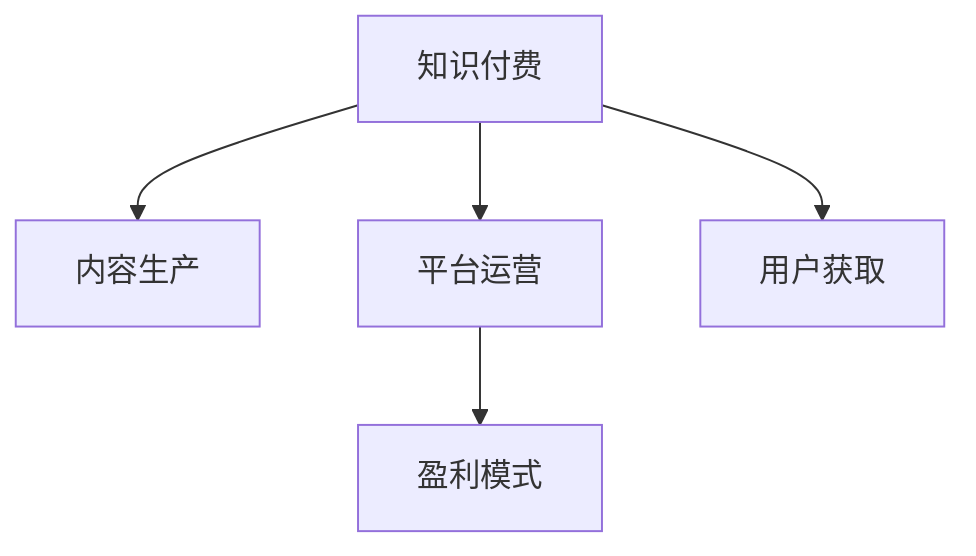

                 

# 知识付费创业中的心理建设

在知识付费的大潮中，创业成了许多人渴望的领域。然而，成功并非一蹴而就，创业路上的心理建设同样至关重要。本文将通过系统地梳理知识付费创业过程中的核心概念、算法原理、操作步骤、实际应用、发展趋势以及面临的挑战，为您揭示如何在技术浪潮中保持正确的方向和心态。

## 1. 背景介绍

### 1.1 问题由来

随着互联网的普及和人们对知识价值的重新认识，知识付费逐渐成为了新常态。在这个过程中，创业成为许多人获取财富和实现自我价值的手段。然而，成功并不是每个创业者的终点，如何在竞争激烈的行业中脱颖而出，保持正确的心理建设，成为每个创业者必须面对的问题。

### 1.2 问题核心关键点

知识付费创业的核心关键点包括以下几个方面：

- **用户需求**：准确把握用户需求，提供高质量、有价值的内容。
- **内容质量**：保证内容的原创性、科学性、实用性，避免低俗、虚假的信息。
- **市场调研**：深入了解市场动态，发掘潜在的用户群体，制定有效的营销策略。
- **心理建设**：保持创业者的信心和决心，面对挑战和挫折时能够调整心态，保持积极向上的心态。
- **技术支持**：借助先进的技术手段，提高运营效率，提升用户体验。

这些关键点构成了知识付费创业的基本框架，创业者应不断关注并深入理解这些关键点，才能在市场中站稳脚跟。

### 1.3 问题研究意义

1. **降低创业风险**：通过正确的心理建设，可以有效地降低创业中的不确定性和风险，帮助创业者保持冷静和客观。
2. **提高成功率**：正确的心理建设能够使创业者在面对市场波动、竞争压力时，做出正确的决策，提高创业成功率。
3. **提升个人素质**：通过心理建设，创业者可以不断提升自身的心理素质和抗压能力，形成更完整的人格。
4. **实现自我价值**：创业者通过创业，不仅能实现经济价值，也能实现自我价值的提升和认同。

## 2. 核心概念与联系

### 2.1 核心概念概述

为了更好地理解知识付费创业，我们需要先了解一些核心概念：

- **知识付费**：指通过付费获取知识和服务的行为。
- **内容生产**：生产高质量、有价值的知识内容，包括文本、音频、视频等。
- **平台运营**：通过技术手段和商业模式，将优质的内容展示给用户，实现商业变现。
- **用户获取**：通过营销手段，吸引和保留用户，建立稳定的用户群体。
- **盈利模式**：基于平台的运营模式，实现稳定的收益，支持平台的持续发展。

这些概念之间的关系可以通过以下Mermaid流程图来展示：



这个流程图展示出知识付费创业的核心流程：首先确定商业模式，然后生产内容，通过运营吸引用户，最后通过盈利模式实现持续发展。

## 3. 核心算法原理 & 具体操作步骤

### 3.1 算法原理概述

知识付费创业的心理建设，本质上是一个持续优化和调整的过程。其核心思想是：通过不断的自我反思和反馈，及时调整心态和策略，确保创业方向与市场需求相匹配。

### 3.2 算法步骤详解

知识付费创业的心理建设，可以分为以下几个关键步骤：

**Step 1: 自我认知与反思**
- **评估自身优势与不足**：客观分析自己的优势和劣势，明确创业方向。
- **识别潜在风险**：预见可能遇到的风险和挑战，制定应对策略。
- **学习他人经验**：研究行业内的成功案例，借鉴他人的经验教训。

**Step 2: 市场调研与定位**
- **深入了解用户需求**：通过问卷调查、用户反馈等方式，了解用户的真实需求。
- **分析竞争格局**：研究行业内的竞争对手，识别自身的优势和劣势。
- **制定目标市场**：根据用户需求和市场调研结果，制定合适的市场定位和目标用户群体。

**Step 3: 制定策略与执行**
- **制定营销策略**：根据市场调研结果，制定有效的营销策略，吸引和保留用户。
- **优化用户体验**：根据用户反馈，不断优化内容和平台体验，提升用户满意度。
- **调整心态与情绪**：面对市场波动和竞争压力，保持积极向上的心态，不断调整和优化策略。

**Step 4: 持续反馈与迭代**
- **收集用户反馈**：通过问卷调查、用户评价等方式，收集用户反馈，了解用户需求和痛点。
- **调整策略与计划**：根据用户反馈，及时调整运营策略和计划，确保与市场需求相匹配。
- **保持心理弹性**：面对挫折和失败，保持心理弹性，快速调整心态，继续前进。

### 3.3 算法优缺点

知识付费创业的心理建设有以下优点：

- **提升决策质量**：通过持续的自我反思和市场调研，创业者可以做出更准确的决策。
- **增强抗压能力**：正确的心理建设能够帮助创业者应对市场波动和竞争压力，保持积极向上的心态。
- **提高用户满意度**：通过不断优化内容和平台体验，提升用户满意度，增强用户粘性。

同时，该方法也存在一些局限性：

- **投入时间与精力**：持续的市场调研和策略调整，需要耗费大量时间和精力。
- **不确定性风险**：市场环境和用户需求的变化，可能导致策略调整的效果无法达到预期。
- **心理波动**：面对市场波动和竞争压力，保持持续的心理建设，需要较强的心理素质和抗压能力。

### 3.4 算法应用领域

知识付费创业的心理建设，在多个领域都有广泛的应用：

- **内容生产**：通过持续的市场调研和用户反馈，确保内容生产的质量和方向。
- **平台运营**：通过不断的优化和调整，提高平台的用户体验和运营效率。
- **营销策略**：通过市场调研和用户需求分析，制定有效的营销策略，吸引和保留用户。
- **盈利模式**：通过不断调整和优化，实现稳定的收益，支持平台的持续发展。

## 4. 数学模型和公式 & 详细讲解 & 举例说明

### 4.1 数学模型构建

为了更好地理解知识付费创业的心理建设，我们将使用数学模型来描述这一过程。假设创业者的心理状态可以用一个时间序列 $y_t$ 来表示，其中 $t$ 表示时间。创业者的心态可以受到多种因素的影响，包括用户反馈、市场变化、竞争对手动态等。我们可以建立一个多元线性回归模型来描述这些因素对创业者心理状态的影响：

$$
y_t = \beta_0 + \beta_1 x_{1,t} + \beta_2 x_{2,t} + \ldots + \beta_n x_{n,t} + \epsilon_t
$$

其中 $x_{i,t}$ 表示第 $i$ 个因素在时间 $t$ 的影响，$\beta_i$ 表示第 $i$ 个因素的权重，$\epsilon_t$ 表示随机误差。

### 4.2 公式推导过程

根据上式，我们可以使用最小二乘法来估计 $\beta_i$ 的值：

$$
\hat{\beta} = (X^TX)^{-1}X^Ty
$$

其中 $X = [x_{1,t}, x_{2,t}, \ldots, x_{n,t}]$，$y = [y_1, y_2, \ldots, y_n]$。

通过最小二乘法，我们可以得到每个因素对创业者心理状态的影响权重，从而调整策略，优化心态。

### 4.3 案例分析与讲解

假设有一个知识付费平台，创业者想要提升用户满意度。他通过问卷调查发现用户对于内容质量和更新频率最为关注。根据这一结果，创业者可以增加内容的深度和频次，同时调整营销策略，重点推广高质量内容。

## 5. 项目实践：代码实例和详细解释说明

### 5.1 开发环境搭建

在进行心理建设项目实践前，我们需要准备好开发环境。以下是使用Python进行数据分析的开发环境配置流程：

1. 安装Anaconda：从官网下载并安装Anaconda，用于创建独立的Python环境。

2. 创建并激活虚拟环境：
```bash
conda create -n pyenv python=3.8 
conda activate pyenv
```

3. 安装相关工具包：
```bash
pip install pandas numpy matplotlib scikit-learn
```

4. 安装Jupyter Notebook：
```bash
conda install jupyter notebook
```

完成上述步骤后，即可在`pyenv`环境中开始心理建设实践。

### 5.2 源代码详细实现

下面我们以用户满意度提升为例，给出使用Python进行数据分析的代码实现。

首先，导入必要的库：

```python
import pandas as pd
import numpy as np
import matplotlib.pyplot as plt
from sklearn.linear_model import LinearRegression

# 读取数据
data = pd.read_csv('user_feedback.csv')
```

然后，进行数据预处理：

```python
# 数据清洗
data.dropna(inplace=True)

# 特征工程
data['content_quality'] = data['content_quality'].map({'好': 1, '一般': 0, '差': -1})
data['update_frequency'] = data['update_frequency'].map({'高频': 1, '中频': 0, '低频': -1})
```

接着，构建回归模型：

```python
# 分割数据集
train_data = data.sample(frac=0.8, random_state=1)
test_data = data.drop(train_data.index)

# 构建模型
X = train_data[['content_quality', 'update_frequency']]
y = train_data['user_satisfaction']
model = LinearRegression()
model.fit(X, y)
```

最后，进行模型评估：

```python
# 预测测试集
y_pred = model.predict(test_data[['content_quality', 'update_frequency']])

# 绘制散点图
plt.scatter(test_data['content_quality'], test_data['user_satisfaction'])
plt.plot(test_data['content_quality'], y_pred, color='red')
plt.xlabel('Content Quality')
plt.ylabel('User Satisfaction')
plt.show()
```

### 5.3 代码解读与分析

让我们再详细解读一下关键代码的实现细节：

**数据预处理**：
- `dropna`方法：去除缺失数据，确保数据质量。
- `map`方法：将文本数据转换为数值型数据，便于模型处理。

**模型训练与评估**：
- `sample`方法：从数据集中随机抽取80%的数据用于训练，20%的数据用于测试。
- `LinearRegression`模型：使用线性回归模型，估计每个特征对用户满意度的影响权重。
- `predict`方法：使用训练好的模型预测测试集的用户满意度。

**可视化**：
- `plt.scatter`方法：绘制用户满意度和内容质量的散点图，直观展示模型效果。
- `plt.plot`方法：在散点图上绘制预测线，帮助理解模型性能。

## 6. 实际应用场景

### 6.1 内容生产优化

知识付费平台可以通过用户反馈和市场调研，了解用户对内容的需求和偏好，调整内容生产策略。例如，平台可以分析用户的观看记录和评价，找出热门话题和内容形式，从而指导内容团队进行优化。

**案例分析**：
- **用户行为分析**：通过分析用户的观看记录和评价，发现用户对短视频类内容的满意度较高。
- **内容调整**：平台调整内容生产策略，增加短视频内容的比重，提升用户满意度。

### 6.2 平台运营优化

知识付费平台的运营优化，可以通过用户反馈和市场调研，不断提升用户体验和平台粘性。例如，平台可以定期收集用户反馈，调整功能模块和界面设计，增强用户粘性。

**案例分析**：
- **用户反馈分析**：平台通过问卷调查和用户评价，发现用户对平台搜索功能的满意度较低。
- **功能优化**：平台调整搜索算法，增加智能推荐功能，提升用户搜索体验。

### 6.3 营销策略调整

知识付费平台的营销策略，可以通过市场调研和用户需求分析，制定有效的营销策略，吸引和保留用户。例如，平台可以分析用户流量来源和行为路径，优化广告投放和推荐策略。

**案例分析**：
- **用户流量分析**：平台通过流量分析工具，发现社交媒体引流效果最好。
- **广告投放调整**：平台增加社交媒体广告投放，提升用户流量和转化率。

## 7. 工具和资源推荐

### 7.1 学习资源推荐

为了帮助创业者系统掌握心理建设理论基础和实践技巧，这里推荐一些优质的学习资源：

1. 《心理学与创业》：一本系统介绍心理学原理在创业中的应用的书，适合创业者自我提升。
2. 《市场营销原理》：一本经典的市场营销教材，帮助创业者了解市场动态，制定有效的营销策略。
3. 《数据科学导论》：一本数据科学入门教材，帮助创业者掌握数据分析和建模技术。
4. 《机器学习实战》：一本实践性的机器学习教材，帮助创业者将理论应用到实际问题中。
5. Coursera《创业心理学》课程：斯坦福大学开设的创业心理学课程，涵盖心理学在创业中的运用。

通过对这些资源的学习实践，相信你一定能够快速掌握心理建设的技术方法，并用于解决实际的创业问题。

### 7.2 开发工具推荐

高效的开发离不开优秀的工具支持。以下是几款用于心理建设开发的常用工具：

1. Jupyter Notebook：一款交互式的Python开发环境，支持动态展示数据分析结果。
2. GitHub：一款代码托管平台，方便版本控制和协作开发。
3. Tableau：一款数据可视化工具，帮助创业者直观展示数据分析结果。
4. Python语言：一款高效的数据分析和建模语言，适合创业者进行数据分析和模型训练。
5. Excel：一款常用的数据处理工具，适合创业者进行简单的数据统计和分析。

合理利用这些工具，可以显著提升心理建设的开发效率，加快创新迭代的步伐。

### 7.3 相关论文推荐

创业心理建设的研究源于学界的持续研究。以下是几篇奠基性的相关论文，推荐阅读：

1. 《创业心理资本：创业过程中的态度、情感与决策》：探讨创业心理资本在创业过程中的作用。
2. 《市场动态对创业者的心理影响》：研究市场动态对创业者心理状态的影响。
3. 《创业失败的心理因素分析》：分析创业失败的心理原因，提出预防措施。
4. 《创业者的心理韧性与企业绩效》：研究创业者的心理韧性对其企业绩效的影响。
5. 《创业者的创新心理特征分析》：探讨创业者的创新心理特征，帮助创业者提升创新能力。

这些论文代表了大语言模型微调技术的发展脉络。通过学习这些前沿成果，可以帮助创业者把握学科前进方向，激发更多的创新灵感。

## 8. 总结：未来发展趋势与挑战

### 8.1 总结

本文对知识付费创业中的心理建设进行了全面系统的介绍。首先阐述了心理建设在知识付费创业中的重要性，明确了心理建设在提升决策质量、增强抗压能力、提高用户满意度等方面的独特价值。其次，从原理到实践，详细讲解了心理建设的数学模型、操作步骤和实际应用。同时，本文还广泛探讨了心理建设在内容生产、平台运营和营销策略调整等方面的应用前景，展示了心理建设的巨大潜力。

通过本文的系统梳理，可以看到，心理建设在知识付费创业中起着至关重要的作用。正确的心理建设能够帮助创业者保持信心和决心，应对市场波动和竞争压力，实现创业目标。

### 8.2 未来发展趋势

展望未来，知识付费创业的心理建设将呈现以下几个发展趋势：

1. **数据驱动**：利用大数据和人工智能技术，对用户行为和市场动态进行深入分析，制定科学的决策方案。
2. **用户为中心**：将用户需求和体验作为心理建设的中心，不断优化产品和服务，提升用户满意度。
3. **多渠道协同**：结合多种渠道和工具，如社交媒体、电子邮件、在线社区等，全方位提升用户互动和参与度。
4. **心理韧性提升**：通过心理建设，提升创业者的心理韧性，帮助其在面对挫折和挑战时保持积极向上的心态。
5. **跨领域融合**：将心理建设与其他领域的研究，如营销学、管理学等相结合，形成更加全面的心理建设体系。

这些趋势凸显了知识付费创业心理建设的广阔前景。这些方向的探索发展，必将进一步提升创业者的心理素质和运营效率，助力创业成功。

### 8.3 面临的挑战

尽管知识付费创业的心理建设已经取得了一定的成果，但在迈向更加智能化、普适化应用的过程中，它仍面临着诸多挑战：

1. **数据获取难度**：获取高质量的用户反馈和市场数据，需要投入大量的时间和资源。
2. **数据隐私问题**：在收集和分析用户数据时，需要严格遵守隐私保护法规，防止数据泄露。
3. **市场竞争激烈**：知识付费市场竞争激烈，如何制定有效的市场策略，保持竞争力，是创业者面临的重要挑战。
4. **心理波动**：创业过程中难免会遇到各种不确定性和挫折，如何保持心理稳定和积极向上的心态，需要不断学习和调整。
5. **技术更新快**：心理建设需要及时跟进技术发展，采用最新的人工智能和大数据技术，提升运营效率。

正视心理建设面临的这些挑战，积极应对并寻求突破，将是大语言模型微调走向成熟的必由之路。相信随着学界和产业界的共同努力，这些挑战终将一一被克服，知识付费创业必将在构建人机协同的智能时代中扮演越来越重要的角色。

### 8.4 研究展望

面向未来，知识付费创业的心理建设需要在以下几个方面寻求新的突破：

1. **数据获取自动化**：利用自然语言处理和机器学习技术，自动化获取用户反馈和市场数据，降低人工成本。
2. **心理韧性模型**：建立基于大数据的心理韧性模型，帮助创业者进行自我评估和调整。
3. **跨领域融合**：将心理建设与其他领域的研究，如心理学、管理学等相结合，形成更加全面的心理建设体系。
4. **实时反馈系统**：构建实时反馈系统，及时收集用户反馈和市场动态，帮助创业者快速调整策略。
5. **心理建设工具化**：开发心理建设工具，帮助创业者进行科学的心理评估和调整，提升运营效率。

这些研究方向的探索，必将引领知识付费创业心理建设技术迈向更高的台阶，为创业者提供更全面、更高效的心理支持。

## 9. 附录：常见问题与解答

**Q1：如何进行用户心理分析？**

A: 用户心理分析可以通过问卷调查、用户评价、行为数据分析等多种方式进行。例如，通过问卷调查了解用户的心理状态和需求，通过用户评价分析用户的满意度，通过行为数据分析识别用户的痛点和偏好。

**Q2：如何平衡用户需求和公司利益？**

A: 平衡用户需求和公司利益，需要建立用户至上的运营理念。首先，进行深入的市场调研，了解用户真实需求，制定符合用户期望的产品和服务。其次，通过数据分析，找出用户需求和公司利益的平衡点，制定合理的商业模式和盈利策略。最后，定期收集用户反馈，及时调整策略，确保用户满意度和公司利益的平衡。

**Q3：如何应对市场波动和竞争压力？**

A: 应对市场波动和竞争压力，需要保持心理弹性和灵活应变能力。首先，进行持续的市场调研，了解市场动态和竞争格局。其次，制定多种应对策略，如灵活调整营销策略、优化产品和服务等。最后，保持积极向上的心态，不断学习和调整，确保在市场变化中保持竞争力。

**Q4：如何进行心理建设的持续改进？**

A: 心理建设的持续改进需要建立科学的评估机制。首先，通过定期的心理评估，了解创业者的心理状态和问题。其次，根据评估结果，制定科学的改进方案，如调整心态、优化策略等。最后，通过持续的反馈和迭代，不断优化心理建设方案，提升心理素质和运营效率。

通过上述系统的梳理和解答，相信你对知识付费创业中的心理建设有了更加深入的理解和把握。只有保持正确的心理建设，才能在竞争激烈的行业中脱颖而出，实现创业成功。

---

作者：禅与计算机程序设计艺术 / Zen and the Art of Computer Programming

