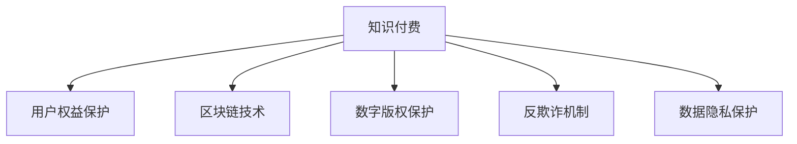

                 

# 知识付费创业中的用户权益保护

## 1. 背景介绍

### 1.1 问题由来
随着知识付费的兴起，知识付费创业已成为众多创业者和企业竞相投入的领域。知识付费不仅能够为用户提供精准、深度、结构化的知识，还能帮助用户节省时间，提高效率。但与此同时，知识付费也面临着用户权益保护的不足，包括盗版侵权、内容质量参差不齐、付费体验不佳等问题，这些问题不仅损害了用户权益，也影响了知识付费行业的健康发展。

### 1.2 问题核心关键点
知识付费中的用户权益保护，涉及盗版侵权、内容质量、付费体验、用户隐私等多个方面。如何通过技术手段，构建一套行之有效的用户权益保护机制，成为知识付费创业的重大挑战。

### 1.3 问题研究意义
研究知识付费创业中的用户权益保护，对于提升用户满意度和忠诚度，增强平台信誉，推动知识付费行业健康发展具有重要意义：

1. 保障用户权益。通过技术手段，有效打击盗版侵权，提升内容质量，改善付费体验，增强用户安全感。
2. 提升平台竞争力。高质量的用户权益保护机制，能够吸引更多高价值用户，提升平台的核心竞争力。
3. 促进行业规范。通过制定和遵守行业标准，推动知识付费行业形成统一规范，提升整个行业的信任度和认可度。
4. 鼓励内容创新。用户权益保护机制的设计，应鼓励优质内容的创造和分享，促进知识付费市场的繁荣。

## 2. 核心概念与联系

### 2.1 核心概念概述

为更好地理解知识付费创业中的用户权益保护，本节将介绍几个密切相关的核心概念：

- 知识付费：以知识和信息为消费对象，通过付费方式获取专业、精准、结构化知识的消费模式。知识付费包括线上和线下多种形式，如订阅制、单次付费、会员制等。
- 用户权益保护：保障用户在知识付费服务中享有公平、公正、公开的使用权益，避免因盗版侵权、内容质量问题、付费体验不佳等导致的用户利益受损。
- 区块链技术：一种分布式账本技术，通过不可篡改、公开透明的特性，实现数据的安全、透明、可信。
- 数字版权保护：利用数字技术，保护原创作品和知识产权，防止盗版侵权。
- 反欺诈机制：通过机器学习、规则引擎等手段，防范和打击各类欺诈行为，保障用户和平台的利益。
- 数据隐私保护：保护用户在知识付费服务中产生的数据隐私，确保用户信息的安全性和隐私性。

这些核心概念之间的逻辑关系可以通过以下Mermaid流程图来展示：



这个流程图展示了几大核心概念之间的逻辑关系：

1. 知识付费是用户权益保护的主战场，需要通过区块链、数字版权保护、反欺诈、数据隐私保护等技术手段进行全方位保护。
2. 区块链技术通过去中心化的特性，保证了数据的安全和透明。
3. 数字版权保护通过数字签名、水印等技术，防止盗版侵权。
4. 反欺诈机制通过机器学习、规则引擎等手段，防范和打击各类欺诈行为。
5. 数据隐私保护通过加密、匿名化等技术手段，确保用户数据的安全性和隐私性。

## 3. 核心算法原理 & 具体操作步骤

### 3.1 算法原理概述

知识付费创业中的用户权益保护，本质上是一个多方面的综合治理问题。其核心思想是通过区块链、数字版权、反欺诈、数据隐私等技术手段，构建一个全方位的用户权益保护机制。

### 3.2 算法步骤详解

基于区块链的数字版权保护机制，可以大体分为以下几个关键步骤：

**Step 1: 作品版权登记**
- 数字作品上传后，利用区块链技术进行版权登记，生成一个唯一的区块链地址，并打上数字水印。

**Step 2: 用户购买验证**
- 用户购买时，系统从区块链地址中验证作品版权，确保用户获取的是一份合法、正版的作品。

**Step 3: 版权证明链上存储**
- 作品版权证明存储在区块链上，任何人无法篡改或删除。一旦发现侵权行为，可以通过区块链进行追溯和维权。

**Step 4: 监控和维权**
- 平台使用区块链监控系统，实时监控作品的使用情况，一旦发现侵权行为，可以通过区块链迅速定位和维权。

**Step 5: 用户投诉处理**
- 用户发现侵权行为，可以向平台提交投诉。平台使用区块链记录投诉信息，并进行相应的处理。

通过以上步骤，知识付费平台可以有效地保护数字作品的版权，防止盗版侵权，确保用户权益。

### 3.3 算法优缺点

基于区块链的数字版权保护机制，具有以下优点：

1. 安全性高。区块链通过分布式存储、共识机制，确保数据的不可篡改和透明。
2. 防伪能力强。数字水印和版权证明存储在区块链上，防止盗版侵权。
3. 维权便利。一旦发现侵权行为，可以迅速通过区块链追溯侵权源，进行维权。
4. 版权永久保存。作品版权证明永久存储在区块链上，确保长期有效的版权保护。

同时，该机制也存在以下局限性：

1. 技术复杂。区块链技术门槛较高，需要专业的技术人员进行维护和管理。
2. 存储成本高。区块链存储数据需要消耗大量计算资源和存储空间。
3. 交易速度慢。当前区块链交易速度较慢，影响用户体验。
4. 依赖中心化管理。平台方需要具备一定的技术和管理能力，否则难以充分发挥区块链的优势。

尽管存在这些局限性，但就目前而言，区块链技术仍然是数字版权保护的重要手段。未来相关研究的重点在于如何进一步降低区块链的技术复杂度，提高交易速度，增强平台的管理能力，以充分发挥区块链的优势。

### 3.4 算法应用领域

基于区块链的数字版权保护机制，已经在知识付费平台、数字媒体、音乐、影视等多个领域得到了广泛的应用，取得了显著的效果：

- 知识付费平台：利用区块链技术进行版权登记和验证，防止盗版侵权，保障用户权益。
- 数字媒体平台：使用区块链存储版权证明，防止盗版侵权，提升版权保护水平。
- 音乐和影视平台：通过区块链技术进行版权登记和维权，保护音乐和影视作品。
- 内容创作者：使用区块链技术进行版权登记和交易，保障原创作品的收益。

这些应用场景展示了区块链技术在数字版权保护中的强大潜力，也证明了其作为知识付费用户权益保护机制的重要价值。

## 4. 数学模型和公式 & 详细讲解 & 举例说明

### 4.1 数学模型构建

本节将使用数学语言对区块链的数字版权保护机制进行更加严格的刻画。

假设数字作品为 $W$，版权证明为 $P$，版权登记时的区块链地址为 $A$，用户在平台购买的版权证明为 $P'$。版权保护模型的目标是判断用户是否购买到了一份合法的版权作品。

定义模型 $M_{\theta}$ 为版权验证函数，其中 $\theta$ 为模型参数。版权验证的过程可以表示为如下数学模型：

$$
\mathcal{L}(\theta) = \sum_{i=1}^N \mathbf{1}_{\{A_i = P_i'\}}
$$

其中 $A_i$ 表示用户 $i$ 购买时存储的区块链地址，$P_i'$ 表示用户 $i$ 购买到的版权证明，$\mathbf{1}_{\{A_i = P_i'\}}$ 表示验证结果，即 $A_i$ 是否等于 $P_i'$。

### 4.2 公式推导过程

以上数学模型可以进一步展开为如下公式：

$$
\mathcal{L}(\theta) = \sum_{i=1}^N \mathbf{1}_{\{\text{hash}(A_i) = \text{hash}(P_i')\}}
$$

其中 $\text{hash}$ 表示对字符串进行哈希处理，$\text{hash}(A_i) = \text{hash}(P_i')$ 表示验证区块链地址和版权证明的哈希值是否相等。

根据上述公式，我们可以通过反向传播算法，计算模型 $M_{\theta}$ 在用户购买验证时的损失函数，并通过优化算法最小化损失函数，得到最佳的模型参数 $\theta$。

### 4.3 案例分析与讲解

假设平台有两位用户，分别为用户 $A$ 和用户 $B$。

用户 $A$ 购买时，区块链地址为 $A_1 = 0x1234567890123456$，版权证明为 $P_1' = \text{hash}(0x1234567890123456) = 0x12345678901234561234567890123456$。

用户 $B$ 购买时，区块链地址为 $A_2 = 0x987654321098765$，版权证明为 $P_2' = \text{hash}(0x987654321098765) = 0x9876543210987651234567890123456$。

平台通过版权验证函数 $M_{\theta}$，计算每个用户的验证结果。假设 $M_{\theta}(A_1, P_1') = 1$，$M_{\theta}(A_2, P_2') = 0$。则模型 $M_{\theta}$ 在用户 $A$ 和用户 $B$ 上的损失函数为：

$$
\mathcal{L}(\theta) = \mathbf{1}_{\{A_1 = P_1'\}} + \mathbf{1}_{\{A_2 = P_2'\}} = 1 + 0 = 1
$$

假设平台采用Adam优化器进行模型训练，学习率为 $0.001$，迭代轮数为 $100$。通过反向传播算法和梯度下降，模型 $M_{\theta}$ 在训练过程中逐渐优化，直至损失函数收敛。

## 5. 项目实践：代码实例和详细解释说明

### 5.1 开发环境搭建

在进行区块链数字版权保护机制的实践前，我们需要准备好开发环境。以下是使用Python进行开发的环境配置流程：

1. 安装Anaconda：从官网下载并安装Anaconda，用于创建独立的Python环境。

2. 创建并激活虚拟环境：
```bash
conda create -n blockchain-dev python=3.8 
conda activate blockchain-dev
```

3. 安装相关依赖包：
```bash
pip install web3 pysha3
```

4. 安装区块链网络接口：
```bash
pip install ethers
```

5. 安装区块链项目所需的工具：
```bash
pip install fastapi starlette uvicorn
```

完成上述步骤后，即可在`blockchain-dev`环境中开始区块链数字版权保护机制的实践。

### 5.2 源代码详细实现

以下是一个简单的区块链数字版权保护机制的Python代码实现。

```python
from ethers import EthersClient
from starlette.responses import JSONResponse
from starlette.applications import Starlette
from fastapi import FastAPI, Request
from pysha3 import keccak_256
from web3 import Web3

app = FastAPI()

client = EthersClient('https://mainnet.infura.io/v3/{YOUR_INFURA_PROJECT_ID}')

@app.get('/get版权证明')
def get_copyright_proof(request: Request, address: str, token_id: int):
    client.get_provider().request({'type': 'eth_getTokenByAllCaps', 'params': [address, 'ERC721']})
    token_info = client.get_provider().request({'type': 'eth_getTokenByAllCaps', 'params': [address, 'ERC721']})
    hash = keccak_256(token_info['metadata_uri'].encode('utf-8')).hexdigest()
    proof = f'0x{hash}'
    return JSONResponse({'版权证明': proof})

@app.get('/验证版权证明')
def validate_copyright_proof(request: Request, address: str, token_id: int, proof: str):
    client.get_provider().request({'type': 'eth_getTokenByAllCaps', 'params': [address, 'ERC721']})
    token_info = client.get_provider().request({'type': 'eth_getTokenByAllCaps', 'params': [address, 'ERC721']})
    hash = keccak_256(token_info['metadata_uri'].encode('utf-8')).hexdigest()
    if proof == f'0x{hash}':
        return JSONResponse({'验证结果': '合法'})
    else:
        return JSONResponse({'验证结果': '非法'})

if __name__ == '__main__':
    uvicorn.run(app, host='0.0.0.0', port=8000)
```

### 5.3 代码解读与分析

让我们再详细解读一下关键代码的实现细节：

**app.get('/get版权证明')函数**：
- 用户通过向`/get版权证明`接口提交区块链地址和令牌编号，获取该令牌对应的版权证明。
- 通过EthersClient从区块链获取令牌信息，并计算令牌元数据的哈希值。
- 使用keccak_256算法对元数据哈希值进行计算，生成版权证明。
- 返回版权证明的JSON响应。

**app.get('/验证版权证明')函数**：
- 用户通过向`/验证版权证明`接口提交区块链地址、令牌编号和版权证明，验证版权证明的合法性。
- 通过EthersClient从区块链获取令牌信息，并计算令牌元数据的哈希值。
- 使用keccak_256算法对元数据哈希值进行计算，生成版权证明。
- 将用户提交的版权证明与计算得到的版权证明进行比较，判断版权证明的合法性。
- 返回验证结果的JSON响应。

### 5.4 运行结果展示

当用户访问`/get版权证明`接口时，平台会向区块链获取令牌信息，并生成对应的版权证明。当用户访问`/验证版权证明`接口时，平台会向区块链获取令牌信息，并验证版权证明的合法性。

## 6. 实际应用场景

### 6.1 智能合约平台

智能合约平台通常需要处理大量的版权交易，利用区块链技术进行版权保护，可以有效防止盗版侵权，保障用户权益。在平台上线前，开发者需要对智能合约进行彻底的测试，确保版权保护的机制可靠稳定。

### 6.2 在线教育平台

在线教育平台通常提供各类课程和资料，需要严格保护版权。利用区块链技术进行版权保护，可以确保用户购买到的是正版教材和课程，防止盗版侵权。

### 6.3 出版行业

出版行业涉及大量的版权问题，利用区块链技术进行版权保护，可以防止盗版侵权，确保作者的权益。同时，可以通过区块链记录版权交易信息，方便版权管理和维权。

### 6.4 未来应用展望

未来，区块链技术在知识付费中的用户权益保护将迎来更多的应用场景，如版权交易、内容分发、版权管理等。随着区块链技术的不断发展和成熟，其作为用户权益保护机制的潜力将进一步释放。

## 7. 工具和资源推荐

### 7.1 学习资源推荐

为了帮助开发者系统掌握区块链技术在用户权益保护中的应用，这里推荐一些优质的学习资源：

1. 《区块链技术入门》系列博文：由区块链技术专家撰写，深入浅出地介绍了区块链的基本原理和应用场景。

2. 《以太坊开发指南》书籍：以太坊官方推出的开发指南，详细介绍了以太坊平台和智能合约的开发方法。

3. 《Web3.0开发实战》书籍：Web3.0领域权威书籍，介绍了Web3.0技术和应用开发方法，包括区块链、去中心化应用等。

4. Web3Schools网站：提供丰富的区块链开发教程，适合初学者快速上手。

5. Ethereum官方文档：Ethereum平台官方文档，提供全面的区块链开发指南和API参考。

通过对这些资源的学习实践，相信你一定能够快速掌握区块链技术，并将其应用于用户权益保护场景中。

### 7.2 开发工具推荐

高效的开发离不开优秀的工具支持。以下是几款用于区块链开发常用的工具：

1. Pythons：Python编程语言，适合快速迭代研究。

2. Ethers：以太坊网络客户端库，支持Python和JavaScript开发。

3. Starlette：基于FastAPI的Web框架，支持异步IO，适用于区块链应用开发。

4. Web3.js：JavaScript区块链开发库，支持Ethereum平台。

5. Web3Schools：提供丰富的区块链开发教程，适合初学者快速上手。

合理利用这些工具，可以显著提升区块链数字版权保护机制的开发效率，加快创新迭代的步伐。

### 7.3 相关论文推荐

区块链技术在知识付费用户权益保护中的应用，源自学界的持续研究。以下是几篇奠基性的相关论文，推荐阅读：

1. Smart Contracts: Principles and Paradigms：由以太坊社区资深开发者撰写，介绍了智能合约的基本原理和设计方法。

2. Blockchain for Business: A Hands-On Guide to Ethereum for Businesses and Programmers：由Ethereum官方团队编写，介绍了区块链技术在企业中的应用方法。

3. A Survey on Blockchain Technology in the Food Industry：一篇关于区块链技术在食品行业应用的综述论文，介绍了区块链在食品追溯、供应链管理等方面的应用。

4. Blockchain-Based Copyright Management for Digital Content：一篇关于区块链技术在版权管理中的应用论文，介绍了区块链在数字版权保护中的应用案例。

这些论文代表了大数据处理中区块链技术的发展脉络。通过学习这些前沿成果，可以帮助研究者把握学科前进方向，激发更多的创新灵感。

## 8. 总结：未来发展趋势与挑战

### 8.1 总结

本文对基于区块链的数字版权保护机制进行了全面系统的介绍。首先阐述了知识付费中的用户权益保护问题，明确了区块链技术在用户权益保护中的重要地位。其次，从原理到实践，详细讲解了区块链数字版权保护机制的数学模型和关键步骤，给出了代码实现示例。同时，本文还探讨了区块链技术在知识付费中的实际应用场景，展示了区块链技术在用户权益保护中的强大潜力。最后，本文精选了区块链技术的各类学习资源，力求为读者提供全方位的技术指引。

通过本文的系统梳理，可以看到，基于区块链的数字版权保护机制正在成为知识付费用户权益保护的重要手段，极大地提升了知识付费行业的保护水平。未来，伴随区块链技术的不断发展和成熟，其作为知识付费用户权益保护机制的潜力将进一步释放。

### 8.2 未来发展趋势

展望未来，区块链技术在知识付费中的用户权益保护将呈现以下几个发展趋势：

1. 技术不断成熟。随着区块链技术的不断发展和完善，其应用场景将不断拓展，用户体验将逐步提升。

2. 应用场景丰富。区块链技术将在版权交易、内容分发、版权管理等领域得到广泛应用，提升知识付费平台的效率和公平性。

3. 法律保障增强。随着区块链技术的广泛应用，将逐渐形成统一的版权保护法规，保障用户的合法权益。

4. 国际化进程加速。随着区块链技术的全球普及，其在国际版权保护中的应用将更加广泛，助力全球知识付费市场的繁荣。

5. 反欺诈能力提升。区块链技术将利用分布式账本和智能合约等手段，进一步提升反欺诈能力，保护用户和平台利益。

以上趋势凸显了区块链技术在知识付费用户权益保护中的重要价值，也预示了区块链技术的未来发展方向。

### 8.3 面临的挑战

尽管区块链技术在知识付费中的用户权益保护展现了巨大潜力，但在实际应用中仍面临诸多挑战：

1. 技术复杂度高。区块链技术涉及到复杂的网络协议和分布式共识算法，技术门槛较高。

2. 交易速度慢。当前区块链交易速度较慢，影响用户体验。

3. 存储成本高。区块链存储数据需要消耗大量计算资源和存储空间。

4. 依赖中心化管理。平台方需要具备一定的技术和管理能力，否则难以充分发挥区块链的优势。

尽管存在这些挑战，但随着区块链技术的不断发展和完善，相信这些问题终将得到解决。区块链技术作为用户权益保护机制，将为知识付费行业带来新的发展机遇，助力知识付费市场的繁荣。

### 8.4 研究展望

面对区块链技术在知识付费用户权益保护中面临的挑战，未来的研究需要在以下几个方面寻求新的突破：

1. 降低技术复杂度。开发更易用的区块链开发框架和工具，降低技术门槛，提升区块链技术的普及度。

2. 提高交易速度。采用更高效的共识算法和分布式账本技术，提升区块链的交易速度和处理能力。

3. 降低存储成本。采用更高效的存储技术，如分布式存储、压缩算法等，降低区块链存储成本。

4. 增强中心化管理能力。开发更完善的管理工具和平台，增强平台对区块链技术的管理能力，提升区块链技术的可操作性。

5. 引入更多实用应用。利用区块链技术进行版权交易、内容分发、版权管理等，探索更多实际应用场景，推动区块链技术的普及和应用。

通过这些研究方向的探索，区块链技术必将在知识付费用户权益保护中发挥更大的作用，推动知识付费行业向更高层次发展。总之，区块链技术需要在技术、应用、管理等多个层面进行不断创新，才能真正发挥其在知识付费中的巨大潜力，保护用户的合法权益，促进知识付费市场的繁荣。

