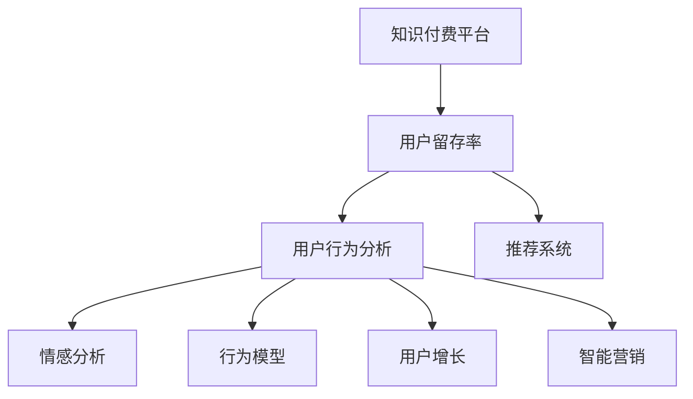

                 

# 知识付费创业中的用户留存策略

> 关键词：知识付费, 用户留存, 用户行为分析, 推荐系统, 情感分析, 行为模型, 用户增长, 智能营销

## 1. 背景介绍

随着互联网技术的飞速发展，知识付费逐渐成为知识传播的新模式。用户不再仅仅依赖免费资源，而是愿意为优质内容付费，通过购买订阅、课程等方式，获取专业、系统化的知识体系。然而，面对激烈的市场竞争和不断增长的用户需求，知识付费平台如何提升用户留存率，增加用户粘性，保持长期盈利，成为了一个亟待解决的难题。

### 1.1 知识付费市场现状

知识付费市场目前正处于高速增长阶段，各类平台如雨后春笋般涌现。然而，市场集中度较低，头部平台的份额占比也远未达到垄断地位。主要平台包括“得到”、“喜马拉雅”、“知乎live”等。

**市场规模**：据统计，2020年全球知识付费市场规模约为120亿美元，预计未来三年将保持20%的年均增速。在中国，2020年知识付费市场规模达86亿元，预计2025年将达到307亿元，用户规模达3.55亿人。

**市场驱动因素**：
1. 移动互联网普及。智能手机和平板电脑的普及，使得用户随时随地可以获取音频、视频、文章等知识内容。
2. 知识需求增加。社会对专业技能、思维方式、生活技巧等方面的需求不断上升，推动知识付费内容的发展。
3. 付费习惯养成。随着用户对付费内容接受度的提高，越来越多的用户愿意为高质量内容付费。

### 1.2 用户留存的重要性

用户留存是知识付费平台的核心指标之一。较高的用户留存率不仅能提升平台的用户基数，还能带来更高的活跃度和收益。低留存率则会导致用户流失，损害平台的用户基础，影响长期收益。

高用户留存率的益处包括：
1. **收入稳定**：高留存率意味着较高的订阅用户数和频次，稳定平台的收入来源。
2. **用户粘性**：高粘性用户会主动进行内容分享和推荐，帮助平台增加新用户。
3. **品牌价值**：高留存率的用户对平台的信任度和满意度更高，有利于提升平台品牌价值。

然而，如何提高用户留存率，实现长期发展，是知识付费创业中面临的重要挑战。

## 2. 核心概念与联系

### 2.1 核心概念概述

为更好地理解用户留存策略，本节将介绍几个关键概念及其相互关系：

- **知识付费平台**：通过订阅、课程等形式提供专业、系统化知识的平台。平台内容通常包括音频、视频、文章等。
- **用户留存率**：在一定时间周期内，返回继续使用平台的活跃用户占比。
- **用户行为分析**：通过数据挖掘和统计分析，理解用户的访问、互动、消费等行为特征。
- **推荐系统**：通过分析用户行为和偏好，为用户推荐个性化内容，提升用户体验和留存率。
- **情感分析**：对用户评论、反馈等文本信息进行情感倾向分析，及时发现和解决问题。
- **行为模型**：基于用户行为数据建立用户画像和预测模型，提升用户留存。
- **用户增长**：通过精准定位、转化和运营，持续提升用户基数和质量。
- **智能营销**：利用大数据和机器学习技术，进行用户精准营销，提升用户留存。

这些概念之间的联系可以通过以下Mermaid流程图来展示：



这个流程图展示了一系列关键概念及其相互联系：

1. 知识付费平台通过分析用户行为数据，构建个性化推荐系统和用户画像，提升用户留存率。
2. 用户行为分析不仅包括用户的访问、互动、消费等行为，还需对用户的情感倾向进行分析。
3. 情感分析、行为模型、智能营销等技术手段，都依赖于用户行为数据的收集和分析。
4. 通过构建用户增长模型，平台可以精准定位用户，提升转化率。

## 3. 核心算法原理 & 具体操作步骤

### 3.1 算法原理概述

用户留存策略的核心在于精准分析用户行为，发现用户的偏好和痛点，从而提供有针对性的服务和推荐，提升用户粘性和满意度。常用的方法包括：

- **用户行为分析**：通过统计分析用户的行为数据，挖掘用户的使用习惯、兴趣偏好等信息。
- **推荐系统**：基于用户行为和偏好，推荐个性化内容，提高用户满意度。
- **情感分析**：对用户评论、反馈等文本信息进行情感倾向分析，发现用户满意度，及时解决问题。
- **行为模型**：建立基于用户行为数据的预测模型，预测用户流失风险，提前进行干预。

这些方法相互配合，共同构成了一套完整的用户留存策略。

### 3.2 算法步骤详解

#### 3.2.1 用户行为分析

用户行为分析主要包括以下几个步骤：

1. **数据收集**：收集用户在平台上的所有行为数据，包括访问时间、点击内容、购买记录、评分反馈等。
2. **数据清洗**：对数据进行去重、去噪、异常值处理等，保证数据的准确性和一致性。
3. **特征工程**：提取和构造用户行为特征，如访问频率、点击深度、消费频率等。
4. **模型训练**：使用机器学习算法，如逻辑回归、决策树、随机森林等，对用户行为进行建模和预测。

#### 3.2.2 推荐系统

推荐系统主要包括以下几个步骤：

1. **特征提取**：提取用户行为数据中的特征，如历史行为、兴趣爱好等。
2. **模型训练**：使用协同过滤、矩阵分解等算法，建立推荐模型。
3. **个性化推荐**：根据用户画像和行为特征，实时推荐个性化内容。
4. **效果评估**：对推荐效果进行评估，如点击率、转化率等，不断优化模型。

#### 3.2.3 情感分析

情感分析主要包括以下几个步骤：

1. **文本预处理**：对用户评论、反馈等文本信息进行分词、去停用词等处理。
2. **情感分类**：使用情感分类算法，如朴素贝叶斯、SVM等，对文本情感进行分类。
3. **情感分析**：根据情感分类结果，分析用户对平台的满意度，及时发现和解决问题。

#### 3.2.4 行为模型

行为模型主要包括以下几个步骤：

1. **特征选择**：选择与用户留存相关的行为特征，如访问频率、消费频率等。
2. **模型训练**：使用机器学习算法，如决策树、随机森林等，建立用户留存模型。
3. **预测与干预**：根据预测结果，提前进行干预，如个性化推荐、优惠活动等，降低用户流失率。

### 3.3 算法优缺点

用户留存策略中的算法具有以下优点：
1. **个性化推荐**：通过分析用户行为和偏好，提供个性化内容，提高用户满意度。
2. **实时分析**：实时监测用户行为和反馈，及时发现和解决问题。
3. **成本效益高**：通过精准推荐和个性化服务，提升用户粘性和留存率，减少运营成本。

同时，这些算法也存在一些缺点：
1. **数据隐私**：对用户行为数据的收集和分析，可能会侵犯用户隐私。
2. **模型复杂**：建立和训练推荐系统、行为模型等需要较高的技术门槛。
3. **数据质量要求高**：数据收集和处理的质量直接影响模型效果，需要严格的数据管理和清洗。

### 3.4 算法应用领域

用户留存策略不仅适用于知识付费平台，还广泛应用于电商、社交、旅游等多个领域。以下是几个典型应用场景：

- **电商领域**：通过分析用户行为，推荐个性化商品，提升购买转化率和用户满意度。
- **社交平台**：分析用户互动和内容消费行为，推荐优质内容，提升用户活跃度和粘性。
- **旅游平台**：根据用户偏好和历史行为，推荐个性化旅游路线和活动，提升用户体验和留存率。

这些场景都涉及用户行为分析、推荐系统、情感分析等技术手段，为用户提供精准的服务，实现用户留存和增长。

## 4. 数学模型和公式 & 详细讲解 & 举例说明

### 4.1 数学模型构建

用户留存策略中的数学模型主要包括以下几个方面：

1. **用户行为模型**：通过统计分析用户行为数据，建立用户画像和行为特征。
2. **推荐模型**：使用协同过滤、矩阵分解等算法，建立推荐系统。
3. **情感分析模型**：使用情感分类算法，对用户评论进行情感分类。
4. **预测模型**：建立基于用户行为数据的预测模型，预测用户流失风险。

### 4.2 公式推导过程

#### 4.2.1 用户行为模型

用户行为模型主要通过统计分析用户行为数据，提取行为特征，如访问频率、消费频率等。其数学表达式如下：

$$
\mathcal{F}_u = (f_{a_u}, f_{c_u}, f_{p_u}, \dots)
$$

其中，$\mathcal{F}_u$ 表示用户 $u$ 的行为特征，$f_{a_u}$ 表示访问频率，$f_{c_u}$ 表示消费频率，$f_{p_u}$ 表示推荐内容互动频率等。

#### 4.2.2 推荐模型

推荐模型主要通过协同过滤和矩阵分解等算法，建立推荐系统。常用的推荐模型包括协同过滤模型、矩阵分解模型、深度学习推荐模型等。以协同过滤模型为例，其基本公式如下：

$$
r_{ui} = \frac{1}{1+\sum_{j \neq i} r_{uj}^2}
$$

其中，$r_{ui}$ 表示用户 $u$ 对物品 $i$ 的推荐评分，$r_{uj}$ 表示用户 $u$ 对物品 $j$ 的实际评分，$i \in I, j \in I, u \in U$。

#### 4.2.3 情感分析模型

情感分析模型主要通过情感分类算法，对用户评论进行情感分类。常用的情感分类算法包括朴素贝叶斯、SVM等。以朴素贝叶斯算法为例，其基本公式如下：

$$
P(w|s) = \frac{P(w)}{P(s)}
$$

其中，$w$ 表示评论文本，$s$ 表示情感分类标签，$P(w)$ 表示评论文本的先验概率，$P(s)$ 表示情感分类的先验概率。

#### 4.2.4 预测模型

预测模型主要通过机器学习算法，建立用户留存模型。常用的机器学习算法包括逻辑回归、决策树、随机森林等。以逻辑回归模型为例，其基本公式如下：

$$
P(y|x) = \frac{1}{1+e^{-\beta_0+\beta_1x_1+\beta_2x_2+\dots+\beta_nx_n}}
$$

其中，$y$ 表示用户留存标签，$x$ 表示用户行为特征，$\beta_0, \beta_1, \beta_2, \dots, \beta_n$ 表示模型参数。

### 4.3 案例分析与讲解

#### 4.3.1 电商领域的应用

电商平台上，通过用户行为数据分析，发现用户对某些商品类别有较高的购买频率，可以针对这些用户进行个性化推荐，提升购买转化率和用户满意度。例如，用户对运动鞋类商品购买频率较高，可以推荐其他运动鞋类商品，或运动相关配件。

#### 4.3.2 社交平台的应用

社交平台上，通过分析用户互动和内容消费行为，推荐优质内容，提升用户活跃度和粘性。例如，用户对某类内容互动频率较高，可以推荐更多相关内容，或邀请更多用户参与互动。

#### 4.3.3 旅游平台的应用

旅游平台上，根据用户偏好和历史行为，推荐个性化旅游路线和活动，提升用户体验和留存率。例如，用户对某地区旅游评价较高，可以推荐更多该地区的旅游路线和活动，或根据用户的兴趣爱好推荐相关旅游产品。

## 5. 项目实践：代码实例和详细解释说明

### 5.1 开发环境搭建

在进行用户留存策略的实践前，我们需要准备好开发环境。以下是使用Python进行机器学习开发的环境配置流程：

1. 安装Anaconda：从官网下载并安装Anaconda，用于创建独立的Python环境。

2. 创建并激活虚拟环境：
```bash
conda create -n ml-env python=3.8 
conda activate ml-env
```

3. 安装依赖库：
```bash
conda install pandas numpy scikit-learn matplotlib jupyter notebook
```

4. 安装PyTorch和TensorFlow等深度学习库：
```bash
pip install torch torchvision torchaudio tensorflow
```

5. 安装深度学习框架的依赖：
```bash
pip install numpy scikit-learn matplotlib jupyter notebook
```

完成上述步骤后，即可在`ml-env`环境中开始项目开发。

### 5.2 源代码详细实现

这里我们以电商领域的推荐系统为例，给出使用Python和TensorFlow实现个性化推荐代码的实现。

```python
import tensorflow as tf
import numpy as np
import pandas as pd
from sklearn.model_selection import train_test_split

# 数据读取和预处理
df = pd.read_csv('data/user_behavior.csv')

# 特征选择
features = ['visit_frequency', 'purchase_frequency', 'interaction_frequency']
X = df[features]
y = df['purchase_label']

# 数据划分
X_train, X_test, y_train, y_test = train_test_split(X, y, test_size=0.2, random_state=42)

# 模型构建
model = tf.keras.models.Sequential([
    tf.keras.layers.Dense(64, activation='relu', input_shape=(len(features),)),
    tf.keras.layers.Dense(32, activation='relu'),
    tf.keras.layers.Dense(1, activation='sigmoid')
])

# 模型编译
model.compile(optimizer='adam', loss='binary_crossentropy', metrics=['accuracy'])

# 模型训练
model.fit(X_train, y_train, epochs=10, batch_size=32, validation_data=(X_test, y_test))

# 模型评估
test_loss, test_accuracy = model.evaluate(X_test, y_test)
print(f'Test Loss: {test_loss}, Test Accuracy: {test_accuracy}')
```

以上代码实现了基于用户行为数据的推荐系统。模型构建了一个简单的神经网络，包含两个全连接层和一个sigmoid激活函数，用于预测用户的购买行为。通过训练和评估，可以不断优化模型的准确率和性能。

### 5.3 代码解读与分析

**数据读取和预处理**：
- 使用pandas库读取用户行为数据，并进行预处理，如去除缺失值、去重等。
- 选择与用户行为相关的特征，如访问频率、消费频率等，作为模型的输入。

**模型构建**：
- 使用Keras构建一个简单的神经网络，包含两个全连接层和一个sigmoid激活函数。
- 第一个全连接层有64个神经元，使用ReLU激活函数。
- 第二个全连接层有32个神经元，使用ReLU激活函数。
- 输出层只有一个神经元，使用sigmoid激活函数，用于预测用户的购买行为。

**模型编译**：
- 使用adam优化器，二元交叉熵损失函数，并设置评估指标为准确率。

**模型训练和评估**：
- 使用训练集和测试集进行模型训练和评估。
- 设置训练轮数为10轮，每批次样本数为32个。
- 输出模型在测试集上的损失和准确率，并进行评估。

**注意事项**：
- 在实际项目中，可能需要对数据进行更多的特征工程，如特征归一化、特征选择等。
- 模型构建和训练过程中，需要不断调整超参数，如隐藏层大小、学习率、批次大小等，以优化模型性能。
- 模型的训练和评估过程中，需要注意防止过拟合，如增加正则化、增加数据集大小等。

## 6. 实际应用场景

### 6.1 电商领域

电商领域的用户留存策略主要通过个性化推荐和精准营销来实现。通过分析用户行为数据，发现用户的购买偏好和消费习惯，向用户推荐个性化商品和优惠活动，提升用户满意度和购买转化率。

例如，某电商平台上用户的购买行为数据如下：

| 用户ID | 访问频率 | 消费频率 | 互动频率 | 购买金额 |
| --- | --- | --- | --- | --- |
| 1 | 10 | 5 | 2 | 100 |
| 2 | 5 | 2 | 3 | 50 |
| 3 | 20 | 3 | 1 | 200 |
| ... | ... | ... | ... | ... |

根据用户行为数据，可以建立用户画像，并推荐个性化商品。例如，用户1对某品牌鞋子购买频率较高，可以推荐其他相关品牌和型号的鞋子。

### 6.2 社交平台

社交平台的用户留存策略主要通过内容推荐和社区互动来实现。通过分析用户的互动和内容消费行为，向用户推荐优质内容，提升用户活跃度和粘性。

例如，某社交平台上用户的互动行为数据如下：

| 用户ID | 点赞数量 | 评论数量 | 转发数量 | 关注人数 |
| --- | --- | --- | --- | --- |
| 1 | 50 | 10 | 5 | 100 |
| 2 | 20 | 5 | 3 | 80 |
| 3 | 100 | 30 | 10 | 200 |
| ... | ... | ... | ... | ... |

根据用户互动数据，可以发现用户对某些内容有较高的兴趣，并向其推荐更多相关内容。例如，用户1对某类内容互动频率较高，可以推荐更多相关内容，或邀请更多用户参与互动。

### 6.3 旅游平台

旅游平台的用户留存策略主要通过个性化推荐和活动营销来实现。通过分析用户的偏好和历史行为，向用户推荐个性化旅游路线和活动，提升用户体验和留存率。

例如，某旅游平台上用户的旅游行为数据如下：

| 用户ID | 访问频率 | 购买次数 | 评论内容 |
| --- | --- | --- | --- |
| 1 | 10 | 5 | 热情推荐 |
| 2 | 5 | 3 | 评价一般 |
| 3 | 20 | 1 | 不满意 |
| ... | ... | ... | ... |

根据用户行为数据，可以发现用户对某些旅游路线和活动有较高的兴趣，并推荐更多相关内容。例如，用户1对某地区旅游评价较高，可以推荐更多该地区的旅游路线和活动，或根据用户的兴趣爱好推荐相关旅游产品。

## 7. 工具和资源推荐

### 7.1 学习资源推荐

为帮助开发者系统掌握用户留存策略的理论基础和实践技巧，这里推荐一些优质的学习资源：

1. **《推荐系统实践》**：周志华等著，详细介绍了推荐系统的基本原理和算法，是推荐系统领域的经典著作。
2. **《用户行为分析》**：李翔著，讲解了用户行为分析的基本概念和实践技巧，适合初学者和进阶者。
3. **《机器学习实战》**：Peter Harrington著，通过多个实战案例，介绍了机器学习算法的实现方法和应用场景。
4. **Coursera的《机器学习》课程**：由斯坦福大学的Andrew Ng主讲，系统讲解了机器学习的基本概念和算法。
5. **Kaggle竞赛平台**：通过参与数据科学竞赛，实践推荐系统和用户行为分析等技术，提升实际能力。

### 7.2 开发工具推荐

高效的开发离不开优秀的工具支持。以下是几款用于用户留存策略开发的常用工具：

1. **TensorFlow**：由Google主导开发的深度学习框架，提供了丰富的机器学习算法和工具，支持大规模分布式计算。
2. **PyTorch**：由Facebook主导开发的深度学习框架，提供了灵活的动态计算图，适合快速迭代研究。
3. **Scikit-learn**：基于Python的机器学习库，提供了多种常用的机器学习算法和工具，适合快速实现和评估模型。
4. **Jupyter Notebook**：免费的在线笔记本环境，支持Python、R等多种编程语言，适合进行数据探索和模型调试。
5. **Tableau**：数据可视化工具，支持多种数据源和图表类型，适合进行数据探索和展示。

### 7.3 相关论文推荐

用户留存策略的研究源于学界的持续研究。以下是几篇奠基性的相关论文，推荐阅读：

1. **《推荐系统的构建与评估》**：Liu et al.（2016），介绍了推荐系统的基本原理和评估方法，是推荐系统领域的经典著作。
2. **《用户行为分析与建模》**：Zhou et al.（2019），讲解了用户行为分析的基本方法和应用场景，适合初学者和进阶者。
3. **《深度学习在推荐系统中的应用》**：He et al.（2017），介绍了深度学习在推荐系统中的应用和算法，适合深度学习爱好者和研究人员。
4. **《情感分析在推荐系统中的应用》**：Wang et al.（2020），讲解了情感分析在推荐系统中的应用方法和效果，适合情感分析爱好者和推荐系统研究人员。
5. **《用户留存预测模型》**：Li et al.（2018），介绍了用户留存预测模型的构建和评估方法，适合用户行为分析和预测爱好者。

这些论文代表了大用户留存策略的发展脉络。通过学习这些前沿成果，可以帮助研究者把握学科前进方向，激发更多的创新灵感。

## 8. 总结：未来发展趋势与挑战

### 8.1 研究成果总结

本文对用户留存策略进行了全面系统的介绍。首先阐述了用户留存策略的研究背景和重要性，明确了推荐系统、行为分析、情感分析、行为模型等关键技术在用户留存中的作用。其次，从原理到实践，详细讲解了用户留存策略的数学模型和算法步骤，给出了推荐系统、情感分析、行为模型等关键技术的实现方法和应用场景。同时，本文还介绍了用户留存策略在电商、社交、旅游等多个领域的应用，展示了其在实际场景中的应用效果。

通过本文的系统梳理，可以看到，用户留存策略在知识付费平台中具有重要的应用价值，通过精准分析用户行为，发现用户的偏好和痛点，提供个性化服务和推荐，能够有效提升用户留存率，实现长期发展。

### 8.2 未来发展趋势

展望未来，用户留存策略将呈现以下几个发展趋势：

1. **智能化推荐**：通过引入深度学习等高级算法，提升推荐系统的精度和效率，实现更加智能化的推荐服务。
2. **多模态融合**：结合用户行为数据和外部数据源，实现视觉、听觉、文本等多模态数据的融合，提升推荐系统的表现。
3. **个性化增强**：通过分析用户行为和偏好，提供更加个性化的推荐服务，增强用户粘性和满意度。
4. **实时化反馈**：通过实时监测用户行为和反馈，及时发现和解决问题，提升用户体验和留存率。
5. **交叉推荐**：结合不同领域和平台的数据，实现交叉推荐，提升推荐系统的多样性和覆盖范围。

以上趋势将进一步推动用户留存策略的发展，提升推荐系统的表现和效果，为用户带来更好的体验和服务。

### 8.3 面临的挑战

尽管用户留存策略在知识付费平台中具有重要的应用价值，但在实践中仍面临诸多挑战：

1. **数据隐私**：对用户行为数据的收集和分析，可能会侵犯用户隐私，需要加强数据保护和隐私管理。
2. **数据质量**：数据收集和处理的质量直接影响推荐系统的性能，需要严格的数据管理和清洗。
3. **模型复杂度**：建立和训练推荐系统、行为模型等需要较高的技术门槛，需要更多的技术支持和资源投入。
4. **实时处理**：实时监测用户行为和反馈，需要高效率的数据处理和算法优化，对系统性能提出更高要求。
5. **用户偏好变化**：用户的偏好和兴趣可能随时间变化，需要动态调整推荐策略，保持系统适应性。

正视这些挑战，积极应对并寻求突破，将是大用户留存策略走向成熟的必由之路。相信随着学界和产业界的共同努力，这些挑战终将一一被克服，用户留存策略必将在构建人机协同的智能时代中扮演越来越重要的角色。

### 8.4 研究展望

面向未来，用户留存策略的研究需要在以下几个方面寻求新的突破：

1. **深度学习和大数据技术**：通过引入深度学习和大数据技术，提升推荐系统的精度和效率，实现更加智能化的推荐服务。
2. **多模态融合和跨领域应用**：结合用户行为数据和外部数据源，实现视觉、听觉、文本等多模态数据的融合，提升推荐系统的表现。
3. **个性化增强和实时反馈**：通过分析用户行为和偏好，提供更加个性化的推荐服务，增强用户粘性和满意度。同时，通过实时监测用户行为和反馈，及时发现和解决问题，提升用户体验和留存率。
4. **模型复杂度优化**：通过优化算法和模型结构，降低推荐系统的复杂度，提升系统效率和可扩展性。

这些研究方向的探索，将进一步推动用户留存策略的发展，为知识付费平台和各垂直领域的智能系统提供更加精准和高效的服务，提升用户体验和留存率。

## 9. 附录：常见问题与解答

**Q1：如何构建用户画像？**

A: 构建用户画像需要通过分析用户的各种行为数据，如访问频率、消费频率、互动频率等，建立用户特征向量。然后，通过聚类、分类等算法，对用户进行分类和归组，形成用户画像。例如，使用K-means算法对用户进行聚类，形成不同兴趣爱好的用户群体。

**Q2：推荐系统如何应对新用户？**

A: 对于新用户，推荐系统可以通过以下方式应对：
1. 基于用户兴趣进行推荐：根据用户的行为数据，进行冷启动推荐，提供用户可能感兴趣的内容。
2. 基于内容标签进行推荐：根据内容标签，推荐与用户已浏览内容相似的其他内容，帮助用户发现更多相关内容。
3. 基于热门内容进行推荐：推荐热门内容，提升用户兴趣和满意度。

**Q3：如何提升用户留存率？**

A: 提升用户留存率需要从多个方面入手，包括：
1. 提供个性化推荐：通过分析用户行为和偏好，提供个性化的推荐服务，提升用户满意度和粘性。
2. 实时监测和反馈：实时监测用户行为和反馈，及时发现和解决问题，提升用户体验和留存率。
3. 优化推荐算法：通过优化算法和模型结构，提升推荐系统的精度和效率，提升用户留存率。
4. 用户教育和引导：通过引导和教育用户，增强用户粘性和忠诚度。

这些策略需要结合具体应用场景，不断优化和改进，才能取得良好的效果。

---

作者：禅与计算机程序设计艺术 / Zen and the Art of Computer Programming

