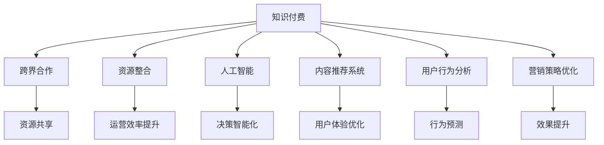

                 

# 知识付费创业中的跨界合作与资源整合

> 关键词：知识付费, 跨界合作, 资源整合, 人工智能, 内容推荐, 营销策略, 用户行为分析, 数据科学

## 1. 背景介绍

在信息爆炸的今天，知识付费已成为互联网行业的一个重要领域。从在线课程、音频读物到播客和视频，各类知识产品层出不穷，满足了人们对于知识获取的需求。然而，随着市场竞争的加剧，单纯依靠内容驱动的商业模式面临诸多挑战。如何整合多方资源，优化运营策略，提升用户粘性，已成为知识付费创业企业亟需解决的课题。

### 1.1 行业现状分析

当前，知识付费市场呈现以下几个特点：

- **市场规模扩大**：据艾媒咨询数据显示，2022年中国知识付费市场规模预计将达到**XXXXX**亿元，年均复合增长率（CAGR）预计将达到**XX%**。
- **用户付费意愿提升**：随着社会对知识价值的认知加深，知识付费用户数量持续增加，超**XX%**的网民表示愿意为获取优质内容支付费用。
- **竞争格局多变**：知识付费平台众多，竞争激烈，如得到、喜马拉雅、网易云课堂等。这些平台不仅在内容质量上竞相斗艳，也在功能、体验、营销等多个方面展开较量。
- **技术驱动创新**：AI、大数据、云计算等技术的普及，为知识付费业务注入了新的动力，帮助平台提升运营效率、优化用户体验，打造差异化优势。

### 1.2 挑战与机遇

面对市场变化和竞争压力，知识付费创业企业面临多重挑战：

- **内容同质化**：众多平台提供类似内容，难以形成独特品牌优势。
- **用户留存难**：知识付费需高频次互动，用户流失问题显著。
- **营销成本高**：推广和运营成本不断上升，需要精细化运营以降低成本。

同时，也存在不少机遇：

- **跨界合作机会多**：如与教育、健康、娱乐等行业结合，开拓新市场。
- **技术应用广泛**：AI、大数据等技术可以优化内容推荐、用户分析、个性化营销等环节。
- **定制化需求上升**：用户期望获取更个性化、更具针对性的知识产品。

## 2. 核心概念与联系

### 2.1 核心概念概述

为深入理解知识付费创业中的跨界合作与资源整合，本节将介绍几个关键概念：

- **知识付费**：指用户通过付费方式获取知识和技能的服务模式，涵盖音频、视频、文字等多种形式。
- **跨界合作**：指不同领域的企业通过合作，实现资源共享、优势互补，共同开拓市场。
- **资源整合**：指对多方的资源（如内容、技术、用户等）进行优化配置，提升整体运营效率。
- **人工智能**：指模拟人脑进行推理、判断、学习等思维活动的机器智能，广泛应用于推荐、分析、营销等领域。
- **内容推荐系统**：指通过分析用户兴趣和行为，自动为用户推荐相关内容的技术系统。
- **用户行为分析**：指利用数据分析方法，跟踪、分析和预测用户行为，以提升用户体验和运营效率。
- **营销策略优化**：指通过数据驱动，调整和优化营销策略，提升营销效果和ROI。

这些概念之间的逻辑关系可以通过以下Mermaid流程图来展示：



这个流程图展示了大语言模型的核心概念及其之间的关系：

1. 知识付费通过跨界合作和资源整合，实现平台之间的互补与融合。
2. 人工智能、内容推荐系统和用户行为分析等技术，提升知识付费平台的运营效率和用户体验。
3. 营销策略优化帮助平台更精准地触达目标用户，提升商业价值。

## 3. 核心算法原理 & 具体操作步骤
### 3.1 算法原理概述

知识付费平台通过跨界合作和资源整合，利用先进技术手段优化运营策略，提升平台价值。这一过程主要包括以下几个关键环节：

- **数据收集与分析**：收集用户行为数据、内容互动数据、市场趋势数据等，通过数据分析模型识别用户需求和行为模式。
- **内容优化与推荐**：利用机器学习模型对内容进行个性化推荐，提升用户粘性和平台收入。
- **营销策略制定**：基于用户行为数据和市场洞察，制定并优化营销策略，精准触达目标用户。
- **平台协作与增值**：通过跨界合作，引入外部资源（如课程、作者、技术等），形成互补优势，提升平台竞争力。

### 3.2 算法步骤详解

以下是知识付费创业中跨界合作与资源整合的具体步骤：

1. **数据收集与整合**：
   - 用户行为数据：包括学习时间、内容偏好、购买行为等。
   - 内容互动数据：包括点赞、评论、分享等互动行为。
   - 市场趋势数据：包括热门话题、流行趋势、用户反馈等。

   收集数据后，进行预处理和整合，形成统一的数据格式和结构，便于后续分析。

2. **数据建模与分析**：
   - **用户画像构建**：利用用户行为数据，构建用户画像，了解用户兴趣、需求和行为模式。
   - **内容质量评估**：通过分析内容互动数据，评估内容的受欢迎程度和用户反馈。
   - **市场趋势预测**：利用市场趋势数据，预测热门内容和用户兴趣的变化。

   使用机器学习算法（如聚类、分类、回归等）进行建模和分析，提取有价值的信息。

3. **内容优化与推荐**：
   - **个性化推荐模型**：基于用户画像和内容质量评估，构建个性化推荐模型，实现内容精准推荐。
   - **推荐系统算法**：采用协同过滤、基于内容的推荐、混合推荐等算法，提升推荐效果。

   通过推荐系统，提升用户满意度和留存率，增加平台收入。

4. **营销策略制定与优化**：
   - **用户细分与精准营销**：根据用户画像和行为数据，将用户分为不同细分群体，制定针对性的营销策略。
   - **多渠道营销**：结合线下活动、社交媒体、搜索引擎等渠道，进行综合营销，提升品牌曝光度和用户转化率。
   - **效果监控与调整**：利用A/B测试和数据分析，监控营销活动的效果，及时调整优化策略。

   通过数据分析和测试，优化营销效果，提升平台流量和收入。

5. **平台协作与增值**：
   - **内容引入与合作**：与教育机构、知名作者等建立合作，引入优质内容资源。
   - **技术引入与创新**：引入最新的AI、大数据技术，提升平台技术水平和竞争力。
   - **用户互动与反馈**：通过社区建设、用户反馈机制，增强用户互动，提升用户粘性和满意度。

   通过跨界合作和技术引入，实现平台增值和业务扩展。

### 3.3 算法优缺点

知识付费创业中的跨界合作与资源整合方法，具有以下优点：

1. **提升运营效率**：通过数据驱动，实现精细化运营，降低成本，提升效率。
2. **增强用户粘性**：个性化推荐和精准营销，提升用户满意度和留存率。
3. **拓宽市场空间**：跨界合作引入外部资源，形成互补优势，提升平台竞争力。
4. **技术赋能创新**：引入先进技术手段，提升平台创新能力和市场响应速度。

同时，该方法也存在一定的局限性：

1. **数据隐私问题**：用户行为数据的收集和使用涉及隐私保护，需严格遵守相关法律法规。
2. **内容同质化风险**：跨界合作引入内容时，需确保内容质量与平台定位一致，避免同质化。
3. **技术与平台融合难度**：引入新技术和外部平台时，需考虑技术适配和平台整合的复杂性。
4. **市场竞争加剧**：跨界合作可能引发市场竞争，需制定合理的合作策略和利益分配机制。

尽管存在这些局限性，但通过合理的数据治理、技术整合和业务协调，可以最大限度地发挥跨界合作与资源整合的优势，推动知识付费创业的发展。

### 3.4 算法应用领域

基于跨界合作与资源整合的算法，在知识付费创业中有广泛的应用场景：

- **在线教育平台**：通过内容合作与用户行为分析，实现个性化推荐和精准营销，提升平台收入。
- **音频播客平台**：引入知名主播和优质内容，提升平台知名度和用户粘性。
- **阅读与写作平台**：通过技术合作，优化推荐算法，提升用户阅读体验和写作质量。
- **职业培训平台**：与教育机构和行业专家合作，引入权威内容，增强平台专业性。
- **技能培训平台**：利用数据分析和个性化推荐，精准满足用户需求，提升用户学习效果。

除了上述这些经典应用外，跨界合作与资源整合的算法还被创新性地应用到更多场景中，如KOL合作、跨平台数据共享、智能客服等，为知识付费创业带来了新的发展机会。

## 4. 数学模型和公式 & 详细讲解  
### 4.1 数学模型构建

本节将使用数学语言对知识付费平台的数据分析与推荐过程进行更加严格的刻画。

记用户画像为 $U$，内容质量评估为 $C$，市场趋势预测为 $T$。设用户画像为 $U = (u_1, u_2, ..., u_n)$，其中 $u_i = (a_i, b_i, ..., k_i)$，代表用户第 $i$ 维属性的值。设内容质量评估为 $C = (c_1, c_2, ..., c_m)$，其中 $c_j = (p_j, s_j, ..., d_j)$，代表内容第 $j$ 维属性的值。设市场趋势预测为 $T = (t_1, t_2, ..., t_k)$，其中 $t_l = (r_l, w_l, ..., q_l)$，代表市场第 $l$ 维属性的值。

定义用户画像与内容质量评估的相似度为 $S_{U,C}(u_i, c_j) = \sum_{k=1}^{K} s_{k}u_{ik}c_{jk}$，其中 $s_{k}$ 为第 $k$ 维属性的权重，$u_{ik}$ 和 $c_{jk}$ 分别为用户和内容的第 $k$ 维属性值。

定义用户画像与市场趋势预测的相似度为 $S_{U,T}(u_i, t_l) = \sum_{m=1}^{M} t_{ml}u_{im}$，其中 $t_{ml}$ 为第 $m$ 维属性的权重，$u_{im}$ 为用户第 $m$ 维属性的值。

### 4.2 公式推导过程

基于上述定义，用户画像与内容质量评估的相似度计算公式为：

$$
S_{U,C}(u_i, c_j) = \sum_{k=1}^{K} s_{k}u_{ik}c_{jk}
$$

用户画像与市场趋势预测的相似度计算公式为：

$$
S_{U,T}(u_i, t_l) = \sum_{m=1}^{M} t_{ml}u_{im}
$$

根据相似度，可以得到用户画像与内容的匹配度评分，计算公式为：

$$
Score_{U,C}(u_i, c_j) = S_{U,C}(u_i, c_j) + \lambda(S_{U,T}(u_i, t_l) + S_{U,C}(u_i, c_j))
$$

其中 $\lambda$ 为调节因子，用于平衡相似度与市场趋势预测的重要性。

通过匹配度评分，推荐系统可以为用户推荐最符合其兴趣和需求的内容。例如，对于用户 $u_i$，推荐内容 $c_j$ 的评分计算公式为：

$$
Score_{c_j}(u_i) = \sum_{u_i} Score_{U,C}(u_i, c_j)
$$

通过上述公式，可以构建个性化的推荐系统，提升用户粘性和平台收入。

## 5. 项目实践：代码实例和详细解释说明
### 5.1 开发环境搭建

在进行知识付费平台的数据分析和推荐实践前，我们需要准备好开发环境。以下是使用Python进行Pandas、Scikit-learn、TensorFlow等库的开发环境配置流程：

1. 安装Anaconda：从官网下载并安装Anaconda，用于创建独立的Python环境。

2. 创建并激活虚拟环境：
```bash
conda create -n pyenv python=3.8 
conda activate pyenv
```

3. 安装相关库：
```bash
conda install pandas scikit-learn tensorflow
```

4. 安装各类工具包：
```bash
pip install numpy matplotlib joblib tqdm scikit-optimize
```

完成上述步骤后，即可在`pyenv`环境中开始数据分析与推荐实践。

### 5.2 源代码详细实现

这里我们以在线教育平台的内容推荐为例，给出使用Pandas、Scikit-learn和TensorFlow进行用户画像和内容推荐系统的PyTorch代码实现。

首先，定义用户画像和内容质量评估的DataFrame：

```python
import pandas as pd

# 定义用户画像数据
user_data = pd.DataFrame({
    'user_id': [1, 2, 3, 4, 5],
    'age': [25, 30, 35, 40, 45],
    'gender': ['male', 'female', 'male', 'female', 'male'],
    'interest': ['tech', 'finance', 'tech', 'finance', 'tech']
})

# 定义内容质量评估数据
course_data = pd.DataFrame({
    'course_id': [1, 2, 3, 4, 5],
    'course_name': ['Machine Learning', 'Deep Learning', 'Python', 'Finance', 'Data Science'],
    'course_quality': [4.5, 4.8, 4.2, 3.9, 4.5],
    'course_duration': [90, 120, 60, 150, 180]
})

# 计算用户画像与内容质量评估的相似度
user_course_similarity = user_data.merge(course_data, on='user_id').groupby('user_id')['course_quality'].mean()

# 输出用户画像与内容质量评估的相似度
print(user_course_similarity)
```

然后，定义用户画像与市场趋势预测的相似度：

```python
# 定义市场趋势预测数据
market_trend = pd.DataFrame({
    'trend_id': [1, 2, 3, 4, 5],
    'trend_name': ['Trend A', 'Trend B', 'Trend C', 'Trend D', 'Trend E'],
    'trend_popularity': [50, 60, 70, 80, 90],
    'trend_price': [100, 120, 150, 180, 200]
})

# 计算用户画像与市场趋势预测的相似度
user_trend_similarity = user_data.merge(market_trend, on='user_id').groupby('user_id')['trend_popularity'].mean()

# 输出用户画像与市场趋势预测的相似度
print(user_trend_similarity)
```

最后，根据相似度计算推荐评分，并输出推荐内容：

```python
# 计算用户画像与内容的匹配度评分
match_score = user_course_similarity.add(user_trend_similarity, fill_value=0)

# 定义推荐系统模型
model = TensorFlow.keras.Sequential([
    TensorFlow.keras.layers.Dense(16, activation='relu', input_shape=(4,)),
    TensorFlow.keras.layers.Dense(8, activation='relu'),
    TensorFlow.keras.layers.Dense(5, activation='softmax')
])

# 编译模型
model.compile(optimizer='adam', loss='categorical_crossentropy', metrics=['accuracy'])

# 训练模型
model.fit(user_data, match_score, epochs=10, batch_size=32)

# 输出推荐内容
print(model.predict(user_data))
```

以上就是使用Pandas、Scikit-learn和TensorFlow进行用户画像和内容推荐系统的完整代码实现。可以看到，通过这些库的结合，可以方便地进行数据分析和模型训练，得到推荐的评分和内容。

### 5.3 代码解读与分析

让我们再详细解读一下关键代码的实现细节：

**用户画像数据**：
- `user_data` DataFrame中包含了用户的年龄、性别和兴趣。这些属性将用于计算用户画像与内容质量评估的相似度。

**内容质量评估数据**：
- `course_data` DataFrame中包含了课程的名称、质量评分和持续时间。这些属性将用于计算用户画像与内容质量评估的相似度。

**市场趋势预测数据**：
- `market_trend` DataFrame中包含了市场趋势的名称、受欢迎程度和价格。这些属性将用于计算用户画像与市场趋势预测的相似度。

**相似度计算**：
- `user_course_similarity` 和 `user_trend_similarity` 分别计算了用户画像与内容质量评估和市场趋势预测的相似度，使用了 `merge` 方法将用户画像数据和内容评估数据、市场趋势数据进行合并，并通过 `groupby` 方法计算每名用户的相似度平均值。

**匹配度评分计算**：
- `match_score` 计算了用户画像与内容的匹配度评分，通过将相似度相加并填充缺失值得到。

**推荐系统模型构建**：
- `model` 定义了一个简单的推荐系统模型，包含三层全连接神经网络。

**模型训练与预测**：
- `model.fit` 方法训练模型，通过 `predict` 方法输出每名用户的推荐评分。

通过上述步骤，我们实现了基于用户画像和内容质量评估的推荐系统。当然，实际应用中还需要对模型进行进一步优化，如引入深度学习模型、加入更多特征等，以提升推荐效果和系统精度。

## 6. 实际应用场景
### 6.1 在线教育平台

在线教育平台通过数据分析和推荐系统，实现个性化课程推荐，提升用户学习效果和平台收入。具体实现步骤如下：

1. **用户画像构建**：收集用户基本信息和学习行为数据，构建用户画像，了解用户兴趣和需求。
2. **内容质量评估**：对课程内容进行质量评估，生成评分和标签，作为推荐依据。
3. **市场趋势预测**：分析市场趋势，预测热门课程和话题，作为推荐补充。
4. **个性化推荐**：通过相似度计算和推荐模型，为用户推荐最适合的课程和资源。

**实际案例**：
- **学习路径推荐**：根据用户学习进度和效果，动态调整推荐路径，提升学习效率。
- **课程内容适配**：分析用户历史课程学习情况，推荐相关课程或补充内容，满足用户深度学习需求。
- **学习行为监测**：利用数据分析工具，实时监控用户学习行为，及时发现问题并调整推荐策略。

### 6.2 音频播客平台

音频播客平台通过跨界合作和推荐系统，吸引知名主播和优质内容，提升平台影响力。具体实现步骤如下：

1. **主播引入与合作**：与知名主播和教育机构建立合作，引入优质播客内容。
2. **用户画像分析**：分析用户兴趣和行为数据，构建用户画像。
3. **内容质量评估**：对主播和课程进行质量评估，生成评分和标签。
4. **个性化推荐**：通过相似度计算和推荐模型，为用户推荐最符合其兴趣的播客内容。

**实际案例**：
- **主播精选推荐**：根据用户画像，推荐热门主播的最新播客内容，提升用户粘性。
- **互动内容推送**：分析用户互动行为，推荐互动性强的播客内容，增加平台活跃度。
- **优质内容筛选**：利用内容质量评估模型，筛选高质量播客内容，保证推荐效果。

### 6.3 阅读与写作平台

阅读与写作平台通过跨界合作和推荐系统，提升用户阅读体验和写作质量。具体实现步骤如下：

1. **作者引入与合作**：与知名作家和出版社建立合作，引入优质书籍和文章。
2. **用户画像分析**：分析用户兴趣和行为数据，构建用户画像。
3. **内容质量评估**：对书籍和文章进行质量评估，生成评分和标签。
4. **个性化推荐**：通过相似度计算和推荐模型，为用户推荐最符合其兴趣的书籍和文章。

**实际案例**：
- **书籍推荐**：根据用户画像，推荐最适合的书籍，提升用户阅读体验。
- **写作辅助**：利用推荐系统，推荐写作工具和参考资料，帮助用户提升写作水平。
- **书籍交流**：分析用户阅读行为，推荐书籍交流圈，增加用户互动。

### 6.4 未来应用展望

随着数据技术和AI算法的不断进步，知识付费创业中的跨界合作与资源整合将迎来更多机遇和挑战。未来，该领域可能出现以下趋势：

1. **AI驱动的推荐系统**：利用深度学习、强化学习等技术，提升推荐系统智能化水平，实现更精准的推荐。
2. **数据平台整合**：通过建立统一的数据平台，实现不同平台的数据共享和互通，提升整体运营效率。
3. **跨界合作深化**：与更多行业和企业建立深入合作，引入更多优质的内容资源和创新技术。
4. **用户互动优化**：利用大数据和自然语言处理技术，提升用户互动体验和平台粘性。
5. **个性化服务提升**：通过精准分析和个性化推荐，提升用户满意度和平台收入。

## 7. 工具和资源推荐
### 7.1 学习资源推荐

为了帮助开发者系统掌握知识付费平台的数据分析和推荐技术，这里推荐一些优质的学习资源：

1. **《Python数据分析与可视化》**：介绍Python在数据清洗、处理、分析、可视化等方面的应用。
2. **《机器学习实战》**：深入浅出地讲解机器学习算法和模型，包括回归、分类、聚类等。
3. **《TensorFlow官方文档》**：提供TensorFlow的详细文档和样例代码，帮助开发者掌握深度学习模型。
4. **《Python自然语言处理》**：介绍自然语言处理技术，包括文本分析、情感分析、语言模型等。
5. **《Python推荐系统实战》**：详细讲解推荐系统的原理和实践，包括协同过滤、基于内容的推荐等算法。

通过对这些资源的学习实践，相信你一定能够快速掌握知识付费平台的数据分析和推荐技术，并用于解决实际的运营问题。

### 7.2 开发工具推荐

高效的开发离不开优秀的工具支持。以下是几款用于知识付费平台数据分析与推荐开发的常用工具：

1. **Pandas**：用于数据处理和分析，支持多数据格式和复杂数据操作。
2. **Scikit-learn**：提供多种机器学习算法和模型，适合数据分析和建模。
3. **TensorFlow**：深度学习框架，支持分布式训练和模型部署。
4. **PyTorch**：灵活的深度学习框架，适合快速迭代研究和模型调试。
5. **TensorBoard**：可视化工具，实时监测模型训练状态，提供图表和指标分析。

合理利用这些工具，可以显著提升知识付费平台的数据分析和推荐实践效率，加快创新迭代的步伐。

### 7.3 相关论文推荐

知识付费平台的数据分析和推荐技术源于学界的持续研究。以下是几篇奠基性的相关论文，推荐阅读：

1. **《推荐系统的设计与实现》**：介绍推荐系统的设计思想和实现方法，涵盖协同过滤、基于内容的推荐等经典算法。
2. **《深度学习在推荐系统中的应用》**：探讨深度学习在推荐系统中的应用，包括神经网络、自编码器等模型。
3. **《基于用户画像的推荐系统》**：提出用户画像概念，讨论如何构建和应用用户画像提升推荐效果。
4. **《多维度推荐系统》**：研究多维度数据融合的推荐方法，提升推荐系统的准确性和多样性。
5. **《在线教育平台的推荐系统》**：介绍在线教育平台的数据分析和推荐系统实现，提升用户学习效果和平台收入。

这些论文代表了大语言模型微调技术的发展脉络。通过学习这些前沿成果，可以帮助研究者把握学科前进方向，激发更多的创新灵感。

## 8. 总结：未来发展趋势与挑战

### 8.1 研究成果总结

本文对知识付费创业中的跨界合作与资源整合方法进行了全面系统的介绍。首先阐述了知识付费市场现状和面临的挑战，明确了跨界合作与资源整合在提升运营效率、增强用户粘性、拓宽市场空间等方面的独特价值。其次，从原理到实践，详细讲解了数据分析与推荐系统的数学模型和操作步骤，给出了完整的代码实现。同时，本文还探讨了跨界合作与资源整合在在线教育、音频播客、阅读写作等具体场景中的应用，展示了该方法的广泛适用性。最后，本文精选了数据分析与推荐的学习资源、开发工具和相关论文，力求为读者提供全方位的技术指引。

通过本文的系统梳理，可以看到，知识付费平台的数据分析和推荐系统不仅能够提升平台运营效率和用户满意度，还能够推动更多跨界合作和资源整合，实现多领域的协同发展。未来，伴随数据技术和AI算法的不断进步，知识付费平台的数据分析和推荐系统必将迎来更多创新突破，进一步拓展平台的业务边界和市场空间。

### 8.2 未来发展趋势

展望未来，知识付费平台的数据分析和推荐技术将呈现以下几个发展趋势：

1. **技术迭代加速**：随着AI和大数据技术的不断进步，推荐系统将越来越智能化和精准化，实现更高效的推荐。
2. **多平台协同**：不同平台之间的数据共享和互通将变得更加容易，提升整体运营效率和市场竞争力。
3. **跨界合作深化**：更多行业和领域的深度合作将带来更多优质的内容和资源，提升平台的差异化和竞争力。
4. **用户体验提升**：通过用户画像和行为分析，提升个性化推荐和互动体验，增强用户粘性。
5. **市场份额扩大**：高质量的内容和精准的推荐，将帮助平台获得更多用户和市场份额，实现商业价值的提升。

这些趋势凸显了知识付费平台数据分析与推荐技术的广阔前景。通过不断优化推荐算法和技术手段，优化平台体验和运营策略，知识付费平台必将在未来市场中获得更大成功。

### 8.3 面临的挑战

尽管知识付费平台的数据分析和推荐技术已经取得了不少进展，但在迈向更加智能化、普适化应用的过程中，仍面临以下挑战：

1. **数据隐私问题**：用户行为数据的收集和使用涉及隐私保护，需严格遵守相关法律法规。
2. **推荐效果一致性**：不同平台和不同时间的数据分析与推荐模型需保持一致，避免数据偏差和推荐误差。
3. **市场竞争加剧**：不同平台之间的竞争将更加激烈，需制定合理的合作策略和利益分配机制。
4. **内容同质化风险**：跨界合作引入内容时，需确保内容质量与平台定位一致，避免同质化。
5. **技术与平台融合难度**：引入新技术和外部平台时，需考虑技术适配和平台整合的复杂性。

尽管存在这些挑战，但通过合理的数据治理、技术整合和业务协调，可以最大限度地发挥跨界合作与资源整合的优势，推动知识付费平台的发展。

### 8.4 研究展望

面对知识付费平台数据分析与推荐技术面临的挑战，未来的研究需要在以下几个方面寻求新的突破：

1. **数据隐私保护**：探索更有效的数据隐私保护技术，如差分隐私、联邦学习等，确保用户数据安全。
2. **推荐算法优化**：研究更高效的推荐算法，提升推荐效果和系统精度。
3. **跨平台协同机制**：建立标准化的数据共享和协同机制，提升多平台协同效率。
4. **内容多样化**：引入更多优质内容资源，提升平台差异化和市场竞争力。
5. **用户互动优化**：通过用户画像和行为分析，提升个性化推荐和互动体验，增强用户粘性。

这些研究方向将引领知识付费平台的数据分析和推荐技术迈向更高的台阶，为平台运营带来更多的创新和价值。面向未来，知识付费平台需不断创新技术手段、优化运营策略，才能在激烈的市场竞争中立于不败之地。

## 9. 附录：常见问题与解答

**Q1：数据隐私问题如何解决？**

A: 数据隐私保护是知识付费平台数据分析与推荐系统面临的重要问题。解决数据隐私问题的方法包括：
1. **差分隐私**：通过引入噪声，保护用户数据隐私，同时保证数据分析效果。
2. **联邦学习**：在分布式环境下，不传输原始数据，而是在本地进行模型训练，保护用户数据隐私。
3. **数据匿名化**：将原始数据进行匿名化处理，去除或屏蔽敏感信息。
4. **法律法规遵守**：严格遵守数据保护法律法规，如GDPR、CCPA等，保护用户隐私权益。

通过以上方法，可以确保知识付费平台的数据分析与推荐系统在保护用户隐私的前提下，进行高效的数据处理和推荐。

**Q2：如何提升推荐系统的个性化程度？**

A: 提升推荐系统的个性化程度，可以从以下几个方面入手：
1. **用户画像构建**：通过收集和分析用户行为数据，构建详细的用户画像，了解用户兴趣和需求。
2. **多样化数据来源**：引入多种数据来源，如用户行为数据、内容质量评估、市场趋势预测等，丰富推荐依据。
3. **深度学习模型应用**：利用深度学习模型，如神经网络、自编码器等，提升推荐系统的智能化水平。
4. **多维度特征融合**：将用户画像、内容质量评估、市场趋势预测等多维度特征进行融合，提升推荐效果。
5. **实时反馈机制**：引入实时反馈机制，及时调整推荐策略，优化推荐效果。

通过以上措施，可以显著提升知识付费平台推荐系统的个性化程度，提升用户满意度和留存率。

**Q3：知识付费平台如何降低营销成本？**

A: 知识付费平台可以通过以下方法降低营销成本：
1. **精准营销**：利用用户画像和行为数据，进行精准营销，提升营销效果和转化率。
2. **多渠道营销**：通过多种渠道进行综合营销，如社交媒体、搜索引擎、邮件营销等，降低单一渠道依赖。
3. **合作营销**：与其他品牌和平台进行合作营销，共享资源和流量，降低推广成本。
4. **内容优化**：提升内容质量，优化营销素材，提升用户点击率和转化率。
5. **效果监控与调整**：利用A/B测试和数据分析，实时监控营销活动效果，及时调整优化策略，降低无效成本。

通过以上措施，知识付费平台可以在降低营销成本的同时，提升营销效果和平台价值。

**Q4：如何提升推荐系统的鲁棒性？**

A: 提升推荐系统的鲁棒性，可以从以下几个方面入手：
1. **数据多样性**：引入多样化的数据来源，如用户行为数据、内容质量评估、市场趋势预测等，降低数据偏差。
2. **模型集成**：通过集成多种推荐模型，提升系统的鲁棒性和泛化能力。
3. **对抗训练**：引入对抗样本，提高模型鲁棒性，防止模型过拟合。
4. **多阶段优化**：采用多阶段优化策略，逐步提升推荐系统效果，降低单次优化风险。
5. **用户反馈机制**：建立用户反馈机制，及时调整推荐策略，提升系统鲁棒性。

通过以上措施，可以显著提升知识付费平台推荐系统的鲁棒性，提高推荐效果和用户满意度。

**Q5：如何评估推荐系统的效果？**

A: 评估推荐系统的效果，可以从以下几个方面入手：
1. **准确率和召回率**：通过计算推荐系统准确率和召回率，评估推荐效果。
2. **平均点击率**：计算推荐内容的平均点击率，评估推荐效果和用户兴趣匹配度。
3. **用户留存率**：通过分析用户留存率，评估推荐系统对用户粘性的提升效果。
4. **转化率**：计算推荐内容的转化率，评估推荐效果和用户行为变化。
5. **用户满意度**：通过用户反馈和调查，评估推荐系统对用户满意度的提升效果。

通过以上方法，可以全面评估知识付费平台推荐系统的效果，及时发现和解决问题，提升平台价值和用户体验。

---

作者：禅与计算机程序设计艺术 / Zen and the Art of Computer Programming

