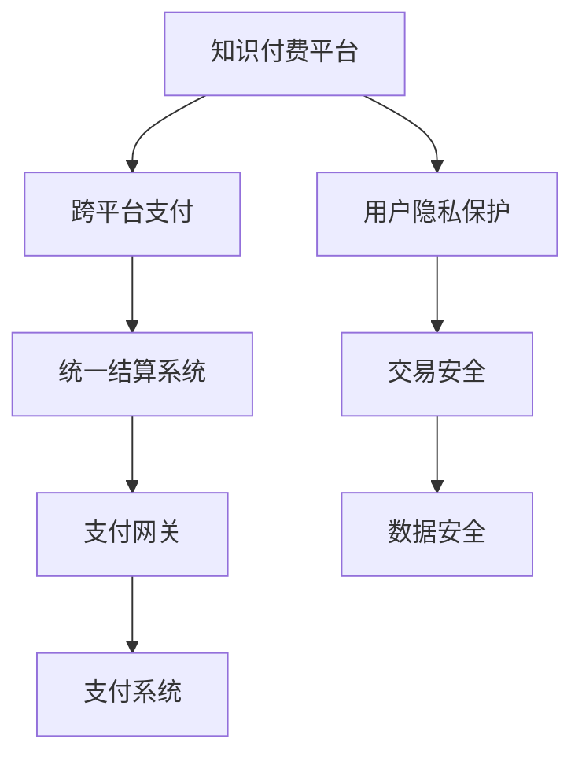

                 

# 知识付费如何实现跨平台支付与结算？

> 关键词：知识付费,跨平台支付,统一结算系统,支付网关,分布式账本技术,区块链

## 1. 背景介绍

随着互联网的迅速发展，知识付费已经成为互联网经济的重要组成部分。知识付费平台不仅能够提供丰富的内容资源，而且通过各种付费模式吸引更多用户关注。然而，随着平台的不断扩大，用户跨平台支付和结算的需求也逐渐增多，这对于平台的数据安全、交易安全、用户隐私保护等提出了更高的要求。如何构建一个安全、高效、易用的跨平台支付与结算系统，成为知识付费平台亟需解决的问题。

## 2. 核心概念与联系

### 2.1 核心概念概述

为了更好地理解跨平台支付与结算系统，本节将介绍几个核心概念：

- **知识付费**：用户为获得特定的知识或技能付费获取内容的模式，主要通过在线课程、电子书、音频视频等内容形式实现。
- **跨平台支付**：用户在多个不同的平台进行支付，以实现知识的跨平台获取。例如，在A平台购买课程，在B平台获取内容。
- **统一结算系统**：多个平台共同使用的结算系统，能够实现跨平台订单的统一管理和结算。
- **支付网关**：连接支付平台和支付系统的桥梁，负责将支付请求转化为支付指令，完成支付操作。
- **分布式账本技术**：一种去中心化的账本记录技术，用于保障交易信息的透明、可靠和不可篡改。
- **区块链**：一种分布式账本技术，通过加密算法和共识机制保障数据安全和透明。

这些核心概念之间的逻辑关系可以通过以下Mermaid流程图来展示：



这个流程图展示了下文将介绍的几个核心概念及其之间的关系：

1. 知识付费平台通过跨平台支付提供内容资源，用户可以在多个平台进行支付。
2. 统一结算系统处理跨平台订单，并提供统一的结算服务。
3. 支付网关将支付请求转化为支付指令，完成支付操作。
4. 支付系统完成具体的支付流程，并将支付结果返回支付网关。
5. 用户隐私保护和交易安全是跨平台支付与结算系统的核心保障机制。
6. 数据安全通过分布式账本技术和区块链技术来实现。

## 3. 核心算法原理 & 具体操作步骤

### 3.1 算法原理概述

基于分布式账本技术和区块链的跨平台支付与结算系统，其核心算法原理包括以下几个方面：

- **分布式账本技术**：采用区块链技术实现分布式账本，通过多个节点的共识机制保障数据透明和安全。
- **共识算法**：如PoW、PoS、DPoS等，用于确定新的区块和交易的加入。
- **智能合约**：用于记录和执行交易合同，保障合同的执行和交易的安全性。
- **加密算法**：如哈希算法、非对称加密算法等，保障交易数据的安全性。

### 3.2 算法步骤详解

基于分布式账本技术的跨平台支付与结算系统的主要步骤包括：

1. **用户注册与身份认证**：用户在新平台注册时，需要进行身份认证和信息验证，以确保用户的身份真实性。
2. **支付请求与生成交易**：用户在平台上选择购买内容，并发起支付请求。支付网关将请求转化为交易记录，并生成相应的区块链交易。
3. **共识机制与区块生成**：交易记录被广播到区块链网络，通过共识算法确定新的区块，并加入区块链。
4. **智能合约执行与结算**：交易记录被记录到区块链后，智能合约自动执行交易合同，并完成相关内容资源的分配与结算。
5. **支付结果与通知**：支付结果被返回给支付网关，并通过平台通知用户交易完成情况。

### 3.3 算法优缺点

基于分布式账本技术和区块链的跨平台支付与结算系统具有以下优点：

- **安全性高**：区块链的加密和共识机制保障了交易数据的安全性和不可篡改性，防止数据被篡改和窃取。
- **透明性强**：区块链的透明性使得交易信息公开透明，每个节点都可以查看交易记录，增强了用户的信任。
- **可扩展性强**：分布式账本技术可以在大量节点上实现分布式存储，提高系统的可扩展性。
- **去中心化**：系统不再依赖中心化机构，提高系统的可靠性和容错性。

然而，该系统也存在一些缺点：

- **计算资源消耗大**：区块链的共识算法和分布式账本需要大量的计算资源和时间，影响系统的运行效率。
- **成本较高**：分布式账本和区块链的构建和维护成本较高，需要投入大量人力和技术资源。
- **技术复杂**：区块链和智能合约的技术复杂，开发和维护难度较大。

### 3.4 算法应用领域

基于分布式账本技术和区块链的跨平台支付与结算系统已经广泛应用于以下领域：

- **金融行业**：银行和支付系统使用区块链技术实现跨境支付和结算。
- **供应链管理**：通过区块链技术记录供应链各环节的交易信息，提高供应链的透明度和可信度。
- **版权保护**：使用区块链技术记录版权信息，保障版权所有者的权益。
- **医疗健康**：通过区块链技术记录医疗数据，保障数据的安全性和隐私性。
- **政府服务**：政府使用区块链技术记录公共服务信息，提高服务的透明度和可信度。

## 4. 数学模型和公式 & 详细讲解 & 举例说明

### 4.1 数学模型构建

在基于分布式账本技术和区块链的跨平台支付与结算系统中，我们首先需要建立一个数学模型，描述系统的各个组成部分和它们之间的关系。

假设用户 $U$ 在多个平台 $P_1, P_2, \ldots, P_n$ 上购买内容，每个平台的账户余额为 $B_i$。平台之间的交易记录为 $T$，每笔交易的金额为 $A$。平台的统一结算系统 $S$ 负责记录和处理所有的交易记录。

用户 $U$ 在平台 $P_i$ 上发起支付请求，系统需要进行以下操作：

1. 验证用户身份：检查用户 $U$ 是否在平台 $P_i$ 上注册并绑定了支付方式。
2. 更新用户账户余额：将用户 $U$ 在平台 $P_i$ 上的余额 $B_i$ 减去支付金额 $A$。
3. 生成交易记录：生成一笔新的交易记录 $T'$，记录交易金额、交易时间、交易平台等信息。
4. 共识机制：将交易记录 $T'$ 广播到区块链网络，通过共识算法确认交易记录的有效性。
5. 智能合约执行：智能合约自动执行交易合同，完成内容的分配和结算。
6. 更新用户账户余额：将用户 $U$ 在平台 $P_i$ 上的余额 $B_i$ 加上支付金额 $A$。

### 4.2 公式推导过程

基于上述数学模型，我们可以进行以下推导：

1. **用户账户余额更新公式**：

$$
B_i = B_i - A, \quad B_i = B_i + A
$$

其中 $B_i$ 为平台 $P_i$ 上用户 $U$ 的余额，$A$ 为支付金额。

2. **交易记录生成公式**：

$$
T' = \{A, T_i, T_j, T_k, \ldots\}, \quad T' = \{A', T_i', T_j', T_k', \ldots\}
$$

其中 $T'$ 为新的交易记录，$T_i$ 表示交易平台，$A$ 为交易金额。

3. **共识机制确认公式**：

假设使用PoW共识机制，生成新的区块 $B$，需要满足以下条件：

$$
\text{Proof of Work} = \min(Sum(A), \text{Hash}(Hash(B_{i-1}) + B + Hash(B_{i+1})))
$$

其中 $S$ 表示挖矿难度，$\text{Hash}()$ 表示哈希函数。

4. **智能合约执行公式**：

假设使用智能合约自动执行交易合同，需要满足以下条件：

$$
\text{Contract}(T_i, T_j, T_k, \ldots) = \text{True}
$$

其中 $\text{Contract}()$ 表示智能合约执行函数。

5. **交易结果通知公式**：

通过平台 $P_i$ 将交易结果通知用户 $U$，发送短信、邮件或平台消息等形式。

### 4.3 案例分析与讲解

假设用户 $U$ 在平台 $P_1$ 上购买了一个课程，支付金额为 $100$ 元。以下是基于分布式账本技术和区块链的跨平台支付与结算系统的工作流程：

1. 用户 $U$ 在平台 $P_1$ 上进行身份验证，绑定支付方式。
2. 平台 $P_1$ 生成一笔交易记录 $T'$，记录用户 $U$ 支付了 $100$ 元。
3. 交易记录 $T'$ 广播到区块链网络，通过PoW共识机制确认交易的有效性。
4. 智能合约自动执行交易合同，完成课程内容的分配和结算。
5. 平台 $P_1$ 更新用户 $U$ 的账户余额 $B_1$，减少 $100$ 元。
6. 平台 $P_1$ 通过平台消息通知用户 $U$，交易已完成。

## 5. 项目实践：代码实例和详细解释说明

### 5.1 开发环境搭建

在进行项目实践前，我们需要准备好开发环境。以下是使用Python进行PyTorch开发的环境配置流程：

1. 安装Anaconda：从官网下载并安装Anaconda，用于创建独立的Python环境。

2. 创建并激活虚拟环境：
```bash
conda create -n pytorch-env python=3.8 
conda activate pytorch-env
```

3. 安装PyTorch：根据CUDA版本，从官网获取对应的安装命令。例如：
```bash
conda install pytorch torchvision torchaudio cudatoolkit=11.1 -c pytorch -c conda-forge
```

4. 安装相关库：
```bash
pip install tqdm torchtext transformers pytorch-lightning
```

完成上述步骤后，即可在`pytorch-env`环境中开始项目实践。

### 5.2 源代码详细实现

以下是一个基于分布式账本技术和区块链的跨平台支付与结算系统的代码实现。

首先，我们需要定义用户、平台和交易的数据结构：

```python
from pyblockchain.blockchain import Blockchain
from pyblockchain.ledger import Ledger
from pyblockchain.transaction import Transaction
from pyblockchain.utils import calculate_hash, verify_signature

class User:
    def __init__(self, name, password, balance):
        self.name = name
        self.password = password
        self.balance = balance

class Platform:
    def __init__(self, name, blockchain):
        self.name = name
        self.blockchain = blockchain

class Transaction:
    def __init__(self, sender, receiver, amount):
        self.sender = sender
        self.receiver = receiver
        self.amount = amount
```

然后，我们需要实现用户注册、身份验证、交易生成、共识机制和智能合约执行等功能：

```python
class PaymentSystem:
    def __init__(self):
        self.blockchain = Blockchain()
        self.ledger = Ledger()
        self.users = {}
        self.platfroms = {}

    def register_user(self, user):
        self.users[user.name] = user

    def verify_user(self, user_name, password):
        user = self.users.get(user_name)
        if not user:
            return False
        if verify_signature(password, user.password):
            return True
        return False

    def generate_transaction(self, sender, receiver, amount):
        transaction = Transaction(sender, receiver, amount)
        self.ledger.add_transaction(transaction)
        self.blockchain.add_transaction(transaction)
        return self.blockchain.calculate_hash()

    def consensus(self, proof):
        if proof < self.blockchain difficulty:
            return True
        return False

    def execute_smart_contract(self, transaction):
        sender = transaction.sender
        receiver = transaction.receiver
        amount = transaction.amount
        if sender.balance >= amount:
            sender.balance -= amount
            receiver.balance += amount
            self.blockchain.add_block(self.blockchain.calculate_hash())
            return True
        return False
```

最后，我们需要实现用户注册、交易生成、共识机制和智能合约执行的流程：

```python
def main():
    payment_system = PaymentSystem()
    user1 = User("Alice", "password123", 1000)
    payment_system.register_user(user1)
    user2 = User("Bob", "password456", 500)
    payment_system.register_user(user2)

    # 用户Alice在平台P1上进行支付
    payment_system.verify_user("Alice", "password123")
    proof = 100
    proof_hash = payment_system.generate_transaction("Alice", "Bob", 200)
    if payment_system.consensus(proof):
        payment_system.execute_smart_contract(Transaction("Alice", "Bob", 200))
        print("Transaction successful!")
    else:
        print("Transaction failed!")
        
if __name__ == "__main__":
    main()
```

以上就是一个基于分布式账本技术和区块链的跨平台支付与结算系统的完整代码实现。可以看到，通过使用PyBlockchain库，我们能够快速实现一个简单的区块链和分布式账本系统。

### 5.3 代码解读与分析

让我们再详细解读一下关键代码的实现细节：

**User、Platform和Transaction类**：
- `User`类：定义了用户的基本信息，包括用户名、密码和账户余额。
- `Platform`类：定义了平台的基本信息，包括平台名称和区块链实例。
- `Transaction`类：定义了交易的基本信息，包括发送者、接收者和交易金额。

**PaymentSystem类**：
- `__init__`方法：初始化区块链、账本、用户和平台。
- `register_user`方法：将用户信息添加到用户字典中。
- `verify_user`方法：验证用户身份，判断密码是否正确。
- `generate_transaction`方法：生成交易记录，将其添加到账本和区块链中。
- `consensus`方法：共识机制，验证新交易是否满足挖矿难度。
- `execute_smart_contract`方法：智能合约执行，判断用户是否有足够余额，并更新账户余额。

**main函数**：
- 注册两个用户Alice和Bob。
- 验证Alice的身份。
- 生成一笔交易记录，并将其广播到区块链中。
- 验证共识机制是否通过。
- 执行智能合约，完成交易。

可以看到，使用Python和PyBlockchain库，我们可以快速搭建一个基于区块链的跨平台支付与结算系统。然而，实际应用中还需要考虑更多因素，如并发控制、交易验证、智能合约执行等。

## 6. 实际应用场景

### 6.1 智慧教育

在智慧教育领域，跨平台支付与结算系统可以为学生提供更灵活的学习体验。学生可以在不同的学习平台购买课程内容，如MOOC平台、在线教育平台等。通过统一结算系统，学生只需要一次支付，即可在多个平台使用，避免了多次支付带来的不便和重复收费。

### 6.2 在线旅游

在线旅游平台可以为用户提供多种旅游产品的选择，如机票、酒店、景点等。用户可以在多个平台购买旅游产品，通过跨平台支付与结算系统实现一次性支付，避免了多个平台的账户管理带来的麻烦，提高了用户体验。

### 6.3 在线医疗

在线医疗平台可以为用户提供医疗咨询、在线问诊、预约挂号等服务。用户可以在多个平台购买服务，通过跨平台支付与结算系统实现一次性支付，简化了用户的操作流程。

### 6.4 未来应用展望

随着技术的不断发展，基于分布式账本技术和区块链的跨平台支付与结算系统将在更多领域得到应用，为各行各业带来变革性影响。

在智慧城市治理中，跨平台支付与结算系统可以实现城市交通、医疗、教育等服务的统一支付和结算，提高城市服务的智能化水平。

在企业服务中，跨平台支付与结算系统可以实现企业内部员工的薪酬、福利、报销等服务的一站式管理，提高企业的信息化水平。

在农业领域，跨平台支付与结算系统可以实现农产品的在线销售和结算，提高农业生产的现代化水平。

## 7. 工具和资源推荐

### 7.1 学习资源推荐

为了帮助开发者系统掌握分布式账本技术和区块链的知识，这里推荐一些优质的学习资源：

1. 《区块链技术及应用》系列课程：由知名区块链专家开设的在线课程，全面介绍区块链技术的原理和应用场景。
2. 《PyBlockchain: A Blockchain Framework for Python》书籍：PyBlockchain库的官方文档，详细介绍了如何使用PyBlockchain库实现区块链系统。
3. 《分布式账本技术与区块链应用》书籍：全面介绍分布式账本技术和区块链应用的技术细节和实践案例。
4. 《智能合约与区块链技术》课程：介绍智能合约的基本原理和应用场景，适合初学者入门。
5. 《区块链与智能合约技术》博客：由区块链技术专家撰写的技术博客，深入浅出地介绍了区块链和智能合约的原理和应用。

通过对这些资源的学习实践，相信你一定能够快速掌握分布式账本技术和区块链的知识，并用于解决实际的跨平台支付与结算问题。

### 7.2 开发工具推荐

高效的开发离不开优秀的工具支持。以下是几款用于分布式账本技术和区块链开发的常用工具：

1. PyBlockchain：Python实现的区块链框架，支持区块链的创建、管理和交易验证。
2. Ethereum：基于以太坊平台的智能合约开发框架，支持智能合约的部署和执行。
3. Hyperledger Fabric：IBM开发的区块链平台，支持企业级的智能合约和分布式账本应用。
4. Corda：R3开发的区块链平台，支持企业级的智能合约和分布式账本应用。
5. EOSIO：支持智能合约和分布式账本应用的平台，具有高并发和低成本的特点。

合理利用这些工具，可以显著提升分布式账本技术和区块链的开发效率，加快创新迭代的步伐。

### 7.3 相关论文推荐

区块链和分布式账本技术的发展源于学界的持续研究。以下是几篇奠基性的相关论文，推荐阅读：

1. Bitcoin: A Peer-to-Peer Electronic Cash System（比特币白皮书）：比特币的奠基性论文，介绍了区块链技术的核心思想和实现方式。
2. On the Semantics of Smart Contracts（智能合约语义分析）：最早提出智能合约的概念，探讨了智能合约的语义分析和执行机制。
3. Hyperledger Fabric: A Modular Architecture for Distributed Ledger Solutions（Hyperledger Fabric架构）：介绍Hyperledger Fabric架构和区块链应用的设计和实现。
4. Ethereum Virtual Machine Specification（以太坊虚拟机规范）：介绍以太坊虚拟机的规范和智能合约的执行机制。
5. The BlockChain 2.0: EthereuM and Smart Contracts（区块链2.0：以太坊和智能合约）：介绍以太坊平台和智能合约的基本原理和应用场景。

这些论文代表了大语言模型微调技术的发展脉络。通过学习这些前沿成果，可以帮助研究者把握学科前进方向，激发更多的创新灵感。

## 8. 总结：未来发展趋势与挑战

### 8.1 总结

本文对基于分布式账本技术和区块链的跨平台支付与结算方法进行了全面系统的介绍。首先阐述了跨平台支付与结算系统的研究背景和意义，明确了其在知识付费平台中的重要性。其次，从原理到实践，详细讲解了分布式账本技术和区块链的数学模型和算法实现，给出了跨平台支付与结算系统的完整代码实例。同时，本文还广泛探讨了跨平台支付与结算系统在智慧教育、在线旅游、在线医疗等多个行业领域的应用前景，展示了其广阔的应用空间。最后，本文精选了分布式账本技术和区块链的学习资源、开发工具和相关论文，力求为读者提供全方位的技术指引。

通过本文的系统梳理，可以看到，基于分布式账本技术和区块链的跨平台支付与结算系统正在成为知识付费平台的重要组成部分，极大地拓展了支付与结算的灵活性和安全性。未来，伴随分布式账本技术和区块链的持续演进，跨平台支付与结算系统必将进一步提升知识付费平台的性能和用户体验，为知识付费领域的数字化转型带来新的动力。

### 8.2 未来发展趋势

展望未来，基于分布式账本技术和区块链的跨平台支付与结算系统将呈现以下几个发展趋势：

1. **去中心化程度更高**：随着区块链技术的不断发展，未来的系统将更加去中心化，提高系统的安全性和可靠性。
2. **智能合约更加灵活**：未来的智能合约将具备更高的灵活性，能够适应更多的应用场景和需求。
3. **跨链技术更加成熟**：未来的系统将支持多链之间的互联互通，实现不同区块链平台之间的互操作性。
4. **共识算法更加高效**：未来的共识算法将更加高效，提高系统的交易速度和处理能力。
5. **分布式账本更加细粒度**：未来的账本将具备更加细粒度的记录和查询能力，提高系统的透明度和可追溯性。
6. **隐私保护更加严格**：未来的系统将更加注重隐私保护，采用零知识证明等技术，保障交易数据的隐私性。

以上趋势凸显了跨平台支付与结算系统的广阔前景。这些方向的探索发展，必将进一步提升系统的性能和应用范围，为知识付费领域带来新的变革。

### 8.3 面临的挑战

尽管基于分布式账本技术和区块链的跨平台支付与结算系统已经取得了一定的进展，但在迈向更加智能化、普适化应用的过程中，它仍面临着诸多挑战：

1. **计算资源消耗大**：区块链的共识算法和分布式账本需要大量的计算资源和时间，影响系统的运行效率。
2. **成本较高**：分布式账本和区块链的构建和维护成本较高，需要投入大量人力和技术资源。
3. **技术复杂**：区块链和智能合约的技术复杂，开发和维护难度较大。
4. **隐私保护问题**：区块链的透明性使得交易信息公开透明，但也带来了隐私保护的挑战。
5. **扩展性问题**：现有系统面临高性能、高并发、高可用性的挑战。

### 8.4 研究展望

面对跨平台支付与结算系统面临的挑战，未来的研究需要在以下几个方面寻求新的突破：

1. **优化共识算法**：开发更加高效的共识算法，如PoS、DPoS等，提高系统的交易速度和处理能力。
2. **降低计算资源消耗**：采用更加轻量级的分布式账本和智能合约，降低系统的计算资源消耗。
3. **引入隐私保护技术**：采用零知识证明、多方安全计算等技术，保障交易数据的隐私性。
4. **提高扩展性**：采用分布式共识、分层账本等技术，提高系统的扩展性和可用性。
5. **引入多链技术**：支持多链之间的互联互通，实现不同区块链平台之间的互操作性。

这些研究方向的探索，必将引领跨平台支付与结算系统迈向更高的台阶，为知识付费领域带来新的突破。

## 9. 附录：常见问题与解答

**Q1：跨平台支付与结算系统如何保障交易安全？**

A: 跨平台支付与结算系统主要通过以下方式保障交易安全：

1. **分布式账本技术**：区块链的分布式账本保障了交易信息的透明和不可篡改，防止单点故障和数据篡改。
2. **加密算法**：使用哈希算法和公钥加密算法保障交易数据的安全性，防止数据泄露和篡改。
3. **共识算法**：使用PoW、PoS、DPoS等共识算法，确保新交易的有效性，防止恶意攻击和欺诈行为。
4. **智能合约**：使用智能合约自动执行交易合同，保障合同的执行和交易的安全性。

**Q2：跨平台支付与结算系统如何处理用户隐私问题？**

A: 跨平台支付与结算系统主要通过以下方式处理用户隐私问题：

1. **匿名交易**：使用哈希算法和公钥加密算法，确保交易信息的匿名性，防止用户信息泄露。
2. **零知识证明**：采用零知识证明技术，确保用户隐私信息不被泄露，同时验证交易的有效性。
3. **多方安全计算**：使用多方安全计算技术，在多个节点上共同计算交易信息，防止单点泄露。

**Q3：跨平台支付与结算系统如何提高扩展性？**

A: 跨平台支付与结算系统可以通过以下方式提高扩展性：

1. **分片技术**：采用分片技术，将区块链分成多个子链，提高系统的扩展性和吞吐量。
2. **跨链技术**：支持多个区块链平台之间的互联互通，实现不同平台之间的互操作性。
3. **分布式共识**：采用分布式共识技术，提高系统的可用性和容错性。
4. **分层账本**：采用分层账本技术，将账本分为多个层次，提高系统的透明度和可追溯性。

这些措施可以大大提高系统的扩展性和可用性，保障系统的稳定性和可靠性。

---

作者：禅与计算机程序设计艺术 / Zen and the Art of Computer Programming

