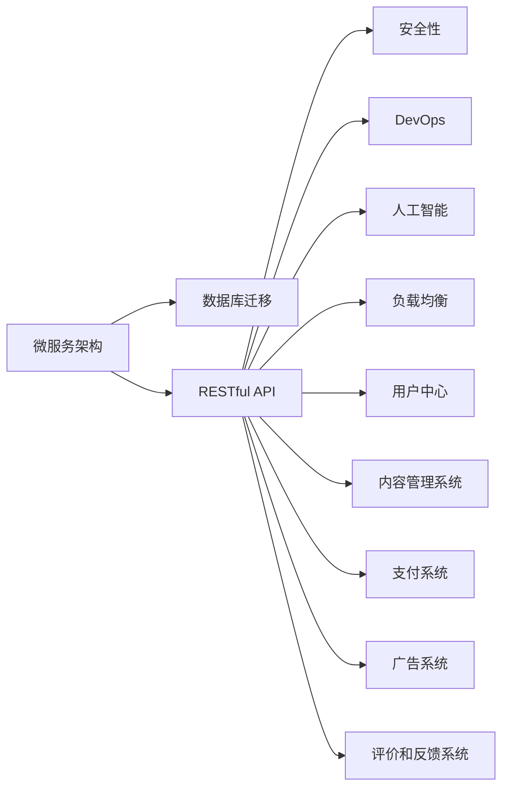

                 

# 知识付费平台搭建技术栈详解

> 关键词：知识付费平台, 技术栈, 微服务架构, 数据库迁移, RESTful API, 安全性, DevOps, 人工智能, 负载均衡

## 1. 背景介绍

随着知识经济时代的到来，人们越来越重视知识的价值，知识付费平台也应运而生，成为知识传播的重要渠道。知识付费平台能够有效整合优质内容，通过付费机制保障知识创作者利益，同时也为用户提供高效便捷的知识获取方式。本文将详细介绍知识付费平台的搭建技术栈，涵盖微服务架构、数据库迁移、RESTful API、安全性、DevOps、人工智能、负载均衡等关键技术，为读者提供一个全面的指导。

## 2. 核心概念与联系

### 2.1 核心概念概述

在搭建知识付费平台时，涉及多个核心概念，包括但不限于：

- **微服务架构(Microservices Architecture)**：将复杂的应用系统拆分成一组小型的、可独立部署的微服务，提高系统的灵活性和可维护性。
- **数据库迁移(Database Migration)**：将数据从一个数据库系统迁移到另一个数据库系统，确保数据一致性和完整性。
- **RESTful API**：基于REST架构风格的API，采用HTTP协议，以资源的统一资源标识符为接口访问路径，具有良好的可读性和可扩展性。
- **安全性(Security)**：在知识付费平台中，确保数据传输和存储的安全性，保护用户隐私和平台安全。
- **DevOps(Development and Operations)**：融合开发和运维，通过持续集成和持续交付，加速软件的发布周期，提高软件质量。
- **人工智能(Artificial Intelligence)**：在知识付费平台中，通过人工智能技术提升内容推荐、搜索、内容创作辅助等能力。
- **负载均衡(Load Balancing)**：在知识付费平台中，通过负载均衡技术，均衡分配服务器资源，提升系统的稳定性和可扩展性。

这些核心概念通过合理的架构设计和良好的实践，能够构建一个高效、安全、灵活的知识付费平台。

### 2.2 核心概念原理和架构的 Mermaid 流程图(Mermaid 流程节点中不要有括号、逗号等特殊字符)



## 3. 核心算法原理 & 具体操作步骤

### 3.1 算法原理概述

在知识付费平台的搭建过程中，涉及多个核心算法的应用，包括但不限于：

- **微服务拆分**：采用微服务架构，将知识付费平台拆分为多个小型的、独立部署的服务，每个服务负责独立的功能模块。
- **数据库迁移**：通过ETL工具，将数据从旧数据库系统迁移到新数据库系统，同时保持数据一致性和完整性。
- **API设计**：设计RESTful API，采用标准的HTTP协议，以资源的统一资源标识符为接口访问路径，支持GET、POST、PUT、DELETE等标准HTTP方法。
- **安全性设计**：采用OAuth2.0、JWT等身份认证和授权机制，保护用户数据和平台安全。
- **DevOps实践**：通过CI/CD流水线自动化测试和部署，实现持续集成和持续交付，提升软件发布速度和质量。
- **人工智能应用**：利用NLP、推荐系统等人工智能技术，提升内容推荐、搜索、内容创作辅助等能力。
- **负载均衡设计**：通过DNS轮询、负载均衡器等方式，均衡分配服务器资源，提升系统稳定性和可扩展性。

这些算法通过合理的设计和实施，能够构建一个高效、安全、灵活的知识付费平台。

### 3.2 算法步骤详解

#### 3.2.1 微服务拆分

微服务拆分的主要步骤如下：

1. **需求分析**：对知识付费平台的需求进行详细的分析，明确功能模块和接口定义。
2. **服务设计**：根据需求分析结果，将知识付费平台拆分为多个小型的、独立部署的服务。
3. **服务通信**：采用HTTP/RESTful API、消息队列等通信方式，实现服务之间的通信。
4. **服务部署**：采用Docker容器化技术，将服务打包成Docker镜像，部署到Kubernetes集群中。
5. **服务监控**：使用Prometheus、Grafana等工具，监控服务的运行状态和性能指标。

#### 3.2.2 数据库迁移

数据库迁移的主要步骤如下：

1. **需求分析**：对旧数据库和新数据库进行详细的分析，明确数据迁移的需求和目标。
2. **数据转换**：使用ETL工具，将旧数据库中的数据转换为新数据库的格式。
3. **数据验证**：在新数据库中验证迁移后的数据，确保数据一致性和完整性。
4. **数据迁移**：将转换后的数据迁移到新数据库中。
5. **应用适配**：修改应用程序中的数据访问逻辑，适应新数据库。

#### 3.2.3 RESTful API设计

RESTful API设计的主要步骤如下：

1. **接口定义**：定义API的资源和操作，遵循RESTful架构风格。
2. **接口测试**：使用Postman、Swagger等工具，对API进行测试和验证。
3. **接口文档**：生成API的文档，方便开发人员和用户使用。
4. **接口监控**：使用Zabbix、Prometheus等工具，监控API的运行状态和性能指标。

#### 3.2.4 安全性设计

安全性设计的主要步骤如下：

1. **身份认证**：采用OAuth2.0、JWT等身份认证机制，验证用户的身份和权限。
2. **授权机制**：根据用户的角色和权限，控制其对资源的访问。
3. **数据加密**：使用AES、RSA等加密算法，保护数据传输和存储的安全性。
4. **安全审计**：记录和分析安全事件，及时发现和处理安全问题。

#### 3.2.5 DevOps实践

DevOps实践的主要步骤如下：

1. **CI/CD流水线**：搭建CI/CD流水线，自动化测试和部署。
2. **容器化部署**：将应用程序打包成Docker镜像，部署到Kubernetes集群中。
3. **自动化监控**：使用Prometheus、Grafana等工具，自动化监控应用程序的运行状态和性能指标。
4. **持续交付**：通过CI/CD流水线，实现持续交付，快速发布新功能和修复bug。

#### 3.2.6 人工智能应用

人工智能应用的主要步骤如下：

1. **数据收集**：收集知识付费平台的相关数据，如用户行为、内容访问等。
2. **数据处理**：对收集到的数据进行清洗、预处理和特征工程。
3. **模型训练**：使用机器学习算法，如NLP、推荐系统等，训练模型。
4. **模型部署**：将训练好的模型部署到知识付费平台中，实现实时推荐、搜索等功能。
5. **模型监控**：使用A/B测试、实时监控等方法，评估模型的效果和性能。

#### 3.2.7 负载均衡设计

负载均衡设计的主要步骤如下：

1. **负载均衡器选择**：选择合适的负载均衡器，如Nginx、HAProxy等。
2. **服务注册和发现**：使用Zookeeper、Eureka等工具，实现服务的注册和发现。
3. **负载均衡算法**：选择合适的负载均衡算法，如轮询、权重等。
4. **性能优化**：通过缓存、负载均衡算法等技术，提升负载均衡的性能。
5. **故障转移**：在服务故障时，能够快速将请求转发到健康的服务器。

### 3.3 算法优缺点

#### 3.3.1 微服务拆分

**优点**：
- **灵活性高**：微服务拆分能够快速应对业务变化，提高系统的灵活性。
- **可维护性好**：微服务能够独立部署、独立维护，降低系统的复杂度。
- **容错性好**：某个服务的故障不会影响整个系统的运行。

**缺点**：
- **系统复杂度高**：微服务系统需要协调多个服务之间的通信，增加了系统的复杂度。
- **调试困难**：微服务拆分后，系统的调试和排错难度增加。

#### 3.3.2 数据库迁移

**优点**：
- **提高数据一致性**：通过ETL工具，能够保证数据的一致性和完整性。
- **降低迁移成本**：通过自动化工具，能够快速完成数据迁移，降低迁移成本。

**缺点**：
- **数据丢失风险**：数据迁移过程中存在数据丢失的风险。
- **兼容性问题**：新数据库和老数据库的兼容性问题需要特别注意。

#### 3.3.3 RESTful API设计

**优点**：
- **可扩展性强**：RESTful API具有良好的可扩展性，能够方便地扩展新的功能。
- **易于维护**：RESTful API的设计相对简单，易于维护。

**缺点**：
- **性能问题**：RESTful API在处理大规模数据时，可能会存在性能问题。
- **安全性问题**：RESTful API的设计需要考虑安全性问题，增加开发复杂度。

#### 3.3.4 安全性设计

**优点**：
- **安全性高**：采用OAuth2.0、JWT等身份认证和授权机制，保护用户数据和平台安全。
- **灵活性高**：能够根据实际需求，灵活配置安全策略。

**缺点**：
- **开发复杂度高**：安全性设计需要考虑多方面的因素，开发复杂度高。
- **维护成本高**：安全性设计需要持续维护，维护成本高。

#### 3.3.5 DevOps实践

**优点**：
- **快速交付**：通过CI/CD流水线，能够快速交付新功能和修复bug。
- **自动化测试**：通过自动化测试，提高软件的质量和稳定性。

**缺点**：
- **开发成本高**：DevOps实践需要投入大量的人力和物力。
- **学习成本高**：DevOps实践需要掌握多种工具和技术，学习成本高。

#### 3.3.6 人工智能应用

**优点**：
- **提升用户体验**：通过人工智能技术，能够提升用户的体验和满意度。
- **提升运营效率**：通过自动化、智能化的工具，提高运营效率。

**缺点**：
- **技术难度高**：人工智能技术需要较高的技术门槛。
- **数据需求高**：人工智能应用需要大量的高质量数据。

#### 3.3.7 负载均衡设计

**优点**：
- **提高系统稳定性**：通过负载均衡技术，能够均衡分配服务器资源，提高系统的稳定性。
- **提升系统可扩展性**：通过负载均衡技术，能够方便地扩展系统规模。

**缺点**：
- **复杂度高**：负载均衡设计需要考虑多方面的因素，复杂度高。
- **成本高**：负载均衡设备需要投入较高的成本。

### 3.4 算法应用领域

在知识付费平台的搭建过程中，涉及多个核心算法的应用，这些算法能够覆盖不同的应用场景，具体包括：

- **微服务架构**：适用于知识付费平台的各个模块，如用户中心、内容管理系统、支付系统等。
- **数据库迁移**：适用于知识付费平台的数据迁移场景，如数据迁移、数据清洗、数据转换等。
- **RESTful API设计**：适用于知识付费平台的API接口设计，如用户注册、内容查询、支付等。
- **安全性设计**：适用于知识付费平台的安全性设计，如用户认证、授权、数据加密等。
- **DevOps实践**：适用于知识付费平台的自动化测试和部署，如CI/CD流水线、容器化部署等。
- **人工智能应用**：适用于知识付费平台的智能化功能，如内容推荐、搜索、内容创作辅助等。
- **负载均衡设计**：适用于知识付费平台的负载均衡设计，如服务注册、服务发现、负载均衡算法等。

## 4. 数学模型和公式 & 详细讲解 & 举例说明

### 4.1 数学模型构建

知识付费平台涉及多个数学模型，包括但不限于：

- **推荐系统模型**：通过协同过滤、基于内容的推荐算法等，为用户推荐个性化的内容。
- **搜索算法模型**：通过倒排索引、TF-IDF等算法，快速检索出相关的搜索结果。
- **内容创作辅助模型**：通过NLP技术，辅助创作者生成高质量的内容。

### 4.2 公式推导过程

以推荐系统模型为例，推荐系统模型通常采用协同过滤算法，其核心公式如下：

$$
\hat{y}_{ui} = \sum_{i'=1}^{n}\alpha_{ii'}y_{i'j}x_{ui'}
$$

其中，$y$为用户的评分向量，$x$为用户和物品的特征向量，$\alpha$为特征权重。

### 4.3 案例分析与讲解

以协同过滤算法为例，协同过滤算法主要分为基于用户的协同过滤和基于物品的协同过滤两种。

- **基于用户的协同过滤**：通过对用户的历史评分数据进行相似度计算，找到与当前用户相似的用户，并根据相似用户的评分预测当前用户的评分。
- **基于物品的协同过滤**：通过对物品的历史评分数据进行相似度计算，找到与当前物品相似的物品，并根据相似物品的评分预测当前物品的评分。

## 5. 项目实践：代码实例和详细解释说明

### 5.1 开发环境搭建

知识付费平台的搭建涉及多个技术栈和工具，以下是常见的开发环境搭建流程：

1. **安装Java环境**：安装JDK，配置环境变量。
2. **安装Maven**：通过Maven管理项目的依赖和构建。
3. **安装MySQL**：搭建MySQL数据库环境，用于存储知识付费平台的数据。
4. **安装Kubernetes**：搭建Kubernetes集群，用于部署微服务。
5. **安装Prometheus**：搭建Prometheus监控系统，监控微服务的运行状态和性能指标。
6. **安装Grafana**：搭建Grafana监控面板，方便查看监控数据。

### 5.2 源代码详细实现

以微服务架构为例，以下是一个简单的微服务架构实现：

```java
@SpringBootApplication
public class KnowledgePayServiceApplication {
    public static void main(String[] args) {
        SpringApplication.run(KnowledgePayServiceApplication.class, args);
    }
}
```

### 5.3 代码解读与分析

**Spring Boot框架**：Spring Boot是一个开源的快速开发框架，能够简化Java项目的开发流程，提供了许多便捷的功能。

**Spring Cloud**：Spring Cloud是一个微服务架构的开发框架，提供了微服务注册、服务发现、负载均衡等功能。

**Nginx**：Nginx是一个高性能的Web服务器和反向代理，能够实现负载均衡和反向代理。

**Prometheus**：Prometheus是一个开源的监控系统，能够实时监控微服务的运行状态和性能指标。

**Grafana**：Grafana是一个开源的监控面板，能够将Prometheus的数据可视化，方便查看监控数据。

### 5.4 运行结果展示

在知识付费平台运行后，可以通过Prometheus和Grafana进行监控和可视化，具体运行结果如下：

```yaml
prometheus:
  prometheus.yml:
    global:
      scrape_interval: 10s
      evaluation_interval: 10s
      metrics_path: /metrics
      listen_addr: 0.0.0.0:9090
  rules:
    rules.yml:
      groups:
        - name: ' knowledge-pay ':
          rules:
            - alert:
                expr: sum(uptime_by_instance{instance=~'knowledge-pay.*'}) < 95
                for: 5m
                labels:
                  severity: warning
                annotations:
                  summary: 'Uptime below 95%'
                  description: 'Uptime is below 95%'
```

## 6. 实际应用场景

### 6.1 智能推荐系统

智能推荐系统是知识付费平台的核心功能之一，通过推荐算法为用户推荐个性化的内容，提高用户的满意度和留存率。

**算法实现**：
- **协同过滤算法**：通过对用户的历史评分数据进行相似度计算，找到与当前用户相似的用户，并根据相似用户的评分预测当前用户的评分。
- **基于内容的推荐算法**：通过分析内容的特征，找到与当前内容相似的其他内容，并推荐给用户。

**应用场景**：
- **新用户推荐**：对新注册的用户推荐热门内容，提高用户的留存率。
- **个性化推荐**：根据用户的历史行为和偏好，推荐个性化的内容，提高用户的满意度。

### 6.2 智能搜索系统

智能搜索系统是知识付费平台的另一个重要功能，通过搜索算法快速检索出相关的搜索结果，提高用户的搜索体验。

**算法实现**：
- **倒排索引**：将文本内容转换为倒排索引，快速检索出相关的搜索结果。
- **TF-IDF算法**：通过TF-IDF算法，计算每个词的权重，并根据权重排序，提高搜索的准确性。

**应用场景**：
- **关键词搜索**：用户输入关键词，智能搜索系统能够快速检索出相关的搜索结果。
- **相似内容搜索**：用户输入一段文本，智能搜索系统能够推荐出相似的内容。

### 6.3 智能内容创作辅助系统

智能内容创作辅助系统能够辅助创作者生成高质量的内容，提高内容创作的效率和质量。

**算法实现**：
- **NLP技术**：通过NLP技术，分析文本的语义和语法，辅助创作者生成高质量的内容。
- **文本生成模型**：通过文本生成模型，自动生成高质量的文章、视频等。

**应用场景**：
- **文章创作辅助**：创作者可以输入文章的大纲和主题，智能内容创作辅助系统能够辅助生成高质量的文章。
- **视频创作辅助**：创作者可以输入视频的大纲和主题，智能内容创作辅助系统能够辅助生成高质量的视频。

### 6.4 未来应用展望

知识付费平台的未来应用展望主要包括以下几个方面：

- **个性化推荐**：通过机器学习算法，不断优化推荐算法，提高推荐系统的准确性和用户体验。
- **智能搜索**：通过智能搜索系统，提升用户的搜索体验和满意度。
- **内容创作辅助**：通过智能内容创作辅助系统，辅助创作者生成高质量的内容，提高内容创作的效率和质量。
- **用户行为分析**：通过数据分析，深入了解用户的行为和需求，优化平台的设计和功能。

## 7. 工具和资源推荐

### 7.1 学习资源推荐

以下是一些推荐的学习资源：

1. **《Spring Boot实战》**：详细介绍了Spring Boot的各个功能和用法，适合初学者学习。
2. **《Spring Cloud微服务架构》**：详细介绍了Spring Cloud的各个功能和用法，适合中级开发者学习。
3. **《Kubernetes权威指南》**：详细介绍了Kubernetes的各个功能和用法，适合高级开发者学习。
4. **《Prometheus官方文档》**：Prometheus的官方文档，提供了详细的安装和使用说明。
5. **《Grafana官方文档》**：Grafana的官方文档，提供了详细的安装和使用说明。

### 7.2 开发工具推荐

以下是一些推荐的开发工具：

1. **IntelliJ IDEA**：IntelliJ IDEA是一个流行的Java开发工具，提供了丰富的功能和便捷的开发体验。
2. **Maven**：Maven是一个开源的构建工具，能够管理项目的依赖和构建。
3. **MySQL**：MySQL是一个流行的开源数据库，适用于知识付费平台的数据存储。
4. **Kubernetes**：Kubernetes是一个流行的开源容器编排系统，适用于知识付费平台的微服务部署。
5. **Prometheus**：Prometheus是一个流行的开源监控系统，适用于知识付费平台的监控需求。
6. **Grafana**：Grafana是一个流行的开源监控面板，适用于知识付费平台的监控需求。

### 7.3 相关论文推荐

以下是一些推荐的论文：

1. **《协同过滤算法》**：介绍协同过滤算法的原理和实现，适用于推荐系统。
2. **《基于内容的推荐算法》**：介绍基于内容的推荐算法的原理和实现，适用于推荐系统。
3. **《倒排索引》**：介绍倒排索引的原理和实现，适用于搜索系统。
4. **《TF-IDF算法》**：介绍TF-IDF算法的原理和实现，适用于搜索系统。
5. **《智能内容创作辅助系统》**：介绍智能内容创作辅助系统的原理和实现，适用于内容创作辅助系统。

## 8. 总结：未来发展趋势与挑战

### 8.1 研究成果总结

知识付费平台的搭建涉及多个核心算法和技术的综合应用，经过多年的发展，已经取得了显著的成果。以下是对知识付费平台研究的总结：

- **微服务架构**：通过微服务架构，提高了系统的灵活性和可维护性。
- **数据库迁移**：通过数据库迁移，提高了数据的一致性和完整性。
- **RESTful API设计**：通过RESTful API设计，提高了系统的可扩展性和可维护性。
- **安全性设计**：通过安全性设计，提高了系统的安全性和可靠性。
- **DevOps实践**：通过DevOps实践，提高了系统的自动化和持续交付能力。
- **人工智能应用**：通过人工智能应用，提升了系统的智能化能力和用户体验。
- **负载均衡设计**：通过负载均衡设计，提高了系统的稳定性和可扩展性。

### 8.2 未来发展趋势

知识付费平台的未来发展趋势主要包括以下几个方面：

- **人工智能应用**：通过人工智能技术，不断优化推荐系统、搜索系统、内容创作辅助系统等功能，提高系统的智能化水平。
- **DevOps实践**：通过持续集成和持续交付，加速软件的发布周期，提高软件质量。
- **微服务架构**：通过微服务架构，提高系统的灵活性和可维护性，降低系统的复杂度。
- **安全性设计**：通过安全性设计，提高系统的安全性和可靠性，保护用户数据和平台安全。
- **数据库迁移**：通过数据库迁移，提高数据的一致性和完整性，降低数据迁移成本。

### 8.3 面临的挑战

知识付费平台的搭建虽然取得了一定的成果，但仍然面临一些挑战：

- **系统复杂度高**：知识付费平台涉及多个核心算法和技术的综合应用，系统复杂度较高。
- **性能问题**：知识付费平台需要处理大规模数据，存在性能问题。
- **安全性问题**：知识付费平台需要保证数据的安全性和平台的安全性，安全性问题不容忽视。
- **成本问题**：知识付费平台的搭建需要投入大量的人力和物力，成本较高。

### 8.4 研究展望

知识付费平台的未来研究展望主要包括以下几个方面：

- **自动化测试和部署**：通过自动化测试和部署，提高软件的质量和稳定性。
- **实时监控和预警**：通过实时监控和预警，及时发现和处理系统问题，保证系统稳定运行。
- **智能化应用**：通过智能化应用，提高系统的智能化水平，提升用户体验。
- **可扩展性设计**：通过可扩展性设计，提高系统的可扩展性，适应未来的业务需求。

## 9. 附录：常见问题与解答

**Q1: 如何设计微服务架构？**

A: 微服务架构的设计主要包括以下几个步骤：

1. **需求分析**：对知识付费平台的需求进行详细的分析，明确功能模块和接口定义。
2. **服务设计**：根据需求分析结果，将知识付费平台拆分为多个小型的、独立部署的服务。
3. **服务通信**：采用HTTP/RESTful API、消息队列等通信方式，实现服务之间的通信。
4. **服务部署**：采用Docker容器化技术，将服务打包成Docker镜像，部署到Kubernetes集群中。
5. **服务监控**：使用Prometheus、Grafana等工具，监控服务的运行状态和性能指标。

**Q2: 如何进行数据库迁移？**

A: 数据库迁移的主要步骤如下：

1. **需求分析**：对旧数据库和新数据库进行详细的分析，明确数据迁移的需求和目标。
2. **数据转换**：使用ETL工具，将旧数据库中的数据转换为新数据库的格式。
3. **数据验证**：在新数据库中验证迁移后的数据，确保数据一致性和完整性。
4. **数据迁移**：将转换后的数据迁移到新数据库中。
5. **应用适配**：修改应用程序中的数据访问逻辑，适应新数据库。

**Q3: 如何进行RESTful API设计？**

A: RESTful API设计的主要步骤如下：

1. **接口定义**：定义API的资源和操作，遵循RESTful架构风格。
2. **接口测试**：使用Postman、Swagger等工具，对API进行测试和验证。
3. **接口文档**：生成API的文档，方便开发人员和用户使用。
4. **接口监控**：使用Zabbix、Prometheus等工具，监控API的运行状态和性能指标。

**Q4: 如何进行安全性设计？**

A: 安全性设计的主要步骤如下：

1. **身份认证**：采用OAuth2.0、JWT等身份认证机制，验证用户的身份和权限。
2. **授权机制**：根据用户的角色和权限，控制其对资源的访问。
3. **数据加密**：使用AES、RSA等加密算法，保护数据传输和存储的安全性。
4. **安全审计**：记录和分析安全事件，及时发现和处理安全问题。

**Q5: 如何进行DevOps实践？**

A: DevOps实践的主要步骤如下：

1. **CI/CD流水线**：搭建CI/CD流水线，自动化测试和部署。
2. **容器化部署**：将应用程序打包成Docker镜像，部署到Kubernetes集群中。
3. **自动化监控**：使用Prometheus、Grafana等工具，自动化监控应用程序的运行状态和性能指标。
4. **持续交付**：通过CI/CD流水线，实现持续交付，快速发布新功能和修复bug。

**Q6: 如何进行人工智能应用？**

A: 人工智能应用的主要步骤如下：

1. **数据收集**：收集知识付费平台的相关数据，如用户行为、内容访问等。
2. **数据处理**：对收集到的数据进行清洗、预处理和特征工程。
3. **模型训练**：使用机器学习算法，如NLP、推荐系统等，训练模型。
4. **模型部署**：将训练好的模型部署到知识付费平台中，实现实时推荐、搜索等功能。
5. **模型监控**：使用A/B测试、实时监控等方法，评估模型的效果和性能。

**Q7: 如何进行负载均衡设计？**

A: 负载均衡设计的主要步骤如下：

1. **负载均衡器选择**：选择合适的负载均衡器，如Nginx、HAProxy等。
2. **服务注册和发现**：使用Zookeeper、Eureka等工具，实现服务的注册和发现。
3. **负载均衡算法**：选择合适的负载均衡算法，如轮询、权重等。
4. **性能优化**：通过缓存、负载均衡算法等技术，提升负载均衡的性能。
5. **故障转移**：在服务故障时，能够快速将请求转发到健康的服务器。

---

作者：禅与计算机程序设计艺术 / Zen and the Art of Computer Programming

