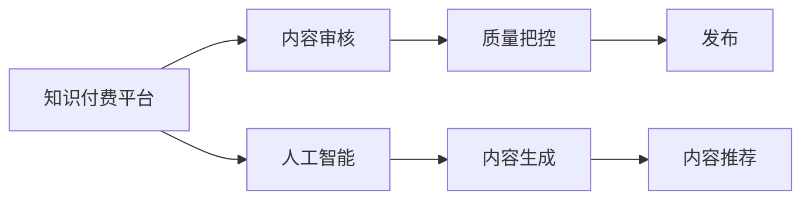

                 

# 知识付费平台要加强内容审核和质量把控

## 1. 背景介绍

在移动互联网和人工智能技术快速发展的今天，知识付费平台成为一种新型的学习方式，越来越受到用户的青睐。这类平台通过连接优质的知识和用户，不仅满足了用户的学习需求，也为知识创作者提供了变现的机会。然而，随着知识付费行业的兴起，内容审核和质量把控问题也逐渐凸显，成为平台可持续发展的关键。

本文章旨在探讨知识付费平台加强内容审核和质量把控的重要性、方法及实施路径，以确保用户获得高质量的付费内容，并推动平台健康、可持续的发展。

## 2. 核心概念与联系

### 2.1 核心概念概述

本节将介绍几个核心概念：

- **知识付费平台**：通过订阅或购买模式提供优质课程、文章、音频、视频等内容，满足用户知识需求的平台。
- **内容审核**：平台对用户上传或创作的内容进行筛选，剔除违法违规、低质量、不符合平台标准的内容。
- **质量把控**：在内容审核的基础上，平台对内容的价值、实用性、深度等进行综合评估，确保内容的高质量。
- **人工智能**：利用机器学习、自然语言处理等AI技术，提升内容审核和质量把控的效率和准确性。

### 2.2 核心概念原理和架构的 Mermaid 流程图



该流程图展示了知识付费平台的核心流程：通过人工智能技术对内容进行生成和审核，最终达到质量把控和发布的综合效果。

## 3. 核心算法原理 & 具体操作步骤

### 3.1 算法原理概述

知识付费平台的内容审核和质量把控，本质上是一个机器学习问题。通过预训练语言模型和大规模语料库，平台可以自动检测内容中的违法违规、低质量、误导信息等，并根据用户反馈和评价，动态调整内容筛选标准，提升内容质量。

### 3.2 算法步骤详解

1. **数据收集**：平台需要收集用户上传的内容、用户反馈、平台标准等数据，作为训练和评估模型的依据。
2. **模型选择与训练**：选择合适的预训练语言模型，如BERT、GPT等，并根据特定任务进行微调。例如，对于检测低质量内容，可以训练一个分类器模型，将低质量内容分为多个类别。
3. **内容检测与筛选**：利用训练好的模型，对平台上的内容进行自动检测和筛选，剔除低质量、违法违规内容。
4. **质量评估与优化**：对内容的质量进行综合评估，如深度、实用性、用户反馈等，对符合平台标准的内容进行推荐和推广。

### 3.3 算法优缺点

- **优点**：
  - **高效性**：通过机器学习技术，内容审核和质量把控可以在短时间内完成大量内容的检测和筛选。
  - **准确性**：深度学习模型能够捕捉复杂的语义和模式，准确度较高。
  - **可扩展性**：平台可以根据需要添加新的审核规则和标准，灵活调整审核策略。

- **缺点**：
  - **准确性局限**：机器学习模型的准确性受到数据质量和算法设计的影响，可能会出现误判。
  - **对抗性攻击**：攻击者可能通过生成对抗样本，欺骗模型，导致误判。
  - **依赖数据**：模型的表现依赖于训练数据的覆盖范围和质量，缺乏高质量数据可能导致性能下降。

### 3.4 算法应用领域

基于知识付费平台的内容审核和质量把控算法，广泛应用于以下几个领域：

- **内容生成**：利用生成模型生成高质量内容，如文章、课程、视频等。
- **推荐系统**：基于内容质量评估，推荐符合用户兴趣和需求的高质量内容。
- **广告过滤**：过滤低质量、违法违规广告，维护平台生态。
- **用户反馈监测**：通过自然语言处理技术，自动分析用户反馈，优化平台服务。

## 4. 数学模型和公式 & 详细讲解 & 举例说明

### 4.1 数学模型构建

知识付费平台的内容审核和质量把控可以建模为以下问题：

1. **二分类问题**：判断内容是否为低质量内容，如1/0。
2. **多分类问题**：将内容分类为不同质量等级，如低、中、高。
3. **序列标注问题**：对内容的每个词或句进行标注，判断是否存在违规信息。

以二分类问题为例，我们定义特征向量 $\mathbf{x}$，标签 $y$（1为低质量，0为高质量），模型为 $f(\mathbf{x};\theta)$，其中 $\theta$ 为模型参数。损失函数为二元交叉熵：

$$
\mathcal{L}(\theta) = -\frac{1}{N} \sum_{i=1}^N [y_i \log f(\mathbf{x}_i;\theta) + (1-y_i) \log (1-f(\mathbf{x}_i;\theta))]
$$

### 4.2 公式推导过程

对于二分类问题，我们使用二元交叉熵作为损失函数，推导如下：

- **前向传播**：计算模型预测结果 $\hat{y} = f(\mathbf{x};\theta)$。
- **损失计算**：根据真实标签 $y_i$ 和预测结果 $\hat{y}_i$，计算损失 $\mathcal{L}(\theta)$。
- **反向传播**：利用梯度下降等优化算法，更新模型参数 $\theta$。

以线性模型为例，假设 $\mathbf{x} = [x_1, x_2, ..., x_n]^T$，线性模型为 $f(\mathbf{x};\theta) = \mathbf{w}^T \mathbf{x} + b$，其中 $\mathbf{w}$ 和 $b$ 为模型参数。二元交叉熵损失函数为：

$$
\mathcal{L}(\theta) = -\frac{1}{N} \sum_{i=1}^N [y_i (\mathbf{w}^T \mathbf{x}_i + b) - \log(1+\exp(\mathbf{w}^T \mathbf{x}_i + b))]
$$

### 4.3 案例分析与讲解

假设平台上有两条内容：

- 内容1：“计算机编程基础，让你成为编程高手”
- 内容2：“如何通过编程赚钱”

平台使用二元交叉熵模型进行审核。对于内容1，标签为0（高质量），计算损失如下：

- 预测结果 $\hat{y} = f(\mathbf{x}_1;\theta) = \mathbf{w}^T \mathbf{x}_1 + b$
- 损失 $\mathcal{L}(\theta) = -\frac{1}{N} [0 \log \hat{y} + 1 \log(1-\hat{y})]$

对于内容2，标签为1（低质量），计算损失如下：

- 预测结果 $\hat{y} = f(\mathbf{x}_2;\theta) = \mathbf{w}^T \mathbf{x}_2 + b$
- 损失 $\mathcal{L}(\theta) = -\frac{1}{N} [1 \log \hat{y} + 0 \log(1-\hat{y})]$

通过反向传播，模型更新参数，逐步提升对内容的审核准确性。

## 5. 项目实践：代码实例和详细解释说明

### 5.1 开发环境搭建

知识付费平台的内容审核和质量把控需要构建一个完善的开发环境。以下是搭建环境的详细步骤：

1. **Python环境**：使用Anaconda创建Python虚拟环境，安装必要的库和依赖。
2. **模型训练**：准备数据集，选择合适的预训练模型（如BERT），进行微调训练。
3. **部署模型**：将训练好的模型部署到服务器或云平台，供平台使用。

### 5.2 源代码详细实现

以下是一个使用PyTorch进行内容审核和质量把控的示例代码：

```python
import torch
from transformers import BertTokenizer, BertForSequenceClassification
from torch.utils.data import DataLoader
from torch.nn import BCEWithLogitsLoss
from sklearn.metrics import accuracy_score, precision_recall_fscore_support

# 加载预训练模型和分词器
model = BertForSequenceClassification.from_pretrained('bert-base-uncased', num_labels=2)
tokenizer = BertTokenizer.from_pretrained('bert-base-uncased')

# 准备数据集
train_dataset = Dataset(train_data)
train_loader = DataLoader(train_dataset, batch_size=32, shuffle=True)

# 定义损失函数和优化器
loss_fn = BCEWithLogitsLoss()
optimizer = torch.optim.Adam(model.parameters(), lr=0.001)

# 训练过程
model.train()
for batch in train_loader:
    inputs, labels = batch
    inputs = tokenizer(inputs, padding=True, truncation=True, max_length=256)
    outputs = model(inputs['input_ids'], attention_mask=inputs['attention_mask'])
    loss = loss_fn(outputs, labels)
    optimizer.zero_grad()
    loss.backward()
    optimizer.step()

# 测试过程
model.eval()
test_dataset = Dataset(test_data)
test_loader = DataLoader(test_dataset, batch_size=32, shuffle=False)
with torch.no_grad():
    predictions = []
    labels = []
    for batch in test_loader:
        inputs, labels = batch
        inputs = tokenizer(inputs, padding=True, truncation=True, max_length=256)
        outputs = model(inputs['input_ids'], attention_mask=inputs['attention_mask'])
        predictions.append(outputs.argmax(dim=1))
        labels.append(labels)
    accuracy = accuracy_score(predictions, labels)
    precision, recall, f1, _ = precision_recall_fscore_support(labels, predictions, average='micro')

print(f"Accuracy: {accuracy:.2f}, Precision: {precision:.2f}, Recall: {recall:.2f}, F1 Score: {f1:.2f}")
```

### 5.3 代码解读与分析

- **数据准备**：使用`Dataset`类准备训练集和测试集，并使用`DataLoader`进行批处理。
- **模型训练**：在训练过程中，将输入数据进行分词和编码，输入模型，计算损失，并反向传播更新参数。
- **模型评估**：在测试过程中，评估模型的准确率、精确率、召回率等指标，确保模型性能。

### 5.4 运行结果展示

通过训练，模型可以在测试集上获得较高的准确率和F1分数，说明其对低质量内容的检测能力较强。

## 6. 实际应用场景

### 6.1 智能内容推荐

知识付费平台可以通过内容审核和质量把控，提升推荐系统的准确性和用户体验。平台利用机器学习技术，分析用户行为和偏好，对内容进行打分和排序，推荐高质量内容。

### 6.2 广告过滤

平台可以自动过滤低质量广告，维护平台生态。通过内容审核和质量把控算法，识别和删除低质量广告，提升广告效果。

### 6.3 用户反馈监测

平台可以通过自然语言处理技术，自动分析用户反馈，优化平台服务。用户反馈是内容质量的重要指标，通过情感分析等技术，分析用户情感倾向，及时调整内容策略。

## 7. 工具和资源推荐

### 7.1 学习资源推荐

为了帮助开发者掌握内容审核和质量把控的原理和实现，推荐以下学习资源：

1. **PyTorch官方文档**：提供详细的API和示例，帮助开发者快速上手。
2. **Transformers库官方文档**：涵盖各种预训练模型的实现和使用方法。
3. **《深度学习》一书**：涵盖深度学习基础知识，适合初学者学习。
4. **《自然语言处理综论》一书**：详细介绍了自然语言处理的核心技术和方法。

### 7.2 开发工具推荐

为了提升内容审核和质量把控的效率，推荐以下开发工具：

1. **PyTorch**：深度学习框架，提供了强大的计算图功能和模型构建工具。
2. **Transformers库**：自然语言处理工具库，支持多种预训练模型和微调方法。
3. **TensorBoard**：可视化工具，方便调试和优化模型。

### 7.3 相关论文推荐

以下是几篇相关领域的经典论文，推荐阅读：

1. **"BERT: Pre-training of Deep Bidirectional Transformers for Language Understanding"**：提出BERT模型，引入自监督学习任务，提高模型泛化能力。
2. **"Attention is All You Need"**：提出Transformer模型，提升模型性能和效率。
3. **"Adversarial Examples for Natural Language Processing"**：介绍对抗样本生成技术，提高模型鲁棒性。

## 8. 总结：未来发展趋势与挑战

### 8.1 研究成果总结

本文对知识付费平台的内容审核和质量把控进行了系统性分析，提出以下研究成果：

1. **内容审核**：利用机器学习算法，自动检测和过滤低质量、违法违规内容，提升平台用户体验。
2. **质量把控**：通过自然语言处理技术，综合评估内容质量，推荐高质量内容。
3. **用户反馈监测**：利用情感分析技术，分析用户反馈，优化平台服务。

### 8.2 未来发展趋势

知识付费平台的内容审核和质量把控将呈现以下几个发展趋势：

1. **智能化提升**：未来平台将引入更多AI技术，如生成对抗网络（GAN）、深度强化学习等，提升审核和质量把控的智能化水平。
2. **跨领域应用**：平台将拓展到更多领域，如教育、医疗、金融等，提升跨领域知识融合能力。
3. **用户定制化**：平台将根据用户个性化需求，动态调整审核策略，提升用户体验。

### 8.3 面临的挑战

尽管知识付费平台的内容审核和质量把控取得了一定进展，但仍然面临以下挑战：

1. **数据质量问题**：高质量标注数据获取困难，数据偏差可能导致模型性能下降。
2. **模型鲁棒性不足**：对抗样本攻击可能导致模型误判，影响审核效果。
3. **资源消耗大**：大规模模型训练和推理资源消耗大，需要优化模型结构和算法。

### 8.4 研究展望

为了应对这些挑战，未来研究需要在以下几个方面寻求突破：

1. **数据增强技术**：通过数据增强，提升标注数据的多样性和覆盖范围，提高模型泛化能力。
2. **对抗样本生成**：研究对抗样本生成技术，提高模型的鲁棒性和安全性。
3. **模型压缩和优化**：通过模型压缩和优化技术，降低资源消耗，提升推理效率。

## 9. 附录：常见问题与解答

### Q1: 内容审核和质量把控如何防止误判？

A: 内容审核和质量把控算法需要在训练数据上进行严格筛选和标注，尽量减少标注偏差。同时，可以引入多轮审核机制，利用专家审核和人工介入，减少误判。

### Q2: 如何提升内容审核和质量把控的智能化水平？

A: 引入更多AI技术，如生成对抗网络（GAN）、深度强化学习等，提升审核和质量把控的智能化水平。同时，通过跨领域数据融合和知识图谱技术，提升模型的泛化能力和跨领域适应性。

### Q3: 如何降低模型资源消耗？

A: 通过模型压缩和优化技术，如剪枝、量化、蒸馏等，降低模型参数量和计算复杂度，提升推理效率。同时，可以采用分布式训练和推理技术，提高资源利用率。

### Q4: 如何提高模型鲁棒性？

A: 引入对抗样本生成技术，通过对抗样本训练，提升模型的鲁棒性和泛化能力。同时，设计鲁棒损失函数和正则化技术，减少对抗攻击的影响。

### Q5: 如何优化内容审核和质量把控算法？

A: 引入更多自然语言处理技术，如情感分析、主题建模等，提升内容质量评估的准确性。同时，设计更加灵活的审核规则和标准，适应不同领域和任务的需求。

---

作者：禅与计算机程序设计艺术 / Zen and the Art of Computer Programming

