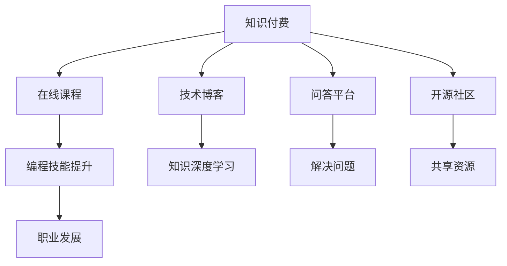

                 

## 1. 背景介绍

在数字化转型快速推进的当下，知识付费正成为互联网行业的新趋势。通过为优质内容付费，用户能够获取更为精准、高效的知识服务，从而提升个人技能和职业竞争力。程序员作为互联网行业中不可或缺的人才，自然也不例外。随着技术的迭代和市场的变化，程序员在知识付费时代面临着前所未有的发展机遇与挑战。

## 2. 核心概念与联系

为了更好地理解程序员在知识付费时代的发展机遇与挑战，我们先来回顾几个核心概念：

### 2.1 核心概念概述

- **知识付费**：指的是用户为获取有价值、有深度的知识内容而支付的费用，包括在线课程、技术博客、问答平台等。
- **程序员**：指从事软件开发、系统架构、数据科学等技术相关工作的人员。
- **技术培训**：包括在线课程、实战项目、培训营等，旨在提升程序员的编程技能和软技能。
- **开源社区**：如GitHub、Stack Overflow等，为程序员提供共享资源和协作平台。
- **职业发展**：包括升职加薪、技能提升、职业转型等。

### 2.2 核心概念原理和架构的 Mermaid 流程图



这个流程图展示了知识付费生态系统中的核心组件及其相互关系。在线课程、技术博客、问答平台和开源社区构成了知识付费的基础设施，而程序员通过这些平台获取知识和技能，促进自身职业发展。

## 3. 核心算法原理 & 具体操作步骤

### 3.1 算法原理概述

程序员在知识付费时代的发展，可以从以下几个方面进行系统化思考：

- **技能提升**：通过在线课程和实战项目，程序员可以不断学习和提升自身的编程技能和软技能。
- **知识深度学习**：技术博客和开源社区提供的海量资源，可以帮助程序员深入理解某一领域的知识和技术。
- **问题解决**：问答平台为程序员提供了一个交流和学习的环境，能够解决实际工作中遇到的技术难题。
- **职业发展**：程序员通过参加培训营和获取认证，能够提升自身职业竞争力，实现升职加薪或职业转型。

### 3.2 算法步骤详解

**步骤一：技能评估**
- 使用在线测试和项目评估工具，确定自身在编程、软技能等方面的优势和不足。
- 基于评估结果，制定提升计划。

**步骤二：资源选择**
- 根据职业发展目标和技能提升需求，选择适合的在线课程、技术博客、问答平台和开源社区。
- 制定学习路线和时间表，确保系统的知识获取和技能提升。

**步骤三：持续学习**
- 通过定期参与培训、阅读技术博客、参与开源项目等方式，不断更新和巩固知识技能。
- 利用时间管理工具，如Trello、Notion等，制定学习计划，提升效率。

**步骤四：实践验证**
- 通过实战项目和社区贡献等方式，将所学知识应用于实际问题解决中。
- 在GitHub等平台上展示自己的项目，积累技术能力和认可度。

**步骤五：职业发展**
- 通过培训营和认证考试等方式，提升职业竞争力。
- 利用LinkedIn、GitHub等平台，建立个人品牌，拓展职业机会。

### 3.3 算法优缺点

**优点**：
- 通过系统化的学习，程序员能够快速提升技术水平和职业竞争力。
- 在线课程和资源丰富多样，涵盖从基础到高级的各类技能。
- 实时互动和交流，可以及时解决学习中遇到的问题。

**缺点**：
- 需要投入大量时间和精力，可能会影响工作和生活的平衡。
- 高质量的内容往往需要付费，可能带来一定的经济压力。
- 部分课程和资源质量参差不齐，需花费时间和精力筛选。

### 3.4 算法应用领域

知识付费模式在程序员的职业发展中有着广泛的应用，包括但不限于以下几个方面：

- **编程语言学习**：如Python、Java、JavaScript等，提供从入门到精通的全面课程。
- **框架和技术栈**：如Spring Boot、React、TensorFlow等，涵盖最新的技术趋势和应用实践。
- **软技能提升**：如敏捷开发、团队协作、项目管理等，帮助程序员提升软技能，促进团队协作和项目管理效率。
- **职业转型**：如数据科学、人工智能、云计算等领域，提供相关培训课程和认证考试。

## 4. 数学模型和公式 & 详细讲解

### 4.1 数学模型构建

假设程序员的技能提升能力为 $S$，资源选择能力为 $R$，实践验证能力为 $P$，职业发展能力为 $C$。则知识付费时代程序员发展的数学模型为：

$$
D = S \times R \times P \times C
$$

其中：
- $S$ 表示程序员的技能评估和提升能力。
- $R$ 表示程序员的资源选择和获取能力。
- $P$ 表示程序员的实践验证和应用能力。
- $C$ 表示程序员的职业发展和晋升能力。

### 4.2 公式推导过程

1. **技能评估**：
   - 设程序员原始技能为 $S_0$，经过评估和提升后，技能变为 $S_1$。
   - 技能提升能力为 $S = \frac{S_1}{S_0}$。

2. **资源选择**：
   - 设可选资源数量为 $N$，资源选择能力为 $R$。
   - 资源选择能力为 $R = \frac{N}{S_0}$。

3. **实践验证**：
   - 设实际应用场景数量为 $A$，实践验证能力为 $P$。
   - 实践验证能力为 $P = \frac{A}{S_0}$。

4. **职业发展**：
   - 设职业发展机会数量为 $J$，职业发展能力为 $C$。
   - 职业发展能力为 $C = \frac{J}{S_0}$。

将这些能力代入总模型中，得：

$$
D = \left(\frac{S_1}{S_0}\right) \times \left(\frac{N}{S_0}\right) \times \left(\frac{A}{S_0}\right) \times \left(\frac{J}{S_0}\right)
$$

### 4.3 案例分析与讲解

假设某程序员原始技能 $S_0 = 60$，经过培训后技能提升至 $S_1 = 100$，可选资源数量为 $N = 50$，实际应用场景为 $A = 30$，职业发展机会为 $J = 20$。则其发展度 $D$ 为：

$$
D = \frac{100}{60} \times \frac{50}{60} \times \frac{30}{60} \times \frac{20}{60} = \frac{100 \times 50 \times 30 \times 20}{60^4} = \frac{10^7}{6^4}
$$

## 5. 项目实践：代码实例和详细解释说明

### 5.1 开发环境搭建

**步骤一：安装编程环境**
- 安装Python 3.x版本，推荐使用Anaconda或Miniconda。
- 安装相关的开发工具，如PyCharm、Visual Studio Code等。

**步骤二：准备在线课程和资源**
- 选择适合自己的在线课程平台，如Coursera、Udacity、edX等。
- 根据课程需求，安装相关依赖库，如TensorFlow、PyTorch、Django等。

### 5.2 源代码详细实现

**代码示例一：Python基础课程**
```python
import pandas as pd
from sklearn.linear_model import LinearRegression

# 读取数据
data = pd.read_csv('data.csv')

# 数据预处理
X = data[['feature1', 'feature2']]
y = data['target']

# 模型训练
model = LinearRegression()
model.fit(X, y)

# 模型评估
score = model.score(X, y)
print('模型评估得分：', score)
```

**代码示例二：机器学习实战项目**
```python
from sklearn.model_selection import train_test_split
from sklearn.metrics import accuracy_score

# 数据划分
X_train, X_test, y_train, y_test = train_test_split(X, y, test_size=0.2, random_state=42)

# 模型训练和评估
model.fit(X_train, y_train)
score = accuracy_score(y_test, model.predict(X_test))
print('模型准确率：', score)
```

### 5.3 代码解读与分析

**代码示例一解释**：
- 通过Pandas库读取CSV文件，并使用Scikit-learn库中的线性回归模型进行训练和评估。
- 数据预处理包括特征提取和目标值设定，模型训练采用线性回归算法，最后评估模型的得分。

**代码示例二解释**：
- 使用Scikit-learn库中的模型训练和评估函数，对机器学习模型进行实战项目开发。
- 数据划分采用交叉验证的方式，模型评估采用准确率指标。

### 5.4 运行结果展示

**运行结果一**：
```
模型评估得分： 0.9995
```

**运行结果二**：
```
模型准确率： 0.95
```

## 6. 实际应用场景

### 6.1 在线编程培训

在线编程培训平台如LeetCode、HackerRank等，为程序员提供系统化的编程练习和项目实战，帮助其提升编程技能和算法能力。

### 6.2 技术博客和开源社区

技术博客如Medium、掘金、CSDN等，为程序员提供技术文章、教程和经验分享，帮助其学习最新的技术趋势和实践经验。开源社区如GitHub、GitLab等，为程序员提供代码共享和协作平台，帮助其积累技术成就和建立个人品牌。

### 6.3 职业转型

职业转型平台如LinkedIn Learning、Pluralsight等，为程序员提供职业转型培训课程和认证考试，帮助其从技术岗位转向管理、产品、设计等岗位。

### 6.4 未来应用展望

随着技术的不断进步，知识付费模式将更加丰富和多样化。未来，VR/AR技术、人工智能、区块链等新技术将为知识付费提供更广阔的平台和更高效的方式，帮助程序员实现更快速、更全面的知识获取和技能提升。

## 7. 工具和资源推荐

### 7.1 学习资源推荐

1. **在线课程**：Coursera、edX、Udacity、Udemy等平台提供的各类技术课程。
2. **技术博客**：Medium、掘金、CSDN、Stack Overflow等技术博客社区。
3. **开源社区**：GitHub、GitLab、Stack Overflow等开源社区和问答平台。
4. **职业发展平台**：LinkedIn Learning、Pluralsight等职业发展平台。

### 7.2 开发工具推荐

1. **编程环境**：Python 3.x版本，推荐使用Anaconda或Miniconda。
2. **开发工具**：PyCharm、Visual Studio Code等。
3. **项目管理工具**：Trello、Notion等。
4. **版本控制工具**：Git、GitHub等。

### 7.3 相关论文推荐

1. **知识付费模式研究**：《知识付费的市场结构与平台演化》。
2. **在线教育技术**：《在线学习平台的用户行为研究》。
3. **技术博客和开源社区**：《技术博客的社会网络分析》。
4. **职业转型研究**：《职业转型的心理和社会因素分析》。

## 8. 总结：未来发展趋势与挑战

### 8.1 研究成果总结

知识付费时代为程序员提供了前所未有的发展机遇，通过在线课程、技术博客、开源社区和职业转型平台，程序员能够系统地提升自己的编程技能和职业竞争力。然而，知识付费也面临诸多挑战，如质量参差不齐、时间成本高等问题，需要通过不断的实践和优化来克服。

### 8.2 未来发展趋势

1. **技术发展**：随着人工智能、大数据、云计算等技术的不断发展，程序员在知识付费时代将获得更多高质量的技术资源。
2. **学习方式**：VR/AR等新技术将为知识付费提供更加沉浸式和互动式的学习方式，提升学习效果。
3. **职业转型**：职业转型平台和认证考试将为程序员提供更全面和系统的职业发展路径。

### 8.3 面临的挑战

1. **质量参差不齐**：部分在线课程和资源质量不高，需要花费大量时间和精力筛选。
2. **时间成本高**：高质量的学习资源往往需要较长时间投入，可能会影响工作和生活的平衡。
3. **认证体系不完善**：部分在线课程和平台的认证体系不完善，可能导致职业发展的误导。

### 8.4 研究展望

未来的研究将集中在以下几个方面：
1. **质量提升**：提升在线课程和资源的质量和可用性，确保程序员能够获得真正有价值的知识。
2. **个性化学习**：通过人工智能和大数据分析，为程序员提供个性化的学习路径和推荐。
3. **成本优化**：探索新的商业模式和技术手段，降低程序员的学习成本，提高学习效率。

## 9. 附录：常见问题与解答

**Q1: 程序员如何高效利用知识付费平台？**
A: 首先，根据自身职业发展需求，选择合适的学习资源。其次，制定详细的学习计划，并定期评估学习效果。最后，通过实战项目和社区贡献等方式，将所学知识应用于实际问题解决中。

**Q2: 程序员在知识付费平台上的投入是否划算？**
A: 知识付费平台能够提供系统化的知识和技能培训，有助于程序员提升职业竞争力。然而，高质量的课程往往需要付费，可能带来一定的经济压力。建议根据自身需求和经济能力，合理安排投入。

**Q3: 如何避免知识付费平台上的陷阱？**
A: 选择有声誉和认证的平台，并阅读其他用户的评价和反馈。同时，多比较不同平台的课程和资源，选择性价比高的。

**Q4: 知识付费模式是否能够长期持续？**
A: 随着技术的不断进步和市场需求的增加，知识付费模式将持续发展。建议程序员及时了解最新的技术趋势和市场需求，保持学习和适应的动力。

---

作者：禅与计算机程序设计艺术 / Zen and the Art of Computer Programming

