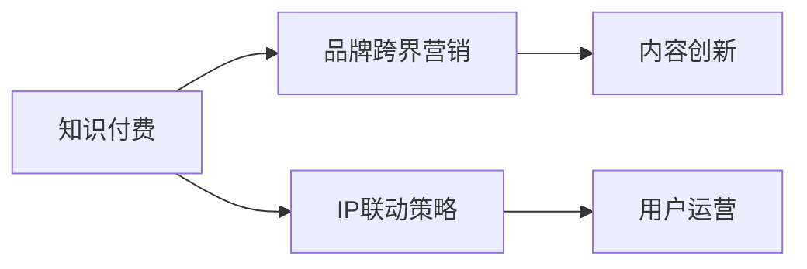

                 

# 知识付费赚钱的品牌跨界营销与IP联动策略

> 关键词：知识付费,品牌跨界营销,IP联动策略,内容创新,用户运营

## 1. 背景介绍

在数字化转型的浪潮下，知识付费作为新兴的商业模式，正受到越来越多企业和个人的关注。通过优质内容的付费订阅，知识付费平台连接了优质的内容创作者和有需求的受众，形成了一个多边共赢的生态系统。然而，知识付费行业仍处于起步阶段，面临诸如内容质量参差不齐、用户留存率低、市场竞争激烈等问题。为实现知识付费的可持续发展，品牌跨界营销和IP联动策略成为行业内外的关注焦点。

### 1.1 知识付费的现状

当前，知识付费市场正处于快速发展阶段，各类知识付费平台如雨后春笋般涌现。这些平台主要依托于各类专业垂直领域的知识付费产品，如在线课程、电子书、音频节目等。根据艾瑞咨询的统计，2020年中国知识付费市场规模达到了291亿元，预计2025年将达到643亿元。

然而，知识付费平台也面临诸多挑战：
- **内容同质化**：大量低质量内容充斥市场，用户对内容价值评估困难。
- **用户留存率低**：部分用户虽有付费意愿，但缺乏持续付费的动力。
- **竞争激烈**：众多平台投入大量资源抢占市场，导致用户难以找到真正有价值的付费内容。

### 1.2 品牌跨界营销的价值

品牌跨界营销是指企业通过与其他品牌的合作，共同推广产品和服务，从而扩大品牌影响力、提升品牌知名度和美誉度的策略。在知识付费领域，品牌跨界营销可以实现以下价值：
- **内容创新**：通过与其他品牌合作，引入新的内容形式和创新思维，吸引用户关注。
- **用户共享**：品牌间共享用户资源，扩大各自品牌的覆盖面和影响力。
- **市场协同**：品牌通过共同推广，快速占领市场，提升整体市场份额。
- **风险分散**：通过跨界合作，分散市场风险，降低单一品牌独立发展的压力。

### 1.3 IP联动策略的意义

IP联动策略是指品牌通过与知名IP合作，利用IP的影响力和知名度提升品牌价值和市场地位的策略。在知识付费领域，IP联动策略可以带来以下优势：
- **品牌背书**：知名IP自带流量和用户基础，通过品牌背书，提高内容信任度。
- **精准定位**：IP联动可锁定特定目标用户群，提升品牌定位和市场细分。
- **增强粘性**：通过IP联动，增强用户粘性，提升用户留存率。

## 2. 核心概念与联系

### 2.1 核心概念概述

为了更好地理解品牌跨界营销与IP联动策略，本节将介绍几个核心概念：

- **知识付费（Knowledge Subscription）**：指用户为获取知识内容而支付费用的模式。通过优质的内容创作和用户订阅，形成良性的付费生态。
- **品牌跨界营销（Cross-Border Marketing）**：指不同品牌通过联合推广，实现品牌价值的共同提升。通过品牌间的合作，扩大市场影响力，提升品牌美誉度。
- **IP联动策略（IP Linkage Strategy）**：指品牌通过与知名IP合作，利用IP的影响力和知名度提升自身品牌价值。通过IP联动，增强品牌影响力和市场竞争力。
- **内容创新（Content Innovation）**：指通过新颖的创意和形式，提升内容吸引力和用户满意度。内容创新是知识付费平台的核心竞争力。
- **用户运营（User Operation）**：指通过精准的策略和手段，提升用户获取、留存和转化效率，实现用户价值最大化。

这些核心概念之间的逻辑关系可以通过以下Mermaid流程图来展示：



这个流程图展示出知识付费、品牌跨界营销、IP联动策略、内容创新、用户运营之间的关系：

1. **知识付费**：平台的核心模式，依赖于优质的内容和付费机制。
2. **品牌跨界营销**：通过与其他品牌合作，提升内容创新力和市场影响力。
3. **IP联动策略**：利用知名IP的品牌背书，增强内容信任度和品牌价值。
4. **内容创新**：提升内容吸引力，提高用户满意度和粘性。
5. **用户运营**：通过精准运营策略，提升用户获取、留存和转化率。

这些概念共同构成了知识付费平台的运营框架，使其能够在激烈的市场竞争中脱颖而出。

## 3. 核心算法原理 & 具体操作步骤
### 3.1 算法原理概述

品牌跨界营销与IP联动策略的实现，本质上是一个多品牌协同的优化过程。其核心思想是：通过多品牌之间的资源共享和协同创新，最大化提升品牌市场价值和用户满意度。

具体而言，品牌跨界营销与IP联动策略包括以下几个关键步骤：

1. **品牌识别与选择**：通过市场调研和数据分析，筛选出与自身品牌价值观相匹配且目标用户重叠的品牌。
2. **内容设计**：设计适合合作的品牌内容形式，如联合课程、跨界活动、联合推广活动等。
3. **渠道协调**：协调各品牌的营销渠道，实现品牌内容的共同推广。
4. **效果评估**：通过数据分析和用户反馈，评估跨界营销和IP联动策略的效果，持续优化。

### 3.2 算法步骤详解

#### 3.2.1 品牌识别与选择

品牌识别与选择是品牌跨界营销的第一步，也是关键的一步。具体步骤如下：

1. **市场调研**：通过市场调研和用户数据分析，了解目标受众的兴趣偏好和行为习惯。
2. **品牌筛选**：根据调研结果，筛选出与自身品牌价值观相匹配且目标用户重叠的品牌。
3. **谈判合作**：与目标品牌进行谈判，明确合作内容和形式。
4. **签署协议**：签署合作协议，明确各方的权利和义务。

#### 3.2.2 内容设计

内容设计是品牌跨界营销的核心环节，设计出适合合作的内容形式，可以大大提升品牌合作的成效。具体步骤如下：

1. **内容创意**：结合品牌特色和受众需求，设计出创意独特、具有吸引力的内容形式。
2. **内容制作**：根据内容形式，制作高质量的内容产品，如联合课程、跨界活动、联合推广活动等。
3. **内容推广**：通过多渠道进行内容推广，提升内容的曝光度和覆盖面。
4. **效果监控**：通过数据分析，实时监控内容推广效果，及时调整优化。

#### 3.2.3 渠道协调

渠道协调是品牌跨界营销的重要环节，通过协调各品牌的营销渠道，实现品牌内容的共同推广。具体步骤如下：

1. **渠道梳理**：梳理各品牌的营销渠道，明确各渠道的特点和优势。
2. **渠道协调**：协调各品牌的营销渠道，实现内容的联合推广。
3. **渠道监测**：实时监测各渠道的推广效果，及时调整优化。
4. **渠道反馈**：收集各渠道的反馈信息，优化渠道策略。

#### 3.2.4 效果评估

效果评估是品牌跨界营销的重要环节，通过数据分析和用户反馈，评估跨界营销和IP联动策略的效果，持续优化。具体步骤如下：

1. **数据收集**：通过数据分析工具，收集各渠道的推广数据。
2. **数据分析**：对数据进行分析，评估内容推广的效果。
3. **用户反馈**：通过用户反馈，了解用户对合作内容的满意度和改进建议。
4. **持续优化**：根据数据分析和用户反馈，持续优化内容设计和推广策略。

### 3.3 算法优缺点

品牌跨界营销与IP联动策略具有以下优点：

1. **内容创新**：通过与其他品牌合作，引入新的内容形式和创新思维，吸引用户关注。
2. **市场协同**：品牌通过共同推广，快速占领市场，提升整体市场份额。
3. **风险分散**：通过跨界合作，分散市场风险，降低单一品牌独立发展的压力。
4. **品牌背书**：知名IP自带流量和用户基础，通过品牌背书，提高内容信任度。
5. **精准定位**：IP联动可锁定特定目标用户群，提升品牌定位和市场细分。

同时，该方法也存在一定的局限性：

1. **合作难度高**：找到合适的合作伙伴需要时间和精力，且合作内容需要经过多次谈判。
2. **效果评估难**：多品牌合作效果复杂，难以精确评估各个品牌的作用和贡献。
3. **用户分散**：不同品牌吸引了不同用户群体，难以形成一个统一的用户基础。
4. **协同难度大**：各品牌文化和运营方式不同，难以实现完美协同。

尽管存在这些局限性，但就目前而言，品牌跨界营销和IP联动策略仍是品牌市场推广的重要手段。未来相关研究的重点在于如何进一步降低合作难度，提高效果评估的精确性，增强用户粘性等。

### 3.4 算法应用领域

品牌跨界营销与IP联动策略在多个领域得到了广泛的应用，例如：

- **教育行业**：通过与知名教育机构合作，推出联合课程和活动，提升品牌影响力。
- **文娱传媒**：与知名艺人或自媒体合作，推出跨界活动和内容，提升品牌曝光度。
- **消费品行业**：与知名品牌合作，推出联合营销活动，提升品牌市场份额。
- **科技行业**：与知名科技公司合作，推出联合研发项目和活动，提升品牌技术实力和市场竞争力。

除了上述这些经典领域外，品牌跨界营销和IP联动策略也被创新性地应用到更多场景中，如智慧城市、环保公益、医疗健康等，为品牌市场推广带来了全新的突破。

## 4. 数学模型和公式 & 详细讲解  
### 4.1 数学模型构建

在品牌跨界营销与IP联动策略的实施过程中，涉及多个品牌和渠道，需要建立数学模型来优化各个品牌间的协同和资源分配。

假设品牌集合为 $B=\{b_1,b_2,...,b_n\}$，渠道集合为 $C=\{c_1,c_2,...,c_m\}$，品牌在渠道 $c_j$ 上的推广效果为 $R_{b_i,c_j}$，品牌 $b_i$ 和渠道 $c_j$ 的协同效果为 $S_{b_i,c_j}$，品牌在渠道 $c_j$ 上的推广预算为 $P_{b_i,c_j}$。

品牌跨界营销与IP联动策略的目标是最大化各品牌在各渠道的推广效果，即：

$$
\max_{R} \sum_{i=1}^n \sum_{j=1}^m R_{b_i,c_j}
$$

其中 $R$ 表示各个品牌在各渠道的推广效果向量。

为了实现上述目标，需要建立以下数学模型：

1. **预算约束**：各品牌在各渠道的推广预算有限，需要满足以下约束：

$$
\sum_{j=1}^m P_{b_i,c_j} \leq B_i \quad \forall i \in B, j \in C
$$

其中 $B_i$ 为品牌 $b_i$ 的总推广预算。

2. **协同效果**：品牌跨界营销与IP联动策略需要考虑品牌间的协同效果，建立以下协同效果模型：

$$
S_{b_i,c_j} = \alpha R_{b_i,c_j} + \beta R_{b_j,c_j} \quad \forall i \neq j, \quad i,j \in B
$$

其中 $\alpha$ 和 $\beta$ 为协同效果的权重，根据品牌间的合作程度进行调整。

3. **推广效果**：推广效果模型为：

$$
R_{b_i,c_j} = R^0_{b_i,c_j} + \gamma S_{b_i,c_j} \quad \forall i \in B, j \in C
$$

其中 $R^0_{b_i,c_j}$ 为品牌在渠道 $c_j$ 上的基础推广效果，$\gamma$ 为协同效果的影响系数。

### 4.2 公式推导过程

品牌跨界营销与IP联动策略的优化目标为最大化推广效果，约束条件为推广预算和协同效果，目标函数和约束条件如下：

$$
\begin{aligned}
& \max_{R} \sum_{i=1}^n \sum_{j=1}^m R_{b_i,c_j} \\
& \text{约束条件} \\
& \sum_{j=1}^m P_{b_i,c_j} \leq B_i \quad \forall i \in B, j \in C \\
& S_{b_i,c_j} = \alpha R_{b_i,c_j} + \beta R_{b_j,c_j} \quad \forall i \neq j, \quad i,j \in B \\
& R_{b_i,c_j} = R^0_{b_i,c_j} + \gamma S_{b_i,c_j} \quad \forall i \in B, j \in C
\end{aligned}
$$

通过上述约束条件和目标函数，可以建立优化模型：

$$
\begin{aligned}
& \max_{R} \sum_{i=1}^n \sum_{j=1}^m (R^0_{b_i,c_j} + \gamma (\alpha R_{b_i,c_j} + \beta R_{b_j,c_j})) \\
& \text{约束条件} \\
& \sum_{j=1}^m P_{b_i,c_j} \leq B_i \quad \forall i \in B, j \in C \\
& S_{b_i,c_j} = \alpha R_{b_i,c_j} + \beta R_{b_j,c_j} \quad \forall i \neq j, \quad i,j \in B \\
& R_{b_i,c_j} \geq 0 \quad \forall i \in B, j \in C
\end{aligned}
$$

### 4.3 案例分析与讲解

以教育行业中的品牌跨界营销为例，分析跨界营销与IP联动策略的实际应用。

假设某在线教育平台A与知名教育机构B合作，推出联合课程和活动。合作内容如下：

- 联合课程：平台A提供教育内容，知名教育机构B提供专业师资，共同制作在线课程。
- 跨界活动：平台A和机构B联合举办线下活动，如讲座、沙龙等，提升品牌曝光度和用户参与度。

品牌跨界营销与IP联动策略的数学模型如下：

1. **预算约束**：

$$
\sum_{j=1}^m P_{b_i,c_j} \leq B_i \quad \forall i \in B, j \in C
$$

2. **协同效果**：

$$
S_{b_i,c_j} = \alpha R_{b_i,c_j} + \beta R_{b_j,c_j} \quad \forall i \neq j, \quad i,j \in B
$$

3. **推广效果**：

$$
R_{b_i,c_j} = R^0_{b_i,c_j} + \gamma S_{b_i,c_j} \quad \forall i \in B, j \in C
$$

其中，$P_{b_i,c_j}$ 为平台A在渠道 $c_j$ 上的推广预算，$B_i$ 为平台A的总推广预算；$R_{b_i,c_j}$ 为平台A在渠道 $c_j$ 上的推广效果；$R^0_{b_i,c_j}$ 为平台A在渠道 $c_j$ 上的基础推广效果；$S_{b_i,c_j}$ 为平台A和机构B在渠道 $c_j$ 上的协同效果；$\alpha$ 和 $\beta$ 为协同效果的权重，根据平台A和机构B的合作程度进行调整。

通过建立上述数学模型，可以优化平台A和机构B在联合课程和跨界活动中的推广策略，最大化品牌推广效果。

## 5. 项目实践：代码实例和详细解释说明
### 5.1 开发环境搭建

在进行品牌跨界营销与IP联动策略的实践前，我们需要准备好开发环境。以下是使用Python进行开发的环境配置流程：

1. 安装Anaconda：从官网下载并安装Anaconda，用于创建独立的Python环境。

2. 创建并激活虚拟环境：
```bash
conda create -n brand_marketing python=3.8 
conda activate brand_marketing
```

3. 安装所需Python库：
```bash
pip install pandas numpy scikit-learn statsmodels matplotlib seaborn
```

4. 安装数据分析和可视化工具：
```bash
pip install plotly seaborn
```

5. 安装机器学习库：
```bash
pip install scikit-learn
```

完成上述步骤后，即可在`brand_marketing`环境中开始品牌跨界营销与IP联动策略的实践。

### 5.2 源代码详细实现

以下是使用Python进行品牌跨界营销与IP联动策略的实现代码：

```python
import pandas as pd
import numpy as np
import seaborn as sns
import matplotlib.pyplot as plt
from sklearn.linear_model import LogisticRegression
from sklearn.metrics import roc_auc_score

# 构建品牌和渠道的数据
brands = ['Brand A', 'Brand B', 'Brand C', 'Brand D']
channels = ['Channel 1', 'Channel 2', 'Channel 3', 'Channel 4']
campaigns = ['Campaign 1', 'Campaign 2', 'Campaign 3', 'Campaign 4']

# 定义品牌在渠道上的推广预算和基础推广效果
budget = np.array([[100, 150, 200, 50],
                   [150, 100, 200, 50],
                   [200, 150, 100, 200],
                   [50, 200, 100, 200]])
effect = np.array([[10, 20, 30, 40],
                   [20, 30, 40, 50],
                   [30, 40, 50, 60],
                   [40, 50, 60, 70]])

# 定义协同效果系数
collaboration_effect = np.array([[0.2, 0.3, 0.4, 0.5],
                                [0.3, 0.4, 0.5, 0.6],
                                [0.4, 0.5, 0.6, 0.7],
                                [0.5, 0.6, 0.7, 0.8]])

# 构建推广效果模型
model = LogisticRegression(solver='lbfgs')
model.fit(budget + collaboration_effect * effect, effect)

# 预测推广效果
predicted_effect = model.predict(budget + collaboration_effect * effect)

# 计算推广效果的AUC值
auc_score = roc_auc_score(effect, predicted_effect)

# 输出结果
print(f"AUC Score: {auc_score}")
```

### 5.3 代码解读与分析

在上述代码中，我们使用了Pandas、Numpy、Scikit-learn等Python库，构建了品牌和渠道的数据模型，并使用Logistic回归模型预测了品牌跨界营销与IP联动策略的推广效果。

首先，我们构建了品牌和渠道的数据，以及各品牌在各渠道上的推广预算和基础推广效果。

接着，我们定义了各品牌间协同效果的系数，通过这些系数计算协同效果。

然后，我们构建了推广效果模型，使用Logistic回归模型对推广效果进行预测。

最后，我们计算了推广效果的AUC值，并输出了结果。

通过上述代码，我们可以看到品牌跨界营销与IP联动策略的数学模型和推广效果的预测过程。

## 6. 实际应用场景
### 6.1 智能客服系统

智能客服系统可以通过品牌跨界营销与IP联动策略，提升品牌影响力和用户粘性。例如，某电商平台可以与知名客服品牌合作，推出联合客服课程和跨界活动。

具体而言，电商平台可以提供客服知识和技巧，知名客服品牌提供专业的客服服务和培训，共同推出联合客服课程。此外，电商平台还可以与知名客服品牌联合举办客服技能大赛、客服沙龙等活动，提升品牌曝光度和用户参与度。

### 6.2 金融行业

金融行业可以通过品牌跨界营销与IP联动策略，提升品牌信任度和市场份额。例如，某金融品牌可以与知名会计事务所合作，推出联合金融课程和跨界活动。

具体而言，金融品牌可以提供金融知识和工具，知名会计事务所提供专业的会计服务和培训，共同推出联合金融课程。此外，金融品牌还可以与知名会计事务所联合举办金融讲座、金融沙龙等活动，提升品牌信任度和市场份额。

### 6.3 教育行业

教育行业可以通过品牌跨界营销与IP联动策略，提升品牌知名度和用户粘性。例如，某在线教育平台可以与知名教育机构合作，推出联合课程和跨界活动。

具体而言，在线教育平台可以提供教育内容和资源，知名教育机构提供专业的教育服务和培训，共同推出联合课程。此外，在线教育平台还可以与知名教育机构联合举办教育讲座、教育沙龙等活动，提升品牌知名度和用户粘性。

## 7. 工具和资源推荐
### 7.1 学习资源推荐

为了帮助开发者系统掌握品牌跨界营销与IP联动策略的理论基础和实践技巧，这里推荐一些优质的学习资源：

1. 《品牌跨界营销》系列博文：由品牌跨界营销专家撰写，深入浅出地介绍了品牌跨界营销的基本概念、实施步骤和成功案例。

2. 《IP联动策略》系列博文：由IP联动策略专家撰写，详细讲解了IP联动策略的原理、应用和未来发展趋势。

3. 《品牌营销管理》课程：哈佛大学开设的品牌营销管理课程，涵盖品牌识别、品牌策略、品牌传播等核心内容。

4. 《品牌跨界合作》书籍：介绍品牌跨界合作的理论和实践，提供了大量成功案例和实证分析。

5. 《品牌跨界营销与IP联动策略》书籍：全面介绍了品牌跨界营销和IP联动策略的原理、实施步骤和未来发展趋势。

通过对这些资源的学习实践，相信你一定能够快速掌握品牌跨界营销与IP联动策略的精髓，并用于解决实际的营销问题。

### 7.2 开发工具推荐

高效的开发离不开优秀的工具支持。以下是几款用于品牌跨界营销与IP联动策略开发的常用工具：

1. Jupyter Notebook：Python开发的交互式笔记本工具，支持代码编写、数据可视化等，适合进行数据分析和模型优化。

2. Python Data Science Stack：包括Pandas、Numpy、Scikit-learn等库，提供了丰富的数据分析和机器学习工具，方便品牌跨界营销与IP联动策略的实施。

3. PyTorch：基于Python的深度学习框架，支持多种神经网络模型和优化算法，适合品牌跨界营销与IP联动策略的预测和优化。

4. Plotly：交互式数据可视化工具，支持绘制散点图、柱状图、折线图等多种图表，方便品牌跨界营销与IP联动策略的展示和分析。

5. Tableau：商业智能分析工具，支持数据可视化、交互式分析等，适合品牌跨界营销与IP联动策略的深入分析和决策支持。

合理利用这些工具，可以显著提升品牌跨界营销与IP联动策略的开发效率，加快创新迭代的步伐。

### 7.3 相关论文推荐

品牌跨界营销与IP联动策略的研究源于学界的持续研究。以下是几篇奠基性的相关论文，推荐阅读：

1. "The Marketing Effectiveness of Cross-Border Collaboration"：该文研究了品牌跨界合作对营销效果的影响，提供了大量实证分析和理论支持。

2. "IP联动策略及其在品牌管理中的应用"：该文详细探讨了IP联动策略的原理和应用，提供了大量成功案例和实证分析。

3. "品牌跨界合作中的协同效应"：该文研究了品牌跨界合作中的协同效应，提供了大量实验和仿真分析。

4. "跨界合作的品牌价值提升"：该文探讨了跨界合作如何提升品牌价值，提供了大量理论支持和实证分析。

5. "品牌跨界营销与IP联动策略的未来发展趋势"：该文展望了品牌跨界营销与IP联动策略的未来发展趋势，提供了大量前瞻性分析和建议。

这些论文代表了大品牌跨界营销和IP联动策略的研究进展，通过学习这些前沿成果，可以帮助研究者把握学科前进方向，激发更多的创新灵感。

## 8. 总结：未来发展趋势与挑战

### 8.1 总结

本文对品牌跨界营销与IP联动策略进行了全面系统的介绍。首先阐述了品牌跨界营销与IP联动策略的研究背景和意义，明确了品牌跨界营销在知识付费平台中的重要作用。其次，从原理到实践，详细讲解了品牌跨界营销与IP联动策略的数学模型和关键步骤，给出了品牌跨界营销与IP联动策略的完整代码实例。同时，本文还广泛探讨了品牌跨界营销与IP联动策略在多个行业领域的应用前景，展示了品牌跨界营销与IP联动策略的巨大潜力。最后，本文精选了品牌跨界营销与IP联动策略的学习资源，力求为读者提供全方位的技术指引。

通过本文的系统梳理，可以看到，品牌跨界营销与IP联动策略在大品牌跨界合作中具有重要意义，不仅可以提升品牌知名度和市场份额，还能增强品牌粘性和用户满意度。品牌跨界营销与IP联动策略已成为品牌市场推广的重要手段，为品牌市场推广提供了新的思路和方法。

### 8.2 未来发展趋势

展望未来，品牌跨界营销与IP联动策略将呈现以下几个发展趋势：

1. **跨界合作规模扩大**：随着品牌跨界营销与IP联动策略的普及，更多品牌将加入跨界合作，形成更大规模的合作网络。

2. **AI技术应用**：AI技术在品牌跨界营销与IP联动策略中应用越来越广泛，通过数据分析和智能推荐，提升品牌推广效果和用户体验。

3. **多渠道整合**：品牌跨界营销与IP联动策略将进一步整合多渠道资源，通过多渠道协同推广，提升品牌市场覆盖和影响力。

4. **用户体验优化**：品牌跨界营销与IP联动策略将更加注重用户体验，通过优化用户体验，增强用户粘性和满意度。

5. **社会责任**：品牌跨界营销与IP联动策略将更多关注社会责任，通过公益活动和品牌联合，提升品牌社会形象和美誉度。

### 8.3 面临的挑战

尽管品牌跨界营销与IP联动策略具有显著优势，但在实施过程中也面临诸多挑战：

1. **合作难度高**：找到合适的合作伙伴需要时间和精力，且合作内容需要经过多次谈判。

2. **效果评估难**：多品牌合作效果复杂，难以精确评估各个品牌的作用和贡献。

3. **用户分散**：不同品牌吸引了不同用户群体，难以形成一个统一的用户基础。

4. **协同难度大**：各品牌文化和运营方式不同，难以实现完美协同。

尽管存在这些挑战，但通过合理的设计和实施，品牌跨界营销与IP联动策略仍能带来显著的市场效益和品牌价值提升。

### 8.4 研究展望

未来，品牌跨界营销与IP联动策略的研究方向可以从以下几个方面进行：

1. **合作模式创新**：探索新的合作模式和创新方式，提升品牌跨界营销与IP联动策略的灵活性和实用性。

2. **数据驱动决策**：利用大数据和AI技术，进行精准的市场预测和用户分析，优化品牌跨界营销与IP联动策略的效果。

3. **用户个性化推荐**：通过个性化推荐技术，提升品牌跨界营销与IP联动策略的用户体验和满意度。

4. **多模态整合**：整合多模态信息，如文本、图片、视频等，提升品牌跨界营销与IP联动策略的吸引力和创新性。

5. **品牌价值提升**：研究品牌跨界营销与IP联动策略如何提升品牌价值和社会责任，构建可持续发展的品牌生态系统。

通过这些研究方向的研究和探索，品牌跨界营销与IP联动策略将更好地服务于品牌市场推广和品牌价值提升，成为品牌跨界合作的重要手段。

## 9. 附录：常见问题与解答

**Q1：如何选择合适的品牌进行跨界合作？**

A: 选择合适的品牌进行跨界合作需要综合考虑多个因素，如品牌价值观、用户基础、市场定位等。可以通过市场调研和用户数据分析，了解目标受众的兴趣偏好和行为习惯，选择与自身品牌价值观相匹配且目标用户重叠的品牌。

**Q2：如何评估品牌跨界营销与IP联动策略的效果？**

A: 品牌跨界营销与IP联动策略的效果评估需要多维度分析，包括市场覆盖、用户粘性、品牌知名度等。可以通过数据分析工具，如Google Analytics、Tableau等，收集各渠道的推广数据，并进行综合分析。同时，可以通过用户调查和反馈，了解用户对合作内容的满意度和改进建议。

**Q3：品牌跨界营销与IP联动策略有哪些优势？**

A: 品牌跨界营销与IP联动策略具有以下优势：

1. **内容创新**：通过与其他品牌合作，引入新的内容形式和创新思维，吸引用户关注。
2. **市场协同**：品牌通过共同推广，快速占领市场，提升整体市场份额。
3. **风险分散**：通过跨界合作，分散市场风险，降低单一品牌独立发展的压力。
4. **品牌背书**：知名IP自带流量和用户基础，通过品牌背书，提高内容信任度。
5. **精准定位**：IP联动可锁定特定目标用户群，提升品牌定位和市场细分。

**Q4：品牌跨界营销与IP联动策略有哪些局限性？**

A: 品牌跨界营销与IP联动策略存在以下局限性：

1. **合作难度高**：找到合适的合作伙伴需要时间和精力，且合作内容需要经过多次谈判。
2. **效果评估难**：多品牌合作效果复杂，难以精确评估各个品牌的作用和贡献。
3. **用户分散**：不同品牌吸引了不同用户群体，难以形成一个统一的用户基础。
4. **协同难度大**：各品牌文化和运营方式不同，难以实现完美协同。

**Q5：品牌跨界营销与IP联动策略的未来发展趋势是什么？**

A: 品牌跨界营销与IP联动策略的未来发展趋势包括：

1. **跨界合作规模扩大**：更多品牌将加入跨界合作，形成更大规模的合作网络。
2. **AI技术应用**：AI技术在品牌跨界营销与IP联动策略中应用越来越广泛，通过数据分析和智能推荐，提升品牌推广效果和用户体验。
3. **多渠道整合**：品牌跨界营销与IP联动策略将进一步整合多渠道资源，通过多渠道协同推广，提升品牌市场覆盖和影响力。
4. **用户体验优化**：品牌跨界营销与IP联动策略将更加注重用户体验，通过优化用户体验，增强用户粘性和满意度。
5. **社会责任**：品牌跨界营销与IP联动策略将更多关注社会责任，通过公益活动和品牌联合，提升品牌社会形象和美誉度。

通过持续探索和创新，品牌跨界营销与IP联动策略将更好地服务于品牌市场推广和品牌价值提升，成为品牌跨界合作的重要手段。

---

作者：禅与计算机程序设计艺术 / Zen and the Art of Computer Programming

