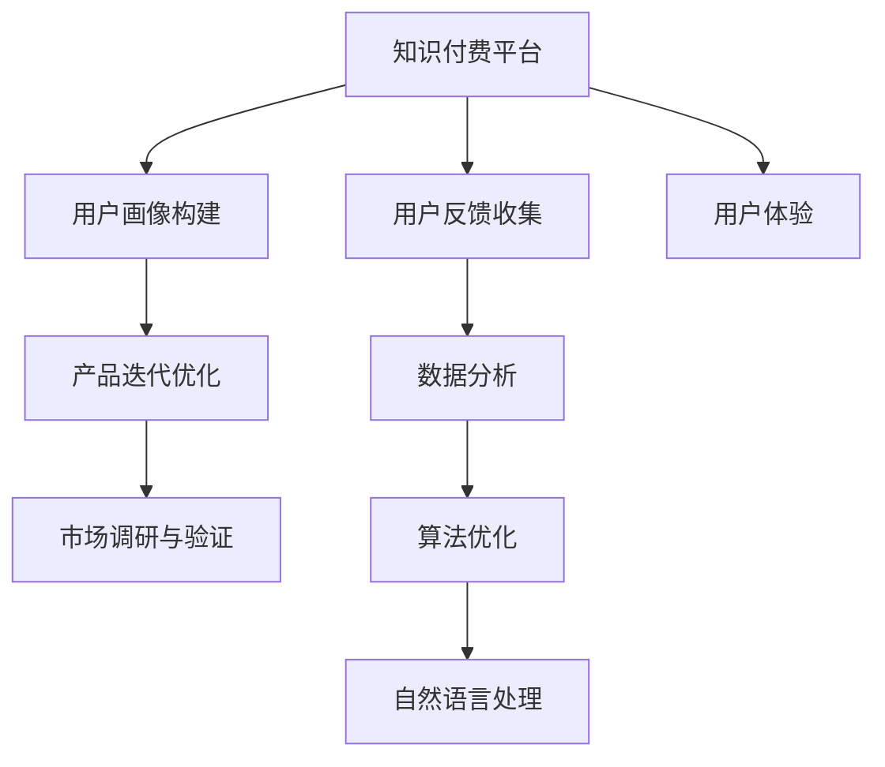

                 

# 知识付费赚钱的用户反馈收集与产品迭代

> 关键词：知识付费,用户反馈,产品迭代,市场调研,用户体验,数据挖掘,算法优化,深度学习,自然语言处理

## 1. 背景介绍

### 1.1 问题由来

在互联网信息爆炸的今天，知识付费成为了一种新型的内容消费模式，特别是在教育、职业技能培训、健康生活指导等领域，用户愿意为获取专业知识和经验支付费用。这种模式不仅提高了内容的价值，也促进了知识创作者和传播者的收益。然而，知识付费产品的成功与否，很大程度上依赖于用户体验和产品迭代，用户反馈作为重要的指导依据，在产品优化和市场调整中起到了举足轻重的作用。

### 1.2 问题核心关键点

知识付费产品的核心在于提供高质量、有价值的内容，并结合用户行为数据分析，不断优化内容推荐、课程设计等，以提高用户满意度和续订率。用户反馈收集与产品迭代是实现这一目标的关键步骤。具体来说，关键点包括：

1. **用户反馈收集**：从用户互动、课程评价、使用行为等多个维度收集用户的反馈信息。
2. **用户画像构建**：基于收集到的反馈数据，构建用户画像，分析用户需求和行为特征。
3. **产品迭代优化**：根据用户画像和反馈信息，对产品进行功能升级和体验优化。
4. **市场调研与验证**：通过市场调研和A/B测试等手段，验证产品改进的效果。

## 2. 核心概念与联系

### 2.1 核心概念概述

为更好地理解用户反馈收集与产品迭代方法，本节将介绍几个密切相关的核心概念：

- **知识付费平台**：提供高质量付费课程和内容，结合人工智能、数据分析等技术，提高用户满意度和运营效率。
- **用户反馈**：用户在使用产品过程中，对内容和功能表达的意见、建议和投诉，包括文字评价、打分、反馈问卷等。
- **产品迭代**：基于用户反馈和数据分析，对知识付费产品进行功能增强、界面优化、内容更新等持续改进的过程。
- **用户画像**：通过用户行为数据分析，构建用户特征和需求画像，为产品设计和优化提供依据。
- **市场调研**：通过调查问卷、用户访谈、竞品分析等方式，了解市场需求和用户偏好，指导产品策略。
- **用户体验(UX)**：产品设计中关注用户使用体验，优化交互流程、界面美观、功能易用性等。

这些核心概念之间的逻辑关系可以通过以下Mermaid流程图来展示：



这个流程图展示了一体化知识付费平台的反馈与迭代过程：

1. 知识付费平台收集用户反馈。
2. 基于反馈数据构建用户画像。
3. 根据用户画像进行产品优化和功能增强。
4. 通过市场调研验证产品改进效果。
5. 结合数据分析和算法优化，提升用户体验。
6. 结合自然语言处理技术，智能化分析用户反馈。

## 3. 核心算法原理 & 具体操作步骤

### 3.1 算法原理概述

知识付费产品的用户反馈收集与产品迭代，本质上是一个基于数据驱动的持续优化过程。其核心思想是：通过收集用户反馈，结合数据分析和用户画像，识别出产品的优点和不足，进行针对性的优化和改进，以提升用户满意度和产品的市场竞争力。

形式化地，假设知识付费平台为 $P$，收集到用户反馈 $F$，则产品优化目标是最小化用户体验差值 $\Delta UX$，即找到最优参数 $\theta$：

$$
\theta^* = \mathop{\arg\min}_{\theta} \Delta UX(P,\theta)
$$

其中 $\Delta UX$ 为平台在改进后与改进前用户体验的差值。在实践中，我们通常使用基于梯度的优化算法（如AdamW、SGD等）来近似求解上述最优化问题。

### 3.2 算法步骤详解

知识付费产品的用户反馈收集与产品迭代一般包括以下几个关键步骤：

**Step 1: 设计用户反馈系统**

- 确定反馈渠道：设置邮件、APP内评价、问卷等多种反馈渠道，方便用户随时表达意见。
- 反馈信息处理：对用户反馈进行自动文本分类、情感分析，分层次处理用户建议和问题。

**Step 2: 构建用户画像**

- 数据整合：将用户行为数据、反馈数据、课程评价数据整合，构建综合的用户画像。
- 特征提取：从用户画像中提取关键特征，如用户活跃度、满意度、课程偏好等。
- 画像更新：定期更新用户画像，反映最新用户特征和需求变化。

**Step 3: 产品优化迭代**

- 需求分析：根据用户画像和反馈信息，分析用户痛点和需求。
- 功能优化：根据需求分析结果，设计功能增强方案，如内容推荐算法改进、课程界面优化等。
- 迭代发布：通过A/B测试等手段，逐步发布优化后的产品功能，监控用户反馈，及时调整。

**Step 4: 市场调研与验证**

- 调研设计：设计调研问卷、用户访谈、竞品分析等，了解市场趋势和用户期望。
- 数据收集：通过调研活动收集市场数据和用户反馈，进行初步分析。
- 效果验证：结合调研数据，验证产品优化效果，调整优化策略。

### 3.3 算法优缺点

知识付费产品的用户反馈收集与产品迭代方法具有以下优点：

1. 数据驱动：通过量化用户反馈和行为数据，可以更科学地指导产品迭代方向。
2. 动态调整：能够根据市场变化和用户需求，快速调整产品策略，保持市场竞争力。
3. 用户中心：关注用户体验和满意度，提升用户粘性和续订率。

同时，该方法也存在一定的局限性：

1. 数据质量：用户反馈的质量和数量直接影响分析结果，低质量数据可能误导产品决策。
2. 隐私保护：收集用户反馈和行为数据，可能涉及隐私问题，需合规处理。
3. 资源消耗：数据分析和产品优化需要大量计算资源，成本较高。
4. 延迟效应：从反馈收集到产品改进，存在时间延迟，难以快速响应用户需求。

尽管存在这些局限性，但就目前而言，基于数据驱动的产品迭代方法仍是知识付费领域的主流范式。未来相关研究的重点在于如何进一步提升数据质量，降低成本，提高响应速度，同时兼顾隐私保护等因素。

### 3.4 算法应用领域

基于用户反馈的产品迭代方法，在知识付费领域已经得到了广泛的应用，涵盖了几乎所有常见功能，例如：

- 内容推荐系统：基于用户反馈和行为数据，实时优化推荐算法，提高用户满意度。
- 课程评价与反馈：收集用户对课程内容的评价，指导课程设计和优化。
- 用户行为分析：通过用户行为数据，分析用户流失原因，优化用户体验。
- 个性化营销：结合市场调研数据，设计个性化营销策略，提升用户转化率。
- 功能设计：根据用户反馈和市场调研，设计新的功能模块，满足用户需求。

除了上述这些经典功能外，知识付费产品还可以通过用户反馈收集与产品迭代方法，不断创新和突破，提供更多价值和便利，为知识创作者和用户搭建更优质的交流平台。

## 4. 数学模型和公式 & 详细讲解 & 举例说明

### 4.1 数学模型构建

本节将使用数学语言对知识付费产品的用户反馈收集与产品迭代过程进行更加严格的刻画。

记知识付费平台为 $P$，收集到用户反馈为 $F=\{(f_i, s_i)\}_{i=1}^N$，其中 $f_i$ 为用户反馈的文本内容，$s_i$ 为反馈评分。假设产品优化后的用户体验提升为 $\Delta UX(P,\theta)$，则产品优化的目标是最小化用户体验差值，即找到最优参数：

$$
\theta^* = \mathop{\arg\min}_{\theta} \Delta UX(P,\theta)
$$

在实践中，我们通常使用基于梯度的优化算法（如AdamW、SGD等）来近似求解上述最优化问题。设 $\eta$ 为学习率，$\lambda$ 为正则化系数，则参数的更新公式为：

$$
\theta \leftarrow \theta - \eta \nabla_{\theta}\Delta UX(P,\theta) - \eta\lambda\theta
$$

其中 $\nabla_{\theta}\Delta UX(P,\theta)$ 为用户体验差值对参数 $\theta$ 的梯度，可通过反向传播算法高效计算。

### 4.2 公式推导过程

以下我们以课程评价为例，推导用户体验提升的计算公式。

假设课程内容为 $C$，用户对课程的反馈评分 $s \in [1,5]$，则课程评分的期望为：

$$
\mathbb{E}[s] = \frac{1}{N} \sum_{i=1}^N s_i
$$

根据贝叶斯决策理论，课程评分的期望值反映了用户对课程质量的总体评价。课程的体验提升 $\Delta UX$ 定义为课程评分期望与课程质量标准 $Q$ 之差：

$$
\Delta UX(P,\theta) = \mathbb{E}[s] - Q
$$

在优化过程中，我们需要最小化体验差值 $\Delta UX$。假设课程内容 $C$ 的改进可以通过调整 $C$ 的某些特征实现，设改进后的课程内容为 $C'$，则改进效果 $\Delta UX(P,\theta)$ 可以表示为：

$$
\Delta UX(P,\theta) = \frac{1}{N} \sum_{i=1}^N (s_i - \mathbb{E}[s]) - (Q - \mathbb{E}[s'])
$$

其中 $\mathbb{E}[s']$ 为改进后课程评分的期望。通过链式法则，可以得到 $\Delta UX(P,\theta)$ 对课程特征的梯度：

$$
\frac{\partial \Delta UX(P,\theta)}{\partial \theta} = -\frac{1}{N} \sum_{i=1}^N \frac{\partial (s_i - \mathbb{E}[s])}{\partial \theta} - \frac{\partial (Q - \mathbb{E}[s'])}{\partial \theta}
$$

根据上述公式，我们就可以通过梯度下降等优化算法，更新课程内容特征，使体验提升 $\Delta UX(P,\theta)$ 最小化。

### 4.3 案例分析与讲解

假设某知识付费平台的课程内容 $C$ 包含若干特征 $x_1, x_2, ..., x_n$，用户反馈 $F$ 包含 $N$ 条评分和文本，用户体验提升 $\Delta UX(P,\theta)$ 的优化目标为：

$$
\theta^* = \mathop{\arg\min}_{\theta} \frac{1}{N} \sum_{i=1}^N (s_i - \mathbb{E}[s]) - (Q - \mathbb{E}[s'])
$$

在优化过程中，需要首先计算课程内容的特征向量 $x$ 和反馈评分的期望 $\mathbb{E}[s]$。接着，根据 $\Delta UX(P,\theta)$ 对特征 $x$ 的梯度，使用梯度下降等优化算法更新课程内容特征，最小化体验提升差值 $\Delta UX(P,\theta)$。

## 5. 项目实践：代码实例和详细解释说明

### 5.1 开发环境搭建

在进行用户反馈收集与产品迭代实践前，我们需要准备好开发环境。以下是使用Python进行Flask开发的开发环境配置流程：

1. 安装Anaconda：从官网下载并安装Anaconda，用于创建独立的Python环境。

2. 创建并激活虚拟环境：
```bash
conda create -n flask-env python=3.8 
conda activate flask-env
```

3. 安装Flask：
```bash
pip install flask
```

4. 安装所需扩展包：
```bash
pip install pandas numpy scikit-learn
```

完成上述步骤后，即可在`flask-env`环境中开始开发实践。

### 5.2 源代码详细实现

下面我以用户反馈收集与产品迭代功能为例，给出使用Flask框架的Python代码实现。

首先，设计用户反馈系统：

```python
from flask import Flask, request, jsonify

app = Flask(__name__)

@app.route('/feedback', methods=['POST'])
def add_feedback():
    feedback = request.get_json()
    # 处理反馈信息，保存到数据库
    save_feedback(feedback)
    return jsonify({'message': 'Feedback received'})

def save_feedback(feedback):
    # 将反馈信息保存到数据库，可根据业务需求进行具体实现
```

接着，构建用户画像：

```python
import pandas as pd

def build_user_profile(user_id):
    # 从数据库中读取用户行为数据和反馈数据
    user_data = pd.read_sql(user_id, db_conn)
    feedback_data = pd.read_sql(user_id, db_conn)

    # 整合用户行为数据和反馈数据
    user_profile = pd.merge(user_data, feedback_data, on='user_id', how='left')

    # 提取关键特征，如用户活跃度、满意度等
    user_profile = user_profile[['feature1', 'feature2', 'feature3', 'score']]

    # 保存用户画像数据
    user_profile.to_csv(f'{user_id}_profile.csv', index=False)

# 定期更新用户画像
period = 7
for user_id in user_ids:
    build_user_profile(user_id)
```

然后，产品优化迭代：

```python
import numpy as np
from sklearn.linear_model import LogisticRegression

def optimize_product(user_id):
    # 加载用户画像数据
    user_profile = pd.read_csv(f'{user_id}_profile.csv')

    # 数据预处理，去除缺失值等
    user_profile.dropna(inplace=True)

    # 训练逻辑回归模型，预测课程评分
    X = user_profile[['feature1', 'feature2', 'feature3']]
    y = user_profile['score']
    model = LogisticRegression()
    model.fit(X, y)

    # 预测课程评分，优化课程内容
    new_score = model.predict([[feature1_value, feature2_value, feature3_value]])
    return new_score

# 根据优化结果，更新课程内容
for user_id in user_ids:
    new_score = optimize_product(user_id)
    update_course_content(user_id, new_score)
```

最后，市场调研与验证：

```python
import random

def conduct_market_research():
    # 设计调研问卷
    questions = [
        "What features do you expect from a knowledge course?",
        "What is your satisfaction with the current course?",
        "What improvements would you like to see?"
    ]

    # 随机选择用户，进行问卷调查
    sample_users = random.sample(user_ids, 100)
    for user_id in sample_users:
        # 发送调研问卷
        send_survey(user_id, questions)

def send_survey(user_id, questions):
    # 发送问卷，并收集反馈
    feedback = send_and_receive_feedback(user_id, questions)
    # 分析反馈，验证产品优化效果
    analyze_feedback(feedback)

# 定期进行市场调研
period = 30
for user_id in user_ids:
    conduct_market_research(user_id)
```

以上就是使用Flask框架进行知识付费产品用户反馈收集与产品迭代功能开发的完整代码实现。可以看到，Flask框架使得产品的开发和部署更加便捷，代码实现也相对简洁。

### 5.3 代码解读与分析

让我们再详细解读一下关键代码的实现细节：

**add_feedback函数**：
- 接收用户反馈，将其保存到数据库。

**build_user_profile函数**：
- 从数据库中读取用户行为数据和反馈数据，整合后提取关键特征，构建用户画像，并保存到本地文件。

**optimize_product函数**：
- 加载用户画像数据，使用逻辑回归模型预测课程评分，根据评分结果优化课程内容。

**conduct_market_research函数**：
- 设计调研问卷，随机选择用户进行问卷调查，收集反馈并分析，验证产品改进效果。

**send_survey函数**：
- 发送调研问卷，并收集反馈数据。

这些代码展示了知识付费产品用户反馈收集与产品迭代的基本流程和关键步骤。开发者可以根据具体业务需求，灵活调整各环节的具体实现。

## 6. 实际应用场景

### 6.1 智能推荐系统

知识付费平台可以通过用户反馈收集与产品迭代，构建智能推荐系统，推荐与用户兴趣高度匹配的课程和内容。通过不断优化推荐算法，提高用户满意度和课程转化率。

在技术实现上，可以收集用户对课程的评分和反馈信息，构建用户画像，分析用户偏好。结合用户画像和课程属性，使用协同过滤、深度学习等方法，优化推荐算法，使推荐结果更精准。

### 6.2 课程设计与优化

知识付费平台可以根据用户反馈和市场调研，持续优化课程设计和教学方法，提高课程质量，满足用户需求。

具体而言，可以定期收集用户对课程内容的评价和建议，分析课程痛点和改进点，邀请专家进行课程优化设计。同时，结合A/B测试等手段，验证课程优化效果，确保改进措施能够真正提升用户满意度。

### 6.3 个性化营销策略

知识付费平台可以通过用户反馈和市场调研，设计个性化营销策略，提升用户转化率和续费率。

例如，根据用户画像和反馈信息，设计针对性的推广活动和优惠方案，精准触达目标用户，提高用户参与度和留存率。同时，通过市场调研，了解市场需求变化，动态调整营销策略，保持市场竞争力。

### 6.4 未来应用展望

随着用户反馈收集与产品迭代技术的不断发展，知识付费平台将能够更加精准地把握用户需求，不断优化产品功能和用户体验，提升市场竞争力。未来，该技术将在更多场景下得到应用，为知识付费领域的创新发展提供强有力的技术支持。

## 7. 工具和资源推荐

### 7.1 学习资源推荐

为了帮助开发者系统掌握知识付费产品的用户反馈收集与产品迭代技术，这里推荐一些优质的学习资源：

1. Flask官方文档：Flask框架的官方文档，提供详细的API参考和实例代码，适合初学者上手。
2. Python自然语言处理（NLP）书籍：如《自然语言处理综述》、《Python自然语言处理》，涵盖NLP基础和应用实例。
3. 深度学习框架教程：如TensorFlow、PyTorch官方文档和相关教程，深入学习深度学习算法和应用。
4. 用户体验设计（UX）课程：如《UX设计基础》、《用户研究方法》，提升产品设计和优化技能。
5. 在线学习平台：如Coursera、Udemy等，提供丰富的在线课程和实践项目。

通过对这些资源的学习实践，相信你一定能够快速掌握知识付费产品的用户反馈收集与产品迭代技术，并将其应用到实际项目中。

### 7.2 开发工具推荐

高效的开发离不开优秀的工具支持。以下是几款用于知识付费产品开发的常用工具：

1. Flask：轻量级的Web框架，简单易用，适合快速迭代开发。
2. Pandas：强大的数据处理和分析工具，支持数据整合、特征提取等。
3. SQLAlchemy：Python的SQL工具包，支持数据库操作和数据存储。
4. Scikit-learn：机器学习库，支持分类、回归、聚类等常用算法。
5. Jupyter Notebook：交互式笔记本，支持代码执行和结果展示。

合理利用这些工具，可以显著提升知识付费产品的开发效率，加快创新迭代的步伐。

### 7.3 相关论文推荐

知识付费产品用户反馈收集与产品迭代技术的发展源于学界的持续研究。以下是几篇奠基性的相关论文，推荐阅读：

1. "Knowledge Sharing in the Presence of Partial Information"（Knowledge Transfer论文）：探讨了知识共享与转化的理论基础，为知识付费提供了理论指导。
2. "User Profiling for Recommendation Systems"：介绍了用户画像构建的方法和应用，为推荐系统优化提供了技术支持。
3. "Market Research and User Survey Design"：讨论了市场调研和用户问卷设计的方法，为产品优化提供了数据支撑。
4. "Optimization of Recommendation Systems with Feedback Data"：研究了推荐系统优化的算法和技术，提升了推荐系统的精准度。

这些论文代表了大语言模型微调技术的发展脉络。通过学习这些前沿成果，可以帮助研究者把握学科前进方向，激发更多的创新灵感。

## 8. 总结：未来发展趋势与挑战

### 8.1 总结

本文对知识付费产品的用户反馈收集与产品迭代方法进行了全面系统的介绍。首先阐述了知识付费产品的核心在于提供高质量、有价值的内容，并结合用户行为数据分析，不断优化产品功能，以提高用户满意度和运营效率。其次，从原理到实践，详细讲解了用户反馈收集、产品迭代、市场调研等各个环节的具体操作，给出了完整的代码实现示例。同时，本文还探讨了用户反馈收集与产品迭代技术在智能推荐、课程优化、个性化营销等多个场景中的应用前景，展示了技术的巨大潜力。

通过本文的系统梳理，可以看到，知识付费产品的用户反馈收集与产品迭代技术正在成为知识付费领域的重要范式，极大地提升了产品的用户体验和运营效率。未来，伴随技术不断进步，该技术将在更多领域得到应用，为知识付费领域的创新发展提供强有力的技术支持。

### 8.2 未来发展趋势

展望未来，知识付费产品的用户反馈收集与产品迭代技术将呈现以下几个发展趋势：

1. 数据驱动：通过更多维度、高质量的数据，进一步提升产品迭代决策的科学性和准确性。
2. 实时反馈：实现用户反馈的实时收集和处理，提高产品迭代的响应速度。
3. 自动化优化：引入自动化机器学习技术，如自动特征工程、自动模型选择等，加速产品优化过程。
4. 多模态融合：结合文本、图像、语音等多种模态数据，提高用户画像的全面性和准确性。
5. 用户参与：鼓励用户参与产品优化过程，通过众包、社区反馈等机制，收集更多用户意见。
6. 数据隐私：加强数据隐私保护，确保用户数据的安全性和合法性。

以上趋势凸显了知识付费产品用户反馈收集与产品迭代技术的广阔前景。这些方向的探索发展，必将进一步提升知识付费产品的用户体验和运营效率，为知识付费领域的创新发展提供强有力的技术支持。

### 8.3 面临的挑战

尽管知识付费产品的用户反馈收集与产品迭代技术已经取得了瞩目成就，但在迈向更加智能化、普适化应用的过程中，它仍面临着诸多挑战：

1. 数据质量和获取：高质量数据是产品迭代的基础，但数据的获取和标注成本较高，如何提升数据质量和获取效率是一大难题。
2. 算法复杂度：随着数据量和任务复杂度的增加，算法模型也变得越来越复杂，如何高效优化算法模型是一大挑战。
3. 用户隐私：用户反馈和行为数据涉及隐私问题，如何在保障隐私的前提下进行数据使用是一大挑战。
4. 系统延迟：从反馈收集到产品迭代，存在时间延迟，难以快速响应用户需求。
5. 模型鲁棒性：用户反馈和行为数据可能存在噪音和不一致性，如何提高模型的鲁棒性是一大挑战。

尽管存在这些挑战，但通过不断的技术创新和工程优化，知识付费产品的用户反馈收集与产品迭代技术将不断进步，为知识付费领域的创新发展提供强有力的技术支持。

### 8.4 研究展望

面对知识付费产品用户反馈收集与产品迭代技术所面临的挑战，未来的研究需要在以下几个方面寻求新的突破：

1. 自动化数据标注：探索自动化数据标注技术，提升数据标注效率和质量。
2. 轻量级模型：开发轻量级模型，在保持高性能的前提下，减少计算资源消耗。
3. 多模态数据融合：研究多模态数据融合方法，提升用户画像的全面性和准确性。
4. 用户隐私保护：研究隐私保护技术，确保用户数据的安全性和合法性。
5. 实时反馈系统：构建实时反馈系统，提高产品迭代的响应速度和用户体验。
6. 自适应优化算法：开发自适应优化算法，根据用户反馈和行为数据，动态调整优化策略。

这些研究方向的应用和发展，必将进一步提升知识付费产品的用户体验和运营效率，推动知识付费领域的创新发展。总之，通过技术创新和工程实践，知识付费产品的用户反馈收集与产品迭代技术将在更多领域得到应用，为知识付费领域的创新发展提供强有力的技术支持。

## 9. 附录：常见问题与解答

**Q1：知识付费平台如何设计用户反馈系统？**

A: 知识付费平台可以设计多渠道的用户反馈系统，包括APP内评价、邮件反馈、在线问卷等，方便用户随时表达意见。反馈信息处理过程中，可以采用文本分类、情感分析等技术，对用户反馈进行自动处理，分层次处理用户建议和问题。

**Q2：如何根据用户反馈构建用户画像？**

A: 构建用户画像需要从用户行为数据和反馈数据中提取关键特征，如用户活跃度、满意度、课程偏好等。具体实现中，可以使用数据整合、特征提取等技术，将用户画像数据保存到本地文件或数据库中，定期更新，反映最新用户特征和需求变化。

**Q3：知识付费产品的用户体验如何优化？**

A: 优化用户体验需要从课程设计、界面优化、功能增强等多个维度进行。根据用户反馈和市场调研，分析用户痛点和需求，设计针对性的改进方案，使用A/B测试等手段，逐步发布优化后的产品功能，监控用户反馈，及时调整。

**Q4：如何进行市场调研与验证？**

A: 市场调研可以通过问卷调查、用户访谈、竞品分析等方式，了解市场需求和用户期望。调研完成后，收集反馈数据进行分析，验证产品优化效果，调整优化策略。A/B测试是验证产品改进效果的常用手段，可以通过对比两个版本的产品，评估改进效果。

这些问题的解答展示了知识付费产品用户反馈收集与产品迭代的实际应用和关键步骤。开发者可以根据具体业务需求，灵活调整各环节的具体实现。

---

作者：禅与计算机程序设计艺术 / Zen and the Art of Computer Programming

