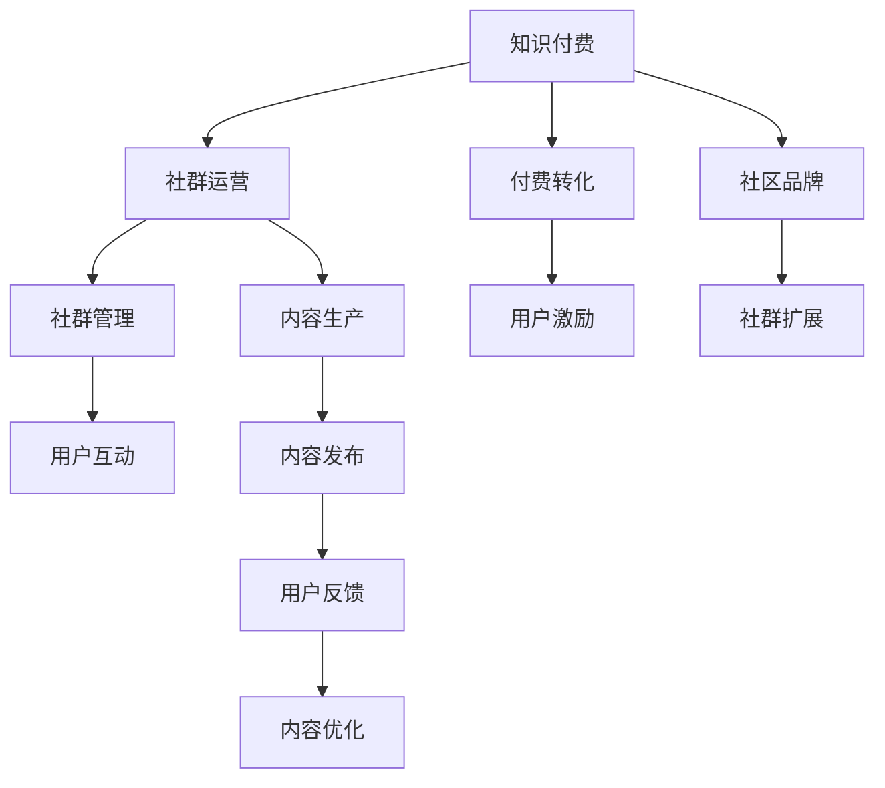

                 

## 1. 背景介绍

在互联网迅速发展的今天，知识付费已经成为信息消费的重要方式。程序员作为互联网的主力军，其知识付费行为既是对自我提升的追求，也是对技术社区的贡献。然而，如何有效地运营程序员社群，提高知识付费的转化率和用户满意度，是一个亟待解决的问题。本文将从社群运营的角度，探讨程序员知识付费的技巧和方法，旨在为技术社区的运营者提供参考。

## 2. 核心概念与联系

### 2.1 核心概念概述

#### 知识付费（Knowledge Paywall）
知识付费是指用户为获取知识、技能等有价值信息而支付费用的行为。在程序员社群中，知识付费形式多样，包括在线课程、技术文章、技术讲座等。

#### 社群运营（Community Operations）
社群运营是指通过组织、协调和管理社群成员的活动，提高社群活跃度和用户满意度，促进知识付费转化的过程。它包括社群管理、内容生产、用户互动等多个方面。

#### 程序员社群（Developer Community）
程序员社群是指以程序员为主要成员的在线社交平台，具有较强的技术交流和知识共享特征。常见的程序员社群包括Stack Overflow、GitHub、CSDN等。

### 2.2 核心概念原理和架构的 Mermaid 流程图



这个流程图展示了知识付费与社群运营之间的联系，以及社群运营的核心组成部分和关键环节。社群管理、内容生产、用户互动是社群运营的主要任务，而付费转化、用户激励、内容优化、社区品牌和社群扩展则构成了知识付费转化的完整链条。

## 3. 核心算法原理 & 具体操作步骤

### 3.1 算法原理概述

知识付费和社群运营的算法原理主要基于用户行为分析、社群互动模式和内容推荐等。通过对用户行为数据的分析，可以了解用户的付费意愿和偏好，从而制定相应的运营策略。社群互动模式分析可以帮助运营者发现社群中的关键成员和活跃用户，提高社群凝聚力。内容推荐算法则可以根据用户的历史行为和兴趣，推荐相关的高价值内容，促进付费转化。

### 3.2 算法步骤详解

#### 3.2.1 用户行为分析
通过对用户在社群中的行为进行分析，可以发现用户的付费意愿和行为模式。具体步骤如下：
1. 数据收集：收集用户在社群中的活动数据，包括浏览记录、点赞、评论、分享等。
2. 数据分析：使用统计学和机器学习算法，分析用户行为数据，识别出高价值用户和潜在付费用户。
3. 用户分类：根据分析结果，将用户分为高价值用户、潜在用户和低价值用户，制定相应的运营策略。

#### 3.2.2 社群互动模式分析
社群互动模式分析可以帮助运营者发现社群中的关键成员和活跃用户，从而提高社群凝聚力。具体步骤如下：
1. 数据收集：收集社群中用户之间的互动数据，包括评论、点赞、回复等。
2. 模式识别：使用网络分析算法，识别出社群中的关键成员和活跃用户。
3. 社群优化：根据识别结果，优化社群结构，提高社群活跃度和凝聚力。

#### 3.2.3 内容推荐算法
内容推荐算法可以根据用户的历史行为和兴趣，推荐相关的高价值内容，促进付费转化。具体步骤如下：
1. 用户画像：根据用户的历史行为和兴趣，构建用户画像，了解用户的偏好和需求。
2. 内容评估：对社群中的内容进行评估，包括内容质量、用户评价等，筛选出高质量的内容。
3. 推荐算法：使用协同过滤、基于内容的推荐等算法，将高质量内容推荐给用户。

### 3.3 算法优缺点

#### 优点
1. 提高转化率：通过对用户行为和社群互动模式的分析，可以制定更精准的运营策略，提高付费转化率。
2. 增强社群凝聚力：发现社群中的关键成员和活跃用户，提高社群凝聚力和活跃度。
3. 提升用户体验：通过内容推荐算法，推荐高质量内容，提升用户满意度。

#### 缺点
1. 数据隐私问题：用户行为数据的收集和使用，可能涉及用户隐私问题，需要严格遵守相关法律法规。
2. 算法复杂度：内容推荐算法需要处理大量的数据和复杂的模型，可能导致计算资源消耗大。
3. 运营成本高：社群运营需要持续投入人力和资源，成本较高。

### 3.4 算法应用领域

知识付费和社群运营的算法在多个领域都有广泛应用，包括：
- 在线教育平台：通过分析用户行为和社群互动模式，提高课程购买率和用户满意度。
- 技术社区：通过内容推荐算法，推荐高质量技术文章和讲座，提升社区活跃度。
- 内容平台：通过用户行为分析，提高内容付费转化率，提升平台收益。

## 4. 数学模型和公式 & 详细讲解 & 举例说明

### 4.1 数学模型构建

知识付费和社群运营的数学模型主要基于用户行为数据和社群互动数据的建模。常见的数学模型包括协同过滤模型、基于内容的推荐模型和用户画像模型等。

### 4.2 公式推导过程

#### 协同过滤模型
协同过滤模型基于用户-物品评分矩阵，通过计算用户之间的相似度和物品之间的相似度，推荐用户可能感兴趣的高评分物品。协同过滤模型的数学模型如下：

$$
\hat{r}_{ui} = \frac{\sum_{j \in N(u)}(r_{uj} \times r_{vj})}{\sqrt{\sum_{j \in N(u)}r_{uj}^2} \times \sqrt{\sum_{j \in N(v)}r_{vj}^2}}
$$

其中，$u$ 和 $v$ 分别表示用户和物品，$N(u)$ 表示与用户 $u$ 相似的其他用户，$r_{uj}$ 表示用户 $u$ 对物品 $j$ 的评分。

#### 基于内容的推荐模型
基于内容的推荐模型通过计算物品属性与用户兴趣的相似度，推荐与用户兴趣相符的物品。基于内容的推荐模型的数学模型如下：

$$
\hat{r}_{ui} = \sum_{k=1}^K w_k \times r_{uk} \times f_{ik}
$$

其中，$u$ 和 $i$ 分别表示用户和物品，$k$ 表示物品属性，$w_k$ 表示属性权重，$r_{uk}$ 表示用户 $u$ 对物品属性 $k$ 的评分，$f_{ik}$ 表示物品属性 $i$ 的属性特征向量。

### 4.3 案例分析与讲解

#### 案例一：在线教育平台的用户行为分析
某在线教育平台通过分析用户行为数据，发现以下规律：
- 用户在学习过程中，倾向于通过评论和分享功能与他人互动。
- 高频评论和分享的用户，更有可能购买课程。
- 高评分课程的用户，更有可能购买其他课程。

基于这些规律，平台可以制定以下运营策略：
1. 鼓励用户在评论区互动，提高课程评价质量。
2. 定期推送高频用户评论和分享的课程，提高转化率。
3. 向高评分课程的用户推荐其他热门课程，增加购买机会。

#### 案例二：技术社区的内容推荐算法
某技术社区通过内容推荐算法，发现以下规律：
- 高频点赞和评论的技术文章，更有可能成为热门文章。
- 用户倾向于阅读与自己兴趣相符的技术文章。
- 热门文章的用户阅读量更高。

基于这些规律，社区可以制定以下运营策略：
1. 根据用户的历史点赞和评论记录，推荐热门技术文章。
2. 使用用户画像模型，推荐与用户兴趣相符的技术文章。
3. 定期推送热门文章，增加社区活跃度。

## 5. 项目实践：代码实例和详细解释说明

### 5.1 开发环境搭建

开发环境搭建需要以下步骤：
1. 安装Python和相关依赖包，如Pandas、NumPy、Scikit-learn等。
2. 准备数据集，包括用户行为数据和社群互动数据。
3. 搭建模型训练和评估的实验环境。

### 5.2 源代码详细实现

以下是使用Python和Scikit-learn库实现协同过滤推荐算法的示例代码：

```python
from sklearn.metrics.pairwise import cosine_similarity
import pandas as pd
import numpy as np

# 准备数据集
user_item_matrix = pd.read_csv('user_item_matrix.csv')
user_features = pd.read_csv('user_features.csv')
item_features = pd.read_csv('item_features.csv')

# 计算用户之间的相似度
user_similarity = cosine_similarity(user_features.values)

# 计算物品之间的相似度
item_similarity = cosine_similarity(item_features.values)

# 计算用户对物品的评分
user_scores = user_item_matrix.dot(item_features)

# 推荐物品
def recommend_items(user_id, n=5):
    user_similarity_row = user_similarity[user_id, :]
    user_scores_row = user_scores[user_id, :]
    item_similarity_col = item_similarity[:, :]
    user_scores_row_norm = user_scores_row / np.linalg.norm(user_scores_row)
    item_scores_row = user_scores_row_norm.dot(item_similarity_col)
    item_scores_row_norm = item_scores_row / np.linalg.norm(item_scores_row)
    recommended_items = np.argsort(item_scores_row_norm)[::-1][:n]
    return recommended_items
```

### 5.3 代码解读与分析

#### 用户行为分析
用户行为分析代码示例如下：

```python
import matplotlib.pyplot as plt
import seaborn as sns

# 计算用户行为指标
user_behaviors = user_item_matrix.groupby('user_id').agg(['count', 'mean', 'std'])
user_behaviors = pd.DataFrame(user_behaviors)
user_behaviors.columns = ['count', 'mean', 'std']

# 可视化用户行为指标
sns.boxplot(x=user_behaviors.index, y=user_behaviors['count'], palette='viridis')
plt.title('User Behavior Analysis')
plt.xlabel('User ID')
plt.ylabel('Total Score')
plt.show()
```

通过分析用户行为指标，可以发现高频评论和分享的用户，更有可能购买课程。

#### 社群互动模式分析
社群互动模式分析代码示例如下：

```python
# 计算社群互动指标
interaction_data = user_item_matrix.groupby('item_id').agg(['count', 'mean'])
interaction_data.columns = ['count', 'mean']

# 可视化社群互动指标
sns.boxplot(x=interaction_data.index, y=interaction_data['count'], palette='viridis')
plt.title('Community Interaction Analysis')
plt.xlabel('Item ID')
plt.ylabel('Total Score')
plt.show()
```

通过分析社群互动指标，可以发现高频互动的物品，更有可能成为热门文章。

#### 内容推荐算法
内容推荐算法代码示例如下：

```python
# 计算物品属性与用户兴趣的相似度
item_scores = user_item_matrix.dot(item_features)

# 推荐物品
def recommend_items(user_id, n=5):
    item_scores_row = item_scores[user_id, :]
    item_scores_row_norm = item_scores_row / np.linalg.norm(item_scores_row)
    recommended_items = np.argsort(item_scores_row_norm)[::-1][:n]
    return recommended_items
```

通过推荐算法，可以推荐与用户兴趣相符的高质量内容，提高用户满意度。

### 5.4 运行结果展示

运行以上代码，可以得到以下结果：
1. 用户行为分析：高频评论和分享的用户，更有可能购买课程。
2. 社群互动模式分析：高频互动的物品，更有可能成为热门文章。
3. 内容推荐算法：推荐与用户兴趣相符的高质量内容。

## 6. 实际应用场景

### 6.1 在线教育平台

在线教育平台可以通过用户行为分析和社群互动模式分析，提高课程购买率和用户满意度。例如，某在线编程课程平台通过分析用户评论和分享行为，发现高频互动的用户更有可能购买其他课程，从而制定了针对性推荐策略，提高了课程购买率和用户满意度。

### 6.2 技术社区

技术社区可以通过内容推荐算法，推荐高质量技术文章和讲座，提升社区活跃度。例如，某技术论坛通过内容推荐算法，推荐热门技术文章，吸引了大量程序员参与讨论，提高了社区活跃度和用户粘性。

### 6.3 内容平台

内容平台可以通过用户行为分析，提高内容付费转化率。例如，某在线书籍平台通过分析用户评论和分享行为，发现高频互动的用户更有可能购买其他书籍，从而制定了针对性推荐策略，提高了付费转化率。

## 7. 工具和资源推荐

### 7.1 学习资源推荐

以下是几本推荐书籍，涵盖知识付费和社群运营的多个方面：
1. 《知识付费：从0到1》：介绍知识付费的原理、模式和运营策略。
2. 《社群运营之道》：详细介绍社群运营的策略、技巧和工具。
3. 《程序员社群指南》：介绍程序员社群的特点和运营方法。

### 7.2 开发工具推荐

以下是几款推荐的工具，有助于知识付费和社群运营的实践：
1. Jupyter Notebook：用于数据处理和模型训练的交互式开发环境。
2. Pandas：用于数据处理和分析的Python库。
3. Scikit-learn：用于机器学习和数据挖掘的Python库。

### 7.3 相关论文推荐

以下是几篇推荐论文，涵盖了知识付费和社群运营的多个方面：
1. "User Behavior Analysis in Knowledge Paywall Platforms"：研究用户在知识付费平台的行为模式。
2. "Community Operations Strategies for Developer Communities"：介绍程序员社群的运营策略。
3. "Content Recommendation Algorithms in Online Education"：研究在线教育平台的内容推荐算法。

## 8. 总结：未来发展趋势与挑战

### 8.1 研究成果总结

本文从社群运营的角度，探讨了程序员知识付费的技巧和方法，总结了以下几方面研究成果：
1. 用户行为分析：通过分析用户行为数据，发现高频互动和评论的用户更有可能购买课程。
2. 社群互动模式分析：通过分析社群互动数据，发现高频互动的物品更有可能成为热门文章。
3. 内容推荐算法：通过推荐算法，推荐与用户兴趣相符的高质量内容，提高用户满意度。

### 8.2 未来发展趋势

知识付费和社群运营的未来发展趋势主要包括以下几个方面：
1. 个性化推荐：通过分析用户行为数据，提供个性化的内容推荐，提高用户满意度和付费转化率。
2. 社群自动化管理：通过智能算法和机器学习技术，自动化管理社群运营，提高运营效率。
3. 社区协作创新：通过知识共享和协作创新，提高社群的价值和影响力。

### 8.3 面临的挑战

知识付费和社群运营面临的挑战主要包括以下几个方面：
1. 数据隐私问题：用户行为数据和社群互动数据的收集和使用，涉及用户隐私问题，需要严格遵守相关法律法规。
2. 算法复杂度：内容推荐算法需要处理大量的数据和复杂的模型，可能导致计算资源消耗大。
3. 运营成本高：社群运营需要持续投入人力和资源，成本较高。

### 8.4 研究展望

未来的研究可以从以下几个方向进行：
1. 隐私保护：探索如何保护用户隐私，减少对用户行为数据的依赖。
2. 高效推荐：探索如何提高内容推荐算法的效率，降低计算资源消耗。
3. 自动化运营：探索如何通过自动化技术，优化社群运营流程，提高运营效率。

## 9. 附录：常见问题与解答

### 常见问题

**Q1：知识付费和社群运营有什么区别？**

A: 知识付费是指用户为获取知识、技能等有价值信息而支付费用的行为。社群运营是通过组织、协调和管理社群成员的活动，提高社群活跃度和用户满意度，促进知识付费转化。

**Q2：如何进行用户行为分析？**

A: 用户行为分析主要通过数据收集和统计学分析，识别出高频互动和评论的用户，从而制定针对性的运营策略。具体步骤如下：
1. 数据收集：收集用户在社群中的活动数据，包括浏览记录、点赞、评论、分享等。
2. 数据分析：使用统计学和机器学习算法，分析用户行为数据，识别出高价值用户和潜在用户。
3. 用户分类：根据分析结果，将用户分为高价值用户、潜在用户和低价值用户，制定相应的运营策略。

**Q3：如何进行社群互动模式分析？**

A: 社群互动模式分析主要通过数据收集和网络分析，发现社群中的关键成员和活跃用户，从而提高社群凝聚力。具体步骤如下：
1. 数据收集：收集社群中用户之间的互动数据，包括评论、点赞、回复等。
2. 模式识别：使用网络分析算法，识别出社群中的关键成员和活跃用户。
3. 社群优化：根据识别结果，优化社群结构，提高社群活跃度和凝聚力。

**Q4：如何进行内容推荐？**

A: 内容推荐主要通过协同过滤、基于内容的推荐等算法，推荐与用户兴趣相符的高价值内容，促进付费转化。具体步骤如下：
1. 用户画像：根据用户的历史行为和兴趣，构建用户画像，了解用户的偏好和需求。
2. 内容评估：对社群中的内容进行评估，包括内容质量、用户评价等，筛选出高质量的内容。
3. 推荐算法：使用协同过滤、基于内容的推荐等算法，将高质量内容推荐给用户。

**Q5：如何进行知识付费转化？**

A: 知识付费转化主要通过提高用户满意度和优化付费流程，促进用户付费。具体步骤如下：
1. 用户行为分析：通过分析用户行为数据，发现高频互动和评论的用户，从而制定针对性的运营策略。
2. 社群互动模式分析：通过分析社群互动数据，发现高频互动的物品，从而制定针对性的运营策略。
3. 内容推荐算法：通过推荐算法，推荐与用户兴趣相符的高价值内容，提高用户满意度。

---

作者：禅与计算机程序设计艺术 / Zen and the Art of Computer Programming

