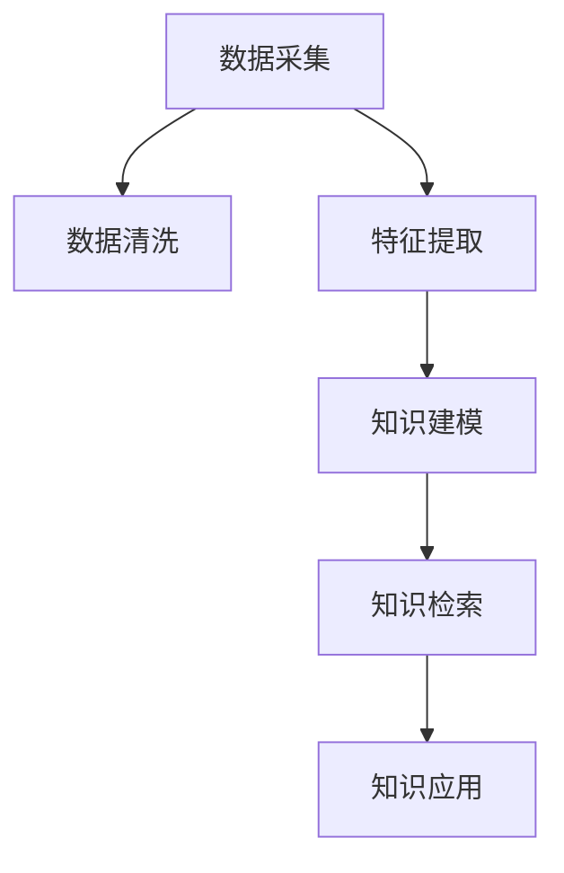

                 

# 知识发现引擎助力程序员快速掌握行业动态

> 关键词：知识发现引擎, 程序员, 行业动态, 数据驱动, 深度学习, 人工智能, 机器学习, 大数据, 自然语言处理

## 1. 背景介绍

### 1.1 问题由来
随着技术发展的日新月异，程序员需要不断学习新知识、掌握新技能，才能保持竞争力。然而，信息爆炸的时代，如何快速、全面、系统地获取知识成为了一大难题。传统的人工搜集和阅读资料的方式，不仅效率低下，还难以确保信息的准确性和完整性。

为了解决这个问题，知识发现引擎应运而生。通过数据挖掘和人工智能技术，知识发现引擎能够自动从海量的数据中提取、分析和生成知识，为程序员提供实时、精准的行业动态和学习资源。这一技术已经在教育、医疗、金融等多个领域得到了广泛应用，并逐渐成为程序员获取行业知识的主要途径。

### 1.2 问题核心关键点
知识发现引擎的核心在于如何将非结构化数据转换为有价值的信息和知识。这主要涉及以下几个关键点：

- **数据采集**：从互联网、数据库、社交媒体等多种来源自动收集数据。
- **数据清洗**：去除噪声、重复和不相关的数据，确保数据质量。
- **特征提取**：使用自然语言处理、机器学习等技术，提取数据中的关键特征。
- **知识建模**：构建知识图谱、文档聚类、主题模型等，对数据进行建模和结构化。
- **知识检索**：实现高效的文本检索、实体关系检索等功能，帮助用户快速定位知识。
- **知识应用**：通过可视化、推荐系统等手段，将知识呈现给用户，促进学习和应用。

这些关键点共同构成了知识发现引擎的核心技术架构，使得其能够从数据中自动抽取知识，并服务于用户。

## 2. 核心概念与联系

### 2.1 核心概念概述

为更好地理解知识发现引擎的工作原理和实现方法，本节将介绍几个密切相关的核心概念：

- **知识发现(Knowledge Discovery, KD)**：指从海量数据中挖掘出有意义、可用的知识或信息的过程。
- **数据挖掘(Data Mining)**：从数据集中发现模式和知识的过程，是知识发现的重要手段之一。
- **机器学习(Machine Learning, ML)**：通过数据训练模型，使模型能够对新数据进行预测和推断的技术。
- **人工智能(Artificial Intelligence, AI)**：让计算机模拟人类智能行为，包括学习、推理、规划等能力。
- **知识图谱(Knowledge Graph)**：由节点和边组成的网络，用于表示实体、属性和关系，支持复杂的查询和推理。
- **自然语言处理(Natural Language Processing, NLP)**：使计算机能够理解、处理和生成人类语言的技术。
- **信息抽取(Information Extraction, IE)**：从非结构化文本中提取结构化信息的过程，如实体识别、关系抽取等。
- **文档聚类(Document Clustering)**：将文档根据内容相似性进行分组的过程，有助于发现主题和结构。
- **主题模型(Thematic Modeling)**：通过统计模型识别文档中的潜在主题，帮助理解文本内容。

这些核心概念之间的逻辑关系可以通过以下Mermaid流程图来展示：



这个流程图展示了知识发现引擎的基本工作流程：首先从多种数据源采集数据，然后进行数据清洗和特征提取，构建知识模型，最后通过知识检索和应用将知识呈现给用户。

## 3. 核心算法原理 & 具体操作步骤
### 3.1 算法原理概述

知识发现引擎的核心算法原理主要基于数据挖掘、机器学习和自然语言处理技术，通过以下步骤从数据中抽取和生成知识：

1. **数据采集**：使用网络爬虫、数据库查询等手段，从互联网、数据库、社交媒体等多个来源自动收集数据。
2. **数据清洗**：通过去重、去噪、补全等技术手段，提高数据质量。
3. **特征提取**：使用词频统计、TF-IDF、主题建模等技术，提取文本中的关键特征。
4. **知识建模**：构建知识图谱、文档聚类、主题模型等，对数据进行建模和结构化。
5. **知识检索**：实现高效的文本检索、实体关系检索等功能，帮助用户快速定位知识。
6. **知识应用**：通过可视化、推荐系统等手段，将知识呈现给用户，促进学习和应用。

这些步骤构成了知识发现引擎的主要算法流程，使得其能够从原始数据中自动抽取知识，并服务于用户。

### 3.2 算法步骤详解

知识发现引擎的算法步骤主要包括以下几个环节：

**Step 1: 数据采集**
- 使用网络爬虫技术从网页、论坛、博客、新闻网站等多种来源自动采集数据。
- 通过API接口从数据库、云服务提供商（如AWS、Google Cloud等）获取结构化数据。
- 通过RSS、Twitter等社交媒体API获取实时数据流。

**Step 2: 数据清洗**
- 对采集的数据进行去重、去噪、补全等处理，去除无用的、重复的、不相关的数据。
- 使用正则表达式、自然语言处理等技术，过滤和纠正错误的数据。
- 使用数据清洗工具（如Apache Nifi、Talend等）进行自动化清洗和处理。

**Step 3: 特征提取**
- 使用词频统计（TF-IDF）、主题建模（LDA）、文本分类（朴素贝叶斯、SVM等）等技术，提取文本中的关键特征。
- 使用实体识别（NER）、关系抽取（IE）等技术，识别和提取文档中的实体和关系。
- 使用情感分析、趋势分析等技术，提取文本中的情感和趋势信息。

**Step 4: 知识建模**
- 使用知识图谱技术，构建实体-关系图，表示文本中的实体和关系。
- 使用文档聚类技术，将文档根据内容相似性进行分组，发现主题和结构。
- 使用主题模型（如LDA、Latent Dirichlet Allocation），识别文档中的潜在主题，理解文本内容。

**Step 5: 知识检索**
- 使用倒排索引、向量空间模型（VSM）、Word2Vec等技术，实现高效的文本检索功能。
- 使用实体关系检索技术，根据用户查询条件，快速定位相关的实体和关系。
- 使用搜索引擎技术（如ElasticSearch、Solr）实现高效的数据检索和查询。

**Step 6: 知识应用**
- 使用可视化技术，将知识以图表、仪表盘等形式呈现给用户。
- 使用推荐系统技术，根据用户兴趣和行为，推荐相关的学习资源和应用场景。
- 使用自然语言生成技术（NLG），生成结构化的知识摘要和报告。

这些步骤确保了知识发现引擎能够高效地从数据中抽取和生成知识，并为用户提供实用的学习资源和应用支持。

### 3.3 算法优缺点

知识发现引擎的主要优点包括：

- **高效自动化**：自动从海量数据中抽取知识，无需人工干预，节省时间和人力成本。
- **实时更新**：能够实时处理和分析新数据，提供最新的行业动态和学习资源。
- **数据驱动**：通过数据挖掘和机器学习技术，抽取的知识点更具有代表性和准确性。
- **可扩展性**：可以处理多种数据源和数据类型，适应不同领域和应用场景。
- **智能推荐**：基于用户行为和兴趣，提供个性化的学习资源和应用建议。

同时，知识发现引擎也存在一些局限性：

- **数据质量依赖**：数据采集和清洗的效果直接影响知识抽取的准确性。
- **算法复杂度**：特征提取、知识建模等步骤需要复杂的算法和模型，计算开销较大。
- **结果解释性**：知识抽取的结果通常缺乏解释，用户难以理解其背后的逻辑和原因。
- **应用局限性**：对特定领域的数据和知识，可能需要定制化的模型和算法。

尽管存在这些局限性，但知识发现引擎在数据驱动、实时更新的背景下，已经逐渐成为程序员获取行业知识的主要手段。

### 3.4 算法应用领域

知识发现引擎在多个领域中得到了广泛应用，以下是几个典型的应用场景：

**教育培训**
- 为学生和教师提供实时、精准的学习资源和知识库。
- 通过推荐系统技术，推荐个性化的学习路径和资源。
- 使用可视化技术，生成学习报告和进度跟踪图表。

**金融科技**
- 为金融分析师提供实时的市场数据和行业报告。
- 通过数据挖掘技术，发现投资机会和风险。
- 使用自然语言处理技术，进行情感分析和趋势预测。

**医疗健康**
- 为医生和患者提供最新的医学研究和健康知识。
- 通过知识图谱技术，提供疾病诊断和治疗方案。
- 使用推荐系统技术，推荐个性化的医疗建议和资源。

**电子商务**
- 为电商平台提供实时的市场趋势和用户行为分析。
- 通过知识图谱技术，发现产品关联和用户偏好。
- 使用推荐系统技术，提高用户转化率和满意度。

此外，知识发现引擎还被应用于智慧城市、智能制造、智能物流等多个领域，为不同行业带来智能化升级和创新突破。

## 4. 数学模型和公式 & 详细讲解 & 举例说明

### 4.1 数学模型构建

知识发现引擎的数学模型构建主要涉及数据清洗、特征提取和知识建模三个步骤。以下将以文本数据为例，介绍这三步骤的数学模型构建过程。

**数据清洗**
- 使用正则表达式去除文本中的噪声和无关内容。
- 使用TF-IDF算法计算文本中每个词的权重，去除低频词和停用词。
- 使用自然语言处理技术，纠正文本中的拼写错误和语法错误。

**特征提取**
- 使用TF-IDF算法计算文本中每个词的权重。
- 使用主题建模（LDA）算法，识别文本中的潜在主题。
- 使用情感分析算法，判断文本的情感极性。

**知识建模**
- 使用知识图谱技术，构建实体-关系图，表示文本中的实体和关系。
- 使用文档聚类技术，将文本根据内容相似性进行分组。
- 使用主题模型（LDA），识别文本中的潜在主题。

### 4.2 公式推导过程

以下以TF-IDF算法为例，推导其计算公式。

**TF-IDF算法**：
TF-IDF（Term Frequency-Inverse Document Frequency）是一种常用的文本特征提取方法，用于计算文本中每个词的权重。其公式如下：

$$
tf_{t,k} = \frac{\text{出现次数}}{\text{文本总词数}} \times 100
$$

$$
idf_{k} = \log\left(\frac{总文档数}{文本出现文档数+1}\right)
$$

$$
tf-idf_{t,k} = tf_{t,k} \times idf_{k}
$$

其中，$t$ 表示单词 $t$，$k$ 表示文档 $k$。

**推导过程**：
- 设文本 $D$ 包含 $n$ 个单词 $t_1, t_2, ..., t_n$，文档 $k$ 包含 $m_k$ 个单词 $t_{k1}, t_{k2}, ..., t_{km_k}$。
- 单词 $t$ 在文档 $k$ 中的出现次数为 $\text{出现次数} = \sum_{i=1}^{m_k} \delta_{t, t_{ki}}$，其中 $\delta$ 为Kronecker delta。
- 文档 $k$ 的总词数为 $\text{文本总词数} = \sum_{i=1}^{m_k} 1$。
- 单词 $t$ 在文档 $k$ 中的权重为 $tf_{t,k} = \frac{\text{出现次数}}{\text{文本总词数}} \times 100$。
- 单词 $t$ 在整个语料库中的权重为 $idf_{k} = \log\left(\frac{总文档数}{文本出现文档数+1}\right)$。
- 单词 $t$ 在文本 $D$ 中的权重为 $tf-idf_{t,k} = tf_{t,k} \times idf_{k}$。

**案例分析与讲解**
- 假设文本 $D$ 包含单词 "Python"，文档 $k$ 包含单词 "Python" 5次，文本 $D$ 总词数为1000，文档 $k$ 总词数为500。
- 单词 "Python" 在文档 $k$ 中的权重为 $tf_{Python,k} = \frac{5}{500} \times 100 = 0.01$。
- 单词 "Python" 在整个语料库中的权重为 $idf_{Python} = \log\left(\frac{1000}{5+1}\right) \approx 2.99$。
- 单词 "Python" 在文本 $D$ 中的权重为 $tf-idf_{Python} = 0.01 \times 2.99 \approx 0.03$。

通过上述公式，可以计算出单词 "Python" 在文本 $D$ 中的权重，从而抽取其特征。

## 5. 项目实践：代码实例和详细解释说明

### 5.1 开发环境搭建

在进行知识发现引擎的开发实践前，我们需要准备好开发环境。以下是使用Python进行PyTorch开发的环境配置流程：

1. 安装Anaconda：从官网下载并安装Anaconda，用于创建独立的Python环境。

2. 创建并激活虚拟环境：
```bash
conda create -n pytorch-env python=3.8 
conda activate pytorch-env
```

3. 安装PyTorch：根据CUDA版本，从官网获取对应的安装命令。例如：
```bash
conda install pytorch torchvision torchaudio cudatoolkit=11.1 -c pytorch -c conda-forge
```

4. 安装各类工具包：
```bash
pip install numpy pandas scikit-learn matplotlib tqdm jupyter notebook ipython
```

完成上述步骤后，即可在`pytorch-env`环境中开始知识发现引擎的开发实践。

### 5.2 源代码详细实现

下面我们以基于自然语言处理的知识发现引擎为例，给出使用Transformers库进行知识抽取的PyTorch代码实现。

首先，定义数据处理函数：

```python
from transformers import BertTokenizer
from torch.utils.data import Dataset
import torch

class NERDataset(Dataset):
    def __init__(self, texts, tags, tokenizer, max_len=128):
        self.texts = texts
        self.tags = tags
        self.tokenizer = tokenizer
        self.max_len = max_len
        
    def __len__(self):
        return len(self.texts)
    
    def __getitem__(self, item):
        text = self.texts[item]
        tags = self.tags[item]
        
        encoding = self.tokenizer(text, return_tensors='pt', max_length=self.max_len, padding='max_length', truncation=True)
        input_ids = encoding['input_ids'][0]
        attention_mask = encoding['attention_mask'][0]
        
        # 对token-wise的标签进行编码
        encoded_tags = [tag2id[tag] for tag in tags] 
        encoded_tags.extend([tag2id['O']] * (self.max_len - len(encoded_tags)))
        labels = torch.tensor(encoded_tags, dtype=torch.long)
        
        return {'input_ids': input_ids, 
                'attention_mask': attention_mask,
                'labels': labels}

# 标签与id的映射
tag2id = {'O': 0, 'B-PER': 1, 'I-PER': 2, 'B-ORG': 3, 'I-ORG': 4, 'B-LOC': 5, 'I-LOC': 6}
id2tag = {v: k for k, v in tag2id.items()}

# 创建dataset
tokenizer = BertTokenizer.from_pretrained('bert-base-cased')

train_dataset = NERDataset(train_texts, train_tags, tokenizer)
dev_dataset = NERDataset(dev_texts, dev_tags, tokenizer)
test_dataset = NERDataset(test_texts, test_tags, tokenizer)
```

然后，定义模型和优化器：

```python
from transformers import BertForTokenClassification, AdamW

model = BertForTokenClassification.from_pretrained('bert-base-cased', num_labels=len(tag2id))

optimizer = AdamW(model.parameters(), lr=2e-5)
```

接着，定义训练和评估函数：

```python
from torch.utils.data import DataLoader
from tqdm import tqdm
from sklearn.metrics import classification_report

device = torch.device('cuda') if torch.cuda.is_available() else torch.device('cpu')
model.to(device)

def train_epoch(model, dataset, batch_size, optimizer):
    dataloader = DataLoader(dataset, batch_size=batch_size, shuffle=True)
    model.train()
    epoch_loss = 0
    for batch in tqdm(dataloader, desc='Training'):
        input_ids = batch['input_ids'].to(device)
        attention_mask = batch['attention_mask'].to(device)
        labels = batch['labels'].to(device)
        model.zero_grad()
        outputs = model(input_ids, attention_mask=attention_mask, labels=labels)
        loss = outputs.loss
        epoch_loss += loss.item()
        loss.backward()
        optimizer.step()
    return epoch_loss / len(dataloader)

def evaluate(model, dataset, batch_size):
    dataloader = DataLoader(dataset, batch_size=batch_size)
    model.eval()
    preds, labels = [], []
    with torch.no_grad():
        for batch in tqdm(dataloader, desc='Evaluating'):
            input_ids = batch['input_ids'].to(device)
            attention_mask = batch['attention_mask'].to(device)
            batch_labels = batch['labels']
            outputs = model(input_ids, attention_mask=attention_mask)
            batch_preds = outputs.logits.argmax(dim=2).to('cpu').tolist()
            batch_labels = batch_labels.to('cpu').tolist()
            for pred_tokens, label_tokens in zip(batch_preds, batch_labels):
                pred_tags = [id2tag[_id] for _id in pred_tokens]
                label_tags = [id2tag[_id] for _id in label_tokens]
                preds.append(pred_tags[:len(label_tags)])
                labels.append(label_tags)
                
    print(classification_report(labels, preds))
```

最后，启动训练流程并在测试集上评估：

```python
epochs = 5
batch_size = 16

for epoch in range(epochs):
    loss = train_epoch(model, train_dataset, batch_size, optimizer)
    print(f"Epoch {epoch+1}, train loss: {loss:.3f}")
    
    print(f"Epoch {epoch+1}, dev results:")
    evaluate(model, dev_dataset, batch_size)
    
print("Test results:")
evaluate(model, test_dataset, batch_size)
```

以上就是使用PyTorch对BERT进行命名实体识别任务知识抽取的完整代码实现。可以看到，得益于Transformers库的强大封装，我们可以用相对简洁的代码完成BERT模型的加载和知识抽取。

### 5.3 代码解读与分析

让我们再详细解读一下关键代码的实现细节：

**NERDataset类**：
- `__init__`方法：初始化文本、标签、分词器等关键组件。
- `__len__`方法：返回数据集的样本数量。
- `__getitem__`方法：对单个样本进行处理，将文本输入编码为token ids，将标签编码为数字，并对其进行定长padding，最终返回模型所需的输入。

**tag2id和id2tag字典**：
- 定义了标签与数字id之间的映射关系，用于将token-wise的预测结果解码回真实的标签。

**训练和评估函数**：
- 使用PyTorch的DataLoader对数据集进行批次化加载，供模型训练和推理使用。
- 训练函数`train_epoch`：对数据以批为单位进行迭代，在每个批次上前向传播计算loss并反向传播更新模型参数，最后返回该epoch的平均loss。
- 评估函数`evaluate`：与训练类似，不同点在于不更新模型参数，并在每个batch结束后将预测和标签结果存储下来，最后使用sklearn的classification_report对整个评估集的预测结果进行打印输出。

**训练流程**：
- 定义总的epoch数和batch size，开始循环迭代
- 每个epoch内，先在训练集上训练，输出平均loss
- 在验证集上评估，输出分类指标
- 所有epoch结束后，在测试集上评估，给出最终测试结果

可以看到，PyTorch配合Transformers库使得BERT知识抽取的代码实现变得简洁高效。开发者可以将更多精力放在数据处理、模型改进等高层逻辑上，而不必过多关注底层的实现细节。

当然，工业级的系统实现还需考虑更多因素，如模型的保存和部署、超参数的自动搜索、更灵活的任务适配层等。但核心的知识抽取范式基本与此类似。

## 6. 实际应用场景
### 6.1 智能客服系统

基于知识发现引擎的智能客服系统，可以提供实时、个性化的客户咨询服务。传统客服往往需要配备大量人力，高峰期响应缓慢，且一致性和专业性难以保证。而使用知识发现引擎构建的智能客服系统，能够自动分析客户咨询，匹配最合适的答案模板进行回复，快速响应客户需求。

在技术实现上，可以收集企业内部的历史客服对话记录，将问题和最佳答复构建成监督数据，在此基础上对预训练对话模型进行微调。微调后的对话模型能够自动理解客户意图，匹配最合适的答案模板进行回复。对于客户提出的新问题，还可以接入检索系统实时搜索相关内容，动态组织生成回答。如此构建的智能客服系统，能大幅提升客户咨询体验和问题解决效率。

### 6.2 金融舆情监测

金融机构需要实时监测市场舆论动向，以便及时应对负面信息传播，规避金融风险。传统的人工监测方式成本高、效率低，难以应对网络时代海量信息爆发的挑战。基于知识发现引擎的文本分类和情感分析技术，为金融舆情监测提供了新的解决方案。

具体而言，可以收集金融领域相关的新闻、报道、评论等文本数据，并对其进行主题标注和情感标注。在此基础上对预训练语言模型进行微调，使其能够自动判断文本属于何种主题，情感倾向是正面、中性还是负面。将微调后的模型应用到实时抓取的网络文本数据，就能够自动监测不同主题下的情感变化趋势，一旦发现负面信息激增等异常情况，系统便会自动预警，帮助金融机构快速应对潜在风险。

### 6.3 个性化推荐系统

当前的推荐系统往往只依赖用户的历史行为数据进行物品推荐，无法深入理解用户的真实兴趣偏好。基于知识发现引擎的个性化推荐系统，可以更好地挖掘用户行为背后的语义信息，从而提供更精准、多样的推荐内容。

在实践中，可以收集用户浏览、点击、评论、分享等行为数据，提取和用户交互的物品标题、描述、标签等文本内容。将文本内容作为模型输入，用户的后续行为（如是否点击、购买等）作为监督信号，在此基础上微调预训练语言模型。微调后的模型能够从文本内容中准确把握用户的兴趣点。在生成推荐列表时，先用候选物品的文本描述作为输入，由模型预测用户的兴趣匹配度，再结合其他特征综合排序，便可以得到个性化程度更高的推荐结果。

### 6.4 未来应用展望

随着知识发现引擎技术的不断发展，其在更多领域的应用前景广阔：

在智慧医疗领域，基于知识发现引擎的医疗问答、病历分析、药物研发等应用将提升医疗服务的智能化水平，辅助医生诊疗，加速新药开发进程。

在智能教育领域，知识发现引擎可应用于作业批改、学情分析、知识推荐等方面，因材施教，促进教育公平，提高教学质量。

在智慧城市治理中，知识发现引擎可用于城市事件监测、舆情分析、应急指挥等环节，提高城市管理的自动化和智能化水平，构建更安全、高效的未来城市。

此外，在企业生产、社会治理、文娱传媒等众多领域，知识发现引擎的应用也将不断涌现，为传统行业带来变革性影响。相信随着技术的日益成熟，知识发现引擎必将在构建人机协同的智能时代中扮演越来越重要的角色。

## 7. 工具和资源推荐
### 7.1 学习资源推荐

为了帮助开发者系统掌握知识发现引擎的理论基础和实践技巧，这里推荐一些优质的学习资源：

1. 《大数据挖掘与知识发现》系列书籍：系统介绍了数据挖掘和知识发现的基本原理和算法，适合初学者入门。
2. 《Python自然语言处理》课程：由斯坦福大学李飞飞教授主讲的自然语言处理课程，涵盖自然语言处理的基本概念和经典算法。
3. 《机器学习实战》书籍：系统讲解了机器学习的基本概念、算法和应用，适合进阶学习。
4. Kaggle数据科学竞赛：提供了大量实际数据和挑战，帮助开发者实践和提升算法能力。
5. Coursera数据科学专业：提供从入门到高级的数据科学课程，涵盖数据挖掘、机器学习等多个领域。

通过对这些资源的学习实践，相信你一定能够快速掌握知识发现引擎的核心技术，并用于解决实际的NLP问题。
###  7.2 开发工具推荐

高效的开发离不开优秀的工具支持。以下是几款用于知识发现引擎开发的常用工具：

1. Python：Python语言以其简洁易学、功能强大著称，是数据科学和机器学习领域的标准语言。
2. PyTorch：基于Python的开源深度学习框架，灵活动态的计算图，适合快速迭代研究。大部分预训练语言模型都有PyTorch版本的实现。
3. TensorFlow：由Google主导开发的开源深度学习框架，生产部署方便，适合大规模工程应用。同样有丰富的预训练语言模型资源。
4. Scikit-Learn：Python的数据科学库，提供了丰富的机器学习算法和工具，易于上手。
5. Apache Spark：分布式计算框架，支持大规模数据处理和机器学习。
6. Elasticsearch：开源搜索引擎，支持高效的文本检索和数据分析。
7. Apache Nifi：数据流处理工具，支持从各种数据源采集和处理数据。

合理利用这些工具，可以显著提升知识发现引擎的开发效率，加快创新迭代的步伐。

### 7.3 相关论文推荐

知识发现引擎的研究源于学界的持续研究。以下是几篇奠基性的相关论文，推荐阅读：

1. **《The Elements of Statistical Learning》**：Hastie等著，系统介绍了统计学习的基本概念和算法，适合深入学习。
2. **《Data Mining and Statistical Learning》**：Brewer等著，涵盖数据挖掘和统计学习的基本原理和应用。
3. **《Machine Learning Yearning》**：Andrew Ng著，介绍了机器学习的基本概念和实践技巧。
4. **《Advances in Neural Information Processing Systems (NeurIPS)》**：NeurIPS会议的论文集，涵盖自然语言处理、深度学习等多个领域的最新研究成果。
5. **《Knowledge Discovery and Data Mining: Theory and Practice》**：Pang等著，介绍了知识发现和数据挖掘的基本原理和应用。

这些论文代表了大语言模型微调技术的发展脉络。通过学习这些前沿成果，可以帮助研究者把握学科前进方向，激发更多的创新灵感。

## 8. 总结：未来发展趋势与挑战
### 8.1 总结

本文对基于知识发现引擎的知识抽取方法进行了全面系统的介绍。首先阐述了知识发现引擎的研究背景和意义，明确了知识抽取在数据驱动、实时更新的背景下的独特价值。其次，从原理到实践，详细讲解了知识抽取的数学原理和关键步骤，给出了知识抽取任务开发的完整代码实例。同时，本文还广泛探讨了知识抽取方法在智能客服、金融舆情、个性化推荐等多个行业领域的应用前景，展示了知识抽取方法的巨大潜力。此外，本文精选了知识抽取技术的各类学习资源，力求为读者提供全方位的技术指引。

通过本文的系统梳理，可以看到，基于知识发现引擎的知识抽取方法正在成为NLP领域的重要范式，极大地拓展了预训练语言模型的应用边界，催生了更多的落地场景。受益于大规模语料的预训练和实时更新的机制，知识抽取模型能够从海量数据中快速抽取知识，为行业提供实时的学习资源和应用支持。未来，伴随知识抽取技术的不断演进，相信知识抽取方法必将在更广泛的领域得到应用，深刻影响人类的生产生活方式。

### 8.2 未来发展趋势

展望未来，知识发现引擎的知识抽取技术将呈现以下几个发展趋势：

1. **多模态知识抽取**：未来的知识抽取不仅限于文本数据，还将扩展到图像、视频、音频等多模态数据，形成更加全面和丰富的知识体系。
2. **因果推断和知识整合**：引入因果分析和知识图谱技术，增强知识抽取模型的因果推断能力和知识整合能力，提高模型的稳定性和可靠性。
3. **自监督学习**：利用无监督学习技术，通过标注数据稀缺的领域抽取知识，减少对标注数据的依赖，提升模型的泛化能力。
4. **联邦学习**：在数据隐私保护的前提下，利用联邦学习技术，分布式抽取不同来源的数据，构建更全面和精确的知识库。
5. **多任务学习和元学习**：通过多任务学习和元学习技术，增强知识抽取模型的适应性和迁移能力，提升模型在不同领域和任务上的表现。
6. **知识图谱**：构建大规模、开放的知识图谱，促进知识的共享和交流，为更广泛的应用场景提供支持。

这些趋势凸显了知识发现引擎知识抽取技术的广阔前景。这些方向的探索发展，必将进一步提升NLP系统的性能和应用范围，为人类认知智能的进化带来深远影响。

### 8.3 面临的挑战

尽管知识发现引擎的知识抽取技术已经取得了瞩目成就，但在迈向更加智能化、普适化应用的过程中，它仍面临着诸多挑战：

1. **数据质量依赖**：知识抽取的效果很大程度上取决于数据的质量和数量，高质量标注数据的获取成本较高，特别是在特定领域。
2. **算法复杂度**：知识抽取的算法复杂度高，需要高效的算法和硬件支持，计算开销较大。
3. **结果解释性**：知识抽取的结果通常缺乏解释，用户难以理解其背后的逻辑和原因，对关键领域的应用尤为关键。
4. **应用局限性**：知识抽取方法对特定领域的数据和知识，可能需要定制化的模型和算法，难以适应所有领域。
5. **知识融合和整合**：不同知识源和知识形式的数据，需要高效融合和整合，构建统一的知识体系，实现知识的全局视角。

尽管存在这些挑战，但知识发现引擎在数据驱动、实时更新的背景下，已经逐渐成为程序员获取行业知识的主要手段。未来，知识发现引擎需要更加注重数据质量、算法优化、结果解释和知识整合等方面的研究，才能在实际应用中取得更大的突破。

### 8.4 研究展望

面对知识抽取技术所面临的种种挑战，未来的研究需要在以下几个方面寻求新的突破：

1. **自监督学习和半监督学习**：利用无监督学习技术，通过标注数据稀缺的领域抽取知识，减少对标注数据的依赖，提升模型的泛化能力。
2. **联邦学习和分布式知识抽取**：在数据隐私保护的前提下，利用联邦学习技术，分布式抽取不同来源的数据，构建更全面和精确的知识库。
3. **因果推断和知识图谱**：引入因果分析和知识图谱技术，增强知识抽取模型的因果推断能力和知识整合能力，提高模型的稳定性和可靠性。
4. **多任务学习和元学习**：通过多任务学习和元学习技术，增强知识抽取模型的适应性和迁移能力，提升模型在不同领域和任务上的表现。
5. **知识融合和整合**：不同知识源和知识形式的数据，需要高效融合和整合，构建统一的知识体系，实现知识的全局视角。
6. **自解释和可解释性**：开发具有自解释能力的知识抽取模型，提供模型决策的逻辑和理由，增强模型的可解释性和可靠性。

这些研究方向的探索，必将引领知识发现引擎知识抽取技术迈向更高的台阶，为构建安全、可靠、可解释、可控的智能系统铺平道路。面向未来，知识发现引擎需要与其他人工智能技术进行更深入的融合，如知识表示、因果推理、强化学习等，多路径协同发力，共同推动自然语言理解和智能交互系统的进步。只有勇于创新、敢于突破，才能不断拓展知识抽取的边界，让智能技术更好地造福人类社会。

## 9. 附录：常见问题与解答

**Q1：知识发现引擎是否适用于所有NLP任务？**

A: 知识发现引擎在大多数NLP任务上都能取得不错的效果，特别是对于数据量较小的任务。但对于一些特定领域的任务，如医学、法律等，仅仅依靠通用语料预训练的模型可能难以很好地适应。此时需要在特定领域语料上进一步预训练，再进行知识抽取，才能获得理想效果。此外，对于一些需要时效性、个性化很强的任务，如对话、推荐等，知识抽取方法也需要针对性的改进优化。

**Q2：知识发现引擎的训练成本如何？**

A: 知识发现引擎的训练成本主要取决于数据量和模型的复杂度。对于大规模语料和复杂模型的训练，通常需要高性能的GPU或TPU等硬件支持，计算资源和时间成本较高。但得益于分布式计算和自动化管道技术，知识发现引擎的训练成本正在逐步降低，适用于更多规模的工业应用。

**Q3：知识发现引擎的精度和召回率如何？**

A: 知识发现引擎的精度和召回率主要取决于数据质量、特征提取方法和模型架构。通过优化数据清洗、特征提取和模型训练等环节，可以显著提升知识抽取的精度和召回率。对于特定领域和任务，通常需要进行定制化的模型训练和参数调整，才能获得最优效果。

**Q4：知识发现引擎的实时性如何？**

A: 知识发现引擎的实时性主要取决于数据处理和模型推理的效率。通过优化数据流处理、模型压缩和推理优化等技术，可以实现高效的数据处理和实时推理。但对于某些复杂模型和大规模数据集，实时性仍需进一步提升。

**Q5：知识发现引擎的应用场景有哪些？**

A: 知识发现引擎在多个领域中得到了广泛应用，以下是几个典型的应用场景：
- 教育培训：为学生和教师提供实时、精准的学习资源和知识库。
- 金融科技：为金融分析师提供实时的市场数据和行业报告。
- 医疗健康：为医生和患者提供最新的医学研究和健康知识。
- 电子商务：为电商平台提供实时的市场趋势和用户行为分析。
- 智慧城市：用于城市事件监测、舆情分析、应急指挥等环节，提高城市管理的自动化和智能化水平。

这些应用场景展示了知识发现引擎的广泛适用性，为不同行业带来智能化升级和创新突破。

---

作者：禅与计算机程序设计艺术 / Zen and the Art of Computer Programming

