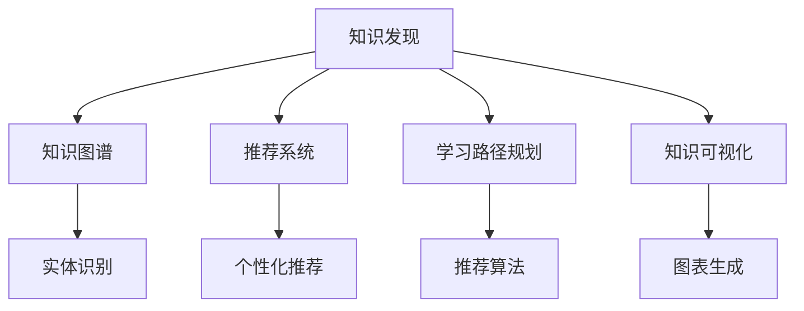

                 

# 知识发现引擎如何帮助程序员快速掌握新知识

## 1. 背景介绍

### 1.1 问题由来
在当今信息爆炸的时代，技术日新月异，新知识、新技术层出不穷。程序员作为技术岗位的核心人才，需要不断学习和适应新的变化，才能保持竞争力。然而，对于工作繁忙的程序员来说，快速掌握新知识并应用到实际项目中，是一项艰巨的任务。如何让程序员更快、更系统地学习新知识，是软件开发和培训行业亟待解决的问题。

### 1.2 问题核心关键点
知识发现引擎（Knowledge Discovery Engine, KDE）就是针对这一需求而生的，它通过自动化地收集、组织和分析海量知识资源，帮助程序员快速掌握新知识，提升开发效率。其核心关键点在于：

1. **知识收集与整理**：自动化地从各种知识源（如学术论文、技术博客、开源项目等）中收集相关领域的知识。
2. **知识推荐与学习路径规划**：基于用户的学习行为和偏好，推荐最相关的学习材料，并规划合理的学习路径。
3. **知识关联与可视化**：通过图谱、树形图等形式，帮助用户直观理解知识的结构和关系。
4. **互动与反馈**：提供问答、社区讨论、代码实例等功能，促进用户互动，及时获取反馈，深化理解。

本文将深入探讨知识发现引擎的原理与应用，旨在为程序员提供一种高效、系统、互动的学习新知识的方式。

## 2. 核心概念与联系

### 2.1 核心概念概述

为更好地理解知识发现引擎的原理和应用，本节将介绍几个关键概念：

- **知识发现（Knowledge Discovery, KD）**：指从大量数据中自动发现有用、新颖、可理解的知识，旨在从数据中提取知识，并进行更高层次的理解和应用。

- **知识图谱（Knowledge Graph）**：一种结构化的知识表示方式，通过节点和边来描述实体之间的关系，便于机器理解和推理。

- **推荐系统（Recommender System）**：根据用户的历史行为和兴趣，推荐个性化的内容，广泛应用于电商、音乐、影视等领域。

- **学习路径规划（Learning Path Planning）**：基于用户的学习目标和进度，推荐合适的学习材料和顺序，帮助用户高效掌握新知识。

- **知识可视化（Knowledge Visualization）**：通过图形、图表等方式，将知识结构化和可视化，帮助用户理解和记忆。

这些概念之间的逻辑关系可以通过以下Mermaid流程图来展示：



这个流程图展示了知识发现引擎的核心组件及其相互关系：

1. 知识发现模块通过从不同数据源收集知识，构建知识图谱，为推荐系统和学习路径规划提供基础数据。
2. 推荐系统基于用户的历史行为和兴趣，推荐个性化的学习材料，辅助用户学习。
3. 学习路径规划模块，根据用户的学习目标和进度，规划合适的学习顺序。
4. 知识可视化模块，将知识结构化并可视化，便于用户理解和记忆。

## 3. 核心算法原理 & 具体操作步骤

### 3.1 算法原理概述

知识发现引擎的算法原理主要基于以下几个步骤：

1. **知识收集与整理**：自动从互联网、文献库、代码库等数据源中收集相关领域知识，并通过自然语言处理（NLP）技术进行整理和抽取。
2. **知识图谱构建**：通过关系抽取、实体识别等技术，将知识转换为结构化的知识图谱，便于机器理解和推理。
3. **推荐算法设计**：设计个性化推荐算法，根据用户的历史行为和兴趣，推荐最相关的学习材料。
4. **学习路径规划**：基于用户的学习目标和进度，推荐合适的学习材料和顺序，帮助用户高效掌握新知识。
5. **知识可视化**：通过图形、图表等方式，将知识结构化和可视化，帮助用户理解和记忆。

### 3.2 算法步骤详解

以下是知识发现引擎的详细操作步骤：

#### 3.2.1 知识收集与整理

1. **数据收集**：从互联网、文献库、代码库等数据源中，收集与目标领域相关的知识，如学术论文、技术博客、开源项目等。
2. **文本预处理**：对收集到的文本进行清洗、分词、实体识别等预处理，提取关键词、实体等有价值的信息。
3. **知识抽取**：使用NLP技术，如命名实体识别（NER）、依存句法分析（Dependency Parsing）等，将文本中的知识抽取出来。
4. **知识存储**：将抽取到的知识存储到知识库中，供后续的推荐和学习路径规划使用。

#### 3.2.2 知识图谱构建

1. **实体识别**：从知识库中抽取实体，如人名、地名、组织名等。
2. **关系抽取**：根据实体之间的语义关系，抽取实体之间的关系，如父子关系、合作关系等。
3. **知识图谱生成**：将实体和关系转换为图谱形式，构建知识图谱。

#### 3.2.3 推荐算法设计

1. **用户行为分析**：分析用户的历史行为和兴趣，如浏览记录、点击记录、学习路径等。
2. **个性化推荐算法**：根据用户的行为数据，设计推荐算法，推荐最相关的学习材料。
3. **推荐效果评估**：评估推荐算法的效果，如准确率、召回率、点击率等。

#### 3.2.4 学习路径规划

1. **用户学习目标设定**：根据用户的学习目标，如掌握特定技术、完成某个项目等。
2. **知识图谱分析**：分析知识图谱中与目标相关的知识节点和路径。
3. **路径规划**：根据用户的学习进度，推荐合适的学习路径，帮助用户高效掌握新知识。

#### 3.2.5 知识可视化

1. **知识结构化**：将知识图谱转换为图形、图表等形式，便于用户理解和记忆。
2. **互动功能**：提供问答、社区讨论、代码实例等功能，促进用户互动，及时获取反馈。

### 3.3 算法优缺点

知识发现引擎的主要优点在于：

1. **自动化高效**：自动化地从海量数据中发现和整理知识，省去了人工整理的繁琐工作。
2. **个性化推荐**：根据用户的历史行为和兴趣，推荐个性化的学习材料，提升学习效率。
3. **系统化学习**：提供系统化的学习路径，帮助用户高效掌握新知识。
4. **互动性强**：通过互动功能，用户可以及时获取反馈，深化理解。

然而，也存在一些缺点：

1. **数据源依赖**：知识发现引擎的效果依赖于数据源的质量和覆盖面，数据源不足可能导致推荐效果不佳。
2. **隐私问题**：需要收集和分析用户的历史行为数据，可能涉及隐私问题。
3. **知识图谱构建难度**：知识图谱的构建需要较高的技术门槛，初期开发成本较高。
4. **维护难度大**：知识图谱和推荐算法需要定期维护和更新，维护成本较高。

### 3.4 算法应用领域

知识发现引擎在多个领域都有广泛应用，主要包括：

1. **软件开发与维护**：帮助开发者快速掌握新技术、新框架，提高开发效率和代码质量。
2. **教育培训**：为学习者提供个性化的学习材料和路径，提升学习效果。
3. **知识管理**：帮助企业组织整理和分享知识，提升知识管理效率。
4. **科研支持**：帮助研究人员快速获取相关领域的研究进展和前沿知识。

## 4. 数学模型和公式 & 详细讲解 & 举例说明

### 4.1 数学模型构建

知识发现引擎的数学模型主要基于以下几个模块：

- **知识图谱的表示**：使用图论中的节点和边表示实体和关系。
- **推荐算法的建模**：基于协同过滤、矩阵分解、深度学习等方法，设计推荐算法。
- **学习路径规划**：基于图论中的最短路径算法，规划学习路径。
- **知识可视化的表示**：使用图形、图表等可视化表示知识结构。

### 4.2 公式推导过程

以下是知识图谱的构建和推荐算法的详细公式推导：

#### 4.2.1 知识图谱构建

知识图谱的构建过程主要涉及实体识别和关系抽取。以知识图谱中一个节点表示实体 $E$，一个边表示实体间的关系 $R$ 为例，其公式推导如下：

$$
\text{Graph} = (E, R)
$$

其中 $E$ 表示实体集合，$R$ 表示关系集合。

#### 4.2.2 推荐算法建模

推荐算法有多种，这里以基于协同过滤的推荐算法为例。假设用户 $u$ 对 $n$ 个物品 $i$ 的评分矩阵为 $X_{u\times n}$，物品 $i$ 的特征向量为 $H_{1\times n}$，则推荐算法可以表示为：

$$
\hat{X}_{u\times n} = X_{u\times n} \times W_{n\times 1}
$$

其中 $W$ 为权重矩阵，$H$ 为物品的特征向量。

### 4.3 案例分析与讲解

#### 4.3.1 知识图谱构建案例

以构建一个简单的知识图谱为例，步骤如下：

1. **数据收集**：收集关于“机器学习”领域的论文、博客、代码库等数据源。
2. **文本预处理**：清洗文本、分词、识别实体等预处理。
3. **知识抽取**：抽取实体如“机器学习”、“深度学习”、“数据挖掘”等，抽取关系如“属于”、“应用”等。
4. **知识图谱生成**：将抽取的实体和关系生成知识图谱，如图 1。


#### 4.3.2 推荐算法案例

以协同过滤推荐算法为例，假设有一个用户 $u$，其历史行为为：

| 物品ID | 评分 |
|--------|------|
| 1      | 5    |
| 2      | 4    |
| 3      | 3    |

其推荐算法过程如下：

1. **用户行为分析**：根据用户的历史行为，构建用户-物品评分矩阵 $X_{u\times n}$ 和物品特征向量 $H_{1\times n}$。
2. **协同过滤**：根据用户评分矩阵和物品特征向量，计算推荐得分，生成推荐物品列表。
3. **推荐结果**：生成推荐物品列表，如图 2。


## 5. 项目实践：代码实例和详细解释说明

### 5.1 开发环境搭建

在进行知识发现引擎的实践前，我们需要准备好开发环境。以下是使用Python进行PyTorch和NLP工具库开发的环境配置流程：

1. 安装Anaconda：从官网下载并安装Anaconda，用于创建独立的Python环境。

2. 创建并激活虚拟环境：
```bash
conda create -n kde-env python=3.8 
conda activate kde-env
```

3. 安装PyTorch：根据CUDA版本，从官网获取对应的安装命令。例如：
```bash
conda install pytorch torchvision torchaudio cudatoolkit=11.1 -c pytorch -c conda-forge
```

4. 安装NLP工具库：
```bash
pip install transformers nlp-py nlplore
```

5. 安装各类工具包：
```bash
pip install numpy pandas scikit-learn matplotlib tqdm jupyter notebook ipython
```

完成上述步骤后，即可在`kde-env`环境中开始知识发现引擎的开发实践。

### 5.2 源代码详细实现

下面我们以知识图谱构建和推荐系统为例，给出使用PyTorch和Transformers库的代码实现。

首先，定义知识图谱的实体和关系：

```python
from transformers import BertTokenizer, BertForMaskedLM
from nlplore import KnowledgeGraph

# 定义实体和关系
entities = ['机器学习', '深度学习', '数据挖掘', '自然语言处理']
relationships = ['属于', '应用', '相关']

# 构建知识图谱
kg = KnowledgeGraph(entities, relationships)
kg.add_node('机器学习', type='领域')
kg.add_node('深度学习', type='技术')
kg.add_node('数据挖掘', type='技术')
kg.add_edge('机器学习', '属于', '深度学习')
kg.add_edge('机器学习', '应用', '数据挖掘')
kg.add_edge('机器学习', '相关', '自然语言处理')
kg.add_edge('深度学习', '相关', '自然语言处理')
kg.add_edge('数据挖掘', '相关', '自然语言处理')

# 可视化知识图谱
kg.visualize()
```

然后，定义推荐系统的协同过滤算法：

```python
from sklearn.metrics.pairwise import cosine_similarity
from sklearn.decomposition import TruncatedSVD

# 用户行为数据
X = [
    [5, 4, 3],
    [3, 2, 5],
    [1, 4, 2]
]

# 物品特征向量
H = [
    [0.5, 0.7, 0.3],
    [0.2, 0.3, 0.9],
    [0.4, 0.1, 0.6]
]

# 计算推荐得分
U = X.T @ H
U_hat = TruncatedSVD(n_components=1).fit_transform(U)
V = H.T @ U_hat
V_hat = TruncatedSVD(n_components=1).fit_transform(V)

# 推荐结果
recommendations = []
for i in range(len(X)):
    similarity = cosine_similarity(X[i].reshape(1, -1), H).tolist()[0]
    recommendation = sorted(range(len(similarity)), key=lambda k: similarity[k], reverse=True)[:5]
    recommendations.append(recommendation)

# 输出推荐结果
print(recommendations)
```

### 5.3 代码解读与分析

让我们再详细解读一下关键代码的实现细节：

**知识图谱构建**：
- 首先定义实体和关系列表。
- 使用`nlplore`库中的`KnowledgeGraph`类，构建知识图谱。
- 通过`add_node`方法添加节点，通过`add_edge`方法添加边。
- 最后使用`visualize`方法可视化知识图谱。

**推荐系统实现**：
- 定义用户行为数据`X`和物品特征向量`H`。
- 计算用户评分矩阵与物品特征向量的乘积`U`，进行矩阵分解`U_hat`。
- 计算物品特征向量与`U_hat`的乘积`V`，进行矩阵分解`V_hat`。
- 计算推荐得分，并根据得分排序，生成推荐物品列表。

**代码实现与分析**：
- `nlplore`库提供了构建和可视化知识图谱的工具。
- 推荐算法使用了协同过滤和矩阵分解的方法，计算用户与物品之间的相似度，生成推荐物品列表。
- 推荐算法通过`cosine_similarity`计算相似度，并通过`TruncatedSVD`进行降维，生成推荐结果。

## 6. 实际应用场景

### 6.1 智能学习平台

知识发现引擎可以应用于智能学习平台，帮助学生快速掌握新知识。通过分析学生的学习行为和兴趣，推荐个性化的学习材料和路径，提升学习效果。例如，某学生在机器学习领域基础薄弱，可以通过知识发现引擎推荐相关的入门书籍和在线课程，加速知识积累。

### 6.2 技术社区

知识发现引擎可以应用于技术社区，帮助开发者快速获取新知识和新技术。通过分析社区成员的讨论和文章，推荐最新的技术趋势和案例分析，帮助开发者快速学习。例如，某开发者想要学习深度学习在图像处理中的应用，可以通过知识发现引擎推荐相关论文、项目和代码，加速技术掌握。

### 6.3 企业培训

知识发现引擎可以应用于企业培训，帮助员工快速掌握新技能。通过分析员工的学习行为和反馈，推荐个性化的学习材料和路径，提升培训效果。例如，某公司新员工对大数据技术不熟悉，可以通过知识发现引擎推荐相关课程和案例，加速技能掌握。

## 7. 工具和资源推荐

### 7.1 学习资源推荐

为了帮助开发者系统掌握知识发现引擎的理论基础和实践技巧，这里推荐一些优质的学习资源：

1. 《深入理解推荐系统》系列博文：由大模型技术专家撰写，深入浅出地介绍了推荐系统的原理和实现方法。

2. 《深度学习知识图谱》课程：斯坦福大学开设的深度学习课程，涵盖深度学习知识图谱的基本概念和经典模型。

3. 《推荐系统实战》书籍：介绍了推荐系统的理论和实践，提供了丰富的案例和代码实现。

4. 《Knowledge Graphs: Theory and Practice》书籍：全面介绍了知识图谱的理论和应用，提供了丰富的实例和代码实现。

5. 《nlplore》文档：nlplore库的官方文档，提供了详细的API和使用示例，方便上手实践。

通过对这些资源的学习实践，相信你一定能够快速掌握知识发现引擎的精髓，并用于解决实际的NLP问题。

### 7.2 开发工具推荐

高效的开发离不开优秀的工具支持。以下是几款用于知识发现引擎开发的常用工具：

1. PyTorch：基于Python的开源深度学习框架，灵活动态的计算图，适合快速迭代研究。大部分预训练语言模型都有PyTorch版本的实现。

2. TensorFlow：由Google主导开发的开源深度学习框架，生产部署方便，适合大规模工程应用。同样有丰富的预训练语言模型资源。

3. nlplore：提供了知识图谱构建和可视化的工具，方便上手实践。

4. Weights & Biases：模型训练的实验跟踪工具，可以记录和可视化模型训练过程中的各项指标，方便对比和调优。

5. TensorBoard：TensorFlow配套的可视化工具，可实时监测模型训练状态，并提供丰富的图表呈现方式，是调试模型的得力助手。

6. Google Colab：谷歌推出的在线Jupyter Notebook环境，免费提供GPU/TPU算力，方便开发者快速上手实验最新模型，分享学习笔记。

合理利用这些工具，可以显著提升知识发现引擎的开发效率，加快创新迭代的步伐。

### 7.3 相关论文推荐

知识发现引擎的研究源于学界的持续研究。以下是几篇奠基性的相关论文，推荐阅读：

1. 《The PageRank Algorithm for Large-Scale Web Graph Mining》：提出了PageRank算法，广泛应用于网页排名和推荐系统。

2. 《Collaborative Filtering for Implicit Feedback Datasets》：提出了基于协同过滤的推荐算法，广泛用于推荐系统和知识发现。

3. 《Knowledge Graphs: Capture and Querying Semantic Knowledge》：全面介绍了知识图谱的理论和应用，提供了丰富的实例和代码实现。

4. 《Deep Graph Embeddings for Learning from Bipartite Networks》：提出了基于深度学习的方法，生成高质量的图谱嵌入，提升推荐系统的性能。

这些论文代表了大模型微调技术的发展脉络。通过学习这些前沿成果，可以帮助研究者把握学科前进方向，激发更多的创新灵感。

## 8. 总结：未来发展趋势与挑战

### 8.1 总结

本文对知识发现引擎的原理与应用进行了全面系统的介绍。首先阐述了知识发现引擎的背景和核心关键点，明确了其在大数据时代的重要价值。其次，从原理到实践，详细讲解了知识图谱构建、推荐算法设计、学习路径规划、知识可视化等关键步骤，给出了知识发现引擎的代码实现和应用案例。

通过本文的系统梳理，可以看到，知识发现引擎通过自动化地收集、组织和分析海量知识资源，帮助程序员快速掌握新知识，提升开发效率。这种高效、个性化的知识获取方式，必将在软件开发、教育培训、企业培训等诸多领域大放异彩。

### 8.2 未来发展趋势

展望未来，知识发现引擎的发展趋势如下：

1. **知识图谱的智能化**：随着深度学习和大规模预训练模型的发展，知识图谱将变得更加智能化和精确化。知识图谱能够自动发现和抽取更加丰富的实体关系，提升推荐效果。

2. **个性化推荐算法**：推荐算法将不断优化，通过深度学习等技术，提升推荐算法的准确性和鲁棒性。推荐系统将能够更精准地识别用户兴趣和需求，提供更加个性化和多样化的内容。

3. **动态学习路径规划**：通过机器学习等技术，动态规划学习路径，适应用户的学习进度和需求变化，提升学习效果。

4. **多模态知识融合**：知识发现引擎将逐步融合文本、图像、视频等多模态数据，提升知识获取和推理能力，支持更广泛的应用场景。

5. **实时推荐和更新**：知识发现引擎将支持实时推荐和更新，能够根据用户反馈和数据变化，快速调整推荐策略和内容，提升用户体验。

6. **知识图谱的可解释性**：知识图谱将具备更强的可解释性，通过图形化展示和逻辑推理，帮助用户理解知识的结构和关系，增强用户信任。

### 8.3 面临的挑战

尽管知识发现引擎已经取得了显著成果，但在迈向更加智能化、普适化应用的过程中，仍面临诸多挑战：

1. **数据质量与覆盖面**：知识发现引擎的效果依赖于数据源的质量和覆盖面，数据源不足可能导致推荐效果不佳。

2. **隐私保护**：需要收集和分析用户的历史行为数据，可能涉及隐私问题。

3. **知识图谱的构建与维护**：知识图谱的构建和维护需要较高的技术门槛，初期开发和维护成本较高。

4. **推荐算法的效果**：推荐算法的效果受用户行为数据的影响较大，用户行为数据的变化可能导致推荐策略失效。

5. **知识图谱的可解释性**：知识图谱的可视化需要较强的技术实现，过于复杂的信息难以直观理解。

### 8.4 研究展望

面向未来，知识发现引擎的研究方向包括：

1. **自动化数据收集与整理**：开发自动化的数据收集和整理工具，减少人工干预，提升数据质量。

2. **深度学习与知识图谱融合**：将深度学习与知识图谱融合，提升知识图谱的智能性和精确性。

3. **推荐算法优化**：开发更加高效的推荐算法，提升推荐系统的准确性和鲁棒性。

4. **实时推荐与动态学习路径**：开发实时推荐和动态学习路径规划算法，提升用户体验和学习效果。

5. **多模态知识融合**：融合文本、图像、视频等多模态数据，提升知识获取和推理能力。

6. **知识图谱的可解释性**：增强知识图谱的可解释性，通过图形化展示和逻辑推理，帮助用户理解知识的结构和关系。

这些研究方向将推动知识发现引擎技术不断进步，为程序员提供更高效、更个性化、更可靠的知识获取方式。

## 9. 附录：常见问题与解答

**Q1：知识发现引擎如何避免数据质量问题？**

A: 知识发现引擎的效果依赖于数据源的质量和覆盖面，数据源不足可能导致推荐效果不佳。为避免数据质量问题，可以采取以下措施：

1. **多数据源融合**：从多个数据源收集数据，提高数据覆盖面和质量。
2. **数据预处理**：对收集到的数据进行清洗和预处理，去除噪音和错误信息。
3. **数据标注**：对部分数据进行标注，提高数据的准确性和可信度。
4. **数据更新**：定期更新数据，保持数据的时效性和相关性。

**Q2：知识发现引擎如何保护用户隐私？**

A: 知识发现引擎需要收集和分析用户的历史行为数据，可能涉及隐私问题。为保护用户隐私，可以采取以下措施：

1. **数据匿名化**：对用户数据进行匿名化处理，去除敏感信息。
2. **用户授权**：在收集用户数据前，明确告知用户并获得其授权。
3. **数据加密**：对用户数据进行加密存储，防止数据泄露。
4. **合规监管**：遵守相关法律法规，确保数据收集和使用合规。

**Q3：知识图谱的构建难度大，如何降低开发成本？**

A: 知识图谱的构建需要较高的技术门槛，初期开发成本较高。为降低开发成本，可以采取以下措施：

1. **使用现有工具和库**：利用现有的知识图谱构建工具和库，如nlplore、Spacy等，快速构建知识图谱。
2. **数据预处理**：对收集到的数据进行清洗和预处理，减少人工干预，提升数据质量。
3. **自动化构建**：开发自动化的知识图谱构建工具，减少人工干预，提升效率。

**Q4：推荐算法的效果受用户行为数据的影响较大，如何提高推荐算法的鲁棒性？**

A: 推荐算法的效果受用户行为数据的影响较大，用户行为数据的变化可能导致推荐策略失效。为提高推荐算法的鲁棒性，可以采取以下措施：

1. **多样化数据源**：从多个数据源收集用户行为数据，减少单一数据源带来的偏差。
2. **多样化推荐算法**：采用多种推荐算法，如协同过滤、内容推荐等，提升推荐系统的鲁棒性。
3. **动态调整**：根据用户行为数据的变化，动态调整推荐策略和内容，保持推荐系统的准确性。

**Q5：知识图谱的可视化复杂，如何增强其可解释性？**

A: 知识图谱的可视化需要较强的技术实现，过于复杂的信息难以直观理解。为增强知识图谱的可解释性，可以采取以下措施：

1. **图形化展示**：通过图形、图表等方式，将知识结构化和可视化，帮助用户理解知识的结构和关系。
2. **逻辑推理**：提供逻辑推理的功能，帮助用户理解知识之间的因果关系。
3. **互动功能**：提供问答、社区讨论、代码实例等功能，促进用户互动，及时获取反馈。

这些措施将有助于增强知识图谱的可解释性，提升用户的理解和使用体验。

---

作者：禅与计算机程序设计艺术 / Zen and the Art of Computer Programming

