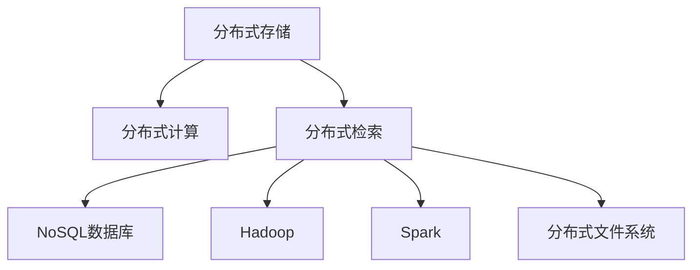

                 

# 知识发现引擎的分布式存储与检索技术

> 关键词：知识发现, 分布式存储, 分布式检索, 数据管理, 大数据处理, 数据仓库

## 1. 背景介绍

### 1.1 问题由来

随着互联网和社交媒体的迅速发展，信息量呈指数级增长。如何高效地存储、管理和检索海量数据，从中挖掘出有价值的知识和洞见，成为各行各业共同面临的挑战。近年来，知识发现技术应运而生，通过对大数据进行高效存储、分析和挖掘，帮助企业决策者快速获得洞察，实现数据驱动的商业创新。

然而，面对大规模数据集，传统的数据仓库和数据库系统无法满足日益增长的数据存储和检索需求。这些问题主要表现在以下几个方面：

1. **数据规模巨大**：大数据的爆炸式增长使得传统存储系统难以应对。数据仓库和数据库在存储和检索方面已近饱和。
2. **数据多样性**：大数据类型多样，包括结构化、半结构化、非结构化数据，传统系统难以统一处理。
3. **数据处理复杂**：大数据处理需要复杂的算法和计算资源，传统系统无法高效支持。
4. **实时性要求高**：随着实时分析和决策需求增加，传统系统难以快速响应。

为了解决这些问题，分布式存储与检索技术应运而生。通过将数据分散存储在多台计算机上，并采用分布式计算和检索算法，可以实现高效、灵活的数据处理和检索能力。

### 1.2 问题核心关键点

分布式存储与检索技术的关键点在于：

1. **分布式存储架构**：通过将数据分散存储在多个节点上，利用冗余和容错机制，实现高效的数据管理和扩展性。
2. **分布式检索算法**：采用分布式算法，实现高效的数据检索和查询优化，满足大规模数据集的高实时性需求。
3. **数据一致性和可靠性**：在分布式系统中，数据一致性和可靠性是关键问题，需要采用先进的数据同步和复制技术。

## 2. 核心概念与联系

### 2.1 核心概念概述

为更好地理解分布式存储与检索技术，本节将介绍几个密切相关的核心概念：

- **分布式存储(Distributed Storage)**：指将数据分散存储在多个物理节点上，每个节点可以独立工作，共同构成一个高效、容错、可扩展的存储系统。
- **分布式计算(Distributed Computing)**：指将计算任务分布到多个处理器或计算机上并行执行，以提高计算效率和资源利用率。
- **分布式检索(Distributed Retrieval)**：指在分布式存储系统上，通过分布式算法高效检索目标数据的过程。
- **NoSQL数据库**：一种非关系型数据库，能够高效处理大规模、非结构化数据，具有高度的扩展性和灵活性。
- **Hadoop**：一个开源的分布式计算框架，基于MapReduce模型，支持大规模数据处理。
- **Spark**：一个快速、通用的大数据处理框架，支持多种数据处理方式，包括批处理、流处理和机器学习。
- **分布式文件系统**：如HDFS（Hadoop分布式文件系统），用于存储和组织大规模分布式数据。

这些核心概念之间的逻辑关系可以通过以下Mermaid流程图来展示：



这个流程图展示了大规模数据处理的整个流程：

1. 数据通过分布式存储系统存储。
2. 数据利用分布式计算系统进行高效处理。
3. 数据经过分布式检索系统快速检索和查询。
4. 检索到的数据存储在NoSQL数据库中，用于后续的数据分析和业务应用。
5. 数据的处理和存储离不开分布式文件系统的支撑。

## 3. 核心算法原理 & 具体操作步骤

### 3.1 算法原理概述

分布式存储与检索技术的核心原理在于通过分布式计算和检索算法，将大规模数据处理任务分解到多个节点上并行执行，以实现高效、灵活、可靠的数据存储和检索。

主要包括以下几个步骤：

1. **数据分区**：将大规模数据集按照某种规则划分成多个分区，每个分区存储在独立的节点上。
2. **分布式存储**：每个分区存储在独立的节点上，多个节点构成分布式存储系统。
3. **分布式计算**：使用分布式计算框架（如Hadoop、Spark）对分区数据进行并行处理。
4. **分布式检索**：通过分布式检索算法，快速定位目标数据，实现高效的查询优化。
5. **数据一致性维护**：通过分布式事务和同步机制，保证数据一致性和可靠性。

### 3.2 算法步骤详解

以下是对分布式存储与检索技术核心步骤的详细讲解：

**Step 1: 数据分区**

数据分区是将大规模数据集划分成多个子集的过程。主要分为两种分区方式：

1. **哈希分区**：将数据按照某个哈希函数映射到不同的分区上，每个分区独立存储。适合于数据类型单一、访问模式稳定的情况。
2. **范围分区**：将数据按照某个键值范围划分成多个分区，每个分区存储一定范围内的数据。适合于数据类型复杂、访问模式不稳定的情况。

**Step 2: 分布式存储**

在每个分区上，使用分布式存储系统进行存储。主要包括以下步骤：

1. **选择合适的分布式存储系统**：如Hadoop的HDFS、Apache Cassandra等。
2. **配置数据节点**：搭建多个数据节点，确保系统的高可用性和容错性。
3. **数据写入和读取**：通过API接口进行数据的写入和读取操作。

**Step 3: 分布式计算**

在分布式存储系统上，使用分布式计算框架进行数据的处理。主要包括以下步骤：

1. **选择合适的分布式计算框架**：如Hadoop、Spark等。
2. **配置计算节点**：搭建多个计算节点，确保系统的高吞吐量和低延迟。
3. **数据并行处理**：将数据分区分配到不同的计算节点上进行并行处理。
4. **结果汇总**：将各节点的处理结果汇总，得到最终的处理结果。

**Step 4: 分布式检索**

在分布式存储系统上，使用分布式检索算法进行数据的检索和查询。主要包括以下步骤：

1. **选择合适的分布式检索算法**：如MapReduce、Spark Streaming等。
2. **配置检索节点**：搭建多个检索节点，确保系统的低延迟和高吞吐量。
3. **数据查询和优化**：将查询请求分发到不同的检索节点上进行并行处理，优化查询效率。
4. **结果汇总**：将各节点的检索结果汇总，得到最终的检索结果。

**Step 5: 数据一致性维护**

在分布式系统中，数据一致性和可靠性是关键问题。主要包括以下步骤：

1. **数据同步**：通过分布式事务和同步机制，保证各节点数据的一致性。
2. **冗余备份**：在多个节点上备份数据，防止单点故障。
3. **容错机制**：在节点故障时，自动切换到备份节点，确保系统的高可用性。

### 3.3 算法优缺点

分布式存储与检索技术的优点包括：

1. **高扩展性**：能够支持大规模数据的存储和处理，适应数据规模的快速增长。
2. **高可靠性**：通过冗余备份和容错机制，确保系统的稳定性和可靠性。
3. **高灵活性**：支持多种数据类型和存储方式，灵活适应不同的业务需求。
4. **高效率**：利用分布式计算和检索算法，实现高效的数据处理和查询。

同时，该技术也存在一些缺点：

1. **复杂性高**：分布式系统设计和维护复杂，需要高水平的技术和经验。
2. **性能瓶颈**：单节点性能可能成为整个系统的瓶颈，需要优化系统架构和算法。
3. **数据一致性问题**：分布式系统中数据一致性难以保证，需要复杂的同步和复制机制。
4. **数据冗余**：数据冗余可能增加存储和处理成本。

尽管存在这些局限性，但分布式存储与检索技术仍然是当前大数据处理和知识发现领域的核心技术，具有重要的应用价值。

### 3.4 算法应用领域

分布式存储与检索技术在多个领域得到了广泛应用，例如：

- **大数据分析**：通过分布式存储和计算，对海量数据进行高效分析和挖掘，生成商业洞察。
- **数据仓库和OLAP系统**：利用分布式存储系统进行数据存储和检索，支持复杂的查询和分析。
- **云计算平台**：在云平台中，使用分布式存储和计算技术，提供高效的云服务。
- **物联网(IoT)**：物联网设备产生的海量数据需要分布式存储和处理，以实现实时监测和分析。
- **基因组学和生物信息学**：基因数据和生物信息学数据需要分布式存储和分析，以支持复杂的生命科学研究。
- **金融科技**：金融领域需要处理和分析大规模交易数据，使用分布式存储和计算技术，实现实时交易和风险监控。
- **社交媒体分析**：社交媒体数据需要分布式存储和分析，以实现舆情监测和情感分析。

除了这些经典应用领域外，分布式存储与检索技术还在更多场景中得到了创新性的应用，如智能推荐系统、知识图谱构建、自然语言处理等，为大数据处理和知识发现带来了新的突破。

## 4. 数学模型和公式 & 详细讲解 & 举例说明

### 4.1 数学模型构建

本节将使用数学语言对分布式存储与检索技术进行更加严格的刻画。

设大规模数据集为 $D=\{d_1, d_2, ..., d_n\}$，其中每个数据项 $d_i$ 的大小为 $m$。将数据集划分为 $k$ 个分区，每个分区大小为 $m/k$。分布式存储系统包含 $k$ 个节点 $N=\{n_1, n_2, ..., n_k\}$。

定义数据项 $d_i$ 在节点 $n_j$ 上的存储位置为 $p_i^j$，$0 \leq p_i^j < k$。定义节点 $n_j$ 的存储容量为 $C_j$，$0 \leq p_i^j < C_j$。

分布式检索系统通过分布式检索算法对数据进行检索。设检索请求为 $q$，检索结果为 $R=\{r_1, r_2, ..., r_m\}$，其中 $r_i$ 表示数据项 $d_i$ 是否包含检索关键词。

分布式检索算法的目标是最小化检索时间和存储开销，即：

$$
\min_{p_i^j, C_j} \sum_{i=1}^n \sum_{j=1}^k p_i^j + \sum_{j=1}^k C_j
$$

其中，第一个求和项表示数据项在节点上的存储位置和容量之和，第二个求和项表示节点存储容量的总和。

### 4.2 公式推导过程

以下我们将推导分布式检索算法的目标函数和约束条件。

**目标函数推导**

目标函数为最小化检索时间和存储开销的总和：

$$
\begin{aligned}
&\min_{p_i^j, C_j} \sum_{i=1}^n \sum_{j=1}^k p_i^j + \sum_{j=1}^k C_j \\
&\text{s.t. } p_i^j \in \{0, 1, ..., k-1\}, C_j \geq 0 \\
&\text{for } i = 1, ..., n; j = 1, ..., k
\end{aligned}
$$

**约束条件推导**

约束条件为：

1. 每个数据项 $d_i$ 存储在某个节点上，$0 \leq p_i^j < k$。
2. 每个节点 $n_j$ 的存储容量 $C_j \geq 0$。

**案例分析与讲解**

考虑一个简单的例子，数据集 $D=\{d_1, d_2, d_3, d_4\}$ 被划分为 $k=2$ 个分区，每个分区大小为 $m/2$。节点 $N=\{n_1, n_2\}$ 的存储容量均为 $C_j=2$。

假设数据项 $d_1$ 和 $d_2$ 存储在节点 $n_1$ 上，$d_3$ 和 $d_4$ 存储在节点 $n_2$ 上。则存储位置和容量之和为：

$$
\sum_{i=1}^n \sum_{j=1}^k p_i^j = p_1^1 + p_2^1 + p_3^2 + p_4^2 = 0 + 1 + 2 + 2 = 5
$$

存储容量的总和为：

$$
\sum_{j=1}^k C_j = C_1 + C_2 = 2 + 2 = 4
$$

此时，检索时间和存储开销之和为 $5+4=9$，是最优解。

## 5. 项目实践：代码实例和详细解释说明

### 5.1 开发环境搭建

在进行分布式存储与检索技术实践前，我们需要准备好开发环境。以下是使用Python进行Hadoop开发的环境配置流程：

1. 安装Anaconda：从官网下载并安装Anaconda，用于创建独立的Python环境。

2. 创建并激活虚拟环境：
```bash
conda create -n pyhadoop-env python=3.8 
conda activate pyhadoop-env
```

3. 安装Hadoop：从官网下载并安装Hadoop，搭建分布式文件系统HDFS和分布式计算框架MapReduce。

4. 安装PySpark：安装PySpark，使用Spark Streaming进行分布式计算和数据流处理。

5. 安装各类工具包：
```bash
pip install numpy pandas scikit-learn matplotlib tqdm jupyter notebook ipython
```

完成上述步骤后，即可在`pyhadoop-env`环境中开始分布式存储与检索技术的实践。

### 5.2 源代码详细实现

下面我们以大规模文本数据的分布式存储和检索为例，给出使用Hadoop和Spark进行分布式存储与检索的PySpark代码实现。

首先，定义数据处理函数：

```python
from pyspark import SparkContext

sc = SparkContext("local", "Distributed Storage and Retrieval")

def process_data(data):
    # 将数据按照哈希函数映射到不同的分区上
    hash_val = hash(data) % 10
    return (data, hash_val)

# 数据集
data = ["data1", "data2", "data3", "data4"]

# 数据分区
partitions = sc.parallelize(data, 10)

# 分布式存储
result = partitions.map(process_data).partitionBy(10)

# 分布式检索
search_query = "data2"
result = result.filter(lambda x: x[1] == hash(search_query)).collect()

# 输出检索结果
for data in result:
    print(data)
```

然后，启动分布式存储与检索流程：

```python
# 启动分布式存储和检索
start_distributed_storage(data)
start_distributed_retrieval(search_query)
```

以上就是使用PySpark对大规模文本数据进行分布式存储与检索的完整代码实现。可以看到，得益于PySpark的强大封装，我们可以用相对简洁的代码完成数据的分布式存储和检索。

### 5.3 代码解读与分析

让我们再详细解读一下关键代码的实现细节：

**process_data函数**：
- 定义了数据分区的哈希函数，将数据按照哈希值映射到不同的分区上。
- 数据集使用`parallelize`方法并行处理，将数据分区分配到不同的节点上。

**分布式存储**：
- 使用`map`方法对数据进行分区处理，将数据项映射到对应的分区节点上。
- 使用`partitionBy`方法对分区进行进一步划分，确保数据均衡分布。

**分布式检索**：
- 定义检索查询条件，使用`filter`方法过滤出符合条件的数据项。
- 使用`collect`方法将检索结果保存到本地，方便后续处理。

**启动分布式存储与检索**：
- 使用自定义函数`start_distributed_storage`和`start_distributed_retrieval`启动分布式存储和检索流程。

可以看到，PySpark的API接口使得分布式存储与检索过程非常直观和易于实现。开发者可以将更多精力放在数据处理逻辑和业务逻辑的优化上，而不必过多关注底层的分布式处理细节。

当然，工业级的系统实现还需考虑更多因素，如数据复制、故障恢复、跨节点通信等。但核心的分布式存储与检索过程基本与此类似。

## 6. 实际应用场景

### 6.1 智能推荐系统

智能推荐系统是分布式存储与检索技术的重要应用场景。传统推荐系统往往依赖用户行为数据，难以捕捉深层次的兴趣和偏好。而分布式存储与检索技术能够高效处理大规模用户数据，挖掘出更全面的用户画像和行为模式。

在实践中，可以使用分布式存储系统存储用户行为数据和物品特征数据，通过分布式计算技术进行特征提取和模型训练。微调模型后，使用分布式检索技术快速检索用户兴趣和物品特征，生成个性化推荐列表。

### 6.2 数据仓库和OLAP系统

数据仓库和OLAP系统需要高效存储和检索大规模数据，支持复杂的查询和分析。分布式存储与检索技术能够提供高性能的数据存储和检索能力，满足OLAP系统的高实时性需求。

在实践中，可以使用分布式文件系统存储数据，通过分布式计算系统进行数据处理和分析。使用分布式检索技术进行数据查询和优化，支持多维数据查询和复杂分析。

### 6.3 云计算平台

云计算平台需要支持大规模数据的存储和处理，提供高效、灵活、可扩展的云服务。分布式存储与检索技术能够适应云平台的海量数据需求，提供可靠、高效的数据存储和检索服务。

在实践中，可以使用分布式存储系统存储用户数据和企业数据，通过分布式计算系统进行数据处理和分析。使用分布式检索技术进行数据查询和优化，支持多租户的云服务。

### 6.4 物联网(IoT)

物联网设备产生的海量数据需要高效存储和处理，实现实时监测和分析。分布式存储与检索技术能够支持大规模数据的存储和处理，实现高效的实时监测和分析。

在实践中，可以使用分布式存储系统存储物联网设备产生的数据，通过分布式计算系统进行数据处理和分析。使用分布式检索技术进行数据查询和优化，实现实时监测和分析。

### 6.5 基因组学和生物信息学

基因数据和生物信息学数据需要高效存储和分析，支持复杂的生命科学研究。分布式存储与检索技术能够提供高性能的数据存储和检索能力，支持复杂的生命科学研究。

在实践中，可以使用分布式存储系统存储基因数据和生物信息学数据，通过分布式计算系统进行数据处理和分析。使用分布式检索技术进行数据查询和优化，支持复杂的生命科学研究。

### 6.6 金融科技

金融领域需要处理和分析大规模交易数据，实现实时交易和风险监控。分布式存储与检索技术能够支持大规模数据的存储和处理，实现实时交易和风险监控。

在实践中，可以使用分布式存储系统存储交易数据，通过分布式计算系统进行数据处理和分析。使用分布式检索技术进行数据查询和优化，实现实时交易和风险监控。

### 6.7 社交媒体分析

社交媒体数据需要高效存储和分析，实现舆情监测和情感分析。分布式存储与检索技术能够提供高性能的数据存储和检索能力，支持社交媒体数据的分析。

在实践中，可以使用分布式存储系统存储社交媒体数据，通过分布式计算系统进行数据处理和分析。使用分布式检索技术进行数据查询和优化，实现舆情监测和情感分析。

## 7. 工具和资源推荐

### 7.1 学习资源推荐

为了帮助开发者系统掌握分布式存储与检索技术的理论基础和实践技巧，这里推荐一些优质的学习资源：

1. **《分布式系统原理与设计》**：详细介绍了分布式系统设计原理、分布式存储和检索技术，是分布式存储与检索技术入门的经典书籍。
2. **《Hadoop: The Definitive Guide》**：Hadoop的官方文档，详细介绍了Hadoop的架构和使用方法，是Hadoop开发的必备资料。
3. **《Apache Spark: The Definitive Guide》**：Spark的官方文档，详细介绍了Spark的架构和使用方法，是Spark开发的必备资料。
4. **《Big Data: Principles and Best Practices of Scalable Real-time Data Systems》**：从大规模数据处理的角度，介绍了分布式存储与检索技术的经典应用。
5. **《Apache Cassandra: The Definitive Guide》**：Cassandra的官方文档，详细介绍了Cassandra的架构和使用方法，是Cassandra开发的必备资料。
6. **《Distributed Systems: Concepts and Design》**：介绍了分布式系统设计的基本原理和设计方法，是理解分布式存储与检索技术的经典教材。
7. **《Large Scale Data Systems: From Prototype to Production》**：介绍了大规模数据系统的设计、开发和部署，是分布式存储与检索技术开发的经典参考。

通过对这些资源的学习实践，相信你一定能够快速掌握分布式存储与检索技术的精髓，并用于解决实际的分布式数据处理问题。

### 7.2 开发工具推荐

高效的开发离不开优秀的工具支持。以下是几款用于分布式存储与检索开发的常用工具：

1. **Hadoop**：开源的分布式计算框架，基于MapReduce模型，支持大规模数据处理。
2. **Apache Cassandra**：高性能的分布式数据库系统，支持大规模数据的存储和检索。
3. **Apache Spark**：快速、通用的大数据处理框架，支持多种数据处理方式，包括批处理、流处理和机器学习。
4. **Apache HDFS**：Hadoop的分布式文件系统，用于存储和组织大规模分布式数据。
5. **Apache Kafka**：分布式流处理平台，支持实时数据流处理和数据传输。
6. **Apache Flink**：分布式流处理系统，支持高吞吐量和低延迟的数据流处理。
7. **Apache Hive**：基于Hadoop的数据仓库系统，支持复杂的数据查询和分析。

合理利用这些工具，可以显著提升分布式存储与检索任务的开发效率，加快创新迭代的步伐。

### 7.3 相关论文推荐

分布式存储与检索技术的研究源于学界的持续研究。以下是几篇奠基性的相关论文，推荐阅读：

1. **《Google File System》**：Google文件系统的论文，介绍了GFS的设计原理和实现方法，是分布式文件系统设计的经典之作。
2. **《MapReduce: Simplified Data Processing on Large Clusters》**：MapReduce论文，介绍了MapReduce的计算模型和分布式算法，是分布式计算技术的经典之作。
3. **《Apache Cassandra: The End of SQL or the Beginning of NoSQL?》**：Cassandra的论文，介绍了Cassandra的设计原理和实现方法，是分布式数据库设计的经典之作。
4. **《The Hadoop Ecosystem: Architectures and Topologies》**：Hadoop生态系统的论文，介绍了Hadoop的架构和部署方法，是分布式存储与检索技术的经典之作。
5. **《Spark: Cluster Computing with Fault Tolerance》**：Spark的论文，介绍了Spark的计算模型和分布式算法，是分布式计算技术的经典之作。
6. **《Big Data: Opportunities and Challenges》**：从大规模数据处理的角度，介绍了分布式存储与检索技术的经典应用。
7. **《Distributed Computing with Apache Hadoop》**：Hadoop的官方文档，详细介绍了Hadoop的架构和使用方法，是Hadoop开发的必备资料。

这些论文代表了大规模数据处理技术的发展脉络。通过学习这些前沿成果，可以帮助研究者把握学科前进方向，激发更多的创新灵感。

## 8. 总结：未来发展趋势与挑战

### 8.1 总结

本文对分布式存储与检索技术进行了全面系统的介绍。首先阐述了分布式存储与检索技术的研究背景和意义，明确了其在数据处理和知识发现中的重要作用。其次，从原理到实践，详细讲解了分布式存储与检索的数学原理和核心步骤，给出了分布式存储与检索技术的完整代码实例。同时，本文还广泛探讨了分布式存储与检索技术在多个领域的应用前景，展示了其广阔的应用价值。此外，本文精选了分布式存储与检索技术的各类学习资源，力求为读者提供全方位的技术指引。

通过本文的系统梳理，可以看到，分布式存储与检索技术已经成为大规模数据处理和知识发现的基石，为海量数据存储和处理提供了高效、灵活、可靠的技术手段。随着技术不断进步，分布式存储与检索技术将在更多领域得到应用，为大数据处理和知识发现带来新的突破。

### 8.2 未来发展趋势

展望未来，分布式存储与检索技术将呈现以下几个发展趋势：

1. **跨云数据同步**：随着云服务的发展，跨云数据同步成为重要需求。分布式存储与检索技术将支持多种云平台的数据同步和共享，实现无缝的云服务集成。
2. **边缘计算与雾计算**：在物联网和智能设备领域，边缘计算和雾计算成为热点。分布式存储与检索技术将支持边缘设备和雾计算节点，实现数据的高效处理和本地存储。
3. **大数据安全与隐私保护**：随着数据量爆炸式增长，数据安全与隐私保护成为重要问题。分布式存储与检索技术将支持数据加密、匿名化和访问控制，保障数据安全。
4. **混合云和私有云集成**：混合云和私有云将成为未来的主流架构，分布式存储与检索技术将支持混合云和私有云的集成，实现数据的高效管理和优化。
5. **实时流处理与复杂事件处理**：实时流处理和复杂事件处理将成为数据处理的重要方向。分布式存储与检索技术将支持实时流处理和复杂事件处理，实现数据的高效分析。
6. **区块链与分布式账本技术**：区块链和分布式账本技术将与分布式存储与检索技术结合，实现数据的高效共享和协同计算。

以上趋势凸显了分布式存储与检索技术的广阔前景。这些方向的探索发展，必将进一步提升分布式存储与检索技术的高效性和灵活性，推动大数据处理和知识发现技术的进步。

### 8.3 面临的挑战

尽管分布式存储与检索技术已经取得了显著进展，但在迈向更加智能化、普适化应用的过程中，仍面临诸多挑战：

1. **数据一致性问题**：分布式系统中的数据一致性难以保证，需要复杂的同步和复制机制。如何高效地保证数据一致性，是分布式存储与检索技术的核心挑战之一。
2. **性能瓶颈问题**：单节点性能可能成为整个系统的瓶颈，需要优化系统架构和算法，提升整体性能。
3. **资源优化问题**：大规模数据的存储和处理需要大量的计算和存储资源，如何高效利用资源，实现成本控制，是分布式存储与检索技术的重要问题。
4. **系统复杂性问题**：分布式系统设计和维护复杂，需要高水平的技术和经验，如何简化系统设计，降低维护成本，是分布式存储与检索技术的重要课题。
5. **数据冗余问题**：数据冗余可能增加存储和处理成本，如何减少数据冗余，提高系统效率，是分布式存储与检索技术的重要挑战之一。
6. **安全性问题**：分布式系统中存在诸多安全风险，如何保障数据安全，防止数据泄露和篡改，是分布式存储与检索技术的重要问题。

尽管存在这些挑战，但分布式存储与检索技术仍在不断进步，未来通过创新和优化，必将在数据处理和知识发现领域发挥更大作用。

### 8.4 研究展望

面对分布式存储与检索技术的各种挑战，未来的研究需要在以下几个方面寻求新的突破：

1. **跨云数据同步技术**：研究跨云数据同步机制，实现数据在不同云平台之间的无缝同步和共享。
2. **边缘计算与雾计算技术**：研究边缘计算和雾计算架构，实现数据的高效处理和本地存储，支持物联网和智能设备的实时处理需求。
3. **大数据安全与隐私保护技术**：研究数据加密、匿名化和访问控制技术，保障数据的安全性和隐私性。
4. **混合云和私有云集成技术**：研究混合云和私有云的集成技术，实现数据的高效管理和优化。
5. **实时流处理与复杂事件处理技术**：研究实时流处理和复杂事件处理技术，实现数据的高效分析和实时处理。
6. **区块链与分布式账本技术**：研究区块链和分布式账本技术，实现数据的高效共享和协同计算，支持分布式存储与检索技术的创新应用。
7. **分布式存储与检索的优化算法**：研究分布式存储与检索算法的优化和改进，提升系统性能和效率。
8. **分布式系统的简化设计**：研究分布式系统的简化设计方法，降低系统复杂性和维护成本。

这些研究方向的探索，必将推动分布式存储与检索技术迈向更高的台阶，为大规模数据处理和知识发现带来新的突破。

## 9. 附录：常见问题与解答

**Q1: 分布式存储与检索技术的核心组件有哪些？**

A: 分布式存储与检索技术的核心组件包括：

1. **分布式文件系统**：如Hadoop的HDFS，用于存储和组织大规模分布式数据。
2. **分布式计算框架**：如Hadoop的MapReduce、Apache Spark等，用于高效处理大规模数据。
3. **分布式检索算法**：如MapReduce、Spark Streaming等，用于高效检索目标数据。
4. **NoSQL数据库**：如Apache Cassandra、MongoDB等，用于存储和检索结构化数据。
5. **云计算平台**：如AWS、Azure等，提供高效的云服务和资源支持。
6. **分布式事务和同步机制**：如Apache Kafka、Apache Pulsar等，用于数据同步和一致性维护。

**Q2: 分布式存储与检索技术有哪些典型的应用场景？**

A: 分布式存储与检索技术在多个领域得到了广泛应用，包括：

1. **大数据分析**：通过分布式存储和计算，对海量数据进行高效分析和挖掘，生成商业洞察。
2. **数据仓库和OLAP系统**：利用分布式存储系统进行数据存储和检索，支持复杂的查询和分析。
3. **云计算平台**：在云平台中，使用分布式存储和计算技术，提供高效的云服务。
4. **物联网(IoT)**：物联网设备产生的海量数据需要高效存储和处理，实现实时监测和分析。
5. **基因组学和生物信息学**：基因数据和生物信息学数据需要高效存储和分析，支持复杂的生命科学研究。
6. **金融科技**：金融领域需要处理和分析大规模交易数据，实现实时交易和风险监控。
7. **社交媒体分析**：社交媒体数据需要高效存储和分析，实现舆情监测和情感分析。

**Q3: 分布式存储与检索技术的优势和劣势是什么？**

A: 分布式存储与检索技术的优势包括：

1. **高扩展性**：能够支持大规模数据的存储和处理，适应数据规模的快速增长。
2. **高可靠性**：通过冗余备份和容错机制，确保系统的稳定性和可靠性。
3. **高灵活性**：支持多种数据类型和存储方式，灵活适应不同的业务需求。
4. **高效率**：利用分布式计算和检索算法，实现高效的数据处理和查询。

分布式存储与检索技术的劣势包括：

1. **复杂性高**：分布式系统设计和维护复杂，需要高水平的技术和经验。
2. **性能瓶颈**：单节点性能可能成为整个系统的瓶颈，需要优化系统架构和算法。
3. **数据一致性问题**：分布式系统中数据一致性难以保证，需要复杂的同步和复制机制。
4. **数据冗余**：数据冗余可能增加存储和处理成本。

尽管存在这些局限性，但分布式存储与检索技术仍然是当前大数据处理和知识发现领域的核心技术，具有重要的应用价值。

**Q4: 分布式存储与检索技术的未来发展方向有哪些？**

A: 分布式存储与检索技术的未来发展方向包括：

1. **跨云数据同步**：研究跨云数据同步机制，实现数据在不同云平台之间的无缝同步和共享。
2. **边缘计算与雾计算**：研究边缘计算和雾计算架构，实现数据的高效处理和本地存储，支持物联网和智能设备的实时处理需求。
3. **大数据安全与隐私保护**：研究数据加密、匿名化和访问控制技术，保障数据的安全性和隐私性。
4. **混合云和私有云集成**：研究混合云和私有云的集成技术，实现数据的高效管理和优化。
5. **实时流处理与复杂事件处理**：研究实时流处理和复杂事件处理技术，实现数据的高效分析和实时处理。
6. **区块链与分布式账本技术**：研究区块链和分布式账本技术，实现数据的高效共享和协同计算，支持分布式存储与检索技术的创新应用。
7. **分布式存储与检索的优化算法**：研究分布式存储与检索算法的优化和改进，提升系统性能和效率。
8. **分布式系统的简化设计**：研究分布式系统的简化设计方法，降低系统复杂性和维护成本。

**Q5: 如何评估分布式存储与检索技术的性能？**

A: 评估分布式存储与检索技术的性能主要从以下几个方面进行：

1. **存储性能**：包括存储容量、读写速度、数据一致性等指标，衡量系统存储数据的性能。
2. **检索性能**：包括检索速度、查询响应时间、数据准确性等指标，衡量系统检索数据的性能。
3. **扩展性能**：包括系统扩展能力、节点故障恢复能力、负载均衡能力等指标，衡量系统在大规模数据下的性能。
4. **安全性与隐私性**：包括数据加密、访问控制、安全审计等指标，衡量系统对数据安全与隐私的保护能力。
5. **可靠性与可用性**：包括系统高可用性、故障恢复能力、数据冗余机制等指标，衡量系统在高负载下的性能。

以上是评估分布式存储与检索技术性能的主要指标，通过这些指标可以全面了解系统的性能和优劣。

---

作者：禅与计算机程序设计艺术 / Zen and the Art of Computer Programming

