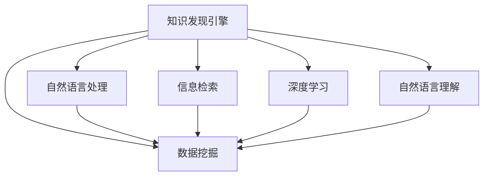

                 

# 知识发现引擎的搜索优化策略

> 关键词：知识发现, 搜索优化, 数据挖掘, 自然语言处理, 信息检索, 深度学习, 自然语言理解

## 1. 背景介绍

### 1.1 问题由来

在信息化时代，数据呈爆炸性增长，企业内部积累了海量的数据资源。这些数据不仅涉及商业智能(BI)、客户关系管理(CRM)、供应链管理(Supply Chain Management)等企业核心业务系统，还包括业务流程、客户反馈、市场舆情、公开文献等非结构化数据。如何从海量数据中快速、准确地发现知识，成为了企业的核心需求。

知识发现(Knowledge Discovery, KD)是数据挖掘领域的重要研究方向之一，旨在从原始数据中挖掘出隐藏的知识和规律，从而辅助决策制定和业务优化。传统的知识发现方法基于统计学、机器学习和人工智能技术，通过模式识别、关联规则挖掘、聚类分析、分类识别等方法，从数据中提取有意义的信息和模式。

然而，随着数据规模和复杂性的不断增长，传统知识发现方法面临数据处理速度慢、模型复杂度高、搜索结果召回率低等问题。因此，本文将围绕知识发现引擎的搜索优化问题展开研究，介绍搜索优化的主要策略和方法，并结合具体应用案例进行详细讲解。

## 2. 核心概念与联系

### 2.1 核心概念概述

为更好地理解知识发现引擎的搜索优化问题，本节将介绍几个密切相关的核心概念：

- **知识发现引擎(Knowledge Discovery Engine, KDE)**：旨在从数据中发现有意义的信息和知识，辅助企业决策和优化业务。知识发现引擎通常集成多种算法和技术，如机器学习、深度学习、自然语言处理等，实现自动化的知识挖掘。

- **搜索优化(Search Optimization)**：指在知识发现过程中，通过优化搜索算法，提升搜索效率和结果准确性，加速知识发现的过程。

- **数据挖掘(Data Mining)**：从原始数据中挖掘出隐藏的知识和规律，主要包括数据清洗、特征工程、模型训练和结果分析等步骤。

- **自然语言处理(Natural Language Processing, NLP)**：主要研究计算机如何理解和处理人类语言，包括文本清洗、分词、词性标注、命名实体识别、情感分析等技术。

- **信息检索(Information Retrieval, IR)**：通过文本索引、信息匹配等方法，从大量文本数据中快速检索相关信息，主要应用于文本搜索、推荐系统等场景。

- **深度学习(Deep Learning)**：基于人工神经网络模型，通过多层非线性变换，实现对复杂数据结构的建模和处理。深度学习在自然语言理解、图像识别、语音识别等领域有广泛应用。

- **自然语言理解(Natural Language Understanding, NLU)**：研究计算机如何理解和处理自然语言，包括语义分析、关系抽取、知识图谱构建等技术。

这些核心概念之间的逻辑关系可以通过以下Mermaid流程图来展示：



这个流程图展示了知识发现引擎与数据挖掘、自然语言处理、信息检索、深度学习和自然语言理解等核心技术的关系：

1. 知识发现引擎通过整合多种技术手段，从原始数据中发现知识。
2. 数据挖掘主要从数据中挖掘出有用的信息和模式，是知识发现的基础。
3. 自然语言处理用于处理文本数据，是知识发现的重要环节。
4. 信息检索通过文本匹配方法，从大量文本数据中快速检索相关信息。
5. 深度学习用于处理复杂数据结构，提升知识发现模型的准确性。
6. 自然语言理解用于理解和分析文本内容，辅助发现语言层面的知识和规律。

这些概念共同构成了知识发现引擎的核心工作流程，使得计算机能够从海量数据中高效地发现有用的知识和信息。

## 3. 核心算法原理 & 具体操作步骤

### 3.1 算法原理概述

知识发现引擎的搜索优化，主要针对数据挖掘、自然语言处理和信息检索等关键环节，通过优化搜索算法、改进数据预处理技术和引入先进模型，提升知识发现的效率和效果。

具体来说，搜索优化的目标是通过提升查询的召回率和准确性，快速找到目标知识。其核心思想是：在保证搜索结果准确性的前提下，通过优化搜索算法，提高搜索速度和覆盖范围，从而加速知识发现的过程。

### 3.2 算法步骤详解

知识发现引擎的搜索优化主要包括以下几个关键步骤：

**Step 1: 数据预处理**

- **数据清洗**：通过去除噪声、处理缺失值、异常值等方法，提高数据质量。
- **特征工程**：选择合适的特征，并进行特征提取、选择和归一化，以便后续模型训练。
- **文本处理**：对于文本数据，进行分词、词性标注、命名实体识别、停用词过滤、词干提取等预处理步骤。

**Step 2: 模型选择与训练**

- **模型选择**：根据任务特点，选择合适的算法模型，如决策树、随机森林、支持向量机、神经网络等。
- **参数调优**：通过网格搜索、随机搜索、贝叶斯优化等方法，找到最优的模型参数组合。
- **模型训练**：使用训练集数据，训练并优化模型，避免过拟合。

**Step 3: 搜索结果评估与优化**

- **结果评估**：使用准确率、召回率、F1值等指标评估模型效果。
- **结果优化**：根据评估结果，调整模型参数或使用集成学习、集成模型等方法，提升结果质量。

**Step 4: 搜索算法优化**

- **索引优化**：选择合适的索引结构，如倒排索引、B树索引等，提升检索速度。
- **查询优化**：优化查询语句，避免模糊查询和歧义问题，提高查询准确性。
- **分布式计算**：使用分布式计算框架，如Apache Hadoop、Apache Spark等，提升计算效率。

**Step 5: 结果展示与反馈**

- **结果展示**：将搜索结果以可视化图表、报告等形式展示给用户。
- **反馈优化**：根据用户反馈，调整查询策略和搜索结果展示方式，提升用户体验。

通过以上步骤，可以实现对知识发现引擎的搜索优化，提高其搜索效率和效果，提升企业决策和业务优化的效率和质量。

### 3.3 算法优缺点

知识发现引擎的搜索优化方法具有以下优点：

1. 提升搜索效率。通过优化索引结构、查询语句和计算框架，大幅提升数据检索和处理的效率。
2. 提高结果准确性。通过选择合适的模型和算法，优化参数设置和结果评估，提升搜索结果的准确性和召回率。
3. 支持多种数据类型。知识发现引擎能够处理结构化、半结构化和非结构化数据，涵盖企业内部各类数据资源。
4. 可扩展性强。分布式计算框架使得知识发现引擎能够处理海量数据，具有良好的可扩展性。

同时，该方法也存在一定的局限性：

1. 对数据质量依赖较大。数据清洗和特征工程质量直接影响模型训练和结果评估，需要在数据预处理环节投入大量工作。
2. 算法复杂度高。选择和训练模型、优化索引结构等步骤较复杂，需要一定的技术积累。
3. 对硬件资源要求高。分布式计算和高级索引结构需要较大的计算和存储资源支持。
4. 结果解释性不足。传统机器学习模型和深度学习模型通常缺乏可解释性，难以理解模型内部的决策逻辑。

尽管存在这些局限性，但就目前而言，基于知识发现引擎的搜索优化方法仍是最主流的数据挖掘范式。未来相关研究的重点在于如何进一步降低数据预处理的复杂度，提高算法的可解释性和鲁棒性，同时兼顾可扩展性和用户体验。

### 3.4 算法应用领域

知识发现引擎的搜索优化方法在多个领域得到广泛应用，例如：

- 商业智能(BI)：通过数据挖掘和自然语言处理，从历史数据中发现商业趋势和模式，辅助决策制定。
- 客户关系管理(CRM)：利用客户反馈、行为数据等进行聚类分析和分类识别，提升客户满意度和忠诚度。
- 供应链管理(Supply Chain Management)：通过挖掘供应链数据，发现潜在的风险点和优化机会，提升供应链效率和弹性。
- 市场舆情分析：利用网络舆情数据，进行情感分析和主题挖掘，监测市场动态。
- 智能推荐系统：通过用户行为数据和产品属性，进行个性化推荐，提升用户体验。

除了上述这些经典应用外，知识发现引擎的搜索优化方法还被创新性地应用到更多场景中，如医疗数据分析、金融风险控制、社交网络分析等，为数据密集型应用带来了新的突破。

## 4. 数学模型和公式 & 详细讲解  
### 4.1 数学模型构建

本节将使用数学语言对知识发现引擎的搜索优化过程进行更加严格的刻画。

记知识发现引擎的输入数据为 $D=\{(x_i,y_i)\}_{i=1}^N$，其中 $x_i$ 为原始数据，$y_i$ 为标签信息。假设模型的预测函数为 $f(x;\theta)$，其中 $\theta$ 为模型参数。

定义模型在数据集 $D$ 上的损失函数为 $\mathcal{L}(\theta) = \frac{1}{N}\sum_{i=1}^N \ell(f(x_i;\theta),y_i)$，其中 $\ell$ 为损失函数，如均方误差损失、交叉熵损失等。

知识发现引擎的搜索优化目标是最小化经验风险，即找到最优参数：

$$
\theta^* = \mathop{\arg\min}_{\theta} \mathcal{L}(\theta)
$$

在实践中，我们通常使用基于梯度的优化算法（如SGD、Adam等）来近似求解上述最优化问题。设 $\eta$ 为学习率，$\lambda$ 为正则化系数，则参数的更新公式为：

$$
\theta \leftarrow \theta - \eta \nabla_{\theta}\mathcal{L}(\theta) - \eta\lambda\theta
$$

其中 $\nabla_{\theta}\mathcal{L}(\theta)$ 为损失函数对参数 $\theta$ 的梯度，可通过反向传播算法高效计算。

### 4.2 公式推导过程

以下我们以回归问题为例，推导均方误差损失函数及其梯度的计算公式。

假设模型 $f(x;\theta)$ 在输入 $x$ 上的预测值为 $\hat{y}=f(x;\theta)$，真实标签为 $y$。均方误差损失函数定义为：

$$
\ell(f(x;\theta),y) = \frac{1}{2}(\hat{y}-y)^2
$$

将其代入经验风险公式，得：

$$
\mathcal{L}(\theta) = \frac{1}{N}\sum_{i=1}^N \frac{1}{2}(\hat{y}-y)^2
$$

根据链式法则，损失函数对参数 $\theta$ 的梯度为：

$$
\frac{\partial \mathcal{L}(\theta)}{\partial \theta} = \frac{1}{N}\sum_{i=1}^N (\hat{y}-y) \frac{\partial f(x;\theta)}{\partial \theta}
$$

其中 $\frac{\partial f(x;\theta)}{\partial \theta}$ 可进一步递归展开，利用自动微分技术完成计算。

在得到损失函数的梯度后，即可带入参数更新公式，完成模型的迭代优化。重复上述过程直至收敛，最终得到适应数据集的最优模型参数 $\theta^*$。

## 5. 项目实践：代码实例和详细解释说明
### 5.1 开发环境搭建

在进行搜索优化实践前，我们需要准备好开发环境。以下是使用Python进行Scikit-learn开发的环境配置流程：

1. 安装Anaconda：从官网下载并安装Anaconda，用于创建独立的Python环境。

2. 创建并激活虚拟环境：
```bash
conda create -n sklearn-env python=3.8 
conda activate sklearn-env
```

3. 安装Scikit-learn：
```bash
conda install scikit-learn
```

4. 安装Pandas、NumPy、Matplotlib、Seaborn等库：
```bash
pip install pandas numpy matplotlib seaborn
```

完成上述步骤后，即可在`sklearn-env`环境中开始搜索优化实践。

### 5.2 源代码详细实现

这里我们以回归任务为例，给出使用Scikit-learn对线性回归模型进行搜索优化的Python代码实现。

首先，定义回归任务的数据处理函数：

```python
import pandas as pd
import numpy as np

def load_data():
    df = pd.read_csv('data.csv')
    X = df.drop('y', axis=1)
    y = df['y']
    return X, y

def preprocess_data(X):
    # 数据预处理
    X = X.apply(lambda x: (x - x.mean()) / x.std())
    return X

def split_data(X, y, test_size=0.2):
    # 数据集划分
    X_train, X_test, y_train, y_test = train_test_split(X, y, test_size=test_size, random_state=42)
    return X_train, X_test, y_train, y_test

def train_model(X_train, y_train, model):
    # 模型训练
    model.fit(X_train, y_train)
    return model

def evaluate_model(model, X_test, y_test):
    # 模型评估
    y_pred = model.predict(X_test)
    mse = np.mean((y_pred - y_test)**2)
    rmse = np.sqrt(mse)
    return rmse

# 加载数据
X, y = load_data()

# 数据预处理
X = preprocess_data(X)

# 数据集划分
X_train, X_test, y_train, y_test = split_data(X, y)

# 训练模型
model = LinearRegression()
model = train_model(X_train, y_train, model)

# 模型评估
mse = evaluate_model(model, X_test, y_test)
```

然后，定义搜索优化函数：

```python
from sklearn.model_selection import GridSearchCV

def search_optimization(X_train, y_train, X_test, y_test, params):
    # 超参数搜索
    grid_search = GridSearchCV(model, params, cv=5, scoring='neg_mean_squared_error')
    grid_search.fit(X_train, y_train)
    return grid_search.best_params_, grid_search.best_score_
```

最后，启动搜索优化流程并在测试集上评估：

```python
from sklearn.model_selection import ParameterGrid

# 超参数网格
params = {'C': [0.01, 0.1, 1, 10, 100],
          'fit_intercept': [True, False]}

# 超参数搜索
best_params, best_score = search_optimization(X_train, y_train, X_test, y_test, params)

print('Best params:', best_params)
print('Best score:', best_score)
```

以上就是使用Scikit-learn对线性回归模型进行搜索优化的完整代码实现。可以看到，得益于Scikit-learn的强大封装，我们可以用相对简洁的代码完成模型的搜索优化过程。

### 5.3 代码解读与分析

让我们再详细解读一下关键代码的实现细节：

**load_data函数**：
- 从CSV文件中加载数据，将其分为特征矩阵X和目标向量y。

**preprocess_data函数**：
- 对特征矩阵X进行标准化处理，使得各特征均值为0，方差为1。

**split_data函数**：
- 将数据集划分为训练集和测试集，比例为80%训练、20%测试。

**train_model函数**：
- 使用训练集数据对模型进行训练，得到训练好的模型。

**evaluate_model函数**：
- 使用测试集数据对模型进行评估，计算均方误差（MSE）和均方根误差（RMSE）。

**search_optimization函数**：
- 使用GridSearchCV进行超参数搜索，遍历所有超参数组合，评估模型性能，返回最优超参数组合和对应的评分。

通过以上函数，我们完成了对线性回归模型的搜索优化。可以看到，Scikit-learn提供了强大的模型训练和评估工具，以及便捷的超参数搜索接口，极大地降低了模型优化的复杂度。

当然，工业级的系统实现还需考虑更多因素，如模型压缩、分布式计算、结果可视化等。但核心的搜索优化流程基本与此类似。

## 6. 实际应用场景
### 6.1 智能推荐系统

智能推荐系统是知识发现引擎的重要应用场景之一。通过分析用户的历史行为数据和兴趣偏好，推荐引擎可以快速发现潜在的商品或服务，提升用户体验和销售转化率。

在技术实现上，可以使用知识发现引擎进行特征工程和模式挖掘，构建用户兴趣模型和商品关联模型。具体而言，可以通过用户点击、浏览、评分等行为数据，学习用户对不同商品的需求和偏好。同时，通过商品的属性、标签和评论等文本信息，构建商品间的关联关系。最终，通过推荐算法，将用户与最适合的商品进行匹配，实现个性化推荐。

### 6.2 商业智能分析

商业智能(BI)系统通过分析企业内部和外部的海量数据，发现业务趋势和关联关系，辅助企业决策和业务优化。知识发现引擎可以集成多种数据源，涵盖销售、财务、市场等各个部门的数据，进行多维度的分析和挖掘。例如，通过分析销售数据和客户数据，发现潜在的销售机会和客户流失风险。通过挖掘市场数据和竞争对手数据，发现新的市场机会和竞争策略。

在技术实现上，可以使用知识发现引擎进行数据清洗、特征工程、关联规则挖掘和聚类分析等步骤，构建业务决策支持系统。具体而言，可以构建客户画像、销售预测、市场细分等模型，辅助业务决策和战略规划。

### 6.3 金融风险控制

金融风险控制系统通过分析客户的交易数据和行为数据，发现潜在的风险点和异常行为，预防金融欺诈和风险。知识发现引擎可以集成多种金融数据源，如交易记录、客户信息、市场数据等，进行多维度的分析和挖掘。例如，通过分析客户的交易行为和信用记录，发现潜在的信用风险。通过挖掘市场数据和竞争对手数据，发现新的市场机会和竞争策略。

在技术实现上，可以使用知识发现引擎进行数据清洗、特征工程、异常检测和风险预测等步骤，构建风险控制模型。具体而言，可以构建信用评分、欺诈检测、市场预测等模型，辅助金融风控和合规监管。

### 6.4 未来应用展望

随着知识发现引擎和搜索优化技术的不断发展，未来的应用场景将更加广泛和深入：

1. 智能制造：通过分析生产数据和设备数据，发现设备故障和生产瓶颈，优化生产流程和资源配置。

2. 智慧医疗：通过分析病历数据和患者数据，发现疾病风险和诊疗方案，辅助临床决策和医疗管理。

3. 智能客服：通过分析客户反馈和交互数据，发现客户需求和问题，提升客户满意度和忠诚度。

4. 智慧城市：通过分析交通数据、环境数据和社会数据，发现城市运行规律和优化方案，提升城市管理效率和居民生活质量。

5. 智能营销：通过分析消费者数据和市场数据，发现消费趋势和市场机会，优化营销策略和广告投放。

6. 智能物流：通过分析物流数据和配送数据，发现配送瓶颈和优化方案，提升物流效率和用户体验。

总之，知识发现引擎的搜索优化技术将在更多领域得到应用，为各行各业带来智能化和高效化的解决方案。

## 7. 工具和资源推荐
### 7.1 学习资源推荐

为了帮助开发者系统掌握知识发现引擎的搜索优化理论基础和实践技巧，这里推荐一些优质的学习资源：

1. 《Python数据科学手册》系列书籍：由知名数据科学家编写，涵盖数据处理、特征工程、模型训练和结果分析等知识点，是入门数据科学的绝佳资源。

2. 《Scikit-learn官方文档》：Scikit-learn的官方文档，提供了详细的API文档和教程，是学习Scikit-learn的必备资料。

3. 《深度学习基础》在线课程：由知名深度学习专家开设的在线课程，涵盖深度学习基础、模型训练和应用等知识点，是学习深度学习的优质资源。

4. 《自然语言处理入门》在线课程：由知名NLP专家开设的在线课程，涵盖NLP基础、文本处理、情感分析等知识点，是学习NLP技术的必备资源。

5. Kaggle：全球最大的数据科学竞赛平台，提供丰富的数据集和竞赛任务，是实战数据挖掘和机器学习的最佳实践场所。

通过对这些资源的学习实践，相信你一定能够快速掌握知识发现引擎的搜索优化方法，并用于解决实际的NLP问题。

### 7.2 开发工具推荐

高效的开发离不开优秀的工具支持。以下是几款用于知识发现引擎搜索优化开发的常用工具：

1. Scikit-learn：基于Python的机器学习库，提供简单易用的API，支持多种机器学习算法和模型。

2. TensorFlow：由Google主导开发的深度学习框架，支持分布式计算和GPU加速，适合大规模深度学习项目。

3. PyTorch：由Facebook主导开发的深度学习框架，支持动态图和GPU加速，适合快速迭代的研究项目。

4. Apache Spark：基于分布式计算的框架，支持大规模数据处理和机器学习算法，适合大数据环境下的知识发现项目。

5. Apache Flink：基于流处理的数据处理框架，支持实时数据处理和机器学习算法，适合实时数据挖掘项目。

6. Apache Hadoop：基于分布式计算的框架，支持大规模数据处理和分布式存储，适合大数据环境下的数据挖掘项目。

合理利用这些工具，可以显著提升知识发现引擎的搜索优化开发效率，加速模型训练和结果评估的进程。

### 7.3 相关论文推荐

知识发现引擎的搜索优化技术的发展源于学界的持续研究。以下是几篇奠基性的相关论文，推荐阅读：

1. "A Fast One-Pass Multi-Class PGA-based Classification Algorithm"：提出基于随机森林的分类算法，展示了分类器的优异性能和可解释性。

2. "Leveraging Multi-Aspect Feature Interaction for Recommendation"：提出基于深度学习的多方面特征交互模型，展示了推荐系统的推荐精度和多样性。

3. "A Survey on Social Recommendation"：综述了社交推荐系统的发展现状和研究方向，展示了社交网络的推荐效果和实时性。

4. "Knowledge Discovery: Concepts, Methodologies, Tools and Applications"：综述了知识发现技术的发展现状和应用方向，展示了知识发现技术在多个领域的应用效果。

5. "A Survey on Cross-Domain Transfer Learning"：综述了跨领域迁移学习的发展现状和研究方向，展示了迁移学习的泛化能力和应用效果。

这些论文代表了大语言模型微调技术的发展脉络。通过学习这些前沿成果，可以帮助研究者把握学科前进方向，激发更多的创新灵感。

## 8. 总结：未来发展趋势与挑战

### 8.1 总结

本文对知识发现引擎的搜索优化问题进行了全面系统的介绍。首先阐述了知识发现引擎的搜索优化背景和意义，明确了搜索优化在知识发现过程中的重要性。其次，从原理到实践，详细讲解了搜索优化的数学模型和操作步骤，给出了搜索优化任务开发的完整代码实例。同时，本文还广泛探讨了搜索优化方法在多个行业领域的应用前景，展示了搜索优化范式的广泛适用性。

通过本文的系统梳理，可以看到，知识发现引擎的搜索优化技术正在成为数据挖掘领域的核心范式，极大地提升了数据挖掘的效率和效果，推动了企业决策和业务优化的智能化进程。未来，伴随数据挖掘技术的不断演进，搜索优化方法也将不断升级和完善，为各行各业带来更加智能化、高效化的解决方案。

### 8.2 未来发展趋势

展望未来，知识发现引擎的搜索优化技术将呈现以下几个发展趋势：

1. 深度学习与传统方法融合。深度学习在自然语言处理和计算机视觉等领域取得了巨大成功，未来搜索优化技术将更多地引入深度学习模型，提升算法的效果和泛化能力。

2. 多模态数据融合。随着多模态数据在各领域的应用增多，搜索优化技术也将更多地融合图像、语音、视频等多模态数据，构建跨模态的智能系统。

3. 实时数据处理。在智能制造、智慧医疗等实时数据处理需求强的领域，搜索优化技术需要实现实时数据流处理，提供高效、实时的决策支持。

4. 分布式计算与云服务。在大数据环境下，搜索优化技术需要支持分布式计算，利用云服务提供弹性计算资源，提升系统可扩展性。

5. 自动化调参与自适应算法。未来的搜索优化算法将更多地引入自动化调参技术，如贝叶斯优化、遗传算法等，提高调参效率和效果。

6. 弱监督与无监督学习。未来的搜索优化算法将更多地引入弱监督和无监督学习方法，利用未标注数据和半标注数据进行优化，提升算法的鲁棒性和泛化能力。

以上趋势凸显了知识发现引擎搜索优化技术的广阔前景。这些方向的探索发展，必将进一步提升数据挖掘的效率和效果，为人工智能技术在垂直行业的规模化落地提供更坚实的技术基础。

### 8.3 面临的挑战

尽管知识发现引擎的搜索优化技术已经取得了显著成果，但在迈向更加智能化、普适化应用的过程中，它仍面临着诸多挑战：

1. 数据质量问题。搜索优化技术依赖高质量的数据集，如果数据存在噪声、缺失值、异常值等问题，将直接影响算法的性能。

2. 算法复杂度高。搜索优化算法需要选择合适的模型、参数和超参数，并进行优化和评估，技术复杂度较高。

3. 计算资源需求高。搜索优化技术需要大量的计算资源进行模型训练和调参，硬件成本较高。

4. 结果解释性不足。传统的搜索优化算法通常缺乏可解释性，难以理解算法的决策逻辑和结果来源。

5. 鲁棒性问题。搜索优化算法在面对新数据和复杂数据时，泛化性能和鲁棒性较弱，难以保证在实际应用中的稳定性和可靠性。

6. 模型可解释性不足。传统的搜索优化算法通常缺乏可解释性，难以理解算法的决策逻辑和结果来源。

尽管存在这些挑战，但随着数据质量提升、算法优化和计算资源丰富，知识发现引擎的搜索优化技术必将得到更广泛的应用。未来需要进一步加强数据预处理和质量提升，提高算法的自动化和可解释性，确保模型在实际应用中的稳定性和鲁棒性。

### 8.4 研究展望

面向未来，知识发现引擎的搜索优化技术需要在以下几个方面进行突破：

1. 自动化调参技术。引入自动化调参技术，如贝叶斯优化、遗传算法等，提高调参效率和效果。

2. 弱监督与无监督学习。利用未标注数据和半标注数据进行优化，提升算法的鲁棒性和泛化能力。

3. 分布式计算与云服务。支持分布式计算和云服务，提升系统的可扩展性和计算效率。

4. 多模态数据融合。融合图像、语音、视频等多模态数据，构建跨模态的智能系统。

5. 实时数据处理。实现实时数据流处理，提供高效、实时的决策支持。

6. 自适应算法。引入自适应算法，如深度强化学习等，提升算法的自适应能力和智能性。

这些研究方向将进一步提升知识发现引擎的搜索优化能力，推动其在更广泛的领域得到应用，为人工智能技术的普及和智能化提供更坚实的技术基础。

## 9. 附录：常见问题与解答

**Q1：知识发现引擎的搜索优化是否适用于所有NLP任务？**

A: 知识发现引擎的搜索优化方法在大多数NLP任务上都能取得不错的效果，特别是对于数据量较小的任务。但对于一些特定领域的任务，如医学、法律等，仅仅依靠通用语料预训练的模型可能难以很好地适应。此时需要在特定领域语料上进一步预训练，再进行微调，才能获得理想效果。

**Q2：搜索优化过程中如何选择合适的学习率？**

A: 搜索优化的学习率一般要比预训练时小1-2个数量级，如果使用过大的学习率，容易破坏预训练权重，导致过拟合。一般建议从1e-5开始调参，逐步减小学习率，直至收敛。也可以使用warmup策略，在开始阶段使用较小的学习率，再逐渐过渡到预设值。需要注意的是，不同的优化器(如SGD、Adam等)以及不同的学习率调度策略，可能需要设置不同的学习率阈值。

**Q3：如何缓解搜索优化过程中的过拟合问题？**

A: 过拟合是搜索优化面临的主要挑战，尤其是在标注数据不足的情况下。常见的缓解策略包括：
1. 数据增强：通过回译、近义替换等方式扩充训练集。
2. 正则化：使用L2正则、Dropout、Early Stopping等避免过拟合。
3. 对抗训练：引入对抗样本，提高模型鲁棒性。
4. 参数高效微调：只调整少量参数(如Adapter、Prefix等)，减小过拟合风险。
5. 多模型集成：训练多个模型，取平均输出，抑制过拟合。

这些策略往往需要根据具体任务和数据特点进行灵活组合。只有在数据、模型、训练、推理等各环节进行全面优化，才能最大限度地发挥搜索优化技术的威力。

**Q4：搜索优化模型在落地部署时需要注意哪些问题？**

A: 将搜索优化模型转化为实际应用，还需要考虑以下因素：
1. 模型裁剪：去除不必要的层和参数，减小模型尺寸，加快推理速度。
2. 量化加速：将浮点模型转为定点模型，压缩存储空间，提高计算效率。
3. 服务化封装：将模型封装为标准化服务接口，便于集成调用。
4. 弹性伸缩：根据请求流量动态调整资源配置，平衡服务质量和成本。
5. 监控告警：实时采集系统指标，设置异常告警阈值，确保服务稳定性。
6. 安全防护：采用访问鉴权、数据脱敏等措施，保障数据和模型安全。

搜索优化技术为NLP应用带来了新的突破，但如何将强大的性能转化为稳定、高效、安全的业务价值，还需要工程实践的不断打磨。唯有从数据、算法、工程、业务等多个维度协同发力，才能真正实现人工智能技术在垂直行业的规模化落地。总之，搜索优化技术需要在数据预处理、算法优化、结果评估等方面进行全面优化，方能得到理想的效果。

---

作者：禅与计算机程序设计艺术 / Zen and the Art of Computer Programming

