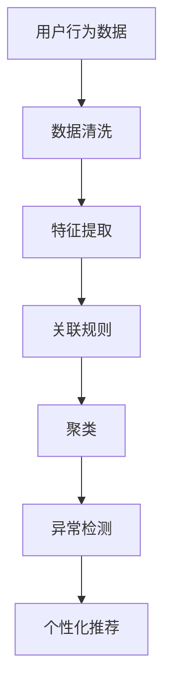

                 

# 知识发现引擎的用户行为分析与应用

> 关键词：知识发现引擎, 用户行为分析, 数据挖掘, 关联规则, 聚类, 异常检测, 个性化推荐, 客户细分

## 1. 背景介绍

在信息爆炸的今天，如何从海量数据中挖掘有价值的信息，洞察用户行为特征，成为企业数字化转型的关键。知识发现引擎(Knowledge Discovery Engine, KDE)作为数据挖掘领域的一项重要技术，通过挖掘用户行为数据中的隐含知识和规律，帮助企业优化业务流程、提升客户体验、降低运营成本，实现商业价值最大化。本文将详细介绍知识发现引擎的核心概念、算法原理及其在实际应用中的具体操作，帮助读者深入理解该技术，掌握用户行为分析的实践方法。

## 2. 核心概念与联系

### 2.1 核心概念概述

知识发现引擎(KDE)是一种用于挖掘大数据中潜在知识与规律的数据挖掘工具。其核心思想是通过数据挖掘算法，从大量用户行为数据中提取有意义的规则、模式和关联，为企业决策提供支持。

- **用户行为分析**：通过分析用户在线行为、交易记录、搜索历史等数据，挖掘用户偏好、购买习惯、行为规律等信息。
- **数据挖掘**：从大量数据中自动发现隐藏的模式和规律，常用的方法包括关联规则、聚类、分类、异常检测等。
- **关联规则**：用于挖掘不同事件之间的关联关系，帮助企业发现交叉销售、搭配购买等商业机会。
- **聚类**：将相似的行为特征分组，形成用户细分，帮助企业理解不同用户群体的需求特点。
- **异常检测**：识别与正常行为不一致的异常行为，帮助企业识别欺诈行为、异常购买等。
- **个性化推荐**：基于用户行为和兴趣，推荐符合其需求的商品或服务，提升用户体验和满意度。

这些核心概念之间的逻辑关系可以通过以下Mermaid流程图来展示：



这个流程图展示了从用户行为数据到个性化推荐的整个数据挖掘流程。

## 3. 核心算法原理 & 具体操作步骤

### 3.1 算法原理概述

知识发现引擎的核心算法包括关联规则、聚类、异常检测和个性化推荐等。这里以关联规则和聚类算法为例，详细介绍其原理和操作步骤。

**关联规则算法**：用于发现不同事件之间的关联关系。其核心思想是通过统计方法找出频繁出现的项目集，然后生成满足最小支持度和最小置信度的关联规则。其中，Apriori算法是应用最为广泛的关联规则算法之一。

**聚类算法**：将具有相似特征的用户分为同一组，形成用户细分。常用的聚类算法包括K-Means、层次聚类和密度聚类等。

### 3.2 算法步骤详解

**关联规则算法**：
1. 数据预处理：清洗数据，去除噪声和无关项，确保数据质量。
2. 候选项生成：根据数据中的频繁项，生成候选关联项集。
3. 频繁项集生成：统计候选项集的频率，剔除不符合最小支持度的项集。
4. 关联规则生成：对频繁项集进行组合，生成满足最小置信度的关联规则。
5. 规则评估：根据规则的支持度和置信度，进行规则选择和优化。

**聚类算法**：
1. 数据预处理：清洗和标准化数据，确保数据适合聚类。
2. 选择聚类算法：根据数据特点和需求，选择最适合的聚类算法。
3. 确定聚类参数：如K-Means中的簇数K，层次聚类中的合并策略等。
4. 聚类计算：使用选择的聚类算法对数据进行聚类计算。
5. 聚类评估：根据聚类效果，评估聚类结果的质量，进行必要的调整和优化。

### 3.3 算法优缺点

关联规则算法优点：
- 可以发现不同事件之间的关联关系，帮助企业识别交叉销售机会。
- 简单易懂，计算复杂度较低，适用于大规模数据集。

缺点：
- 只能发现频繁项之间的关联，难以发现复杂模式。
- 生成的规则数量较大，需要进一步优化和筛选。

聚类算法优点：
- 能够将相似用户分为同一组，形成用户细分，帮助企业理解不同用户群体的需求特点。
- 可以处理未知类别数据，适合挖掘隐藏模式。

缺点：
- 对数据噪声和异常点敏感，需要进行预处理。
- 聚类效果依赖于聚类算法和参数选择，需要多次试验和调整。

### 3.4 算法应用领域

知识发现引擎在多个领域都有广泛应用：

- **零售业**：通过分析顾客购买行为，优化商品陈列和促销策略，提升销售业绩。
- **金融业**：识别信用卡欺诈、监测市场波动，提升风险管理能力。
- **电信业**：分析用户通话记录，发现潜在用户需求，提高客户满意度。
- **医疗业**：挖掘患者诊疗记录，优化诊疗方案，提升治疗效果。
- **社交媒体**：分析用户行为数据，优化推荐系统，提升用户体验。

## 4. 数学模型和公式 & 详细讲解 & 举例说明

### 4.1 数学模型构建

知识发现引擎的数学模型主要基于统计学和机器学习的原理。以Apriori算法为例，其核心数学模型包括支持度、置信度、最小支持度、最小置信度等。

**支持度**：指项集在数据集中出现的频率，即支持度 $sup(A)$ 定义为 $\frac{N(A)}{N}$，其中 $N(A)$ 为项集 $A$ 出现的次数，$N$ 为数据集大小。

**置信度**：指项集B在项集A出现的前提下，项集B出现的频率，即置信度 $conf(A \rightarrow B)$ 定义为 $\frac{N(A \cup B)}{N(A)}$，其中 $N(A \cup B)$ 为项集 $A \cup B$ 出现的次数。

### 4.2 公式推导过程

以Apriori算法为例，其核心公式推导如下：

1. 频繁1-项集的生成：
   $$
   L_1 = \{T_i | sup(T_i) \geq min_sup\}
   $$

2. 候选2-项集的生成：
   $$
   C_2 = \{T_i \cup T_j | T_i, T_j \in L_1 \wedge T_i \cap T_j = \emptyset\}
   $$

3. 频繁2-项集的生成：
   $$
   L_2 = C_2 \cap sup(C_2) \geq min_sup
   $$

4. 以此类推，生成频繁k-项集，直到频繁项集为空。

5. 关联规则的生成：
   $$
   R_{A,B} = \{(A,B) | sup(A \cup B) \geq min_sup, conf(A \rightarrow B) \geq min_conf\}
   $$

### 4.3 案例分析与讲解

以电商平台的购买数据为例，假设要分析顾客购买啤酒和热狗的关联关系。

1. 数据预处理：清洗数据，去除缺失和异常值。

2. 生成频繁1-项集：$L_1 = \{\{$啤酒\}, \{$热狗\}$\}$。

3. 生成候选2-项集：$C_2 = \{\{$啤酒, 热狗\}\}$。

4. 生成频繁2-项集：$L_2 = \{\{$啤酒, 热狗\}$\}$。

5. 生成关联规则：$R_{啤酒 \rightarrow 热狗} = \{(啤酒, 热狗) | sup(啤酒 \cup 热狗) \geq min_sup, conf(啤酒 \rightarrow 热狗) \geq min_conf\}$。

### 4.4 代码实现示例

```python
from mlxtend.frequent_patterns import apriori, association_rules
from mlxtend.preprocessing import TransactionEncoder

# 生成频繁项集
transactions = [
    ['milk', 'apple', 'beer', 'dogfood'],
    ['milk', 'apple', 'sandwich', 'beer'],
    ['milk', 'beer', 'dogfood'],
    ['milk', 'muffin', 'beer', 'dogfood'],
    ['milk', 'apple', 'dogfood', 'beer']
]
te = TransactionEncoder()
te_ary = te.fit(transactions).transform(transactions)
fp_growth = apriori(te_ary, min_support=0.2)
rules = association_rules(fp_growth, metric="confidence", min_threshold=0.5)
rules
```

## 5. 项目实践：代码实例和详细解释说明

### 5.1 开发环境搭建

在实践知识发现引擎时，需要以下开发环境：

- Python：安装3.6及以上版本，推荐使用Anaconda管理环境。
- Pandas：用于数据处理和清洗。
- Scikit-learn：用于数据分析和建模。
- mlxtend：提供数据挖掘相关的便捷工具。

### 5.2 源代码详细实现

以电商平台的购买数据为例，使用Pandas和mlxtend进行关联规则分析。

```python
import pandas as pd
from mlxtend.frequent_patterns import apriori, association_rules

# 读取数据
df = pd.read_csv('transactions.csv')

# 数据清洗和处理
df = df.dropna().reset_index(drop=True)
df = df.groupby('item_id')['transaction_id'].count().reset_index(name='count').drop('transaction_id', axis=1)
df = df[df['count'] > 1]

# 生成频繁项集
fp_growth = apriori(df, min_support=0.1)

# 生成关联规则
rules = association_rules(fp_growth, metric="confidence", min_threshold=0.5)
rules
```

### 5.3 代码解读与分析

上述代码中，首先读取电商平台的购买数据，然后进行数据清洗和处理。使用`apriori`函数生成频繁项集，再使用`association_rules`函数生成关联规则。最后输出满足最小置信度的规则。

## 6. 实际应用场景

### 6.1 零售业

在零售业中，知识发现引擎可以分析顾客的购买记录，挖掘顾客的偏好和行为模式，帮助企业优化商品陈列、促销策略和库存管理，提升顾客满意度和销售额。

### 6.2 金融业

在金融业中，知识发现引擎可以监测用户的行为数据，识别异常交易和潜在风险，及时预警欺诈行为，提升风险管理能力。

### 6.3 电信业

在电信业中，知识发现引擎可以分析用户的通话记录和消费数据，识别用户行为模式，提供个性化服务和产品推荐，提升客户满意度和忠诚度。

### 6.4 医疗业

在医疗业中，知识发现引擎可以分析患者的诊疗记录，挖掘疾病的关联关系和风险因素，优化诊疗方案，提升治疗效果和患者体验。

## 7. 工具和资源推荐

### 7.1 学习资源推荐

- 《数据挖掘导论》：介绍数据挖掘的基本概念、技术和算法，适合初学者学习。
- 《Python数据科学手册》：详细讲解Python在数据科学中的应用，涵盖数据处理、分析、可视化等。
- 《关联规则挖掘》：介绍关联规则挖掘的原理、方法和应用，适合进阶学习。

### 7.2 开发工具推荐

- Pandas：用于数据清洗、处理和分析。
- Scikit-learn：用于数据分析和建模。
- mlxtend：提供数据挖掘相关的便捷工具，如关联规则、聚类、分类等。
- KNIME：可视化数据挖掘工具，适合初学者使用。

### 7.3 相关论文推荐

- 《Apriori算法及其优化》：介绍Apriori算法的原理、优化方法和应用。
- 《K-means聚类算法》：介绍K-means聚类算法的原理、实现和应用。
- 《异常检测算法综述》：综述多种异常检测算法，包括孤立森林、DBSCAN等。
- 《个性化推荐系统》：介绍个性化推荐系统的原理、算法和应用。

## 8. 总结：未来发展趋势与挑战

### 8.1 总结

本文详细介绍了知识发现引擎的核心概念、算法原理和操作步骤，并通过实际案例展示了其在电商、金融、电信、医疗等领域的广泛应用。知识发现引擎通过挖掘大数据中的潜在知识和规律，帮助企业优化业务流程、提升客户体验、降低运营成本，实现商业价值最大化。

### 8.2 未来发展趋势

知识发现引擎的未来发展趋势包括：

- **深度学习与知识发现结合**：通过深度学习模型，挖掘更加复杂和深层次的模式和关联。
- **多模态数据挖掘**：结合图像、语音、文本等多种数据，进行综合分析和挖掘。
- **实时数据处理**：通过流数据处理技术，实现实时数据分析和挖掘，提升业务响应速度。
- **自动化和智能化**：通过自动化算法和智能化技术，减少人工干预，提升挖掘效率和准确性。

### 8.3 面临的挑战

知识发现引擎在实际应用中还面临以下挑战：

- **数据质量问题**：数据存在噪声、缺失和异常值，影响挖掘效果。
- **计算资源需求高**：大规模数据集处理需要高性能计算资源，成本较高。
- **算法复杂性高**：复杂算法计算复杂度高，需要较长的训练和优化时间。
- **结果可解释性差**：挖掘结果复杂，难以解释其内部机制和逻辑。

### 8.4 研究展望

未来研究将围绕以下几个方面展开：

- **深度学习与知识发现结合**：通过深度学习模型，挖掘更加复杂和深层次的模式和关联。
- **多模态数据挖掘**：结合图像、语音、文本等多种数据，进行综合分析和挖掘。
- **实时数据处理**：通过流数据处理技术，实现实时数据分析和挖掘，提升业务响应速度。
- **自动化和智能化**：通过自动化算法和智能化技术，减少人工干预，提升挖掘效率和准确性。
- **结果可解释性**：引入可解释性算法和工具，提升挖掘结果的可解释性和可靠性。

## 9. 附录：常见问题与解答

**Q1：什么是知识发现引擎？**

A: 知识发现引擎是一种用于挖掘大数据中潜在知识与规律的数据挖掘工具。其核心思想是通过数据挖掘算法，从大量用户行为数据中提取有意义的规则、模式和关联，为企业决策提供支持。

**Q2：知识发现引擎在实际应用中有哪些优势？**

A: 知识发现引擎在实际应用中具有以下优势：
- 挖掘大数据中的隐含知识和规律，帮助企业优化业务流程、提升客户体验、降低运营成本。
- 支持多种数据挖掘算法，包括关联规则、聚类、异常检测等，灵活应对不同业务需求。
- 提供可视化工具，帮助企业直观理解挖掘结果，指导决策。

**Q3：知识发现引擎在数据挖掘中常用的算法有哪些？**

A: 知识发现引擎在数据挖掘中常用的算法包括：
- 关联规则算法：用于发现不同事件之间的关联关系，如Apriori算法。
- 聚类算法：将相似的行为特征分组，形成用户细分，如K-means算法。
- 分类算法：根据用户行为数据，预测用户行为和分类，如决策树算法。
- 异常检测算法：识别与正常行为不一致的异常行为，如孤立森林算法。

**Q4：知识发现引擎在零售业的应用有哪些？**

A: 知识发现引擎在零售业中的应用包括：
- 分析顾客购买记录，优化商品陈列和促销策略，提升销售额。
- 挖掘顾客偏好和行为模式，提供个性化推荐，提升用户体验。
- 分析销售数据，识别季节性、周期性等规律，优化库存管理。

**Q5：知识发现引擎在金融业的应用有哪些？**

A: 知识发现引擎在金融业中的应用包括：
- 监测用户的行为数据，识别异常交易和潜在风险，预警欺诈行为。
- 分析交易记录，挖掘交叉销售和搭配购买机会，提升销售业绩。
- 分析市场数据，监测市场波动，指导投资决策。

