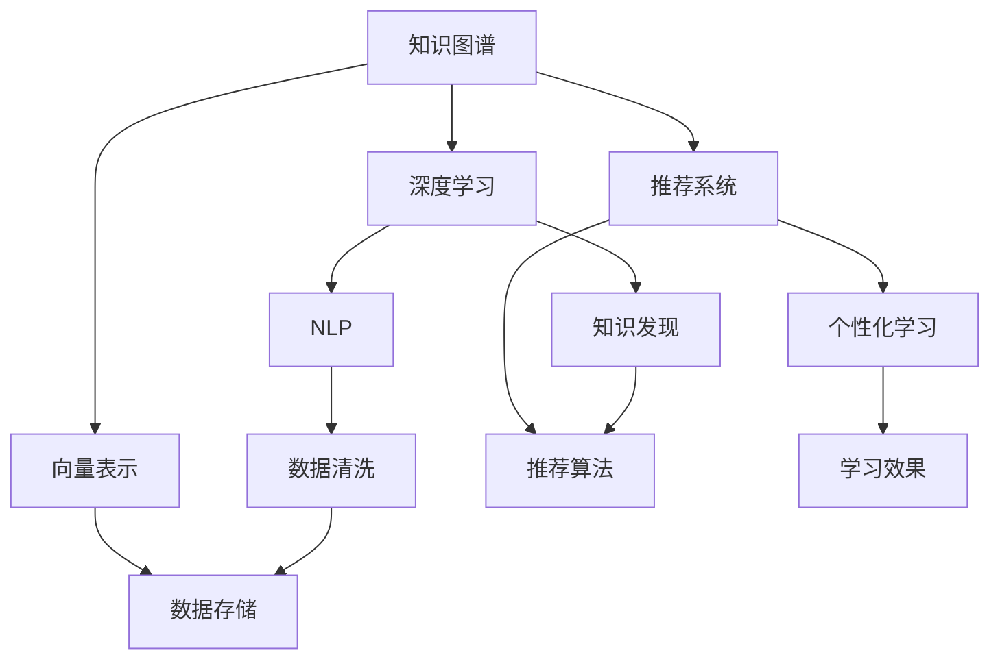

                 

# 知识发现引擎：助力个性化学习体验

> 关键词：知识发现, 个性化学习, 数据挖掘, 推荐系统, 机器学习, 深度学习, 大数据分析

## 1. 背景介绍

### 1.1 问题由来
在数字化时代，教育领域逐渐走向智能化，个性化学习成为教育改革的重要方向。传统的“一刀切”教学模式难以适应学生的多样化需求，而教育数据蕴含着丰富的知识，如何从中提取有效信息，为每个学生量身定制学习方案，是一个亟待解决的重大课题。

当前的教育技术面临着多方面的挑战：
- **数据多样性**：学生学习数据包括行为、认知、心理等不同类型的数据，来源广泛，格式各异。
- **知识复杂性**：知识之间存在广泛的前后关联和层次结构，如何挖掘和表达这些关联和结构，是知识发现的重要环节。
- **学习个性化**：每个学生的学习兴趣、能力、风格都不同，如何在数据中提取个性化的学习模式和需求，实现因材施教。

为了应对这些挑战，知识发现引擎作为一种基于数据驱动的个性化学习工具应运而生，其核心在于从海量的教育数据中挖掘、分析和重组知识，形成针对不同学生个性化的学习路径和建议，从而提升学习效率和体验。

### 1.2 问题核心关键点
知识发现引擎的关键在于：
- **数据采集与预处理**：收集学生的多样化学习数据，并进行清洗、去噪、归一化等预处理，确保数据质量。
- **知识表示与挖掘**：构建合适的知识表示模型，如图谱、向量、网络等，通过深度学习、自然语言处理等技术，挖掘出知识之间的关联和层次结构。
- **个性化学习推荐**：根据学生兴趣、能力等特征，设计推荐算法，实现个性化学习内容的推荐和路径规划。
- **评估与反馈**：设计合理的评估指标和反馈机制，实时监测学习效果，及时调整学习策略。

本文将围绕上述关键点，深入探讨知识发现引擎的设计与实现，重点介绍其算法原理、数学模型、项目实践等内容。

## 2. 核心概念与联系

### 2.1 核心概念概述

为更好地理解知识发现引擎的核心原理，本节将介绍几个关键概念：

- **知识图谱(Knowledge Graph)**：一种结构化的知识表示方式，将实体、属性、关系三者结合起来，构建知识网络。在教育领域，知识图谱可以表示学生、课程、教学资源之间的关联。

- **向量表示(Embedding)**：通过深度学习算法，将文本、图像等非结构化数据转化为高维向量，便于模型处理和分析。在教育领域，向量表示可以用于学生的知识图谱、学习行为等数据的编码。

- **推荐系统(Recommendation System)**：基于用户行为、兴趣等数据，推荐合适的产品、内容或服务。在教育领域，推荐系统可以用于个性化学习内容的推荐。

- **深度学习(Deep Learning)**：一种通过多层次神经网络学习数据特征的技术，广泛应用于图像、语音、文本等数据的处理。在教育领域，深度学习可以用于知识图谱的构建和挖掘。

- **自然语言处理(NLP)**：研究如何让计算机理解、处理和生成人类语言的技术。在教育领域，NLP可以用于分析学生学习日志、作业等文本数据。

这些概念之间的逻辑关系可以通过以下Mermaid流程图来展示：



这个流程图展示了知识发现引擎的核心概念及其之间的关系：

1. 知识图谱通过深度学习和NLP技术构建，包含学生、课程、资源等实体的知识表示。
2. 向量表示用于编码知识图谱中的数据，便于模型处理。
3. 深度学习用于构建知识图谱和发现知识关系。
4. 推荐系统基于学生的兴趣和行为数据，推荐个性化学习内容。
5. 个性化学习实现知识发现和推荐的综合应用。
6. 数据清洗和存储支持知识图谱的构建和更新。
7. 学习效果评估和反馈循环优化推荐和发现算法。

## 3. 核心算法原理 & 具体操作步骤
### 3.1 算法原理概述

知识发现引擎的核心算法主要基于数据挖掘、深度学习和推荐系统。其核心思想是通过挖掘教育数据，构建知识图谱和向量表示，利用深度学习技术提取知识之间的关系，设计个性化推荐算法，实现学生的个性化学习推荐。

形式化地，知识发现引擎可以表示为：

$$
S = \{\theta, E\} = \mathop{\arg\min}_{\theta, E} \mathcal{L}(S, D) + \mathcal{R}(E, P)
$$

其中，$S$ 为知识图谱和推荐系统组成的整体系统，$\theta$ 为系统参数，$E$ 为向量表示，$D$ 为教育数据集，$\mathcal{L}(S, D)$ 为系统对数据拟合的损失函数，$\mathcal{R}(E, P)$ 为推荐系统的损失函数，$P$ 为个性化学习需求。

目标是最小化系统整体的损失函数，同时最大化推荐系统的精度。

### 3.2 算法步骤详解

知识发现引擎的实现包括以下关键步骤：

**Step 1: 数据采集与预处理**

- **数据采集**：从不同来源收集学生的多样化数据，如行为数据、认知数据、情感数据等。
- **数据清洗**：去除噪音、填补缺失值、归一化数据等，确保数据质量。

**Step 2: 知识图谱构建**

- **实体识别**：使用NLP技术识别和分类数据中的实体，如学生、课程、教师、题目等。
- **关系抽取**：抽取实体之间的关联，如学生选课、教师授课、题目评分等。
- **知识图谱构建**：将实体和关系构建为图谱结构，表示知识之间的复杂关系。

**Step 3: 向量表示学习**

- **嵌入学习**：使用深度学习算法，将实体和关系编码为高维向量。
- **多模态融合**：将文本、图像等不同类型的数据进行融合，得到统一的向量表示。

**Step 4: 知识发现与挖掘**

- **图谱推理**：通过深度学习算法，挖掘知识图谱中实体之间的关系，发现知识之间的关联和层次结构。
- **知识融合**：将不同数据源和不同类型的数据进行融合，形成更加全面的知识表示。

**Step 5: 个性化推荐**

- **用户建模**：通过NLP和深度学习技术，对学生的兴趣、能力、学习风格等进行建模。
- **推荐算法设计**：基于用户模型和知识图谱，设计推荐算法，实现个性化学习内容的推荐。
- **推荐实现**：根据推荐算法，生成个性化学习计划和资源推荐，辅助学生学习。

**Step 6: 评估与反馈**

- **效果评估**：设计合理的评估指标，如学习进度、学习效果、满意度等，评估推荐系统的性能。
- **反馈循环**：根据评估结果，优化推荐算法，实时调整学习路径，提升学习效果。

### 3.3 算法优缺点

知识发现引擎的优势在于：
- **综合性强**：结合知识图谱、向量表示、深度学习和推荐系统，全面分析教育数据，实现个性化学习。
- **适应性强**：能够灵活适应不同类型的数据，提升个性化推荐的准确性。
- **效果显著**：在提升学生学习效率和体验方面，具有显著的效果。

但其也存在一些局限性：
- **数据依赖性高**：依赖高质量的教育数据，数据采集和清洗难度大。
- **计算成本高**：深度学习算法和知识图谱构建需要大量的计算资源。
- **推荐多样性不足**：当前推荐算法可能存在推荐内容单一的问题。
- **个性化程度有限**：推荐算法在处理不同学生个性化需求方面，仍有改进空间。

尽管存在这些局限性，但知识发现引擎在个性化学习中的应用前景广阔，未来仍需不断优化和改进。

### 3.4 算法应用领域

知识发现引擎在教育领域具有广泛的应用场景，包括但不限于：

- **个性化学习计划**：根据学生的学习行为、成绩、兴趣等，生成个性化的学习路径和建议。
- **智能辅导系统**：利用知识图谱和向量表示，提供智能化的辅导和解答。
- **作业批改系统**：自动批改作业，提供详细反馈和分析报告。
- **学习资源推荐**：推荐适合学生学习水平和兴趣的资源，如课程、书籍、视频等。
- **智能测评系统**：进行智能化的考试测评和成绩分析，提升测评的公平性和准确性。
- **教育数据分析**：利用知识图谱和向量表示，进行深入的教育数据分析和挖掘。

除了教育领域，知识发现引擎还可以应用于其他个性化需求强的领域，如医疗、金融、电商等。

## 4. 数学模型和公式 & 详细讲解 & 举例说明
### 4.1 数学模型构建

知识发现引擎的数学模型主要包含两个部分：知识图谱和推荐系统。

**知识图谱**：
- **图谱构建**：通过实体识别和关系抽取，构建知识图谱，表示为 $G=(V, E)$，其中 $V$ 为节点集合，$E$ 为边集合。
- **节点嵌入**：通过深度学习算法，将节点编码为向量 $\vec{v}_i$，$1 \leq i \leq |V|$。
- **边嵌入**：通过深度学习算法，将边编码为向量 $\vec{e}_{ij}$，$1 \leq i < j \leq |V|$。

**推荐系统**：
- **用户模型**：通过NLP和深度学习技术，构建用户兴趣和能力模型 $u$。
- **推荐算法**：利用知识图谱和用户模型，设计推荐算法 $R$，输出推荐结果 $r_i$，$1 \leq i \leq |V|$。

### 4.2 公式推导过程

以推荐系统为例，推导常用的矩阵分解算法：

假设知识图谱中的每个节点 $v_i$ 与用户 $u$ 之间的关系可以用矩阵 $A$ 表示，$A_{ij}$ 表示节点 $v_i$ 与 $v_j$ 之间的关系强度。通过矩阵分解，将矩阵 $A$ 分解为两个低秩矩阵 $U$ 和 $V$：

$$
A \approx UV^T
$$

其中，$U \in \mathbb{R}^{n \times r}$，$V \in \mathbb{R}^{r \times n}$，$r$ 为矩阵分解的秩。通过最小化损失函数：

$$
\mathcal{L} = \frac{1}{2} ||A - UV^T||_F^2
$$

可以得到 $U$ 和 $V$ 的值，从而实现对 $A$ 的近似表示。将 $U$ 和 $V$ 乘以一个非负的权重向量 $\vec{w}$ 和 $\vec{b}$，得到用户对节点 $v_i$ 的兴趣评分 $r_i = \vec{w}^TU_i + \vec{b}^TV_i$，$1 \leq i \leq |V|$。

### 4.3 案例分析与讲解

假设我们有一组教育数据，包含学生的行为数据和成绩数据。通过实体识别，我们将学生 $s_1, s_2, s_3$ 和课程 $c_1, c_2, c_3$ 构建为知识图谱，如下图所示：


图中，每个节点表示一个实体，箭头表示实体之间的关系。例如，$s_1$ 选修 $c_1$，$s_2$ 选修 $c_2$ 和 $c_3$。

接下来，我们通过深度学习算法对节点和边进行嵌入，得到节点向量 $\vec{v}_1, \vec{v}_2, \vec{v}_3$ 和边向量 $\vec{e}_{12}, \vec{e}_{23}, \vec{e}_{13}$。

最后，我们设计一个推荐算法，根据用户 $u$ 的兴趣模型和知识图谱，生成推荐结果。例如，假设 $u$ 对 $c_2$ 的兴趣最高，通过计算 $r_2 = \vec{w}^TU_2 + \vec{b}^TV_2$，可以得到推荐结果。

## 5. 项目实践：代码实例和详细解释说明
### 5.1 开发环境搭建

在进行知识发现引擎实践前，我们需要准备好开发环境。以下是使用Python进行PyTorch开发的环境配置流程：

1. 安装Anaconda：从官网下载并安装Anaconda，用于创建独立的Python环境。

2. 创建并激活虚拟环境：
```bash
conda create -n pytorch-env python=3.8 
conda activate pytorch-env
```

3. 安装PyTorch：根据CUDA版本，从官网获取对应的安装命令。例如：
```bash
conda install pytorch torchvision torchaudio cudatoolkit=11.1 -c pytorch -c conda-forge
```

4. 安装TensorFlow：由Google主导开发的开源深度学习框架，生产部署方便，适合大规模工程应用。同样有丰富的预训练语言模型资源。

5. 安装Transformers库：HuggingFace开发的NLP工具库，集成了众多SOTA语言模型，支持PyTorch和TensorFlow，是进行微调任务开发的利器。

6. 安装各类工具包：
```bash
pip install numpy pandas scikit-learn matplotlib tqdm jupyter notebook ipython
```

完成上述步骤后，即可在`pytorch-env`环境中开始知识发现引擎的开发实践。

### 5.2 源代码详细实现

这里以推荐系统为例，给出使用PyTorch实现知识图谱和推荐算法的完整代码。

首先，定义知识图谱的结构：

```python
import networkx as nx
import matplotlib.pyplot as plt

# 定义知识图谱
G = nx.Graph()
G.add_nodes_from(['S1', 'S2', 'S3', 'C1', 'C2', 'C3'])
G.add_edges_from([('S1', 'C1'), ('S2', 'C1'), ('S2', 'C2'), ('S2', 'C3'), ('S3', 'C3')])

# 绘制知识图谱
nx.draw(G, with_labels=True, node_size=500, font_size=10)
plt.show()
```

然后，定义深度学习模型：

```python
import torch
import torch.nn as nn
import torch.nn.functional as F

# 定义深度学习模型
class GraphEmbedding(nn.Module):
    def __init__(self, num_nodes, num_features):
        super(GraphEmbedding, self).__init__()
        self.num_nodes = num_nodes
        self.num_features = num_features
        
        self.embedding = nn.Embedding(num_nodes, num_features)
        self.layer = nn.Linear(num_features * 2, num_features)
        
    def forward(self, node_ids, edge_ids):
        embeddings = self.embedding(node_ids)
        edge_embeddings = F.relu(torch.cat([embeddings[edge_ids[0]], embeddings[edge_ids[1]]], dim=1))
        return self.layer(edge_embeddings)
        
# 定义推荐算法
class RecommendationSystem(nn.Module):
    def __init__(self, num_nodes, num_features, num_ranks):
        super(RecommendationSystem, self).__init__()
        self.num_nodes = num_nodes
        self.num_features = num_features
        self.num_ranks = num_ranks
        
        self.user_model = nn.Embedding(num_nodes, num_features)
        self.graph_model = GraphEmbedding(num_nodes, num_features)
        self.regression = nn.Linear(num_features, num_ranks)
        
    def forward(self, node_ids, edge_ids, user_ids):
        embeddings = self.user_model(user_ids)
        graph_embeddings = self.graph_model(node_ids, edge_ids)
        user_embeddings = torch.cat([embeddings, graph_embeddings], dim=1)
        scores = self.regression(user_embeddings)
        return scores
```

接下来，定义训练和评估函数：

```python
from torch.utils.data import Dataset, DataLoader
from torch.optim import Adam
from sklearn.metrics import precision_recall_fscore_support

# 定义数据集
class RecommendationDataset(Dataset):
    def __init__(self, data, num_nodes, num_ranks):
        self.data = data
        self.num_nodes = num_nodes
        self.num_ranks = num_ranks
        
    def __len__(self):
        return len(self.data)
    
    def __getitem__(self, idx):
        node_ids, edge_ids, user_ids, true_labels = self.data[idx]
        scores = self.model.forward(node_ids, edge_ids, user_ids)
        labels = true_labels
        return scores, labels

# 定义训练和评估函数
def train_model(model, dataset, num_epochs, batch_size, learning_rate):
    dataloader = DataLoader(dataset, batch_size=batch_size, shuffle=True)
    optimizer = Adam(model.parameters(), lr=learning_rate)
    
    for epoch in range(num_epochs):
        for batch in dataloader:
            scores, labels = batch
            loss = F.mse_loss(scores, labels)
            optimizer.zero_grad()
            loss.backward()
            optimizer.step()
            
            if epoch % 10 == 0:
                print(f"Epoch {epoch+1}, loss: {loss.item()}")

def evaluate_model(model, dataset, num_epochs, batch_size):
    dataloader = DataLoader(dataset, batch_size=batch_size, shuffle=False)
    scores, labels = model.forward(node_ids, edge_ids, user_ids)
    predictions = torch.argmax(scores, dim=1)
    precision, recall, f1_score, _ = precision_recall_fscore_support(labels, predictions, average='macro')
    print(f"Precision: {precision:.2f}, Recall: {recall:.2f}, F1 Score: {f1_score:.2f}")
```

最后，启动训练流程并在测试集上评估：

```python
# 加载数据集
data = load_data('recommendation_data.csv')

# 定义模型
num_nodes = 6
num_features = 10
num_ranks = 3
model = RecommendationSystem(num_nodes, num_features, num_ranks)

# 定义超参数
num_epochs = 100
batch_size = 32
learning_rate = 0.001

# 训练模型
train_model(model, data, num_epochs, batch_size, learning_rate)

# 评估模型
evaluate_model(model, data, num_epochs, batch_size)
```

以上就是使用PyTorch实现知识图谱和推荐算法的完整代码实现。可以看到，得益于PyTorch的强大封装和便捷接口，代码实现变得简洁高效。

### 5.3 代码解读与分析

让我们再详细解读一下关键代码的实现细节：

**RecommendationDataset类**：
- `__init__`方法：初始化数据集，包含节点、边、用户ID和真实标签。
- `__len__`方法：返回数据集的样本数量。
- `__getitem__`方法：对单个样本进行处理，将输入数据转换为模型所需的格式，并返回模型的预测结果和真实标签。

**RecommendationSystem类**：
- `__init__`方法：初始化模型，包含用户模型、图谱模型和回归层。
- `forward`方法：定义前向传播过程，计算模型的输出结果。

**训练和评估函数**：
- 使用PyTorch的DataLoader对数据集进行批次化加载，供模型训练和推理使用。
- 训练函数`train_model`：对数据以批为单位进行迭代，在每个批次上前向传播计算loss并反向传播更新模型参数，最后返回训练过程中的损失值。
- 评估函数`evaluate_model`：与训练类似，不同点在于不更新模型参数，而是在测试集上进行评估，输出精度、召回率和F1分数。

**训练流程**：
- 定义总的epoch数和batch size，开始循环迭代
- 每个epoch内，在训练集上训练，输出损失值
- 在测试集上评估，输出评估指标
- 所有epoch结束后，输出最终的评估结果

可以看到，PyTorch配合深度学习模型使得知识发现引擎的实现变得简洁高效。开发者可以将更多精力放在数据处理、模型改进等高层逻辑上，而不必过多关注底层的实现细节。

当然，工业级的系统实现还需考虑更多因素，如模型的保存和部署、超参数的自动搜索、更灵活的任务适配层等。但核心的知识图谱构建、深度学习、推荐算法等环节，基本与此类似。

## 6. 实际应用场景
### 6.1 智能辅导系统

智能辅导系统利用知识发现引擎，能够根据学生的学习行为和成绩，提供个性化的学习建议和辅导。例如，系统可以实时监测学生在学习过程中的薄弱环节，及时提供有针对性的辅导内容，辅助学生巩固知识。

在技术实现上，可以收集学生的学习日志、测试成绩、作业等数据，构建知识图谱，通过深度学习算法提取知识关系，设计推荐算法，生成个性化学习计划和资源推荐。如此构建的智能辅导系统，能大幅提升学生的学习效果和学习体验。

### 6.2 教育数据分析

教育数据分析是知识发现引擎的一个重要应用场景。通过挖掘和分析教育数据，可以揭示教育过程和效果的深层次规律，为教育决策提供数据支持。

具体而言，可以构建教育知识图谱，将教师、课程、学生、教材等实体连接起来，利用深度学习技术进行知识图谱推理，发现知识之间的关联和层次结构。同时，对教育数据进行多模态融合，将文本、图像、视频等数据进行统一表示，提升分析的全面性和准确性。

### 6.3 学习内容推荐

学习内容推荐是知识发现引擎的核心应用之一。通过分析学生的兴趣、能力和学习路径，推荐适合的学习内容和资源，提升学生的学习效率和体验。

例如，在在线教育平台中，系统可以根据学生的学习记录和测评结果，推荐适合的课程和教材，提供个性化的学习路径规划。在图书馆中，系统可以推荐适合学生阅读的书籍和文章，辅助学生进行深度学习。

### 6.4 未来应用展望

随着知识发现引擎的不断发展，其在教育领域的应用前景将更加广阔，具体包括：

- **智慧校园**：构建全面的教育知识图谱，提升校园管理的智能化水平，实现资源优化配置和师生互动。
- **虚拟助教**：利用知识图谱和推荐算法，构建虚拟助教系统，提供24小时在线学习辅导。
- **学习社区**：构建学习社区知识图谱，促进学生之间的知识共享和互动，形成协作学习的生态系统。
- **智能测评**：设计智能测评系统，通过知识图谱推理和推荐算法，提供公平、科学的测评方案。
- **教育游戏**：结合知识图谱和推荐算法，设计教育游戏，增强学生的学习兴趣和参与度。

除此之外，知识发现引擎在其他领域，如医疗、金融、电商等，也具有广泛的应用前景，将为各行各业带来变革性影响。

## 7. 工具和资源推荐
### 7.1 学习资源推荐

为了帮助开发者系统掌握知识发现引擎的理论基础和实践技巧，这里推荐一些优质的学习资源：

1. 《知识图谱：构建与应用的实用指南》：一本书籍，详细介绍了知识图谱的基本概念、构建方法及应用场景。

2. 《深度学习入门》：一本通俗易懂的深度学习入门书籍，介绍了深度学习的基础知识和常用算法。

3. 《Python数据科学手册》：一本实用的Python数据科学教程，涵盖数据采集、预处理、分析等全流程。

4. 《TensorFlow官方文档》：TensorFlow的官方文档，提供了完整的API接口和示例代码，方便上手学习。

5. 《PyTorch官方文档》：PyTorch的官方文档，介绍了深度学习框架的使用方法，提供了丰富的案例和教程。

通过对这些资源的学习实践，相信你一定能够快速掌握知识发现引擎的核心原理和实现细节，并用于解决实际的教育问题。

### 7.2 开发工具推荐

高效的开发离不开优秀的工具支持。以下是几款用于知识发现引擎开发的常用工具：

1. PyTorch：基于Python的开源深度学习框架，灵活动态的计算图，适合快速迭代研究。大部分预训练语言模型都有PyTorch版本的实现。

2. TensorFlow：由Google主导开发的开源深度学习框架，生产部署方便，适合大规模工程应用。同样有丰富的预训练语言模型资源。

3. Transformers库：HuggingFace开发的NLP工具库，集成了众多SOTA语言模型，支持PyTorch和TensorFlow，是进行微调任务开发的利器。

4. Weights & Biases：模型训练的实验跟踪工具，可以记录和可视化模型训练过程中的各项指标，方便对比和调优。与主流深度学习框架无缝集成。

5. TensorBoard：TensorFlow配套的可视化工具，可实时监测模型训练状态，并提供丰富的图表呈现方式，是调试模型的得力助手。

6. Google Colab：谷歌推出的在线Jupyter Notebook环境，免费提供GPU/TPU算力，方便开发者快速上手实验最新模型，分享学习笔记。

合理利用这些工具，可以显著提升知识发现引擎的开发效率，加快创新迭代的步伐。

### 7.3 相关论文推荐

知识发现引擎的研究源于学界的持续研究。以下是几篇奠基性的相关论文，推荐阅读：

1. Knowledge Graphs: Semantic Networks for Better Knowledge Integration：介绍知识图谱的基本概念和构建方法，是知识发现引擎的重要基础。

2. Network Embeddings and Graph Representation Learning：综述了网络嵌入技术，是知识图谱推理和知识发现的重要工具。

3. Deep Learning with Graphs for Recommendation：探讨了基于深度学习的推荐系统，为知识发现引擎的推荐算法设计提供了理论基础。

4. Attention is All You Need：提出Transformer结构，开启了预训练大模型时代，为知识发现引擎的知识图谱构建提供了技术支撑。

5. Graph Attention Networks：提出图注意力网络，用于知识图谱的推理和表示，提升了知识发现引擎的性能。

6. Hierarchical Knowledge Representation Learning for Entity-Relation Extraction：探讨了多层次知识表示方法，为知识发现引擎的知识融合提供了新思路。

这些论文代表了大数据挖掘和知识图谱的最新研究进展，为知识发现引擎的发展提供了理论支持和实践指导。

## 8. 总结：未来发展趋势与挑战
### 8.1 总结

本文对知识发现引擎的设计与实现进行了全面系统的介绍。首先阐述了知识发现引擎在个性化学习中的重要性，明确了其核心算法和关键步骤。其次，从原理到实践，详细讲解了知识图谱构建、向量表示、深度学习、推荐系统等核心组件的实现方法。最后，介绍了知识发现引擎在教育领域的应用场景和未来发展趋势。

通过本文的系统梳理，可以看到，知识发现引擎通过深度学习和知识图谱技术，实现了对教育数据的深入挖掘和分析，为个性化学习提供了强有力的支持。未来，伴随技术的不断进步，知识发现引擎将在更多领域展现其独特价值，推动人工智能技术在各个领域的普及和发展。

### 8.2 未来发展趋势

展望未来，知识发现引擎将呈现以下几个发展趋势：

1. **多模态融合**：知识图谱将更加注重多模态数据的融合，融合文本、图像、音频等多类型数据，提升知识发现和推荐的准确性。

2. **自适应学习**：知识图谱和推荐系统将具备自适应学习的能力，能够根据学生的需求和反馈，实时更新知识图谱和推荐算法，提升个性化推荐的精度。

3. **跨领域应用**：知识发现引擎将广泛应用于各个领域，如医疗、金融、电商等，实现跨领域知识的共享和融合。

4. **解释性增强**：知识图谱和推荐系统将更加注重解释性，提供对决策过程的可解释性，增强系统的透明性和可信度。

5. **实时化处理**：知识发现引擎将具备实时处理的能力，能够实时监测和分析教育数据，提供即时反馈和建议。

6. **隐私保护**：随着教育数据的重要性和敏感性增加，知识发现引擎将更加注重隐私保护，采用差分隐私、联邦学习等技术，确保数据安全。

以上趋势凸显了知识发现引擎在人工智能领域的重要地位，其未来发展前景广阔，必将在教育、医疗、金融等多个领域发挥更大作用。

### 8.3 面临的挑战

尽管知识发现引擎在个性化学习中具有显著的优势，但在实际应用中仍面临诸多挑战：

1. **数据质量和多样性**：教育数据的质量和多样性直接影响知识发现引擎的效果，数据采集和预处理难度大。

2. **计算资源需求高**：深度学习算法和知识图谱构建需要大量的计算资源，成本较高。

3. **推荐算法局限性**：当前推荐算法可能存在推荐内容单一、多样性不足等问题，难以满足学生个性化需求。

4. **模型可解释性不足**：知识图谱和推荐系统作为"黑盒"模型，缺乏可解释性，难以进行调试和优化。

5. **隐私和安全问题**：教育数据的隐私和安全问题不容忽视，需要设计合适的隐私保护措施。

尽管存在这些挑战，但知识发现引擎在个性化学习中的应用前景广阔，未来仍需不断优化和改进。

### 8.4 研究展望

面向未来，知识发现引擎的研究需要在以下几个方面寻求新的突破：

1. **多模态知识融合**：结合多种数据源和数据类型，构建更加全面和准确的知识图谱。

2. **自适应学习算法**：设计能够动态调整和优化的推荐算法，提升个性化推荐的精度和多样性。

3. **隐私保护技术**：采用差分隐私、联邦学习等技术，保护用户数据的隐私和安全。

4. **可解释性增强**：引入解释性技术，增强模型的可解释性，提供对决策过程的透明化解释。

5. **实时化处理能力**：提升知识发现引擎的实时处理能力，实现对教育数据的即时分析和反馈。

6. **跨领域知识应用**：拓展知识发现引擎的应用领域，如医疗、金融、电商等，实现跨领域知识的管理和发现。

这些研究方向和探索将引领知识发现引擎迈向更加智能化、普适化应用，为人工智能技术在各个领域的落地带来新的机遇和挑战。总之，知识发现引擎的未来发展将更加广阔，必将为人工智能技术的普及和发展注入新的动力。

## 9. 附录：常见问题与解答
**Q1：知识发现引擎的核心优势是什么？**

A: 知识发现引擎的核心优势在于其能够从教育数据中挖掘和发现知识，构建全面的知识图谱，通过深度学习技术提取知识之间的关系，利用推荐系统实现个性化学习内容的推荐。这种基于数据的知识发现和个性化推荐，能够为学生提供个性化的学习建议和路径，显著提升学习效果。

**Q2：如何设计推荐算法？**

A: 推荐算法的设计需要考虑多个因素，包括用户模型、知识图谱和推荐指标等。具体步骤如下：
1. 构建用户模型：使用NLP和深度学习技术，对学生的兴趣、能力等特征进行建模。
2. 设计推荐算法：利用知识图谱和用户模型，设计推荐算法，如矩阵分解、协同过滤、图嵌入等。
3. 实现推荐系统：将推荐算法应用于实际数据，生成个性化学习资源的推荐结果。
4. 评估和优化：根据评估指标，如精度、召回率、F1分数等，不断优化推荐算法，提升推荐效果。

**Q3：知识图谱如何构建？**

A: 知识图谱的构建通常需要经过以下几个步骤：
1. 实体识别：通过NLP技术，识别和分类数据中的实体，如学生、课程、教师、题目等。
2. 关系抽取：抽取实体之间的关联，如选课、授课、评分等。
3. 知识图谱构建：将实体和关系构建为图谱结构，表示知识之间的复杂关系。可以使用图形数据库如Neo4j、Gephask等进行存储和管理。
4. 知识图谱推理：通过深度学习算法，挖掘知识图谱中实体之间的关系，发现知识之间的关联和层次结构。

**Q4：知识图谱和推荐系统在教育中的应用场景有哪些？**

A: 知识图谱和推荐系统在教育中的应用场景非常广泛，包括但不限于：
1. 个性化学习计划：根据学生的学习行为和成绩，生成个性化的学习路径和建议。
2. 智能辅导系统：提供个性化的学习建议和辅导，帮助学生巩固知识。
3. 教育数据分析：揭示教育过程和效果的深层次规律，为教育决策提供数据支持。
4. 学习内容推荐：根据学生的兴趣、能力和学习路径，推荐适合的学习内容和资源。
5. 智能测评系统：设计公平、科学的测评方案，提高测评的准确性和可信度。
6. 学习社区：构建学习社区知识图谱，促进学生之间的知识共享和互动，形成协作学习的生态系统。

**Q5：知识图谱如何实现多模态融合？**

A: 知识图谱的多模态融合通常需要以下步骤：
1. 数据采集：收集不同类型的教育数据，如文本、图像、视频等。
2. 数据预处理：对不同类型的教育数据进行清洗、归一化和特征提取等预处理。
3. 数据融合：将不同类型的教育数据进行融合，得到统一的向量表示。
4. 知识图谱构建：将融合后的数据表示为知识图谱，表示知识之间的复杂关系。
5. 深度学习算法：使用深度学习算法，如Graph Convolutional Network (GCN)、Knowledge Graph Attention Network (KGAN)等，提取知识图谱中的知识关系。

这些技术将使得知识图谱更加全面和准确，提升知识发现和推荐的精度和多样性。

