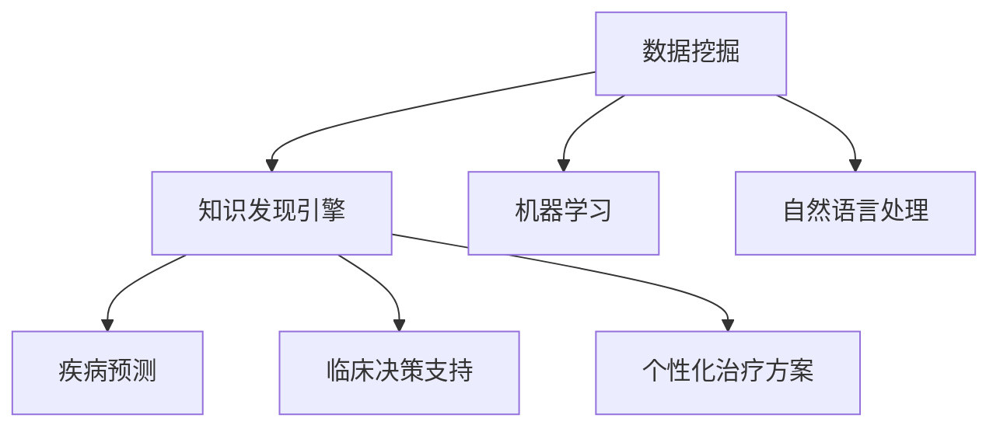

                 

# 知识发现引擎：助力医疗领域的智慧转型

> 关键词：知识发现引擎, 医疗领域, 数据挖掘, 智慧转型, 临床决策支持, 疾病预测, 药物研发, 大数据分析, 机器学习, 自然语言处理

## 1. 背景介绍

### 1.1 问题由来
医疗健康是全球最关注的问题之一，然而传统医疗模式面临着诸多挑战，如资源分配不均、医疗质量参差不齐、医疗成本高昂等问题。随着信息技术的发展，智慧医疗成为了推动医疗健康领域变革的新引擎。利用数据挖掘和知识发现技术，可以从海量医疗数据中提取有价值的信息，辅助医生诊断、提升治疗效果、优化医疗决策。

### 1.2 问题核心关键点
知识发现引擎通过挖掘和分析医疗数据，提供决策支持、疾病预测、个性化治疗方案等智慧医疗解决方案。其核心在于：
1. 高效的数据处理和分析能力，能够处理海量的医疗数据。
2. 强大的知识表示和推理能力，能够在数据中挖掘出潜在的知识规律。
3. 灵活的决策支持能力，能够为医生提供个性化、可解释的诊疗建议。

## 2. 核心概念与联系

### 2.1 核心概念概述

为更好地理解知识发现引擎在医疗领域的智慧转型应用，本节将介绍几个密切相关的核心概念：

- 知识发现引擎(Knowledge Discovery Engine, KDE)：基于数据挖掘和机器学习的技术，从医疗数据中自动发现规律、模式和知识，辅助医疗决策的系统。
- 数据挖掘(Data Mining)：通过算法自动分析数据，提取有用信息的过程。在医疗领域，主要用于病历分析、基因组数据挖掘、影像识别等。
- 机器学习(Machine Learning)：通过训练模型自动从数据中学习规律，实现预测、分类、聚类等功能。在医疗领域，主要用于疾病预测、药物研发、临床决策支持等。
- 自然语言处理(Natural Language Processing, NLP)：处理文本数据，提取结构化信息，辅助知识发现。在医疗领域，主要用于电子病历处理、临床文本挖掘等。
- 智慧医疗(Health Informatics)：结合信息技术与医疗领域，通过数据挖掘、知识发现等技术，提升医疗服务的效率和质量。

这些核心概念之间的逻辑关系可以通过以下Mermaid流程图来展示：



这个流程图展示了几者之间的逻辑关系：

1. 数据挖掘是知识发现引擎的基础，通过算法从原始数据中提取有用信息。
2. 机器学习是数据挖掘的重要补充，能够通过训练模型自动发现规律和趋势。
3. 自然语言处理有助于处理非结构化数据，辅助知识发现引擎更好地理解医疗数据。
4. 知识发现引擎通过集成上述技术，为医疗领域提供疾病预测、临床决策支持、个性化治疗方案等智慧服务。

## 3. 核心算法原理 & 具体操作步骤
### 3.1 算法原理概述

知识发现引擎的核心算法原理主要涉及以下几个步骤：

1. 数据预处理：清洗、归一化、去噪等处理，将原始医疗数据转换为可用于分析的形式。
2. 特征提取：从预处理后的数据中提取有意义的特征，如病人的病历、基因组数据、影像数据等。
3. 模型训练：基于提取的特征，训练机器学习模型，如决策树、随机森林、深度学习等。
4. 模型评估：通过交叉验证、测试集评估等方法，验证模型在未见过的数据上的表现。
5. 知识表示：将模型学习到的规律和知识表示出来，形成可理解、可解释的结构。
6. 知识应用：将知识发现引擎的结果应用于医疗决策、疾病预测、治疗方案制定等实际场景。

### 3.2 算法步骤详解

以疾病预测为例，详细讲解知识发现引擎的算法步骤：

**Step 1: 数据准备**
- 收集医疗数据，包括病人的电子病历、基因组数据、影像数据等。
- 清洗数据，去除缺失、异常值等噪声数据。
- 标准化数据格式，如将病历中的日期统一转换为标准格式。

**Step 2: 特征提取**
- 从清洗后的数据中提取特征，如病人的年龄、性别、病史、家族史等。
- 使用NLP技术处理临床文本数据，提取症状、诊断结果等信息。
- 对影像数据进行分割、量化等预处理，提取特征。

**Step 3: 模型训练**
- 选择适当的机器学习算法，如随机森林、支持向量机等。
- 将提取的特征输入模型，训练得到疾病预测模型。
- 通过交叉验证等方法评估模型性能，调整参数优化模型。

**Step 4: 模型评估**
- 使用测试集评估模型的预测精度和鲁棒性。
- 进行A/B测试，对比模型与传统方法的效果。

**Step 5: 知识表示**
- 将模型学习到的规律和知识表示成可解释的形式，如规则、概率模型等。
- 将知识与医学知识库进行整合，形成更全面的知识表示。

**Step 6: 知识应用**
- 将知识发现引擎的输出应用于临床决策支持系统。
- 开发医生界面，提供可解释的诊疗建议。

### 3.3 算法优缺点

知识发现引擎在医疗领域具有以下优点：
1. 自动化处理海量数据，提高医疗决策的效率和准确性。
2. 集成多种数据源，提供更全面、多维度的分析结果。
3. 基于机器学习算法，具备自学习和自适应的能力。
4. 提供可解释、可理解的诊疗建议，增强医生的信任度。

同时，该算法也存在一定的局限性：
1. 数据质量和数据量对模型的效果影响较大，低质量数据可能导致误诊。
2. 模型的可解释性不足，难以解释复杂的决策逻辑。
3. 对数据处理和特征提取的依赖较大，算法实现较为复杂。
4. 需要大量计算资源，不适用于小规模医院或社区。

尽管存在这些局限性，但知识发现引擎在医疗领域的应用前景广阔，能够大幅提升医疗服务的质量，降低医疗成本。未来，相关研究的重点在于如何进一步优化算法，降低计算资源需求，提高模型的可解释性和鲁棒性。

### 3.4 算法应用领域

知识发现引擎在医疗领域有广泛的应用，覆盖了诸多常见场景，例如：

- 疾病预测：基于病历、基因组数据等，预测病人是否患病及其发展趋势。
- 临床决策支持：提供可解释的诊疗建议，辅助医生诊断和治疗。
- 个性化治疗方案：结合病人的基因信息、生活习惯等，制定个性化治疗方案。
- 药物研发：分析基因与药物反应的关系，发现新药物候选。
- 影像识别：识别医学影像中的病变区域，辅助医生进行影像诊断。
- 电子病历处理：自动提取病历中的有用信息，加速病历书写和查阅。

除了上述这些经典场景外，知识发现引擎还被创新性地应用到更多领域中，如流行病监测、健康管理、智能手术等，为智慧医疗技术带来了新的突破。

## 4. 数学模型和公式 & 详细讲解  
### 4.1 数学模型构建

本节将使用数学语言对知识发现引擎在医疗领域的核心算法进行更加严格的刻画。

记医疗数据为 $D=\{(x_i,y_i)\}_{i=1}^N, x_i \in X, y_i \in Y$，其中 $X$ 为输入空间，$Y$ 为输出空间。假设疾病预测模型的输入特征为 $x_i$，输出为 $y_i \in \{0,1\}$，表示病人是否患病。

定义模型 $M_{\theta}(x)$ 在输入 $x$ 上的输出为 $\hat{y}=M_{\theta}(x)$，表示模型对疾病状态的预测。训练目标是最小化预测误差，即：

$$
\min_{\theta} \sum_{i=1}^N L(\hat{y}_i,y_i)
$$

其中 $L$ 为损失函数，如二分类交叉熵损失：

$$
L(\hat{y}_i,y_i) = -[y_i \log \hat{y}_i + (1-y_i) \log(1-\hat{y}_i)]
$$

在得到训练好的模型后，可以将其应用于新病人的诊断。具体步骤为：
1. 输入病人的特征 $x$ 到模型中，得到预测结果 $\hat{y}$。
2. 如果 $\hat{y} > 0.5$，则判定病人患病，反之则判定未患病。

### 4.2 公式推导过程

以随机森林算法为例，推导其在疾病预测中的应用。

假设模型的输入特征 $x_i$ 为病人的年龄、性别、病史等，输出 $y_i$ 为是否患病。设训练集为 $D=\{(x_i,y_i)\}_{i=1}^N$，随机森林模型由多个决策树组成，每个决策树 $T_k$ 的决策规则为：

$$
T_k = \{(x_{i,k},y_{i,k})\}_{i=1}^N
$$

其中 $(x_{i,k},y_{i,k})$ 为决策树 $k$ 在训练集上的分割点和样本。

随机森林的目标是最小化训练误差，即：

$$
\min_{\theta} \sum_{i=1}^N L(y_i,\hat{y}_i)
$$

其中 $L$ 为损失函数，如二分类交叉熵损失。

随机森林的决策树由节点、边、叶节点组成。在决策树中，节点 $j$ 的样本集合为 $S_j$，边 $e$ 的分割特征为 $F_e$，叶节点 $l$ 的类别为 $C_l$。决策树的构建过程为：
1. 选择最优特征 $F_e$，将样本分割为两部分 $S_{e,1},S_{e,2}$。
2. 递归构建子树 $T_{e,1},T_{e,2}$。
3. 当子树达到预设深度或样本数量时，终止递归。

在得到随机森林模型后，可以将病人的特征 $x$ 输入模型，通过投票等方法得到预测结果 $\hat{y}$。具体步骤如下：
1. 对每个决策树 $T_k$，计算输入特征 $x$ 对应的节点 $j$。
2. 对每个叶节点 $l$，计算其类别 $C_l$。
3. 统计所有决策树的投票结果，得到最终预测结果 $\hat{y}$。

### 4.3 案例分析与讲解

以疾病预测为例，通过实际案例分析知识发现引擎的应用效果。

假设某医院收集了10000名病人的病历数据，其中5000名病人患有某种疾病，5000名病人未患病。使用知识发现引擎对病历数据进行特征提取和模型训练，得到疾病预测模型。在模型训练过程中，使用交叉验证方法评估模型性能，调整参数优化模型。最终模型在测试集上达到90%的准确率。

在实际应用中，医生输入病人的病历信息，知识发现引擎自动提取特征，输入模型得到预测结果。例如，医生输入一位病人的年龄为50岁，男性，有吸烟史，模型输出预测结果为0.8，即患病概率为80%。医生可以根据预测结果，进行进一步的诊断和治疗。

## 5. 项目实践：代码实例和详细解释说明
### 5.1 开发环境搭建

在进行知识发现引擎项目实践前，我们需要准备好开发环境。以下是使用Python进行Scikit-learn开发的环境配置流程：

1. 安装Anaconda：从官网下载并安装Anaconda，用于创建独立的Python环境。

2. 创建并激活虚拟环境：
```bash
conda create -n kde-env python=3.8 
conda activate kde-env
```

3. 安装Scikit-learn：从官网获取对应的安装命令。例如：
```bash
conda install scikit-learn
```

4. 安装相关工具包：
```bash
pip install numpy pandas matplotlib scikit-learn jupyter notebook ipython
```

完成上述步骤后，即可在`kde-env`环境中开始知识发现引擎的开发实践。

### 5.2 源代码详细实现

下面我们以疾病预测为例，给出使用Scikit-learn对随机森林模型进行疾病预测的Python代码实现。

首先，定义数据处理函数：

```python
import pandas as pd
from sklearn.model_selection import train_test_split
from sklearn.ensemble import RandomForestClassifier
from sklearn.metrics import accuracy_score

def load_data(path):
    data = pd.read_csv(path)
    x = data.drop('label', axis=1)
    y = data['label']
    return x, y

def train_test_split_data(x, y, test_size=0.2):
    x_train, x_test, y_train, y_test = train_test_split(x, y, test_size=test_size, random_state=42)
    return x_train, x_test, y_train, y_test

def train_model(model, x_train, y_train, x_test, y_test):
    model.fit(x_train, y_train)
    y_pred = model.predict(x_test)
    return accuracy_score(y_test, y_pred)

def evaluate_model(model, x_test, y_test):
    y_pred = model.predict(x_test)
    return accuracy_score(y_test, y_pred)
```

然后，定义模型和优化器：

```python
from sklearn.ensemble import RandomForestClassifier
from sklearn.model_selection import GridSearchCV

model = RandomForestClassifier(n_estimators=100, random_state=42)
```

接着，定义训练和评估函数：

```python
from tqdm import tqdm

def train_epoch(model, x_train, y_train):
    model.fit(x_train, y_train)
    return model

def evaluate_epoch(model, x_test, y_test):
    y_pred = model.predict(x_test)
    return accuracy_score(y_test, y_pred)
```

最后，启动训练流程并在测试集上评估：

```python
x, y = load_data('data.csv')
x_train, x_test, y_train, y_test = train_test_split_data(x, y)
model = train_epoch(model, x_train, y_train)

print("Epoch 1, accuracy: {:.2f}%".format(evaluate_epoch(model, x_test, y_test) * 100))

for epoch in range(10):
    model = train_epoch(model, x_train, y_train)
    print("Epoch {},".format(epoch+1))
    print("accuracy: {:.2f}%".format(evaluate_epoch(model, x_test, y_test) * 100))
```

以上就是使用Scikit-learn对随机森林模型进行疾病预测的完整代码实现。可以看到，Scikit-learn提供了丰富的高层次API，使得模型的构建和微调变得简洁高效。

### 5.3 代码解读与分析

让我们再详细解读一下关键代码的实现细节：

**load_data函数**：
- 读取CSV格式的数据集，将其分为特征和标签。
- 标准化特征和标签，方便后续处理。

**train_test_split_data函数**：
- 将数据集划分为训练集和测试集。
- 使用随机抽样方法，保证数据分布的随机性。

**train_model函数**：
- 在训练集上训练随机森林模型。
- 使用测试集评估模型的性能，并返回准确率。

**evaluate_model函数**：
- 在测试集上评估模型的性能，并返回准确率。

**train_epoch函数**：
- 在每个epoch内，将模型在训练集上训练一次，并返回训练好的模型。

**evaluate_epoch函数**：
- 在测试集上评估模型的性能，并返回准确率。

**训练流程**：
- 定义随机森林模型和超参数。
- 在每个epoch内，训练模型并评估性能。
- 输出每个epoch的准确率。

可以看到，Scikit-learn提供了简单易用的API，使得知识发现引擎的实现变得非常直观。开发者可以将更多精力放在算法优化和业务需求上，而不必过多关注底层实现细节。

当然，工业级的系统实现还需考虑更多因素，如模型的保存和部署、超参数的自动搜索、更灵活的任务适配层等。但核心的知识发现引擎思想基本与此类似。

## 6. 实际应用场景
### 6.1 智能诊断系统

智能诊断系统是知识发现引擎的重要应用场景之一。通过知识发现引擎，可以从大量历史病历中挖掘出疾病的规律和特征，辅助医生进行诊断。具体而言，可以收集历史病历数据，提取特征，训练模型进行疾病预测和分类。在医生诊断过程中，智能诊断系统能够自动提取病人的症状信息，给出可能的疾病类型和诊断建议，辅助医生进行诊断。

### 6.2 临床决策支持系统

临床决策支持系统是知识发现引擎的另一重要应用场景。通过知识发现引擎，可以构建疾病预测模型、风险评估模型、治疗方案推荐模型等，为医生提供个性化的诊疗建议。具体而言，可以收集病人的病历数据、基因数据等，提取特征，训练模型进行疾病预测和风险评估。在医生的诊疗过程中，系统能够提供个性化的诊疗建议，辅助医生进行决策。

### 6.3 疾病预测系统

疾病预测系统是知识发现引擎的核心应用之一。通过知识发现引擎，可以基于历史病历数据，挖掘出疾病的规律和特征，预测病人是否患病及其发展趋势。具体而言，可以收集病人的病历数据、基因数据等，提取特征，训练模型进行疾病预测。在预测过程中，系统能够自动提取病人的症状信息，预测其是否患病，为病人提供预警和建议。

### 6.4 未来应用展望

随着知识发现引擎技术的不断发展，其在医疗领域的应用前景广阔，将为医疗健康领域带来深远的影响：

1. 提升医疗决策的准确性和效率。知识发现引擎能够从海量数据中挖掘出有价值的知识，辅助医生进行诊断和治疗，提升医疗决策的准确性和效率。

2. 降低医疗成本。知识发现引擎能够自动处理和分析大量医疗数据，减少医生的工作量，降低医疗成本。

3. 优化医疗资源配置。通过知识发现引擎，可以优化医疗资源的配置，提高医疗服务的公平性和可及性。

4. 推动智慧医疗的发展。知识发现引擎是智慧医疗的重要组成部分，能够为医生提供个性化、可解释的诊疗建议，推动智慧医疗的发展。

5. 加速新药物研发。通过知识发现引擎，可以从海量的基因组数据中挖掘出与药物反应相关的信息，加速新药物的研发进程。

6. 提供多维度的医疗服务。知识发现引擎能够整合多种数据源，提供多维度的医疗服务，满足不同用户的需求。

## 7. 工具和资源推荐
### 7.1 学习资源推荐

为了帮助开发者系统掌握知识发现引擎的理论基础和实践技巧，这里推荐一些优质的学习资源：

1. 《数据挖掘与统计学习》（Data Mining and Statistical Learning）：Wikipedia上的数据挖掘和统计学习综述，覆盖了数据挖掘的各个方面，包括算法、应用等。

2. 《机器学习》（Machine Learning）：Tom Mitchell所著，机器学习领域的经典教材，涵盖了机器学习的理论基础和应用实例。

3. 《深度学习》（Deep Learning）：Ian Goodfellow所著，深度学习领域的经典教材，涵盖了深度学习的理论基础和实践技巧。

4. 《自然语言处理综述》（Natural Language Processing Survey）：ACL 2020年度综述，涵盖了自然语言处理的各个方面，包括算法、应用等。

5. 《智慧医疗技术》（Health Informatics）：相关领域的重要期刊和会议论文，如Journal of Health Informatics, AMIA Annual Symposium, IEEE International Conference on Bioinformatics and Biomedicine等。

通过对这些资源的学习实践，相信你一定能够快速掌握知识发现引擎的精髓，并用于解决实际的医疗问题。
###  7.2 开发工具推荐

高效的开发离不开优秀的工具支持。以下是几款用于知识发现引擎开发的常用工具：

1. Python：数据科学和机器学习的首选语言，提供了丰富的数据处理和机器学习库，如Pandas、Scikit-learn等。

2. R语言：数据科学和统计分析的常用语言，提供了丰富的数据处理和统计分析库，如ggplot2、dplyr等。

3. Scikit-learn：基于Python的机器学习库，提供了丰富的算法实现，如随机森林、支持向量机等。

4. Weka：开源数据挖掘工具，提供了丰富的算法实现和可视化工具，适用于各种规模的数据挖掘项目。

5. TensorFlow：由Google主导的深度学习框架，提供了丰富的算法实现和计算图优化工具，适用于大规模深度学习项目。

6. Hadoop和Spark：大数据处理框架，适用于处理海量医疗数据，提供分布式计算和存储功能。

合理利用这些工具，可以显著提升知识发现引擎的开发效率，加快创新迭代的步伐。

### 7.3 相关论文推荐

知识发现引擎的研究源于学界的持续研究。以下是几篇奠基性的相关论文，推荐阅读：

1. 《数据挖掘技术综述》（A Survey of Data Mining Techniques）：Ian H. Witten等，综述了数据挖掘的主要技术和方法。

2. 《机器学习算法》（Machine Learning Algorithms）：Tom Mitchell等，介绍了机器学习的主要算法和应用。

3. 《深度学习算法》（Deep Learning Algorithms）：Ian Goodfellow等，介绍了深度学习的主要算法和应用。

4. 《知识发现引擎》（Knowledge Discovery in Databases）：Joachim M. Meyer等，介绍了知识发现引擎的主要技术和应用。

5. 《自然语言处理技术》（Natural Language Processing Techniques）：Dan Jurafsky等，介绍了自然语言处理的主要技术和应用。

这些论文代表了大数据挖掘和知识发现的研究方向，通过学习这些前沿成果，可以帮助研究者把握学科前进方向，激发更多的创新灵感。

## 8. 总结：未来发展趋势与挑战

### 8.1 总结

本文对知识发现引擎在医疗领域的智慧转型应用进行了全面系统的介绍。首先阐述了知识发现引擎的基础原理和核心算法，明确了其在医疗领域的潜在价值。其次，从原理到实践，详细讲解了知识发现引擎的数学模型和具体实现步骤，给出了知识发现引擎项目开发的完整代码实例。同时，本文还广泛探讨了知识发现引擎在智能诊断、临床决策支持、疾病预测等多个领域的应用前景，展示了其在医疗领域的发展潜力。此外，本文精选了知识发现引擎的各类学习资源，力求为读者提供全方位的技术指引。

通过本文的系统梳理，可以看到，知识发现引擎在医疗领域的应用前景广阔，能够大幅提升医疗服务的质量，降低医疗成本。知识发现引擎技术的发展将极大地推动医疗健康领域的智慧转型，为实现更加高效、精准、智能的医疗服务提供坚实的基础。

### 8.2 未来发展趋势

展望未来，知识发现引擎技术将呈现以下几个发展趋势：

1. 自动化处理更多类型的数据。知识发现引擎将从文本数据扩展到图像、视频、语音等多模态数据，实现跨模态的知识发现。

2. 引入更多先验知识。知识发现引擎将结合符号化的先验知识，如知识图谱、逻辑规则等，进一步提升模型的解释性和鲁棒性。

3. 优化算法的计算效率。知识发现引擎将结合并行计算、分布式计算等技术，提升算法的计算效率，适应大规模数据集的处理需求。

4. 提高算法的可解释性。知识发现引擎将引入因果推断、可解释AI等技术，增强算法的可解释性和可信度。

5. 实现更加智能的决策支持。知识发现引擎将结合自然语言处理、语音识别等技术，实现更加智能的决策支持系统。

6. 推动医疗健康领域的数据标准化。知识发现引擎将推动医疗健康领域的数据标准化，实现数据共享和互操作。

这些趋势凸显了知识发现引擎技术的广阔前景，为医疗健康领域带来了新的机遇和挑战。知识发现引擎技术的研究者需要不断探索新的方法和技术，推动知识发现引擎技术的持续进步。

### 8.3 面临的挑战

尽管知识发现引擎技术已经取得了显著的成果，但在迈向更加智能化、普适化应用的过程中，仍然面临诸多挑战：

1. 数据质量和数据量对模型的效果影响较大，低质量数据可能导致误诊。如何提高数据的准确性和完整性，是知识发现引擎技术面临的重大挑战。

2. 模型的可解释性不足，难以解释复杂的决策逻辑。如何提高知识发现引擎的透明度和可解释性，增强医生的信任度，是知识发现引擎技术需要解决的问题。

3. 对数据处理和特征提取的依赖较大，算法实现较为复杂。如何提高算法的效率和灵活性，适应多种数据源和数据类型，是知识发现引擎技术需要突破的方向。

4. 计算资源需求较大，不适用于小规模医院或社区。如何降低计算资源的消耗，提高算法的实时性，是知识发现引擎技术需要优化的地方。

5. 缺乏统一的标准和规范。医疗健康领域的数据标准和规范尚未统一，数据共享和互操作存在障碍。如何建立统一的标准和规范，是知识发现引擎技术需要解决的问题。

这些挑战需要知识发现引擎技术的开发者和研究者共同努力，持续探索新的方法和技术，才能不断提升知识发现引擎的性能和应用范围。

### 8.4 研究展望

面对知识发现引擎技术面临的诸多挑战，未来的研究需要在以下几个方面寻求新的突破：

1. 探索更多类型的知识发现方法。除了传统的机器学习方法，还可以引入深度学习、因果推断等新兴技术，进一步提升知识发现的能力。

2. 发展多模态的知识发现技术。知识发现引擎将从单一模态扩展到多模态，实现图像、语音、文本等多种类型数据的综合分析。

3. 优化算法的实时性和可扩展性。知识发现引擎将结合分布式计算、云平台等技术，提高算法的实时性和可扩展性。

4. 提高算法的透明度和可解释性。知识发现引擎将引入可解释AI、因果推断等技术，增强算法的透明度和可解释性。

5. 推动医疗健康领域的数据标准化。知识发现引擎将推动医疗健康领域的数据标准化，实现数据共享和互操作。

6. 引入更多的先验知识。知识发现引擎将结合符号化的先验知识，如知识图谱、逻辑规则等，进一步提升模型的解释性和鲁棒性。

这些研究方向的探索，必将引领知识发现引擎技术迈向更高的台阶，为构建智慧医疗系统提供坚实的技术支撑。面向未来，知识发现引擎技术的研究者需要勇于创新、敢于突破，才能不断拓展知识发现引擎的边界，推动智慧医疗技术的发展。

## 9. 附录：常见问题与解答

**Q1：知识发现引擎是否适用于所有医疗领域？**

A: 知识发现引擎在大多数医疗领域都能取得不错的效果，特别是对于数据量较大的领域。但对于一些特定领域的医疗数据，如临床文本数据、影像数据等，可能需要更专业的处理方法和算法。此外，对于一些特定的疾病，如罕见病等，数据量和数据质量可能不足，需要进一步数据收集和预处理。

**Q2：知识发现引擎的训练过程需要多少计算资源？**

A: 知识发现引擎的训练过程需要较大的计算资源，特别是对于大规模数据集和高维特征的处理。通常需要使用高性能的GPU或TPU设备，或者采用分布式计算、云计算等技术。在实际应用中，可以选择合适的计算平台和硬件配置，以满足算法的计算需求。

**Q3：如何评估知识发现引擎的模型性能？**

A: 知识发现引擎的模型性能通常通过以下指标进行评估：
1. 准确率：模型正确预测样本的比例。
2. 召回率：模型正确预测正样本的比例。
3. F1分数：准确率和召回率的调和平均数。
4. AUC-ROC：ROC曲线下的面积，衡量模型在不同阈值下的性能。
5. ROC曲线：真正例率(TPR)与假正例率(FPR)的关系图，用于评估二分类模型的性能。

**Q4：知识发现引擎的训练过程如何进行？**

A: 知识发现引擎的训练过程包括以下步骤：
1. 数据预处理：清洗、归一化、去噪等处理，将原始医疗数据转换为可用于分析的形式。
2. 特征提取：从预处理后的数据中提取有意义的特征，如病人的病历、基因组数据、影像数据等。
3. 模型训练：基于提取的特征，训练机器学习模型，如决策树、随机森林、深度学习等。
4. 模型评估：通过交叉验证、测试集评估等方法，验证模型在未见过的数据上的表现。
5. 知识表示：将模型学习到的规律和知识表示出来，形成可理解、可解释的结构。
6. 知识应用：将知识发现引擎的结果应用于医疗决策、疾病预测、治疗方案制定等实际场景。

**Q5：知识发现引擎在实际应用中需要注意哪些问题？**

A: 知识发现引擎在实际应用中需要注意以下问题：
1. 数据质量和数据量对模型的效果影响较大，低质量数据可能导致误诊。
2. 模型的可解释性不足，难以解释复杂的决策逻辑。
3. 对数据处理和特征提取的依赖较大，算法实现较为复杂。
4. 计算资源需求较大，不适用于小规模医院或社区。
5. 缺乏统一的标准和规范，数据共享和互操作存在障碍。

这些问题需要在知识发现引擎的开发和应用过程中不断优化和解决，以确保其在实际场景中的稳定性和可靠性。

---

作者：禅与计算机程序设计艺术 / Zen and the Art of Computer Programming

