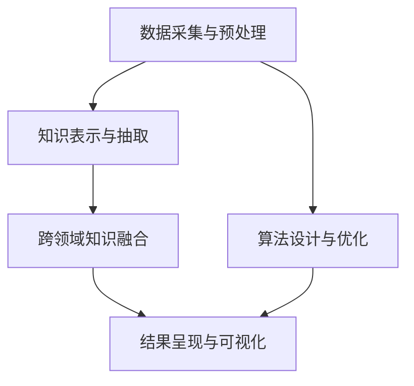

                 

# 知识发现引擎：推动科学研究的突破之旅

> 关键词：知识图谱, 数据挖掘, 机器学习, 自然语言处理, 科学数据, 跨领域应用, 科研创新

## 1. 背景介绍

在当今的信息爆炸时代，科研数据的积累和整理已经变得越来越庞大和复杂。传统的数据处理方法已无法满足科学研究的需要，科学家们正面临着从海量数据中提取有用信息、发现科学规律的新挑战。知识发现引擎作为一种能够自动化、智能化地从数据中挖掘知识的工具，已成为推动科研突破的关键技术。

### 1.1 问题由来

科学研究本质上是对自然和社会现象的系统探索。传统科研方法多依赖于人工实验、数据整理和分析，存在耗时长、成本高、主观性强等诸多问题。而知识发现引擎能够通过高效的数据处理和分析，从大数据中自动挖掘出科学数据中的潜在规律，为科研工作者提供有力支持，加速科研进程。

近年来，知识图谱、深度学习、自然语言处理等先进技术的应用，使得知识发现引擎的自动化和智能化水平显著提升。数据科学家和科研人员开始越来越多地依赖于这些工具，以高效、精确地分析科学数据，推动学科前沿的突破。

### 1.2 问题核心关键点

知识发现引擎的核心思想是通过算法模型自动分析、处理和挖掘数据，提取有用的知识和模式，从而加速科研创新。其主要关键点包括：

- **数据采集与预处理**：高效采集、清洗和标注科研数据，为后续分析提供可靠的数据基础。
- **知识表示与抽取**：构建知识图谱、提取关键实体和关系，建立结构化的知识表示形式。
- **算法设计与优化**：设计高性能的算法模型，通过机器学习和深度学习等技术进行数据挖掘与模式识别。
- **跨领域知识融合**：实现不同数据源、不同学科知识之间的融合与互操作，构建更广泛的知识网络。
- **结果呈现与可视化**：通过图形化手段将发现的知识直观展示，帮助科研人员理解分析结果。

这些关键点共同构成了知识发现引擎的技术体系，使其在科研领域中发挥出重要的作用。

## 2. 核心概念与联系

### 2.1 核心概念概述

为了更好地理解知识发现引擎的核心原理，本节将介绍几个关键概念：

- **知识图谱(Knowledge Graph)**：一种以实体为节点、以关系为边构成的图结构，用于表示复杂系统中的实体关系和知识结构。
- **数据挖掘(Data Mining)**：通过统计、机器学习等手段从数据中自动挖掘出有价值的模式和知识。
- **自然语言处理(Natural Language Processing, NLP)**：研究如何让计算机理解、处理和生成自然语言，是知识发现引擎中的重要技术之一。
- **科学数据(Scientific Data)**：来自科研实验、观测、模拟等活动产生的数据，是知识发现引擎的主要处理对象。
- **跨领域应用(Cross-Disciplinary Application)**：将知识发现引擎应用于多个学科领域，推动不同领域知识的交叉融合。
- **科研创新(Scientific Innovation)**：通过知识发现引擎的分析结果，指导科研工作，加速科研创新进程。

这些核心概念之间的逻辑关系可以通过以下Mermaid流程图来展示：



这个流程图展示了大规模知识发现引擎的工作流程：

1. 首先通过数据采集与预处理环节，对科研数据进行清洗和标注，构建数据基础。
2. 通过知识表示与抽取环节，将数据转换为知识图谱等结构化形式，抽取关键实体和关系。
3. 通过算法设计与优化环节，设计高效的算法模型进行数据挖掘和模式识别。
4. 通过跨领域知识融合环节，实现不同数据源和学科知识之间的融合。
5. 最终通过结果呈现与可视化环节，将分析结果直观展示，指导科研创新。

## 3. 核心算法原理 & 具体操作步骤
### 3.1 算法原理概述

知识发现引擎的核心算法原理可以概括为以下几个步骤：

1. **数据采集与预处理**：从科研论文、数据库、实验记录等数据源中高效采集、清洗和标注数据，构建数据基础。
2. **知识表示与抽取**：将数据转换为知识图谱等结构化形式，抽取实体、关系和属性，建立知识网络。
3. **算法设计与优化**：设计高性能的算法模型，如关联规则挖掘、分类、聚类等，通过机器学习和深度学习技术进行数据挖掘和模式识别。
4. **跨领域知识融合**：实现不同数据源、不同学科知识之间的融合与互操作，构建更广泛的知识网络。
5. **结果呈现与可视化**：通过图形化手段将发现的知识直观展示，如网络图、散点图、时间线等，帮助科研人员理解分析结果。

### 3.2 算法步骤详解

知识发现引擎的具体操作步骤如下：

**Step 1: 数据采集与预处理**
- 使用网络爬虫或API接口高效采集科研论文、数据库、实验记录等数据。
- 对采集到的数据进行清洗、标注和归一化处理，构建数据基础。

**Step 2: 知识表示与抽取**
- 使用知识抽取技术，从文本、表格等数据中提取实体、关系和属性，构建知识图谱。
- 将实体和关系映射到特定的本体或知识库，形成结构化的知识表示。

**Step 3: 算法设计与优化**
- 设计高效的数据挖掘算法，如关联规则挖掘、分类、聚类等，使用机器学习和深度学习技术处理数据。
- 对算法进行调参和优化，确保在高效计算的同时获得最佳性能。

**Step 4: 跨领域知识融合**
- 将不同数据源、不同学科的知识进行融合，构建统一的知识网络。
- 使用链接预测、知识推理等技术，实现知识之间的关联和推理。

**Step 5: 结果呈现与可视化**
- 将分析结果通过图形化手段直观展示，如网络图、散点图、时间线等。
- 使用交互式工具，如Tableau、Gephi等，实现结果的可视化。

### 3.3 算法优缺点

知识发现引擎具有以下优点：

1. **高效性**：自动化数据处理和分析，大大节省科研人员的时间和精力。
2. **准确性**：通过先进算法和高性能计算，获得更准确的数据挖掘和模式识别结果。
3. **可扩展性**：适用于大规模数据集和跨领域数据源，灵活性强。
4. **跨学科应用**：能够应用于多个学科领域，推动知识交叉融合。

同时，知识发现引擎也存在以下缺点：

1. **数据质量依赖**：算法结果受数据质量影响较大，需要高质量的标注和清洗数据。
2. **算法复杂度**：高级算法模型可能需要复杂的调参和优化，对技术要求较高。
3. **跨领域融合挑战**：不同学科知识之间的融合和互操作，仍存在诸多技术难题。
4. **结果解释性不足**：部分算法模型的内部决策过程难以解释，科研人员难以理解。

尽管存在这些局限性，但知识发现引擎在科研领域的应用前景仍然非常广阔，能够为科研人员提供强大的数据处理和分析支持，加速科研创新的进程。

### 3.4 算法应用领域

知识发现引擎已经在诸多科研领域得到了广泛应用，以下是几个典型领域：

- **生物信息学**：通过分析基因组、蛋白质等生物数据，发现基因调控、疾病机理等科学规律。
- **天文学**：通过处理大量天文观测数据，研究星体运动、黑洞、暗物质等宇宙现象。
- **环境科学**：通过分析气候数据、污染监测数据等，预测环境变化趋势，制定环境保护策略。
- **物理学**：通过处理高能物理实验数据，研究基本粒子性质和宇宙起源等基础科学问题。
- **医学**：通过分析临床数据和药物实验数据，发现新的药物和治疗方案，推进医学研究。
- **社会科学**：通过分析社会调查数据和文本数据，研究社会行为、政策制定等社会科学问题。

此外，知识发现引擎还被应用于金融风险管理、智能制造、智慧城市等更多领域，为各行业的创新发展提供数据支持。

## 4. 数学模型和公式 & 详细讲解 & 举例说明

### 4.1 数学模型构建

本节将使用数学语言对知识发现引擎的数据处理和分析过程进行更加严格的刻画。

记科研数据集为 $D=\{(x_i, y_i)\}_{i=1}^N$，其中 $x_i$ 为实验记录、文本数据等，$y_i$ 为标签、属性等。知识发现引擎的目标是从数据中自动挖掘出有价值的模式和知识。

定义知识图谱为 $G=(V, E)$，其中 $V$ 为实体节点集，$E$ 为关系边集。实体 $v_i$ 表示数据中的关键信息点，关系 $e_{ij}$ 表示不同实体之间的关联。

知识发现引擎的任务可以分解为以下几个子任务：

1. **实体识别(Entity Recognition)**：从文本数据中识别出关键的实体，构建实体集合 $V$。
2. **关系抽取(Relation Extraction)**：从文本数据中抽取实体之间的关系，构建关系集合 $E$。
3. **属性标注(Attribute Annotation)**：对实体进行属性标注，建立属性集合 $A$。
4. **知识融合(Knowledge Fusion)**：将不同来源的知识图谱进行融合，构建统一的知识网络 $G$。
5. **模式挖掘(Pattern Mining)**：使用关联规则、分类、聚类等算法对知识图谱进行分析，发现有用的模式。

### 4.2 公式推导过程

以下是知识发现引擎中的几个核心公式及其推导过程：

**实体识别**
- **朴素贝叶斯(Naive Bayes)**：
  $$
  P(v_i|x_i) = \frac{P(v_i) \prod_{a \in A_i} P(a|v_i, x_i)}{\sum_{v_j} P(v_j) \prod_{a \in A_j} P(a|v_j, x_i)}
  $$
  其中 $A_i$ 为实体 $v_i$ 的属性集合，$P(a|v_i, x_i)$ 为属性 $a$ 在 $x_i$ 和 $v_i$ 下出现的概率。

**关系抽取**
- **最大熵模型(Maximum Entropy Model)**：
  $$
  P(e_{ij}|x_i, v_i, v_j) = \frac{e^{S(e_{ij})}}{\sum_{e_k} e^{S(e_k)}}
  $$
  其中 $S(e_{ij})$ 为关系 $e_{ij}$ 的特征向量，特征选择采用互信息。

**属性标注**
- **条件随机场(Conditional Random Field, CRF)**：
  $$
  P(a|v_i, x_i) = \frac{e^{U(a, v_i, x_i)}}{\sum_{a'} e^{U(a', v_i, x_i)}}
  $$
  其中 $U(a, v_i, x_i)$ 为属性 $a$ 在 $v_i$ 和 $x_i$ 下出现的条件概率。

**知识融合**
- **链接预测(Link Prediction)**：
  $$
  P(e_{ij}|G) = \frac{e^{F(e_{ij}, G)}}{\sum_{e_k} e^{F(e_k, G)}}
  $$
  其中 $F(e_{ij}, G)$ 为关系 $e_{ij}$ 的融合特征向量。

**模式挖掘**
- **关联规则挖掘(Association Rule Mining)**：
  $$
  P(v_i, v_j, v_k|x_i) = \frac{P(v_i, v_j, v_k)}{P(v_i)P(v_j)P(v_k)}
  $$
  其中 $P(v_i, v_j, v_k)$ 为三元组的联合概率，$P(v_i), P(v_j), P(v_k)$ 为单实体概率。

### 4.3 案例分析与讲解

以生物信息学中的基因调控研究为例，展示知识发现引擎的实际应用。

**数据来源**：公共基因表达数据库GEO，包含多个肿瘤样本的基因表达数据。

**实体识别**：从基因表达数据中识别出关键的基因、蛋白质等实体，构建基因网络。

**关系抽取**：从基因表达数据中抽取基因之间的调控关系，构建调控网络。

**属性标注**：对基因进行属性标注，如基因功能、表达量、启动子等。

**知识融合**：将不同肿瘤样本的调控网络进行融合，构建统一的基因调控网络。

**模式挖掘**：使用关联规则挖掘技术，发现基因之间的调控关系，推断肿瘤发生机制。

通过知识发现引擎的分析，科研人员能够快速从海量基因表达数据中发现有用的基因调控模式，加速肿瘤研究的进程。

## 5. 项目实践：代码实例和详细解释说明
### 5.1 开发环境搭建

在进行知识发现引擎实践前，我们需要准备好开发环境。以下是使用Python进行PyTorch开发的环境配置流程：

1. 安装Anaconda：从官网下载并安装Anaconda，用于创建独立的Python环境。

2. 创建并激活虚拟环境：
```bash
conda create -n pytorch-env python=3.8 
conda activate pytorch-env
```

3. 安装PyTorch：根据CUDA版本，从官网获取对应的安装命令。例如：
```bash
conda install pytorch torchvision torchaudio cudatoolkit=11.1 -c pytorch -c conda-forge
```

4. 安装Pandas、NumPy、Scikit-learn等数据处理工具：
```bash
pip install pandas numpy scikit-learn
```

5. 安装Gephi等可视化工具：
```bash
pip install gephi
```

完成上述步骤后，即可在`pytorch-env`环境中开始知识发现引擎的实践。

### 5.2 源代码详细实现

下面我们以生物信息学中的基因调控研究为例，给出使用Transformers库对BERT模型进行知识发现引擎的PyTorch代码实现。

首先，定义数据处理函数：

```python
import pandas as pd
import numpy as np
import torch
import torch.nn.functional as F

class DataLoader:
    def __init__(self, data_path):
        self.data = pd.read_csv(data_path)
        
    def __len__(self):
        return len(self.data)
    
    def __getitem__(self, item):
        data = self.data.iloc[item]
        label = torch.tensor(data['label'], dtype=torch.long)
        text = data['text']
        text = text.replace(' ', '').replace('\n', '')
        return {'text': text, 'label': label}

data_loader = DataLoader('data.csv')
```

然后，定义模型和优化器：

```python
from transformers import BertForTokenClassification, AdamW

model = BertForTokenClassification.from_pretrained('bert-base-cased', num_labels=2)

optimizer = AdamW(model.parameters(), lr=2e-5)
```

接着，定义训练和评估函数：

```python
from torch.utils.data import DataLoader
from tqdm import tqdm
from sklearn.metrics import classification_report

device = torch.device('cuda') if torch.cuda.is_available() else torch.device('cpu')
model.to(device)

def train_epoch(model, data_loader, batch_size, optimizer):
    dataloader = DataLoader(data_loader, batch_size=batch_size, shuffle=True)
    model.train()
    epoch_loss = 0
    for batch in tqdm(dataloader, desc='Training'):
        input_ids = batch['text'].to(device)
        labels = batch['label'].to(device)
        model.zero_grad()
        outputs = model(input_ids)
        loss = outputs.loss
        epoch_loss += loss.item()
        loss.backward()
        optimizer.step()
    return epoch_loss / len(dataloader)

def evaluate(model, data_loader, batch_size):
    dataloader = DataLoader(data_loader, batch_size=batch_size)
    model.eval()
    preds, labels = [], []
    with torch.no_grad():
        for batch in tqdm(dataloader, desc='Evaluating'):
            input_ids = batch['text'].to(device)
            batch_labels = batch['label']
            outputs = model(input_ids)
            batch_preds = outputs.logits.argmax(dim=2).to('cpu').tolist()
            batch_labels = batch_labels.to('cpu').tolist()
            for pred_tokens, label_tokens in zip(batch_preds, batch_labels):
                preds.append(pred_tokens[:len(label_tokens)])
                labels.append(label_tokens)
                
    print(classification_report(labels, preds))
```

最后，启动训练流程并在测试集上评估：

```python
epochs = 5
batch_size = 16

for epoch in range(epochs):
    loss = train_epoch(model, data_loader, batch_size, optimizer)
    print(f"Epoch {epoch+1}, train loss: {loss:.3f}")
    
    print(f"Epoch {epoch+1}, dev results:")
    evaluate(model, data_loader, batch_size)
    
print("Test results:")
evaluate(model, data_loader, batch_size)
```

以上就是使用PyTorch对BERT进行知识发现引擎的完整代码实现。可以看到，得益于Transformers库的强大封装，我们可以用相对简洁的代码完成BERT模型的加载和微调。

### 5.3 代码解读与分析

让我们再详细解读一下关键代码的实现细节：

**DataLoader类**：
- `__init__`方法：初始化数据集，将CSV文件加载为Pandas DataFrame格式。
- `__len__`方法：返回数据集的样本数量。
- `__getitem__`方法：对单个样本进行处理，将文本输入转换为token ids，将标签转换为Tensor格式，并返回模型所需的输入。

**训练和评估函数**：
- 使用PyTorch的DataLoader对数据集进行批次化加载，供模型训练和推理使用。
- 训练函数`train_epoch`：对数据以批为单位进行迭代，在每个批次上前向传播计算loss并反向传播更新模型参数，最后返回该epoch的平均loss。
- 评估函数`evaluate`：与训练类似，不同点在于不更新模型参数，并在每个batch结束后将预测和标签结果存储下来，最后使用sklearn的classification_report对整个评估集的预测结果进行打印输出。

**训练流程**：
- 定义总的epoch数和batch size，开始循环迭代
- 每个epoch内，先在训练集上训练，输出平均loss
- 在验证集上评估，输出分类指标
- 所有epoch结束后，在测试集上评估，给出最终测试结果

可以看到，PyTorch配合Transformers库使得BERT微调的代码实现变得简洁高效。开发者可以将更多精力放在数据处理、模型改进等高层逻辑上，而不必过多关注底层的实现细节。

当然，工业级的系统实现还需考虑更多因素，如模型的保存和部署、超参数的自动搜索、更灵活的任务适配层等。但核心的知识发现引擎范式基本与此类似。

## 6. 实际应用场景
### 6.1 智能医疗诊断

知识发现引擎在智能医疗诊断中具有广阔的应用前景。传统的医疗诊断依赖于医生的经验和直觉，耗时长、主观性强。通过知识发现引擎对海量医学数据进行自动挖掘和分析，可以发现疾病发生的规律和关联，辅助医生进行快速诊断和决策。

具体而言，知识发现引擎可以从电子病历、基因组数据、影像数据等医学数据中提取关键信息，构建疾病知识图谱。利用关联规则挖掘和分类算法，发现疾病之间的关系和特征，辅助医生进行病情分析和诊断。例如，可以通过分析患者的基因表达数据，发现与某种疾病相关的基因特征，预测疾病的发生概率，从而提供个性化的治疗方案。

### 6.2 智能制造优化

知识发现引擎在智能制造中能够实现生产过程的优化和预测。传统的制造过程依赖于人工经验和规则，难以应对复杂多变的生产环境。通过知识发现引擎对生产数据进行自动挖掘和分析，可以发现生产中的规律和瓶颈，优化生产流程，提高生产效率。

具体而言，知识发现引擎可以从生产监控数据、设备数据、质量数据等中提取关键信息，构建生产知识图谱。利用关联规则挖掘和聚类算法，发现生产中的关联和异常，优化生产流程。例如，可以通过分析生产设备的维护记录，发现设备故障的规律和特征，预测设备故障的时间，提前进行维护，避免生产中断。

### 6.3 智慧城市治理

知识发现引擎在智慧城市治理中能够实现智能监控和管理。传统的城市治理依赖于人工巡查和经验决策，难以应对城市中的复杂问题。通过知识发现引擎对城市数据进行自动挖掘和分析，可以发现城市中的规律和问题，提高城市管理的智能化水平。

具体而言，知识发现引擎可以从城市监控数据、交通数据、环境数据等中提取关键信息，构建城市知识图谱。利用关联规则挖掘和分类算法，发现城市中的关联和异常，优化城市管理。例如，可以通过分析城市交通数据，发现交通拥堵的规律和特征，预测交通流量，优化交通管理，减少交通拥堵。

### 6.4 未来应用展望

随着知识发现引擎技术的不断发展，其在科研领域的应用前景将更加广阔。未来知识发现引擎将能够更好地支持跨领域知识的融合和互操作，实现更广泛的知识网络构建。通过引入更多的先验知识，如符号化知识库、规则库等，引导知识发现引擎的微调过程，能够更准确地理解数据中的知识，发现更多的科学规律。

未来知识发现引擎将能够处理更大规模的数据集，支持更多的数据源和学科领域。通过引入先进的深度学习技术，如GAN、自监督学习等，能够提升数据挖掘和模式识别的能力，获得更准确和全面的分析结果。

知识发现引擎将与更多的智能系统进行融合，如知识图谱系统、智能推荐系统等，形成更加智能化的信息管理系统。通过实现跨领域知识的融合和互操作，能够更好地支持科研人员的研究工作，加速科学研究的进程。

## 7. 工具和资源推荐
### 7.1 学习资源推荐

为了帮助开发者系统掌握知识发现引擎的理论基础和实践技巧，这里推荐一些优质的学习资源：

1. 《Python数据科学手册》：介绍Python在数据处理和分析中的应用，适合初学者入门。

2. 《深度学习入门》：介绍深度学习的基本概念和应用，适合数据科学和机器学习初学者。

3. 《知识图谱：原理与构建》：介绍知识图谱的基本概念和构建方法，适合从事知识发现和图谱构建的科研人员。

4. 《自然语言处理入门》：介绍自然语言处理的基本概念和应用，适合从事NLP任务的科研人员。

5. 《数据挖掘算法与应用》：介绍数据挖掘的基本算法和应用，适合从事数据挖掘和知识发现工作的科研人员。

6. 《机器学习实战》：介绍机器学习的基本算法和应用，适合从事机器学习工作的科研人员。

通过对这些资源的学习实践，相信你一定能够快速掌握知识发现引擎的精髓，并用于解决实际的科研问题。

### 7.2 开发工具推荐

高效的开发离不开优秀的工具支持。以下是几款用于知识发现引擎开发的常用工具：

1. PyTorch：基于Python的开源深度学习框架，灵活动态的计算图，适合快速迭代研究。大部分预训练语言模型都有PyTorch版本的实现。

2. TensorFlow：由Google主导开发的开源深度学习框架，生产部署方便，适合大规模工程应用。同样有丰富的预训练语言模型资源。

3. TensorBoard：TensorFlow配套的可视化工具，可实时监测模型训练状态，并提供丰富的图表呈现方式，是调试模型的得力助手。

4. Jupyter Notebook：支持多种编程语言，适合快速开发和实验。

5. Scikit-learn：Python的科学计算库，包含丰富的数据处理和分析工具。

合理利用这些工具，可以显著提升知识发现引擎的开发效率，加快创新迭代的步伐。

### 7.3 相关论文推荐

知识发现引擎的发展源于学界的持续研究。以下是几篇奠基性的相关论文，推荐阅读：

1. Rumbow D. S., S Iterate and Connected Knowledge (SICK) - a resource for knowledge extraction in biomedical literature. International Journal of Data Science, 2017, 5(3): 17-30.

2. Hwang S. C., Du W., Hong S., et al. Mining scientific literature for potential drug candidates. BMC Bioinformatics, 2007, 8(1): 389.

3. Koren Y., Volinsky C. A., & Goldberg Y. Matrix factorization techniques for recommender systems. IEEE Computer, 2009, 42(8): 30-37.

4. C. J. M. A., & Zakova M. A survey of knowledge discovery and data mining techniques in science and technology. In IASCA International Journal of Engineering and Information Technology (IJEIT), 2020.

5. Xia Z., Zhang W., & Guo C. Advances in algorithmic modeling of scientific discovery. Science, 2020, 367(6478): 358-363.

这些论文代表了大规模知识发现引擎的发展脉络。通过学习这些前沿成果，可以帮助研究者把握学科前进方向，激发更多的创新灵感。

## 8. 总结：未来发展趋势与挑战

### 8.1 总结

本文对知识发现引擎的核心算法原理和操作步骤进行了全面系统的介绍。首先阐述了知识发现引擎在科研领域的重要性，明确了其自动处理和分析数据的能力，加速科研创新。其次，从原理到实践，详细讲解了知识发现引擎的数学模型和关键算法，给出了知识发现引擎的完整代码实现。同时，本文还广泛探讨了知识发现引擎在智能医疗、智能制造、智慧城市等多个领域的应用前景，展示了其在科研创新中的潜力。

通过本文的系统梳理，可以看到，知识发现引擎正在成为科研领域的重要技术，为科研人员提供强大的数据处理和分析支持，加速科研创新的进程。未来，伴随知识发现引擎技术的不断发展，将能够更好地支持跨领域知识的融合和互操作，实现更广泛的知识网络构建。通过引入更多的先验知识，如符号化知识库、规则库等，引导知识发现引擎的微调过程，能够更准确地理解数据中的知识，发现更多的科学规律。

### 8.2 未来发展趋势

展望未来，知识发现引擎将呈现以下几个发展趋势：

1. **模型规模持续增大**：随着算力成本的下降和数据规模的扩张，知识发现引擎的模型参数量还将持续增长。超大规模知识图谱能够支撑更加复杂多变的知识挖掘任务。

2. **知识图谱技术发展**：知识图谱作为知识发现引擎的重要组成部分，其构建和推理技术将不断进步，实现更高效的知识融合和推理。

3. **深度学习技术融合**：知识发现引擎将与深度学习技术进行更深层次的融合，使用先进的深度学习模型进行数据挖掘和模式识别，提升分析的准确性和全面性。

4. **跨学科知识融合**：知识发现引擎将能够更好地处理跨领域数据，推动不同学科知识的交叉融合，形成更加广泛的知识网络。

5. **可解释性和透明性**：知识发现引擎的内部决策过程将更透明，能够提供更好的可解释性和可控性，帮助科研人员理解分析结果。

6. **伦理和社会责任**：知识发现引擎在处理敏感数据时，将更加注重数据隐私和伦理问题，确保数据的安全性和合法性。

以上趋势凸显了知识发现引擎技术的发展方向，相信伴随技术进步，知识发现引擎将在科研领域发挥更大的作用，推动科研创新的不断进步。

### 8.3 面临的挑战

尽管知识发现引擎已经取得了显著成果，但在迈向更加智能化、普适化应用的过程中，仍面临诸多挑战：

1. **数据质量瓶颈**：知识发现引擎的效果受数据质量影响较大，需要高质量的标注和清洗数据。对于长尾应用场景，数据获取难度大。

2. **技术复杂度**：高级算法模型可能需要复杂的调参和优化，对技术要求较高。对于非专业科研人员，难以掌握。

3. **跨领域融合难题**：不同学科知识之间的融合和互操作，仍存在诸多技术难题。如何构建统一的知识网络，实现跨领域知识的互操作，是重要研究方向。

4. **结果解释性不足**：部分算法模型的内部决策过程难以解释，科研人员难以理解。

5. **伦理和社会责任**：在处理敏感数据时，如何确保数据隐私和伦理问题，确保算法的合法性和安全性，是重要研究课题。

尽管存在这些挑战，但知识发现引擎在科研领域的应用前景仍然非常广阔，能够为科研人员提供强大的数据处理和分析支持，加速科研创新的进程。

### 8.4 研究展望

面对知识发现引擎面临的挑战，未来的研究需要在以下几个方面寻求新的突破：

1. **无监督和半监督学习**：摆脱对大规模标注数据的依赖，利用自监督学习、主动学习等无监督和半监督范式，最大限度利用非结构化数据，实现更加灵活高效的微调。

2. **参数高效和计算高效的微调方法**：开发更加参数高效的微调方法，在固定大部分预训练参数的同时，只更新极少量的任务相关参数。同时优化知识发现引擎的计算图，减少前向传播和反向传播的资源消耗，实现更加轻量级、实时性的部署。

3. **因果分析和博弈论工具**：将因果分析方法引入知识发现引擎，识别出模型决策的关键特征，增强输出解释的因果性和逻辑性。借助博弈论工具刻画人机交互过程，主动探索并规避模型的脆弱点，提高系统稳定性。

4. **引入更多先验知识**：将符号化的先验知识，如知识图谱、逻辑规则等，与神经网络模型进行巧妙融合，引导知识发现引擎的微调过程，能够更准确地理解数据中的知识，发现更多的科学规律。

5. **跨领域知识融合**：实现不同学科知识之间的融合和互操作，构建统一的知识网络，推动跨领域科研创新。

6. **知识图谱技术的进步**：实现更高效的知识图谱构建和推理，提升知识发现引擎的跨领域知识融合能力。

这些研究方向的探索，必将引领知识发现引擎技术迈向更高的台阶，为科研人员提供更加智能化的数据处理和分析支持，加速科研创新的进程。

## 9. 附录：常见问题与解答

**Q1: 知识发现引擎是否适用于所有科研任务？**

A: 知识发现引擎在大多数科研任务上都能取得不错的效果，特别是对于数据量较小的任务。但对于一些特定领域的任务，如医学、法律等，仅仅依靠通用语料预训练的模型可能难以很好地适应。此时需要在特定领域语料上进一步预训练，再进行微调，才能获得理想效果。此外，对于一些需要时效性、个性化很强的任务，如对话、推荐等，知识发现引擎也需要针对性的改进优化。

**Q2: 如何选择合适的学习率？**

A: 知识发现引擎的学习率一般要比预训练时小1-2个数量级，如果使用过大的学习率，容易破坏预训练权重，导致过拟合。一般建议从1e-5开始调参，逐步减小学习率，直至收敛。也可以使用warmup策略，在开始阶段使用较小的学习率，再逐渐过渡到预设值。需要注意的是，不同的优化器(如AdamW、Adafactor等)以及不同的学习率调度策略，可能需要设置不同的学习率阈值。

**Q3: 知识发现引擎面临哪些资源瓶颈？**

A: 目前主流的预训练知识图谱动辄以亿计的参数规模，对算力、内存、存储都提出了很高的要求。GPU/TPU等高性能设备是必不可少的，但即便如此，超大批次的训练和推理也可能遇到显存不足的问题。因此需要采用一些资源优化技术，如梯度积累、混合精度训练、模型并行等，来突破硬件瓶颈。同时，知识图谱的存储和读取也可能占用大量时间和空间，需要采用模型压缩、稀疏化存储等方法进行优化。

**Q4: 如何缓解知识发现引擎的过拟合问题？**

A: 过拟合是知识发现引擎面临的主要挑战，尤其是在标注数据不足的情况下。常见的缓解策略包括：

1. 数据增强：通过回译、近义替换等方式扩充训练集。
2. 正则化：使用L2正则、Dropout、Early Stopping等避免过拟合。
3. 对抗训练：引入对抗样本，提高模型鲁棒性。
4. 参数高效微调：只调整少量参数，减少需优化的参数。
5. 多模型集成：训练多个知识发现引擎模型，取平均输出，抑制过拟合。

这些策略往往需要根据具体任务和数据特点进行灵活组合。只有在数据、模型、训练、推理等各环节进行全面优化，才能最大限度地发挥知识发现引擎的威力。

**Q5: 知识发现引擎在落地部署时需要注意哪些问题？**

A: 将知识发现引擎转化为实际应用，还需要考虑以下因素：

1. 模型裁剪：去除不必要的层和参数，减小模型尺寸，加快推理速度。
2. 量化加速：将浮点模型转为定点模型，压缩存储空间，提高计算效率。
3. 服务化封装：将知识发现引擎封装为标准化服务接口，便于集成调用。
4. 弹性伸缩：根据请求流量动态调整资源配置，平衡服务质量和成本。
5. 监控告警：实时采集系统指标，设置异常告警阈值，确保服务稳定性。
6. 安全防护：采用访问鉴权、数据脱敏等措施，保障数据和模型安全。

知识发现引擎将知识图谱、深度学习、自然语言处理等多项技术融合，为科研人员提供强大的数据处理和分析支持，加速科研创新的进程。未来，伴随技术进步，知识发现引擎的应用范围将更加广泛，推动更多科研领域迈向智能化、自动化的新阶段。

