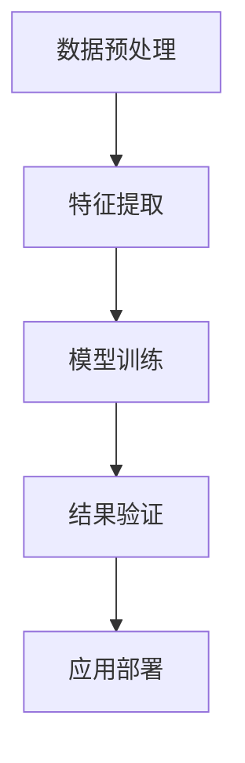

                 

## 1. 背景介绍

### 1.1 问题由来
随着互联网的普及和数据存储技术的不断进步，数据量和数据类型的爆炸式增长，人类进入了大数据时代。数据挖掘和知识发现成为了热点研究领域。传统的统计分析方法已无法有效处理大规模、高维度的数据。知识发现引擎（Knowledge Discovery Engine，简称KDE）在这样的背景下应运而生，通过智能算法和强大的计算能力，在浩瀚的数据海洋中挖掘出深层次的、有价值的知识与洞察力，助力企业在复杂多变的环境中做出明智决策。

### 1.2 问题核心关键点
知识发现引擎的核心在于通过先进的算法和计算技术，自动化地发现数据中蕴含的深层次知识与模式，并转化为有意义的洞察力。在实际应用中，KDE可以应用于市场分析、客户行为预测、供应链优化、金融风险评估等多个领域，显著提升企业的决策效率和竞争力。

KDE的核心流程包括数据预处理、特征提取、模型训练、结果验证和应用部署。其中，模型训练是KDE的核心步骤，通过选择合适的算法和优化方法，将数据转化为知识和洞察力。本节将重点介绍知识发现引擎中的核心算法原理与操作步骤，帮助读者理解KDE的构建和应用。

### 1.3 问题研究意义
研究知识发现引擎，对于提升数据挖掘和知识发现的效率，加速大数据技术在各行各业的应用，具有重要意义：

1. 提升数据分析效率。KDE能够自动发现数据中隐含的知识模式，减少了人工数据分析的时间和成本。
2. 提高决策准确性。通过深入的数据分析和知识挖掘，KDE能够提供更为准确、全面的决策支持。
3. 增强数据驱动决策。KDE能够基于历史数据，预测未来趋势和行为，帮助企业做出更加科学、合理的决策。
4. 促进跨领域应用。KDE的应用领域广泛，有助于推动数据挖掘技术在更多行业中的应用和普及。
5. 实现智能自动化。KDE能够自动化地完成数据分析和知识发现，减轻数据科学家和业务分析师的工作负担。

## 2. 核心概念与联系

### 2.1 核心概念概述

知识发现引擎（KDE）是一种通过智能算法和计算技术，从大量数据中自动化地发现深层次知识和模式的工具。KDE通常包括以下几个核心概念：

- **数据预处理**：对原始数据进行清洗、归一化、降维等处理，以减少噪声和冗余，提高数据质量。
- **特征提取**：通过选择和构造合适的特征，将原始数据转化为机器可理解的形式，便于后续建模和分析。
- **模型训练**：利用机器学习算法和深度学习模型，对数据进行建模和训练，发现数据中的规律和模式。
- **结果验证**：对模型训练结果进行验证和评估，确保结果的准确性和可靠性。
- **应用部署**：将模型和知识转化为可操作的洞察力和决策建议，应用于实际业务场景中。

### 2.2 核心概念联系

知识发现引擎的各个核心概念之间紧密联系，共同构成了知识发现的完整流程。以下是一个简化的知识发现引擎架构图：



从图中可以看到，数据预处理是整个知识发现流程的入口，通过预处理后的数据进入特征提取阶段，进而用于模型训练。模型训练得到的知识与洞察力，需要经过结果验证，确保其准确性和可靠性，最后应用于实际业务场景中。

## 3. 核心算法原理 & 具体操作步骤
### 3.1 算法原理概述

知识发现引擎的核心算法通常基于机器学习、深度学习、统计学等技术。以下以神经网络为基础，介绍KDE的核心算法原理。

神经网络是一种模拟人脑神经元之间相互连接的计算模型。在KDE中，常用的神经网络模型包括多层感知器（MLP）、卷积神经网络（CNN）、循环神经网络（RNN）等。这些模型通过前向传播和反向传播，自动从数据中学习特征和模式，最终输出有价值的知识和洞察力。

### 3.2 算法步骤详解

知识发现引擎的核心算法步骤通常包括以下几个关键环节：

**Step 1: 数据预处理**

- **数据清洗**：去除缺失值、异常值和噪声数据，保证数据质量。
- **数据归一化**：对数据进行标准化或归一化处理，使得数据具有统一的分布。
- **数据降维**：通过主成分分析（PCA）、线性判别分析（LDA）等方法，将高维数据降维至低维，减少计算量和存储需求。

**Step 2: 特征提取**

- **特征选择**：从原始数据中选择和构造合适的特征，提高模型的泛化能力。
- **特征变换**：通过特征编码、归一化等方法，将特征转化为模型友好的形式。
- **特征组合**：利用特征组合方法，如多项式特征、交叉特征，提取更深层次的特征。

**Step 3: 模型训练**

- **模型选择**：选择合适的神经网络模型和优化方法，如MLP、CNN、RNN等。
- **模型训练**：利用训练数据，通过前向传播和反向传播，调整模型参数，使得模型能够准确预测数据。
- **超参数调优**：选择合适的学习率、批大小、迭代轮数等超参数，优化模型训练效果。

**Step 4: 结果验证**

- **模型评估**：使用测试数据集评估模型性能，计算准确率、召回率、F1值等指标。
- **模型优化**：根据评估结果，调整模型参数和超参数，优化模型效果。
- **结果可视化**：通过可视化的方式展示模型输出，便于理解模型结果。

**Step 5: 应用部署**

- **模型部署**：将训练好的模型部署到实际应用场景中，提供决策支持。
- **知识应用**：将模型输出的知识和洞察力转化为具体的决策建议，应用于业务决策中。
- **持续学习**：根据新的数据，重新训练模型，更新知识库，确保模型的时效性。

### 3.3 算法优缺点

知识发现引擎的优点在于：

- **自动化处理**：能够自动化地完成数据预处理、特征提取、模型训练等复杂任务，减少人工干预。
- **泛化能力强**：能够处理大规模、高维度的数据，发现深层次的规律和模式。
- **灵活应用**：适用于各种业务场景，如客户行为分析、市场预测、金融风险评估等。

同时，知识发现引擎也存在一些局限性：

- **依赖数据质量**：数据预处理的质量直接影响模型效果，需要耗费大量时间和精力进行数据清洗和归一化。
- **计算资源需求高**：神经网络模型通常需要大量的计算资源，训练和推理过程耗时较长。
- **解释性不足**：模型输出的结果往往缺乏可解释性，难以理解其内部逻辑和决策依据。
- **过度拟合风险**：模型在训练过程中容易发生过拟合，导致泛化能力不足。

### 3.4 算法应用领域

知识发现引擎在多个领域得到了广泛应用，以下是几个典型案例：

**金融风控**

金融领域需要实时监控风险，及时发现和预警潜在的金融风险。知识发现引擎可以通过分析历史交易数据，预测市场波动和异常交易行为，提前进行风险预警，帮助金融机构控制风险。

**医疗诊断**

医疗数据包含大量复杂的信息，如病历、检查报告、基因数据等。知识发现引擎可以通过分析患者数据，发现潜在的疾病风险和诊疗方案，提供个性化的治疗建议，提高医疗效率和诊断准确性。

**零售营销**

零售行业需要根据客户行为和市场趋势，制定有效的营销策略。知识发现引擎可以通过分析历史销售数据和客户行为，发现潜在的客户需求和市场趋势，帮助零售企业制定更科学的营销策略，提升客户满意度和销售额。

**物流优化**

物流领域需要实时监控和优化配送路线、库存管理等环节。知识发现引擎可以通过分析历史物流数据，发现最佳的配送路径和库存策略，提高物流效率和成本控制。

## 4. 数学模型和公式 & 详细讲解  
### 4.1 数学模型构建

知识发现引擎的核心模型通常基于神经网络，以下以多层感知器（MLP）为例，介绍其数学模型构建。

多层感知器由多个隐层和输出层组成，其输入为原始数据，经过多次非线性变换后输出结果。

设输入数据为 $x = (x_1, x_2, ..., x_n)$，输出为 $y = (y_1, y_2, ..., y_m)$，则MLP的数学模型可以表示为：

$$
y = f(W_1 \cdot f(W_2 \cdot ... \cdot f(W_L \cdot x) ...))
$$

其中 $W_L, W_{L-1}, ..., W_1$ 为权重矩阵，$f$ 为激活函数，通常采用sigmoid、ReLU、tanh等非线性函数。

### 4.2 公式推导过程

以二分类问题为例，推导MLP的损失函数及其梯度计算公式。

设二分类问题的输入数据为 $x$，标签为 $y$，输出为 $z$，损失函数为交叉熵损失函数：

$$
\mathcal{L} = -\frac{1}{N}\sum_{i=1}^N y_i\log(z_i) + (1-y_i)\log(1-z_i)
$$

前向传播过程，通过多层非线性变换，计算输出 $z$：

$$
z = f(W_L \cdot f(W_{L-1} \cdot ... \cdot f(W_1 \cdot x) ...))
$$

反向传播过程中，根据损失函数对参数 $W_L, W_{L-1}, ..., W_1$ 的梯度进行计算：

$$
\frac{\partial \mathcal{L}}{\partial W_i} = \frac{\partial \mathcal{L}}{\partial z} \cdot \frac{\partial z}{\partial W_i}
$$

其中 $\frac{\partial z}{\partial W_i}$ 可通过链式法则递归计算。

### 4.3 案例分析与讲解

以信用评分为例，分析知识发现引擎的应用。

假设某银行需要根据客户的信用记录和个人信息，评估其信用风险。利用知识发现引擎，可以通过以下步骤：

**Step 1: 数据预处理**

- **数据清洗**：去除缺失值和异常值，保留完整数据。
- **数据归一化**：对信用记录和个人信息进行归一化处理，使得数据具有统一的分布。

**Step 2: 特征提取**

- **特征选择**：选择信用记录、收入、职业、家庭状况等特征。
- **特征变换**：对特征进行编码、归一化等处理。

**Step 3: 模型训练**

- **模型选择**：选择MLP模型，设置激活函数、隐藏层数、节点数等超参数。
- **模型训练**：使用历史信用记录数据，训练MLP模型，输出客户信用评分。
- **超参数调优**：根据验证集上的表现，调整模型参数和超参数。

**Step 4: 结果验证**

- **模型评估**：使用测试集评估模型性能，计算准确率、召回率、F1值等指标。
- **模型优化**：根据评估结果，调整模型参数和超参数，优化模型效果。

**Step 5: 应用部署**

- **模型部署**：将训练好的模型部署到银行系统中，提供信用评估服务。
- **知识应用**：根据客户提交的个人信息和信用记录，输出信用评分，辅助银行进行决策。

## 5. 项目实践：代码实例和详细解释说明
### 5.1 开发环境搭建

在进行知识发现引擎实践前，我们需要准备好开发环境。以下是使用Python进行TensorFlow开发的环境配置流程：

1. 安装Anaconda：从官网下载并安装Anaconda，用于创建独立的Python环境。

2. 创建并激活虚拟环境：
```bash
conda create -n tf-env python=3.8 
conda activate tf-env
```

3. 安装TensorFlow：根据CUDA版本，从官网获取对应的安装命令。例如：
```bash
conda install tensorflow -c tf -c conda-forge
```

4. 安装各类工具包：
```bash
pip install numpy pandas scikit-learn matplotlib tqdm jupyter notebook ipython
```

完成上述步骤后，即可在`tf-env`环境中开始知识发现引擎的开发实践。

### 5.2 源代码详细实现

下面我们以信用评分任务为例，给出使用TensorFlow进行知识发现引擎的PyTorch代码实现。

首先，定义信用评分任务的数据处理函数：

```python
import tensorflow as tf
from tensorflow.keras.preprocessing import sequence
from sklearn.model_selection import train_test_split
from sklearn.preprocessing import StandardScaler
import pandas as pd

def load_data(file_path, num_features):
    data = pd.read_csv(file_path)
    X = data.drop('target', axis=1)
    y = data['target']
    X = X.values
    y = y.values
    X = sequence.pad_sequences(X, maxlen=num_features)
    return X, y

# 加载数据
X, y = load_data('credit_data.csv', num_features=10)
X_train, X_test, y_train, y_test = train_test_split(X, y, test_size=0.2, random_state=42)

# 数据归一化
scaler = StandardScaler()
X_train = scaler.fit_transform(X_train)
X_test = scaler.transform(X_test)
```

然后，定义神经网络模型：

```python
from tensorflow.keras.models import Sequential
from tensorflow.keras.layers import Dense, Dropout

model = Sequential([
    Dense(64, input_shape=(X_train.shape[1],), activation='relu'),
    Dropout(0.5),
    Dense(32, activation='relu'),
    Dropout(0.5),
    Dense(1, activation='sigmoid')
])

# 编译模型
model.compile(loss='binary_crossentropy', optimizer='adam', metrics=['accuracy'])

# 训练模型
model.fit(X_train, y_train, batch_size=32, epochs=10, validation_data=(X_test, y_test))
```

最后，评估模型性能并输出结果：

```python
# 评估模型
_, accuracy = model.evaluate(X_test, y_test)
print(f'Test accuracy: {accuracy:.4f}')
```

以上就是使用TensorFlow进行知识发现引擎的信用评分任务微调的完整代码实现。可以看到，TensorFlow提供了丰富的API和组件，使得模型构建和训练变得非常便捷。

### 5.3 代码解读与分析

让我们再详细解读一下关键代码的实现细节：

**load_data函数**：
- 加载数据集，从CSV文件中读取特征和标签。
- 对特征进行归一化和padding处理，以适应模型输入要求。

**模型定义**：
- 定义一个包含两个隐藏层的MLP模型，第一层64个节点，第二层32个节点。
- 使用ReLU激活函数和Dropout技术，提高模型的泛化能力和鲁棒性。
- 输出层使用sigmoid函数，进行二分类预测。

**模型编译和训练**：
- 编译模型，选择交叉熵损失函数和Adam优化器。
- 训练模型，设置批次大小和迭代轮数，使用验证集进行模型优化。

**模型评估**：
- 评估模型在测试集上的性能，输出准确率。

可以看到，TensorFlow的高级API使得模型构建和训练变得非常简单。开发者可以将更多精力放在数据预处理和特征工程上，而不必过多关注底层实现细节。

## 6. 实际应用场景
### 6.1 金融风控

知识发现引擎在金融风控领域的应用非常广泛。利用KDE，金融机构可以分析历史交易数据，发现潜在的风险因素和异常行为，及时预警和处理风险。

**应用案例**：某银行通过知识发现引擎，分析客户的信用记录和个人信息，预测其信用风险。模型输出信用评分，银行根据评分高低决定是否批准贷款申请。

**优势**：
- 实时监控风险，及时预警。
- 自动化风险评估，减少人工干预。
- 提高决策效率，降低风险损失。

### 6.2 医疗诊断

医疗领域需要处理大量的患者数据，如病历、检查报告、基因数据等。知识发现引擎可以从中挖掘出深层次的知识和模式，辅助医生进行诊断和治疗。

**应用案例**：某医院利用知识发现引擎，分析患者的病历和检查报告，发现潜在的疾病风险和诊疗方案。模型输出诊断建议，医生根据建议制定治疗方案。

**优势**：
- 提高诊断准确性，减少误诊。
- 个性化治疗方案，提高治疗效果。
- 快速响应病情变化，及时调整治疗方案。

### 6.3 零售营销

零售行业需要根据客户行为和市场趋势，制定有效的营销策略。知识发现引擎可以分析历史销售数据和客户行为，发现潜在的客户需求和市场趋势，帮助零售企业制定科学的营销策略。

**应用案例**：某电商平台利用知识发现引擎，分析用户的购买记录和浏览行为，发现潜在的客户需求和市场趋势。模型输出营销建议，电商平台根据建议进行个性化推荐和促销活动。

**优势**：
- 提高客户满意度和销售额。
- 自动化营销策略制定，减少人工干预。
- 个性化推荐，提升客户粘性。

### 6.4 未来应用展望

随着知识发现引擎的不断发展，其在更多领域的应用前景广阔。未来，KDE可能应用于：

**智慧城市**

智慧城市建设需要实时监控和管理各类公共设施和环境数据。知识发现引擎可以分析各类数据，发现城市运行中的问题，提供决策支持。

**智慧农业**

农业领域需要实时监控和管理各类农业数据，如气象数据、土壤数据、作物生长数据等。知识发现引擎可以从中挖掘出深层次的知识和模式，辅助农民进行精准农业管理。

**智慧交通**

智慧交通需要实时监控和管理交通数据，如车辆流量、道路状况、交通事件等。知识发现引擎可以从中挖掘出深层次的知识和模式，优化交通管理，提高道路通行效率。

## 7. 工具和资源推荐
### 7.1 学习资源推荐

为了帮助开发者系统掌握知识发现引擎的理论基础和实践技巧，这里推荐一些优质的学习资源：

1. 《深度学习》课程：由吴恩达教授主讲的深度学习课程，涵盖深度学习的基本概念和前沿技术，适合初学者入门。

2. TensorFlow官方文档：TensorFlow的官方文档，提供详细的API文档和示例代码，是学习TensorFlow的重要资源。

3. 《Python机器学习》书籍：通过丰富的示例代码，介绍机器学习算法和TensorFlow的应用，适合实战练习。

4. Kaggle数据集：Kaggle提供大量公开数据集，可以用于实践和比赛，积累实战经验。

5. Coursera课程：Coursera提供丰富的机器学习和深度学习课程，涵盖从基础到前沿的各种主题。

通过对这些资源的学习实践，相信你一定能够快速掌握知识发现引擎的精髓，并用于解决实际的业务问题。

### 7.2 开发工具推荐

高效的开发离不开优秀的工具支持。以下是几款用于知识发现引擎开发的常用工具：

1. TensorFlow：由Google主导开发的开源深度学习框架，生产部署方便，适合大规模工程应用。

2. PyTorch：基于Python的开源深度学习框架，灵活的计算图，适合快速迭代研究。

3. Scikit-learn：开源的机器学习库，提供丰富的算法和组件，适合数据预处理和特征提取。

4. Keras：高层次的深度学习API，简单易用，适合快速原型开发。

5. Jupyter Notebook：交互式的开发环境，支持代码和数据可视化的结合，适合研究和实验。

合理利用这些工具，可以显著提升知识发现引擎的开发效率，加快创新迭代的步伐。

### 7.3 相关论文推荐

知识发现引擎的发展得益于学界的持续研究。以下是几篇奠基性的相关论文，推荐阅读：

1. 《Pattern Recognition and Machine Learning》：Tom Mitchell的经典著作，介绍机器学习和统计学习的基础理论和应用方法。

2. 《Deep Learning》：Ian Goodfellow等人的经典著作，详细介绍深度学习的原理和应用。

3. 《TensorFlow: A System for Large-Scale Machine Learning》：TensorFlow团队的文章，介绍TensorFlow的设计和实现。

4. 《Knowledge Discovery in Databases: Foundations, Tools, and Algorithms》：Gerhard Küsters等人的著作，全面介绍知识发现的方法和工具。

这些论文代表了大数据和知识发现领域的最新进展，通过学习这些前沿成果，可以帮助研究者把握学科前进方向，激发更多的创新灵感。

## 8. 总结：未来发展趋势与挑战
### 8.1 总结

本文对知识发现引擎进行了全面系统的介绍。首先阐述了知识发现引擎的研究背景和意义，明确了KDE在数据分析和知识挖掘中的重要作用。其次，从原理到实践，详细讲解了知识发现引擎的核心算法原理和操作步骤，给出了实际应用中的代码实现。同时，本文还探讨了知识发现引擎在多个行业领域的应用前景，展示了其巨大的应用潜力。

通过本文的系统梳理，可以看到，知识发现引擎在提升数据分析效率、提高决策准确性、增强数据驱动决策等方面发挥着重要作用。伴随深度学习、大数据等技术的不断进步，KDE必将推动各行各业的数据驱动决策变革，提升企业的竞争力和决策效率。

### 8.2 未来发展趋势

展望未来，知识发现引擎的发展趋势将呈现以下几个方向：

1. **自动化程度提高**：自动化处理数据预处理、特征提取、模型训练等环节，减少人工干预。

2. **跨领域应用拓展**：知识发现引擎将从金融、医疗、零售等传统领域，拓展到智慧城市、智慧农业、智慧交通等多个垂直领域，推动行业智能化升级。

3. **深度学习算法升级**：引入更先进、更高效的深度学习算法，提升模型性能和泛化能力。

4. **多模态数据融合**：知识发现引擎将从文本数据，拓展到图像、视频、语音等多模态数据，提升模型对复杂多变数据的处理能力。

5. **实时性增强**：知识发现引擎将从离线处理，拓展到实时数据处理，支持实时决策和优化。

6. **可解释性增强**：通过模型解释技术和可视化工具，增强知识发现引擎的透明度和可解释性。

以上趋势凸显了知识发现引擎的广阔前景，随着技术的不断进步，KDE必将在更多行业和场景中发挥重要作用。

### 8.3 面临的挑战

尽管知识发现引擎已经取得了一定的成就，但在迈向更广泛应用的过程中，仍面临诸多挑战：

1. **数据质量问题**：数据预处理的质量直接影响模型效果，需要耗费大量时间和精力进行数据清洗和归一化。

2. **计算资源需求高**：神经网络模型通常需要大量的计算资源，训练和推理过程耗时较长。

3. **模型复杂性高**：模型结构复杂，难以理解和调试，需要更多的自动化工具和解释技术。

4. **跨领域适应性不足**：不同领域的知识发现需求和应用场景差异较大，难以设计通用的KDE模型。

5. **安全性和隐私问题**：知识发现过程中涉及大量敏感数据，需要保证数据安全和隐私保护。

6. **伦理道德问题**：知识发现引擎的应用可能带来伦理道德问题，如数据偏见、隐私侵犯等。

正视这些挑战，积极应对并寻求突破，将是大数据和知识发现技术走向成熟的重要保障。

### 8.4 研究展望

面对知识发现引擎所面临的挑战，未来的研究需要在以下几个方面寻求新的突破：

1. **自动化处理技术提升**：开发更加自动化、智能化的大数据处理技术，减少人工干预，提升数据处理效率。

2. **模型解释技术发展**：开发模型解释技术，提高知识发现引擎的透明度和可解释性，帮助用户理解和信任模型结果。

3. **多模态数据融合**：研究多模态数据融合技术，提升模型对复杂多变数据的处理能力，拓展知识发现引擎的应用场景。

4. **跨领域知识迁移**：研究跨领域知识迁移技术，设计通用的知识发现引擎模型，满足不同领域的知识发现需求。

5. **安全性和隐私保护**：研究数据安全与隐私保护技术，确保数据安全与隐私保护，满足不同领域的知识发现需求。

6. **伦理道德约束**：引入伦理道德约束机制，建立知识发现引擎的伦理道德标准，确保其应用符合人类价值观和社会规范。

这些研究方向的探索，必将引领知识发现引擎技术迈向更高的台阶，为数据驱动决策提供更有力的支持，推动智能化社会的进步。面向未来，知识发现引擎还需要与其他人工智能技术进行更深入的融合，如知识表示、因果推理、强化学习等，共同推动人工智能技术的进步。

## 9. 附录：常见问题与解答

**Q1：什么是知识发现引擎？**

A: 知识发现引擎是一种通过智能算法和计算技术，从大量数据中自动化地发现深层次知识和模式的工具。

**Q2：知识发现引擎的主要步骤是什么？**

A: 知识发现引擎的主要步骤包括数据预处理、特征提取、模型训练、结果验证和应用部署。

**Q3：知识发现引擎的优点和缺点是什么？**

A: 知识发现引擎的优点在于自动化处理数据、泛化能力强、适用广泛等。缺点在于数据质量要求高、计算资源需求大、模型复杂性高等。

**Q4：知识发现引擎的应用场景有哪些？**

A: 知识发现引擎可以应用于金融风控、医疗诊断、零售营销、智慧城市等多个领域，帮助企业从数据中挖掘出深层次的知识和模式，提供决策支持。

**Q5：知识发现引擎的未来发展方向是什么？**

A: 知识发现引擎的未来发展方向包括自动化处理技术提升、模型解释技术发展、多模态数据融合、跨领域知识迁移等。

通过本文的系统梳理，相信你对知识发现引擎有了更深入的了解。知识发现引擎作为大数据和人工智能的重要工具，将在未来智能化社会中发挥越来越重要的作用。

作者：禅与计算机程序设计艺术 / Zen and the Art of Computer Programming

