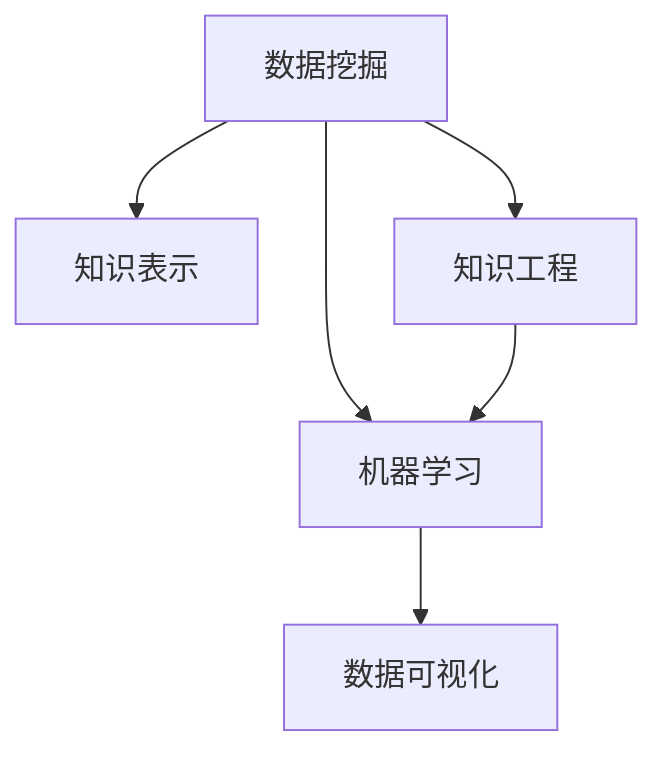

                 

## 1. 背景介绍

### 1.1 问题由来
在信息爆炸的数字化时代，知识的获取、整合、应用成为企业竞争力的关键所在。然而，传统的知识管理方式，如文件存储、人工检索等，已无法满足日益增长的知识需求。因此，知识发现引擎(Knowledge Discovery Engine, KDE)应运而生，通过对海量数据进行智能化处理，揭示其中的隐含知识，为知识创新提供了有力支持。

### 1.2 问题核心关键点
知识发现引擎的核心思想是，利用先进的数据挖掘和机器学习技术，从企业业务系统中挖掘出有价值的知识，为决策提供科学依据。其关键点包括：

1. **数据预处理**：通过清洗、归一化等技术对原始数据进行处理，提取出有价值的特征。
2. **模式发现**：利用机器学习算法在数据中寻找潜在的模式和规律。
3. **知识表示**：将发现的知识表示成易于理解和应用的形式。
4. **知识应用**：将知识应用于业务决策、产品创新、客户服务等多个场景。
5. **持续优化**：随着数据和业务的变化，不断优化知识发现引擎，提升其准确性和鲁棒性。

这些关键点共同构成了知识发现引擎的实施框架，使其能够在复杂业务环境中实现高效的知识抽取和应用。

## 2. 核心概念与联系

### 2.1 核心概念概述

为更好地理解知识发现引擎的工作原理和优化方向，本节将介绍几个密切相关的核心概念：

- **数据挖掘(Data Mining)**：从大量数据中自动发现潜在的有用信息的过程。包括分类、聚类、关联规则挖掘等技术。
- **机器学习(Machine Learning)**：利用数据训练模型，使机器具备学习能力和决策能力的过程。机器学习是知识发现引擎的重要技术基础。
- **知识表示(Knowledge Representation)**：将知识用结构化或半结构化形式表示的过程。常用的知识表示方法包括本体论、图谱等。
- **知识工程(Knowledge Engineering)**：将领域专家知识与计算机技术相结合，构建智能系统。知识工程是知识发现和应用的关键环节。
- **数据可视化(Data Visualization)**：通过图形界面展示知识发现过程和结果，帮助用户理解和应用知识。

这些核心概念之间的逻辑关系可以通过以下Mermaid流程图来展示：



这个流程图展示了一整个知识发现过程，包括数据预处理、模型训练、知识表示、知识工程和知识可视化等关键环节。

## 3. 核心算法原理 & 具体操作步骤
### 3.1 算法原理概述

知识发现引擎的算法原理主要基于数据挖掘和机器学习技术，通过构建数据模型，自动发现和提取知识。其核心步骤包括：

1. **数据预处理**：清洗、归一化、特征选择等技术处理原始数据。
2. **特征提取**：从数据中提取有用的特征，为后续的模型训练做准备。
3. **模型训练**：选择合适的机器学习算法，利用标注数据训练模型。
4. **模式发现**：模型在训练集上进行预测，并根据预测结果调整模型参数。
5. **知识表示**：将发现的知识用结构化或半结构化形式表示出来。
6. **知识应用**：将知识应用于业务决策、产品创新、客户服务等多个场景。

### 3.2 算法步骤详解

以一个典型的知识发现流程为例，具体步骤如下：

1. **数据预处理**：
   - 清洗数据：去除噪声、缺失值、异常值等，确保数据质量。
   - 归一化：对数据进行归一化处理，保证模型输入的一致性。
   - 特征选择：选择最相关的特征，减少数据维度，提高模型性能。

2. **特征提取**：
   - 特征工程：构建特征组合，利用工程技术提取特征。
   - 降维：使用主成分分析(PCA)、因子分析等方法减少数据维度。
   - 编码：将非数值型特征转换为数值型特征，如One-Hot编码。

3. **模型训练**：
   - 选择合适的机器学习算法：如决策树、支持向量机、神经网络等。
   - 划分训练集和测试集：确保模型在未见数据上的泛化能力。
   - 设置训练参数：学习率、迭代次数等超参数的选择。

4. **模式发现**：
   - 训练模型：在训练集上进行模型训练，调整模型参数。
   - 预测：在测试集上进行模型预测，评估模型性能。
   - 优化模型：根据测试集上的表现调整模型参数，避免过拟合。

5. **知识表示**：
   - 构建知识图谱：使用图形数据库或图谱工具表示知识。
   - 关联规则挖掘：发现数据中的关联规则，形成知识规则库。
   - 自然语言处理(NLP)：将知识转换为易于理解的语言形式。

6. **知识应用**：
   - 决策支持：将知识应用于业务决策，辅助决策过程。
   - 产品创新：利用知识指导产品设计和研发。
   - 客户服务：通过智能客服系统应用知识，提升客户满意度。

7. **持续优化**：
   - 收集反馈：收集用户和业务人员的反馈信息。
   - 更新模型：根据反馈信息更新知识模型。
   - 监控性能：实时监控模型性能，确保知识发现引擎的有效性。

### 3.3 算法优缺点

知识发现引擎具有以下优点：
1. 自动化程度高：通过机器学习算法自动化发现和提取知识，减少人工干预。
2. 泛化能力强：机器学习算法可以处理大规模数据，发现隐含的规律和模式。
3. 知识表示丰富：可以将知识表示为图形、表格、文本等多种形式，便于应用。
4. 灵活性好：可以根据业务需求调整算法和参数，适应不同场景。

同时，也存在一些局限性：
1. 数据质量要求高：机器学习算法对数据质量要求高，需要清洗和预处理数据。
2. 解释性不足：机器学习模型的决策过程难以解释，难以进行审计和调试。
3. 模型复杂度高：复杂模型训练时间长，需要强大的计算资源。
4. 数据隐私问题：处理大量敏感数据时，需要保护数据隐私，确保数据安全。

尽管存在这些局限性，但知识发现引擎作为知识管理的重要工具，其自动化、泛化能力和灵活性使其在实际应用中具有重要价值。

### 3.4 算法应用领域

知识发现引擎的应用领域广泛，涵盖了多个行业和场景：

- **金融风控**：通过分析交易数据，发现异常交易模式，辅助风险控制。
- **电商推荐**：根据用户行为数据，发现用户偏好，实现个性化推荐。
- **医疗诊断**：利用医学数据，发现疾病特征，辅助诊断和治疗决策。
- **能源管理**：通过分析能源消耗数据，发现节能潜力，优化能源管理。
- **客户服务**：利用客户数据，发现客户需求，提升客户满意度。

以上仅是知识发现引擎应用的冰山一角，随着大数据和人工智能技术的不断进步，知识发现引擎将在更多领域发挥重要作用，推动业务创新和数据驱动决策。

## 4. 数学模型和公式 & 详细讲解 & 举例说明

### 4.1 数学模型构建

知识发现引擎的数学模型通常基于统计学和机器学习理论，通过构建数据模型，自动发现和提取知识。以下以回归分析为例，说明数学模型的构建过程：

假设原始数据集为 $D=\{(x_i,y_i)\}_{i=1}^N$，其中 $x_i$ 为特征向量，$y_i$ 为标签值。回归分析的数学模型为：

$$
y = \theta_0 + \theta_1 x_1 + \theta_2 x_2 + \cdots + \theta_p x_p
$$

其中 $\theta_0, \theta_1, \ldots, \theta_p$ 为模型参数。

### 4.2 公式推导过程

回归分析的目标是最小化预测值与真实值之间的误差，即均方误差(MSE)最小化：

$$
\min_{\theta} \frac{1}{N} \sum_{i=1}^N (y_i - f(x_i,\theta))^2
$$

其中 $f(x_i,\theta)$ 为回归模型对输入 $x_i$ 的预测值。

通过梯度下降等优化算法，求解上述最优化问题，可得模型参数 $\theta$：

$$
\theta = \mathop{\arg\min}_{\theta} \frac{1}{N} \sum_{i=1}^N (y_i - f(x_i,\theta))^2
$$

在实际应用中，通常使用最小二乘法或梯度下降算法求解上述最优化问题。

### 4.3 案例分析与讲解

以一个电商推荐系统的知识发现为例，说明回归分析的应用：

- **数据预处理**：收集用户浏览历史、购买记录等数据，并进行数据清洗和归一化。
- **特征提取**：提取用户ID、浏览时间、商品类别等特征，构建特征向量。
- **模型训练**：使用回归模型预测用户购买商品的可能性，最小化预测值与实际购买值之间的误差。
- **模式发现**：分析预测结果，发现用户偏好特征，如喜欢购买的价格区间、商品类别等。
- **知识表示**：将发现的知识用规则和图形表示，形成知识库。
- **知识应用**：根据用户行为数据，推荐用户可能感兴趣的商品。

## 5. 项目实践：代码实例和详细解释说明

### 5.1 开发环境搭建

在进行知识发现引擎开发前，我们需要准备好开发环境。以下是使用Python进行Scikit-learn开发的开发环境配置流程：

1. 安装Anaconda：从官网下载并安装Anaconda，用于创建独立的Python环境。

2. 创建并激活虚拟环境：
```bash
conda create -n sklearn-env python=3.8 
conda activate sklearn-env
```

3. 安装Scikit-learn：从官网获取安装命令。例如：
```bash
conda install scikit-learn
```

4. 安装各类工具包：
```bash
pip install numpy pandas scikit-learn matplotlib tqdm jupyter notebook ipython
```

完成上述步骤后，即可在`sklearn-env`环境中开始知识发现引擎的开发。

### 5.2 源代码详细实现

这里我们以线性回归为例，给出使用Scikit-learn库进行知识发现引擎开发的Python代码实现。

```python
from sklearn.linear_model import LinearRegression
from sklearn.datasets import load_boston
from sklearn.model_selection import train_test_split
from sklearn.metrics import mean_squared_error

# 加载数据集
boston = load_boston()

# 分割数据集
X_train, X_test, y_train, y_test = train_test_split(boston.data, boston.target, test_size=0.2, random_state=42)

# 构建线性回归模型
model = LinearRegression()

# 训练模型
model.fit(X_train, y_train)

# 预测
y_pred = model.predict(X_test)

# 评估
mse = mean_squared_error(y_test, y_pred)
print(f"Mean Squared Error: {mse:.3f}")
```

以上代码实现了对波士顿房价数据集进行线性回归预测的过程。通过Scikit-learn的线性回归模型，可以轻松构建知识发现引擎的计算图，实现模型训练和预测。

### 5.3 代码解读与分析

让我们再详细解读一下关键代码的实现细节：

- `load_boston`函数：加载波士顿房价数据集，并返回特征和标签。
- `train_test_split`函数：将数据集分为训练集和测试集，返回分割后的数据。
- `LinearRegression`类：构建线性回归模型，包含训练和预测方法。
- `mean_squared_error`函数：计算预测值与真实值之间的均方误差。

知识发现引擎的核心在于数据预处理和模型训练，Scikit-learn库提供了一系列的机器学习算法和数据预处理工具，使得知识发现引擎的开发变得简洁高效。

## 6. 实际应用场景

### 6.1 智能客服系统

智能客服系统利用知识发现引擎，从历史客服记录中提取知识，形成知识库，指导客服机器人进行问题解答和用户引导。通过实时监测用户反馈，不断更新知识库，提升客服系统的智能化水平。

具体而言，可以收集企业内部的历史客服对话记录，将问题和最佳答复构建成监督数据，在此基础上对知识发现引擎进行训练。训练后的知识库可以实时应用于智能客服系统中，指导机器人理解和响应客户咨询。对于客户提出的新问题，还可以接入检索系统实时搜索相关内容，动态生成回答。如此构建的智能客服系统，能大幅提升客户咨询体验和问题解决效率。

### 6.2 金融风险管理

金融行业面临多种风险，如信用风险、市场风险、操作风险等。利用知识发现引擎，可以从交易数据、财务报表中发现潜在的风险特征，预测信用违约概率，优化投资组合，降低风险损失。

具体而言，可以收集金融机构的交易数据、客户资料、财务报表等数据，构建多维度的特征向量，使用机器学习算法进行训练，形成风险预测模型。模型可以应用于信用评分、违约预警、投资组合优化等多个场景，帮助金融机构科学决策，降低风险损失。

### 6.3 电商个性化推荐

电商平台需要实时推荐用户可能感兴趣的商品，提升用户体验和转化率。利用知识发现引擎，可以从用户行为数据中提取知识，形成个性化推荐模型。

具体而言，可以收集用户浏览历史、购买记录等数据，提取用户ID、浏览时间、商品类别等特征，使用机器学习算法进行训练，形成个性化推荐模型。模型可以应用于商品推荐、活动促销等多个场景，提升电商平台的转化率和用户满意度。

### 6.4 医疗诊断辅助

医疗行业面临多种疾病，如癌症、糖尿病、心血管疾病等。利用知识发现引擎，可以从医疗数据中发现疾病特征，辅助诊断和治疗决策。

具体而言，可以收集患者的病历数据、基因数据、体检数据等，构建多维度的特征向量，使用机器学习算法进行训练，形成疾病预测模型。模型可以应用于疾病诊断、治疗方案优化等多个场景，帮助医生科学决策，提升诊疗效果。

## 7. 工具和资源推荐

### 7.1 学习资源推荐

为了帮助开发者系统掌握知识发现引擎的理论基础和实践技巧，这里推荐一些优质的学习资源：

1. 《Python机器学习》系列书籍：由著名数据科学家撰写，全面介绍了机器学习的基本概念和常用算法。

2. 《深度学习》课程：斯坦福大学开设的深度学习课程，涵盖了神经网络、卷积神经网络、循环神经网络等多个方向。

3. 《Kaggle机器学习竞赛指南》：介绍如何利用Kaggle平台进行机器学习竞赛，快速提升实战能力。

4. Coursera数据科学系列课程：由Coursera平台提供，覆盖了数据预处理、特征工程、模型训练等多个环节。

5. Scikit-learn官方文档：详细介绍了Scikit-learn库的使用方法和常用算法，是知识发现引擎开发的必备资料。

通过对这些资源的学习实践，相信你一定能够快速掌握知识发现引擎的精髓，并用于解决实际的业务问题。

### 7.2 开发工具推荐

高效的开发离不开优秀的工具支持。以下是几款用于知识发现引擎开发的常用工具：

1. Python：流行的编程语言，支持丰富的数据处理和机器学习库，如NumPy、Pandas、Scikit-learn等。

2. R语言：广泛用于统计分析和机器学习，具有丰富的数据处理和图形库。

3. SQL：关系型数据库语言，用于数据管理和查询。

4. Tableau：数据可视化工具，支持多种数据源，提供强大的图表展示功能。

5. Apache Hadoop：分布式计算框架，支持大规模数据的处理和分析。

6. Apache Spark：分布式计算框架，支持大规模数据的处理和机器学习算法。

合理利用这些工具，可以显著提升知识发现引擎的开发效率，加快创新迭代的步伐。

### 7.3 相关论文推荐

知识发现引擎的研究源于学界的持续探索。以下是几篇奠基性的相关论文，推荐阅读：

1. "Association Rules in Large Databases"：提出Apriori算法，发现大规模数据集中的关联规则。

2. "Introduction to Statistical Learning"：介绍统计学习的基本原理和常用算法，是机器学习的经典教材。

3. "Pattern Recognition and Machine Learning"：由机器学习专家撰写，全面介绍了机器学习的基本概念和常用算法。

4. "Data Mining: Concepts and Techniques"：介绍数据挖掘的基本概念和常用算法，涵盖分类、聚类、关联规则等多个方向。

5. "Knowledge Discovery and Data Mining"：由数据挖掘专家撰写，全面介绍了知识发现的理论基础和实际应用。

这些论文代表了大数据和人工智能技术的最新进展，对知识发现引擎的研究具有重要参考价值。

## 8. 总结：未来发展趋势与挑战

### 8.1 研究成果总结

本文对知识发现引擎的工作原理和优化方向进行了全面系统的介绍。首先阐述了知识发现引擎的研究背景和意义，明确了知识发现引擎在数据驱动决策和业务创新中的关键作用。其次，从原理到实践，详细讲解了知识发现引擎的数学模型和操作步骤，给出了知识发现引擎开发的完整代码实例。同时，本文还广泛探讨了知识发现引擎在智能客服、金融风控、电商推荐、医疗诊断等多个行业领域的应用前景，展示了知识发现引擎的巨大潜力。

通过本文的系统梳理，可以看到，知识发现引擎作为数据驱动决策的重要工具，其自动化、泛化能力和灵活性使其在实际应用中具有重要价值。知识发现引擎能够从海量数据中自动发现和提取知识，为业务决策提供科学依据，推动企业智能化转型。

### 8.2 未来发展趋势

展望未来，知识发现引擎将在多个领域继续发展，呈现以下趋势：

1. 自动化程度提升：随着机器学习算法的进步，知识发现引擎的自动化程度将进一步提升，能够更加智能地发现和提取知识。

2. 泛化能力增强：知识发现引擎将能够处理更加复杂和多样的数据，发现更深层次的知识模式和规律。

3. 实时化应用：知识发现引擎将支持实时数据处理，能够即时响应业务需求，提升决策的及时性和准确性。

4. 多模态融合：知识发现引擎将能够处理图像、语音、文本等多种模态的数据，实现多模态信息的整合和知识发现。

5. 端到端流程优化：知识发现引擎将更加注重端到端流程的优化，从数据采集、处理、建模到应用，形成一个完整的知识发现和应用链。

6. 自适应学习能力：知识发现引擎将具备自适应学习能力，能够根据业务需求和数据变化，动态调整模型和算法，提升模型的鲁棒性和灵活性。

以上趋势凸显了知识发现引擎技术的广阔前景，预示着其在企业决策、业务创新和数据管理中的重要地位。

### 8.3 面临的挑战

尽管知识发现引擎已经取得了重要进展，但在实际应用中也面临诸多挑战：

1. 数据质量问题：知识发现引擎对数据质量要求高，需要确保数据的完整性、准确性和一致性。

2. 模型复杂性：知识发现引擎的模型通常较为复杂，需要高效的算法和计算资源支持。

3. 知识解释性：知识发现引擎的决策过程难以解释，难以进行审计和调试。

4. 数据隐私问题：处理敏感数据时，需要保护数据隐私，确保数据安全。

5. 数据多样性：知识发现引擎需要处理多种类型的数据，包括结构化、非结构化等多种形式的数据。

6. 资源限制：知识发现引擎的处理数据规模大，需要强大的计算资源支持。

这些挑战需要在未来进一步探索和解决，才能推动知识发现引擎技术的广泛应用。

### 8.4 研究展望

面向未来，知识发现引擎的研究方向包括：

1. 自适应学习：开发自适应算法，使知识发现引擎能够动态调整模型和参数，提升模型的适应性和鲁棒性。

2. 多模态融合：探索多模态数据的融合方法，提高知识发现引擎对多种数据形式的理解和整合能力。

3. 知识图谱：构建知识图谱，利用图形数据库表示知识，提升知识发现的准确性和可视化效果。

4. 实时化应用：实现知识发现引擎的实时化处理，支持实时数据流和业务决策。

5. 自动化流程：构建自动化的知识发现流程，提升知识发现的效率和精度。

6. 端到端优化：优化知识发现引擎的端到端流程，从数据采集、处理、建模到应用，形成一个完整的知识发现和应用链。

这些研究方向将推动知识发现引擎技术的不断进步，推动企业在数据驱动决策和业务创新中取得更大的突破。

## 9. 附录：常见问题与解答

**Q1：知识发现引擎是否适用于所有业务场景？**

A: 知识发现引擎在大多数业务场景中都能发挥重要作用，特别是在数据量大、业务复杂的情况下。但对于一些特定领域，如生物医药、物理化学等，需要结合领域知识和专业知识，才能更好地发现和提取知识。

**Q2：知识发现引擎的自动化程度如何？**

A: 知识发现引擎具有较高的自动化程度，能够自动发现和提取知识，减少人工干预。但自动化程度受限于数据质量和模型复杂性，需要根据具体场景进行调整和优化。

**Q3：知识发现引擎的决策过程是否可解释？**

A: 知识发现引擎的决策过程通常难以解释，但通过改进算法和模型，如可解释性机器学习，可以增强模型的可解释性和透明性。

**Q4：知识发现引擎的计算资源要求高吗？**

A: 知识发现引擎的计算资源要求较高，尤其是处理大规模数据时。需要根据数据量和业务需求选择合适的硬件和软件资源。

**Q5：知识发现引擎的安全性如何保障？**

A: 知识发现引擎需要确保数据隐私和安全，可以通过加密、脱敏、访问控制等措施，保障数据安全。同时，需要对知识发现过程进行审计和监控，确保决策过程的透明和可控。

通过对这些问题的解答，相信你能够更好地理解知识发现引擎的应用场景和实现细节，在实际应用中发挥其最大潜力。

---

作者：禅与计算机程序设计艺术 / Zen and the Art of Computer Programming

