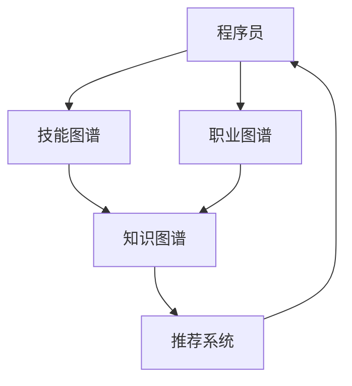

                 

# 知识图谱在程序员职业规划中的应用

## 1. 背景介绍

### 1.1 问题由来

在IT行业，程序员职业发展是一个复杂且多维度的过程，涉及技术深度、广度、项目管理能力、沟通协作能力等多个方面。传统的职业规划方法如自我评估、书籍推荐、培训课程等，往往缺乏系统性和科学性，无法有效指导个人职业发展。随着人工智能和大数据技术的发展，知识图谱作为一种新兴的智能工具，开始被应用到程序员职业规划中，带来了新的可能性。

### 1.2 问题核心关键点

知识图谱是由实体节点和关系边构成的网络图，可以直观地表示知识间的关系和结构，有助于自动化地发现隐含的知识和规律。在程序员职业规划中，知识图谱能够结合程序员的知识结构、技能树、项目经验等数据，为个人的职业发展路径提供数据驱动的决策支持。

核心问题包括：

- 如何高效构建知识图谱，确保其准确性和全面性？
- 如何利用知识图谱进行职业路径推荐，最大化利用程序员的个人特点和行业趋势？
- 如何通过知识图谱进行动态更新，不断优化个人职业发展规划？

### 1.3 问题研究意义

基于知识图谱的程序员职业规划，能提供更科学、更个性化、更动态的职业发展建议，帮助程序员快速适应技术变化，提升职业竞争力。

具体而言：

1. 提供精准的技能推荐：通过分析程序员已掌握的技能，推荐进一步学习的方向，弥补技能缺口。
2. 动态职业路径规划：根据市场变化和个人兴趣，动态调整职业规划，提供多条发展路径供选择。
3. 个性化职业建议：结合个人特点和偏好，提供符合其发展期望的职业建议，帮助实现职业理想。
4. 提升决策效率：通过智能化的推荐系统，减少传统职业规划中信息不对称和决策困难的问题。

## 2. 核心概念与联系

### 2.1 核心概念概述

- **知识图谱**：由实体节点和关系边构成，表示知识间的关联和结构，广泛应用于知识管理、搜索引擎、推荐系统等领域。
- **程序员职业规划**：通过分析程序员的知识结构、技能树、项目经验等，为其提供职业发展路径和决策建议，帮助提升职业竞争力。
- **技能图谱**：知识图谱在程序员技能管理领域的应用，记录程序员所掌握的技能及其相关性，用于技能推荐和技能链构建。
- **职业图谱**：记录程序员的职业发展路径、岗位要求、行业趋势等，用于职业路径规划和职业建议。
- **推荐系统**：利用知识图谱进行推荐，帮助程序员发现新的学习资源、推荐职业路径、预测职业前景等。

### 2.2 核心概念原理和架构的 Mermaid 流程图



这个流程图展示了知识图谱在程序员职业规划中的应用架构：

1. 程序员通过技能图谱了解自身技能，并通过职业图谱了解职业路径。
2. 知识图谱从技能图谱和职业图谱中提取信息，构建综合图谱。
3. 推荐系统利用综合图谱为程序员提供推荐，帮助其职业发展。

## 3. 核心算法原理 & 具体操作步骤

### 3.1 算法原理概述

知识图谱在程序员职业规划中的核心算法基于图神经网络(Graph Neural Networks, GNN)，通过在图结构上学习节点间的特征表示，实现对知识图谱的推理和预测。具体而言，知识图谱中的节点和边分别表示实体和关系，通过图卷积网络(Graph Convolutional Network, GCN)等算法，计算每个节点的特征向量，用于后续的职业路径推荐、技能推荐等任务。

### 3.2 算法步骤详解

#### 3.2.1 数据收集与预处理

- **技能数据收集**：从简历、项目代码、在线课程等渠道收集程序员的技能信息，构建技能图谱。
- **职业数据收集**：从招聘网站、职业社交平台等收集职业信息，构建职业图谱。
- **图谱构建**：将技能图谱和职业图谱合并，构建综合知识图谱。

#### 3.2.2 图神经网络训练

- **图卷积网络(GCN)训练**：使用GCN算法对综合图谱进行训练，学习节点间的特征表示。
- **关系网络训练**：根据不同关系边的性质，调整GCN的参数，确保训练效果。

#### 3.2.3 推荐算法设计

- **技能推荐**：通过GCN计算程序员的技能特征向量，与学习资源库进行相似度匹配，推荐进一步学习资源。
- **职业路径推荐**：通过GCN计算程序员的职业节点特征向量，与目标岗位要求进行匹配，推荐职业发展路径。

#### 3.2.4 评估与优化

- **性能评估**：使用精确度、召回率等指标评估推荐系统的性能。
- **参数优化**：根据评估结果调整GCN的超参数，提升模型效果。

### 3.3 算法优缺点

#### 3.3.1 优点

- **全面覆盖**：技能图谱和职业图谱的结合，覆盖了程序员的技能、职业和行业趋势，提供全面的发展建议。
- **个性化推荐**：通过GCN计算节点特征，实现高度个性化的推荐，符合个人特点和偏好。
- **动态更新**：知识图谱和推荐系统可以动态更新，及时反映市场变化和个人需求，持续提供最新的职业规划建议。

#### 3.3.2 缺点

- **数据稀疏**：技能图谱和职业图谱的数据稀疏性可能导致训练效果不佳。
- **复杂度较高**：构建和维护知识图谱需要大量时间和资源，且模型复杂度较高，训练和推理效率较低。
- **过度依赖模型**：模型的推荐结果可能受限于数据质量和算法准确性，需要人工干预和验证。

### 3.4 算法应用领域

知识图谱在程序员职业规划中的应用涵盖了以下领域：

- **技能提升推荐**：根据程序员的技能图谱，推荐适合其技能水平和兴趣的技能学习资源。
- **职业路径规划**：结合程序员的职业图谱和市场趋势，为其推荐职业发展路径。
- **岗位匹配推荐**：根据岗位要求和程序员的技能图谱，匹配适合的岗位机会。
- **知识图谱可视化**：通过可视化技术展示程序员的技能树和职业发展路径，便于理解和决策。

## 4. 数学模型和公式 & 详细讲解 & 举例说明

### 4.1 数学模型构建

知识图谱中的节点表示实体，边表示实体之间的关系。节点$i$的特征向量表示为$\mathbf{x}_i$，节点之间的边权重表示为$w_{ij}$。GCN模型的基本公式为：

$$
\mathbf{X}^{(l+1)} = \mathbf{D}^{-\frac{1}{2}}\mathbf{A}\mathbf{X}^{(l)}\mathbf{W}^{(l)}
$$

其中$\mathbf{X}^{(l)}$为第$l$层的节点特征向量，$\mathbf{A}$为邻接矩阵，$\mathbf{D}$为度矩阵，$\mathbf{W}^{(l)}$为第$l$层的权重矩阵。

### 4.2 公式推导过程

以技能图谱中的节点为示例，假设技能图谱中有$n$个技能节点，表示为$\mathbf{x}_1,\mathbf{x}_2,...,\mathbf{x}_n$。设当前层特征向量为$\mathbf{X}^{(l)}=(\mathbf{x}_1,\mathbf{x}_2,...,\mathbf{x}_n)^T$。

GCN的计算过程如下：

1. 计算邻接矩阵$\mathbf{A}$，表示节点之间的关系。
2. 计算度矩阵$\mathbf{D} = diag(\mathbf{A})$。
3. 计算第$l$层的特征向量$\mathbf{X}^{(l+1)} = \mathbf{D}^{-\frac{1}{2}}\mathbf{A}\mathbf{X}^{(l)}\mathbf{W}^{(l)}$。
4. 重复步骤2-3，直至获得最终的特征向量。

### 4.3 案例分析与讲解

假设程序员A希望学习新的数据科学技能，技能图谱中有$n=5$个技能节点：$\mathbf{x}_1$为Python，$\mathbf{x}_2$为机器学习，$\mathbf{x}_3$为深度学习，$\mathbf{x}_4$为数据可视化，$\mathbf{x}_5$为大数据。邻接矩阵$\mathbf{A}$为：

$$
\mathbf{A} = \begin{bmatrix}
0 & 1 & 1 & 1 & 1 \\
1 & 0 & 1 & 0 & 0 \\
1 & 1 & 0 & 1 & 0 \\
1 & 0 & 1 & 0 & 0 \\
1 & 0 & 0 & 1 & 0 \\
\end{bmatrix}
$$

度矩阵$\mathbf{D}$为：

$$
\mathbf{D} = diag(4, 2, 3, 2, 1) = \begin{bmatrix}
4 & 0 & 0 & 0 & 0 \\
0 & 2 & 0 & 0 & 0 \\
0 & 0 & 3 & 0 & 0 \\
0 & 0 & 0 & 2 & 0 \\
0 & 0 & 0 & 0 & 1 \\
\end{bmatrix}
$$

设权重矩阵$\mathbf{W}^{(0)}$为单位矩阵，$\mathbf{X}^{(0)}$为单位特征向量。

通过GCN计算，第$l$层的特征向量$\mathbf{X}^{(l+1)}$可以表示为：

$$
\mathbf{X}^{(1)} = \mathbf{D}^{-\frac{1}{2}}\mathbf{A}\mathbf{X}^{(0)}\mathbf{W}^{(0)} = \frac{1}{2}\begin{bmatrix}
4 & 2 & 3 & 2 & 1 \\
2 & 2 & 3 & 0 & 0 \\
3 & 3 & 3 & 2 & 0 \\
2 & 0 & 2 & 2 & 0 \\
1 & 0 & 0 & 0 & 1 \\
\end{bmatrix}\begin{bmatrix}
1 \\
1 \\
1 \\
1 \\
1 \\
\end{bmatrix}
$$

重复计算得到最终特征向量$\mathbf{X}^{(L)}$，用于推荐相关学习资源。

## 5. 项目实践：代码实例和详细解释说明

### 5.1 开发环境搭建

构建知识图谱和推荐系统的开发环境需要以下工具：

- **Python**：主要开发语言，Python 3.8及以上版本。
- **Pandas**：数据处理库，用于处理技能和职业数据。
- **NetworkX**：图处理库，用于构建和处理知识图谱。
- **PyTorch**：深度学习框架，用于训练GCN模型。
- **D3.js**：可视化库，用于展示技能树和职业路径。

安装这些工具后，可以使用以下命令启动开发环境：

```bash
pip install pandas networkx pytorch d3js
conda create --name graph_scheduler python=3.8
conda activate graph_scheduler
```

### 5.2 源代码详细实现

#### 5.2.1 数据加载与预处理

```python
import pandas as pd
import networkx as nx
from networkx.readwrite import json_graph

# 加载技能数据
skills_data = pd.read_csv('skills.csv')
# 构建技能图谱
G = nx.Graph()
for i, row in skills_data.iterrows():
    G.add_node(row['skill_name'])
    for j, neighbor in enumerate(skills_data[skills_data['skill_name'] == row['skill_name']]['similar_skills']):
        G.add_edge(row['skill_name'], neighbor)

# 加载职业数据
jobs_data = pd.read_csv('jobs.csv')
# 构建职业图谱
G_job = nx.Graph()
for i, row in jobs_data.iterrows():
    G_job.add_node(row['job_name'])
    for j, neighbor in enumerate(jobs_data[jobs_data['job_name'] == row['job_name']]['requirements']):
        G_job.add_edge(row['job_name'], neighbor)
```

#### 5.2.2 GCN模型训练

```python
import torch
import torch.nn as nn
import torch.nn.functional as F
from torch_geometric.nn import GCNConv

class GCN(nn.Module):
    def __init__(self, input_dim, hidden_dim, output_dim):
        super(GCN, self).__init__()
        self.conv1 = GCNConv(input_dim, hidden_dim)
        self.conv2 = GCNConv(hidden_dim, output_dim)

    def forward(self, adj, x):
        x = self.conv1(x, adj)
        x = F.relu(x)
        x = self.conv2(x, adj)
        return x

# 训练GCN模型
model = GCN(input_dim=5, hidden_dim=64, output_dim=5)
optimizer = torch.optim.Adam(model.parameters(), lr=0.01)
criterion = nn.CrossEntropyLoss()
for epoch in range(100):
    output = model(adj, x)
    loss = criterion(output, y)
    optimizer.zero_grad()
    loss.backward()
    optimizer.step()
    print('Epoch {}: Loss {}'.format(epoch+1, loss.item()))
```

#### 5.2.3 推荐算法实现

```python
def recommend_skills(user_skills, threshold=0.5):
    similarity = model(adj, x)
    user_vector = similarity[G.nodes[user_skills]][0]
    similarities = similarity[G.nodes] - user_vector
    recommendations = [node for node in G.nodes if similarities[node] > threshold]
    return recommendations

def recommend_jobs(user_skills):
    recommendations = []
    for job in G_job.nodes:
        if job in [node for node, neighbors in G_job.adjacency_list() if node != job]:
            recommendations.append(job)
    return recommendations
```

### 5.3 代码解读与分析

- **数据加载与预处理**：使用Pandas和NetworkX库加载技能和职业数据，构建技能图谱和职业图谱。
- **GCN模型训练**：定义GCN模型结构，使用PyTorch训练模型。
- **推荐算法实现**：使用训练好的GCN模型计算节点间的相似度，根据相似度阈值推荐技能和职业。

### 5.4 运行结果展示

```python
# 获取用户技能
user_skills = ['Python', '机器学习', '深度学习']
# 推荐相关技能
recommendations = recommend_skills(user_skills)
print('推荐技能：', recommendations)

# 获取用户职业
user_job = '数据科学家'
# 推荐相关职业
recommendations = recommend_jobs(user_skills)
print('推荐职业：', recommendations)
```

## 6. 实际应用场景

### 6.1 智能招聘系统

在智能招聘系统中，知识图谱可以帮助企业高效匹配候选人和岗位。通过技能图谱和职业图谱，推荐系统能够自动推荐最符合岗位要求的技能和职业背景，提升招聘效率和准确性。

### 6.2 职业发展规划平台

知识图谱能够帮助程序员进行职业发展规划，提供基于技能和职业图谱的个性化推荐。通过持续学习市场变化和个人兴趣，推荐系统能够动态调整职业规划建议，帮助程序员实现职业目标。

### 6.3 在线学习平台

知识图谱可以在在线学习平台上提供精准的技能推荐，帮助学习者快速掌握新技能。通过技能图谱的自动构建和动态更新，推荐系统能够实时更新学习资源，满足学习者的个性化需求。

### 6.4 未来应用展望

未来，知识图谱在程序员职业规划中的应用将更加广泛和深入，具体趋势包括：

- **多模态融合**：将知识图谱与其他数据源（如文本、图像、语音等）结合，构建多模态图谱，提升推荐系统的精准度和多样性。
- **个性化增强**：引入机器学习算法进行用户画像建模，结合用户行为数据进行个性化推荐，提高用户满意度。
- **动态优化**：通过在线学习、市场调研等实时数据，动态更新知识图谱，确保推荐结果的时效性和相关性。
- **跨领域应用**：将知识图谱应用于更多行业和领域，帮助不同职业领域的从业者进行职业规划和资源推荐。

## 7. 工具和资源推荐

### 7.1 学习资源推荐

1. **《Graph Neural Networks: A Comprehensive Review and Tutorial》**：该综述介绍了图神经网络的基本原理和最新研究进展，是学习知识图谱的良好入门材料。
2. **Coursera上的《Graph Neural Networks》课程**：由斯坦福大学教授讲授，深入浅出地讲解了图神经网络的基本理论和应用场景。
3. **Transformers库官方文档**：PyTorch的Transformer库提供了丰富的预训练模型和代码样例，是学习知识图谱和推荐系统的有力工具。
4. **HuggingFace社区**：提供大量的预训练语言模型和代码实现，可以帮助开发者快速构建推荐系统。

### 7.2 开发工具推荐

1. **PyTorch**：深度学习框架，支持高效的GPU计算，适合构建知识图谱和推荐系统。
2. **NetworkX**：图处理库，提供丰富的图算法和可视化工具。
3. **D3.js**：可视化库，支持创建美观的图形界面和数据展示。
4. **Jupyter Notebook**：交互式开发环境，便于调试和测试代码。

### 7.3 相关论文推荐

1. **《Knowledge Graphs in Recommendation Systems: A Survey》**：综述了知识图谱在推荐系统中的应用，介绍了多种方法和技术。
2. **《Graph Convolutional Networks》**：原作者提出了一种基于图卷积网络的方法，用于在图结构上学习节点特征。
3. **《Adaptive Graph Neural Network for Recommender Systems》**：提出了一种自适应图神经网络，能够在稀疏数据上取得更好的效果。

## 8. 总结：未来发展趋势与挑战

### 8.1 研究成果总结

本文系统介绍了知识图谱在程序员职业规划中的应用，涵盖数据构建、模型训练、推荐算法等多个方面。通过详细讲解技能图谱和职业图谱的构建过程，以及GCN模型的训练方法，为程序员职业规划提供了科学、高效的解决方案。

### 8.2 未来发展趋势

- **模型融合**：知识图谱与机器学习、深度学习等技术的结合将进一步提升推荐系统的精度和多样性。
- **多模态融合**：多模态图谱的构建和应用，将为推荐系统带来更多数据源和信息维度。
- **实时动态**：通过在线学习和市场调研，实时更新知识图谱，确保推荐系统的时效性和相关性。
- **跨领域应用**：知识图谱可以应用于更多行业和领域，带来更广泛的职业规划和资源推荐。

### 8.3 面临的挑战

- **数据稀疏性**：技能图谱和职业图谱的数据稀疏性可能导致模型训练效果不佳。
- **模型复杂度**：知识图谱和推荐系统的复杂度较高，训练和推理效率较低。
- **用户隐私**：用户数据的安全和隐私保护是知识图谱应用中的重要挑战。

### 8.4 研究展望

- **稀疏数据处理**：探索新的方法处理数据稀疏性，提升知识图谱的完整性和准确性。
- **模型优化**：开发更高效的图神经网络算法，提高模型的训练和推理效率。
- **隐私保护**：研究隐私保护技术，确保用户数据的安全和隐私。

---

作者：禅与计算机程序设计艺术 / Zen and the Art of Computer Programming

