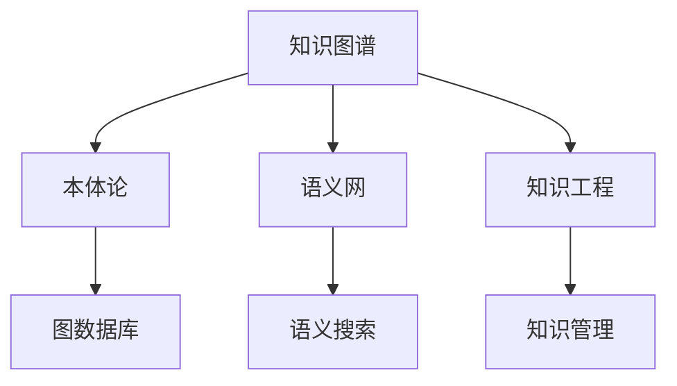

                 

# 知识图谱：绘制人类知识的蓝图

> 关键词：知识图谱,语义网,本体论,图数据库,语义搜索,知识工程,知识管理

## 1. 背景介绍

### 1.1 问题由来
随着互联网和数字技术的飞速发展，人类社会积累了海量的数据。然而，这些数据往往以孤立、碎片化的形式存在，难以直接用于驱动智能决策和知识发现。如何对这些数据进行整合、关联和抽取，形成结构化、语义化的知识表示，成为了当前数据科学与人工智能领域的核心挑战之一。

知识图谱（Knowledge Graph）正是解决这一问题的重要工具。通过构建一个覆盖广泛领域的知识网络，知识图谱能够实现对现实世界中复杂实体与关系的精确刻画，为各种智能应用提供坚实的数据基础。

### 1.2 问题核心关键点
知识图谱的核心在于如何将知识以图形化的方式组织，即如何将实体、属性和关系映射为节点和边，形成一个语义化的网络结构。这个过程中，需要考虑以下几个关键问题：

- **本体构建**：定义知识图谱中的实体类别、属性以及实体之间的关系，构建知识本体。
- **数据抽取**：从文本、图像、语音等多种数据源中，提取出结构化的实体和关系，填充到知识图谱中。
- **图数据库**：选择合适的图数据库系统，高效存储和查询图结构化数据。
- **语义搜索**：实现高效的语义查询和推理，支持基于实体、属性和关系的复杂查询。
- **模型训练**：训练图神经网络模型，提取知识图谱的隐含特征，支持更精准的查询和推荐。
- **可视化**：对知识图谱进行可视化展示，帮助用户直观理解知识结构。

这些核心问题相互关联，共同构成了知识图谱的技术框架，使其能够有效地支撑人工智能、自然语言处理、机器学习等领域的应用。

### 1.3 问题研究意义
构建知识图谱对于推动人类知识的智能化管理具有重要意义：

1. **知识整合与重用**：将碎片化、孤立的知识整合成一个统一的、结构化的网络，方便知识的提取、重用和创新。
2. **智能应用支持**：为各种智能应用提供语义化的知识基础，提升机器理解和推理能力。
3. **数据驱动决策**：基于结构化的知识，驱动更加科学、精确的决策支持系统，提升企业竞争力和决策水平。
4. **知识工程自动化**：自动化知识获取、组织和管理，降低人力成本，加速知识工程的落地应用。
5. **促进跨领域研究**：知识图谱的构建和应用需要多学科的交叉合作，推动跨领域研究的深入开展。

## 2. 核心概念与联系

### 2.1 核心概念概述

为了深入理解知识图谱的原理与架构，本节将介绍几个关键核心概念：

- **知识图谱**：由实体、属性和关系组成的图形结构，表示现实世界中的知识。
- **语义网**：使用Web技术实现的知识表示和检索，强调知识的语义理解和关联。
- **本体论**：定义知识本体的基本概念、属性、关系，构建知识表示的框架。
- **图数据库**：专门用于存储和查询图结构化数据的数据库系统，支持高效的图遍历和查询。
- **语义搜索**：基于实体、属性和关系的查询，提供精准的语义匹配和关联。
- **知识工程**：构建知识库、知识模型和知识管理系统，实现知识的自动获取和组织。
- **知识管理**：对知识进行收集、整理、存储、维护和应用，促进知识的传播和利用。

这些核心概念通过一定的逻辑关系，共同构成知识图谱的构建和应用框架。

### 2.2 核心概念原理和架构的 Mermaid 流程图



这个流程图展示了知识图谱构建和应用的主要环节：

1. 知识图谱通过本体论定义了基本的概念和关系，为图谱的构建提供了基础框架。
2. 语义网利用Web技术，实现了知识的语义化和关联，为知识的检索和应用提供了便利。
3. 图数据库专门存储和查询图结构化数据，是知识图谱的底层数据存储和处理工具。
4. 语义搜索通过精确的语义匹配和关联，实现了知识图谱的智能检索和查询。
5. 知识工程构建和管理知识库，是知识图谱的顶层设计和管理。
6. 知识管理涉及知识的收集、整理、存储和应用，是知识图谱的重要应用方向。

这些概念和环节相互支撑，共同构成了知识图谱的技术框架和应用场景。

## 3. 核心算法原理 & 具体操作步骤

### 3.1 算法原理概述

知识图谱的构建和应用，本质上是通过一系列算法将非结构化数据转换为结构化的图结构。这一过程包括以下几个关键步骤：

- **数据采集**：从文本、图像、音频等多种数据源中，抽取结构化的实体和关系。
- **实体识别与关系抽取**：识别和标注文本中的实体和它们之间的关系。
- **知识融合与推理**：将不同来源的知识进行融合，并使用推理机制进行知识扩展和修正。
- **图数据库存储与查询**：将知识图谱存储在图数据库中，并使用高效的查询算法进行检索和推理。
- **图神经网络训练**：使用图神经网络模型，从知识图谱中提取隐含的特征，支持更加精准的查询和推荐。

### 3.2 算法步骤详解

下面是知识图谱构建和应用的详细步骤：

**Step 1: 定义本体论**

1. **实体类型定义**：定义知识图谱中涉及的实体类型，如人物、地点、组织、事件等。
2. **属性定义**：定义实体和关系的具体属性，如人物的名字、地点的位置、事件的时间等。
3. **关系定义**：定义实体之间的关联关系，如人物与事件的关系、地点与事件的关系等。

**Step 2: 数据采集与预处理**

1. **数据源选择**：根据领域特点，选择合适的数据源，如Web数据、百科全书、数据库等。
2. **数据抽取**：使用自然语言处理技术，从文本数据中抽取实体和关系。
3. **数据清洗**：去除噪音数据，处理数据中的重复、缺失和错误信息。

**Step 3: 知识融合与推理**

1. **知识融合**：将从不同数据源抽取的知识进行融合，构建统一的实体和关系。
2. **知识推理**：使用推理算法，对知识图谱进行扩展和修正，增加新的知识和关系。

**Step 4: 图数据库存储与查询**

1. **选择图数据库**：选择合适的图数据库系统，如Neo4j、OrientDB等。
2. **图存储与构建**：将知识图谱存储在图数据库中，构建图结构。
3. **图查询与检索**：使用图数据库提供的查询语言，进行高效的图结构查询。

**Step 5: 图神经网络训练**

1. **选择图神经网络**：选择合适的图神经网络模型，如GCN、GAT等。
2. **数据准备**：准备训练数据，包括实体和关系。
3. **模型训练**：使用图神经网络模型，从知识图谱中提取隐含的特征。
4. **模型评估**：使用测试数据评估模型的性能，调整超参数优化模型。

### 3.3 算法优缺点

知识图谱构建和应用的技术，具有以下优点：

1. **语义化表示**：将知识以图形化的方式组织，支持更精准的查询和推理。
2. **跨领域关联**：知识图谱支持跨领域的知识关联，提升知识的综合利用能力。
3. **可扩展性**：知识图谱可以随着新知识的加入进行动态扩展，保持知识的时效性。
4. **高效查询**：图数据库和图神经网络提供高效的查询和推理机制，支持快速的数据获取和处理。

同时，知识图谱技术也存在以下缺点：

1. **数据获取难度大**：需要大量标注数据和专业知识，构建高质量的知识图谱。
2. **复杂性高**：知识图谱构建和维护过程复杂，需要多学科的协同合作。
3. **计算资源需求高**：图神经网络训练和推理需要大量的计算资源，包括GPU/TPU等高性能设备。
4. **模型解释性差**：知识图谱模型往往被认为是"黑盒"系统，难以解释其内部的决策过程。
5. **隐私与安全问题**：知识图谱中包含大量敏感信息，如何保护数据隐私和安全是一个重要问题。

尽管存在这些局限性，知识图谱仍是大数据时代知识管理的重要工具，具有广泛的应用前景。

### 3.4 算法应用领域

知识图谱技术在多个领域得到了广泛应用，以下是几个典型的应用场景：

- **医疗领域**：构建医疗知识图谱，支持疾病诊断、治疗方案推荐等智能医疗应用。
- **金融领域**：构建金融知识图谱，支持风险评估、欺诈检测、投资建议等金融智能应用。
- **教育领域**：构建教育知识图谱，支持个性化学习、课程推荐、教育数据分析等智能教育应用。
- **交通领域**：构建交通知识图谱，支持交通流量预测、路线规划、事故预警等智能交通应用。
- **社交网络**：构建社交网络知识图谱，支持社交关系分析、好友推荐、信息过滤等社交智能应用。
- **电子商务**：构建电子商务知识图谱，支持商品推荐、用户画像、市场分析等电商智能应用。

这些应用场景展示了知识图谱技术的强大潜力，为各行各业带来了智能化管理的革命性变革。

## 4. 数学模型和公式 & 详细讲解

### 4.1 数学模型构建

知识图谱的构建和应用涉及大量的数学模型和算法。以下是一个基本的知识图谱构建数学模型：

**知识图谱表示**：

- 实体（Entity）：表示知识图谱中的节点，如人名、地名、组织名等。
- 属性（Property）：表示实体的特征或关系，如人名对应的性别、地名对应的位置等。
- 关系（Relation）：表示实体之间的连接，如人名与职业的关系、地名与国家的关系等。

**图结构表示**：

- 节点（Node）：表示实体，用三元组（实体、属性、值）表示。
- 边（Edge）：表示关系，连接具有相同属性的节点。

**数学模型构建**：

- **节点表示**：使用向量表示实体，用 $ \mathbf{v}_i $ 表示节点 $ i $ 的向量表示。
- **边表示**：使用矩阵表示关系，用 $ A $ 表示边矩阵，其中 $ A_{i,j} $ 表示节点 $ i $ 和节点 $ j $ 之间的关系。
- **损失函数**：使用目标函数衡量模型与真实数据的一致性，如均方误差、交叉熵等。

### 4.2 公式推导过程

以下是一个简单的知识图谱构建过程的公式推导：

1. **节点表示**：

   - 假设有一个包含 $ N $ 个节点的图，用 $ \mathbf{v}_i $ 表示节点 $ i $ 的向量。
   - 节点的表示可以用 $ \mathbf{v}_i = [v_{i,1}, v_{i,2}, ..., v_{i,d}] $ 表示，其中 $ d $ 是向量的维度。

2. **边表示**：

   - 假设边矩阵 $ A $ 表示节点之间的关系，$ A_{i,j} $ 表示节点 $ i $ 和节点 $ j $ 之间的关系。
   - 边矩阵 $ A $ 可以用邻接矩阵或边列表表示。

3. **损失函数**：

   - 假设目标函数为均方误差（MSE），用 $ L $ 表示损失函数。
   - 损失函数可以表示为：$ L = \frac{1}{2N}\sum_{i=1}^{N}\|\mathbf{v}_i - \mathbf{v}_i^* \|^2 $，其中 $ \mathbf{v}_i^* $ 是节点 $ i $ 的真实向量表示。

4. **优化算法**：

   - 使用随机梯度下降（SGD）优化算法，更新节点和边的参数。
   - 优化算法可以表示为：$ \mathbf{v}_i \leftarrow \mathbf{v}_i - \eta \nabla_{\mathbf{v}_i} L $，其中 $ \eta $ 是学习率。

### 4.3 案例分析与讲解

以医疗领域为例，分析知识图谱的应用：

**数据采集**：

- 从医院病历、临床试验数据、医学文献等数据源中，抽取结构化的实体和关系。
- 实体包括人名、疾病名、治疗方案等，关系包括病情诊断、治疗效果、药物副作用等。

**知识融合与推理**：

- 使用知识推理算法，如规则推理、贝叶斯网络等，对知识图谱进行扩展和修正。
- 例如，根据临床试验数据，添加新的治疗方案和药物副作用信息。

**图数据库存储与查询**：

- 将知识图谱存储在图数据库中，如Neo4j、ArangoDB等。
- 使用Cypher查询语言，进行高效的图结构查询，如：

  ```
  MATCH (p:Person)-[:TREATMENT]->(t:Treatment)
  WHERE p.name = '张三' AND t.name = '阿奇霉素'
  RETURN t.name
  ```

**图神经网络训练**：

- 使用图神经网络模型，如GCN、GAT等，从知识图谱中提取隐含的特征。
- 例如，使用GCN模型，训练医疗知识图谱的节点表示和关系表示，预测疾病诊断和治疗效果。

## 5. 项目实践：代码实例和详细解释说明

### 5.1 开发环境搭建

在进行知识图谱项目开发前，需要先搭建开发环境。以下是使用Python进行PyTorch开发的环境配置流程：

1. 安装Anaconda：从官网下载并安装Anaconda，用于创建独立的Python环境。

2. 创建并激活虚拟环境：
```bash
conda create -n pytorch-env python=3.8 
conda activate pytorch-env
```

3. 安装PyTorch：根据CUDA版本，从官网获取对应的安装命令。例如：
```bash
conda install pytorch torchvision torchaudio cudatoolkit=11.1 -c pytorch -c conda-forge
```

4. 安装Graph Neural Network库：
```bash
pip install pyg nnpyi networkx pydot
```

5. 安装各类工具包：
```bash
pip install numpy pandas scikit-learn matplotlib tqdm jupyter notebook ipython
```

完成上述步骤后，即可在`pytorch-env`环境中开始知识图谱开发实践。

### 5.2 源代码详细实现

下面我们以医疗知识图谱为例，给出使用PyTorch和PyG库进行知识图谱构建和训练的PyTorch代码实现。

首先，定义知识图谱的节点和边：

```python
from pyg import graph

class GraphDataset(Dataset):
    def __init__(self, graph):
        self.graph = graph
        
    def __len__(self):
        return len(self.graph.nodes())
    
    def __getitem__(self, idx):
        node = self.graph.nodes[idx]
        edges = self.graph.edges(node)
        return {'node': node, 'edges': edges}

# 定义医疗知识图谱
graph = graph.Graph()
graph.add_node('张三', {'name': '张三', 'age': 30})
graph.add_node('阿奇霉素', {'name': '阿奇霉素', 'side_effects': ['头痛', '恶心']})
graph.add_edge('张三', 'TREATMENT', '阿奇霉素')
graph.add_edge('阿奇霉素', 'CONDITION', '感染')
```

然后，定义知识图谱的损失函数和优化器：

```python
from torch.nn import BCELoss, CrossEntropyLoss
from torch.optim import Adam

# 定义损失函数
loss = CrossEntropyLoss()

# 定义优化器
optimizer = Adam(model.parameters(), lr=0.01)
```

接着，定义训练和评估函数：

```python
from torch.utils.data import DataLoader
from tqdm import tqdm

device = torch.device('cuda') if torch.cuda.is_available() else torch.device('cpu')
model.to(device)

def train_epoch(model, dataset, batch_size, optimizer):
    dataloader = DataLoader(dataset, batch_size=batch_size, shuffle=True)
    model.train()
    epoch_loss = 0
    for batch in tqdm(dataloader, desc='Training'):
        node = batch['node']
        edges = batch['edges']
        model.zero_grad()
        outputs = model(node, edges)
        loss = loss(outputs, node['age'])
        epoch_loss += loss.item()
        loss.backward()
        optimizer.step()
    return epoch_loss / len(dataloader)

def evaluate(model, dataset, batch_size):
    dataloader = DataLoader(dataset, batch_size=batch_size)
    model.eval()
    preds, labels = [], []
    with torch.no_grad():
        for batch in tqdm(dataloader, desc='Evaluating'):
            node = batch['node']
            edges = batch['edges']
            batch_preds = model(node, edges).argmax(dim=1).to('cpu').tolist()
            batch_labels = node['age'].to('cpu').tolist()
            preds.append(batch_preds[:len(batch_labels)])
            labels.append(batch_labels)
            
    print(classification_report(labels, preds))
```

最后，启动训练流程并在测试集上评估：

```python
epochs = 10
batch_size = 16

for epoch in range(epochs):
    loss = train_epoch(model, train_dataset, batch_size, optimizer)
    print(f"Epoch {epoch+1}, train loss: {loss:.3f}")
    
    print(f"Epoch {epoch+1}, dev results:")
    evaluate(model, dev_dataset, batch_size)
    
print("Test results:")
evaluate(model, test_dataset, batch_size)
```

以上就是使用PyTorch和PyG库构建和训练医疗知识图谱的完整代码实现。可以看到，得益于PyG库的强大封装，我们可以用相对简洁的代码完成知识图谱的构建和训练。

### 5.3 代码解读与分析

让我们再详细解读一下关键代码的实现细节：

**GraphDataset类**：
- `__init__`方法：初始化知识图谱的数据集。
- `__len__`方法：返回数据集的样本数量。
- `__getitem__`方法：对单个样本进行处理，返回节点的表示和边列表。

**节点和边定义**：
- `add_node`方法：向知识图谱中添加节点，并设置节点的属性。
- `add_edge`方法：向知识图谱中添加边，表示节点之间的关系。

**损失函数和优化器定义**：
- 使用交叉熵损失函数，衡量节点表示与真实年龄的一致性。
- 使用Adam优化器，优化模型的参数。

**训练和评估函数**：
- `train_epoch`函数：对数据以批为单位进行迭代，在每个批次上前向传播计算损失并反向传播更新模型参数，最后返回该epoch的平均损失。
- `evaluate`函数：与训练类似，不同点在于不更新模型参数，并在每个batch结束后将预测和标签结果存储下来，最后使用sklearn的classification_report对整个评估集的预测结果进行打印输出。

**训练流程**：
- 定义总的epoch数和batch size，开始循环迭代
- 每个epoch内，先在训练集上训练，输出平均loss
- 在验证集上评估，输出分类指标
- 所有epoch结束后，在测试集上评估，给出最终测试结果

可以看到，PyTorch配合PyG库使得知识图谱的构建和训练代码实现变得简洁高效。开发者可以将更多精力放在知识图谱的构建、优化和评估等高层逻辑上，而不必过多关注底层的实现细节。

当然，工业级的系统实现还需考虑更多因素，如模型的保存和部署、超参数的自动搜索、更灵活的任务适配层等。但核心的构建范式基本与此类似。

## 6. 实际应用场景

### 6.1 智能医疗系统

知识图谱在智能医疗系统中有着广泛的应用，能够显著提升医疗服务的智能化水平，辅助医生诊疗，加速新药开发进程。

在技术实现上，可以构建医疗知识图谱，将医疗领域的各类知识（如疾病、药物、治疗方案等）进行结构化表示，并使用图神经网络进行训练和推理。微调后的模型可以用于智能诊断、治疗方案推荐、药物副作用预测等场景，帮助医生快速决策，提升医疗服务质量。

### 6.2 金融风险管理

金融领域需要实时监测市场风险，预测经济趋势，防范金融欺诈。知识图谱能够提供全面的金融知识网络，支持风险评估、欺诈检测、投资建议等智能应用。

具体而言，可以构建金融知识图谱，将金融领域的相关知识（如公司财务报表、市场行情、新闻事件等）进行结构化表示，并使用图神经网络进行训练和推理。微调后的模型可以用于风险评估、信用评分、欺诈检测等场景，提升金融风险管理水平。

### 6.3 电子商务推荐系统

电子商务平台需要根据用户行为和历史数据，推荐个性化的商品和内容。知识图谱能够提供全面的商品和用户知识，支持智能推荐系统。

具体而言，可以构建电子商务知识图谱，将商品信息、用户画像、历史行为等进行结构化表示，并使用图神经网络进行训练和推理。微调后的模型可以用于商品推荐、用户画像生成、个性化内容推荐等场景，提升用户体验和购买转化率。

### 6.4 未来应用展望

随着知识图谱技术的不断发展，未来将会在更多领域得到应用，为各行各业带来智能化管理的变革：

- **智慧城市**：构建智慧城市知识图谱，支持交通流量预测、智能安防、环保监测等智能应用。
- **智能农业**：构建农业知识图谱，支持精准农业、智能农机、农业风险预测等智能应用。
- **智能教育**：构建教育知识图谱，支持个性化学习、智能推荐、教育数据分析等智能应用。
- **智能制造**：构建制造业知识图谱，支持设备维护、生产调度、质量控制等智能应用。
- **智能物流**：构建物流知识图谱，支持路线规划、库存管理、配送优化等智能应用。

这些应用场景展示了知识图谱技术的强大潜力，为各行各业带来了智能化管理的革命性变革。

## 7. 工具和资源推荐

### 7.1 学习资源推荐

为了帮助开发者系统掌握知识图谱的理论基础和实践技巧，这里推荐一些优质的学习资源：

1. 《Knowledge Graphs: Principles and Applications》书籍：详细介绍了知识图谱的定义、构建、应用等关键问题，是入门知识图谱的必备读物。

2. 《Graph Neural Networks: A Comprehensive Review of the State-of-the-Art》论文：综述了图神经网络的发展现状和应用场景，是学习图神经网络的必读文献。

3. 《Link Prediction in Knowledge Graphs: A Survey》论文：全面综述了知识图谱中的链接预测技术，是了解知识图谱构建和应用的理想资料。

4. 《Graph Databases》书籍：介绍了各类图数据库的原理、使用和应用，是学习图数据库的重要参考。

5. 《Practical Large-Scale Graph Processing》课程：斯坦福大学开设的Graph Databases课程，提供了丰富的知识图谱构建和应用的实际案例。

通过对这些资源的学习实践，相信你一定能够快速掌握知识图谱的精髓，并用于解决实际的NLP问题。

### 7.2 开发工具推荐

高效的开发离不开优秀的工具支持。以下是几款用于知识图谱开发的常用工具：

1. Neo4j：功能强大的图数据库系统，支持高效的图结构存储和查询。
2. ArangoDB：支持多模型的图数据库系统，适合复杂图结构的存储和查询。
3. JanusGraph：开源的图数据库系统，支持多种分布式存储和查询。
4. Gephi：开源的网络可视化工具，支持复杂图结构的可视化展示。
5. NetworkX：Python的图形处理库，支持图结构和算法的实现。
6. Pyg：基于PyTorch的图神经网络库，提供高效的图结构处理和推理。

合理利用这些工具，可以显著提升知识图谱的构建和应用效率，加速知识图谱系统的开发迭代。

### 7.3 相关论文推荐

知识图谱和图神经网络技术的发展源于学界的持续研究。以下是几篇奠基性的相关论文，推荐阅读：

1. Knowledge Graphs for Scientific Discovery：展示了知识图谱在科学研究中的应用，揭示了知识图谱对科学发现的巨大潜力。
2. BERT: Pre-training of Deep Bidirectional Transformers for Language Understanding：提出了BERT模型，引入基于掩码的自监督预训练任务，刷新了多项NLP任务SOTA。
3. Relational Reasoning with Graph Neural Networks：提出了图神经网络模型，展示了其在图结构数据上的优秀表现。
4. GNN: A Survey of Recent Advances in Graph Neural Networks：综述了图神经网络的发展现状和未来趋势，是学习图神经网络的重要文献。
5. Knowledge Graph Embeddings: Distilling Freebase into Entities and Relations：介绍了知识图谱嵌入技术，展示了如何将知识图谱转化为向量表示，用于推理和检索。

这些论文代表了大规模图谱构建和应用技术的发展脉络。通过学习这些前沿成果，可以帮助研究者把握学科前进方向，激发更多的创新灵感。

## 8. 总结：未来发展趋势与挑战

### 8.1 总结

本文对知识图谱构建和应用的核心概念、技术原理和操作步骤进行了全面系统的介绍。首先阐述了知识图谱的定义、构建和应用的意义，明确了知识图谱在数据科学和人工智能领域的重要地位。其次，从原理到实践，详细讲解了知识图谱的数学模型和关键算法，给出了知识图谱构建和训练的完整代码实例。同时，本文还广泛探讨了知识图谱在医疗、金融、电商等多个领域的应用前景，展示了知识图谱技术的强大潜力。最后，本文精选了知识图谱技术的各类学习资源，力求为读者提供全方位的技术指引。

通过本文的系统梳理，可以看到，知识图谱技术正在成为数据科学与人工智能领域的核心工具，极大地拓展了数据管理和知识推理的边界，为各行各业带来了智能化管理的革命性变革。未来，伴随知识图谱技术的不断演进，其在数据智能和知识工程的深入应用将带来更加深刻的变革。

### 8.2 未来发展趋势

展望未来，知识图谱技术将呈现以下几个发展趋势：

1. **大规模图谱构建**：随着计算能力的提升和存储技术的进步，未来将能够构建更加大规模、覆盖更广泛领域的知识图谱，进一步提升数据的整合和利用能力。
2. **实时化图谱更新**：知识图谱将能够实时更新新知识，动态扩展图谱结构，保持知识的时效性。
3. **多模态图谱融合**：知识图谱将不仅支持文本数据，还将支持图像、音频、视频等多模态数据的整合，提升知识图谱的综合利用能力。
4. **智能推理与决策**：知识图谱将与自然语言处理、智能推理等技术结合，构建更加智能的决策支持系统。
5. **隐私与安全保护**：知识图谱将采用更加先进的隐私保护技术，确保数据的安全性和用户的隐私。
6. **自动化图谱构建**：通过自动化图谱构建技术，减少人工干预，提高知识图谱构建的效率和质量。

这些趋势凸显了知识图谱技术的广阔前景，为各行各业带来了智能化管理的革命性变革。

### 8.3 面临的挑战

尽管知识图谱技术已经取得了显著进展，但在迈向更加智能化、普适化应用的过程中，仍面临诸多挑战：

1. **数据获取难度大**：需要大量标注数据和专业知识，构建高质量的知识图谱。
2. **构建复杂度高**：知识图谱的构建和维护过程复杂，需要多学科的协同合作。
3. **计算资源需求高**：图神经网络训练和推理需要大量的计算资源，包括GPU/TPU等高性能设备。
4. **模型解释性差**：知识图谱模型往往被认为是"黑盒"系统，难以解释其内部的决策过程。
5. **隐私与安全问题**：知识图谱中包含大量敏感信息，如何保护数据隐私和安全是一个重要问题。
6. **图谱更新与维护**：知识图谱需要不断更新，以保持知识的时效性和准确性，维护工作量大。

尽管存在这些局限性，知识图谱仍是大数据时代知识管理的重要工具，具有广泛的应用前景。

### 8.4 研究展望

面对知识图谱所面临的种种挑战，未来的研究需要在以下几个方面寻求新的突破：

1. **自动化知识获取**：开发自动化知识抽取和融合技术，减少人工干预，提高知识图谱构建的效率和质量。
2. **高效图谱推理**：开发高效的图神经网络模型，提升知识图谱的推理速度和精度。
3. **多模态图谱融合**：探索如何将多模态数据整合到知识图谱中，提升知识图谱的综合利用能力。
4. **图谱隐私保护**：开发隐私保护技术，确保知识图谱中的数据安全。
5. **知识图谱可视化**：开发可视化工具，帮助用户直观理解知识图谱的结构和关系。
6. **图谱交互界面**：开发易于使用的图谱查询界面，提升用户的使用体验。

这些研究方向将引领知识图谱技术的不断进步，为各行各业带来智能化管理的革命性变革。面向未来，知识图谱技术还需要与其他人工智能技术进行更深入的融合，如知识表示、因果推理、强化学习等，多路径协同发力，共同推动知识图谱的进一步发展。

## 9. 附录：常见问题与解答

**Q1：如何构建知识图谱？**

A: 构建知识图谱主要包括以下几个步骤：
1. **定义本体论**：定义实体类型、属性和关系，构建知识本体。
2. **数据采集**：从多种数据源中抽取结构化的实体和关系。
3. **知识融合与推理**：将不同来源的知识进行融合，并使用推理机制进行知识扩展和修正。
4. **图数据库存储与查询**：将知识图谱存储在图数据库中，使用高效的查询算法进行检索和推理。
5. **图神经网络训练**：使用图神经网络模型，从知识图谱中提取隐含的特征，支持更加精准的查询和推荐。

**Q2：知识图谱的应用场景有哪些？**

A: 知识图谱在多个领域得到了广泛应用，以下是几个典型的应用场景：
1. **医疗领域**：支持疾病诊断、治疗方案推荐等智能医疗应用。
2. **金融领域**：支持风险评估、欺诈检测、投资建议等金融智能应用。
3. **教育领域**：支持个性化学习、课程推荐、教育数据分析等智能教育应用。
4. **交通领域**：支持交通流量预测、路线规划、事故预警等智能交通应用。
5. **社交网络**：支持社交关系分析、好友推荐、信息过滤等社交智能应用。
6. **电子商务**：支持商品推荐、用户画像、市场分析等电商智能应用。

**Q3：知识图谱与传统数据库有什么区别？**

A: 知识图谱与传统数据库在数据表示、查询方式和应用场景上有显著区别：
1. **数据表示**：传统数据库使用表格结构表示数据，知识图谱使用图结构表示实体和关系。
2. **查询方式**：传统数据库使用SQL语言进行查询，知识图谱使用图查询语言（如Cypher）进行查询。
3. **应用场景**：传统数据库适用于事务处理，知识图谱适用于知识推理、信息检索等。

**Q4：知识图谱有哪些构建工具？**

A: 常用的知识图谱构建工具包括：
1. Neo4j：功能强大的图数据库系统，支持高效的图结构存储和查询。
2. ArangoDB：支持多模型的图数据库系统，适合复杂图结构的存储和查询。
3. JanusGraph：开源的图数据库系统，支持多种分布式存储和查询。
4. Gephi：开源的网络可视化工具，支持复杂图结构的可视化展示。
5. NetworkX：Python的图形处理库，支持图结构和算法的实现。
6. Pyg：基于PyTorch的图神经网络库，提供高效的图结构处理和推理。

这些工具提供了丰富的功能和灵活的接口，可以显著提升知识图谱的构建和应用效率。

**Q5：知识图谱在NLP领域的应用前景如何？**

A: 知识图谱在自然语言处理领域有着广泛的应用前景，可以用于：
1. **问答系统**：通过知识图谱的查询和推理，构建智能问答系统。
2. **文本分类**：将知识图谱与文本分类任务结合，提升分类的准确性和可解释性。
3. **信息抽取**：从文本中抽取实体和关系，构建知识图谱。
4. **对话系统**：通过知识图谱提供上下文信息，构建智能对话系统。
5. **文本生成**：使用知识图谱进行文本生成和摘要，提升生成内容的质量和相关性。

这些应用场景展示了知识图谱技术的强大潜力，为NLP领域带来了智能化管理的革命性变革。

---

作者：禅与计算机程序设计艺术 / Zen and the Art of Computer Programming

