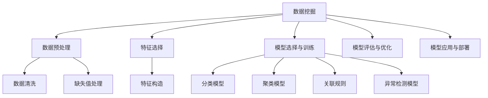

                 

# 知识挖掘：从海量数据中提炼价值洞察

## 1. 背景介绍

### 1.1 问题由来

在当今信息爆炸的时代，数据已经成为企业和国家的重要资产。如何从海量数据中挖掘出有价值的洞察，成为了各行各业关注的焦点。在企业决策、科学研究、金融投资等领域，数据驱动的决策已逐渐取代直觉和经验，成为主流。数据挖掘和知识发现（KDD）成为改善业务流程、提升市场竞争力的关键手段。

### 1.2 问题核心关键点

数据挖掘是运用特定的算法和工具，从大量数据中提取出有价值的模式、规律和知识，并应用于决策支持、预测、分类等实际问题中。数据挖掘的流程一般包括以下几个步骤：

1. **数据预处理**：清洗、整理数据，去除噪音，处理缺失值等。
2. **特征工程**：根据业务需求，选择合适的特征，并进行归一化、编码等处理。
3. **模型选择与训练**：根据任务类型，选择合适的算法，并在训练集上训练模型。
4. **模型评估与优化**：使用验证集评估模型性能，进行超参数调整和模型优化。
5. **模型应用与部署**：在实际应用中，部署和监控模型，进行业务决策或预测。

### 1.3 问题研究意义

数据挖掘技术的应用可以显著提升企业的决策效率和市场竞争力。通过数据驱动的洞察，企业可以在市场营销、客户管理、供应链优化等领域取得显著成效。此外，数据挖掘还可用于学术研究、医疗健康、智能交通等领域，推动社会进步和科技发展。

## 2. 核心概念与联系

### 2.1 核心概念概述

为更好地理解数据挖掘的流程和技术，本节将介绍几个核心概念：

- **数据挖掘（Data Mining）**：通过算法和工具从海量数据中提取有价值的模式、规律和知识的过程。
- **特征选择（Feature Selection）**：根据任务需求，选择和构造最相关的特征。
- **分类（Classification）**：将数据分为不同类别，如垃圾邮件分类、信用评分等。
- **聚类（Clustering）**：将数据分为不同的组或聚类，用于发现数据的内在结构。
- **关联规则（Association Rule）**：发现不同变量之间的关联关系，用于市场篮分析等。
- **异常检测（Anomaly Detection）**：识别数据中的异常点或异常行为，用于欺诈检测、网络安全等。

这些核心概念之间的逻辑关系可以通过以下Mermaid流程图来展示：



这个流程图展示了数据挖掘的主要步骤和关键过程，通过数据预处理、特征选择、模型训练等环节，最终提炼出有价值的洞察。

## 3. 核心算法原理 & 具体操作步骤

### 3.1 算法原理概述

数据挖掘的核心算法通常可以分为分类、聚类、关联规则、异常检测等。这里以分类和聚类为例，介绍其原理和操作步骤。

### 3.2 算法步骤详解

#### 3.2.1 分类算法

**步骤1: 数据预处理**
- 清洗数据，去除噪音和异常值。
- 处理缺失值，选择合适的填充方式。
- 进行特征归一化，如标准化、归一化等。

**步骤2: 特征选择**
- 根据领域知识，选择与任务相关的特征。
- 进行特征重要性排序，如信息增益、卡方检验、互信息等方法。
- 选择最优特征子集。

**步骤3: 模型训练**
- 选择合适的分类算法，如决策树、支持向量机、随机森林等。
- 在训练集上训练模型，并调整超参数。
- 使用交叉验证等方法评估模型性能。

**步骤4: 模型评估**
- 在验证集上评估模型性能，计算准确率、召回率、F1分数等指标。
- 根据评估结果调整模型参数，重新训练模型。
- 进行超参数优化，如网格搜索、随机搜索等。

**步骤5: 模型应用**
- 在测试集上评估模型性能，计算指标。
- 部署模型到实际应用中，进行业务决策或预测。
- 监控模型性能，根据业务需求调整模型。

#### 3.2.2 聚类算法

**步骤1: 数据预处理**
- 清洗数据，去除噪音和异常值。
- 处理缺失值，选择合适的填充方式。
- 进行特征归一化，如标准化、归一化等。

**步骤2: 特征选择**
- 根据领域知识，选择与任务相关的特征。
- 进行特征重要性排序，如信息增益、卡方检验、互信息等方法。
- 选择最优特征子集。

**步骤3: 模型训练**
- 选择合适的聚类算法，如K-means、层次聚类、DBSCAN等。
- 在训练集上训练模型，并调整超参数。
- 使用交叉验证等方法评估模型性能。

**步骤4: 模型评估**
- 在验证集上评估模型性能，计算轮廓系数、 Silhouette 系数等指标。
- 根据评估结果调整模型参数，重新训练模型。
- 进行超参数优化，如网格搜索、随机搜索等。

**步骤5: 模型应用**
- 在测试集上评估模型性能，计算指标。
- 部署模型到实际应用中，进行数据分组或聚类。
- 监控模型性能，根据业务需求调整模型。

### 3.3 算法优缺点

**分类算法的优缺点**：
- **优点**：适用于有标签数据，模型解释性强。
- **缺点**：依赖于特征选择和模型训练，对异常值和噪音敏感。

**聚类算法的优缺点**：
- **优点**：适用于无标签数据，能够发现数据的内在结构。
- **缺点**：对初始参数敏感，需要选择合适的参数。

### 3.4 算法应用领域

数据挖掘技术在多个领域中得到了广泛应用，具体包括：

- **市场营销**：客户细分、购物篮分析、广告效果评估等。
- **金融分析**：信用评分、欺诈检测、风险预测等。
- **医疗健康**：疾病诊断、患者分群、基因表达分析等。
- **零售业务**：库存管理、供应链优化、客户流失预测等。
- **交通运输**：路线规划、车辆调度、交通流量预测等。
- **社交网络**：社区发现、好友推荐、情感分析等。

数据挖掘技术的应用，不仅提升了各行业的决策效率和市场竞争力，还推动了科学研究和社会的进步。

## 4. 数学模型和公式 & 详细讲解 & 举例说明

### 4.1 数学模型构建

以分类算法为例，介绍常用的数学模型构建方法。

假设有一组数据集 $\{(x_i, y_i)\}_{i=1}^N$，其中 $x_i \in \mathcal{R}^d$ 为特征向量，$y_i \in \{0,1\}$ 为分类标签。

目标是最小化预测误差 $L$，即：

$$
\min_{\theta} L(y, \hat{y})
$$

其中 $L$ 为损失函数，$\hat{y}$ 为模型预测结果。

### 4.2 公式推导过程

以Logistic回归为例，推导其损失函数和梯度更新公式。

Logistic回归的预测函数为：

$$
\hat{y} = \sigma(\theta^T x)
$$

其中 $\sigma(z) = \frac{1}{1 + e^{-z}}$ 为逻辑函数。

Logistic回归的损失函数为交叉熵损失：

$$
L(y, \hat{y}) = -\frac{1}{N} \sum_{i=1}^N y_i \log \hat{y}_i + (1-y_i) \log (1-\hat{y}_i)
$$

损失函数的梯度为：

$$
\nabla_{\theta} L = -\frac{1}{N} \sum_{i=1}^N (y_i - \hat{y}_i) x_i
$$

利用梯度下降等优化算法，更新模型参数：

$$
\theta \leftarrow \theta - \eta \nabla_{\theta} L
$$

其中 $\eta$ 为学习率。

### 4.3 案例分析与讲解

以信用评分系统为例，分析数据挖掘在该领域的应用。

信用评分系统通常基于客户的消费记录、信用卡还款历史、社交信息等数据，进行客户信用评分的预测。具体步骤如下：

1. **数据预处理**：清洗数据，处理缺失值，进行特征归一化。
2. **特征选择**：选择与信用评分相关的特征，如消费金额、还款频率、信用历史等。
3. **模型训练**：在历史数据上训练分类模型，如Logistic回归、随机森林等。
4. **模型评估**：在验证集上评估模型性能，计算准确率、召回率、F1分数等指标。
5. **模型应用**：在测试集上评估模型性能，部署模型进行客户信用评分预测。
6. **模型优化**：根据业务需求，调整模型参数，优化超参数，提高预测准确率。

通过数据挖掘技术，金融机构可以在客户申请贷款时快速评估其信用风险，降低坏账率，提升金融服务质量。

## 5. 项目实践：代码实例和详细解释说明

### 5.1 开发环境搭建

在进行数据挖掘实践前，我们需要准备好开发环境。以下是使用Python进行scikit-learn开发的环境配置流程：

1. 安装Anaconda：从官网下载并安装Anaconda，用于创建独立的Python环境。

2. 创建并激活虚拟环境：
```bash
conda create -n scikit-learn-env python=3.8 
conda activate scikit-learn-env
```

3. 安装scikit-learn：使用pip安装scikit-learn及其依赖库。

```bash
pip install scikit-learn
```

4. 安装各类工具包：
```bash
pip install numpy pandas matplotlib seaborn
```

完成上述步骤后，即可在`scikit-learn-env`环境中开始数据挖掘实践。

### 5.2 源代码详细实现

下面我们以信用评分系统为例，给出使用scikit-learn进行Logistic回归模型训练的Python代码实现。

首先，定义数据集和标签：

```python
import numpy as np
from sklearn.datasets import load_breast_cancer
from sklearn.linear_model import LogisticRegression

# 加载乳腺癌数据集
data = load_breast_cancer()
X = data.data
y = data.target
```

然后，定义模型并训练：

```python
# 定义Logistic回归模型
model = LogisticRegression()

# 训练模型
model.fit(X, y)
```

接着，进行模型评估：

```python
from sklearn.model_selection import train_test_split
from sklearn.metrics import accuracy_score

# 划分训练集和验证集
X_train, X_test, y_train, y_test = train_test_split(X, y, test_size=0.2, random_state=42)

# 在验证集上评估模型
y_pred = model.predict(X_test)
accuracy = accuracy_score(y_test, y_pred)
print("Accuracy:", accuracy)
```

最后，进行模型应用：

```python
# 使用模型进行新样本的预测
new_samples = np.array([[0.1, 0.2, 0.3, 0.4, 0.5, 0.6, 0.7, 0.8, 0.9, 1.0]])
new_labels = model.predict(new_samples)
print("Predicted Labels:", new_labels)
```

### 5.3 代码解读与分析

让我们再详细解读一下关键代码的实现细节：

**LogisticRegression模型**：
- 利用scikit-learn库中的LogisticRegression类定义Logistic回归模型，该类封装了逻辑回归的训练和预测过程。

**train_test_split方法**：
- 使用train_test_split方法将数据集划分为训练集和验证集，测试集用于评估模型性能。

**accuracy_score函数**：
- 使用accuracy_score函数计算模型的准确率，用于评估模型的预测能力。

**模型应用**：
- 使用模型对新样本进行预测，输出预测标签。

通过scikit-learn库，我们可以快速实现基本的Logistic回归模型，并使用简单的代码实现数据挖掘过程。

## 6. 实际应用场景

### 6.1 电子商务推荐系统

数据挖掘技术在电子商务领域得到了广泛应用，特别是推荐系统中的协同过滤和关联规则挖掘。

协同过滤是一种基于用户行为数据的推荐算法，通过分析用户的历史购买和浏览记录，发现相似用户和物品，推荐相关物品。具体步骤如下：

1. **数据预处理**：清洗数据，处理缺失值，进行特征归一化。
2. **特征选择**：选择与用户行为相关的特征，如用户ID、物品ID、评分等。
3. **模型训练**：在用户行为数据上训练协同过滤模型，如基于用户的协同过滤、基于物品的协同过滤等。
4. **模型评估**：在验证集上评估模型性能，计算准确率、召回率、F1分数等指标。
5. **模型应用**：在测试集上评估模型性能，部署模型进行商品推荐。
6. **模型优化**：根据业务需求，调整模型参数，优化超参数，提高推荐效果。

通过数据挖掘技术，电子商务平台可以根据用户的浏览和购买记录，推荐相关商品，提升用户满意度和销售额。

### 6.2 金融风控系统

金融风控系统通过分析客户的交易记录、信用历史等数据，预测客户的违约风险，进行信用评分和风险控制。

数据挖掘在金融风控中的应用步骤如下：

1. **数据预处理**：清洗数据，处理缺失值，进行特征归一化。
2. **特征选择**：选择与违约风险相关的特征，如消费金额、还款频率、信用历史等。
3. **模型训练**：在历史交易数据上训练分类模型，如Logistic回归、随机森林等。
4. **模型评估**：在验证集上评估模型性能，计算准确率、召回率、F1分数等指标。
5. **模型应用**：在测试集上评估模型性能，部署模型进行违约风险预测。
6. **模型优化**：根据业务需求，调整模型参数，优化超参数，提高预测准确率。

通过数据挖掘技术，金融机构可以预测客户的违约风险，提前进行风险控制，降低坏账率，提升金融服务质量。

### 6.3 医疗健康系统

数据挖掘在医疗健康领域也有广泛应用，如疾病预测、基因表达分析等。

医疗健康系统通过分析病人的病历记录、生理指标等数据，预测病人的疾病风险，进行个性化医疗方案的制定。具体步骤如下：

1. **数据预处理**：清洗数据，处理缺失值，进行特征归一化。
2. **特征选择**：选择与疾病风险相关的特征，如年龄、性别、生理指标等。
3. **模型训练**：在病历数据上训练分类模型，如支持向量机、随机森林等。
4. **模型评估**：在验证集上评估模型性能，计算准确率、召回率、F1分数等指标。
5. **模型应用**：在测试集上评估模型性能，部署模型进行疾病预测。
6. **模型优化**：根据业务需求，调整模型参数，优化超参数，提高预测准确率。

通过数据挖掘技术，医疗机构可以根据病人的病历数据，预测疾病风险，制定个性化医疗方案，提高医疗服务质量。

### 6.4 未来应用展望

随着数据挖掘技术的不断发展，其在各个领域的应用将更加深入和广泛。未来，数据挖掘技术将在以下几个方面迎来新的突破：

1. **自动化数据处理**：自动清洗、整合和标注数据，减少人工干预，提高数据处理效率。
2. **深度学习融合**：结合深度学习技术，提高模型的复杂度和精度，解决传统机器学习算法的局限性。
3. **联邦学习**：在保护隐私的前提下，多方数据合作进行联合训练，提高模型性能。
4. **可解释性增强**：通过可视化工具和解释性算法，提高模型的可解释性，增强决策的透明性和可信度。
5. **实时性提升**：通过流数据处理和增量学习，实现模型的实时更新和优化。
6. **跨领域应用**：结合其他领域的数据和知识，提高模型的通用性和泛化能力。

数据挖掘技术的不断进步，将推动各行业的智能化转型，为经济社会发展带来新的动力。

## 7. 工具和资源推荐

### 7.1 学习资源推荐

为了帮助开发者系统掌握数据挖掘的理论基础和实践技巧，这里推荐一些优质的学习资源：

1. 《数据挖掘导论》：由Jerry Kenamey等人合著的经典教材，全面介绍了数据挖掘的理论和应用。
2. 《Python数据挖掘》：Wes McKinney等人合著的实用指南，介绍了Python在数据挖掘中的应用。
3. Coursera《数据挖掘与统计学习》课程：由Johnson & Johnson 公司的数据科学家Drew Conway讲授，涵盖数据挖掘的多个方面。
4. Kaggle平台：一个数据科学竞赛平台，提供了丰富的数据集和实战案例，帮助开发者提升数据挖掘技能。
5. IEEE Transactions on Knowledge and Data Engineering（TKDE）期刊：国际顶级期刊，发表了大量高质量的数据挖掘研究成果，是了解最新进展的好地方。

通过对这些资源的学习实践，相信你一定能够快速掌握数据挖掘的精髓，并用于解决实际的业务问题。

### 7.2 开发工具推荐

高效的开发离不开优秀的工具支持。以下是几款用于数据挖掘开发的常用工具：

1. Python：作为数据挖掘的主流编程语言，Python具有丰富的库和框架，适合快速迭代研究。

2. scikit-learn：一个基于Python的机器学习库，提供了大量的经典算法和实用工具，支持数据挖掘的各个环节。

3. R语言：作为数据科学的主流编程语言，R语言有丰富的统计分析和数据挖掘包，如caret、randomForest等。

4. TensorFlow：由Google主导开发的开源深度学习框架，支持分布式计算和自动化机器学习，适合大数据量的处理。

5. PyTorch：一个灵活的深度学习框架，支持动态计算图和GPU加速，适合深度学习算法的实现和优化。

6. Weights & Biases：模型训练的实验跟踪工具，可以记录和可视化模型训练过程中的各项指标，方便对比和调优。

合理利用这些工具，可以显著提升数据挖掘任务的开发效率，加快创新迭代的步伐。

### 7.3 相关论文推荐

数据挖掘技术的发展源于学界的持续研究。以下是几篇奠基性的相关论文，推荐阅读：

1. "A Survey of Data Mining Techniques for Healthcare" by Berika and Misra：介绍了数据挖掘在医疗健康领域的应用和挑战。
2. "Data Mining for Customer Relationship Management" by Wang et al：探讨了数据挖掘在客户关系管理中的应用。
3. "Mining Association Rules between Market Basket Transactions" by S Provost：介绍了关联规则挖掘的基本原理和算法。
4. "Anomaly Detection and Classification Techniques" by Khelifa and Tresp：综述了异常检测的基本方法和应用。

这些论文代表了大数据挖掘技术的发展脉络。通过学习这些前沿成果，可以帮助研究者把握学科前进方向，激发更多的创新灵感。

## 8. 总结：未来发展趋势与挑战

### 8.1 总结

本文对数据挖掘技术进行了全面系统的介绍。首先阐述了数据挖掘的背景和重要性，明确了其在各个领域的应用场景和价值。其次，从原理到实践，详细讲解了数据挖掘的数学模型和操作步骤，给出了数据挖掘任务开发的完整代码实例。同时，本文还广泛探讨了数据挖掘技术在多个行业领域的应用前景，展示了数据挖掘范式的广泛适用性。

通过本文的系统梳理，可以看到，数据挖掘技术已经广泛应用于各个领域，成为提高决策效率、提升市场竞争力的关键手段。未来，伴随数据量的不断增长和数据处理技术的不断进步，数据挖掘技术必将迎来新的发展机遇，为各行业的智能化转型提供强大的技术支撑。

### 8.2 未来发展趋势

展望未来，数据挖掘技术将呈现以下几个发展趋势：

1. **自动化和智能化**：随着自动化数据处理和智能算法的发展，数据挖掘将更加高效、准确。
2. **跨领域融合**：数据挖掘与人工智能、机器学习、自然语言处理等领域深度融合，提升模型的复杂度和泛化能力。
3. **实时性和流数据处理**：结合流数据处理和增量学习技术，实现数据的实时挖掘和处理。
4. **联邦学习与隐私保护**：在保护隐私的前提下，多方数据合作进行联合训练，提高模型性能。
5. **可解释性和透明性**：通过可视化工具和解释性算法，提高模型的可解释性，增强决策的透明性和可信度。

这些趋势凸显了数据挖掘技术的广阔前景，必将推动各行业的智能化转型，为经济社会发展带来新的动力。

### 8.3 面临的挑战

尽管数据挖掘技术已经取得了显著进展，但在迈向更加智能化、普适化应用的过程中，它仍面临着诸多挑战：

1. **数据质量问题**：数据挖掘依赖高质量的数据，存在数据噪声、缺失值等问题，需要更多的预处理和清洗技术。
2. **算法复杂性**：数据挖掘算法复杂度较高，模型训练和调参难度较大，需要更多的自动化和智能化技术支持。
3. **隐私和伦理问题**：数据挖掘涉及大量敏感信息，如何保护隐私、防止滥用，需要更多的法律和伦理约束。
4. **可解释性不足**：数据挖掘模型通常较复杂，难以解释其内部工作机制和决策逻辑，需要更多的可解释性和透明性技术。
5. **跨领域应用难度**：不同领域的数据具有不同的特征和分布，数据挖掘技术在不同领域的适用性有待提高。

这些挑战需要通过技术创新和规范制定，逐步加以克服，推动数据挖掘技术向更高的成熟度迈进。

### 8.4 研究展望

未来，数据挖掘技术需要在以下几个方面寻求新的突破：

1. **自动化数据处理**：自动清洗、整合和标注数据，减少人工干预，提高数据处理效率。
2. **深度学习融合**：结合深度学习技术，提高模型的复杂度和精度，解决传统机器学习算法的局限性。
3. **联邦学习**：在保护隐私的前提下，多方数据合作进行联合训练，提高模型性能。
4. **可解释性增强**：通过可视化工具和解释性算法，提高模型的可解释性，增强决策的透明性和可信度。
5. **实时性提升**：通过流数据处理和增量学习，实现模型的实时更新和优化。
6. **跨领域应用**：结合其他领域的数据和知识，提高模型的通用性和泛化能力。

这些研究方向的探索，必将引领数据挖掘技术迈向更高的台阶，为构建智能化的决策系统提供强大的技术支撑。面向未来，数据挖掘技术还需要与其他人工智能技术进行更深入的融合，如知识表示、因果推理、强化学习等，多路径协同发力，共同推动智能决策系统的进步。只有勇于创新、敢于突破，才能不断拓展数据挖掘技术的边界，让智能技术更好地服务于各行业的发展。

## 9. 附录：常见问题与解答

**Q1: 什么是数据挖掘？**

A: 数据挖掘是通过算法和工具从大量数据中提取有价值的模式、规律和知识的过程，广泛应用于市场分析、金融风险控制、医疗健康等领域。

**Q2: 数据挖掘的过程包括哪些步骤？**

A: 数据挖掘的过程一般包括以下几个步骤：数据预处理、特征选择、模型选择与训练、模型评估与优化、模型应用与部署。

**Q3: 如何选择合适的特征？**

A: 根据业务需求和领域知识，选择与任务相关的特征。可以采用信息增益、卡方检验、互信息等方法，选择最优特征子集。

**Q4: 数据挖掘的应用场景有哪些？**

A: 数据挖掘广泛应用于市场分析、金融风险控制、医疗健康、电子商务推荐、智能交通等多个领域，帮助企业和机构提高决策效率和市场竞争力。

**Q5: 如何提高数据挖掘模型的准确性？**

A: 通过特征工程、模型选择、超参数调优、数据增强等手段，优化模型性能。此外，可以使用深度学习技术，提高模型的复杂度和精度。

通过本文的系统梳理，相信你一定能够快速掌握数据挖掘的精髓，并用于解决实际的业务问题。

