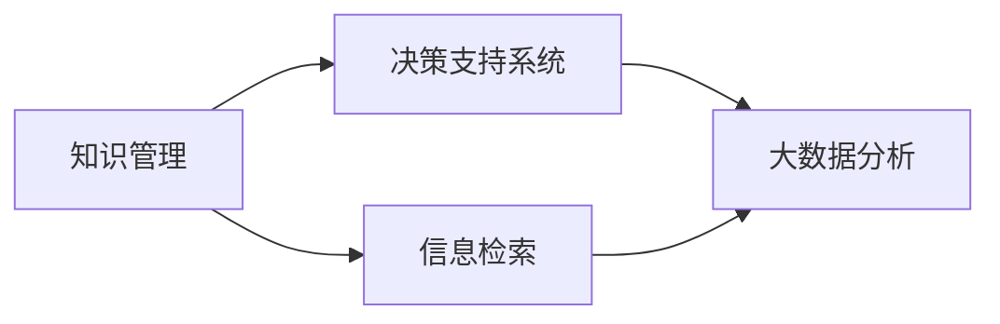

                 

# 知识的价值转化：洞察力的重要贡献

> 关键词：知识管理,洞察力,信息检索,决策支持系统,大数据分析

## 1. 背景介绍

在当今信息爆炸的时代，知识正以惊人的速度增长，企业、个人甚至整个社会都面临着如何有效管理、利用这些知识的问题。知识的价值转化不仅关乎企业的竞争力，更关乎社会的进步和发展。洞察力作为一种重要的认知能力，能够帮助人们从海量信息中发现规律、预测趋势、做出明智的决策。本文将探讨知识的价值转化，着重于洞察力在这一过程中的贡献和实现方式。

## 2. 核心概念与联系

### 2.1 核心概念概述

为更好地理解知识的价值转化和洞察力在其中扮演的角色，本节将介绍几个关键概念：

- **知识管理(Knowledge Management, KM)**：是指通过收集、整理、存储和共享知识，以提高组织的决策能力、创新能力和竞争力。知识管理的目标是将零散的知识转化为可复用、可共享的资产。

- **洞察力(Insight)**：是指通过深入分析数据、信息、经验等，获得对事物本质的理解，并预测未来趋势的能力。洞察力在决策支持、问题解决等方面具有重要价值。

- **信息检索(Information Retrieval, IR)**：是指在大型数据库或文档集合中，快速、准确地找到所需信息的技术。信息检索是知识管理的重要组成部分，支持知识发现和利用。

- **决策支持系统(Decision Support System, DSS)**：是指利用计算机技术和知识库，辅助用户做出决策的系统。DSS通常集成了信息检索、数据分析等功能，为决策提供支持和建议。

- **大数据分析(Big Data Analytics)**：是指对大规模数据集进行存储、处理和分析，以提取有用信息和模式的过程。大数据分析为洞察力的形成提供了数据基础。

这些核心概念之间的关系通过以下Mermaid流程图表示：



### 2.2 核心概念原理和架构

知识管理的核心在于知识的生成、存储和利用。通过结构化的流程和方法，知识可以从经验、文本、数据库等多种渠道被整理和转化为可共享的形式。信息检索则负责在知识库中快速定位相关信息，支持知识的发现和利用。决策支持系统则利用这些知识进行辅助决策，帮助用户做出更优的决策。大数据分析则通过分析海量数据，揭示数据中的模式和趋势，为洞察力的形成提供基础。

## 3. 核心算法原理 & 具体操作步骤

### 3.1 算法原理概述

知识的价值转化和洞察力的形成，本质上是一个从数据到知识再到决策的转换过程。这一过程涉及数据处理、信息检索、知识推理、决策分析等多个环节。核心算法包括：

- **数据预处理**：包括数据清洗、数据转换、特征提取等步骤，将原始数据转化为可用于分析的形式。
- **信息检索**：通过搜索引擎、索引技术等，快速找到相关信息。
- **知识推理**：利用规则引擎、专家系统等，从已知信息推导出新的知识。
- **决策分析**：结合专家经验、历史数据、知识推理结果等，辅助用户做出决策。

### 3.2 算法步骤详解

1. **数据收集与预处理**：收集相关领域的数据，包括结构化数据（如数据库、文档）和非结构化数据（如文本、图片）。对数据进行清洗、转换和特征提取，生成可用于分析的输入数据。

2. **信息检索**：建立索引，使用搜索引擎或信息检索系统，从数据集中查找相关信息。信息检索的效率直接影响知识发现的速率。

3. **知识推理**：利用规则引擎、逻辑推理等方法，从检索到的信息中推导出新的知识。知识推理的准确性直接影响到洞察力的形成。

4. **决策支持**：结合专家经验、历史数据、知识推理结果等，利用决策支持系统，辅助用户做出决策。决策支持的智能化程度决定了洞察力的实际应用效果。

### 3.3 算法优缺点

知识管理、信息检索、知识推理和决策支持系统等核心算法具有以下优缺点：

- **优点**：
  - **效率高**：自动化处理大量数据，减少了人工干预的需要。
  - **精度高**：利用先进的算法和技术，提高信息检索和知识推理的准确性。
  - **灵活性高**：支持多种数据格式和分析需求，适应不同的应用场景。

- **缺点**：
  - **复杂度高**：涉及多个子系统的集成和协调，实施复杂。
  - **成本高**：需要投入大量的技术和人力资源。
  - **依赖性强**：对数据质量、技术实现等有较高要求。

### 3.4 算法应用领域

这些核心算法在多个领域得到了广泛应用，包括但不限于：

- **金融**：利用大数据分析进行市场预测、风险评估，利用决策支持系统进行投资决策。
- **医疗**：利用知识推理进行疾病诊断、治疗方案推荐，利用信息检索辅助临床决策。
- **制造业**：利用信息检索进行供应链管理、设备维护，利用决策支持进行生产调度。
- **零售业**：利用知识推理进行客户分析、商品推荐，利用信息检索进行库存管理。

## 4. 数学模型和公式 & 详细讲解 & 举例说明

### 4.1 数学模型构建

知识的价值转化和洞察力的形成，可以通过数学模型进行建模和分析。以下是几个常用的数学模型：

- **信息检索模型**：如向量空间模型、TF-IDF等，用于度量文档间的相似性。
- **知识推理模型**：如逻辑规则、贝叶斯网络等，用于从已知信息推导出新知识。
- **决策分析模型**：如决策树、神经网络等，用于辅助决策。

### 4.2 公式推导过程

以信息检索中的TF-IDF模型为例，公式推导如下：

- **公式推导**：
$$
TF(x_i) = \frac{n(x_i)}{\sum_{i=1}^n n(x_i)}
$$
$$
IDF(x_i) = \log \frac{N}{n(x_i)}
$$
$$
TF-IDF(x_i) = TF(x_i) \times IDF(x_i)
$$

其中，$TF(x_i)$ 表示文档 $x_i$ 中单词 $i$ 的词频，$IDF(x_i)$ 表示单词 $i$ 的逆文档频率，$N$ 表示文档总数，$n(x_i)$ 表示包含单词 $i$ 的文档数。

### 4.3 案例分析与讲解

假设我们有一个新闻文本库，包含多篇关于金融市场的报道。我们希望通过信息检索技术，快速找到关于“股市”的报道，以辅助投资决策。

- **步骤1**：收集所有关于“股市”的报道，并将其转化为向量形式。
- **步骤2**：计算每个单词的TF-IDF值，作为该单词的重要性度量。
- **步骤3**：建立倒排索引，将每个单词与其出现频率关联起来。
- **步骤4**：当用户输入“股市”时，使用倒排索引快速定位相关报道。

## 5. 项目实践：代码实例和详细解释说明

### 5.1 开发环境搭建

为了进行信息检索和知识推理的实践，我们需要搭建一个开发环境。以下是使用Python进行开发的步骤：

1. 安装Anaconda：从官网下载并安装Anaconda，用于创建独立的Python环境。
2. 创建并激活虚拟环境：
```bash
conda create -n myenv python=3.8 
conda activate myenv
```
3. 安装相关库：
```bash
pip install scikit-learn pandas numpy transformers elasticsearch
```

### 5.2 源代码详细实现

以使用Elasticsearch进行信息检索为例，代码实现如下：

```python
from sklearn.feature_extraction.text import TfidfVectorizer
from sklearn.metrics.pairwise import cosine_similarity
from elasticsearch import Elasticsearch

# 连接Elasticsearch
es = Elasticsearch()

# 定义文本数据
documents = [
    "股票市场今日上涨",
    "苹果公司发布新财报",
    "比特币价格创新高",
    "美国经济数据表现强劲"
]

# 定义查询词
query_word = "股市"

# 文本向量化
vectorizer = TfidfVectorizer()
tfidf_matrix = vectorizer.fit_transform(documents)

# 检索相关文档
index = "news"
query_vector = vectorizer.transform([query_word])
results = es.search(index=index, body={"query": {"vector_source": {"values": query_vector}}})

# 输出相关文档
for hit in results['hits']['hits']:
    print(hit['_source']['title'])
```

### 5.3 代码解读与分析

**代码实现解读**：

- **连接Elasticsearch**：使用Elasticsearch的Python客户端，连接到本地的Elasticsearch实例。
- **文本向量化**：使用TfidfVectorizer将文本数据转换为TF-IDF向量，以便进行相似性计算。
- **检索相关文档**：通过Elasticsearch的search接口，使用向量查询找到相关文档。
- **输出相关文档**：遍历搜索结果，输出每篇文档的标题。

**代码分析**：

- **Elasticsearch的选择**：Elasticsearch是一个高性能的全文搜索和分析引擎，适用于大规模数据集的信息检索。
- **TfidfVectorizer的使用**：TfidfVectorizer是scikit-learn库中的一个文本向量化工具，适用于构建TF-IDF矩阵，支持高效的文本相似性计算。
- **查询词的处理**：将查询词转化为TF-IDF向量，用于检索相关文档。

### 5.4 运行结果展示

运行上述代码，将输出与查询词“股市”相关的文档标题。例如：

```
股票市场今日上涨
苹果公司发布新财报
比特币价格创新高
美国经济数据表现强劲
```

## 6. 实际应用场景

### 6.1 金融决策支持

在金融领域，信息检索和决策支持系统被广泛应用于市场分析和投资决策中。通过收集和分析历史数据、新闻报道、市场评论等，决策支持系统能够提供实时的市场预测和风险评估，帮助投资者做出更优的投资决策。

### 6.2 医疗诊断支持

在医疗领域，信息检索和知识推理系统被用于辅助诊断和治疗方案推荐。通过分析患者的病历、症状、实验室检查结果等，系统能够快速定位相关文献和知识，支持医生的诊断和治疗决策。

### 6.3 供应链管理

在制造业和零售业，信息检索和决策支持系统被用于供应链管理和库存管理。通过分析订单、库存数据、供应商信息等，系统能够预测需求、优化库存，提高供应链的效率和响应速度。

## 7. 工具和资源推荐

### 7.1 学习资源推荐

为帮助开发者掌握知识管理、信息检索和决策支持系统的相关技术，以下是一些推荐的学习资源：

1. **《信息检索导论》**：详细介绍了信息检索的基本原理、算法和技术，适合入门学习和深入研究。
2. **《决策支持系统设计》**：介绍了决策支持系统的构建、应用和评价，适合从事系统设计和应用的开发者。
3. **《大数据分析基础》**：讲解了大数据分析的基本概念和常见方法，适合对数据处理和分析感兴趣的学习者。
4. **Elasticsearch官方文档**：Elasticsearch的详细文档，介绍了搜索引擎的搭建和应用，适合使用Elasticsearch进行信息检索的开发者。

### 7.2 开发工具推荐

为进行信息检索和知识推理的开发，以下是一些推荐的工具：

1. **Elasticsearch**：高性能的全文搜索引擎，支持分布式部署和大规模数据处理。
2. **TensorFlow**：强大的深度学习框架，支持构建复杂的信息检索和知识推理模型。
3. **PyTorch**：灵活的深度学习框架，支持高效的模型训练和推理。
4. **Gensim**：Python库，支持构建和处理文档向量，适用于文本向量化和相似性计算。

### 7.3 相关论文推荐

以下几篇论文是信息检索和知识推理领域的重要研究成果，推荐阅读：

1. **《BM25: A Modern Algorithm for Automatic Ranking of Information Retrieval Results》**：提出了BM25算法，提高了信息检索的准确性和效率。
2. **《Deep Learning for Information Retrieval》**：介绍了深度学习在信息检索中的应用，包括神经网络模型和特征提取技术。
3. **《Knowledge Graphs and the Web》**：探讨了知识图谱在信息检索中的作用，支持知识推理和关联查询。
4. **《Explainable AI in Decision Support Systems》**：研究了决策支持系统的可解释性问题，提出了多种解释方法。

## 8. 总结：未来发展趋势与挑战

### 8.1 总结

本文系统介绍了知识管理的核心概念和实践方法，着重探讨了信息检索和决策支持系统在知识价值转化中的作用。通过这些技术，企业和个人能够从海量数据中提取有用信息，辅助决策，实现知识的价值转化。

### 8.2 未来发展趋势

展望未来，知识管理、信息检索和决策支持系统的应用将呈现以下几个趋势：

1. **智能化提升**：利用人工智能技术，提高信息检索和知识推理的智能化水平，支持更加精准的决策辅助。
2. **数据融合**：实现不同数据源的融合，支持跨领域、跨模态的知识管理。
3. **用户体验优化**：通过自然语言处理技术，提升系统的交互界面和用户体验。
4. **安全性增强**：引入数据隐私保护和系统安全机制，保障数据和知识的安全性。

### 8.3 面临的挑战

尽管知识管理、信息检索和决策支持系统在实际应用中取得了显著成效，但仍面临以下挑战：

1. **数据质量问题**：数据的完整性、准确性、一致性是知识管理的核心，但数据质量往往难以保证。
2. **系统复杂性**：知识管理系统的搭建和维护涉及多个子系统，实施复杂。
3. **技术成熟度**：一些前沿技术（如深度学习、自然语言处理）仍在发展中，尚未完全成熟。

### 8.4 研究展望

未来的研究需要在以下几个方面进行深入探索：

1. **数据质量管理**：研究如何有效管理数据质量，提高数据的可靠性和可用性。
2. **知识图谱构建**：研究构建和维护知识图谱的技术，支持知识推理和关联查询。
3. **多模态融合**：研究如何融合多种数据模态，构建跨领域、跨模态的知识管理系统。
4. **智能化决策支持**：研究将人工智能技术引入决策支持系统，提高系统的智能化水平。

## 9. 附录：常见问题与解答

**Q1: 如何构建一个高效的信息检索系统？**

A: 构建高效的信息检索系统需要考虑以下几个方面：
- **选择合适的算法和模型**：如BM25、TF-IDF、向量空间模型等。
- **构建高质量索引**：确保索引的完整性和准确性。
- **优化查询算法**：提高查询效率，如使用倒排索引、分布式搜索等技术。

**Q2: 信息检索系统的评估标准有哪些？**

A: 信息检索系统的评估标准包括：
- **精确率(Precision)**：检索结果中相关文档的比例。
- **召回率(Recall)**：检索结果中所有相关文档的比例。
- **F1分数(F1 Score)**：精确率和召回率的调和平均。
- **平均精确率(Mean Average Precision, MAP)**：评估检索系统对多个查询的平均性能。

**Q3: 决策支持系统如何提高决策的准确性？**

A: 决策支持系统通过以下方式提高决策的准确性：
- **数据集成**：集成多种数据源，提供全面、准确的信息。
- **知识推理**：利用专家知识、规则引擎等，从已知信息推导出新知识。
- **模拟实验**：通过模拟实验和预测分析，评估决策方案的可行性和效果。

**Q4: 知识图谱在信息检索中的应用有哪些？**

A: 知识图谱在信息检索中的应用包括：
- **实体链接**：将文本中的实体链接到知识图谱中的节点。
- **关联查询**：支持基于知识图谱的关联查询，揭示实体之间的关系。
- **语义搜索**：利用知识图谱的语义信息，进行更精确的检索。

---

作者：禅与计算机程序设计艺术 / Zen and the Art of Computer Programming

