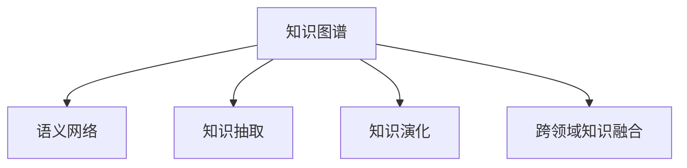
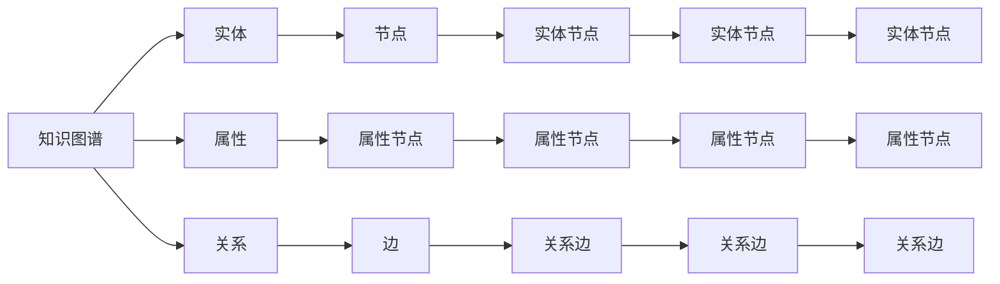

                 

# 知识的动态性：实时更新与知识演化

> 关键词：知识图谱, 语义网络, 知识抽取, 实时更新, 知识演化, 跨领域知识融合

## 1. 背景介绍

在当今信息爆炸的时代，知识的动态性正日益成为重要的研究主题。一方面，数据和信息以指数级增长，无法被有限的人类知识库完全覆盖；另一方面，新的科学发现和技术创新层出不穷，导致现有知识需要不断更新。知识图谱（Knowledge Graphs）作为解决这一问题的重要工具，近年来受到了广泛关注。

知识图谱通过语义网络结构将实体、属性和关系等知识元素有机地组织在一起，可以方便地进行知识的存储、检索、推理和更新。本文旨在探讨知识图谱的实时更新与知识演化机制，探讨如何利用深度学习技术进行知识抽取，以及如何实现跨领域知识融合。

## 2. 核心概念与联系

### 2.1 核心概念概述

为更好地理解知识的动态性，本文首先介绍几个核心概念：

- **知识图谱**：一种语义化的知识表示形式，由实体、属性和关系等组成，形成图状结构，便于知识检索、推理和更新。
- **语义网络**：知识图谱的一种表达形式，以节点表示实体，边表示实体之间的关系。
- **知识抽取**：从结构化或非结构化的数据中自动获取知识，生成知识图谱。
- **知识演化**：知识图谱随着时间不断更新，加入新的实体、关系和属性，保持知识的时效性。
- **跨领域知识融合**：将不同领域、不同来源的知识进行整合，形成更全面的知识体系。

这些概念之间的逻辑关系可以通过以下Mermaid流程图来展示：



这个流程图展示了知识图谱的核心概念及其之间的联系：

1. 知识图谱通过语义网络结构进行知识表示。
2. 知识抽取是从原始数据中自动获取实体、关系和属性，生成知识图谱。
3. 知识演化是指知识图谱随着时间不断更新，加入新的知识。
4. 跨领域知识融合是将不同领域、不同来源的知识进行整合，形成更全面的知识体系。

这些概念共同构成了知识图谱的核心工作原理，使得知识图谱在知识管理和智能决策等领域中发挥重要作用。

### 2.2 核心概念原理和架构的 Mermaid 流程图



这个流程图展示了知识图谱的基本架构和组件：

1. 实体节点（H、K、N）表示知识图谱中的实体，如人、地点、组织等。
2. 属性节点（F、I、L）表示实体的属性，如年龄、位置、职能等。
3. 关系边（G、J、M）表示实体之间的关系，如父女、属于、工作于等。

## 3. 核心算法原理 & 具体操作步骤

### 3.1 算法原理概述

知识图谱的实时更新与知识演化机制主要涉及以下核心算法：

- **知识抽取算法**：从原始数据中自动抽取实体、关系和属性，生成知识图谱。
- **知识演化算法**：在原有知识图谱的基础上，加入新的实体、关系和属性，进行知识更新。
- **跨领域知识融合算法**：将不同领域、不同来源的知识进行整合，形成更全面的知识体系。

这些算法共同构成了知识图谱的实时更新与知识演化机制，使得知识图谱能够不断适应新的知识需求。

### 3.2 算法步骤详解

#### 3.2.1 知识抽取算法步骤

1. **数据预处理**：对原始数据进行清洗、标注和格式转换，准备知识抽取所需的数据。
2. **实体识别**：使用命名实体识别（NER）技术，从文本中自动识别实体。
3. **关系抽取**：使用关系抽取技术，从文本中抽取实体之间的关系。
4. **属性抽取**：使用属性抽取技术，从文本中抽取实体的属性信息。
5. **知识图谱生成**：将识别出的实体、关系和属性，按照语义网络结构生成知识图谱。

#### 3.2.2 知识演化算法步骤

1. **知识图谱更新**：根据新的实体、关系和属性，对现有知识图谱进行更新，保持知识的时效性。
2. **知识冲突处理**：处理新增知识与现有知识之间的冲突，如命名冲突、类型冲突等。
3. **知识一致性验证**：验证更新后的知识图谱是否一致、正确，避免错误的传递。

#### 3.2.3 跨领域知识融合算法步骤

1. **知识图谱对齐**：将不同领域、不同来源的知识图谱进行对齐，形成统一的语义网络结构。
2. **知识图谱融合**：将对齐后的知识图谱进行融合，生成跨领域的综合知识图谱。
3. **知识图谱优化**：对融合后的知识图谱进行优化，去除冗余信息，提高知识的准确性和完整性。

### 3.3 算法优缺点

#### 3.3.1 知识抽取算法的优缺点

**优点**：
- 自动获取知识，减少人工标注工作量。
- 能够处理大规模数据，生成全面的知识图谱。
- 结合深度学习技术，准确性较高。

**缺点**：
- 对原始数据的质量要求较高，数据清洗工作量大。
- 处理复杂关系的准确性仍有待提升。
- 模型训练和调参复杂，资源消耗较大。

#### 3.3.2 知识演化算法的优缺点

**优点**：
- 保持知识的时效性，适应新知识的变化。
- 能够处理命名冲突和类型冲突，提高知识的一致性。
- 可自动化实现，节省人力成本。

**缺点**：
- 更新后的知识图谱可能存在冲突，需要人工干预。
- 知识一致性验证需要额外的时间和资源。
- 更新频率和时机需要合理规划，避免频繁更新带来的开销。

#### 3.3.3 跨领域知识融合算法的优缺点

**优点**：
- 能够整合不同领域的知识，形成更全面的知识体系。
- 提高知识的覆盖范围和准确性。
- 支持知识共享和跨领域协作。

**缺点**：
- 知识图谱对齐复杂，需要处理多种不同的知识表示方式。
- 知识图谱融合可能导致信息冗余，需要额外的优化步骤。
- 跨领域知识的统一性需要人工干预和验证。

### 3.4 算法应用领域

知识图谱的实时更新与知识演化机制，在多个领域中有着广泛的应用，例如：

- **智能问答系统**：利用知识图谱进行实体关系查询，生成智能回答。
- **推荐系统**：结合知识图谱进行商品推荐，提升推荐效果。
- **智能搜索**：利用知识图谱进行实体和关系搜索，提供更精准的搜索结果。
- **医疗领域**：构建疾病知识图谱，支持疾病诊断和治疗。
- **金融领域**：构建金融知识图谱，支持风险评估和投资分析。
- **社交网络**：构建社交网络知识图谱，支持社交关系分析和信息过滤。

以上领域只是冰山一角，随着知识图谱技术的发展，其应用范围还将进一步扩展，为各行各业带来新的变革。

## 4. 数学模型和公式 & 详细讲解 & 举例说明

### 4.1 数学模型构建

知识图谱的数学模型主要基于语义网络结构和知识表示语言。以下以RDF（Resource Description Framework）为例，介绍知识图谱的基本数学模型：

$$
\text{RDF} = \{ (\text{Subject}, \text{Predicate}, \text{Object}) \}
$$

其中，Subject表示实体，Predicate表示实体之间的关系，Object表示实体属性。

### 4.2 公式推导过程

以知识图谱的实体抽取为例，假设输入文本为 $X$，输出实体为 $Y$，知识抽取的目标是最大化 $Y$ 和 $X$ 的相关性。根据信息检索理论，可以构建以下公式：

$$
L(X, Y) = -\log P(Y|X)
$$

其中，$P(Y|X)$ 表示在给定文本 $X$ 的情况下，实体 $Y$ 出现的概率。

通过最大似然估计，可以训练出一个参数化的概率模型，用于预测实体的出现概率。例如，可以使用卷积神经网络（CNN）或循环神经网络（RNN）来构建知识抽取模型，并通过负采样等技术进行训练。

### 4.3 案例分析与讲解

假设我们需要从以下文本中抽取实体：

```
张三，男，30岁，是一名软件工程师。
```

首先，将文本输入到实体抽取模型中，得到实体的类别概率分布：

$$
P(\text{张三}|X) = 0.8, \quad P(\text{男}|X) = 0.2, \quad P(\text{30岁}|X) = 0.1, \quad P(\text{软件工程师}|X) = 0.9
$$

根据最大似然估计，可以得出实体抽取的结果为 $\text{张三}$，因为其类别概率最大。

## 5. 项目实践：代码实例和详细解释说明

### 5.1 开发环境搭建

本节以Python为例，介绍知识抽取的开发环境搭建步骤：

1. **安装依赖包**：使用pip安装必要的Python依赖包，如TensorFlow、Keras等。

```bash
pip install tensorflow keras
```

2. **搭建数据集**：准备训练集和测试集，并将文本文件转换为TFRecord格式。

```python
import tensorflow as tf
from tensorflow.keras.preprocessing.text import Tokenizer
from tensorflow.keras.preprocessing.sequence import pad_sequences

# 准备数据
train_texts = []
train_labels = []
with open('train.txt', 'r') as f:
    for line in f:
        text, label = line.strip().split('\t')
        train_texts.append(text)
        train_labels.append(label)

# 数据预处理
tokenizer = Tokenizer()
tokenizer.fit_on_texts(train_texts)
sequences = tokenizer.texts_to_sequences(train_texts)
padded_sequences = pad_sequences(sequences, maxlen=50, padding='post')

# 将数据转换为TFRecord格式
writer = tf.io.TFRecordWriter('train.tfrecord')
for i in range(len(train_texts)):
    features = {
        'input_text': tf.train.Feature(int64_list=tf.train.Int64List(value=padded_sequences[i])),
        'output_label': tf.train.Feature(int64_list=tf.train.Int64List(value=[train_labels[i]]))
    }
    example = tf.train.Example(features=tf.train.Features(feature=features))
    writer.write(example.SerializeToString())
writer.close()
```

3. **搭建模型**：使用Keras构建知识抽取模型，并使用TensorFlow作为后端。

```python
from tensorflow.keras.models import Sequential
from tensorflow.keras.layers import Embedding, LSTM, Dense

# 搭建模型
model = Sequential([
    Embedding(input_dim=len(tokenizer.word_index) + 1, output_dim=128),
    LSTM(128, dropout=0.2),
    Dense(1, activation='sigmoid')
])

# 编译模型
model.compile(loss='binary_crossentropy', optimizer='adam', metrics=['accuracy'])
```

### 5.2 源代码详细实现

以下是一个简单的知识抽取模型的实现代码：

```python
import tensorflow as tf
from tensorflow.keras.preprocessing.text import Tokenizer
from tensorflow.keras.preprocessing.sequence import pad_sequences

# 准备数据
train_texts = []
train_labels = []
with open('train.txt', 'r') as f:
    for line in f:
        text, label = line.strip().split('\t')
        train_texts.append(text)
        train_labels.append(label)

# 数据预处理
tokenizer = Tokenizer()
tokenizer.fit_on_texts(train_texts)
sequences = tokenizer.texts_to_sequences(train_texts)
padded_sequences = pad_sequences(sequences, maxlen=50, padding='post')

# 将数据转换为TFRecord格式
writer = tf.io.TFRecordWriter('train.tfrecord')
for i in range(len(train_texts)):
    features = {
        'input_text': tf.train.Feature(int64_list=tf.train.Int64List(value=padded_sequences[i])),
        'output_label': tf.train.Feature(int64_list=tf.train.Int64List(value=[train_labels[i]]))
    }
    example = tf.train.Example(features=tf.train.Features(feature=features))
    writer.write(example.SerializeToString())
writer.close()

# 搭建模型
model = Sequential([
    Embedding(input_dim=len(tokenizer.word_index) + 1, output_dim=128),
    LSTM(128, dropout=0.2),
    Dense(1, activation='sigmoid')
])

# 编译模型
model.compile(loss='binary_crossentropy', optimizer='adam', metrics=['accuracy'])

# 训练模型
model.fit(train_generator, epochs=10, validation_data=val_generator)

# 测试模型
test_texts = []
test_labels = []
with open('test.txt', 'r') as f:
    for line in f:
        text, label = line.strip().split('\t')
        test_texts.append(text)
        test_labels.append(label)

# 数据预处理
tokenizer = Tokenizer()
tokenizer.fit_on_texts(train_texts)
sequences = tokenizer.texts_to_sequences(test_texts)
padded_sequences = pad_sequences(sequences, maxlen=50, padding='post')

# 将数据转换为TFRecord格式
writer = tf.io.TFRecordWriter('test.tfrecord')
for i in range(len(test_texts)):
    features = {
        'input_text': tf.train.Feature(int64_list=tf.train.Int64List(value=padded_sequences[i])),
        'output_label': tf.train.Feature(int64_list=tf.train.Int64List(value=[test_labels[i]]))
    }
    example = tf.train.Example(features=tf.train.Features(feature=features))
    writer.write(example.SerializeToString())
writer.close()

# 测试模型
model.evaluate(test_generator)
```

### 5.3 代码解读与分析

1. **数据预处理**：使用Tokenizer将文本转换为序列，使用pad_sequences对序列进行填充，使其长度统一。
2. **模型搭建**：使用Embedding层将文本转换为向量，使用LSTM层进行特征提取，使用Dense层进行二分类输出。
3. **模型编译**：使用binary_crossentropy作为损失函数，使用adam作为优化器。
4. **模型训练**：使用fit方法进行模型训练，指定训练轮数和验证集。
5. **模型测试**：使用evaluate方法进行模型测试，计算准确率等指标。

## 6. 实际应用场景

### 6.1 智能问答系统

知识图谱在智能问答系统中具有重要应用。例如，IBM的Watson平台利用知识图谱进行实体关系查询，提供智能回答。用户输入问题后，系统通过查询知识图谱中的实体和关系，自动生成回答。

### 6.2 推荐系统

知识图谱在推荐系统中也有广泛应用。例如，Amazon利用知识图谱进行商品推荐，根据用户的历史行为和实体关系，生成个性化推荐。

### 6.3 智能搜索

知识图谱在智能搜索中也有重要应用。例如，Google利用知识图谱进行实体和关系搜索，提供更精准的搜索结果。

### 6.4 未来应用展望

随着知识图谱技术的发展，其应用范围还将进一步扩展，为各行各业带来新的变革。

## 7. 工具和资源推荐

### 7.1 学习资源推荐

1. **《知识图谱：原理与实践》**：一本全面介绍知识图谱原理、构建和应用的书籍，适合初学者入门。
2. **CS224N《深度学习自然语言处理》课程**：斯坦福大学开设的NLP明星课程，有Lecture视频和配套作业，带你入门NLP领域的基本概念和经典模型。
3. **《深度学习与知识图谱》**：一本介绍深度学习在知识图谱中的应用，适合进阶学习。

### 7.2 开发工具推荐

1. **TensorFlow**：基于Google的深度学习框架，生产部署方便，适合大规模工程应用。
2. **Keras**：基于TensorFlow的高级深度学习框架，简单易用，适合快速迭代研究。
3. **PyTorch**：基于Python的开源深度学习框架，灵活动态的计算图，适合快速迭代研究。

### 7.3 相关论文推荐

1. **《知识图谱的构建与应用》**：介绍知识图谱的构建方法和应用场景，适合入门学习。
2. **《深度学习在知识图谱中的应用》**：介绍深度学习在知识图谱中的具体应用，适合进阶学习。

## 8. 总结：未来发展趋势与挑战

### 8.1 研究成果总结

本文介绍了知识图谱的实时更新与知识演化机制，探讨了知识抽取、知识演化和跨领域知识融合等核心算法，并通过Python代码实现了知识抽取模型。

### 8.2 未来发展趋势

知识图谱的实时更新与知识演化机制，将在多个领域中得到广泛应用，为各行各业带来新的变革。

1. **智能问答系统**：利用知识图谱进行实体关系查询，生成智能回答。
2. **推荐系统**：结合知识图谱进行商品推荐，提升推荐效果。
3. **智能搜索**：利用知识图谱进行实体和关系搜索，提供更精准的搜索结果。
4. **医疗领域**：构建疾病知识图谱，支持疾病诊断和治疗。
5. **金融领域**：构建金融知识图谱，支持风险评估和投资分析。

### 8.3 面临的挑战

尽管知识图谱技术已经取得了一定的进展，但仍面临诸多挑战：

1. **数据质量**：知识图谱的构建依赖高质量的数据，数据清洗和标注工作量大。
2. **模型复杂性**：知识图谱的构建和更新需要复杂的算法模型，资源消耗大。
3. **知识一致性**：知识图谱的更新和演化可能导致知识冲突，需要额外的处理和验证。
4. **跨领域融合**：跨领域知识图谱的构建和融合需要处理多种不同的知识表示方式。

### 8.4 研究展望

未来，知识图谱技术将在更多领域中得到应用，为各行各业带来新的变革。

## 9. 附录：常见问题与解答

**Q1: 知识图谱的构建需要哪些步骤？**

A: 知识图谱的构建需要以下步骤：
1. 数据收集：从各种数据源收集实体、关系和属性。
2. 数据清洗：清洗和标注数据，去除噪声和冗余。
3. 实体识别：从文本中自动识别实体。
4. 关系抽取：从文本中抽取实体之间的关系。
5. 属性抽取：从文本中抽取实体的属性信息。
6. 知识图谱生成：将识别出的实体、关系和属性，按照语义网络结构生成知识图谱。

**Q2: 知识图谱的更新和演化需要注意哪些问题？**

A: 知识图谱的更新和演化需要注意以下问题：
1. 命名冲突：处理新增知识与现有知识之间的命名冲突，如重名。
2. 类型冲突：处理新增知识与现有知识之间的类型冲突，如属性类型不一致。
3. 知识一致性：验证更新后的知识图谱是否一致、正确，避免错误的传递。

**Q3: 跨领域知识融合需要注意哪些问题？**

A: 跨领域知识融合需要注意以下问题：
1. 知识图谱对齐：将不同领域、不同来源的知识图谱进行对齐，形成统一的语义网络结构。
2. 知识图谱融合：将对齐后的知识图谱进行融合，生成跨领域的综合知识图谱。
3. 知识图谱优化：对融合后的知识图谱进行优化，去除冗余信息，提高知识的准确性和完整性。

---

作者：禅与计算机程序设计艺术 / Zen and the Art of Computer Programming

