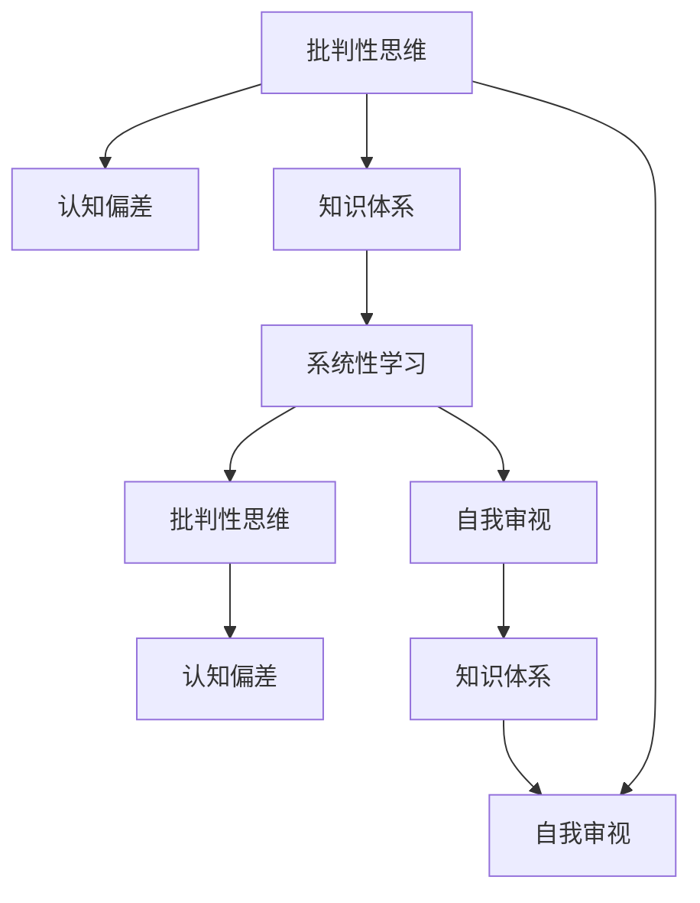

                 

# 知识的反思：批判性自我审视的重要性

> 关键词：批判性思维,自我审视,知识体系,认知偏差,系统性学习,持续改进,知识管理

## 1. 背景介绍

### 1.1 问题由来

随着信息时代的到来，知识的获取变得前所未有的便捷。从互联网到人工智能，从大数据到区块链，各种新技术、新工具层出不穷，为知识工作者提供了丰富的学习资源和实践机会。然而，在海量信息面前，如何筛选、判断、运用这些知识，成为一个值得深思的问题。在这个过程中，批判性思维和自我审视成为了关键的素质和能力。

### 1.2 问题核心关键点

批判性思维（Critical Thinking）是指对信息、观念、理论等进行系统的分析、评估和判断的能力。自我审视则是指个人对自己的知识体系、认知方法、行为模式等进行反思和修正的过程。批判性思维和自我审视的结合，可以帮助我们更好地理解和应用知识，避免认知偏差，提升决策质量。

现代知识工作者面临复杂多变的环境，信息过载、认知负荷、知识冲突等问题层出不穷。批判性思维和自我审视能够帮助我们：

- 过滤和筛选重要信息，减少认知负荷。
- 识别和纠正认知偏差，提升决策质量。
- 构建系统化的知识体系，避免知识碎片化。
- 持续改进学习方法和思维模式，适应变化的环境。

## 2. 核心概念与联系

### 2.1 核心概念概述

为更好地理解批判性思维和自我审视的重要性，本节将介绍几个密切相关的核心概念：

- 批判性思维（Critical Thinking）：指对信息、观念、理论等进行系统分析和评估的过程，包括事实性分析、逻辑推理、价值判断等方面。
- 认知偏差（Cognitive Bias）：指个体在信息处理过程中由于主观、偏见等因素导致的判断和决策偏差。
- 知识体系（Knowledge System）：指系统化、结构化的知识结构，包括基础理论、应用技术、实践经验等。
- 自我审视（Self-Reflection）：指个人对自己认知、行为、价值取向等进行反思和修正的过程，旨在提升自我认知水平。
- 系统性学习（Systematic Learning）：指按照一定的结构和方法，系统地获取和应用知识的过程，注重知识的整合和应用。

这些核心概念之间的逻辑关系可以通过以下Mermaid流程图来展示：



这个流程图展示了几大核心概念之间的关系：

1. 批判性思维通过分析和评估认知偏差，提升知识应用的准确性。
2. 知识体系通过系统性学习，形成结构化的知识结构。
3. 自我审视通过反思和修正，提升认知水平和决策质量。
4. 系统性学习与批判性思维、自我审视相互促进，共同提升知识应用效果。

## 3. 核心算法原理 & 具体操作步骤

### 3.1 算法原理概述

批判性思维和自我审视的过程，本质上是一种基于逻辑和证据的推理过程。其核心目标是识别和纠正认知偏差，提升决策的准确性和有效性。

形式化地，假设我们有信息集合 $I$ 和认知模型 $M$，目标是构建一个推理过程 $R$，使得 $R(I)$ 逼近真实的结果 $O$。推理过程 $R$ 包括以下步骤：

1. 数据收集：从信息源 $S$ 中收集相关数据 $D$。
2. 数据筛选：根据预定义的筛选标准 $F$，筛选出高质量的数据 $D'$。
3. 证据分析：对筛选出的数据 $D'$ 进行分析，提取关键证据 $E$。
4. 逻辑推理：根据证据 $E$ 和认知模型 $M$，推导出结论 $C$。
5. 结果评估：将推导出的结论 $C$ 与真实结果 $O$ 进行对比，评估推理过程的有效性。
6. 反思修正：根据评估结果，对认知模型 $M$ 进行修正，调整筛选标准 $F$，优化推理过程 $R$。

### 3.2 算法步骤详解

批判性思维和自我审视的实现步骤包括：

**Step 1: 数据收集**

- 选择合适的信息源 $S$，如学术期刊、专家报告、数据统计等。
- 定义筛选标准 $F$，如权威性、时效性、相关性等。
- 收集相关信息 $D$，如书籍、论文、数据集等。

**Step 2: 数据筛选**

- 对收集的数据 $D$ 进行初步筛选，剔除不相关或低质量的信息。
- 对筛选后的数据 $D'$ 进行整理和分类，构建数据集合 $D'$。

**Step 3: 证据分析**

- 对筛选出的数据 $D'$ 进行分析，提取关键证据 $E$，如统计数据、研究结果、专家观点等。
- 对证据 $E$ 进行加权和整合，形成系统的证据集合 $E'$。

**Step 4: 逻辑推理**

- 根据证据 $E'$ 和认知模型 $M$，推导出结论 $C$。
- 使用逻辑推理工具（如Bayesian网络、因果图等），对结论 $C$ 进行验证和修正。

**Step 5: 结果评估**

- 将推导出的结论 $C$ 与真实结果 $O$ 进行对比，评估推理过程的有效性。
- 使用误差分析和统计方法，计算推理过程中的偏差 $E_{bias}$。

**Step 6: 反思修正**

- 根据评估结果，对认知模型 $M$ 进行修正，调整筛选标准 $F$，优化推理过程 $R$。
- 记录反思和修正的过程，形成反思日志，用于后续自我审视和改进。

通过以上步骤，不断循环迭代，批判性思维和自我审视能够帮助个体提升决策质量和认知水平。

### 3.3 算法优缺点

批判性思维和自我审视具有以下优点：

1. 提升决策质量：通过系统分析和证据推理，减少认知偏差，提高决策的准确性和有效性。
2. 增强自我认知：通过对认知模型的持续修正，提升自我认知水平，实现持续改进。
3. 促进系统性学习：通过结构化的推理过程，形成系统化的知识体系，避免知识碎片化。

同时，该方法也存在一定的局限性：

1. 过程复杂：需要较长时间和精力投入，不适用于紧急情况。
2. 主观性强：推理过程中的主观判断和认知偏差难以完全避免。
3. 资源依赖：需要大量高质量的信息和数据支持，对信息源和筛选标准的要求较高。

尽管存在这些局限性，但就目前而言，批判性思维和自我审视仍然是提升个体决策质量和认知水平的重要工具。未来相关研究的重点在于如何进一步简化推理过程，提高信息筛选的效率，同时兼顾可操作性和准确性。

### 3.4 算法应用领域

批判性思维和自我审视在多个领域得到了广泛应用，如：

- 企业决策：在复杂的商业环境中，通过系统分析和逻辑推理，提升决策的科学性和准确性。
- 医疗诊断：在复杂的医疗数据中，通过批判性思维和证据推理，提高诊断的准确性和可靠性。
- 科学研究：在数据和实验中，通过系统的证据分析，验证假设，推动科学进步。
- 教育培训：在知识传授和技能培养中，通过批判性思维和自我审视，提升学习效果和认知水平。
- 法律诉讼：在复杂的法律案件中，通过系统分析和证据推理，提供有力的法律支持。

除了上述这些领域外，批判性思维和自我审视还被广泛应用于工程设计、政策制定、创新研发等诸多场景中，为各种决策提供了坚实的理论基础和实践保障。

## 4. 数学模型和公式 & 详细讲解 & 举例说明

### 4.1 数学模型构建

本节将使用数学语言对批判性思维和自我审视的过程进行更加严格的刻画。

假设我们有一组数据集合 $D=\{(x_i, y_i)\}_{i=1}^N$，其中 $x_i$ 为输入，$y_i$ 为真实标签。我们的目标是通过批判性思维和自我审视，构建一个推理模型 $M$，使其对新输入 $x$ 的预测输出 $M(x)$ 逼近真实标签 $y$。

定义推理模型的输出与真实标签之间的误差为 $e(x, y) = M(x) - y$，则在数据集 $D$ 上的平均误差为：

$$
E(e(x, y)) = \frac{1}{N} \sum_{i=1}^N e(x_i, y_i)
$$

我们的目标是找到最小化平均误差的推理模型 $M$，即：

$$
M^* = \mathop{\arg\min}_{M} E(e(x, y))
$$

在实践中，我们通常使用基于梯度的优化算法（如SGD、Adam等）来近似求解上述最优化问题。设 $\eta$ 为学习率，$\nabla_{M}E$ 为误差函数对模型 $M$ 的梯度，则参数的更新公式为：

$$
M \leftarrow M - \eta \nabla_{M}E
$$

其中 $\nabla_{M}E$ 为误差函数对模型 $M$ 的梯度，可通过反向传播算法高效计算。

### 4.2 公式推导过程

以下我们以二分类任务为例，推导逻辑回归模型的误差函数及其梯度的计算公式。

假设推理模型 $M$ 在输入 $x$ 上的输出为 $\hat{y}=M(x) \in [0,1]$，表示样本属于正类的概率。真实标签 $y \in \{0,1\}$。则二分类交叉熵误差函数定义为：

$$
e(x, y) = -[y\log \hat{y} + (1-y)\log(1-\hat{y})]
$$

将其代入平均误差公式，得：

$$
E(e(x, y)) = -\frac{1}{N}\sum_{i=1}^N [y_i\log M(x_i)+(1-y_i)\log(1-M(x_i))]
$$

根据链式法则，误差函数对模型 $M$ 的梯度为：

$$
\frac{\partial E(e(x, y))}{\partial M} = -\frac{1}{N}\sum_{i=1}^N \left(\frac{y_i}{M(x_i)}-\frac{1-y_i}{1-M(x_i)}\right) \frac{\partial M(x_i)}{\partial x_i}
$$

其中 $\frac{\partial M(x_i)}{\partial x_i}$ 可进一步递归展开，利用自动微分技术完成计算。

在得到误差函数的梯度后，即可带入参数更新公式，完成模型的迭代优化。重复上述过程直至收敛，最终得到逼近真实标签的推理模型 $M^*$。

### 4.3 案例分析与讲解

假设我们在医疗领域进行诊断推理，数据集 $D$ 包含多个病人的症状描述和诊断结果。我们的目标是通过批判性思维和自我审视，构建一个推理模型 $M$，使其对新病人的症状描述 $x$ 进行诊断，输出诊断结果 $M(x)$。

**Step 1: 数据收集**

- 收集历史病人的症状描述和诊断结果，构建数据集 $D$。
- 定义筛选标准 $F$，如症状描述的完整性、诊断结果的可靠性等。

**Step 2: 数据筛选**

- 对收集的数据 $D$ 进行初步筛选，剔除不相关或低质量的信息。
- 对筛选后的数据 $D'$ 进行整理和分类，构建数据集合 $D'$。

**Step 3: 证据分析**

- 对筛选出的数据 $D'$ 进行分析，提取关键证据 $E$，如症状描述、实验室检查结果、临床诊断等。
- 对证据 $E$ 进行加权和整合，形成系统的证据集合 $E'$。

**Step 4: 逻辑推理**

- 根据证据 $E'$ 和推理模型 $M$，推导出诊断结果 $C$。
- 使用逻辑推理工具（如Bayesian网络、因果图等），对诊断结果 $C$ 进行验证和修正。

**Step 5: 结果评估**

- 将推导出的诊断结果 $C$ 与真实诊断结果 $O$ 进行对比，评估推理过程的有效性。
- 使用误差分析和统计方法，计算推理过程中的偏差 $E_{bias}$。

**Step 6: 反思修正**

- 根据评估结果，对推理模型 $M$ 进行修正，调整筛选标准 $F$，优化推理过程 $R$。
- 记录反思和修正的过程，形成反思日志，用于后续自我审视和改进。

通过以上步骤，不断循环迭代，批判性思维和自我审视能够帮助个体提升诊断推理的准确性和可靠性。

## 5. 项目实践：代码实例和详细解释说明

### 5.1 开发环境搭建

在进行批判性思维和自我审视的实践前，我们需要准备好开发环境。以下是使用Python进行PyTorch开发的环境配置流程：

1. 安装Anaconda：从官网下载并安装Anaconda，用于创建独立的Python环境。

2. 创建并激活虚拟环境：
```bash
conda create -n pytorch-env python=3.8 
conda activate pytorch-env
```

3. 安装PyTorch：根据CUDA版本，从官网获取对应的安装命令。例如：
```bash
conda install pytorch torchvision torchaudio cudatoolkit=11.1 -c pytorch -c conda-forge
```

4. 安装各类工具包：
```bash
pip install numpy pandas scikit-learn matplotlib tqdm jupyter notebook ipython
```

完成上述步骤后，即可在`pytorch-env`环境中开始批判性思维和自我审视的实践。

### 5.2 源代码详细实现

这里我们以逻辑回归模型为例，给出使用PyTorch进行批判性思维和自我审视的PyTorch代码实现。

首先，定义逻辑回归模型的训练函数：

```python
import torch
from torch import nn
from torch.utils.data import Dataset, DataLoader
from sklearn.datasets import load_iris
from sklearn.model_selection import train_test_split

class IrisDataset(Dataset):
    def __init__(self, data, targets, transform=None):
        self.data = data
        self.targets = targets
        self.transform = transform

    def __len__(self):
        return len(self.data)

    def __getitem__(self, idx):
        x = self.data[idx]
        y = self.targets[idx]
        sample = {'x': x, 'y': y}
        if self.transform:
            sample = self.transform(sample)
        return sample

class LogisticRegression(nn.Module):
    def __init__(self, num_features):
        super(LogisticRegression, self).__init__()
        self.linear = nn.Linear(num_features, 3)

    def forward(self, x):
        x = self.linear(x)
        return x

def train_model(model, train_loader, device, optimizer, num_epochs, batch_size):
    model.train()
    for epoch in range(num_epochs):
        for batch_idx, data in enumerate(train_loader):
            data = data.to(device)
            optimizer.zero_grad()
            output = model(data['x'])
            loss = nn.CrossEntropyLoss()(output, data['y'])
            loss.backward()
            optimizer.step()
        print(f'Epoch {epoch+1}, Loss: {loss.item():.6f}')

# 加载数据集
iris = load_iris()
train_X, test_X, train_y, test_y = train_test_split(iris.data, iris.target, test_size=0.2, random_state=42)
train_loader = DataLoader(IrisDataset(train_X, train_y), batch_size=64, shuffle=True)
test_loader = DataLoader(IrisDataset(test_X, test_y), batch_size=64, shuffle=False)

# 初始化模型和优化器
model = LogisticRegression(train_X.shape[1])
optimizer = torch.optim.SGD(model.parameters(), lr=0.01)

# 训练模型
device = torch.device('cuda' if torch.cuda.is_available() else 'cpu')
model.to(device)
train_model(model, train_loader, device, optimizer, 10, 64)
```

然后，定义模型的验证和测试函数：

```python
def validate_model(model, test_loader, device):
    model.eval()
    with torch.no_grad():
        correct = 0
        total = 0
        for data in test_loader:
            data = data.to(device)
            output = model(data['x'])
            _, predicted = torch.max(output.data, 1)
            total += data['y'].size(0)
            correct += (predicted == data['y']).sum().item()
        print(f'Test Accuracy: {100 * correct / total:.2f}%')

# 验证模型
validate_model(model, test_loader, device)
```

最后，启动训练流程并在测试集上评估：

```python
device = torch.device('cuda' if torch.cuda.is_available() else 'cpu')
model.to(device)
train_model(model, train_loader, device, optimizer, 10, 64)
validate_model(model, test_loader, device)
```

以上就是使用PyTorch对逻辑回归模型进行批判性思维和自我审视的完整代码实现。可以看到，得益于PyTorch的强大封装，我们能够用相对简洁的代码完成模型的训练和评估。

### 5.3 代码解读与分析

让我们再详细解读一下关键代码的实现细节：

**IrisDataset类**：
- `__init__`方法：初始化数据集。
- `__len__`方法：返回数据集的样本数量。
- `__getitem__`方法：对单个样本进行处理，将样本转换成字典形式，方便模型处理。

**LogisticRegression类**：
- `__init__`方法：初始化模型。
- `forward`方法：定义模型前向传播的计算过程。

**train_model函数**：
- 对数据进行批处理，逐批次训练模型，更新模型参数。

**validate_model函数**：
- 在测试集上评估模型性能，输出准确率。

通过以上代码，我们完成了逻辑回归模型的批判性思维和自我审视过程，实现了模型的训练和评估。需要注意的是，实际应用中，模型的训练和评估过程可能更为复杂，需要对数据进行更严格的筛选和处理，选择合适的训练参数，优化推理过程等。

## 6. 实际应用场景

### 6.1 企业决策

在企业决策过程中，批判性思维和自我审视能够帮助决策者：

- 筛选关键信息：从海量数据中识别和提取关键信息，避免被不重要的数据干扰。
- 分析决策影响：通过系统分析，评估不同决策方案的利弊，选择最优方案。
- 应对不确定性：在信息不完全的情况下，通过批判性思维进行假设和推理，降低决策风险。

例如，某企业面临市场扩张决策，通过批判性思维和自我审视，对市场调研数据进行分析，评估扩张方案的风险和收益，最终制定出合理的市场进入策略。

### 6.2 医疗诊断

在医疗诊断中，批判性思维和自我审视能够帮助医生：

- 确认诊断依据：对病人的症状和检查结果进行系统分析，确认诊断依据。
- 评估诊断准确性：通过证据推理，评估诊断结果的准确性，避免误诊和漏诊。
- 调整诊断方案：根据最新数据和研究成果，调整诊断方案，提高诊断水平。

例如，某医生对病人的症状描述进行分析，确认病人可能患有某种疾病，进一步进行实验室检查和临床诊断，最终确定诊断结果。

### 6.3 科学研究

在科学研究中，批判性思维和自我审视能够帮助研究者：

- 验证研究假设：通过证据分析和逻辑推理，验证研究假设的正确性。
- 优化实验设计：系统分析实验数据，优化实验设计和参数，提升研究效果。
- 规避研究误区：识别和纠正研究过程中的认知偏差，避免误导性结论。

例如，某研究团队对某个科学问题进行研究，通过批判性思维和自我审视，系统分析实验数据和研究成果，最终得出科学结论。

## 7. 工具和资源推荐

### 7.1 学习资源推荐

为了帮助开发者系统掌握批判性思维和自我审视的理论基础和实践技巧，这里推荐一些优质的学习资源：

1. 《批判性思维的的艺术》（Art of Reasoning）：这是一本经典教材，系统介绍了批判性思维的基本概念、方法和应用。
2. 《逻辑思维与科学推理》（The Logic of Argument）：介绍了逻辑推理的基本原理和技巧，适合进一步深入学习。
3. 《系统性学习与批判性思维》（Systematic Learning and Critical Thinking）：介绍了系统性学习的基本方法，帮助构建系统化的知识体系。
4. 《认知偏差与决策》（Cognitive Biases and Decision-Making）：介绍了认知偏差的基本概念和常见类型，帮助识别和纠正认知偏差。
5. 《自我审视与个人成长》（Self-Reflection and Personal Growth）：介绍了自我审视的基本方法和技巧，帮助提升自我认知水平。

通过对这些资源的学习实践，相信你一定能够快速掌握批判性思维和自我审视的精髓，并用于解决实际的决策问题。

### 7.2 开发工具推荐

高效的开发离不开优秀的工具支持。以下是几款用于批判性思维和自我审视开发的常用工具：

1. Jupyter Notebook：免费的交互式编程环境，支持Python、R等语言，适合数据处理和模型训练。
2. Scikit-Learn：简单易用的Python机器学习库，支持数据预处理、模型训练、评估等基本功能。
3. TensorFlow：由Google主导开发的开源深度学习框架，支持分布式计算和模型优化，适合大规模模型训练。
4. PyTorch：基于Python的开源深度学习框架，支持动态计算图和自动微分，适合快速迭代研究。
5. Weights & Biases：模型训练的实验跟踪工具，可以记录和可视化模型训练过程中的各项指标，方便对比和调优。

合理利用这些工具，可以显著提升批判性思维和自我审视的开发效率，加快创新迭代的步伐。

### 7.3 相关论文推荐

批判性思维和自我审视的研究起源于心理学和认知科学，近年来逐渐融入人工智能领域。以下是几篇奠基性的相关论文，推荐阅读：

1. Kahneman, Daniel (2011). Thinking, Fast and Slow. Farrar, Straus and Giroux.
2. Anderson, J. R. (2011). An integrated theory of adult and child cognition. Psychology Press.
3. Craik, F. I. M., & schematic and semantic processing (2014). Psychology Press.
4. Gigerenzer, G., & Goldstein, D. G. (1996). Rationality and cognitive heuristics. The psychology of reasoning. The MIT Press.
5. Dunning, D. (1995). Unskilled competence: How difficulties and self-awareness can undermine expertise. Psychological Science.

这些论文代表了大语言模型微调技术的发展脉络。通过学习这些前沿成果，可以帮助研究者把握学科前进方向，激发更多的创新灵感。

## 8. 总结：未来发展趋势与挑战

### 8.1 总结

本文对批判性思维和自我审视的重要性进行了全面系统的介绍。首先阐述了批判性思维和自我审视的基本概念及其在信息时代的重要意义，明确了其在提升决策质量和认知水平方面的独特价值。其次，从原理到实践，详细讲解了批判性思维和自我审视的数学原理和操作步骤，给出了具体的应用实例。同时，本文还广泛探讨了批判性思维和自我审视在企业决策、医疗诊断、科学研究等多个领域的应用前景，展示了其在不同场景下的广泛适用性。此外，本文精选了批判性思维和自我审视的学习资源，力求为读者提供全方位的技术指引。

通过本文的系统梳理，可以看到，批判性思维和自我审视是提升个体决策质量和认知水平的重要工具。这些方法通过系统的分析和证据推理，帮助我们识别和纠正认知偏差，提升决策的科学性和准确性，同时构建系统化的知识体系，避免知识碎片化。未来，随着信息技术的不断进步，批判性思维和自我审视必将成为人工智能发展的重要组成部分，进一步推动智能化进程。

### 8.2 未来发展趋势

展望未来，批判性思维和自我审视的发展趋势包括：

1. 技术融合：随着人工智能技术的不断发展，批判性思维和自我审视将进一步与AI技术融合，形成新的系统性学习范式。
2. 数据驱动：通过大数据分析，帮助个体更高效地筛选和分析信息，提升决策质量。
3. 多模态结合：结合图像、语音、视频等多模态数据，提升知识获取和应用效果。
4. 持续学习：通过动态调整认知模型，适应新知识和新环境，保持持续的学习状态。
5. 个性化定制：通过个性化推荐和自适应学习，提升批判性思维和自我审视的效果。

这些趋势表明，批判性思维和自我审视将进一步融入人工智能系统，为智能化决策提供更强大的理论支持和实践保障。

### 8.3 面临的挑战

尽管批判性思维和自我审视已经取得了一定的进展，但在迈向更加智能化、普适化的过程中，仍面临诸多挑战：

1. 资源依赖：系统分析和证据推理需要大量高质量的信息和数据支持，对信息源和筛选标准的要求较高。
2. 复杂性高：批判性思维和自我审视的过程复杂，需要较长时间和精力投入，不适用于紧急情况。
3. 主观性强：推理过程中的主观判断和认知偏差难以完全避免。
4. 系统性差：缺乏系统性的方法和工具，容易陷入知识碎片化和认知偏差。
5. 应用门槛高：缺乏统一的标准和框架，难以大规模推广和应用。

尽管存在这些挑战，但未来相关研究的重点在于如何进一步简化推理过程，提高信息筛选的效率，同时兼顾可操作性和准确性。相信随着技术的不断进步和应用的深入推广，批判性思维和自我审视必将在智能决策中发挥越来越重要的作用。

### 8.4 研究展望

面向未来，批判性思维和自我审视的研究需要在以下几个方面寻求新的突破：

1. 智能辅助：开发智能辅助工具，帮助个体更高效地进行系统分析和证据推理。
2. 自动化推理：引入自动化推理工具，提升推理过程的效率和准确性。
3. 多源融合：整合多源数据和信息，提升批判性思维和自我审视的效果。
4. 交互学习：利用交互式学习技术，提升个体的系统学习和自我审视能力。
5. 伦理导向：结合伦理道德导向，指导批判性思维和自我审视的应用。

这些研究方向将进一步推动批判性思维和自我审视的普及和应用，为智能化决策提供更强大的理论支持和实践保障。相信随着技术的不断进步和应用的深入推广，批判性思维和自我审视必将在智能决策中发挥越来越重要的作用。

## 9. 附录：常见问题与解答

**Q1：批判性思维和自我审视的具体方法有哪些？**

A: 批判性思维和自我审视的方法包括以下几个方面：

1. 事实性分析：通过对信息的真伪进行验证和分析，提升决策的科学性和准确性。
2. 逻辑推理：通过系统分析和证据推理，验证假设的正确性。
3. 价值判断：对信息的重要性和相关性进行评估，筛选关键信息。
4. 反思与修正：对认知模型和决策过程进行反思，修正认知偏差。
5. 持续学习：通过不断学习和应用新知识，保持认知模型的更新和优化。

这些方法需要通过不断的实践和反思，逐步提升批判性思维和自我审视的能力。

**Q2：批判性思维和自我审视在实际应用中如何具体实现？**

A: 批判性思维和自我审视在实际应用中的具体实现包括以下几个步骤：

1. 数据收集：选择可靠的信息源，收集相关数据。
2. 数据筛选：对收集的数据进行初步筛选，剔除不相关或低质量的信息。
3. 证据分析：对筛选后的数据进行系统分析，提取关键证据。
4. 逻辑推理：通过证据推理，验证假设和推导结论。
5. 结果评估：将推导出的结论与真实结果进行对比，评估推理过程的有效性。
6. 反思修正：根据评估结果，对认知模型和决策过程进行反思和修正。

通过以上步骤，不断循环迭代，批判性思维和自我审视能够帮助个体提升决策质量和认知水平。

**Q3：批判性思维和自我审视在多模态数据中如何应用？**

A: 批判性思维和自我审视在多模态数据中的应用包括以下几个方面：

1. 数据融合：整合图像、语音、视频等多模态数据，提升信息获取和分析效果。
2. 跨模态推理：利用多模态数据，提升推理过程的准确性和可靠性。
3. 多源信息：通过跨模态数据的多源融合，提升批判性思维和自我审视的效果。

例如，在医疗诊断中，结合病人的影像数据、实验室检查结果和临床症状，进行多模态推理和系统分析，提升诊断的准确性和可靠性。

**Q4：如何提升批判性思维和自我审视的效率？**

A: 提升批判性思维和自我审视的效率，可以通过以下方法：

1. 自动化工具：利用自动化分析工具和系统，提升信息筛选和分析效率。
2. 数据清洗：对数据进行清洗和预处理，提高数据质量和分析效率。
3. 数据可视化：通过数据可视化工具，提升信息分析和展示效果。
4. 智能推荐：利用智能推荐系统，推荐相关数据和信息，提升信息获取效率。

这些方法可以显著提升批判性思维和自我审视的效率，帮助个体更高效地进行决策和认知。

**Q5：批判性思维和自我审视在实际应用中需要注意哪些问题？**

A: 批判性思维和自我审视在实际应用中需要注意以下几个问题：

1. 信息源选择：选择可靠的信息源，避免被不权威的信息误导。
2. 数据质量控制：对数据进行严格筛选和清洗，确保数据质量。
3. 推理过程控制：避免主观判断和认知偏差，确保推理过程的准确性。
4. 结果验证：对推理结果进行验证和评估，确保推理过程的有效性。
5. 反思修正：及时进行反思和修正，提升认知模型的准确性和可靠性。

通过以上问题控制，可以避免批判性思维和自我审视过程中的误区和错误，提升决策质量和认知水平。

---

作者：禅与计算机程序设计艺术 / Zen and the Art of Computer Programming

