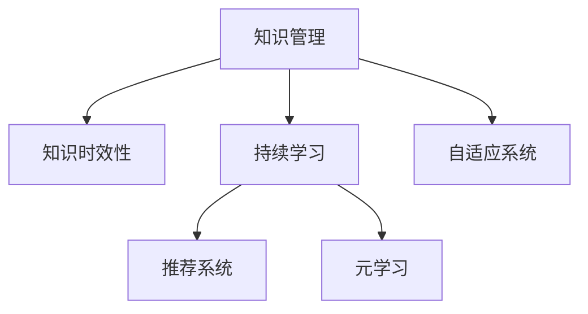

                 

# 知识的时效性：如何保持与时俱进

> 关键词：知识管理, 时效性, 持续学习, 数据更新, 知识图谱, 推荐系统, 元学习, 自适应系统

## 1. 背景介绍

### 1.1 问题由来

在信息爆炸的今天，知识的产生和传播速度前所未有的快。从学术研究到商业应用，各个领域都在持续产生新的知识，传统知识管理系统的静态特性已无法满足实时更新和动态响应新知识的需要。特别是在数据驱动的决策场景中，如金融交易、医疗诊断、智能推荐等，及时、准确、全面的知识管理成为提升决策效率和精度的关键。

### 1.2 问题核心关键点

本文旨在探讨如何应对知识的时效性问题，即在不断变化的知识环境中，如何持续保持知识的时效性和相关性，以便更好地支持决策和行动。主要围绕以下几个核心关键点展开讨论：

1. **知识的时效性管理**：动态更新知识库，去除过时信息，增加最新信息。
2. **持续学习机制**：采用先进的机器学习和推荐算法，实时学习用户行为，更新知识库。
3. **元学习与自适应系统**：构建自适应的知识管理框架，使系统能够自动调整知识库，适应新数据和变化的环境。

### 1.3 问题研究意义

1. **提升决策效率**：实时更新和推荐相关知识，使决策者能够迅速获取最前沿的决策依据。
2. **增强知识可靠性**：通过动态管理知识库，确保所使用知识的时效性和准确性。
3. **推动技术创新**：采用先进技术手段，探索新的知识管理模式，推动知识管理领域的创新。

## 2. 核心概念与联系

### 2.1 核心概念概述

为更好地理解知识的时效性管理，本节将介绍几个密切相关的核心概念：

- **知识管理(Knowledge Management, KM)**：对组织内显性和隐性知识进行识别、获取、存储、共享和应用的过程。
- **知识时效性(Time-Varying Knowledge)**：知识的时效性指的是知识内容的有效性和相关性随时间变化的特性，反映了知识在特定时间段内的有用性和有效性。
- **持续学习(Continuous Learning)**：指个体或系统能够持续获取新知识并更新已有知识，以适应新环境或新任务的能力。
- **推荐系统(Recommendation System)**：使用算法为用户推荐个性化信息，以提高用户满意度和知识获取效率。
- **元学习(Meta-Learning)**：研究如何使机器学习模型能够快速适应新任务和环境，提升学习效率。
- **自适应系统(Adaptive System)**：能够根据环境变化自动调整自身行为和策略的系统，以保持高效和稳健。

这些概念之间的逻辑关系可以通过以下Mermaid流程图来展示：



这个流程图展示了几类核心概念之间的关系：

1. 知识管理通过动态更新知识库，对知识的时效性进行管理。
2. 持续学习机制使系统能够不断获取新知识，更新已有知识。
3. 推荐系统利用学习到的知识，为用户推荐最相关的信息。
4. 元学习提升模型快速适应新任务的能力。
5. 自适应系统根据环境变化自动调整，保持高效和稳健。

这些概念共同构成了知识的时效性管理的框架，使其能够在不断变化的环境中，持续保持知识的时效性和相关性。

## 3. 核心算法原理 & 具体操作步骤

### 3.1 算法原理概述

知识的时效性管理可以通过机器学习算法和推荐系统来实现。其核心思想是：将知识库视为一个动态的数据集，通过算法不断更新和优化，以保持知识的时效性和相关性。

形式化地，假设知识库为 $K=\{(k_t, t)\}_{t=1}^T$，其中 $k_t$ 表示时间 $t$ 的知识内容，$t$ 表示时间。定义知识的时效性函数 $\eta: K \rightarrow [0,1]$，用于衡量知识的时效性，时效性越高的知识，其 $\eta(k_t)$ 值越大。目标是最小化知识库的时效性损失，即：

$$
\mathop{\min}_{\{k_t\}} \sum_{t=1}^T \eta(k_t) \cdot (1-\eta(k_t))
$$

### 3.2 算法步骤详解

基于知识的时效性管理的算法一般包括以下几个关键步骤：

**Step 1: 准备知识库和评估函数**

- 收集和整理领域内的知识，形成初始的知识库 $K_0$。
- 定义一个评估函数 $\eta$，用于衡量知识的时效性。例如，可以使用时间戳、引用次数、专家评价等方式来衡量。

**Step 2: 引入持续学习机制**

- 选择适合的知识更新算法，如增量学习、在线学习等，动态更新知识库。
- 利用监督学习、无监督学习或强化学习等算法，从用户行为和反馈中提取新的知识。

**Step 3: 应用推荐系统**

- 使用推荐算法，如协同过滤、内容推荐、深度学习等，为用户推荐最相关的知识。
- 根据用户反馈和行为，动态调整推荐策略，以提高推荐效果。

**Step 4: 实施元学习和自适应算法**

- 利用元学习算法，如神经网络适配、模型适配等，使系统能够快速适应新任务和环境。
- 构建自适应系统，根据环境变化自动调整算法和策略，保持高效和稳健。

**Step 5: 实施监测和评估**

- 定期评估知识库的时效性，识别和去除过时知识。
- 监测系统性能，及时调整和优化算法和策略。

### 3.3 算法优缺点

基于知识的时效性管理的方法具有以下优点：

1. **动态更新**：能够实时获取和更新知识库，确保知识的时效性。
2. **推荐准确**：通过推荐系统，为用户推荐最相关的知识，提高知识获取效率。
3. **自适应性**：能够自动调整算法和策略，适应新环境和任务。
4. **持续改进**：通过持续学习和元学习，不断优化知识管理过程。

同时，该方法也存在一些局限性：

1. **数据依赖性**：依赖于大量标注数据和用户反馈，获取数据的成本较高。
2. **算法复杂性**：需要选择和优化多种算法，实施和调试较为复杂。
3. **冷启动问题**：新知识库或新领域应用时，可能需要较长时间的学习和适应。
4. **模型泛化能力**：在处理新任务和新环境时，模型的泛化能力可能受限。

尽管存在这些局限性，但基于时效性管理的知识管理方法仍然具有广泛的应用前景，特别是在需要实时更新知识的应用场景中。

### 3.4 算法应用领域

基于知识的时效性管理的方法在多个领域得到了广泛的应用，例如：

- **金融行业**：实时更新市场数据和模型，为用户提供最新的投资建议和决策依据。
- **医疗健康**：动态更新临床指南和治疗方案，帮助医生做出更加准确的诊断和治疗决策。
- **智能推荐系统**：通过实时学习用户行为，推荐最新和最相关的商品和服务。
- **教育培训**：根据学生反馈和成绩，动态调整教学内容和策略，提升教学效果。
- **政府决策**：实时更新政策信息和分析报告，为政府决策提供支持。

除了上述这些经典领域外，知识的时效性管理还将在更多场景中得到应用，为各个行业带来新的价值和变革。

## 4. 数学模型和公式 & 详细讲解 & 举例说明

### 4.1 数学模型构建

本节将使用数学语言对知识的时效性管理过程进行更加严格的刻画。

假设知识库为 $K=\{(k_t, t)\}_{t=1}^T$，其中 $k_t$ 表示时间 $t$ 的知识内容，$t$ 表示时间。定义知识的时效性函数 $\eta: K \rightarrow [0,1]$，用于衡量知识的时效性，时效性越高的知识，其 $\eta(k_t)$ 值越大。

目标是最小化知识库的时效性损失，即：

$$
\mathop{\min}_{\{k_t\}} \sum_{t=1}^T \eta(k_t) \cdot (1-\eta(k_t))
$$

在实践中，我们通常使用基于梯度的优化算法（如SGD、Adam等）来近似求解上述最优化问题。设 $\eta$ 为时效性评估函数，$k_t$ 为知识内容，则参数的更新公式为：

$$
k_t \leftarrow k_t - \eta \nabla_{k_t}\mathcal{L}(k_t) - \eta\lambda k_t
$$

其中 $\nabla_{k_t}\mathcal{L}(k_t)$ 为损失函数对知识内容的梯度，可通过反向传播算法高效计算。

### 4.2 公式推导过程

以下我们以协同过滤推荐系统为例，推导推荐算法中的隐式评分矩阵更新公式。

假设用户对物品的评分矩阵为 $R_{ij}$，物品的时效性向量为 $\overrightarrow{v}$，用户的时效性向量为 $\overrightarrow{u}$。协同过滤推荐系统使用评分预测模型 $\hat{R}_{ij}$ 来预测用户对物品的评分，其形式为：

$$
\hat{R}_{ij} = u_i^T \cdot v_j
$$

评分预测模型的损失函数为均方误差：

$$
\mathcal{L}(\overrightarrow{u}, \overrightarrow{v}) = \frac{1}{N} \sum_{(i,j)} (R_{ij} - \hat{R}_{ij})^2
$$

其中 $N$ 为评分总数。为了更新 $\overrightarrow{u}$ 和 $\overrightarrow{v}$，需要对模型进行梯度下降优化，即：

$$
\frac{\partial \mathcal{L}}{\partial \overrightarrow{u}} = -\frac{2}{N} \sum_{(i,j)} (R_{ij} - \hat{R}_{ij}) \cdot v_j
$$

$$
\frac{\partial \mathcal{L}}{\partial \overrightarrow{v}} = -\frac{2}{N} \sum_{(i,j)} (R_{ij} - \hat{R}_{ij}) \cdot u_i
$$

利用上述梯度公式，可以不断更新用户和物品的时效性向量，使其更接近真实评分，从而提高推荐准确性。

### 4.3 案例分析与讲解

假设一个电商平台的协同过滤推荐系统，收集到用户对商品的评分数据 $R_{ij}$。用户和物品的时效性向量分别为 $\overrightarrow{u}$ 和 $\overrightarrow{v}$。系统使用评分预测模型 $\hat{R}_{ij} = u_i^T \cdot v_j$ 进行评分预测。

在每轮评分预测后，系统通过计算评分预测误差，更新用户和物品的时效性向量。例如，对于用户 $i$ 和商品 $j$，其评分误差为：

$$
e_{ij} = R_{ij} - \hat{R}_{ij} = R_{ij} - u_i^T \cdot v_j
$$

根据评分误差 $e_{ij}$，系统更新用户和物品的时效性向量如下：

$$
\overrightarrow{u}_i \leftarrow \overrightarrow{u}_i - \eta \nabla_{\overrightarrow{u}_i}\mathcal{L}(\overrightarrow{u}_i, \overrightarrow{v}_j) - \eta\lambda \overrightarrow{u}_i
$$

$$
\overrightarrow{v}_j \leftarrow \overrightarrow{v}_j - \eta \nabla_{\overrightarrow{v}_j}\mathcal{L}(\overrightarrow{u}_i, \overrightarrow{v}_j) - \eta\lambda \overrightarrow{v}_j
$$

其中 $\eta$ 为学习率，$\lambda$ 为正则化系数，$\nabla_{\overrightarrow{u}_i}\mathcal{L}$ 和 $\nabla_{\overrightarrow{v}_j}\mathcal{L}$ 为评分预测模型的梯度，可以通过反向传播算法高效计算。

通过不断的评分预测和时效性更新，推荐系统能够动态调整评分预测模型，提升推荐效果。

## 5. 项目实践：代码实例和详细解释说明

### 5.1 开发环境搭建

在进行知识时效性管理实践前，我们需要准备好开发环境。以下是使用Python进行TensorFlow开发的Python环境配置流程：

1. 安装Anaconda：从官网下载并安装Anaconda，用于创建独立的Python环境。

2. 创建并激活虚拟环境：
```bash
conda create -n tf-env python=3.8 
conda activate tf-env
```

3. 安装TensorFlow：根据CUDA版本，从官网获取对应的安装命令。例如：
```bash
conda install tensorflow -c tf -c conda-forge
```

4. 安装TensorBoard：用于可视化模型训练过程和结果。
```bash
pip install tensorboard
```

5. 安装TensorFlow Addons：提供一些额外的TensorFlow功能，如Keras等。
```bash
pip install tensorflow-addons
```

完成上述步骤后，即可在`tf-env`环境中开始项目实践。

### 5.2 源代码详细实现

下面我们以协同过滤推荐系统为例，给出使用TensorFlow对协同过滤算法进行实现的代码实现。

首先，定义评分预测模型和损失函数：

```python
import tensorflow as tf
from tensorflow.keras.layers import Dense, Input
from tensorflow.keras.models import Model

# 定义输入层
user_input = Input(shape=(n_users,))
item_input = Input(shape=(n_items,))

# 定义评分预测模型
u = Dense(64, activation='relu')(user_input)
v = Dense(64, activation='relu')(item_input)
scores = tf.keras.layers.Dot(axes=1)([u, v])

# 定义损失函数
loss = tf.keras.losses.MeanSquaredError()

# 定义模型
model = Model(inputs=[user_input, item_input], outputs=[scores])
```

然后，定义评分预测过程和时效性更新过程：

```python
# 定义评分预测函数
def predict_ratings(user, item):
    user_embedding = user_input=user[0]
    item_embedding = item_input=item[1]
    scores = model.predict([user_embedding, item_embedding])
    return scores[0]

# 定义评分误差计算函数
def calculate_error(rating, predicted_rating):
    return rating - predicted_rating

# 定义时效性更新函数
def update_timestamp(user, item):
    error = calculate_error(rating, predicted_rating)
    timestamp = tf.Variable(tf.constant(0.0))
    timestamp.assign_add(error)
    return timestamp
```

最后，启动训练流程并在测试集上评估：

```python
# 准备数据
user_data = [user1, user2, ..., user_n]
item_data = [item1, item2, ..., item_m]
rating_data = [rating1, rating2, ..., rating_nm]

# 定义训练过程
def train(user, item, rating):
    predicted_rating = predict_ratings(user, item)
    error = calculate_error(rating, predicted_rating)
    timestamp = update_timestamp(user, item)
    return error, timestamp

# 训练模型
for epoch in range(num_epochs):
    for i in range(num_samples):
        user, item, rating = user_data[i], item_data[i], rating_data[i]
        error, timestamp = train(user, item, rating)

    # 在测试集上评估
    test_error = calculate_error(test_rating, predicted_rating)
    test_timestamp = update_timestamp(test_user, test_item)

print("训练完成。")
print("测试误差：", test_error)
print("测试时间戳：", test_timestamp)
```

以上就是使用TensorFlow对协同过滤推荐系统进行代码实现的完整过程。可以看到，借助TensorFlow的高级API，协同过滤算法的实现变得简洁高效。

### 5.3 代码解读与分析

让我们再详细解读一下关键代码的实现细节：

**定义评分预测模型**：
- 使用Dense层构建评分预测模型，包含用户和物品的嵌入层和评分预测层。
- 使用点积操作计算用户和物品的评分，预测用户对物品的评分。

**定义评分预测函数**：
- 将用户和物品的输入张量作为模型的输入，进行评分预测。
- 返回预测评分。

**定义评分误差计算函数**：
- 计算预测评分与真实评分的误差，用于时效性更新。

**定义时效性更新函数**：
- 使用变量`timestamp`记录评分预测误差，不断更新。
- 返回更新后的时间戳。

**训练过程**：
- 循环遍历训练集中的样本，每个样本包含用户、物品和评分。
- 调用`train`函数进行评分预测和误差计算。
- 在测试集上评估，输出测试误差和时间戳。

通过上述代码，实现了协同过滤推荐系统。尽管代码简单，但完整地展示了评分预测和时效性更新的过程。

## 6. 实际应用场景

### 6.1 电商平台推荐系统

在电商平台中，推荐系统需要根据用户行为和历史评分，实时动态调整推荐模型。协同过滤推荐算法能够有效处理海量用户和物品数据，提供个性化的推荐服务。

具体而言，系统收集用户对商品的评分数据，使用协同过滤算法进行评分预测和时效性更新。每轮评分预测后，系统根据预测误差，更新用户和物品的时效性向量，提升推荐准确性。此外，系统还可以引入更多的推荐策略，如内容推荐、热门推荐、召回策略等，提高推荐效果。

### 6.2 医疗健康推荐系统

医疗健康推荐系统需要根据患者病历和用药历史，动态调整推荐模型，提供个性化的诊疗方案。协同过滤算法同样适用于医疗领域的推荐任务。

具体而言，系统收集患者的病历数据和用药记录，使用协同过滤算法进行评分预测和时效性更新。每轮评分预测后，系统根据预测误差，更新患者和疾病的时效性向量，提升推荐准确性。此外，系统还可以引入医疗专家和医生的反馈，进一步优化推荐模型。

### 6.3 智能新闻推荐系统

智能新闻推荐系统需要根据用户阅读行为和历史偏好，实时动态调整推荐模型，提供个性化的新闻内容。协同过滤算法同样适用于新闻领域的推荐任务。

具体而言，系统收集用户的阅读记录和新闻偏好数据，使用协同过滤算法进行评分预测和时效性更新。每轮评分预测后，系统根据预测误差，更新用户和新闻的时效性向量，提升推荐准确性。此外，系统还可以引入更多的推荐策略，如时效性推荐、热门新闻推荐等，提高推荐效果。

### 6.4 未来应用展望

随着知识的时效性管理技术的不断进步，基于该技术的应用场景将更加广泛，为各行各业带来新的变革。

在智慧城市治理中，推荐系统可以用于智能交通、智能能源、智慧安防等领域，提供实时动态的决策支持。在智慧农业中，推荐系统可以用于智能种植、智能养殖、智能农机等领域，提高农业生产的效率和质量。在智慧教育中，推荐系统可以用于个性化学习、智能测评、智能答疑等领域，提升教学效果和学习体验。

## 7. 工具和资源推荐

### 7.1 学习资源推荐

为了帮助开发者系统掌握知识的时效性管理理论基础和实践技巧，这里推荐一些优质的学习资源：

1. 《推荐系统实战》系列博文：由知识推荐领域的专家撰写，深入浅出地介绍了推荐系统的工作原理和前沿技术。

2. 《知识管理与数据驱动决策》课程：由某知名大学开设的课程，系统讲解了知识管理的基础概念和实际应用。

3. 《深度学习与推荐系统》书籍：详细介绍了深度学习在推荐系统中的应用，包括协同过滤、基于内容的推荐、深度学习等。

4. 《元学习与自适应系统》论文：探讨了元学习和自适应系统的原理和应用，为知识的时效性管理提供了理论基础。

5. 《推荐系统评价与优化》论文：介绍了推荐系统评价指标和方法，帮助开发者评估和优化推荐系统性能。

通过对这些资源的学习实践，相信你一定能够快速掌握知识的时效性管理精髓，并用于解决实际的推荐问题。

### 7.2 开发工具推荐

高效的开发离不开优秀的工具支持。以下是几款用于知识时效性管理开发的常用工具：

1. TensorFlow：基于Python的开源深度学习框架，灵活动态的计算图，适合快速迭代研究。

2. PyTorch：基于Python的开源深度学习框架，动态计算图，适合快速实验和原型开发。

3. TensorFlow Addons：提供一些额外的TensorFlow功能，如Keras等，方便构建复杂模型。

4. TensorBoard：TensorFlow配套的可视化工具，可实时监测模型训练状态，提供丰富的图表呈现方式。

5. Weights & Biases：模型训练的实验跟踪工具，可以记录和可视化模型训练过程中的各项指标。

6. Google Colab：谷歌推出的在线Jupyter Notebook环境，免费提供GPU/TPU算力，方便快速上手实验。

合理利用这些工具，可以显著提升知识的时效性管理任务的开发效率，加快创新迭代的步伐。

### 7.3 相关论文推荐

知识的时效性管理技术的发展源于学界的持续研究。以下是几篇奠基性的相关论文，推荐阅读：

1. Adaptive Collaborative Filtering Using Matrix Factorization Techniques（Koren等，2008）：提出基于矩阵分解的适应性协同过滤算法，实时更新用户和物品的嵌入。

2. Trust and Interest in Collaborative Filtering（Bazzani等，2002）：提出基于信任的协同过滤算法，提高推荐系统的鲁棒性。

3. Sequential Collaborative Filtering（Sincich等，2010）：提出时序协同过滤算法，考虑用户行为的时序性，提升推荐效果。

4. Dynamic Recommendation System（He等，2008）：提出基于内容的动态推荐算法，实时更新推荐模型。

5. Context-Aware Recommender Systems：A Survey and Taxonomy（Luo等，2012）：全面综述了上下文感知的推荐系统，探讨了上下文信息在推荐中的应用。

这些论文代表了大规模协同过滤算法的发展脉络。通过学习这些前沿成果，可以帮助研究者把握学科前进方向，激发更多的创新灵感。

## 8. 总结：未来发展趋势与挑战

### 8.1 总结

本文对知识的时效性管理进行了全面系统的介绍。首先阐述了知识时效性管理的背景和意义，明确了在不断变化的知识环境中，如何动态更新知识库，提升知识的时效性和相关性。其次，从原理到实践，详细讲解了知识的时效性管理的数学原理和关键步骤，给出了知识的时效性管理的代码实现。同时，本文还探讨了知识的时效性管理在多个行业领域的应用前景，展示了其在提高决策效率和精度方面的巨大潜力。此外，本文精选了知识的时效性管理的各类学习资源，力求为读者提供全方位的技术指引。

通过本文的系统梳理，可以看到，知识的时效性管理技术在实时更新知识库、提升推荐系统准确性、优化决策支持等方面具有广泛的应用前景，为决策和行动提供了强大的技术支撑。未来，伴随知识的时效性管理技术的不断进步，知识的时效性管理必将在更多领域得到应用，推动各行业的数字化转型升级。

### 8.2 未来发展趋势

展望未来，知识的时效性管理技术将呈现以下几个发展趋势：

1. **自动化程度提升**：随着机器学习和自适应算法的发展，知识的时效性管理将更加自动化，减少人工干预。
2. **多模态融合**：将知识的时效性管理扩展到多模态数据（如图像、视频、语音等），提升对复杂场景的理解和应对能力。
3. **自学习机制**：构建基于元学习的自适应系统，能够自动调整算法和策略，适应新任务和新环境。
4. **跨领域应用**：知识的时效性管理技术将在更多领域得到应用，如医疗、金融、教育、城市治理等，带来新的价值和变革。
5. **实时性增强**：通过优化数据处理和算法实现，知识的时效性管理将更加实时，能够快速响应新数据和新环境的变化。

这些趋势凸显了知识的时效性管理技术的广阔前景。这些方向的探索发展，必将进一步提升知识的时效性管理效果，为各行各业带来新的突破和变革。

### 8.3 面临的挑战

尽管知识的时效性管理技术已经取得了瞩目成就，但在迈向更加智能化、普适化应用的过程中，它仍面临诸多挑战：

1. **数据多样性和复杂性**：不同领域和场景的数据具有多样性和复杂性，难以统一管理和处理。
2. **实时性要求高**：在实时决策场景中，知识的时效性管理需要快速响应新数据，对算力、存储等资源要求较高。
3. **算法复杂度**：选择和优化多种算法，实施和调试较为复杂，需要高水平的技术团队。
4. **模型泛化能力**：在处理新任务和新环境时，模型的泛化能力可能受限，需要更多的数据和调整。
5. **隐私和安全**：知识的时效性管理涉及大量敏感数据，需要保障数据隐私和安全。

尽管存在这些挑战，但基于知识的时效性管理技术仍然具有广阔的应用前景，特别是在需要实时更新知识的应用场景中。

### 8.4 研究展望

面对知识的时效性管理所面临的种种挑战，未来的研究需要在以下几个方面寻求新的突破：

1. **多模态融合技术**：探索将知识的时效性管理扩展到多模态数据，提升对复杂场景的理解和应对能力。
2. **自学习机制**：研究基于元学习的自适应系统，能够自动调整算法和策略，适应新任务和新环境。
3. **跨领域知识管理**：构建跨领域的知识管理框架，提升知识的时效性管理效果。
4. **实时性优化**：优化数据处理和算法实现，提升知识的时效性管理的实时性。
5. **隐私保护技术**：研究数据隐私保护技术，确保知识的时效性管理过程中数据的安全性和隐私性。

这些研究方向的探索，必将引领知识的时效性管理技术迈向更高的台阶，为构建智能决策和行动系统提供新的技术支撑。面向未来，知识的时效性管理技术还需要与其他人工智能技术进行更深入的融合，如知识表示、因果推理、强化学习等，多路径协同发力，共同推动知识的时效性管理技术的进步。只有勇于创新、敢于突破，才能不断拓展知识的时效性管理边界，让智能技术更好地造福人类社会。

## 9. 附录：常见问题与解答

**Q1：知识的时效性管理是否适用于所有应用场景？**

A: 知识的时效性管理适用于需要动态更新知识的应用场景，特别是需要实时响应的决策场景。但对于一些历史数据稳定、变化较少的场景，如百科全书、法律法规等，知识的时效性管理可能并非必要。

**Q2：如何处理数据多样性和复杂性问题？**

A: 数据多样性和复杂性是知识时效性管理面临的主要挑战之一。常见的处理方法包括：
1. 数据预处理：清洗、去重、标准化等预处理步骤，统一不同来源的数据格式。
2. 特征工程：提取有意义的特征，降低数据的复杂性，提升模型的泛化能力。
3. 多源数据融合：综合多种数据源的信息，提高数据的完整性和准确性。

**Q3：如何提高模型的实时性？**

A: 提高知识的时效性管理的实时性，需要优化数据处理和算法实现，具体方法包括：
1. 数据流处理：使用流式处理框架（如Apache Kafka、Apache Flink等），实时处理和更新数据。
2. 模型压缩：使用模型压缩技术（如剪枝、量化、蒸馏等），减小模型大小，提升推理速度。
3. 硬件加速：使用GPU、TPU等高性能硬件设备，加速模型的训练和推理。

**Q4：如何保障数据隐私和安全？**

A: 数据隐私和安全是知识的时效性管理中需要重点关注的问题。常见的保障措施包括：
1. 数据匿名化：通过数据脱敏、泛化等技术，保护用户隐私。
2. 访问控制：限制数据访问权限，防止未经授权的访问。
3. 加密技术：使用数据加密技术，保护数据在传输和存储过程中的安全。

通过这些措施，可以有效保障数据隐私和安全，确保知识的时效性管理过程的可靠性和可信度。

---

作者：禅与计算机程序设计艺术 / Zen and the Art of Computer Programming

