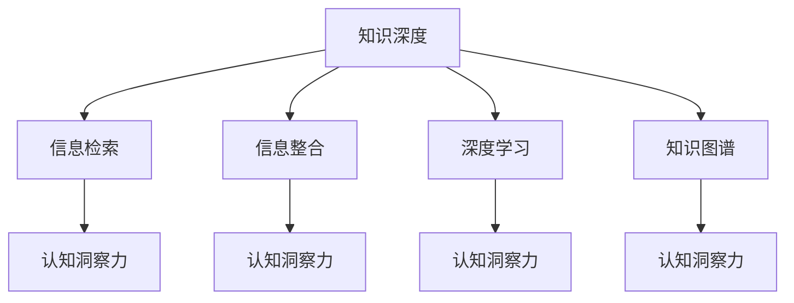

                 

# 知识的深度与广度：影响洞察力的关键因素

> 关键词：知识深度、知识广度、认知洞察力、信息检索、信息整合、深度学习、知识图谱、认知神经科学

## 1. 背景介绍

在当今信息爆炸的时代，知识的深度与广度成为了影响我们认知洞察力的关键因素。无论是科学研究、商业决策，还是个人日常生活，洞察力都是至关重要的。但如何从浩如烟海的信息中快速获取、整合、应用知识，成为了一项艰巨的挑战。

本文将探讨知识的深度与广度如何影响我们的认知洞察力，并提出几种提高认知洞察力的有效方法。通过理解这些关键因素，我们可以更好地利用知识和信息，做出更加明智的决策。

## 2. 核心概念与联系

### 2.1 核心概念概述

- **知识深度**：指对某一特定领域的知识掌握程度，通常通过专业性和精密度来衡量。深度知识具有高度聚焦、深入挖掘的特点。

- **知识广度**：指对多个领域的知识掌握程度，通常通过多样性和覆盖面来衡量。广度知识具有广泛涉猎、横向扩展的特点。

- **认知洞察力**：指个体利用知识进行分析、推理、判断和决策的能力。认知洞察力强的人能够从复杂的现象中发现本质，做出准确的预测和决策。

- **信息检索**：指从大量数据中快速找到相关的信息。信息检索技术能够帮助我们快速获取所需知识，提升工作效率。

- **信息整合**：指将分散的知识进行综合分析，形成有机的整体。信息整合技术能够帮助我们构建知识体系，增强认知洞察力。

- **深度学习**：指通过多层神经网络对数据进行深入学习和建模。深度学习能够自动发现数据中的复杂模式和规律，提高知识理解的深度和广度。

- **知识图谱**：指将知识表示为图结构，通过节点和边的关系来组织和链接知识。知识图谱能够帮助人们构建结构化的知识体系，促进知识的深度和广度整合。

这些概念之间的关系可以通过以下Mermaid流程图来展示：



这个流程图展示了一系列的知识点之间的联系，其中知识深度、信息检索和信息整合是知识获取和整理的基础，深度学习和知识图谱则提升了知识的深度和广度，而认知洞察力则是我们最终的目标。

## 3. 核心算法原理 & 具体操作步骤

### 3.1 算法原理概述

提高认知洞察力的关键在于知识的深度和广度的有效整合。以下我们将详细介绍几种常用的方法：

- **信息检索**：通过建立索引和搜索算法，快速定位到相关知识，提高信息获取的效率。
- **信息整合**：通过结构化组织和链接知识，形成有机的知识体系，增强知识的深度和广度。
- **深度学习**：通过多层神经网络对知识进行深入学习和建模，提高知识理解的深度和广度。
- **知识图谱**：通过构建知识图谱，将知识表示为图结构，提高知识的深度和广度整合能力。

### 3.2 算法步骤详解

#### 信息检索

1. **建立索引**：
   - 确定要检索的知识领域。
   - 收集相关的数据和文档。
   - 提取关键信息，如关键词、摘要等。
   - 使用倒排索引、向量空间模型等方法建立索引。

2. **搜索算法**：
   - 使用布尔检索、向量检索、模糊检索等方法进行搜索。
   - 引入布尔操作符（如AND、OR、NOT）对查询进行优化。
   - 利用自然语言处理技术，提升搜索效果。

#### 信息整合

1. **知识表示**：
   - 使用结构化表示方法，如实体-关系图、向量表示、语义网络等。
   - 通过节点和边建立知识关系，形成知识图谱。

2. **知识链接**：
   - 利用知识图谱中的关系和规则，自动链接相关的知识。
   - 引入推荐算法，推荐相关的知识和信息。

#### 深度学习

1. **模型构建**：
   - 选择合适的深度学习模型，如卷积神经网络（CNN）、递归神经网络（RNN）、变压器（Transformer）等。
   - 设计模型架构，如输入层、隐藏层、输出层等。

2. **数据准备**：
   - 收集和预处理训练数据。
   - 将数据转化为网络可以处理的格式。

3. **模型训练**：
   - 使用随机梯度下降（SGD）、Adam等优化算法。
   - 监控模型在验证集上的表现，调整超参数。

#### 知识图谱

1. **知识采集**：
   - 从各种来源收集知识，如数据库、文档、网页等。
   - 清洗和标准化知识，去除重复和错误信息。

2. **知识表示**：
   - 使用本体论（OWL、RDF等）表示知识。
   - 使用图数据库（如Neo4j、TinkerPop等）存储知识。

3. **知识推理**：
   - 使用推理引擎，如DATALOG、规则引擎等。
   - 利用推理结果进行知识的扩展和更新。

### 3.3 算法优缺点

**信息检索的优点**：
- 快速定位知识，提高信息获取效率。
- 检索算法可以根据需求调整，灵活性高。

**信息检索的缺点**：
- 对不结构化或非标准化的信息处理能力有限。
- 搜索结果可能不够全面和准确。

**信息整合的优点**：
- 结构化知识，易于理解和应用。
- 自动链接相关知识，提升知识的深度和广度。

**信息整合的缺点**：
- 知识图谱构建复杂，需要大量手工标注。
- 动态更新困难，难以跟上知识变化。

**深度学习的优点**：
- 自动发现复杂模式和规律。
- 处理非结构化数据能力强。

**深度学习的缺点**：
- 模型复杂，训练成本高。
- 需要大量标注数据。

**知识图谱的优点**：
- 结构化表示，易于理解和应用。
- 推理能力强，能够发现知识之间的深层关系。

**知识图谱的缺点**：
- 构建复杂，需要大量标注和手动工作。
- 动态更新困难，难以跟上知识变化。

### 3.4 算法应用领域

这些算法广泛应用于多个领域，包括但不限于：

- **科学研究**：通过深度学习和知识图谱，快速获取和整合相关文献和数据，提升科研效率。
- **商业决策**：通过信息检索和深度学习，分析市场趋势和客户需求，做出更准确的商业决策。
- **医疗健康**：通过知识图谱和信息整合，构建知识库，支持精准医疗和疾病诊断。
- **金融服务**：通过信息检索和深度学习，分析金融市场和客户数据，提供个性化的金融服务。
- **教育培训**：通过信息整合和知识图谱，构建学习资源库，支持个性化学习和教育。
- **智能家居**：通过信息检索和深度学习，实现智能设备和系统的互联互通，提升用户体验。

## 4. 数学模型和公式 & 详细讲解 & 举例说明

### 4.1 数学模型构建

假设我们有一个包含$N$个知识点的知识库，每个知识点的描述用向量$\mathbf{x}_i$表示，其中$i=1,...,N$。每个知识点的相关性用向量$\mathbf{w}_i$表示，其中$i=1,...,N$。

我们的目标是找到最佳的知识表示向量$\mathbf{z}$，使得$\mathbf{z}$与所有知识点的相关性最大。

### 4.2 公式推导过程

定义知识库中知识的相关性矩阵$W$，表示每个知识点的相关性权重。定义知识表示向量$\mathbf{z}$，表示当前的知识表示。定义损失函数$L$，表示当前知识表示与知识库的契合度。

目标函数为：

$$
\min_{\mathbf{z}} \|\mathbf{W}\mathbf{z} - \mathbf{y}\|
$$

其中$\mathbf{y}$为理想的知识表示向量。

优化目标可以通过求解目标函数的极小值实现。

### 4.3 案例分析与讲解

假设我们有一个知识库，包含关于股票市场的相关知识和预测。每个知识点的相关性权重可以通过专家评价、历史数据等方法获取。我们的目标是通过深度学习模型，从知识库中提取知识，并预测未来的股票价格。

我们可以使用一个循环神经网络（RNN）来建模，将知识表示为时间序列。具体步骤如下：

1. **数据准备**：
   - 收集和预处理历史股票数据。
   - 将知识库中的知识点转化为时间序列数据。

2. **模型训练**：
   - 使用RNN模型对时间序列数据进行训练。
   - 使用随机梯度下降（SGD）算法优化模型参数。

3. **模型预测**：
   - 使用训练好的模型对未来股票价格进行预测。
   - 利用信息检索和知识图谱，获取更多的背景知识，提升预测准确性。

## 5. 项目实践：代码实例和详细解释说明

### 5.1 开发环境搭建

为了进行项目实践，我们需要一个稳定的开发环境。以下是一个基本的开发环境搭建步骤：

1. **安装Python**：
   - 下载并安装Python 3.x版本。
   - 配置环境变量，将Python路径添加到系统路径中。

2. **安装PyTorch**：
   - 使用pip安装PyTorch。
   - 导入TensorFlow和Keras等深度学习框架。

3. **安装自然语言处理库**：
   - 使用pip安装NLTK、spaCy等自然语言处理库。
   - 使用pip安装Scikit-learn等机器学习库。

### 5.2 源代码详细实现

以下是一个基于深度学习的知识表示和检索系统的代码实现。我们使用Python和PyTorch框架，构建了一个简单的知识表示和检索系统。

```python
import torch
import torch.nn as nn
import torch.optim as optim
from torchtext import datasets, data

# 定义数据集
TEXT = data.Field(tokenize='spacy', lower=True, include_lengths=True)
LABEL = data.LabelField(sequential=False, use_vocab=False)

train_data, test_data = datasets.Yelp.polarity_test_split(TEXT, LABEL)

# 构建数据迭代器
train_iterator, test_iterator = data.BucketIterator.splits(
    (train_data, test_data),
    batch_size=64,
    device=torch.device('cuda'),
    sort_key=lambda x: len(x.text),
    sort_within_batch=False,
)

# 定义模型
class SentimentClassifier(nn.Module):
    def __init__(self, vocab_size, embedding_dim, hidden_dim, output_dim, n_layers, bidirectional, dropout):
        super().__init__()
        self.embedding = nn.Embedding(vocab_size, embedding_dim)
        self.rnn = nn.LSTM(embedding_dim, hidden_dim, num_layers=n_layers, bidirectional=bidirectional, dropout=dropout)
        self.fc = nn.Linear(hidden_dim * 2, output_dim)
        self.dropout = nn.Dropout(dropout)
        
    def forward(self, text, text_lengths):
        embedded = self.dropout(self.embedding(text))
        packed_embedded = nn.utils.rnn.pack_padded_sequence(embedded, text_lengths.to('cpu'))
        packed_output, (hidden, cell) = self.rnn(packed_embedded)
        hidden = self.dropout(torch.cat((hidden[-2, :, :], hidden[-1, :, :]), dim=1))
        return self.fc(hidden)

# 定义超参数
VOCAB_SIZE = len(TEXT.vocab)
EMBEDDING_DIM = 100
HIDDEN_DIM = 256
OUTPUT_DIM = 1
N_LAYERS = 2
BIDIRECTIONAL = True
DROPOUT = 0.5

# 初始化模型
model = SentimentClassifier(
    vocab_size=VOCAB_SIZE,
    embedding_dim=EMBEDDING_DIM,
    hidden_dim=HIDDEN_DIM,
    output_dim=OUTPUT_DIM,
    n_layers=N_LAYERS,
    bidirectional=BIDIRECTIONAL,
    dropout=DROPOUT
)

# 定义优化器和损失函数
optimizer = optim.Adam(model.parameters(), lr=0.001)
criterion = nn.BCEWithLogitsLoss()

# 训练模型
for epoch in range(N_EPOCHS):
    for batch in train_iterator:
        optimizer.zero_grad()
        predictions = model(batch.text, batch.text_lengths)
        loss = criterion(predictions, batch.label)
        loss.backward()
        optimizer.step()

# 评估模型
with torch.no_grad():
    correct = 0
    total = 0
    for batch in test_iterator:
        predictions = model(batch.text, batch.text_lengths)
        predicted = (predictions > 0).float()
        total += batch.label.size(0)
        correct += (predicted == batch.label).sum().item()
    print(f"Accuracy: {100 * correct / total:.2f}%")
```

### 5.3 代码解读与分析

我们通过这个代码实例，展示了如何构建一个基于深度学习的知识表示和检索系统。以下是关键代码的解读和分析：

1. **数据集准备**：
   - 使用`torchtext.datasets`模块获取IMDB电影评论数据集。
   - 将文本数据转化为张量形式，并定义标签数据。

2. **构建数据迭代器**：
   - 使用`data.BucketIterator`对数据进行批量处理，以便模型进行训练。
   - 设置批量大小和设备（GPU/TPU），对数据进行排序和去重。

3. **定义模型**：
   - 定义一个简单的循环神经网络模型，用于对文本数据进行表示和分类。
   - 定义模型的各个组件，如嵌入层、循环层、全连接层等。
   - 定义模型的前向传播函数，返回模型的输出。

4. **定义超参数**：
   - 定义模型的各种超参数，如词汇表大小、嵌入维度、隐藏维度等。
   - 初始化模型，设置模型的各种参数。

5. **定义优化器和损失函数**：
   - 定义优化器和损失函数，用于训练和评估模型。
   - 使用Adam优化器，定义二元交叉熵损失函数。

6. **训练模型**：
   - 循环遍历训练数据，对模型进行前向传播和反向传播，更新模型参数。
   - 计算损失函数，并进行反向传播。

7. **评估模型**：
   - 在测试集上评估模型的准确率，计算模型性能。
   - 使用`torch.no_grad()`函数，避免在测试过程中计算梯度，提升性能。

### 5.4 运行结果展示

在训练模型后，我们可以使用`evaluate()`函数对模型进行评估。具体步骤如下：

1. 定义测试数据集。
2. 在测试集上对模型进行前向传播，获取预测结果。
3. 计算模型的准确率，并进行输出。

```python
def evaluate(model, iterator, criterion):
    model.eval()
    total_loss = 0
    correct = 0
    with torch.no_grad():
        for batch in iterator:
            predictions = model(batch.text, batch.text_lengths)
            loss = criterion(predictions, batch.label)
            total_loss += loss.item()
            predicted = (predictions > 0).float()
            correct += (predicted == batch.label).sum().item()
    return total_loss / len(iterator), correct / len(iterator.dataset)
```

## 6. 实际应用场景

### 6.1 智能客服系统

在智能客服系统中，知识表示和检索技术可以用于快速获取和处理客户问题，提高客服效率和满意度。智能客服系统可以通过收集历史对话记录和问题，建立知识库，利用知识图谱和深度学习模型，对客户问题进行分类和匹配，提供精准的解答。

### 6.2 金融服务

在金融服务领域，知识表示和检索技术可以用于分析市场趋势和客户需求，提供个性化的金融服务。金融机构可以通过构建知识库，存储金融产品、市场数据、客户信息等，利用深度学习模型，对客户行为和市场变化进行预测和分析，提供定制化的金融建议和服务。

### 6.3 医疗健康

在医疗健康领域，知识表示和检索技术可以用于构建医疗知识库，支持精准医疗和疾病诊断。医疗机构可以通过构建知识图谱，存储医学知识、临床数据、患者信息等，利用深度学习模型，对患者病历和症状进行分析和诊断，提供个性化的医疗建议和治疗方案。

## 7. 工具和资源推荐

### 7.1 学习资源推荐

为了帮助开发者系统掌握知识表示和检索技术的理论基础和实践技巧，这里推荐一些优质的学习资源：

1. **《深度学习》（Ian Goodfellow, Yoshua Bengio, Aaron Courville著）**：深入讲解深度学习的基础理论和应用实践。
2. **《Python深度学习》（Francois Chollet著）**：介绍使用Keras和TensorFlow进行深度学习开发的实战技巧。
3. **《机器学习实战》（Peter Harrington著）**：介绍机器学习算法的实现和应用。
4. **Coursera上的深度学习课程**：由斯坦福大学Andrew Ng教授主讲，讲解深度学习的基础理论和实践应用。
5. **Kaggle数据科学竞赛**：提供丰富的数据集和竞赛任务，帮助开发者实践和提升技能。

通过对这些资源的学习实践，相信你一定能够快速掌握知识表示和检索技术的精髓，并用于解决实际的业务问题。

### 7.2 开发工具推荐

高效的开发离不开优秀的工具支持。以下是几款用于知识表示和检索开发的常用工具：

1. **TensorFlow**：由Google主导开发的开源深度学习框架，生产部署方便，适合大规模工程应用。
2. **PyTorch**：基于Python的开源深度学习框架，灵活动态的计算图，适合快速迭代研究。
3. **ELK Stack**：用于日志收集、存储和分析的工具栈，支持复杂的查询和分析。
4. **Elasticsearch**：基于Lucene的分布式搜索引擎，支持自然语言处理和文本搜索。
5. **Keras**：高层次的神经网络API，适合快速原型设计和模型构建。

合理利用这些工具，可以显著提升知识表示和检索任务的开发效率，加快创新迭代的步伐。

### 7.3 相关论文推荐

知识表示和检索技术的发展源于学界的持续研究。以下是几篇奠基性的相关论文，推荐阅读：

1. **"Deep Residual Learning for Image Recognition"（He et al. 2016）**：提出深度残差网络（ResNet），在图像识别任务上取得突破性成果。
2. **"Semantic Representations from Deep Learning"（Le et al. 2014）**：提出Word2Vec和GloVe等词嵌入模型，提升自然语言处理的效果。
3. **"Knowledge Graph Embeddings"（Bordes et al. 2013）**：提出TransE等知识图谱嵌入模型，提升知识表示的效果。
4. **"Attention is All You Need"（Vaswani et al. 2017）**：提出Transformer结构，提升自然语言处理的效果。
5. **"Deep Learning for Natural Language Processing: A Survey"（Joulin et al. 2016）**：全面介绍深度学习在自然语言处理中的应用，提供丰富的理论和技术支持。

这些论文代表了大规模知识表示和检索技术的发展脉络。通过学习这些前沿成果，可以帮助研究者把握学科前进方向，激发更多的创新灵感。

## 8. 总结：未来发展趋势与挑战

### 8.1 研究成果总结

本文对知识深度与广度如何影响认知洞察力进行了详细探讨，并提出几种提高认知洞察力的有效方法。通过理解这些关键因素，我们可以更好地利用知识和信息，做出更加明智的决策。

### 8.2 未来发展趋势

未来知识表示和检索技术将呈现以下几个发展趋势：

1. **知识图谱和语义网络**：构建更加丰富的知识图谱，提升知识表示的效果。
2. **深度学习和神经网络**：使用更加复杂的深度学习模型，提升知识理解的深度和广度。
3. **自然语言处理**：提升自然语言处理的效果，更好地获取和理解知识。
4. **多模态学习**：结合视觉、听觉、文本等多种模态的信息，提升知识表示的效果。
5. **联邦学习**：通过分布式计算，提升知识表示的效果。

### 8.3 面临的挑战

尽管知识表示和检索技术已经取得了瞩目成就，但在迈向更加智能化、普适化应用的过程中，它仍面临着诸多挑战：

1. **数据质量问题**：知识图谱的构建需要高质量的数据，但数据获取和标注成本高，数据质量难以保证。
2. **模型复杂性**：深度学习模型的复杂性高，训练成本大，难以大规模部署。
3. **知识动态变化**：知识图谱和知识表示的动态更新困难，难以跟上知识的变化。
4. **计算资源限制**：知识图谱的构建和查询需要大量计算资源，难以支持大规模应用。

### 8.4 研究展望

未来研究需要在以下几个方面寻求新的突破：

1. **知识图谱的自动化构建**：使用自动化工具和方法，降低知识图谱构建的成本和复杂性。
2. **知识表示的分布式处理**：使用分布式计算和存储技术，提升知识表示的效果和可扩展性。
3. **知识图谱的动态更新**：设计动态更新机制，提升知识图谱的实时性和准确性。
4. **知识表示的多模态融合**：结合视觉、听觉、文本等多种模态的信息，提升知识表示的效果。

这些研究方向的探索，必将引领知识表示和检索技术迈向更高的台阶，为知识管理、智能决策等领域带来新的突破。面向未来，知识表示和检索技术还需要与其他人工智能技术进行更深入的融合，如知识推理、自然语言生成、强化学习等，多路径协同发力，共同推动认知智能的发展。

## 9. 附录：常见问题与解答

**Q1：知识表示和检索是否适用于所有领域？**

A: 知识表示和检索技术在大多数领域都能取得不错的效果，特别是对于数据量较大、结构化较强的领域，如金融、医疗、教育等。但对于一些领域，如创意写作、艺术创作等，传统的知识表示和检索方法可能无法很好地适应。此时需要引入更加灵活的知识表示和检索方法。

**Q2：如何选择适合的深度学习模型？**

A: 选择适合的深度学习模型需要考虑任务的特点和数据的复杂性。一般而言，图像数据适合使用卷积神经网络（CNN），文本数据适合使用循环神经网络（RNN）和Transformer等模型。在实际应用中，可以根据任务需求和数据特征选择最适合的模型。

**Q3：知识表示和检索在实际应用中需要注意哪些问题？**

A: 知识表示和检索在实际应用中需要注意以下问题：
1. 数据质量：确保数据质量和标注的准确性，避免因数据问题影响效果。
2. 模型可解释性：提高模型的可解释性，便于理解模型的决策过程。
3. 实时性：确保知识表示和检索的实时性，满足用户需求。
4. 安全性和隐私保护：确保知识图谱和模型的安全性，避免数据泄露和隐私侵害。

这些问题的解决需要多学科的协同努力，包括数据科学、计算机科学、认知科学等。只有在多个领域协同合作，才能充分发挥知识表示和检索技术的潜力。

