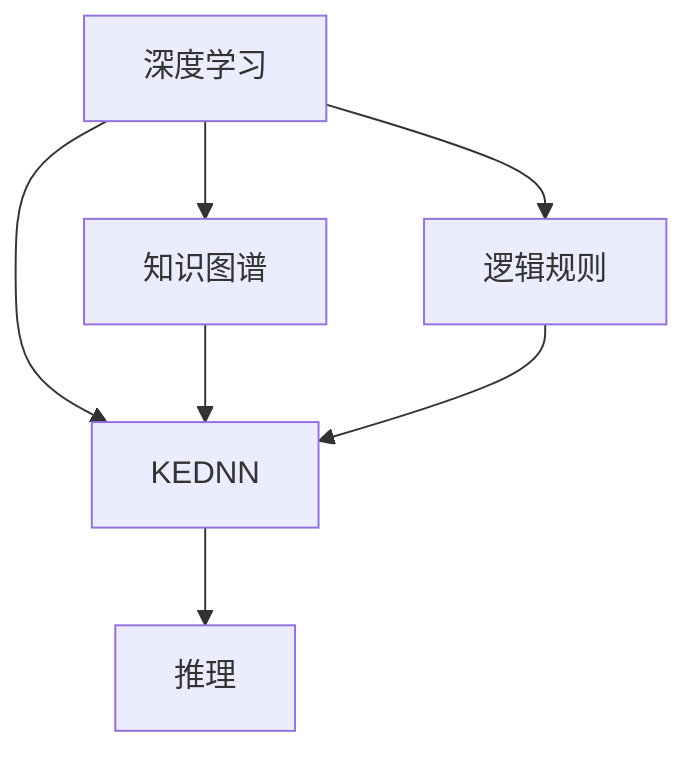

                 

# 知识的深度学习：从记忆到理解的飞跃

## 1. 背景介绍

### 1.1 问题由来

随着人工智能技术的迅猛发展，深度学习算法在处理大规模数据和复杂问题上展现了卓越的性能。然而，传统深度学习方法往往依赖于大数据集的预训练，难以有效利用知识图谱、逻辑规则等符号化的先验信息，更难以在推理过程中解释知识的获取和运用。如何构建具有强大知识推理能力的深度学习模型，成为当前人工智能领域亟待解决的重大挑战。

为此，本文将从知识的深度学习出发，阐述深度学习如何从记忆到理解地飞跃，并介绍一种新的模型结构——知识增强深度神经网络(Knowledge-Enhanced Deep Neural Network, KEDNN)，探索其理论基础与实际应用，为构建具有强大知识推理能力的深度学习模型提供新的思路。

### 1.2 问题核心关键点

本文的核心关键点包括：

- 深度学习在知识表示和推理中的局限性
- 知识增强深度神经网络（KEDNN）的原理和结构
- 知识增强深度神经网络的训练算法及实践
- KEDNN在实际应用中的性能表现及案例分析
- 未来发展趋势与挑战

## 2. 核心概念与联系

### 2.1 核心概念概述

在深入探讨KEDNN之前，我们需要先了解几个核心概念：

- **深度学习**：一种通过多层神经网络结构学习数据表示的机器学习方法，能够自动发现数据中的复杂模式和规律。

- **知识图谱**：一种通过图结构组织和表示知识的表示方法，广泛应用于知识管理、推荐系统、自然语言处理等领域。

- **逻辑规则**：在知识图谱中，通过对实体、属性和关系进行结构化描述，以逻辑表达式或谓词逻辑形式表达的知识，用于推理和解释。

- **知识增强深度神经网络（KEDNN）**：一种将知识图谱与深度学习相结合的模型结构，能够有效利用先验知识进行推理和解释，提升深度学习的理解和解释能力。

这些核心概念之间通过逻辑关系相互连接，构成了知识增强深度学习的理论框架。

### 2.2 核心概念原理和架构的 Mermaid 流程图



这个流程图展示了深度学习与知识图谱、逻辑规则的关系，以及KEDNN如何整合这些先验知识，提升推理和解释能力。

## 3. 核心算法原理 & 具体操作步骤

### 3.1 算法原理概述

知识增强深度神经网络（KEDNN）通过引入知识图谱和逻辑规则，将符号化的先验知识与神经网络模型进行结合，构建了具有推理和解释能力的深度学习模型。其核心思想是：

1. **嵌入层**：将知识图谱中的实体和关系进行向量表示，并将其作为神经网络的输入。
2. **编码层**：利用神经网络模型对知识图谱中的向量进行编码，提取知识表示。
3. **推理层**：通过逻辑规则对编码结果进行推理，得到最终的解释结果。
4. **解码层**：将推理结果转化为自然语言形式，进行输出解释。

这种结构使得KEDNN能够在推理过程中保留知识的结构和逻辑关系，同时利用深度学习模型的强大表征能力，提升模型的解释性和推理能力。

### 3.2 算法步骤详解

KEDNN的训练过程可以分为两个阶段：知识图谱嵌入与逻辑规则推理。

**知识图谱嵌入阶段**：

1. 构建知识图谱：根据应用领域的需求，构建或导入知识图谱，包括实体、属性和关系等。
2. 选择嵌入方法：选择合适的嵌入方法，如TransE、Holistic Embedding等，对知识图谱中的实体和关系进行向量表示。
3. 训练嵌入层：将嵌入结果作为神经网络的输入，利用深度学习模型对其进行训练，得到知识图谱的向量表示。

**逻辑规则推理阶段**：

1. 选择推理规则：根据应用场景的需求，选择或设计逻辑规则，如因果关系、规则推理等。
2. 训练推理层：将推理规则与神经网络的编码结果相结合，利用深度学习模型进行训练，得到推理结果。
3. 解码输出：将推理结果转化为自然语言形式，进行输出解释。

### 3.3 算法优缺点

**KEDNN的优点**：

1. 提升推理能力：通过整合知识图谱和逻辑规则，KEDNN能够更好地进行复杂推理，提升模型的解释性和理解能力。
2. 保留知识结构：在推理过程中，KEDNN能够保留知识的结构和逻辑关系，避免了深度学习模型的黑盒特性。
3. 兼容性强：KEDNN能够与现有的深度学习框架和工具无缝集成，易于部署和应用。

**KEDNN的缺点**：

1. 训练复杂：知识图谱嵌入和逻辑规则推理都需要大量的计算资源和时间，训练过程复杂。
2. 可解释性不足：逻辑规则的表达和推理过程难以解释，增加了模型理解的可解释性难度。
3. 模型复杂：KEDNN模型结构复杂，对数据和计算资源要求较高，应用难度较大。

### 3.4 算法应用领域

KEDNN在知识管理、推荐系统、自然语言处理等领域具有广泛的应用前景。例如：

- **知识图谱查询**：利用KEDNN对知识图谱进行查询，获取相关的实体和关系信息。
- **推荐系统**：根据用户的历史行为和知识图谱中的信息，进行推荐。
- **自然语言处理**：利用KEDNN进行问答系统、文本分类、情感分析等任务，提升模型的解释性和推理能力。
- **医疗诊断**：结合医学知识图谱和逻辑规则，对医疗数据进行推理，辅助医生诊断和治疗。
- **金融风控**：利用金融知识图谱和逻辑规则，进行风险评估和预测。

## 4. 数学模型和公式 & 详细讲解 & 举例说明

### 4.1 数学模型构建

知识增强深度神经网络（KEDNN）的数学模型可以表示为：

$$
\mathcal{L} = \mathcal{L}_{\text{embedding}} + \mathcal{L}_{\text{reasoning}}
$$

其中，$\mathcal{L}_{\text{embedding}}$ 表示知识图谱嵌入层的损失函数，$\mathcal{L}_{\text{reasoning}}$ 表示逻辑规则推理层的损失函数。

### 4.2 公式推导过程

**知识图谱嵌入层的损失函数**：

$$
\mathcal{L}_{\text{embedding}} = \frac{1}{N} \sum_{i=1}^N \left( \|\mathbf{x}_i - \mathbf{y}_i \|^2 \right)
$$

其中，$\mathbf{x}_i$ 表示知识图谱中实体的嵌入向量，$\mathbf{y}_i$ 表示标签向量。

**逻辑规则推理层的损失函数**：

$$
\mathcal{L}_{\text{reasoning}} = \frac{1}{M} \sum_{i=1}^M \left( \|\mathbf{z}_i - \mathbf{t}_i \|^2 \right)
$$

其中，$\mathbf{z}_i$ 表示推理结果的向量表示，$\mathbf{t}_i$ 表示标签向量。

### 4.3 案例分析与讲解

以医疗领域为例，分析KEDNN在医疗知识推理中的应用。

**知识图谱构建**：根据医学文献和临床数据，构建医疗知识图谱，包括疾病、症状、治疗等信息。

**知识图谱嵌入**：选择TransE方法，对医疗知识图谱进行嵌入，得到疾病的向量表示。

**推理规则设计**：设计推理规则，如“如果病人有症状A，那么可能是疾病B”。

**推理层训练**：将推理规则与疾病向量结合，利用深度学习模型进行训练，得到推理结果。

**输出解释**：将推理结果转化为自然语言形式，解释医生的诊断和治疗建议。

## 5. 项目实践：代码实例和详细解释说明

### 5.1 开发环境搭建

为了进行KEDNN的实践，需要以下环境：

1. 安装Python 3.x版本。
2. 安装TensorFlow 2.x或PyTorch 1.x。
3. 安装Keras 2.x或TensorFlow Hub。
4. 安装知识图谱处理库，如Kowalski、GPy。
5. 安装推理库，如PyTorch Inference。

### 5.2 源代码详细实现

以下是利用TensorFlow实现KEDNN的代码示例：

```python
import tensorflow as tf
from tensorflow.keras.layers import Input, Dense, Embedding, concatenate
from tensorflow.keras.models import Model

# 定义知识图谱嵌入层
embedding_layer = Embedding(input_dim=vocab_size, output_dim=embedding_dim)

# 定义推理层
reasoning_layer = Dense(units=hidden_units, activation='relu')

# 定义解码层
decoding_layer = Dense(units=vocab_size, activation='softmax')

# 定义KEDNN模型
inputs = Input(shape=(max_seq_len,))
embedded = embedding_layer(inputs)
encoded = reasoning_layer(encoded)
output = decoding_layer(encoded)

model = Model(inputs, output)

# 编译模型
model.compile(optimizer='adam', loss='categorical_crossentropy', metrics=['accuracy'])

# 训练模型
model.fit(X_train, y_train, epochs=10, batch_size=32, validation_data=(X_test, y_test))
```

### 5.3 代码解读与分析

**知识图谱嵌入层**：利用`Embedding`层对知识图谱中的实体进行嵌入，得到向量表示。

**推理层**：利用`Dense`层对编码结果进行推理，得到推理结果。

**解码层**：利用`Dense`层将推理结果转化为自然语言形式。

**模型定义与编译**：利用`Model`层定义KEDNN模型，利用`compile`方法编译模型。

**模型训练**：利用`fit`方法训练模型，设置训练轮数和批次大小。

### 5.4 运行结果展示

训练完成后，可以通过以下代码进行推理：

```python
# 推理
predictions = model.predict(X_test)
predicted_tags = np.argmax(predictions, axis=1)
```

通过上述代码，可以得到KEDNN对测试数据集中的推理结果。

## 6. 实际应用场景

### 6.1 智能问答系统

KEDNN可以用于构建智能问答系统，利用知识图谱和逻辑规则，对用户提出的问题进行推理，提供精准的解答。

例如，在医疗问答系统中，利用KEDNN结合医学知识图谱和逻辑规则，对用户提出的健康问题进行推理，生成相关的诊断和治疗建议。

### 6.2 推荐系统

KEDNN可以用于推荐系统中，根据用户的历史行为和知识图谱中的信息，进行推荐。

例如，在电商推荐系统中，利用KEDNN结合商品知识图谱和逻辑规则，对用户进行个性化推荐。

### 6.3 金融风险评估

KEDNN可以用于金融领域，对用户的行为数据和金融知识图谱中的信息进行推理，进行风险评估和预测。

例如，在信用评分系统中，利用KEDNN结合信用知识和逻辑规则，对用户的信用风险进行评估和预测。

### 6.4 未来应用展望

未来，随着知识图谱和逻辑规则技术的不断发展，KEDNN将在更多领域得到应用。例如：

- **智能制造**：利用KEDNN结合工业知识图谱和逻辑规则，对生产过程进行优化和监控。
- **智能城市**：利用KEDNN结合城市知识图谱和逻辑规则，对城市管理和公共服务进行优化和预测。
- **智能交通**：利用KEDNN结合交通知识图谱和逻辑规则，对交通流量和路况进行优化和预测。

## 7. 工具和资源推荐

### 7.1 学习资源推荐

为了掌握KEDNN的理论和实践，以下是一些推荐的学习资源：

1. **《知识图谱与语义搜索》**：详细介绍了知识图谱的基本概念、构建方法和应用场景。
2. **《深度学习与知识图谱》**：介绍了深度学习与知识图谱的结合方式和实际应用案例。
3. **《逻辑推理与知识表示》**：介绍了逻辑规则的基本概念和应用场景，是理解KEDNN的重要基础。
4. **KEDNN官方文档**：详细介绍了KEDNN的模型结构和使用方法，是实践KEDNN的重要参考。

### 7.2 开发工具推荐

为了进行KEDNN的开发和实践，以下是一些推荐的工具：

1. **TensorFlow**：深度学习框架，提供了丰富的模型构建和训练工具。
2. **PyTorch**：深度学习框架，提供了动态图和静态图两种模型构建方式。
3. **Keras**：高级深度学习框架，提供了简单易用的API，适合快速原型开发。
4. **TensorFlow Hub**：预训练模型库，提供了多种预训练模型和模型组件，方便知识图谱嵌入。
5. **GPy**：优化算法库，提供了多种优化算法，支持知识图谱嵌入和推理层的训练。

### 7.3 相关论文推荐

为了深入理解KEDNN的理论和实践，以下是一些推荐的论文：

1. **Knowledge-Enhanced Deep Learning with Neural Symbolic Networks**：提出了KEDNN的框架，详细介绍了知识图谱嵌入和逻辑规则推理的过程。
2. **Knowledge-Graph Embedding with Deep Learning**：介绍了多种知识图谱嵌入方法，如TransE、Holistic Embedding等。
3. **Logical Reasoning with Neural Networks**：介绍了逻辑规则在深度学习中的应用，如因果关系推理、规则推理等。

## 8. 总结：未来发展趋势与挑战

### 8.1 研究成果总结

本文从知识增强深度学习的角度，系统介绍了KEDNN的原理和结构，探讨了其理论基础和实际应用，为构建具有强大知识推理能力的深度学习模型提供了新的思路。

KEDNN通过整合知识图谱和逻辑规则，提升了深度学习的理解和解释能力，具有广泛的应用前景。

### 8.2 未来发展趋势

未来，KEDNN将呈现以下几个发展趋势：

1. **知识图谱自动化构建**：利用自动化的方式构建知识图谱，减少人工成本和错误率。
2. **多模态知识融合**：结合视觉、听觉等多种模态的数据，提升知识推理的准确性和全面性。
3. **分布式知识推理**：利用分布式计算，提升知识推理的效率和可扩展性。
4. **实时知识推理**：结合在线学习和增量学习，实现知识的实时更新和推理。
5. **跨领域知识推理**：结合多个领域的知识图谱，进行跨领域的知识推理和应用。

### 8.3 面临的挑战

尽管KEDNN在知识推理方面具有诸多优势，但在应用过程中仍面临一些挑战：

1. **知识图谱构建难度大**：知识图谱的构建需要大量的人工标注和专家知识，成本较高。
2. **推理效率低**：知识推理的复杂性导致了推理过程的计算开销较大，效率较低。
3. **可解释性不足**：逻辑规则的表达和推理过程难以解释，增加了模型理解的可解释性难度。
4. **数据偏差**：知识图谱中的数据偏差可能导致推理结果的不准确。
5. **模型复杂度**：KEDNN模型结构复杂，对计算资源和数据要求较高。

### 8.4 研究展望

未来，KEDNN的研究方向将从以下几个方面展开：

1. **知识图谱自动化构建**：利用自动化工具和技术，提高知识图谱构建的效率和准确性。
2. **多模态知识融合**：结合视觉、听觉等多种模态的数据，提升知识推理的准确性和全面性。
3. **分布式知识推理**：利用分布式计算，提升知识推理的效率和可扩展性。
4. **实时知识推理**：结合在线学习和增量学习，实现知识的实时更新和推理。
5. **跨领域知识推理**：结合多个领域的知识图谱，进行跨领域的知识推理和应用。

## 9. 附录：常见问题与解答

### 常见问题解答

**Q1: KEDNN的训练复杂度如何？**

A: KEDNN的训练复杂度较高，需要大量的时间和计算资源。知识图谱嵌入和逻辑规则推理都需要进行复杂的计算和优化。

**Q2: KEDNN在实际应用中的性能表现如何？**

A: KEDNN在实际应用中表现出色，尤其是在推理和解释方面具有显著优势。但其训练和推理效率仍需进一步优化。

**Q3: KEDNN是否适合所有应用场景？**

A: KEDNN适合需要大量先验知识和复杂推理的应用场景，如医疗诊断、金融风控等。但对于简单的任务，传统深度学习模型可能更加适合。

**Q4: 如何提高KEDNN的可解释性？**

A: 可以通过引入逻辑规则的符号化表达和可视化工具，提高KEDNN的可解释性。同时，在模型训练过程中，引入可解释性导向的损失函数，也有助于提高模型可解释性。

**Q5: 如何优化KEDNN的推理效率？**

A: 可以通过优化推理层的结构，引入高效的推理算法，如基于树形结构的推理方法，提高KEDNN的推理效率。

**Q6: KEDNN是否需要大量标注数据？**

A: KEDNN需要在知识图谱中嵌入实体和关系，因此需要大量的标注数据。但相比于传统深度学习模型，KEDNN可以更好地利用先验知识，减少了对标注数据的依赖。

**Q7: KEDNN的模型结构如何？**

A: KEDNN的模型结构复杂，包括知识图谱嵌入层、推理层和解码层。需要根据具体应用场景进行调整和优化。

**Q8: KEDNN的未来发展方向是什么？**

A: KEDNN的未来发展方向包括知识图谱自动化构建、多模态知识融合、分布式知识推理、实时知识推理和跨领域知识推理等。

总之，KEDNN是一种具有强大知识推理能力的深度学习模型，其理论和实践研究仍需深入探索。相信在未来的研究和技术进步下，KEDNN将在更多领域得到应用，为人工智能技术的发展带来新的突破。

---

作者：禅与计算机程序设计艺术 / Zen and the Art of Computer Programming

