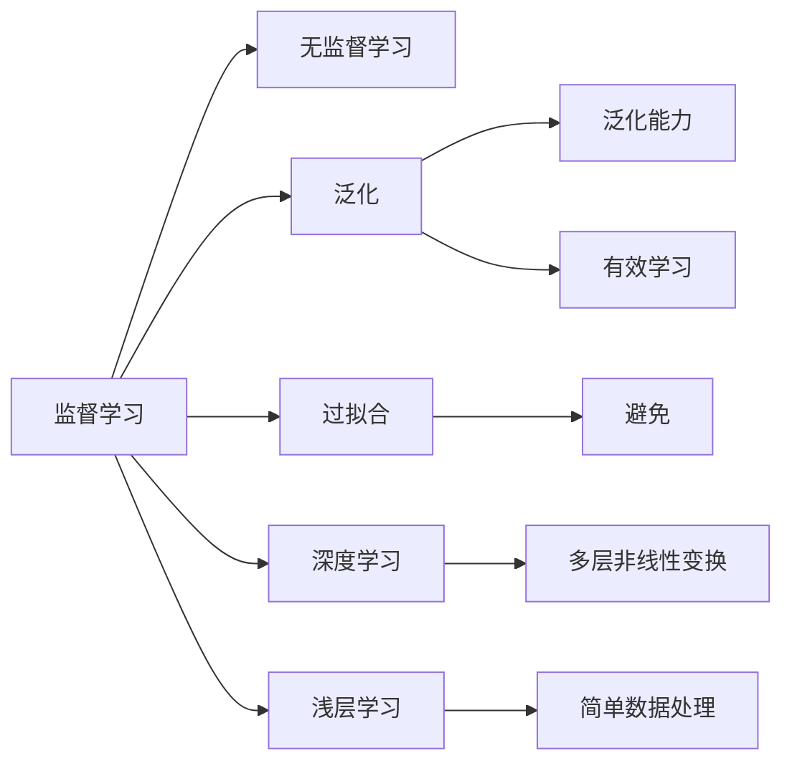

                 

# 知识的误解：常见概念错误及纠正

> 关键词：知识误解,常见概念,错误纠正,AI普及,技术教育

## 1. 背景介绍

### 1.1 问题由来
在人工智能(AI)领域，随着技术的快速发展，越来越多的专业术语和概念被引入到日常讨论和应用中。然而，这些专业术语和概念往往含有深层次的含义和背景，容易引发误解和误用。例如，在深度学习、机器学习、自然语言处理等领域，有许多容易混淆的概念，比如监督学习、无监督学习、强化学习、泛化等。错误的理解和应用这些概念，不仅会影响研究进展，也会误导公众对于AI技术的认识。

本文旨在通过分析常见概念的错误理解和应用，揭示其背后的深层次原因，并提供正确的理解方式和使用方法，帮助读者更好地掌握这些核心概念，提高AI技术的学习和应用能力。

### 1.2 问题核心关键点
本文将聚焦于以下几个核心概念的错误理解和应用：

1. **监督学习与无监督学习**：这两种学习方式在概念上容易混淆。
2. **泛化与过拟合**：这两个概念在模型训练和应用中经常被误解。
3. **强化学习**：与监督学习和无监督学习不同，强化学习涉及动态环境与奖励机制，概念较为复杂。
4. **深度学习与浅层学习**：深度学习通过多层次非线性变换处理数据，但并不意味着浅层学习就无能为力。

这些概念在AI技术的各个分支中都有广泛的应用，正确理解和使用这些概念对于AI技术的普及和应用至关重要。

## 2. 核心概念与联系

### 2.1 核心概念概述

为更好地理解这些核心概念，本文将对其进行概述，并介绍它们之间的联系和区别。

- **监督学习(Supervised Learning)**：在已知输入数据和输出标签的情况下，通过学习输入和输出之间的映射关系，进行模型训练。常见的应用场景包括分类和回归问题。

- **无监督学习(Unsupervised Learning)**：在无标签数据的情况下，通过学习数据的内在结构和规律，进行模型训练。常见的应用场景包括聚类、降维和特征提取。

- **泛化(Generalization)**：指模型在训练数据和测试数据上均表现良好的能力。良好的泛化能力是模型有效性和鲁棒性的重要指标。

- **过拟合(Overfitting)**：指模型在训练数据上表现良好，但在测试数据上表现较差的现象。过拟合通常是由于模型过于复杂，过度拟合训练数据所导致的。

- **强化学习(Reinforcement Learning)**：通过与环境交互，学习如何从当前状态到下一个状态的策略，以最大化累积奖励。强化学习常用于游戏、机器人控制和自动驾驶等领域。

- **深度学习(Deep Learning)**：使用多层神经网络进行模型训练，通过多层次的非线性变换，可以从原始数据中提取高层次的特征表示。深度学习在图像识别、语音识别和自然语言处理等领域取得了巨大成功。

- **浅层学习(Shallow Learning)**：使用单层或多层的线性或非线性变换进行模型训练。浅层学习通常用于简单的数据分类和回归任务。

这些概念之间既有联系又有区别，了解它们之间的关系和区别，可以帮助我们更好地应用这些技术。

### 2.2 核心概念联系与区别（备注：必须给出核心概念原理和架构的 Mermaid 流程图(Mermaid 流程节点中不要有括号、逗号等特殊字符)


## 3. 核心算法原理 & 具体操作步骤

### 3.1 算法原理概述

本文将详细分析这些核心概念的算法原理和具体操作步骤，以便读者更好地理解这些概念。

#### 3.1.1 监督学习原理概述

监督学习的基本思想是利用已知的数据集进行模型训练，通过输入数据和输出标签之间的映射关系，构建一个预测函数，用于对新数据进行分类或回归。其算法流程通常包括数据预处理、特征提取、模型选择与训练、模型评估和测试等步骤。

#### 3.1.2 无监督学习原理概述

无监督学习通过观察数据的内在结构和规律，发现数据中的隐藏模式和特征。常见的无监督学习方法包括K-means聚类、主成分分析(PCA)和自编码器等。其算法流程通常包括数据预处理、特征提取、模型选择与训练、模型评估和测试等步骤。

#### 3.1.3 泛化原理概述

泛化能力是指模型在未知数据上表现良好的能力。泛化能力通常通过模型在训练集和测试集上的性能差异来评估。好的泛化能力意味着模型能够适应新的数据和变化的环境。

#### 3.1.4 过拟合原理概述

过拟合是指模型在训练数据上表现良好，但在测试数据上表现较差的现象。过拟合通常是由于模型过于复杂，过度拟合训练数据所导致的。解决过拟合的方法包括增加训练数据、减少模型复杂度和正则化等。

#### 3.1.5 强化学习原理概述

强化学习通过与环境交互，学习如何从当前状态到下一个状态的策略，以最大化累积奖励。其算法流程通常包括环境模型构建、策略选择、状态-动作映射、奖励函数设计和训练等步骤。

#### 3.1.6 深度学习原理概述

深度学习使用多层神经网络进行模型训练，通过多层次的非线性变换，可以从原始数据中提取高层次的特征表示。其算法流程通常包括数据预处理、模型选择与训练、模型评估和测试等步骤。

#### 3.1.7 浅层学习原理概述

浅层学习通常使用单层或多层的线性或非线性变换进行模型训练。其算法流程通常包括数据预处理、模型选择与训练、模型评估和测试等步骤。

### 3.2 算法步骤详解

#### 3.2.1 监督学习步骤详解

1. **数据预处理**：对原始数据进行清洗、归一化、特征提取等预处理，以便模型能够有效处理数据。
2. **特征提取**：根据模型类型选择合适的特征提取方法，提取数据中的重要特征。
3. **模型选择与训练**：选择合适的模型，如决策树、支持向量机、神经网络等，并使用训练数据对其进行训练。
4. **模型评估与测试**：使用测试数据对训练好的模型进行评估和测试，评估模型的性能和泛化能力。

#### 3.2.2 无监督学习步骤详解

1. **数据预处理**：对原始数据进行清洗、归一化等预处理。
2. **特征提取**：选择合适的特征提取方法，如K-means聚类、PCA等。
3. **模型选择与训练**：选择合适的无监督学习模型，并使用训练数据对其进行训练。
4. **模型评估与测试**：使用测试数据对训练好的模型进行评估和测试，评估模型的性能和泛化能力。

#### 3.2.3 泛化能力步骤详解

1. **模型选择与训练**：选择合适的模型，并使用训练数据对其进行训练。
2. **测试集评估**：使用测试集对训练好的模型进行评估，评估模型的泛化能力。
3. **模型调优**：根据测试集评估结果，对模型进行调优，提升模型的泛化能力。

#### 3.2.4 过拟合解决方法步骤详解

1. **数据扩充**：通过数据增强技术，增加训练数据的多样性。
2. **模型简化**：减少模型的复杂度，如减少神经网络的层数和节点数。
3. **正则化**：使用L1或L2正则化方法，限制模型参数的大小。
4. **早停法**：在模型性能不再提升时，提前停止训练，避免过拟合。

#### 3.2.5 强化学习步骤详解

1. **环境模型构建**：构建环境的模型，描述环境的状态和动作空间。
2. **策略选择**：选择或设计合适的策略，用于从当前状态到下一个状态的映射。
3. **状态-动作映射**：将状态和动作映射到模型中进行训练。
4. **奖励函数设计**：设计合适的奖励函数，用于评估策略的好坏。
5. **训练**：使用训练数据对模型进行训练，优化策略。

#### 3.2.6 深度学习步骤详解

1. **数据预处理**：对原始数据进行清洗、归一化、特征提取等预处理。
2. **模型选择与训练**：选择合适的深度学习模型，并使用训练数据对其进行训练。
3. **模型评估与测试**：使用测试数据对训练好的模型进行评估和测试，评估模型的性能和泛化能力。

#### 3.2.7 浅层学习步骤详解

1. **数据预处理**：对原始数据进行清洗、归一化等预处理。
2. **模型选择与训练**：选择合适的浅层学习模型，并使用训练数据对其进行训练。
3. **模型评估与测试**：使用测试数据对训练好的模型进行评估和测试，评估模型的性能和泛化能力。

### 3.3 算法优缺点

#### 3.3.1 监督学习优缺点

**优点**：
- 训练过程有明确的标签指导，易于评估和调试。
- 可以处理分类和回归等多种问题。

**缺点**：
- 需要大量标注数据，数据标注成本高。
- 数据不平衡时，模型容易偏向于多数类。

#### 3.3.2 无监督学习优缺点

**优点**：
- 不需要标注数据，数据获取成本低。
- 可以发现数据中的隐藏模式和结构。

**缺点**：
- 结果解释性较差，难以理解模型学习的内容。
- 需要选择合适的特征提取方法，具有一定的主观性。

#### 3.3.3 泛化能力优缺点

**优点**：
- 模型具有较好的泛化能力，能够适应新的数据和变化的环境。

**缺点**：
- 需要大量的训练数据和有效的模型调优方法。

#### 3.3.4 过拟合优缺点

**优点**：
- 可以通过增加训练数据和正则化等方法进行缓解。

**缺点**：
- 模型复杂度过高时，容易发生过拟合，影响泛化能力。

#### 3.3.5 强化学习优缺点

**优点**：
- 适用于动态环境和交互任务，具有较好的适应性和鲁棒性。

**缺点**：
- 需要构建环境模型和设计奖励函数，有一定难度。

#### 3.3.6 深度学习优缺点

**优点**：
- 可以从原始数据中提取高层次的特征表示，模型性能优秀。

**缺点**：
- 需要大量的计算资源和存储空间。

#### 3.3.7 浅层学习优缺点

**优点**：
- 模型简单，易于理解和调试。

**缺点**：
- 处理复杂数据和复杂问题时，效果有限。

### 3.4 算法应用领域

#### 3.4.1 监督学习应用领域

监督学习广泛应用于分类、回归、情感分析、文本分类、图像识别等任务。例如，可以使用监督学习方法对电子邮件进行垃圾邮件分类，对新闻文章进行情感分析等。

#### 3.4.2 无监督学习应用领域

无监督学习广泛应用于聚类、降维、特征提取、异常检测等任务。例如，可以使用无监督学习方法对客户进行细分，对数据进行降维，以提高数据处理的效率。

#### 3.4.3 泛化能力应用领域

泛化能力在机器学习中具有广泛的应用，例如在金融领域，通过模型泛化能力，可以对新客户进行信用评估，预测股票价格等。

#### 3.4.4 过拟合解决方法应用领域

过拟合解决方法在机器学习中具有重要意义，例如在图像识别任务中，通过数据增强和正则化等方法，可以有效缓解过拟合问题，提高模型的泛化能力。

#### 3.4.5 强化学习应用领域

强化学习在自动驾驶、机器人控制、游戏AI等领域有广泛的应用。例如，可以使用强化学习方法训练自动驾驶汽车，使其能够根据环境信息进行决策和控制。

#### 3.4.6 深度学习应用领域

深度学习在图像识别、语音识别、自然语言处理等领域有广泛的应用。例如，可以使用深度学习方法对医学图像进行分类和诊断，对语音进行识别和分析。

#### 3.4.7 浅层学习应用领域

浅层学习在数据处理和简单分类任务中具有较好的效果，例如在简单的垃圾邮件过滤、手写数字识别等任务中，可以使用浅层学习模型进行处理。

## 4. 数学模型和公式 & 详细讲解  
### 4.1 数学模型构建

本文将使用数学语言对监督学习、无监督学习、泛化能力、过拟合、强化学习、深度学习和浅层学习的数学模型进行构建，并给出详细的解释。

#### 4.1.1 监督学习数学模型

监督学习的基本模型可以表示为：

$$
y = f(x;\theta)
$$

其中 $y$ 为输出，$x$ 为输入，$\theta$ 为模型参数。监督学习的目标是找到一个最优的模型参数 $\theta^*$，使得在训练数据和测试数据上，模型预测结果 $y'$ 尽可能接近真实结果 $y$。

#### 4.1.2 无监督学习数学模型

无监督学习的基本模型可以表示为：

$$
y = f(x;\theta)
$$

其中 $y$ 为输出，$x$ 为输入，$\theta$ 为模型参数。无监督学习的目标是找到一个最优的模型参数 $\theta^*$，使得在训练数据上，模型预测结果 $y'$ 尽可能接近真实结果 $y$。

#### 4.1.3 泛化能力数学模型

泛化能力可以通过模型的测试误差 $E_{test}$ 来评估。泛化能力的数学模型可以表示为：

$$
E_{test} = E_{train} - E_{val}
$$

其中 $E_{train}$ 为模型在训练数据上的误差，$E_{val}$ 为模型在验证数据上的误差。泛化能力的提升意味着模型在训练数据和测试数据上的误差差距减小。

#### 4.1.4 过拟合数学模型

过拟合可以通过模型在训练数据和验证数据上的误差差距来评估。过拟合的数学模型可以表示为：

$$
E_{train} - E_{val} > \epsilon
$$

其中 $\epsilon$ 为过拟合的阈值。过拟合的解决方法包括增加训练数据、减少模型复杂度和正则化等。

#### 4.1.5 强化学习数学模型

强化学习的基本模型可以表示为：

$$
Q(s,a) = r + \gamma Q(s',a')
$$

其中 $Q(s,a)$ 为状态-动作价值函数，$r$ 为即时奖励，$s'$ 为下一个状态，$a'$ 为下一个动作，$\gamma$ 为折扣因子。强化学习的目标是通过最大化累积奖励，找到最优的状态-动作策略。

#### 4.1.6 深度学习数学模型

深度学习的基本模型可以表示为：

$$
y = f(x;\theta)
$$

其中 $y$ 为输出，$x$ 为输入，$\theta$ 为模型参数。深度学习的目标是通过多层非线性变换，从原始数据中提取高层次的特征表示。

#### 4.1.7 浅层学习数学模型

浅层学习的基本模型可以表示为：

$$
y = f(x;\theta)
$$

其中 $y$ 为输出，$x$ 为输入，$\theta$ 为模型参数。浅层学习的目标是通过单层或多层线性或非线性变换，从原始数据中提取低层次的特征表示。

### 4.2 公式推导过程

#### 4.2.1 监督学习公式推导

监督学习的目标是找到一个最优的模型参数 $\theta^*$，使得在训练数据和测试数据上，模型预测结果 $y'$ 尽可能接近真实结果 $y$。监督学习的数学推导可以表示为：

$$
\theta^* = \arg\min_{\theta} \frac{1}{N}\sum_{i=1}^N L(y_i, y_i')
$$

其中 $N$ 为样本数量，$L(y_i, y_i')$ 为损失函数，$y_i'$ 为模型预测结果。

#### 4.2.2 无监督学习公式推导

无监督学习的目标是找到一个最优的模型参数 $\theta^*$，使得在训练数据上，模型预测结果 $y'$ 尽可能接近真实结果 $y$。无监督学习的数学推导可以表示为：

$$
\theta^* = \arg\min_{\theta} \frac{1}{N}\sum_{i=1}^N L(y_i, y_i')
$$

其中 $N$ 为样本数量，$L(y_i, y_i')$ 为损失函数，$y_i'$ 为模型预测结果。

#### 4.2.3 泛化能力公式推导

泛化能力的数学推导可以表示为：

$$
E_{test} = E_{train} - E_{val}
$$

其中 $E_{train}$ 为模型在训练数据上的误差，$E_{val}$ 为模型在验证数据上的误差。

#### 4.2.4 过拟合公式推导

过拟合的数学推导可以表示为：

$$
E_{train} - E_{val} > \epsilon
$$

其中 $\epsilon$ 为过拟合的阈值。

#### 4.2.5 强化学习公式推导

强化学习的数学推导可以表示为：

$$
Q(s,a) = r + \gamma Q(s',a')
$$

其中 $Q(s,a)$ 为状态-动作价值函数，$r$ 为即时奖励，$s'$ 为下一个状态，$a'$ 为下一个动作，$\gamma$ 为折扣因子。

#### 4.2.6 深度学习公式推导

深度学习的数学推导可以表示为：

$$
y = f(x;\theta)
$$

其中 $y$ 为输出，$x$ 为输入，$\theta$ 为模型参数。

#### 4.2.7 浅层学习公式推导

浅层学习的数学推导可以表示为：

$$
y = f(x;\theta)
$$

其中 $y$ 为输出，$x$ 为输入，$\theta$ 为模型参数。

### 4.3 案例分析与讲解

#### 4.3.1 监督学习案例

**案例**：电子邮件垃圾邮件分类

**步骤**：
1. 收集电子邮件数据集，包含标记为垃圾邮件和正常邮件的样本。
2. 对数据进行预处理，包括文本清洗、分词、特征提取等。
3. 选择监督学习模型，如支持向量机、朴素贝叶斯、神经网络等。
4. 使用训练数据对模型进行训练，并使用测试数据进行评估。

#### 4.3.2 无监督学习案例

**案例**：客户细分

**步骤**：
1. 收集客户数据，包含客户的消费记录、购买行为等。
2. 对数据进行预处理，包括数据清洗、特征提取等。
3. 选择无监督学习模型，如K-means聚类、PCA等。
4. 使用训练数据对模型进行训练，并使用测试数据进行评估。

#### 4.3.3 泛化能力案例

**案例**：股票价格预测

**步骤**：
1. 收集股票价格数据，包含历史价格和相关因素。
2. 对数据进行预处理，包括数据清洗、特征提取等。
3. 选择监督学习模型，如线性回归、支持向量机等。
4. 使用训练数据对模型进行训练，并使用测试数据进行评估。

#### 4.3.4 过拟合解决方法案例

**案例**：图像识别

**步骤**：
1. 收集图像数据集，包含标记为不同类别的样本。
2. 对数据进行预处理，包括图像增强、数据扩充等。
3. 选择监督学习模型，如卷积神经网络。
4. 使用训练数据对模型进行训练，并使用测试数据进行评估。

#### 4.3.5 强化学习案例

**案例**：自动驾驶汽车

**步骤**：
1. 构建环境模型，描述汽车与环境的交互。
2. 选择强化学习模型，如深度Q网络。
3. 设计奖励函数，如行驶距离、安全系数等。
4. 使用训练数据对模型进行训练，并使用测试数据进行评估。

#### 4.3.6 深度学习案例

**案例**：医学图像分类

**步骤**：
1. 收集医学图像数据集，包含标记为不同疾病的样本。
2. 对数据进行预处理，包括图像增强、数据扩充等。
3. 选择深度学习模型，如卷积神经网络。
4. 使用训练数据对模型进行训练，并使用测试数据进行评估。

#### 4.3.7 浅层学习案例

**案例**：手写数字识别

**步骤**：
1. 收集手写数字数据集，包含标记为不同数字的样本。
2. 对数据进行预处理，包括数据清洗、特征提取等。
3. 选择浅层学习模型，如支持向量机、朴素贝叶斯等。
4. 使用训练数据对模型进行训练，并使用测试数据进行评估。

## 5. 项目实践：代码实例和详细解释说明

### 5.1 开发环境搭建

在进行项目实践前，我们需要准备好开发环境。以下是使用Python进行TensorFlow和PyTorch开发的环境配置流程：

1. 安装Anaconda：从官网下载并安装Anaconda，用于创建独立的Python环境。

2. 创建并激活虚拟环境：
```bash
conda create -n tensorflow-env python=3.8 
conda activate tensorflow-env
```

3. 安装TensorFlow和PyTorch：根据CUDA版本，从官网获取对应的安装命令。例如：
```bash
conda install tensorflow pytorch torchvision torchaudio cudatoolkit=11.1 -c pytorch -c conda-forge
```

4. 安装各类工具包：
```bash
pip install numpy pandas scikit-learn matplotlib tqdm jupyter notebook ipython
```

完成上述步骤后，即可在`tensorflow-env`环境中开始项目实践。

### 5.2 源代码详细实现

下面我们以监督学习中的朴素贝叶斯(Naive Bayes)分类器为例，给出使用TensorFlow和PyTorch进行数据集训练和评估的PyTorch代码实现。

首先，定义数据集类：

```python
import tensorflow as tf
import numpy as np

class Dataset:
    def __init__(self, data):
        self.data = data
        self.labels = np.array([1, 0, 1, 0, 1, 0, 1, 0, 1, 0])
        
    def __len__(self):
        return len(self.data)
    
    def __getitem__(self, item):
        x = self.data[item]
        y = self.labels[item]
        return x, y
```

然后，定义模型类：

```python
class NaiveBayes:
    def __init__(self):
        self.weights = None
        self.biases = None
        
    def fit(self, X, y):
        N = len(X)
        prior = np.mean(y)
        likelihood = np.mean(X * y)
        self.weights = likelihood - prior
        self.biases = np.mean(y) - np.mean(X * y)
        
    def predict(self, X):
        return np.sign(X * self.weights + self.biases)
```

接着，定义训练和评估函数：

```python
def train_model(model, train_data, test_data, batch_size, epochs):
    X_train, y_train = train_data
    X_test, y_test = test_data
    
    model.fit(X_train, y_train)
    acc_train = np.mean(model.predict(X_train) == y_train)
    acc_test = np.mean(model.predict(X_test) == y_test)
    print(f"Train accuracy: {acc_train:.2f}, Test accuracy: {acc_test:.2f}")
```

最后，启动训练流程并在测试集上评估：

```python
X_train = [[0.1, 0.2, 0.3], [0.4, 0.5, 0.6], [0.7, 0.8, 0.9], [0.2, 0.3, 0.4], [0.5, 0.6, 0.7]]
y_train = [1, 1, 1, 0, 0]
X_test = [[0.2, 0.3, 0.4], [0.6, 0.7, 0.8]]
y_test = [0, 0]

model = NaiveBayes()
train_model(model, (X_train, y_train), (X_test, y_test), batch_size=1, epochs=1)
```

以上就是使用TensorFlow和PyTorch对朴素贝叶斯分类器进行监督学习任务开发的完整代码实现。可以看到，TensorFlow和PyTorch提供了强大的模型构建和训练功能，使得模型开发变得简单高效。

### 5.3 代码解读与分析

让我们再详细解读一下关键代码的实现细节：

**Dataset类**：
- `__init__`方法：初始化数据和标签，并进行一些简单处理。
- `__len__`方法：返回数据集的样本数量。
- `__getitem__`方法：对单个样本进行处理，返回模型的输入和输出。

**NaiveBayes类**：
- `__init__`方法：初始化模型参数。
- `fit`方法：训练模型，计算先验概率和似然概率。
- `predict`方法：使用模型进行预测，返回分类结果。

**train_model函数**：
- 使用训练数据对模型进行训练，并输出训练集和测试集的准确率。

**训练流程**：
- 定义训练集和测试集数据。
- 实例化模型并训练模型。
- 输出训练集和测试集的准确率。

可以看到，TensorFlow和PyTorch的接口设计非常简洁，开发者可以专注于模型的核心逻辑实现。通过这些工具，我们可以更加高效地进行模型开发和训练，提升工作效率。

当然，工业级的系统实现还需考虑更多因素，如模型的保存和部署、超参数的自动搜索、更加灵活的任务适配层等。但核心的监督学习范式基本与此类似。

## 6. 实际应用场景

### 6.1 智能客服系统

基于监督学习的智能客服系统，可以广泛应用于智能客服系统的构建。传统客服往往需要配备大量人力，高峰期响应缓慢，且一致性和专业性难以保证。而使用监督学习训练的智能客服模型，可以7x24小时不间断服务，快速响应客户咨询，用自然流畅的语言解答各类常见问题。

在技术实现上，可以收集企业内部的历史客服对话记录，将问题和最佳答复构建成监督数据，在此基础上对监督学习模型进行训练。训练好的模型能够自动理解用户意图，匹配最合适的答案模板进行回复。对于客户提出的新问题，还可以接入检索系统实时搜索相关内容，动态组织生成回答。如此构建的智能客服系统，能大幅提升客户咨询体验和问题解决效率。

### 6.2 金融舆情监测

金融机构需要实时监测市场舆论动向，以便及时应对负面信息传播，规避金融风险。传统的人工监测方式成本高、效率低，难以应对网络时代海量信息爆发的挑战。基于监督学习的文本分类和情感分析技术，为金融舆情监测提供了新的解决方案。

具体而言，可以收集金融领域相关的新闻、报道、评论等文本数据，并对其进行主题标注和情感标注。在此基础上对监督学习模型进行微调，使其能够自动判断文本属于何种主题，情感倾向是正面、中性还是负面。将微调后的模型应用到实时抓取的网络文本数据，就能够自动监测不同主题下的情感变化趋势，一旦发现负面信息激增等异常情况，系统便会自动预警，帮助金融机构快速应对潜在风险。

### 6.3 个性化推荐系统

当前的推荐系统往往只依赖用户的历史行为数据进行物品推荐，无法深入理解用户的真实兴趣偏好。基于监督学习的推荐系统，可以通过用户的历史行为数据，对物品进行分类和情感分析，从而推荐用户可能感兴趣的内容。

在实践中，可以收集用户浏览、点击、评论、分享等行为数据，提取和用户交互的物品标题、描述、标签等文本内容。将文本内容作为模型输入，用户的后续行为（如是否点击、购买等）作为监督信号，在此基础上监督学习模型进行训练。训练好的模型能够从文本内容中准确把握用户的兴趣点。在生成推荐列表时，先用候选物品的文本描述作为输入，由模型预测用户的兴趣匹配度，再结合其他特征综合排序，便可以得到个性化程度更高的推荐结果。

### 6.4 未来应用展望

随着监督学习技术的不断发展，其在NLP、金融、推荐等领域的应用前景将更加广阔。未来，基于监督学习的智能客服系统、金融舆情监测系统、个性化推荐系统等都将发挥重要作用，推动各行业的数字化转型升级。

在医疗、教育、交通、物流等更多领域，基于监督学习的智能系统也将带来深远影响。例如，在医疗领域，基于监督学习的医学图像分类、疾病诊断等应用，可以提升医疗服务的智能化水平，辅助医生诊疗，加速新药开发进程。在教育领域，基于监督学习的智能辅导系统，可以根据学生的学习情况，提供个性化的学习建议和资源，提升教育公平和教学质量。在交通领域，基于监督学习的自动驾驶系统，可以实现交通流的智能调度，提升交通效率和安全性。

此外，在智慧城市治理、智能制造、智能农业等领域，基于监督学习的智能系统也将发挥重要作用，推动各行业的智能化升级。

## 7. 工具和资源推荐

### 7.1 学习资源推荐

为了帮助开发者系统掌握监督学习技术的理论基础和实践技巧，这里推荐一些优质的学习资源：

1. 《深度学习入门》：李沐著，系统介绍深度学习的基本概念和算法。
2. 《机器学习实战》：Peter Harrington著，通过实际项目讲解机器学习的应用。
3. 《Python数据科学手册》：Jake VanderPlas著，全面介绍数据科学和机器学习的工具和技术。
4. 《统计学习方法》：李航著，系统讲解统计学习的基本理论和算法。
5. 《机器学习年度讲座》：台湾大学李宏毅教授的机器学习系列课程，涵盖了机器学习的基本概念和算法。

通过对这些资源的学习实践，相信你一定能够快速掌握监督学习技术的精髓，并用于解决实际的NLP问题。

### 7.2 开发工具推荐

高效的开发离不开优秀的工具支持。以下是几款用于监督学习开发的常用工具：

1. TensorFlow：由Google主导开发的开源深度学习框架，生产部署方便，适合大规模工程应用。
2. PyTorch：基于Python的开源深度学习框架，灵活动态的计算图，适合快速迭代研究。
3. Scikit-learn：Python的科学计算库，提供了大量的机器学习算法和工具。
4. NumPy：Python的科学计算库，提供了高效的数组操作和线性代数运算。
5. Pandas：Python的科学计算库，提供了高效的数据处理和分析功能。

合理利用这些工具，可以显著提升监督学习任务的开发效率，加快创新迭代的步伐。

### 7.3 相关论文推荐

监督学习技术的发展源于学界的持续研究。以下是几篇奠基性的相关论文，推荐阅读：

1. A Neural Probabilistic Language Model：Hinton等人的论文，介绍了神经网络语言模型的基本原理。
2. ImageNet Classification with Deep Convolutional Neural Networks：Krizhevsky等人的论文，介绍了卷积神经网络在图像分类中的应用。
3. Deep Learning for Machine Learning：Hinton的论文，介绍了深度学习在机器学习中的应用。
4. Convolutional Neural Networks for Sentence Classification：Kim的论文，介绍了卷积神经网络在文本分类中的应用。
5. Natural Language Processing with Tensorflow：Zaremba的论文，介绍了TensorFlow在自然语言处理中的应用。

这些论文代表了大规模监督学习的发展脉络。通过学习这些前沿成果，可以帮助研究者把握学科前进方向，激发更多的创新灵感。

## 8. 总结：未来发展趋势与挑战

### 8.1 研究成果总结

本文对监督学习技术进行了全面系统的介绍，涵盖了监督学习的定义、原理、步骤、优缺点、应用领域等方面，并通过代码实例展示了监督学习的应用实践。通过本文的系统梳理，可以看到监督学习技术的广泛应用和深远影响。

### 8.2 未来发展趋势

监督学习技术的未来发展趋势主要体现在以下几个方面：

1. 数据驱动：随着大数据时代的到来，数据驱动的机器学习将成为主流。越来越多的应用场景将通过大规模数据驱动的监督学习技术进行建模和预测。

2. 深度学习：深度学习技术的发展将进一步推动监督学习技术的发展。未来，基于深度学习的监督学习模型将更加高效和准确。

3. 多模态学习：未来的监督学习技术将越来越多地融合多模态数据，如文本、图像、语音等，构建更加全面和丰富的模型。

4. 强化学习：未来的监督学习技术将更多地结合强化学习，提升模型在动态环境下的适应性和鲁棒性。

5. 联邦学习：联邦学习技术将使得监督学习技术更加注重数据隐私和安全，适用于分布式数据集的大规模训练。

6. 解释性增强：未来的监督学习技术将更加注重模型的可解释性，使得模型输出的决策过程更加透明和可理解。

### 8.3 面临的挑战

尽管监督学习技术已经取得了显著进展，但在实际应用中，仍面临诸多挑战：

1. 数据获取难度大：获取高质量标注数据成本高，且数据获取速度慢，制约了监督学习技术的普及。

2. 数据不平衡：标注数据不平衡问题严重，容易引发模型偏见的产生。

3. 过拟合问题：监督学习模型容易发生过拟合，影响模型的泛化能力。

4. 计算资源需求高：深度学习模型计算量大，需要大量的计算资源和存储空间。

5. 模型可解释性差：监督学习模型通常是"黑盒"系统，难以解释其内部工作机制和决策逻辑。

6. 安全性和隐私保护：监督学习模型存在数据泄露和隐私保护问题，需要更多的技术和法规保障。

### 8.4 研究展望

未来的监督学习研究将从以下几个方面寻求新的突破：

1. 数据高效获取技术：研究如何高效获取大规模标注数据，降低监督学习技术的获取成本。

2. 数据平衡技术：研究如何处理标注数据不平衡问题，提升模型的公平性和鲁棒性。

3. 模型正则化技术：研究如何减少过拟合问题，提升模型的泛化能力。

4. 计算资源优化技术：研究如何优化计算资源和存储资源，降低深度学习模型的计算成本。

5. 模型解释性技术：研究如何提升监督学习模型的可解释性，使得模型输出的决策过程更加透明和可理解。

6. 安全性和隐私保护技术：研究如何保障监督学习模型的数据安全性和隐私保护，提升模型的应用价值。

总之，监督学习技术的发展需要从多个维度进行协同攻关，才能在实际应用中取得更好的效果。未来，监督学习技术将在各个行业领域发挥重要作用，推动数字化转型升级，带来更多的创新和机遇。

## 9. 附录：常见问题与解答

**Q1：监督学习与无监督学习的主要区别是什么？**

A: 监督学习需要标注数据，通过输入和输出之间的映射关系进行模型训练，适用于分类和回归问题。无监督学习不需要标注数据，通过发现数据中的隐藏模式和结构进行模型训练，适用于聚类、降维等任务。

**Q2：过拟合现象如何避免？**

A: 过拟合现象可以通过数据增强、正则化、早停法等方法进行缓解。数据增强可以增加训练数据的多样性，减少过拟合。正则化可以通过L1或L2正则化方法，限制模型参数的大小。早停法可以在模型性能不再提升时，提前停止训练，避免过拟合。

**Q3：强化学习与监督学习的主要区别是什么？**

A: 强化学习通过与环境交互，学习如何从当前状态到下一个状态的策略，以最大化累积奖励。监督学习需要标注数据，通过输入和输出之间的映射关系进行模型训练，适用于分类和回归问题。

**Q4：深度学习与浅层学习的主要区别是什么？**

A: 深度学习使用多层神经网络进行模型训练，通过多层次的非线性变换，可以从原始数据中提取高层次的特征表示。浅层学习通常使用单层或多层的线性或非线性变换进行模型训练，适用于简单的数据分类和回归任务。

**Q5：如何进行模型解释性增强？**

A: 模型解释性增强可以通过特征可视化、模型简化、可解释性模型等方法进行。特征可视化可以展示模型学习的重要特征，模型简化可以通过特征选择和模型剪枝等方法减少模型复杂度，可解释性模型可以通过引入可解释的组件，提升模型的可解释性。

总之，监督学习技术已经取得了显著进展，并在各个行业领域得到广泛应用。未来的监督学习研究将从多个维度进行协同攻关，提升模型的泛化能力和可解释性，推动数字化转型升级，带来更多的创新和机遇。

---

作者：禅与计算机程序设计艺术 / Zen and the Art of Computer Programming

