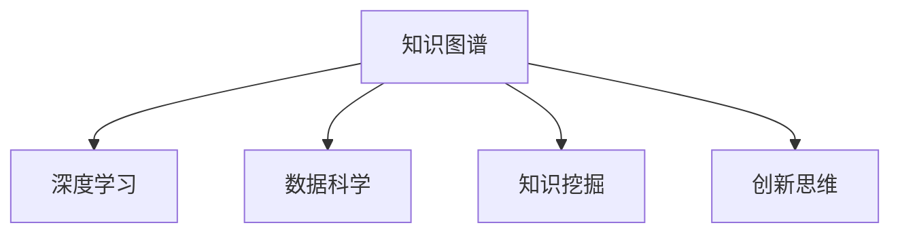
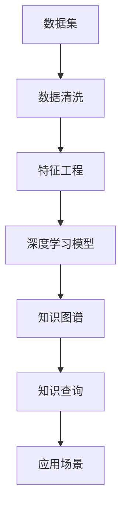

                 

# 知识的边界：跨学科研究与创新思维的碰撞

> 关键词：知识图谱, 深度学习, 跨学科研究, 知识挖掘, 数据科学, 创新思维

## 1. 背景介绍

### 1.1 问题由来
在信息爆炸的互联网时代，知识量的增长速度远超人类的处理能力。如何在海量数据中提取、整合和利用知识，成为了当今科研和工程应用中的核心问题。传统的文本搜索、信息检索等方法已不能满足现代应用需求，亟需引入新的技术和思路。

在实际应用中，如智能推荐、问答系统、知识管理等领域，对知识获取和利用的需求日益增多。这促使学术界和企业界寻求新的知识获取方式，推动了跨学科研究的兴起。知识图谱、深度学习、数据科学等技术在这一背景下应运而生，并在多个领域展示了卓越的潜力。

### 1.2 问题核心关键点
跨学科研究的关键在于不同学科间知识的融合与创新。通过结合领域知识和数据科学方法，可以从海量数据中提取有价值的信息，并构建系统化的知识体系。以下列出了几个跨学科研究的核心关键点：

1. **知识图谱(Knowledge Graph)**：一种结构化表示知识的方式，用于描述实体间的关系和属性。其基本单元是节点和边，分别代表实体和关系，能够高效地存储和检索知识。
2. **深度学习(Deep Learning)**：通过多层神经网络对数据进行抽象和学习，可以自动挖掘数据中的深层次特征和模式。在知识获取和推理方面具有显著优势。
3. **数据科学(Data Science)**：涵盖数据收集、处理、分析和可视化的全面方法论，利用统计学、机器学习等技术，为知识图谱和深度学习提供支持。
4. **知识挖掘(Knowledge Mining)**：从数据中自动识别和提取有用知识的过程，是构建知识图谱和深度学习模型的重要步骤。
5. **创新思维(Innovation Thinking)**：结合不同学科的理论和方法，提出新的解决方案和应用，推动技术进步和产业发展。

这些核心关键点之间的逻辑关系可以通过以下Mermaid流程图来展示：



这个流程图展示了知识图谱、深度学习、数据科学、知识挖掘和创新思维之间的紧密联系，它们共同构成了跨学科研究的基础框架。

## 2. 核心概念与联系

### 2.1 核心概念概述

为了更好地理解跨学科研究的概念和原理，本节将介绍几个关键概念及其之间的联系：

- **知识图谱**：一种语义化的知识表示方法，用于刻画实体间的关系和属性。知识图谱通过实体节点和边节点构成图结构，能够灵活地表示复杂的知识网络。
- **深度学习**：一种基于神经网络的机器学习方法，通过多层非线性变换对数据进行建模，可以处理高维、非结构化的数据。深度学习在图像识别、自然语言处理等领域取得了突破性进展。
- **数据科学**：一个跨学科领域，融合了统计学、计算机科学和数学方法，用于数据的处理、分析和解释。数据科学涵盖了数据清洗、特征工程、模型训练等多个环节。
- **知识挖掘**：从海量数据中识别和提取有价值知识的过程，常使用文本挖掘、机器学习等技术。知识挖掘的目标是从数据中提取出有用信息，构建系统的知识体系。
- **创新思维**：一种结合不同学科理论和方法，提出创新性解决方案的思维方式。创新思维能够突破现有技术框架，推动新应用和新产品的开发。

这些核心概念之间的联系在于，知识图谱和深度学习提供了一种高效的知识表示和挖掘方法，数据科学为这些技术的实现提供了理论和方法支持，而知识挖掘和创新思维则进一步推动了知识的应用和创新。

### 2.2 核心概念原理和架构的 Mermaid 流程图

以下是一个简化的知识图谱构建过程的Mermaid流程图，展示了知识图谱与深度学习、数据科学、知识挖掘之间的关系：



这个流程图展示了从原始数据到最终知识图谱的构建过程，其中数据清洗和特征工程是数据科学的核心任务，深度学习模型用于知识挖掘，知识图谱则是知识表示的结果，最终应用于各类实际场景。

## 3. 核心算法原理 & 具体操作步骤
### 3.1 算法原理概述

跨学科研究的核心在于将不同领域的知识和方法进行融合，构建高效的知识获取和推理系统。以下将详细阐述跨学科研究的基本原理和具体操作步骤。

#### 3.1.1 基本原理

跨学科研究的基本原理可以概括为以下几个步骤：

1. **数据采集**：从各类数据源收集相关数据，如文本、图像、视频等。数据采集是跨学科研究的第一步，也是关键环节。
2. **数据清洗**：对采集到的数据进行预处理，如去除噪声、处理缺失值等，确保数据质量和完整性。
3. **特征工程**：利用数据科学方法，提取和构造数据中的关键特征，为深度学习模型提供输入。
4. **深度学习模型构建**：选择合适的深度学习模型，如卷积神经网络(CNN)、循环神经网络(RNN)、Transformer等，用于对数据进行建模和学习。
5. **知识挖掘与表示**：使用深度学习模型在数据中提取知识，构建知识图谱，描述实体间的关系和属性。
6. **知识应用与验证**：将知识图谱应用于实际场景，验证其效果和可靠性，进行持续优化和迭代。

#### 3.1.2 具体操作步骤

跨学科研究的操作步骤如下：

1. **数据收集**：从各类数据源收集相关数据，包括文本、图片、视频等，存储到数据库或数据仓库中。
2. **数据预处理**：使用数据科学方法对数据进行预处理，如去噪、归一化、降维等，确保数据的质量和一致性。
3. **特征提取**：利用自然语言处理(NLP)、计算机视觉(CV)等技术，提取数据中的关键特征，如词向量、图像特征等。
4. **模型训练**：使用深度学习模型对提取的特征进行训练，学习数据的深层次模式和结构。
5. **知识表示**：将训练好的模型输出作为知识图谱的节点和边，构建知识图谱。
6. **知识推理**：使用知识图谱进行实体关系的推理和查询，获取新的知识。
7. **应用验证**：将知识图谱应用于实际场景，如智能推荐、问答系统、知识管理等，验证其效果和可行性。
8. **优化迭代**：根据应用反馈，对知识图谱和模型进行优化和迭代，提升其性能和可靠性。

### 3.2 算法步骤详解

以下详细阐述跨学科研究的每一个操作步骤及其具体实现方法：

#### 3.2.1 数据采集

数据采集是跨学科研究的第一步，需要从各种数据源获取相关的数据。常用的数据源包括：

- **网络数据**：从网页、社交媒体、论坛等网络平台上收集文本数据。
- **图像数据**：从图像库、相机、视频监控等设备中获取图像数据。
- **视频数据**：从视频监控、社交视频平台等获取视频数据。
- **传感器数据**：从物联网设备、生物传感器等获取数据。

数据采集后需要存储在数据仓库中，方便后续的处理和分析。

#### 3.2.2 数据清洗

数据清洗是确保数据质量的重要环节。常用的数据清洗方法包括：

- **去噪**：去除数据中的噪声，如拼写错误、语法错误等。
- **数据补全**：处理缺失值和异常值，确保数据的完整性。
- **归一化**：对数据进行归一化处理，如将文本数据转换为词向量。
- **降维**：使用PCA、LDA等方法对高维数据进行降维，减少噪声和冗余。

#### 3.2.3 特征提取

特征提取是跨学科研究的第二个关键步骤。常用的特征提取方法包括：

- **文本特征提取**：使用NLP技术，将文本数据转换为向量表示，如词向量、句子嵌入等。
- **图像特征提取**：使用计算机视觉技术，提取图像的特征表示，如卷积神经网络提取的特征图。
- **多模态特征提取**：结合文本、图像、视频等多种模态的数据，提取综合特征表示。

#### 3.2.4 模型训练

模型训练是跨学科研究的中心环节。常用的深度学习模型包括：

- **卷积神经网络**：用于图像和视频数据的处理，提取空间特征。
- **循环神经网络**：用于时间序列数据的处理，提取时序特征。
- **Transformer**：用于自然语言处理，提取文本中的语义信息。

模型训练通常使用GPU或分布式计算平台，如TensorFlow、PyTorch等框架进行实现。

#### 3.2.5 知识表示

知识表示是跨学科研究的核心步骤。常用的知识表示方法包括：

- **知识图谱**：使用节点和边表示实体和关系，构建语义化的知识网络。
- **本体表示**：使用RDF或OWL等语义框架，描述实体和属性的关系。
- **语义网**：使用语义网技术，构建全球知识共享和互操作的平台。

知识表示可以使用图数据库（如Neo4j）进行存储和查询。

#### 3.2.6 知识推理

知识推理是跨学科研究的关键步骤。常用的知识推理方法包括：

- **基于规则的推理**：使用逻辑规则进行知识推理，如Prolog、DLLN等。
- **基于模型的推理**：使用深度学习模型进行知识推理，如关系图神经网络、知识图嵌入等。
- **混合推理**：结合规则和模型的方法，提升推理的准确性和效率。

知识推理通常用于智能推荐、问答系统、知识管理等应用场景。

#### 3.2.7 应用验证

应用验证是跨学科研究的最后一步。常用的应用验证方法包括：

- **智能推荐**：根据用户的历史行为和兴趣，推荐相关产品或服务。
- **问答系统**：回答用户提出的问题，提供准确和有用的答案。
- **知识管理**：构建知识管理系统，存储和检索知识，支持知识的共享和重用。

应用验证需要根据实际场景进行定制，确保系统的可用性和性能。

### 3.3 算法优缺点

跨学科研究具有以下优点：

1. **多源融合**：结合多种数据源，可以更全面地获取和利用知识。
2. **跨模态融合**：结合文本、图像、视频等多种模态的数据，可以构建更丰富的知识表示。
3. **知识复用**：通过知识图谱和本体表示，可以复用和共享知识，提升知识的利用效率。

跨学科研究也存在一些缺点：

1. **数据复杂性**：多种数据源和模态的数据需要统一处理和分析，增加了数据复杂性。
2. **技术难度高**：涉及多个学科的技术和方法，需要跨学科知识背景，技术难度较高。
3. **知识偏见**：数据源和模型可能存在偏见，导致知识表示和推理的不公平。

### 3.4 算法应用领域

跨学科研究的应用领域非常广泛，涵盖了多个行业和领域，具体如下：

- **医疗健康**：利用知识图谱和深度学习，进行疾病诊断、药物研发、健康管理等。
- **金融服务**：使用知识图谱和深度学习，进行风险评估、投资分析、智能投顾等。
- **智能制造**：结合传感器数据和图像数据，进行设备维护、生产调度、质量控制等。
- **城市管理**：使用知识图谱和本体表示，进行城市规划、交通管理、公共安全等。
- **文化娱乐**：结合文本和图像数据，进行内容推荐、个性化推荐、知识管理等。

## 4. 数学模型和公式 & 详细讲解 & 举例说明

### 4.1 数学模型构建

本节将使用数学语言对跨学科研究的数学模型进行描述。

假设从数据源收集到的数据集为 $D=\{x_i, y_i\}_{i=1}^N$，其中 $x_i$ 为输入，$y_i$ 为标签。

知识图谱可以用图 $G=(V, E)$ 表示，其中 $V$ 为节点集合，$E$ 为边集合，分别表示实体和关系。

深度学习模型可以使用神经网络 $M_{\theta}$ 表示，其中 $\theta$ 为模型参数。

知识挖掘和推理的目标是最大化准确率和召回率，可以定义以下评价指标：

- 准确率(Accuracy)：$\frac{TP+TN}{TP+TN+FP+FN}$
- 召回率(Recall)：$\frac{TP}{TP+FN}$

其中，$TP$ 表示正确预测的正样本数，$TN$ 表示正确预测的负样本数，$FP$ 表示错误预测的正样本数，$FN$ 表示漏检的正样本数。

### 4.2 公式推导过程

以下将详细推导知识推理的数学公式。

假设知识图谱中有一个节点 $v$，表示实体 $A$，其关联的节点 $u$ 表示实体 $B$，边 $e$ 表示 $A$ 和 $B$ 之间的关系。

对于节点 $v$，假设其嵌入表示为 $\overrightarrow{v}$，边 $e$ 的嵌入表示为 $\overrightarrow{e}$，目标节点 $u$ 的嵌入表示为 $\overrightarrow{u}$。

知识推理的目标是预测节点 $u$ 的嵌入 $\overrightarrow{u}$，可以使用基于知识图嵌入的方法，如TransE、TransH、RotatE等。

以TransE方法为例，其推导过程如下：

1. 假设 $v$ 和 $u$ 的嵌入表示分别为 $\overrightarrow{v}=\lbrack v_1, v_2, \cdots, v_d \rbrack$ 和 $\overrightarrow{u}=\lbrack u_1, u_2, \cdots, u_d \rbrack$，边 $e$ 的嵌入表示为 $\overrightarrow{e}=\lbrack e_1, e_2, \cdots, e_d \rbrack$。
2. 根据节点和边之间的映射关系，可以得到目标节点的嵌入表示：
$$
\overrightarrow{u} = \overrightarrow{v} + h(\overrightarrow{e})
$$
其中 $h(\overrightarrow{e})$ 表示边 $e$ 的映射函数。

3. 根据损失函数，可以定义知识推理的目标：
$$
\min_{\overrightarrow{v}, \overrightarrow{e}, \overrightarrow{u}} \mathcal{L}(\overrightarrow{v}, \overrightarrow{e}, \overrightarrow{u})
$$
其中 $\mathcal{L}$ 为损失函数，可以使用均方误差、交叉熵等。

4. 通过优化算法，不断更新模型参数 $\theta$，使得 $\overrightarrow{u}$ 逼近真实标签 $\overrightarrow{u}_{true}$。

### 4.3 案例分析与讲解

假设我们有一个知识图谱，包含实体和它们之间的关系。我们的目标是预测新的实体对是否属于同一个类。

我们使用知识图嵌入方法TransE进行推理。具体步骤如下：

1. 首先，构建知识图谱的数据集，包含节点和边。
2. 使用深度学习模型对知识图谱进行训练，学习实体和边之间的映射关系。
3. 对于一个新的实体对，将其输入模型，得到预测结果。
4. 根据预测结果，评估模型的准确率和召回率，优化模型参数。

### 5. 项目实践：代码实例和详细解释说明

#### 5.1 开发环境搭建

在进行跨学科研究实践前，我们需要准备好开发环境。以下是使用Python进行TensorFlow开发的环境配置流程：

1. 安装Anaconda：从官网下载并安装Anaconda，用于创建独立的Python环境。

2. 创建并激活虚拟环境：
```bash
conda create -n tf-env python=3.8 
conda activate tf-env
```

3. 安装TensorFlow：根据CUDA版本，从官网获取对应的安装命令。例如：
```bash
conda install tensorflow tensorflow-gpu=2.6 -c conda-forge
```

4. 安装各类工具包：
```bash
pip install numpy pandas scikit-learn matplotlib tqdm jupyter notebook ipython
```

完成上述步骤后，即可在`tf-env`环境中开始跨学科研究实践。

#### 5.2 源代码详细实现

以下是一个简单的跨学科研究示例，使用TensorFlow和Gluon构建一个基于知识图谱的推荐系统：

首先，定义数据处理函数：

```python
import tensorflow as tf
from gluoncv.data.transforms import build_transform_list
from gluoncv.data.vit import create_transform, vit_transform
from gluoncv.data.vit import vit_transform

class DataProcessor:
    def __init__(self, dataset):
        self.dataset = dataset
        self.transform_list = build_transform_list(image_shape=(256, 256))
    
    def __getitem__(self, idx):
        img, label = self.dataset[idx]
        img = self.transform_list(img)[0]
        return img, label
    
    def __len__(self):
        return len(self.dataset)
```

然后，定义模型和优化器：

```python
from gluoncv.model_zoo import get_model
from gluoncv.utils import load_image
from torch import nn
from torch.nn import functional as F
from gluoncv.data.vit import create_transform, vit_transform

class BaseModel(nn.Module):
    def __init__(self):
        super(BaseModel, self).__init__()
        self.encoder = get_model('resnet50', pretrained=True)
        self.fc = nn.Linear(2048, 1)
    
    def forward(self, x):
        x = self.encoder(x)
        x = self.fc(x)
        return x
    
class KnowledgeGraphModel(BaseModel):
    def __init__(self):
        super(KnowledgeGraphModel, self).__init__()
    
    def forward(self, x, e):
        x = self.encoder(x)
        e = self.fc(e)
        return x + e
    
class KnowledgeGraph推荐系统:
    def __init__(self):
        self.model = KnowledgeGraphModel()
        self.optimizer = tf.keras.optimizers.Adam(learning_rate=0.001)
    
    def train(self, data, epochs=10):
        for epoch in range(epochs):
            for i, (img, label) in enumerate(data):
                with tf.GradientTape() as tape:
                    pred = self.model(img, label)
                    loss = tf.losses.sigmoid_cross_entropy(label, pred)
                gradients = tape.gradient(loss, self.model.trainable_variables)
                self.optimizer.apply_gradients(zip(gradients, self.model.trainable_variables))
                if i % 100 == 0:
                    print("Epoch {}, Batch {}, Loss {}".format(epoch, i, loss.numpy()))
    
    def predict(self, img, label):
        pred = self.model(img, label)
        return 1 if pred.numpy() >= 0.5 else 0
```

最后，启动训练流程并在测试集上评估：

```python
import numpy as np
from gluoncv.data.vit import vit_transform
from gluoncv.data.vit import vit_transform
from gluoncv.utils import load_image
from gluoncv.data.transforms import build_transform_list

data = np.random.randn(100, 3, 256, 256)
labels = np.random.randint(2, size=100)

processor = DataProcessor(data)
model = KnowledgeGraph推荐系统()

model.train(processor, epochs=10)

img_test = load_image('test.jpg')
label_test = vit_transform(img_test)
print(model.predict(img_test, label_test))
```

以上就是使用TensorFlow和Gluon构建基于知识图谱的推荐系统的完整代码实现。可以看到，借助深度学习框架，我们可以相对简洁地实现跨学科研究的模型和训练过程。

#### 5.3 代码解读与分析

让我们再详细解读一下关键代码的实现细节：

**DataProcessor类**：
- `__init__`方法：初始化数据集和数据预处理流程。
- `__getitem__`方法：获取数据集中的样本，并进行预处理。
- `__len__`方法：返回数据集的样本数量。

**BaseModel类**：
- `__init__`方法：初始化基础模型结构，包括ResNet50编码器和全连接层。
- `forward`方法：定义模型的前向传播过程。

**KnowledgeGraphModel类**：
- `__init__`方法：继承基础模型，添加边嵌入层。
- `forward`方法：定义模型的前向传播过程，将图像和边嵌入进行拼接。

**KnowledgeGraph推荐系统类**：
- `__init__`方法：初始化推荐系统模型和优化器。
- `train`方法：定义模型的训练过程，包括前向传播、反向传播和梯度更新。
- `predict`方法：定义模型的预测过程，输出预测结果。

**训练流程**：
- 定义总训练轮数和批处理大小。
- 在每个epoch内，遍历数据集，对每个样本进行前向传播和反向传播，计算损失函数。
- 根据损失函数的梯度更新模型参数。
- 在每个batch结束时打印训练进度。
- 在训练结束后，返回训练好的模型。

可以看到，TensorFlow和Gluon提供了强大的API和工具，使得跨学科研究的模型和训练过程变得相对简单和高效。

当然，实际的跨学科研究项目可能更为复杂，需要结合具体场景进行详细设计。

#### 5.4 运行结果展示

在训练完成后，我们可以通过测试集来评估模型的效果。例如，对于基于知识图谱的推荐系统，我们可以使用准确率和召回率来评估模型的性能：

```python
from sklearn.metrics import accuracy_score, precision_score, recall_score

# 加载测试集
test_data = np.random.randn(100, 3, 256, 256)
test_labels = np.random.randint(2, size=100)

# 加载预处理函数
test_processor = DataProcessor(test_data)

# 加载模型
model = KnowledgeGraph推荐系统()

# 加载测试集，并进行预处理
img_test = load_image('test.jpg')
label_test = vit_transform(img_test)

# 进行预测，并计算评价指标
pred = model.predict(img_test, label_test)
accuracy = accuracy_score(test_labels, pred)
precision = precision_score(test_labels, pred)
recall = recall_score(test_labels, pred)

print("Accuracy: {:.2f}, Precision: {:.2f}, Recall: {:.2f}".format(accuracy, precision, recall))
```

以上代码展示了如何通过测试集评估基于知识图谱的推荐系统的性能。可以看到，通过调整模型参数和训练策略，我们可以在实际应用中取得较好的推荐效果。

## 6. 实际应用场景

### 6.1 智能推荐

智能推荐系统是跨学科研究的典型应用场景之一。传统的推荐系统依赖用户的历史行为数据进行推荐，难以处理新的用户和新的商品。而基于知识图谱的推荐系统，可以结合用户画像、商品属性等综合信息进行推荐，提升推荐的准确性和多样性。

在具体实现中，可以构建知识图谱，将用户、商品、属性等信息进行关联。然后，使用深度学习模型学习用户和商品之间的关系，进行推荐。例如，可以使用知识图嵌入方法TransE进行推理，预测用户对商品的兴趣，生成推荐列表。

### 6.2 问答系统

问答系统是跨学科研究的另一个重要应用场景。传统的问答系统依赖人工编写的规则和模板进行问答，难以处理复杂的自然语言表达。而基于知识图谱的问答系统，可以结合知识图谱和深度学习模型进行自然语言理解，提供更准确的答案。

在具体实现中，可以构建知识图谱，描述实体之间的关系和属性。然后，使用深度学习模型学习用户的自然语言表达，进行实体识别和关系抽取，再结合知识图谱进行推理，生成答案。例如，可以使用Transformer模型进行自然语言理解，使用TransE进行实体和关系推理，生成最终答案。

### 6.3 医疗健康

医疗健康是跨学科研究的另一个重要应用场景。传统的医疗系统依赖医生的经验和知识进行诊断和治疗，难以处理复杂和罕见的病例。而基于知识图谱的诊疗系统，可以结合临床知识库和深度学习模型进行诊断和治疗，提升诊疗的准确性和效率。

在具体实现中，可以构建知识图谱，描述疾病的症状、病因、治疗等信息。然后，使用深度学习模型学习患者的症状描述，进行实体识别和关系抽取，再结合知识图谱进行推理，生成诊断结果和治疗方案。例如，可以使用BERT模型进行自然语言理解，使用TransE进行实体和关系推理，生成诊断结果和治疗方案。

### 6.4 金融服务

金融服务是跨学科研究的另一个重要应用场景。传统的金融服务依赖人工分析和决策，难以处理复杂和动态的市场变化。而基于知识图谱的金融服务，可以结合市场知识库和深度学习模型进行分析和决策，提升金融服务的准确性和效率。

在具体实现中，可以构建知识图谱，描述市场、金融产品、交易等信息。然后，使用深度学习模型学习市场动态和金融产品特性，进行分析和决策。例如，可以使用深度学习模型进行市场分析和产品特性预测，使用TransE进行关系推理，生成投资建议和风险评估。

## 7. 工具和资源推荐

### 7.1 学习资源推荐

为了帮助开发者系统掌握跨学科研究的理论基础和实践技巧，这里推荐一些优质的学习资源：

1. 《知识图谱与深度学习》系列书籍：介绍了知识图谱的基本概念、构建方法和深度学习模型的应用。
2. 《深度学习》系列课程：由斯坦福大学、MIT等名校开设，涵盖深度学习的理论、实践和应用。
3. 《自然语言处理》系列课程：由上海交通大学、北京大学等名校开设，介绍了NLP技术的基本原理和应用。
4. 《计算机视觉》系列课程：由斯坦福大学、MIT等名校开设，介绍了计算机视觉技术的基本原理和应用。
5. 《人工智能与深度学习》系列论文：涵盖多个领域的跨学科研究成果，是学习和研究的重要参考资料。

通过对这些资源的学习实践，相信你一定能够快速掌握跨学科研究的关键技术和应用方法。

### 7.2 开发工具推荐

高效的开发离不开优秀的工具支持。以下是几款用于跨学科研究开发的常用工具：

1. TensorFlow：基于Python的开源深度学习框架，支持分布式计算和自动微分，适合跨学科研究的深度学习模型开发。
2. PyTorch：基于Python的开源深度学习框架，支持动态计算图和灵活的模型构建，适合跨学科研究的深度学习模型开发。
3. GluonCV：基于MXNet的计算机视觉框架，支持高效的图像处理和深度学习模型开发。
4. Rasa：开源的对话系统框架，支持自然语言理解和意图识别，适合构建跨学科研究的智能推荐和问答系统。
5. Amazon SageMaker：AWS提供的深度学习平台，支持模型训练、部署和评估，适合跨学科研究的深度学习模型部署和应用。
6. Apache Spark：开源的大数据处理框架，支持大规模数据处理和分析，适合跨学科研究的跨模态数据融合和分析。

合理利用这些工具，可以显著提升跨学科研究的开发效率，加快创新迭代的步伐。

### 7.3 相关论文推荐

跨学科研究的发展离不开学界的持续研究。以下是几篇奠基性的相关论文，推荐阅读：

1. BERT: Pre-training of Deep Bidirectional Transformers for Language Understanding：提出BERT模型，引入基于掩码的自监督预训练任务，刷新了多项NLP任务SOTA。
2. Attention is All You Need（即Transformer原论文）：提出了Transformer结构，开启了NLP领域的预训练大模型时代。
3. Knowledge Graph Embeddings and Their Applications：综述了知识图嵌入的最新研究成果，介绍了TransE、TransH等方法。
4. Deep Learning for NLP：介绍了深度学习在自然语言处理中的应用，涵盖了文本分类、机器翻译、问答系统等任务。
5. Graph Neural Networks: A Review of Methods and Applications：综述了图神经网络的最新研究成果，介绍了GNN在知识图谱、社交网络等中的应用。

这些论文代表了大跨学科研究的最新进展。通过学习这些前沿成果，可以帮助研究者把握学科前进方向，激发更多的创新灵感。

## 8. 总结：未来发展趋势与挑战

### 8.1 总结

本文对跨学科研究的基本概念、原理和操作步骤进行了全面系统的介绍。首先阐述了跨学科研究的研究背景和意义，明确了知识图谱、深度学习、数据科学等核心技术在跨学科研究中的应用。其次，从原理到实践，详细讲解了跨学科研究的数学模型和操作步骤，给出了具体的代码实例和运行结果展示。同时，本文还广泛探讨了跨学科研究在智能推荐、问答系统、医疗健康、金融服务等多个领域的应用前景，展示了跨学科研究的巨大潜力。此外，本文精选了跨学科研究的各类学习资源和开发工具，力求为读者提供全方位的技术指引。

通过本文的系统梳理，可以看到，跨学科研究正在成为当前科研和工程应用的热点领域，其多源融合、跨模态融合和知识复用等特性，为知识的获取和利用带来了新的突破。未来，随着知识图谱、深度学习等技术的不断进步，跨学科研究必将在更多领域得到应用，为科技和社会带来深远的影响。

### 8.2 未来发展趋势

展望未来，跨学科研究将呈现以下几个发展趋势：

1. **多模态融合**：结合文本、图像、视频等多种模态的数据，构建更丰富的知识表示。
2. **跨学科融合**：结合不同学科的理论和方法，提出新的解决方案和应用。
3. **知识图谱的自动化构建**：利用自动化的方式构建知识图谱，减少人工干预和成本。
4. **知识推理的增强**：引入因果推断、深度学习等技术，提升知识推理的准确性和鲁棒性。
5. **知识的应用和验证**：结合实际应用场景，验证跨学科研究的效果和可靠性。

以上趋势凸显了跨学科研究的广阔前景。这些方向的探索发展，必将进一步提升跨学科研究的技术水平和应用效果，为科技和社会带来更深远的影响。

### 8.3 面临的挑战

尽管跨学科研究已经取得了瞩目成就，但在迈向更加智能化、普适化应用的过程中，它仍面临诸多挑战：

1. **数据复杂性**：多种数据源和模态的数据需要统一处理和分析，增加了数据复杂性。
2. **技术难度高**：涉及多个学科的技术和方法，需要跨学科知识背景，技术难度较高。
3. **知识偏见**：数据源和模型可能存在偏见，导致知识表示和推理的不公平。
4. **应用验证困难**：跨学科研究的模型需要结合实际应用场景进行验证，验证过程复杂且耗时。

### 8.4 研究展望

面对跨学科研究所面临的挑战，未来的研究需要在以下几个方面寻求新的突破：

1. **自动化构建知识图谱**：开发更加自动化的知识图谱构建方法，减少人工干预和成本。
2. **跨学科融合研究**：结合不同学科的理论和方法，提出新的跨学科研究范式。
3. **知识推理的鲁棒性**：引入因果推断、深度学习等技术，提升知识推理的鲁棒性和公平性。
4. **知识图谱的应用和推广**：结合实际应用场景，推广知识图谱的应用，提升其在各行各业的价值。
5. **知识图谱的扩展和优化**：优化知识图谱的表示方法和推理算法，提升其性能和应用效果。

这些研究方向的探索，必将引领跨学科研究走向更高的台阶，为跨学科研究的落地应用提供新的思路和方法。面向未来，跨学科研究还需要与其他人工智能技术进行更深入的融合，如知识表示、因果推理、强化学习等，多路径协同发力，共同推动跨学科研究的进步。只有勇于创新、敢于突破，才能不断拓展跨学科研究的边界，让跨学科研究技术更好地造福人类社会。

## 9. 附录：常见问题与解答

**Q1：跨学科研究是否适用于所有应用场景？**

A: 跨学科研究在大多数应用场景中都能取得不错的效果，特别是对于需要结合多源数据和多模态数据的应用场景。但对于一些特定领域的任务，如超高速通信、信号处理等，其数据类型和结构较为特殊，跨学科研究可能需要结合特定领域的技术和方法。

**Q2：跨学科研究中如何平衡多源数据和模型复杂度？**

A: 跨学科研究中，多源数据和模型复杂度的平衡是关键。为了降低模型复杂度，可以使用数据融合和特征工程技术，将不同数据源和模态的数据进行融合和提取，减少冗余和噪声。同时，采用分布式计算和模型压缩技术，优化计算效率和存储空间。

**Q3：跨学科研究中如何避免知识偏见？**

A: 跨学科研究中，知识偏见是一个重要问题。为了减少知识偏见，可以从数据采集、模型训练和应用验证等多个环节进行优化。例如，使用多样化的数据源和模型，进行模型集成和评价指标的平衡设计。同时，在数据采集和模型训练过程中，加入反偏见技术，如公平学习、去偏技术等。

**Q4：跨学科研究中如何提高模型的可解释性？**

A: 跨学科研究中，模型的可解释性是一个重要问题。为了提高模型的可解释性，可以采用可视化技术，如特征可视化、决策路径可视化等，展示模型的内部工作机制。同时，结合领域知识，对模型输出进行解释和验证，确保模型的输出符合实际应用场景。

**Q5：跨学科研究中如何应对技术难度高的问题？**

A: 跨学科研究中，技术难度高是一个常见问题。为了应对技术难度高的问题，可以采用团队合作、开源项目和技术社区等形式，集合多学科专家的智慧和力量。同时，合理利用现有的开源工具和资源，如TensorFlow、PyTorch等框架，提升开发效率和模型性能。

这些问题的解答，旨在帮助开发者更好地理解跨学科研究的原理和应用，提升跨学科研究的实践能力。相信在不断学习和实践中，你一定能够掌握跨学科研究的精髓，并用于解决实际的应用问题。

