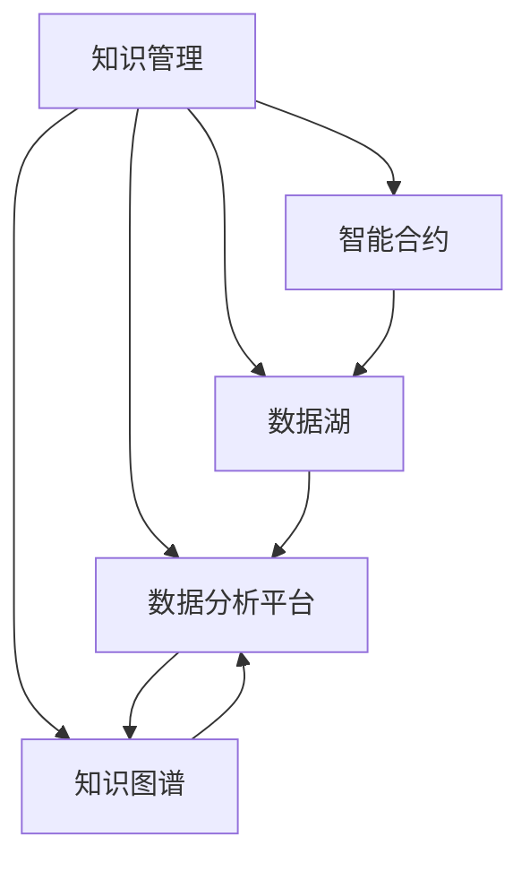

                 

# 知识管理在能源行业的实践

## 1. 背景介绍

在当今能源行业，随着智能化、信息化水平的不断提升，如何高效管理和利用知识资产，成为企业提升竞争力的关键。与传统能源企业相比，数字化转型中的新老能源企业都在寻求通过知识管理手段，优化内部流程、提升决策效率、降低运营成本、加强创新能力。与此同时，能源行业的复杂性，给知识管理系统的构建提出了更高的要求，即满足多样化的数据类型、应对不确定性、保障数据安全等。本文旨在探讨知识管理在能源行业的应用，提出一套可行的解决方案，为能源行业的知识管理实践提供参考。

## 2. 核心概念与联系

### 2.1 核心概念概述

为更好地理解知识管理在能源行业的应用，本文将介绍几个核心概念：

- **知识管理**（Knowledge Management, KMS）：通过技术手段，对组织内部或外部的显性知识和隐性知识进行收集、整理、存储、共享和应用，以提升企业决策效率和创新能力的过程。
- **能源行业**：涵盖煤炭、石油、天然气、核能等传统能源，以及风能、太阳能、氢能等新型能源领域。
- **智能合约**：使用区块链技术的自动化合约，可自动执行合同条款，减少人为干预，提升交易效率。
- **数据湖**：一个集中的、基于云的数据存储系统，用于处理和存储来自不同来源的海量数据。
- **数据分析平台**：提供数据查询、数据挖掘、机器学习等功能的平台，支持数据驱动决策。
- **知识图谱**：一种结构化的知识表示方法，用于组织、整合和查询复杂且多源的知识信息。

### 2.2 核心概念原理和架构的 Mermaid 流程图(Mermaid 流程节点中不要有括号、逗号等特殊字符)



## 3. 核心算法原理 & 具体操作步骤

### 3.1 算法原理概述

知识管理系统的构建，主要围绕知识的收集、存储、整理、共享和应用展开。核心在于建立一个以用户为中心的知识生态，通过信息检索、协作工具、知识图谱等方式，提升组织内的知识共享和应用效率。在能源行业，知识管理的重点在于确保能源数据的实时更新和高效分析，以支持智能合约、数据湖和数据分析平台等应用。

### 3.2 算法步骤详解

基于以上原理，知识管理在能源行业的应用主要包括以下步骤：

**Step 1: 知识收集**
- 通过传感器、数据接口等方式，收集来自智能电网、可再生能源设备、能源市场等的数据，为知识管理提供数据源。
- 利用自然语言处理技术，从新闻、报告、会议记录等非结构化数据中提取关键信息。

**Step 2: 知识存储**
- 利用数据湖等技术，集中存储各种类型的数据，包括结构化、半结构化和非结构化数据。
- 实现数据的分层管理和元数据管理，保障数据的可追溯性和一致性。

**Step 3: 知识整理**
- 使用知识图谱等技术，将数据转换为可查询、可推理的结构化知识。
- 利用机器学习算法，自动识别数据之间的关系，建立知识图谱的自动构建机制。

**Step 4: 知识共享**
- 构建基于网络的协作平台，支持在线文档共享、讨论、评论等功能。
- 通过社交网络和推荐系统，提升知识发现和共享的效率。

**Step 5: 知识应用**
- 集成智能合约、数据分析平台等应用，支持自动化决策和实时数据分析。
- 通过知识图谱，实现复杂场景下的多源信息融合和智能推理。

**Step 6: 知识评估**
- 定期评估知识管理系统的性能，包括知识共享率、决策效率等指标。
- 根据评估结果，优化知识管理系统的策略和架构。

### 3.3 算法优缺点

知识管理系统在能源行业的应用，具有以下优点：
1. 提升决策效率。通过集中管理和高效分析，提升决策的准确性和及时性。
2. 降低运营成本。减少人工干预，自动化流程降低人力成本。
3. 增强创新能力。基于数据驱动的洞察，推动能源技术和产品创新。

同时，该方法也存在一定的局限性：
1. 数据质量和完整性问题。数据收集和整合过程中，可能存在数据缺失或错误。
2. 知识图谱构建的复杂性。需要强大的技术支撑和大量前期工作。
3. 数据安全问题。大量数据集中存储可能面临数据泄露和安全攻击的风险。
4. 用户接受度问题。新技术的引入可能遭遇用户的抵触和不适应。

### 3.4 算法应用领域

知识管理在能源行业的应用，主要包括以下几个领域：

- **智能合约**：通过区块链技术，实现能源交易的自动执行和合同条款的智能管理。
- **数据湖**：构建集中存储海量能源数据的平台，支持数据分析和挖掘。
- **数据分析平台**：提供数据查询、分析、可视化等功能，辅助能源决策。
- **知识图谱**：用于能源领域的知识表示和推理，支持复杂能源场景下的多源信息整合。

## 4. 数学模型和公式 & 详细讲解 & 举例说明

### 4.1 数学模型构建

基于知识管理的应用，构建数学模型时，通常需要考虑以下关键因素：

- **数据收集模型**：用于描述不同来源数据的收集方式和频率。
- **数据存储模型**：用于描述数据湖中数据的存储结构和管理策略。
- **知识图谱模型**：用于描述知识图谱的构建过程和推理机制。
- **知识应用模型**：用于描述知识管理系统与业务应用的集成方式和效果评估。

### 4.2 公式推导过程

以数据收集模型为例，假设有一个智能电网的数据源 $S$，可以产生数据流 $D$，模型可以描述为：

$$
D = f(S, t)
$$

其中 $t$ 表示时间，$f$ 为数据收集函数。

在实际应用中，数据收集函数 $f$ 可以表示为：

$$
f(S, t) = \sum_{i=1}^N f_i(S, t)
$$

其中 $f_i$ 表示不同类型的数据收集函数，$N$ 表示数据类型总数。

### 4.3 案例分析与讲解

在智能合约应用中，知识管理系统的构建可以基于以下数据：

- **能源市场价格**：采集不同时间段的市场价格数据，用于实时定价和合同执行。
- **智能电网状态**：采集智能电网的实时状态数据，用于智能合约的触发和执行。
- **气象数据**：采集气象部门发布的气象信息，用于风险评估和合同调整。

这些数据通过数据湖集中存储，并经过知识图谱的整合，形成可用于智能合约推理的知识库。

## 5. 项目实践：代码实例和详细解释说明

### 5.1 开发环境搭建

开发环境搭建主要包括以下步骤：

1. 安装相关软件：包括Python、Jupyter Notebook、TensorFlow等。
2. 搭建知识管理系统的架构：包括数据湖、知识图谱、智能合约等组件。
3. 配置环境变量：包括数据库连接、API接口配置等。
4. 部署系统：使用Kubernetes或Docker等容器化技术，将知识管理系统部署到云平台。

### 5.2 源代码详细实现

下面以智能合约的实现为例，给出具体代码实现：

```python
import tensorflow as tf
from tf_keras.layers.experimental import preprocessing
from tensorflow.keras import layers

class ContractModel(tf.keras.Model):
    def __init__(self, num_features, num_labels):
        super(ContractModel, self).__init__()
        self.dense1 = layers.Dense(128, activation='relu')
        self.dense2 = layers.Dense(num_labels, activation='sigmoid')
        
    def call(self, inputs):
        x = self.dense1(inputs)
        return self.dense2(x)

def compile_model(model, optimizer, loss):
    model.compile(optimizer=optimizer, loss=loss)

# 加载数据
train_dataset = tf.data.Dataset.from_tensor_slices((x_train, y_train))
val_dataset = tf.data.Dataset.from_tensor_slices((x_val, y_val))

# 构建模型
model = ContractModel(num_features, num_labels)
optimizer = tf.keras.optimizers.Adam(learning_rate=0.001)
compile_model(model, optimizer, 'binary_crossentropy')

# 训练模型
model.fit(train_dataset, epochs=10, validation_data=val_dataset)

# 应用模型
prediction = model.predict(x_test)
```

### 5.3 代码解读与分析

上述代码实现了一个简单的智能合约模型，用于判断合同是否执行。具体步骤如下：

1. 定义模型结构，包括两个全连接层，输出层使用sigmoid激活函数，适用于二分类任务。
2. 定义模型的编译过程，包括设置优化器和损失函数。
3. 加载数据集，包括训练集和验证集。
4. 训练模型，使用交叉熵损失函数和Adam优化器，进行10个epoch的训练。
5. 应用模型，对测试集进行预测，输出合同执行的概率。

## 6. 实际应用场景

### 6.1 智能合约在能源行业的具体应用

在能源行业中，智能合约的应用场景包括：

- **能源交易**：用于实时交易价格的自动执行和调整，确保交易的公平性和透明度。
- **能源管理**：用于智能电网的实时监控和管理，确保电网稳定运行。
- **环境监测**：用于监测可再生能源项目的运行状态和环境影响，保障项目的可持续性。

### 6.2 数据湖在能源行业的具体应用

数据湖在能源行业的应用主要包括以下几个方面：

- **能源市场数据存储**：存储来自不同能源市场的实时数据，如电力价格、天然气价格等。
- **能源设备数据存储**：存储来自智能电网的设备数据，如传感器数据、状态数据等。
- **气象数据存储**：存储气象部门发布的气象数据，用于能源预测和风险评估。

### 6.3 数据分析平台在能源行业的具体应用

数据分析平台在能源行业的应用主要包括以下几个方面：

- **能源市场分析**：通过数据分析，实时监测和预测能源市场价格趋势。
- **能源设备监测**：通过数据分析，实时监测能源设备的运行状态和故障预警。
- **环境影响评估**：通过数据分析，评估可再生能源项目对环境的影响。

### 6.4 知识图谱在能源行业的具体应用

知识图谱在能源行业的应用主要包括以下几个方面：

- **能源知识整合**：整合来自不同来源的能源知识，形成统一的知识图谱。
- **能源知识推理**：基于知识图谱进行能源知识的推理和查询。
- **能源知识推荐**：根据用户查询，推荐相关的能源知识资源。

## 7. 工具和资源推荐

### 7.1 学习资源推荐

1. **《智能合约与区块链技术》**：介绍智能合约的基本概念、设计原理和应用场景，适合能源行业的初学者。
2. **《数据湖与大数据分析》**：介绍数据湖的构建和数据管理的最佳实践，适合能源行业的数据工程师。
3. **《知识图谱理论与实践》**：介绍知识图谱的基本概念、构建方法和应用案例，适合能源行业的知识管理工程师。
4. **《TensorFlow实战》**：介绍TensorFlow的基本用法和案例分析，适合能源行业的软件开发工程师。
5. **《Kubernetes实战》**：介绍Kubernetes的基本用法和案例分析，适合能源行业的系统运维工程师。

### 7.2 开发工具推荐

1. **TensorFlow**：开源深度学习框架，适用于构建智能合约和数据分析平台。
2. **PyTorch**：开源深度学习框架，适用于构建复杂模型和知识图谱。
3. **Jupyter Notebook**：开源笔记本环境，支持Python代码的交互式执行和展示。
4. **Docker**：开源容器化技术，适用于知识管理系统和智能合约的部署。
5. **Kubernetes**：开源容器编排技术，适用于知识管理系统和智能合约的自动化部署和运维。

### 7.3 相关论文推荐

1. **《智能合约：区块链技术中的自动化合约》**：介绍智能合约的基本概念、设计和应用，适合能源行业的初学者。
2. **《数据湖的构建和应用》**：介绍数据湖的构建和应用最佳实践，适合能源行业的数据工程师。
3. **《知识图谱的构建与推理》**：介绍知识图谱的构建和推理方法，适合能源行业的知识管理工程师。
4. **《深度学习在智能合约中的应用》**：介绍深度学习在智能合约中的应用，适合能源行业的软件开发工程师。
5. **《Kubernetes在云计算中的应用》**：介绍Kubernetes的基本用法和案例分析，适合能源行业的系统运维工程师。

## 8. 总结：未来发展趋势与挑战

### 8.1 研究成果总结

本文探讨了知识管理在能源行业的应用，提出了基于智能合约、数据湖、知识图谱和数据分析平台的解决方案，为能源行业的知识管理实践提供了参考。

### 8.2 未来发展趋势

1. **智能化水平提升**：随着人工智能和深度学习技术的发展，知识管理系统将更加智能化，能够提供更精准的分析和预测。
2. **自动化程度提高**：通过自动化流程和智能合约，提升知识管理的效率和准确性。
3. **大数据应用普及**：通过数据湖和数据分析平台，实现对海量能源数据的处理和分析。
4. **知识图谱普及**：基于知识图谱的知识管理将更加普及，支持更复杂多源信息的整合和推理。

### 8.3 面临的挑战

1. **数据安全和隐私保护**：大量数据的集中存储可能面临数据泄露和安全攻击的风险。
2. **数据质量和完整性**：数据收集和整合过程中，可能存在数据缺失或错误。
3. **知识图谱构建复杂**：需要强大的技术支撑和大量前期工作。
4. **用户接受度问题**：新技术的引入可能遭遇用户的抵触和不适应。

### 8.4 研究展望

未来，知识管理在能源行业的研究方向可能包括：

1. **数据清洗与预处理**：提高数据收集和整合的自动化水平，减少数据质量和完整性问题。
2. **智能合约优化**：设计更灵活、更安全的智能合约模型，提升自动化决策的可靠性。
3. **知识图谱自动化构建**：引入自动构建技术，加速知识图谱的构建和应用。
4. **用户接受度提升**：通过培训和宣传，提升用户对知识管理系统的接受度和使用频率。

## 9. 附录：常见问题与解答

**Q1: 知识管理系统的数据来源有哪些？**

A: 知识管理系统的数据来源通常包括：

- 传感器和监测设备：如智能电网的传感器、可再生能源设备等，用于采集实时数据。
- 数据库：如传统关系型数据库和NoSQL数据库，用于存储结构化数据。
- 云服务：如AWS、Google Cloud等，用于存储和管理非结构化数据。
- API接口：如第三方数据接口，用于获取外部数据。

**Q2: 如何保障知识管理系统的数据安全？**

A: 保障知识管理系统的数据安全，主要从以下几个方面入手：

- **数据加密**：对数据进行加密存储和传输，防止数据泄露。
- **访问控制**：设置严格的访问控制策略，限制数据的访问权限。
- **审计日志**：记录系统的操作日志，对异常操作进行审计和追责。
- **异常检测**：通过机器学习等技术，实时监测数据异常，及时发现和处理安全威胁。

**Q3: 知识管理系统的性能如何评估？**

A: 知识管理系统的性能评估主要包括以下几个指标：

- **数据完整性**：通过数据校验和元数据管理，保障数据的完整性和一致性。
- **知识共享率**：通过协作工具和知识图谱，评估知识的共享和应用效果。
- **决策效率**：通过数据分析和智能合约，评估决策的准确性和及时性。

**Q4: 知识管理系统在实际部署中需要注意哪些问题？**

A: 知识管理系统在实际部署中需要注意以下几个问题：

- **系统集成**：与现有的业务系统和工具进行集成，保障系统的稳定性和兼容性。
- **数据质量管理**：建立数据质量管理机制，定期进行数据清洗和校验。
- **用户培训和支持**：对系统用户进行培训和支持，提升用户的使用体验和满意度。
- **系统维护和更新**：定期进行系统维护和更新，保障系统的稳定性和安全性。

---

作者：禅与计算机程序设计艺术 / Zen and the Art of Computer Programming

