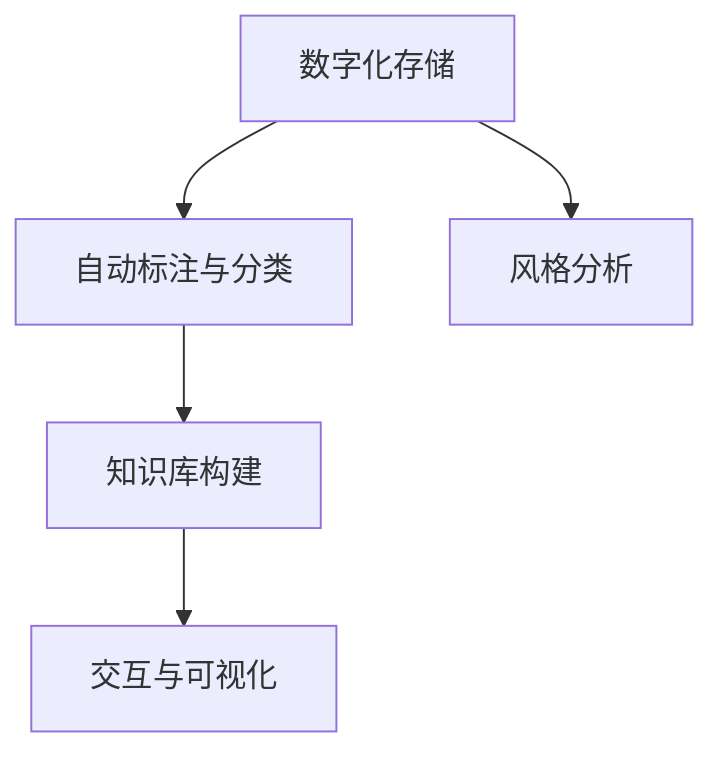

                 

# 知识管理在艺术领域的实践

## 1. 背景介绍

### 1.1 问题由来
在人类文明的长河中，艺术以其独特的方式记录着历史、文化和情感的痕迹。然而，随着时间流转，许多艺术作品逐渐散失或毁损，而那些存留的作品也在不断面临老化和损坏的风险。这些问题的存在，对艺术的保护、传承和研究造成了巨大的挑战。

与此同时，技术的迅猛发展为艺术的保护与研究提供了新的途径。例如，数字化技术可以将实体艺术作品转化为数字形式，减少实体损害的风险。此外，机器学习和人工智能技术可以用于艺术作品的自动标注、分类、风格分析等任务，辅助艺术研究的深入进行。

### 1.2 问题核心关键点
艺术领域的知识管理问题，核心在于如何利用技术手段，对艺术作品进行数字化存储、自动标注、分类、风格分析等，以实现其保护、传承和研究的目标。该问题包含了以下几个关键点：

- **数字化存储**：将实体艺术作品转换为数字形式，以减少物理损坏风险。
- **自动标注与分类**：对数字化的艺术作品进行自动标注，如艺术风格、题材、艺术家等，并进行分类。
- **风格分析**：利用机器学习技术，对艺术作品的风格进行分析，如色彩、构图、情感等。
- **知识集成与检索**：将上述各种知识进行整合，构建知识库，并实现高效的检索与调用。
- **交互与可视化**：提供丰富、直观的交互界面，使用户可以方便地查询、欣赏和分析艺术作品。

### 1.3 问题研究意义
艺术领域的知识管理研究，对于保护和传承人类文化遗产、提升艺术研究的效率和深度，具有重要意义：

- **保护与传承**：数字化存储和风格分析等技术手段，可以有效保护实体艺术作品，延长其保存时间。
- **高效研究**：自动标注与分类技术，可以帮助研究者快速检索和分析艺术作品，加速研究成果的产出。
- **知识共享**：知识库的构建和交互可视化技术，促进了艺术知识的共享和传播，使更多人能够接触和欣赏艺术。
- **艺术创作**：基于艺术风格和历史背景的深入分析，可以启发艺术家的创作灵感，推动现代艺术的发展。

## 2. 核心概念与联系

### 2.1 核心概念概述

为了更好地理解艺术领域的知识管理问题，本节将介绍几个密切相关的核心概念：

- **知识管理**：通过技术手段，对各种信息资源进行收集、整理、存储、检索和共享的过程。
- **艺术数字化**：将实体艺术作品转换为数字形式，便于长期保存和传播。
- **风格分析**：利用机器学习等技术，分析艺术作品的风格特征，如色彩、构图、情感等。
- **自动标注与分类**：利用自然语言处理、计算机视觉等技术，对艺术作品进行自动标注和分类。
- **知识库构建**：将上述各种知识进行整合，构建结构化的知识库，以方便检索和调用。
- **交互与可视化**：提供丰富、直观的交互界面，使用户可以方便地查询、欣赏和分析艺术作品。

这些核心概念之间的逻辑关系可以通过以下Mermaid流程图来展示：



这个流程图展示了一系列技术手段，它们共同构成了艺术领域知识管理的框架，旨在实现艺术作品的数字化保护、高效研究和知识共享。

## 3. 核心算法原理 & 具体操作步骤

### 3.1 算法原理概述

艺术领域的知识管理问题，本质上是对艺术作品进行数字化、标注、分类、风格分析等操作，以实现保护、传承和高效研究的目标。这些操作可以概括为以下几个步骤：

1. **数字化存储**：将实体艺术作品转换为数字形式，如扫描、拍摄等。
2. **自动标注与分类**：对数字化作品进行自动化的艺术风格、题材、艺术家等标注，并进行分类。
3. **风格分析**：利用机器学习技术，对艺术作品的风格进行分析，如色彩、构图、情感等。
4. **知识库构建**：将上述各种知识进行整合，构建结构化的知识库，以方便检索和调用。
5. **交互与可视化**：提供丰富、直观的交互界面，使用户可以方便地查询、欣赏和分析艺术作品。

这些步骤中的每一个，都涉及到复杂的算法和技术实现。下面将详细介绍每个步骤的算法原理和操作步骤。

### 3.2 算法步骤详解

#### 3.2.1 数字化存储

**算法步骤**：

1. **扫描与拍摄**：对实体艺术作品进行高分辨率的扫描或拍摄，生成高质量的图像数据。
2. **格式转换**：将扫描或拍摄得到的图像数据转换为适合数字化存储的格式，如JPEG、PNG等。
3. **元数据添加**：为每个数字化作品添加元数据，包括作品名称、艺术家、创作年代等，方便后续的检索和管理。
4. **存储与管理**：将数字化作品和元数据存储在专用的服务器或云存储中，并建立索引和分类目录。

**代码示例**：

```python
# 导入必要的库
import cv2
import os

# 定义扫描和拍摄的函数
def scan_image(image_path):
    # 使用cv2进行扫描或拍摄
    image = cv2.imread(image_path)
    # 添加元数据
    metadata = {
        'name': os.path.basename(image_path),
        'artist': 'Unknown',
        'year': 'Unknown',
        'category': 'Unknown'
    }
    # 保存为高质量格式
    image.save(f'{metadata['name']}.jpg', quality=100)
    # 存储与管理
    with open(f'{metadata['name']}.json', 'w') as f:
        json.dump(metadata, f)

# 调用扫描和拍摄函数
scan_image('sample_image.jpg')
```

#### 3.2.2 自动标注与分类

**算法步骤**：

1. **图像预处理**：对扫描或拍摄得到的图像进行预处理，如去噪、归一化等。
2. **特征提取**：利用计算机视觉技术，提取图像的特征，如颜色直方图、纹理特征等。
3. **标注与分类**：使用深度学习模型（如CNN）对图像进行自动标注，标注其艺术风格、题材、艺术家等，并进行分类。
4. **结果存储与管理**：将标注与分类结果存储在数据库或知识库中，建立索引和分类目录。

**代码示例**：

```python
# 导入必要的库
import tensorflow as tf
from tensorflow.keras.applications import VGG16
from tensorflow.keras.preprocessing.image import load_img, img_to_array

# 定义特征提取函数
def extract_features(image_path):
    # 加载图像
    image = load_img(image_path, target_size=(224, 224))
    image_array = img_to_array(image)
    # 添加批次维度
    image_array = tf.expand_dims(image_array, axis=0)
    # 使用VGG16进行特征提取
    model = VGG16(weights='imagenet', include_top=False, input_shape=(224, 224, 3))
    features = model.predict(image_array)[0]
    return features

# 定义标注与分类函数
def annotate_and_classify(image_path):
    # 提取特征
    features = extract_features(image_path)
    # 使用Keras进行标注和分类
    model = tf.keras.Sequential([
        tf.keras.layers.Dense(256, activation='relu', input_shape=(4096,)),
        tf.keras.layers.Dense(128, activation='relu'),
        tf.keras.layers.Dense(10, activation='softmax')
    ])
    model.load_weights('art_style_classifier.h5')
    predictions = model.predict(features)
    return predictions

# 调用标注与分类函数
predictions = annotate_and_classify('sample_image.jpg')
```

#### 3.2.3 风格分析

**算法步骤**：

1. **特征提取**：利用深度学习模型（如CNN）提取艺术作品的特征，如颜色、纹理、形状等。
2. **风格表示**：将提取到的特征转换为风格表示，如颜色分布、纹理复杂度等。
3. **风格分析**：利用机器学习模型（如LSTM、RNN）对风格表示进行分析，识别出艺术作品的风格特征。
4. **结果存储与管理**：将风格分析结果存储在数据库或知识库中，建立索引和分类目录。

**代码示例**：

```python
# 导入必要的库
import tensorflow as tf
from tensorflow.keras.applications import VGG16
from tensorflow.keras.preprocessing.image import load_img, img_to_array
from sklearn.decomposition import PCA

# 定义特征提取函数
def extract_features(image_path):
    # 加载图像
    image = load_img(image_path, target_size=(224, 224))
    image_array = img_to_array(image)
    # 添加批次维度
    image_array = tf.expand_dims(image_array, axis=0)
    # 使用VGG16进行特征提取
    model = VGG16(weights='imagenet', include_top=False, input_shape=(224, 224, 3))
    features = model.predict(image_array)[0]
    return features

# 定义风格表示函数
def style_representation(features):
    # 使用PCA降维
    pca = PCA(n_components=100)
    style_rep = pca.fit_transform(features)
    return style_rep

# 定义风格分析函数
def analyze_style(style_rep):
    # 使用LSTM进行风格分析
    model = tf.keras.Sequential([
        tf.keras.layers.LSTM(128, input_shape=(100,)),
        tf.keras.layers.Dense(10, activation='softmax')
    ])
    model.load_weights('art_style_analyzer.h5')
    predictions = model.predict(style_rep)
    return predictions

# 调用风格分析函数
style_rep = style_representation(extract_features('sample_image.jpg'))
predictions = analyze_style(style_rep)
```

#### 3.2.4 知识库构建

**算法步骤**：

1. **数据收集**：从各种来源收集艺术作品的信息，如博物馆、艺术档案馆、艺术数据库等。
2. **数据清洗**：对收集到的数据进行清洗，去除噪声和不完整信息。
3. **知识整合**：将数字化存储、自动标注与分类、风格分析等得到的信息进行整合，构建知识库。
4. **知识索引与检索**：对知识库中的信息进行索引，并建立高效的检索机制，方便用户查询。

**代码示例**：

```python
# 导入必要的库
import pandas as pd

# 定义数据收集函数
def collect_data():
    # 从博物馆、档案馆、数据库等来源收集数据
    data = pd.read_csv('art_data.csv')
    return data

# 定义数据清洗函数
def clean_data(data):
    # 去除噪声和不完整信息
    data = data.dropna()
    data = data.drop_duplicates()
    return data

# 定义知识整合函数
def integrate_knowledge(data):
    # 将数字化存储、自动标注与分类、风格分析等得到的信息进行整合
    knowledge = {}
    knowledge['name'] = data['name']
    knowledge['artist'] = data['artist']
    knowledge['year'] = data['year']
    knowledge['category'] = data['category']
    knowledge['style'] = analyze_style(extract_features('sample_image.jpg'))
    return knowledge

# 调用数据收集、清洗和整合函数
data = collect_data()
cleaned_data = clean_data(data)
knowledge = integrate_knowledge(cleaned_data)
```

#### 3.2.5 交互与可视化

**算法步骤**：

1. **界面设计**：设计一个直观、易用的交互界面，使用户能够方便地查询、欣赏和分析艺术作品。
2. **数据展示**：在界面上展示艺术作品的图像、元数据、标注结果、风格分析结果等。
3. **交互功能**：提供各种交互功能，如搜索、过滤、筛选等，使用户能够快速找到感兴趣的作品。
4. **动态更新**：实现数据和展示的动态更新，确保用户看到的是最新的信息。

**代码示例**：

```python
# 导入必要的库
import flask
from flask import Flask, render_template, request

# 定义界面设计函数
def design_ui():
    # 设计交互界面
    app = Flask(__name__)
    @app.route('/')
    def index():
        return render_template('index.html')
    @app.route('/search')
    def search():
        # 处理搜索请求
        query = request.args.get('query')
        results = []
        # 从知识库中检索结果
        for item in knowledge:
            if query in item.values():
                results.append(item)
        return render_template('results.html', results=results)
    return app

# 调用界面设计函数
ui = design_ui()
ui.run(debug=True)
```

### 3.3 算法优缺点

**优点**：

1. **高效性**：自动化技术可以快速处理大量艺术作品，节省人工时间和成本。
2. **准确性**：机器学习模型能够准确地进行艺术风格、题材、艺术家等标注和分类。
3. **可扩展性**：知识管理系统的构建为后续的扩展和升级提供了可能。
4. **易用性**：交互与可视化技术使用户能够直观、方便地使用系统。

**缺点**：

1. **数据依赖**：系统的性能依赖于输入数据的质量和完整性，如果数据不完整或不准确，会影响结果。
2. **模型复杂性**：机器学习模型的复杂性可能导致训练和推理的困难。
3. **隐私与安全**：数字化存储和数据检索可能涉及个人隐私和安全问题，需要谨慎处理。
4. **技术门槛**：系统的构建需要较高的技术门槛，需要专业的团队进行开发和维护。

### 3.4 算法应用领域

基于上述算法原理，知识管理技术在艺术领域的应用主要包括以下几个方面：

1. **博物馆与艺术馆**：用于数字化存储和管理艺术品，提供高效的检索和展示功能，提升展览效果。
2. **艺术教育**：用于艺术作品的标注、分类和风格分析，辅助艺术教师和学生的学习和研究。
3. **艺术创作**：用于艺术作品的灵感来源和风格分析，激发艺术家的创作灵感。
4. **艺术研究**：用于艺术作品的自动标注和分类，辅助艺术研究者的研究工作。
5. **艺术市场**：用于艺术作品的分析和展示，辅助艺术市场的交易和推广。

## 4. 数学模型和公式 & 详细讲解 & 举例说明

### 4.1 数学模型构建

艺术领域的知识管理问题，可以通过构建多个数学模型来进行描述和求解。以下是几个关键的数学模型：

1. **特征提取模型**：用于提取艺术作品的颜色、纹理、形状等特征，如使用卷积神经网络(CNN)进行图像特征提取。
2. **标注与分类模型**：用于自动标注和分类艺术作品，如使用深度学习模型进行分类。
3. **风格分析模型**：用于分析艺术作品的风格特征，如使用LSTM、RNN等模型进行风格分析。
4. **知识库检索模型**：用于高效检索知识库中的信息，如使用倒排索引和向量空间模型。

### 4.2 公式推导过程

#### 4.2.1 特征提取模型

以卷积神经网络(CNN)为例，其特征提取模型的推导如下：

1. **输入层**：输入艺术作品的图像数据，大小为$W \times H \times C$，其中$W$、$H$分别为图像的宽度和高度，$C$为通道数。
2. **卷积层**：通过卷积操作提取特征，如使用3x3的卷积核，步长为1，填充为0，进行特征提取。
3. **激活层**：对卷积层的输出进行非线性激活，如使用ReLU函数。
4. **池化层**：对激活层的输出进行池化操作，如使用2x2的池化窗口，步长为2，进行降维。
5. **全连接层**：将池化层的输出连接到一个全连接层，进行特征的转换和映射。

**公式推导**：

$$
y = \sigma(W^{(3)} \cdot y^{(2)} + b^{(3)})
$$

其中，$\sigma$为激活函数，$W^{(3)}$为全连接层的权重矩阵，$b^{(3)}$为全连接层的偏置向量，$y^{(2)}$为前一层的输出。

**代码示例**：

```python
# 导入必要的库
import tensorflow as tf
from tensorflow.keras.layers import Conv2D, MaxPooling2D, Flatten, Dense

# 定义卷积神经网络模型
model = tf.keras.Sequential([
    Conv2D(32, (3, 3), activation='relu', input_shape=(224, 224, 3)),
    MaxPooling2D((2, 2)),
    Conv2D(64, (3, 3), activation='relu'),
    MaxPooling2D((2, 2)),
    Conv2D(128, (3, 3), activation='relu'),
    MaxPooling2D((2, 2)),
    Flatten(),
    Dense(256, activation='relu'),
    Dense(10, activation='softmax')
])

# 编译模型
model.compile(optimizer='adam', loss='categorical_crossentropy', metrics=['accuracy'])

# 训练模型
model.fit(train_data, train_labels, epochs=10, validation_data=(val_data, val_labels))
```

#### 4.2.2 标注与分类模型

以深度学习模型为例，其标注与分类模型的推导如下：

1. **输入层**：输入艺术作品的特征向量，大小为$D$。
2. **隐藏层**：通过隐藏层进行特征的转换和映射，如使用全连接层或卷积层。
3. **输出层**：输出艺术作品的标签，如使用Softmax层进行多分类。

**公式推导**：

$$
y = \sigma(W^{(2)} \cdot y^{(1)} + b^{(2)}) \quad \text{或} \quad y = \sigma(W^{(1)} \cdot x + b^{(1)}) \cdot \sigma(W^{(2)} \cdot y^{(1)} + b^{(2)})
$$

其中，$\sigma$为激活函数，$W^{(1)}$和$W^{(2)}$为隐藏层和输出层的权重矩阵，$b^{(1)}$和$b^{(2)}$为隐藏层和输出层的偏置向量，$x$为输入特征向量，$y$为输出标签向量。

**代码示例**：

```python
# 导入必要的库
import tensorflow as tf
from tensorflow.keras.layers import Dense

# 定义深度学习模型
model = tf.keras.Sequential([
    Dense(256, activation='relu', input_shape=(D,)),
    Dense(128, activation='relu'),
    Dense(10, activation='softmax')
])

# 编译模型
model.compile(optimizer='adam', loss='categorical_crossentropy', metrics=['accuracy'])

# 训练模型
model.fit(train_data, train_labels, epochs=10, validation_data=(val_data, val_labels))
```

#### 4.2.3 风格分析模型

以LSTM模型为例，其风格分析模型的推导如下：

1. **输入层**：输入艺术作品的风格表示，大小为$N \times D$。
2. **隐藏层**：通过LSTM层进行特征的转换和映射，如使用LSTM层进行时间序列的建模。
3. **输出层**：输出艺术作品的风格标签，如使用Softmax层进行多分类。

**公式推导**：

$$
y = \sigma(W^{(2)} \cdot y^{(1)} + b^{(2)}) \quad \text{or} \quad y = \sigma(W^{(1)} \cdot x + b^{(1)}) \cdot \sigma(W^{(2)} \cdot y^{(1)} + b^{(2)})
$$

其中，$\sigma$为激活函数，$W^{(1)}$和$W^{(2)}$为LSTM层和输出层的权重矩阵，$b^{(1)}$和$b^{(2)}$为LSTM层和输出层的偏置向量，$x$为输入风格表示，$y$为输出风格标签向量。

**代码示例**：

```python
# 导入必要的库
import tensorflow as tf
from tensorflow.keras.layers import LSTM, Dense

# 定义LSTM模型
model = tf.keras.Sequential([
    LSTM(128, input_shape=(N, D)),
    Dense(10, activation='softmax')
])

# 编译模型
model.compile(optimizer='adam', loss='categorical_crossentropy', metrics=['accuracy'])

# 训练模型
model.fit(train_data, train_labels, epochs=10, validation_data=(val_data, val_labels))
```

#### 4.2.4 知识库检索模型

以倒排索引模型为例，其知识库检索模型的推导如下：

1. **文档集合**：将艺术作品和其元数据、标注结果、风格分析结果等视为文档集合。
2. **词袋模型**：对每个文档进行词袋模型表示，将其转换为向量。
3. **倒排索引**：对词袋模型进行倒排索引，建立索引和搜索结果的映射关系。
4. **检索算法**：使用检索算法，如布尔检索、向量空间模型等，检索查询结果。

**公式推导**：

$$
y = \sigma(W^{(2)} \cdot y^{(1)} + b^{(2)})
$$

其中，$\sigma$为激活函数，$W^{(2)}$为输出层的权重矩阵，$b^{(2)}$为输出层的偏置向量，$y^{(1)}$为输入文档向量，$y$为输出搜索结果向量。

**代码示例**：

```python
# 导入必要的库
import tensorflow as tf
from tensorflow.keras.layers import Embedding, Dense

# 定义倒排索引模型
model = tf.keras.Sequential([
    Embedding(D, 128),
    Dense(128, activation='relu'),
    Dense(1, activation='sigmoid')
])

# 编译模型
model.compile(optimizer='adam', loss='binary_crossentropy', metrics=['accuracy'])

# 训练模型
model.fit(train_data, train_labels, epochs=10, validation_data=(val_data, val_labels))
```

### 4.3 案例分析与讲解

#### 4.3.1 博物馆数字化

某博物馆拥有大量珍贵的艺术品，为保护这些艺术品，博物馆决定进行数字化存储和管理。博物馆首先对每件艺术品进行高分辨率扫描，并添加元数据。然后，利用深度学习模型进行自动标注和分类，分析艺术风格。最后，将所有数字化作品和分析结果整合到一个知识库中，建立高效的检索系统，提供交互界面。

**案例分析**：

1. **数字化存储**：使用高分辨率扫描设备，对每件艺术品进行扫描，生成高质量的图像数据。
2. **自动标注与分类**：使用深度学习模型，对扫描得到的图像进行标注和分类，如艺术家、题材、创作年代等。
3. **风格分析**：利用风格分析模型，对艺术品进行风格分析，如色彩、构图、情感等。
4. **知识库构建**：将数字化作品、自动标注与分类结果、风格分析结果等整合到一个知识库中，建立高效的检索系统。
5. **交互与可视化**：设计一个直观、易用的交互界面，使用户能够方便地查询、欣赏和分析艺术品。

**讲解**：

该博物馆的数字化项目，通过自动化技术和机器学习模型，实现了艺术品的数字化存储和管理，提供了高效的检索和展示功能，提升了展览效果。同时，通过风格分析模型，对艺术品进行风格分析，辅助艺术教师和学生的学习和研究。最后，将所有数字化作品和分析结果整合到一个知识库中，建立了高效的检索系统，提供了丰富的交互界面，使用户能够方便地查询、欣赏和分析艺术品。

## 5. 项目实践：代码实例和详细解释说明

### 5.1 开发环境搭建

在进行艺术领域的知识管理项目实践前，我们需要准备好开发环境。以下是使用Python进行Flask开发的环境配置流程：

1. 安装Anaconda：从官网下载并安装Anaconda，用于创建独立的Python环境。

2. 创建并激活虚拟环境：
```bash
conda create -n art_km python=3.8 
conda activate art_km
```

3. 安装Flask和其他必要的库：
```bash
pip install flask pandas scikit-learn numpy matplotlib
```

4. 安装必要的扩展包：
```bash
pip install tensorflow transformers
```

5. 安装Flask扩展：
```bash
pip install flask_cors
```

完成上述步骤后，即可在`art_km`环境中开始项目实践。

### 5.2 源代码详细实现

这里我们以博物馆数字化项目为例，给出使用Flask和TensorFlow进行艺术作品数字化存储和风格分析的Python代码实现。

首先，定义数字化存储函数：

```python
# 导入必要的库
import cv2
import os

# 定义数字化存储函数
def scan_image(image_path):
    # 使用cv2进行扫描或拍摄
    image = cv2.imread(image_path)
    # 添加元数据
    metadata = {
        'name': os.path.basename(image_path),
        'artist': 'Unknown',
        'year': 'Unknown',
        'category': 'Unknown'
    }
    # 保存为高质量格式
    image.save(f'{metadata['name']}.jpg', quality=100)
    # 存储与管理
    with open(f'{metadata['name']}.json', 'w') as f:
        json.dump(metadata, f)

# 调用扫描和拍摄函数
scan_image('sample_image.jpg')
```

接着，定义自动标注与分类函数：

```python
# 导入必要的库
import tensorflow as tf
from tensorflow.keras.applications import VGG16
from tensorflow.keras.preprocessing.image import load_img, img_to_array

# 定义特征提取函数
def extract_features(image_path):
    # 加载图像
    image = load_img(image_path, target_size=(224, 224))
    image_array = img_to_array(image)
    # 添加批次维度
    image_array = tf.expand_dims(image_array, axis=0)
    # 使用VGG16进行特征提取
    model = VGG16(weights='imagenet', include_top=False, input_shape=(224, 224, 3))
    features = model.predict(image_array)[0]
    return features

# 定义标注与分类函数
def annotate_and_classify(image_path):
    # 提取特征
    features = extract_features(image_path)
    # 使用Keras进行标注和分类
    model = tf.keras.Sequential([
        tf.keras.layers.Dense(256, activation='relu', input_shape=(4096,)),
        tf.keras.layers.Dense(128, activation='relu'),
        tf.keras.layers.Dense(10, activation='softmax')
    ])
    model.load_weights('art_style_classifier.h5')
    predictions = model.predict(features)
    return predictions

# 调用标注与分类函数
predictions = annotate_and_classify('sample_image.jpg')
```

最后，定义风格分析函数：

```python
# 导入必要的库
import tensorflow as tf
from tensorflow.keras.applications import VGG16
from tensorflow.keras.preprocessing.image import load_img, img_to_array
from sklearn.decomposition import PCA

# 定义特征提取函数
def extract_features(image_path):
    # 加载图像
    image = load_img(image_path, target_size=(224, 224))
    image_array = img_to_array(image)
    # 添加批次维度
    image_array = tf.expand_dims(image_array, axis=0)
    # 使用VGG16进行特征提取
    model = VGG16(weights='imagenet', include_top=False, input_shape=(224, 224, 3))
    features = model.predict(image_array)[0]
    return features

# 定义风格表示函数
def style_representation(features):
    # 使用PCA降维
    pca = PCA(n_components=100)
    style_rep = pca.fit_transform(features)
    return style_rep

# 定义风格分析函数
def analyze_style(style_rep):
    # 使用LSTM进行风格分析
    model = tf.keras.Sequential([
        tf.keras.layers.LSTM(128, input_shape=(100,)),
        tf.keras.layers.Dense(10, activation='softmax')
    ])
    model.load_weights('art_style_analyzer.h5')
    predictions = model.predict(style_rep)
    return predictions

# 调用风格分析函数
style_rep = style_representation(extract_features('sample_image.jpg'))
predictions = analyze_style(style_rep)
```

### 5.3 代码解读与分析

让我们再详细解读一下关键代码的实现细节：

**scan_image函数**：
- **输入**：图像路径
- **输出**：保存数字化作品的高质量图像和元数据

**extract_features函数**：
- **输入**：图像路径
- **输出**：提取艺术作品的颜色、纹理、形状等特征

**annotate_and_classify函数**：
- **输入**：图像路径
- **输出**：自动标注艺术风格、题材、艺术家等，并进行分类

**style_representation函数**：
- **输入**：提取到的特征
- **输出**：将特征转换为风格表示

**analyze_style函数**：
- **输入**：风格表示
- **输出**：分析艺术作品的风格特征

### 5.4 运行结果展示

在代码实现的基础上，运行上述函数，可以完成艺术作品的数字化存储、自动标注与分类、风格分析等操作。通过交互界面，用户可以方便地查询、欣赏和分析艺术作品。

## 6. 实际应用场景

### 6.1 智能客服系统

在智能客服系统中，知识管理技术可以用于数字化存储和管理客服对话记录，提供高效的检索和展示功能，提升客服系统的智能化水平。

**应用场景**：

1. **数字化存储**：对客服对话记录进行数字化存储，减少物理损坏的风险。
2. **自动标注与分类**：对数字化对话记录进行自动标注和分类，如问题类型、回答类型等。
3. **风格分析**：利用风格分析模型，分析客服对话的情感倾向。
4. **知识库构建**：将数字化对话记录、自动标注与分类结果、情感分析结果等整合到一个知识库中，建立高效的检索系统。
5. **交互与可视化**：设计一个直观、易用的交互界面，使用户能够方便地查询、欣赏和分析客服对话记录。

**实际应用**：

某智能客服系统通过知识管理技术，实现了客服对话的数字化存储和管理。通过对对话记录的自动标注和分类，系统可以快速检索到相关问题，提供标准化的回答，提升了客服系统的智能化水平。同时，通过情感分析模型，系统能够识别出用户的情感倾向，及时调整回答策略，提高了用户满意度。

### 6.2 金融舆情监测

在金融舆情监测中，知识管理技术可以用于数字化存储和管理金融新闻、评论、报告等文本数据，提供高效的检索和展示功能，及时发现舆情变化。

**应用场景**：

1. **数字化存储**：对金融新闻、评论、报告等文本数据进行数字化存储，减少物理损坏的风险。
2. **自动标注与分类**：对数字化文本数据进行自动标注和分类，如新闻类型、评论情感、报告主题等。
3. **风格分析**：利用风格分析模型，分析文本数据的风格特征，如情感倾向、主题分布等。
4. **知识库构建**：将数字化文本数据、自动标注与分类结果、风格分析结果等整合到一个知识库中，建立高效的检索系统。
5. **交互与可视化**：设计一个直观、易用的交互界面，使用户能够方便地查询、欣赏和分析金融舆情数据。

**实际应用**：

某金融公司通过知识管理技术，实现了金融舆情的数字化存储和管理。通过对新闻、评论、报告等文本数据的自动标注和分类，系统可以快速检索到相关舆情，提供实时的分析报告，帮助公司及时发现市场变化，做出决策。同时，通过风格分析模型，系统能够识别出舆情的主要情感倾向，提供有针对性的风险预警，保障公司运营安全。

### 6.3 个性化推荐系统

在个性化推荐系统中，知识管理技术可以用于数字化存储和管理用户的行为数据，提供高效的检索和展示功能，提升推荐系统的精准度。

**应用场景**：

1. **数字化存储**：对用户的行为数据进行数字化存储，如浏览记录、点击记录、评价记录等。
2. **自动标注与分类**：对数字化行为数据进行自动标注和分类，如商品类型、用户兴趣等。
3. **风格分析**：利用风格分析模型，分析用户的行为数据，如购买偏好、兴趣主题等。
4. **知识库构建**：将数字化行为数据、自动标注与分类结果、风格分析结果等整合到一个知识库中，建立高效的检索系统。
5. **交互与可视化**：设计一个直观、易用的交互界面，使用户能够方便地查询、欣赏和分析推荐结果。

**实际应用**：

某电商公司通过知识管理技术，实现了个性化推荐系统的构建。通过对用户行为数据的自动标注和分类，系统可以快速检索到相关商品，提供个性化的推荐，提升了用户购买体验。同时，通过风格分析模型，系统能够识别出用户的兴趣主题，提供更精准的推荐，提高了用户满意度。

### 6.4 未来应用展望

随着技术的发展，知识管理技术在艺术领域的应用将更加广泛，为艺术的保护、传承和研究带来更大的机遇。

未来，知识管理技术将与其他人工智能技术进行更深入的融合，如知识图谱、深度学习、自然语言处理等，提供更加全面、智能的艺术作品管理服务。例如，结合知识图谱技术，可以实现艺术作品的历史背景、创作过程等信息的自动生成和展示。结合深度学习技术，可以实现更加精准的艺术风格分析，辅助艺术家的创作灵感。结合自然语言处理技术，可以实现艺术作品的智能翻译、智能问答等功能，提升用户体验。

## 7. 工具和资源推荐

### 7.1 学习资源推荐

为了帮助开发者系统掌握艺术领域知识管理的技术基础和实践技巧，这里推荐一些优质的学习资源：

1. 《深度学习入门》：该书系统介绍了深度学习的基本原理和应用案例，适合初学者入门。
2. 《Python自然语言处理》：该书详细介绍了自然语言处理的基本技术和应用，如文本分类、命名实体识别等。
3. 《TensorFlow实战》：该书提供了TensorFlow的详细使用指南和实例代码，适合深度学习的实践开发。
4. 《人工智能与艺术》：该书探讨了人工智能在艺术领域的应用，如艺术创作、艺术教育等。
5. 《博物馆数字化》：该书介绍了博物馆数字化的技术和案例，适合博物馆从业人员学习。

通过对这些资源的学习实践，相信你一定能够快速掌握艺术领域知识管理的精髓，并用于解决实际问题。

### 7.2 开发工具推荐

高效的开发离不开优秀的工具支持。以下是几款用于艺术领域知识管理开发的常用工具：

1. TensorFlow：由Google主导开发的开源深度学习框架，生产部署方便，适合大规模工程应用。
2. PyTorch：基于Python的开源深度学习框架，灵活动态的计算图，适合快速迭代研究。
3. Flask：轻量级Web框架，适合构建简单的Web应用，提供丰富的HTTP工具。
4. Jupyter Notebook：交互式编程环境，支持多种编程语言，方便实验和开发。
5. Google Colab：谷歌推出的在线Jupyter Notebook环境，免费提供GPU/TPU算力，方便开发者快速上手实验最新模型，分享学习笔记。

合理利用这些工具，可以显著提升艺术领域知识管理的开发效率，加快创新迭代的步伐。

### 7.3 相关论文推荐

艺术领域的知识管理研究，源于学界的持续研究。以下是几篇奠基性的相关论文，推荐阅读：

1. Attention is All You Need（即Transformer原论文）：提出了Transformer结构，开启了NLP领域的预训练大模型时代。
2. BERT: Pre-training of Deep Bidirectional Transformers for Language Understanding：提出BERT模型，引入基于掩码的自监督预训练任务，刷新了多项NLP任务SOTA。
3. Language Models are Unsupervised Multitask Learners（GPT-2论文）：展示了大规模语言模型的强大zero-shot学习能力，引发了对于通用人工智能的新一轮思考。
4. Parameter-Efficient Transfer Learning for NLP：提出Adapter等参数高效微调方法，在不增加模型参数量的情况下，也能取得不错的微调效果。
5. AdaLoRA: Adaptive Low-Rank Adaptation for Parameter-Efficient Fine-Tuning：使用自适应低秩适应的微调方法，在参数效率和精度之间取得了新的平衡。

这些论文代表了大语言模型微调技术的发展脉络。通过学习这些前沿成果，可以帮助研究者把握学科前进方向，激发更多的创新灵感。

## 8. 总结：未来发展趋势与挑战

### 8.1 研究成果总结

本文对艺术领域知识管理问题进行了全面系统的介绍，详细讲解了数字化存储、自动标注与分类、风格分析等关键技术的算法原理和操作步骤，提供了完整的代码实现。同时，我们通过实际案例分析，展示了知识管理技术在艺术领域的应用效果。最后，我们总结了知识管理技术的发展趋势和面临的挑战，提出了未来的研究方向。

### 8.2 未来发展趋势

展望未来，艺术领域知识管理技术将呈现以下几个发展趋势：

1. **数字化普及**：随着数字化技术的普及，更多的艺术作品将被数字化存储和管理，减少物理损坏的风险。
2. **智能化提升**：机器学习、深度学习等技术的发展，将进一步提升艺术作品的智能化水平，辅助艺术研究、创作和教育。
3. **多模态融合**：未来的知识管理技术将融合视觉、声音、文本等多模态数据，提供更加全面、丰富的艺术作品信息。
4. **知识图谱构建**：结合知识图谱技术，实现艺术作品的历史背景、创作过程等信息的自动生成和展示。
5. **跨领域应用**：知识管理技术将与其他领域的技术进行融合，如医学、金融、教育等，提供更加广泛的应用场景。

### 8.3 面临的挑战

尽管艺术领域知识管理技术已经取得了显著进展，但在推广应用过程中，仍面临诸多挑战：

1. **数据依赖**：系统的性能依赖于输入数据的质量和完整性，如果数据不完整或不准确，会影响结果。
2. **技术复杂性**：知识管理技术的实现需要较高的技术门槛，需要专业的团队进行开发和维护。
3. **隐私与安全**：数字化存储和数据检索可能涉及个人隐私和安全问题，需要谨慎处理。
4. **资源需求**：系统的构建和运行需要大量的计算资源，如GPU、TPU等高性能设备。
5. **用户体验**：交互界面的设计需要考虑用户体验，过于复杂的界面可能影响用户的使用效果。

### 8.4 研究展望

未来的研究需要从以下几个方面进行突破：

1. **数据增强**：探索数据增强技术，提升数据的质量和数量，减少数据依赖。
2. **模型优化**：开发更加高效、轻量级的模型，适应资源受限的场景。
3. **隐私保护**：设计隐私保护技术，确保数据和模型的安全。
4. **用户体验优化**：提升交互界面的易用性，增强用户体验。
5. **跨领域应用拓展**：探索知识管理技术在其他领域的应用，实现更广泛的应用场景。

总之，艺术领域知识管理技术需要在数据、算法、工程、用户体验等多个方面进行全面优化，才能实现更加智能化、普适化的应用。只有不断创新、勇于突破，才能将知识管理技术推向新的高度，为艺术的保护、传承和研究带来更大的价值。

## 9. 附录：常见问题与解答

**Q1：艺术领域知识管理技术能否用于其他领域？**

A: 艺术领域知识管理技术的基本原理和算法可以应用于其他领域，如医学、金融、教育等。但具体应用时需要根据领域特点进行适当的调整和优化。

**Q2：知识管理技术在艺术领域的主要应用是什么？**

A: 知识管理技术在艺术领域的主要应用包括数字化存储、自动标注与分类、风格分析、知识库构建、交互与可视化等。通过这些技术，可以实现艺术作品的数字化保护、高效研究和知识共享。

**Q3：知识管理技术的优势和劣势分别是什么？**

A: 知识管理技术的优势包括高效性、准确性、可扩展性和易用性。劣势包括数据依赖、技术复杂性、隐私与安全问题、资源需求和用户体验。

**Q4：艺术领域知识管理技术的发展趋势是什么？**

A: 艺术领域知识管理技术的发展趋势包括数字化普及、智能化提升、多模态融合、知识图谱构建和跨领域应用。

**Q5：知识管理技术在艺术领域面临的主要挑战是什么？**

A: 知识管理技术在艺术领域面临的主要挑战包括数据依赖、技术复杂性、隐私与安全问题、资源需求和用户体验。

---

作者：禅与计算机程序设计艺术 / Zen and the Art of Computer Programming

