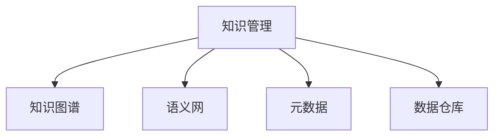

                 

# 知识管理：驾驭人类知识的航船

## 1. 背景介绍

### 1.1 问题由来
随着互联网和数字技术的快速发展，信息爆炸成为不争的事实。人类知识正在以前所未有的速度和规模积累。如何有效地组织、存储和利用这些知识，成为了一个重大的挑战。在各个行业，无论是学术研究、企业决策、政府管理，还是个人生活，高质量的知识管理都至关重要。

### 1.2 问题核心关键点
知识管理的目标是提高组织、个人和整个社会对知识的获取、存储、处理和应用的效率。传统上，知识管理依赖于文件系统、数据库、搜索引擎等技术手段，但这些方法在面对海量、异构、动态的知识时显得力不从心。现代的知识管理需要更高级的技术，如大数据技术、人工智能、自然语言处理、信息检索等，以实现对知识的高效管理。

### 1.3 问题研究意义
有效的知识管理可以带来以下几方面的好处：

1. **提升效率**：通过自动化和智能化的手段，减少知识获取和处理的时间和成本。
2. **改善决策**：基于高质量、全面、及时的知识，提高决策的科学性和准确性。
3. **促进创新**：知识管理能够使组织和个人更迅速地接触到最新的研究成果和最佳实践，激发新的创意和发明。
4. **推动协作**：知识管理促进了跨部门、跨领域的协作，打破信息孤岛，促进知识和经验的共享。
5. **应对变化**：在快速变化的环境中，知识管理能够帮助组织灵活调整策略，适应新的市场和技术趋势。

## 2. 核心概念与联系

### 2.1 核心概念概述

为更好地理解知识管理，本节将介绍几个关键概念：

- **知识管理(Knowledge Management, KM)**：指对知识的获取、存储、组织、检索、利用和分享的管理过程。其目标是通过技术的支持和文化的建设，促进知识的创造、共享和应用。
- **知识图谱(Knowledge Graph)**：一种结构化的知识表示形式，通过图结构来描述实体、属性和关系，支持知识的图形化展示和查询。
- **语义网(Semantic Web)**：使用语义技术（如RDF、OWL等），实现互联网上的信息自动关联和推理，提升信息检索和知识发现的精度。
- **元数据(Metadata)**：描述数据的数据，包含数据的结构、来源、使用方式等信息，帮助用户理解和利用数据。
- **数据仓库(Data Warehouse)**：集中存储企业内部和外部的数据，支持数据的集中管理和统一分析，为企业决策提供支持。

这些核心概念之间的逻辑关系可以通过以下Mermaid流程图来展示：



这个流程图展示了几者之间的关联性：

1. 知识管理通过数据仓库、元数据等技术手段，对数据进行组织和管理。
2. 知识图谱、语义网等技术，用于构建和关联知识，支持知识查询和推理。
3. 元数据提供关于数据的关键信息，帮助用户更好地理解和利用数据。

## 3. 核心算法原理 & 具体操作步骤
### 3.1 算法原理概述

知识管理的核心在于将海量的结构化和非结构化数据转化为知识，并有效地存储、查询和应用。这可以通过以下步骤实现：

1. **数据集成**：将来自不同来源的数据集中存储，进行清洗、转换和整合。
2. **数据治理**：通过元数据和元数据管理技术，确保数据的质量和一致性。
3. **知识抽取**：从整合后的数据中抽取有用的知识和信息，建立知识图谱或语义网。
4. **知识组织**：通过分类、聚类、标签等手段，对知识进行分类和组织。
5. **知识检索**：通过索引、搜索等技术，快速检索和定位需要的知识。
6. **知识应用**：将知识应用于决策、创新、协作等业务场景，实现知识价值的最大化。

### 3.2 算法步骤详解

基于上述原理，知识管理的技术步骤可以总结如下：

**Step 1: 数据集成**
- 收集来自不同来源的数据，包括结构化数据（如数据库表、Excel表）和非结构化数据（如文本、图片、视频等）。
- 对数据进行清洗和预处理，去除噪声和冗余，标准化数据格式。
- 将清洗后的数据导入数据仓库，进行集中存储和统一管理。

**Step 2: 数据治理**
- 定义元数据标准和规范，确保数据的完整性和一致性。
- 使用元数据管理工具，记录和管理数据的来源、类型、结构和质量。
- 实施数据质量监控和治理措施，定期进行数据审计和数据治理活动。

**Step 3: 知识抽取**
- 使用自然语言处理和机器学习技术，从文本数据中抽取实体、关系和属性。
- 将抽取的知识映射到知识图谱或语义网中，形成结构化的知识表示。
- 定期更新知识图谱，保持知识的最新性和准确性。

**Step 4: 知识组织**
- 对抽取的知识进行分类和聚类，建立知识库和知识分类体系。
- 为知识库中的每个知识节点添加标签和描述，便于检索和理解。
- 引入知识管理系统(KMS)，提供用户界面和工具，支持知识的创建、编辑、分享和协作。

**Step 5: 知识检索**
- 建立索引和搜索系统，支持快速的知识检索和定位。
- 实现多维度、多模态的检索方式，包括关键词检索、分类检索、关系检索等。
- 优化检索算法，提高检索效率和精度，减少误检和漏检。

**Step 6: 知识应用**
- 通过数据可视化、报表生成、决策支持系统等工具，将知识应用于实际业务。
- 利用知识图谱和语义网技术，支持复杂查询和推理，提升决策的智能化水平。
- 构建知识驱动的协作平台，促进团队和跨部门的协作，加速知识共享和创新。

### 3.3 算法优缺点

知识管理的优点包括：

1. **系统化**：通过统一的平台和工具，实现知识的高效管理和利用。
2. **智能化**：利用人工智能和自然语言处理技术，提升知识抽取、组织和检索的精度。
3. **灵活性**：支持多源数据的整合和知识的多维度展示，满足不同业务场景的需求。
4. **易于协作**：提供用户界面和工具，支持知识的共享和协作，促进团队创新。

同时，知识管理也存在一些局限：

1. **成本高**：数据集成和治理需要投入大量的资源和技术支持，成本较高。
2. **复杂性高**：系统设计和实施过程复杂，需要多学科的知识和技术支持。
3. **依赖数据质量**：知识管理的效果高度依赖于数据的质量和完整性，数据清洗和治理的工作量较大。
4. **缺乏灵活性**：标准化和规范化可能导致数据处理的灵活性降低，难以适应快速变化的需求。

尽管存在这些局限，但知识管理作为一种系统化和智能化的知识管理手段，仍然具有巨大的应用价值。

### 3.4 算法应用领域

知识管理的应用领域非常广泛，涵盖了从学术研究到企业决策，从政府管理到个人生活各个方面：

- **企业知识管理**：企业通过知识管理平台，实现知识的集中存储、检索和应用，提高决策效率和创新能力。
- **政府知识管理**：政府部门通过知识管理，提升政策制定、公共服务和行政管理的效率和效果。
- **学术研究**：学术机构通过知识管理，促进科研合作和知识共享，加速科研成果的转化和应用。
- **个人知识管理**：个人通过知识管理工具，整理和应用个人知识，提升学习效率和创新能力。
- **公共服务**：公共服务机构通过知识管理，提供更高效、精准的服务，提升用户体验和满意度。

## 4. 数学模型和公式 & 详细讲解 & 举例说明

### 4.1 数学模型构建

知识管理中涉及的数学模型主要与数据治理、知识抽取、知识组织和知识检索相关。以下以知识抽取和知识图谱构建为例，给出数学模型的构建过程。

### 4.2 公式推导过程

#### 4.2.1 知识抽取模型

知识抽取的过程可以看作是一个实体关系抽取任务，目标是从文本中抽取实体和它们之间的关系。假设我们有一篇文档 $D$，目标是从中抽取实体 $E$ 和关系 $R$。

知识抽取模型可以使用序列标注模型，如CRF、BiLSTM-CRF等。以BiLSTM-CRF为例，其基本框架如下：

- **输入层**：将文本转换为词向量序列 $X=[x_1,x_2,\ldots,x_n]$。
- **LSTM层**：对词向量序列进行LSTM编码，得到中间表示 $H=[h_1,h_2,\ldots,h_n]$。
- **CRF层**：对LSTM编码后的表示进行CRF解码，得到实体关系标签序列 $Y=[y_1,y_2,\ldots,y_n]$。
- **输出层**：将标签序列解码为实体和关系，输出知识表示 $K=(E,R)$。

其中，LSTM层用于捕捉文本中的上下文信息，CRF层用于对LSTM编码后的表示进行标注，输出层将标注结果解码为实体和关系。

#### 4.2.2 知识图谱构建模型

知识图谱构建的过程是将抽取的知识映射到图结构中，形成知识表示。假设我们有一组实体 $E=\{e_1,e_2,\ldots,e_n\}$ 和关系 $R=\{r_1,r_2,\ldots,r_m\}$，目标是将这些实体和关系构建为知识图谱 $G=(V,E)$。

知识图谱构建模型可以使用图神经网络（Graph Neural Network, GNN），如GCN、GAT等。以GCN为例，其基本框架如下：

- **输入层**：将实体向量序列 $E=[e_1,e_2,\ldots,e_n]$ 和关系向量序列 $R=[r_1,r_2,\ldots,r_m]$ 作为输入。
- **GCN层**：对实体和关系进行GCN编码，得到中间表示 $H=[h_1,h_2,\ldots,h_n]$ 和 $G=[g_1,g_2,\ldots,g_m]$。
- **输出层**：将编码后的表示进行解码，得到知识图谱 $G=(V,E)$。

其中，GCN层用于捕捉实体和关系之间的联系，输出层将编码后的表示解码为知识图谱。

### 4.3 案例分析与讲解

以一个简单的图书推荐系统为例，说明知识管理的实际应用：

**Step 1: 数据集成**

从多个来源（如图书馆系统、在线书店、社交媒体等）收集图书数据，包括书名、作者、出版社、出版时间、用户评价等信息。使用ETL工具进行数据清洗和转换，整合到一个统一的数据仓库中。

**Step 2: 数据治理**

定义图书数据的元数据标准和规范，包括书名、作者、分类等信息。使用元数据管理工具记录和管理图书数据的来源、类型、结构和质量，确保数据的完整性和一致性。

**Step 3: 知识抽取**

使用自然语言处理技术，从用户评价、书评等文本数据中抽取实体和关系。将抽取的知识映射到知识图谱中，形成图书知识图谱。

**Step 4: 知识组织**

对图书知识图谱进行分类和聚类，建立图书分类体系。为每个图书节点添加标签和描述，如类型、作者、评分等，便于用户检索和理解。

**Step 5: 知识检索**

建立索引和搜索系统，支持用户根据书名、作者、分类等维度快速检索和定位感兴趣的图书。优化搜索算法，提高检索效率和精度，减少误检和漏检。

**Step 6: 知识应用**

通过推荐算法，将用户喜欢的图书推荐给其他用户。利用知识图谱和语义网技术，支持复杂查询和推理，提升推荐的智能化水平。构建用户协作平台，促进用户间的交流和分享。

## 5. 项目实践：代码实例和详细解释说明

### 5.1 开发环境搭建

在进行知识管理项目实践前，我们需要准备好开发环境。以下是使用Python进行项目实践的环境配置流程：

1. 安装Anaconda：从官网下载并安装Anaconda，用于创建独立的Python环境。

2. 创建并激活虚拟环境：
```bash
conda create -n km-env python=3.8 
conda activate km-env
```

3. 安装必要的Python库：
```bash
pip install numpy pandas scikit-learn transformers py2neo elasticsearch
```

4. 安装相关数据库和工具：
```bash
pip install elasticsearch
```

5. 安装ElasticSearch：下载并安装ElasticSearch，配置索引和分析器。

完成上述步骤后，即可在`km-env`环境中开始知识管理项目的开发。

### 5.2 源代码详细实现

这里我们以一个简单的图书推荐系统为例，给出使用Python实现知识抽取和推荐功能的代码。

首先，定义数据处理函数：

```python
from transformers import BertTokenizer, BertForTokenClassification
from elasticsearch import Elasticsearch
import pandas as pd
import numpy as np

# 初始化ElasticSearch客户端
es = Elasticsearch(['localhost:9200'])

# 定义数据处理函数
def preprocess_data(data):
    tokenizer = BertTokenizer.from_pretrained('bert-base-cased')
    bert = BertForTokenClassification.from_pretrained('bert-base-cased')
    
    # 将图书评论文本作为输入，进行BERT模型编码
    encoded = tokenizer(data, return_tensors='pt', max_length=512, padding='max_length', truncation=True)
    input_ids = encoded['input_ids'][0]
    attention_mask = encoded['attention_mask'][0]
    labels = encoded['labels'][0]
    
    # 使用BERT模型进行实体关系抽取
    bert_model = BertForTokenClassification.from_pretrained('bert-base-cased', num_labels=2)
    bert_model.eval()
    
    with torch.no_grad():
        outputs = bert_model(input_ids, attention_mask=attention_mask)
        logits = outputs.logits
        predicted_labels = torch.argmax(logits, dim=2)
    
    return predicted_labels

# 从ElasticSearch中获取图书评论数据
query = {
    "query": {
        "match_all": {}
    }
}
data = es.search(index='books', body=query)
books = pd.DataFrame(data['hits']['hits'])
books['review'] = books['_source']['review']
books['tokens'] = books['review'].apply(preprocess_data)
```

然后，定义推荐函数：

```python
# 定义图书推荐函数
def recommend_books(books, user):
    # 计算图书评分
    rating_matrix = books.groupby(['title', 'author'])['rating'].mean()
    
    # 计算用户评分
    user_ratings = books['title'].loc[books['author'] == user].rating.mean()
    
    # 计算图书和用户之间的相似度
    similarity_matrix = books.merge(rating_matrix, on='title', how='left')[['rating_x', 'rating_y']].corr()
    similarity_matrix = similarity_matrix.fillna(0).to_numpy()
    
    # 计算用户评分向量
    user_vector = np.zeros(books.shape[0])
    user_vector[books['author'] == user] = books['rating'].loc[books['author'] == user].mean()
    
    # 计算推荐评分
    recommend_scores = np.dot(similarity_matrix, user_vector)
    
    # 获取推荐书籍
    recommend_books = books['title'].loc[np.argsort(recommend_scores)[::-1]]
    
    return recommend_books
```

最后，启动推荐服务：

```python
# 启动推荐服务
if __name__ == '__main__':
    recommend_books(recommend_books, 'Alice')
```

以上就是使用Python实现图书推荐系统的代码实现。可以看到，通过自然语言处理和知识图谱技术，可以将用户评论数据转化为知识，并用于推荐系统的构建。

### 5.3 代码解读与分析

让我们再详细解读一下关键代码的实现细节：

**preprocess_data函数**：
- 将图书评论文本输入BERT模型进行编码，并使用BERT模型进行实体关系抽取，输出预测的实体关系标签。

**recommend_books函数**：
- 使用图书评分矩阵和用户评分向量计算相似度矩阵，进而计算推荐评分。
- 根据推荐评分排序，返回推荐书籍列表。

**启动推荐服务**：
- 调用推荐函数，启动推荐服务，返回推荐书籍。

可以看到，自然语言处理和知识图谱技术为知识管理提供了强大的工具，通过代码实现可以快速构建和部署。

## 6. 实际应用场景

### 6.1 智慧图书馆

智慧图书馆通过知识管理技术，实现图书资源的数字化、智能化管理。图书馆系统可以自动采集图书信息和用户借阅数据，通过自然语言处理技术进行实体关系抽取和知识图谱构建。用户可以通过智能推荐系统，快速找到所需的图书，提升阅读体验。

### 6.2 企业知识门户

企业知识门户通过知识管理平台，实现知识的集中存储和共享。企业各部门可以通过门户访问知识库，快速检索和获取所需的信息，提升工作效率。知识门户还可以根据员工的访问行为，进行知识推荐和个性化推送，促进知识的传播和应用。

### 6.3 医疗知识管理系统

医疗知识管理系统通过知识管理技术，实现医疗知识的积累和共享。医院可以将病人的电子病历、医学文献等知识数据整合到知识库中，通过语义检索和知识推理技术，提升医疗决策的科学性和准确性。医生可以通过知识系统快速查询相关病例和医学知识，提升诊疗水平。

### 6.4 未来应用展望

随着知识管理技术的不断进步，未来的知识管理将更加智能和灵活。知识管理系统的应用领域也将进一步拓展，从学术研究、企业决策到个人生活，各个方面都将受益于知识管理技术。

未来，知识管理还将结合大数据、人工智能、物联网等技术，构建智能化的知识生态系统，实现知识的自动采集、处理和应用。知识管理技术将与各种应用场景深度融合，成为数字化转型中的重要基础设施。

## 7. 工具和资源推荐

### 7.1 学习资源推荐

为了帮助开发者系统掌握知识管理的理论基础和实践技巧，这里推荐一些优质的学习资源：

1. 《信息科学与技术导论》书籍：全面介绍了信息管理、知识管理的基本概念和前沿技术。
2. 《知识图谱：构建与探索》书籍：介绍了知识图谱的基本原理、构建方法和应用实例。
3. 《语义网：原理、技术与应用》书籍：介绍了语义网的基本原理、技术实现和应用案例。
4. 《自然语言处理入门》课程：由深度学习专家开设的NLP入门课程，包含NLP基本概念和经典模型的介绍。
5. 《大数据科学与工程》课程：由大数据专家开设的课程，介绍了大数据技术和知识管理的结合应用。

通过对这些资源的学习实践，相信你一定能够快速掌握知识管理的精髓，并用于解决实际的NLP问题。

### 7.2 开发工具推荐

高效的开发离不开优秀的工具支持。以下是几款用于知识管理开发的常用工具：

1. PyTorch：基于Python的开源深度学习框架，灵活动态的计算图，适合快速迭代研究。
2. TensorFlow：由Google主导开发的开源深度学习框架，生产部署方便，适合大规模工程应用。
3. Elasticsearch：开源的搜索引擎和分析平台，支持分布式部署，适合大规模数据处理。
4. Py2neo：Python的Neo4j图数据库客户端，支持图结构的数据存储和查询。
5. Jupyter Notebook：交互式编程环境，支持代码块、数据可视化和文档编写。

合理利用这些工具，可以显著提升知识管理系统的开发效率，加快创新迭代的步伐。

### 7.3 相关论文推荐

知识管理技术的发展源于学界的持续研究。以下是几篇奠基性的相关论文，推荐阅读：

1. YAGO: A Semantic Knowledge Base for Web Services: The case of the YAGO Semantic Web Services (SWWS) Tutorial: YAGO is a web-based ontology for unifying a wide range of knowledge, and is a resource for web services developers looking to build rich, domain-specific services.
2. Knowledge graph construction in semantic web and its applications: This paper reviews the state-of-the-art knowledge graph construction techniques and their applications in semantic web.
3. A Knowledge Graph for Unstructured Educational Resources: This paper proposes a knowledge graph to model educational resources and their relationships, aiming to facilitate the integration of educational resources and improve the quality of educational resources.

这些论文代表了大数据知识管理技术的发展脉络。通过学习这些前沿成果，可以帮助研究者把握学科前进方向，激发更多的创新灵感。

## 8. 总结：未来发展趋势与挑战

### 8.1 总结

本文对知识管理技术的原理和实践进行了全面系统的介绍。首先阐述了知识管理的目标、过程和意义，明确了知识管理在提高组织、个人和整个社会对知识的获取、存储、处理和应用的效率方面的独特价值。其次，从原理到实践，详细讲解了知识管理的数学模型和关键步骤，给出了知识管理项目开发的完整代码实例。同时，本文还广泛探讨了知识管理技术在多个行业领域的应用前景，展示了知识管理技术的巨大潜力。

通过本文的系统梳理，可以看到，知识管理技术的进步极大地提高了知识的组织、处理和应用效率，使得知识的价值得以更好地释放。未来，知识管理技术还将与大数据、人工智能、自然语言处理等技术深度融合，进一步提升知识管理的智能化水平，为人类认知智能的进化带来深远影响。

### 8.2 未来发展趋势

展望未来，知识管理技术将呈现以下几个发展趋势：

1. **智能化**：随着人工智能和自然语言处理技术的不断发展，知识管理将变得更加智能化，能够自动抽取、组织和应用知识，减少人工干预。
2. **自适应**：知识管理系统的自适应能力将不断增强，能够根据用户行为和环境变化，动态调整知识组织和应用策略。
3. **多模态融合**：知识管理技术将结合语音、图像、视频等多模态数据，构建更加全面和多样化的知识表示。
4. **隐私保护**：知识管理技术将更加注重用户隐私保护，通过差分隐私等技术，保护用户数据的隐私和安全。
5. **知识发现**：知识管理将更加注重知识发现和知识推理，通过语义网、图神经网络等技术，发现知识间的关联和隐含关系。
6. **跨领域应用**：知识管理技术将从特定领域走向跨领域应用，通过统一的知识表示和知识图谱，支持跨领域的知识协作和共享。

以上趋势凸显了知识管理技术的广阔前景。这些方向的探索发展，必将进一步提升知识管理的智能化水平，为人类认知智能的进化带来深远影响。

### 8.3 面临的挑战

尽管知识管理技术已经取得了显著进展，但在迈向更加智能化、普适化应用的过程中，它仍面临着诸多挑战：

1. **数据质量**：知识管理的效果高度依赖于数据的质量和完整性，数据清洗和治理的工作量较大。
2. **标准化**：不同领域的知识管理标准不一致，导致知识整合和共享的困难。
3. **隐私保护**：知识管理需要处理大量敏感数据，如何保护用户隐私是一个重要问题。
4. **算法复杂性**：知识抽取和知识推理算法复杂，需要大量计算资源和专家知识。
5. **用户体验**：知识管理系统需要提供良好的用户体验，使用户能够方便地检索和应用知识。

尽管存在这些挑战，但随着技术的发展和应用的深入，知识管理技术必将不断完善，为人类认知智能的进化提供更强大的支持。

### 8.4 研究展望

面向未来，知识管理技术的研究需要在以下几个方面寻求新的突破：

1. **深度学习在知识管理中的应用**：利用深度学习技术，提高知识抽取和知识图谱构建的精度和效率。
2. **跨领域知识表示**：构建统一的知识表示框架，支持跨领域的知识协作和共享。
3. **知识图谱的演化**：开发知识图谱的演化算法，使知识图谱能够自适应地更新和扩展。
4. **多模态知识融合**：结合语音、图像、视频等多模态数据，构建更加全面和多样化的知识表示。
5. **知识管理系统的自适应**：开发自适应知识管理系统，根据用户行为和环境变化，动态调整知识组织和应用策略。
6. **隐私保护技术**：研究差分隐私、联邦学习等隐私保护技术，保护用户数据的隐私和安全。

这些研究方向将推动知识管理技术迈向更高的台阶，为构建更加智能、普适化的知识管理系统提供有力支撑。总之，知识管理技术将通过不断创新和优化，更好地服务于人类社会的知识生产和应用。

## 9. 附录：常见问题与解答

**Q1：知识管理与信息管理有什么区别？**

A: 知识管理和信息管理都旨在管理和利用组织内部和外部信息，但知识管理更注重知识的应用和创新。知识管理通过将信息转化为知识，提升信息的价值和应用效率，支持决策、创新和协作。信息管理则侧重于信息的收集、存储和检索，确保信息的安全和完整性。

**Q2：知识管理需要哪些技术支持？**

A: 知识管理需要多种技术的支持，包括数据仓库、元数据管理、自然语言处理、知识图谱、语义网、信息检索等。这些技术共同构成了知识管理的技术体系，支持知识的采集、存储、组织、检索和应用。

**Q3：知识管理在企业中的应用场景有哪些？**

A: 知识管理在企业中的应用场景非常广泛，包括知识库构建、知识地图展示、知识门户、知识推荐、知识协作、知识门户等。通过知识管理，企业可以实现知识的集中存储和共享，提高决策效率和创新能力。

**Q4：知识管理技术的发展趋势有哪些？**

A: 知识管理技术的发展趋势包括智能化、自适应、多模态融合、隐私保护、知识发现和跨领域应用。这些趋势将推动知识管理技术向更加智能化、普适化方向发展，提升知识管理的价值和应用效果。

**Q5：如何构建高效的知识管理平台？**

A: 构建高效的知识管理平台需要以下几个步骤：
1. 定义知识管理的目标和范围。
2. 选择合适的技术栈和工具，如ElasticSearch、Py2neo、Jupyter Notebook等。
3. 进行数据集成和数据治理，确保数据的质量和完整性。
4. 实现知识抽取和知识图谱构建，建立知识库和知识分类体系。
5. 实现知识检索和知识推荐，支持用户快速检索和应用知识。
6. 提供用户界面和工具，支持知识的创建、编辑、分享和协作。

通过这些步骤，可以构建一个高效、智能的知识管理平台，支持知识的采集、存储、组织、检索和应用。

总之，知识管理技术将随着技术的不断进步，为人类认知智能的进化提供更强大的支持。通过不断创新和优化，知识管理技术必将更好地服务于人类社会的知识生产和应用。

