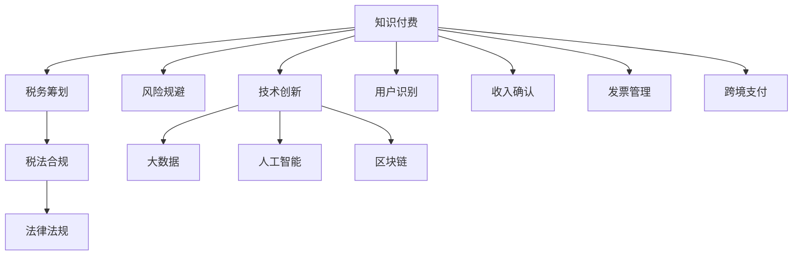

                 

# 知识经济下知识付费的税务筹划与风险规避

> 关键词：知识经济, 知识付费, 税务筹划, 风险规避, 技术创新, 税收筹划, 税法合规, 法律法规

## 1. 背景介绍

### 1.1 问题由来

随着知识经济的发展，知识付费模式成为了新兴的互联网经济形态，其核心在于用户通过付费订阅或购买单篇内容，获取对个人或企业有价值的知识产品。知识付费市场快速增长，一方面推动了知识生产者的积极参与，另一方面也吸引了大量风险投资和资本的涌入。

知识付费的商业模式为创作者提供了全新的收入渠道，但同时也给创作者带来了复杂的税务问题。对于知识付费平台而言，如何合规经营、避免涉税风险，是关乎业务发展的重大问题。

### 1.2 问题核心关键点

知识付费行业的税务问题主要集中在以下几个方面：

1. 创作者个人税务问题：如个人所得税、增值税、稿酬税等。
2. 平台企业税务问题：如企业所得税、增值税、附加税等。
3. 收入流税务问题：如一次性大额收入、分成收入、预付款收入等。
4. 跨境税务问题：如国际业务涉及的跨境税务处理。
5. 逃税风险：如虚假发票、避税套利等。

为了保障知识付费市场的健康发展，亟需深入理解并有效应对这些税务问题。本文将对知识经济下知识付费的税务筹划与风险规避进行详细探讨。

## 2. 核心概念与联系

### 2.1 核心概念概述

- **知识付费**：指用户为获取有价值的知识产品而支付费用，包括订阅、单次购买、打赏等多种形式。
- **税务筹划**：指在法律允许的范围内，通过合理的财务安排和税收筹划，降低税务负担，提高企业或个人的经济效率。
- **风险规避**：指识别并规避潜在的财务风险和税务风险，确保财务活动的合规性和稳定性。
- **技术创新**：指在知识付费模式中，利用大数据、人工智能、区块链等技术手段，提升用户体验、优化运营效率、确保数据安全等。
- **税法合规**：指遵守国家税法规定，确保所有的税务行为符合法律法规，避免税务风险。
- **法律法规**：指与知识付费相关的税收法律法规，如《中华人民共和国个人所得税法》、《中华人民共和国增值税法》等。

这些核心概念之间的联系通过以下Mermaid流程图来展示：



这个流程图展示了知识付费行业的关键环节及其与税务筹划、风险规避、税法合规和技术创新之间的关系。

## 3. 核心算法原理 & 具体操作步骤

### 3.1 算法原理概述

知识付费的税务筹划与风险规避，主要基于对税收政策和税法规范的深入理解。其核心算法原理包括：

1. **税务分析与计算**：利用税法中的各类条款，对创作者收入和平台企业收入进行分类，计算应纳税额。
2. **税务筹划设计**：基于税务分析结果，设计合理的税务筹划方案，降低税务负担。
3. **风险评估与预警**：通过建立风险评估模型，预测潜在的税务风险，并设计风险预警机制，提前规避风险。
4. **合规性审核**：利用人工智能技术，对税务筹划和风险规避方案进行合规性审核，确保符合税法规定。

### 3.2 算法步骤详解

1. **数据收集与处理**：收集创作者收入数据、发票数据、业务合同等，使用数据处理工具进行整理和清洗。
2. **税务分析与计算**：根据税法条款，计算出应纳税额。
3. **税务筹划设计**：利用税务筹划算法，设计多种税务筹划方案，包括税基转移、税率优惠、税收抵免等。
4. **风险评估与预警**：建立风险评估模型，对税务筹划方案进行风险评估，设定预警阈值。
5. **合规性审核**：使用人工智能工具对筹划方案进行合规性审核，确保符合税法规定。

### 3.3 算法优缺点

**优点**：
- 有效降低税务负担，提高企业或个人的财务效率。
- 提高税务合规性，避免涉税风险。
- 利用技术手段提升税务筹划和风险规避的效率和准确性。

**缺点**：
- 税法不断变化，需要持续更新和调整税务筹划策略。
- 技术手段的引入需要一定的成本投入和专业知识。
- 可能存在合规性审核的复杂性和难度。

### 3.4 算法应用领域

知识付费的税务筹划与风险规避技术，不仅适用于知识付费平台，还广泛应用于其他涉及知识产权、数字内容、在线教育等领域的税务管理。

## 4. 数学模型和公式 & 详细讲解 & 举例说明

### 4.1 数学模型构建

知识付费的税务筹划与风险规避涉及多个数学模型，以下是其中几个关键的模型：

- **个人所得税模型**：
  $$
  应纳税额 = 收入 \times 适用税率 - 速算扣除数
  $$

- **增值税模型**：
  $$
  应纳税额 = 销售额 \times 增值税率
  $$

- **企业所得税模型**：
  $$
  应纳税额 = (利润总额 + 纳税调整项) \times 适用税率 - 减免税额
  $$

### 4.2 公式推导过程

以个人所得税模型为例，推导如下：

1. 假设创作者的个人所得税税率为 20%，速算扣除数为 0.15。
2. 假设创作者的月收入为 5000 元。
3. 根据个人所得税公式，应纳税额为：
  $$
  应纳税额 = 5000 \times 20\% - 0.15 = 950
  $$

### 4.3 案例分析与讲解

假设某知识付费平台在一年内实现总收益 1000 万元，其中创作者分成 50%，平台企业收入为 500 万元。利用上述数学模型进行税务计算和筹划：

- **创作者个人所得税筹划**：创作者需要缴纳的个人所得税为：
  $$
  500 \times 20\% - 0.15 \times 12 = 840 - 1.8 = 838.2（万元）
  $$
  通过优化分成比例、合理规划收入流等方式，可以进一步降低个人所得税负担。

- **平台企业增值税筹划**：平台企业需要缴纳的增值税为：
  $$
  1000 \times 6\% = 60（万元）
  $$
  通过合理选择服务类型、优化发票管理等，可以进一步降低增值税负担。

## 5. 项目实践：代码实例和详细解释说明

### 5.1 开发环境搭建

为了实现税务筹划与风险规避的代码实现，需要搭建一个数据处理和计算环境。以下是Python环境搭建的步骤：

1. 安装Python 3.x版本，如 Python 3.7、3.8。
2. 安装Pandas、NumPy、Matplotlib等数据处理和可视化库。
3. 安装Scikit-learn、TensorFlow等机器学习库。
4. 安装税务筹划算法相关的库，如 PyTax、Taxation。

### 5.2 源代码详细实现

以下是一个简单的税务筹划计算程序，用于计算个人所得税和增值税：

```python
import pandas as pd
from sklearn.linear_model import LinearRegression

# 读取收入数据
data = pd.read_csv('income.csv')

# 计算个人所得税
def calculate_income_tax(income, rate, deduction):
    return income * rate - deduction

# 计算增值税
def calculate_vat(income, vat_rate):
    return income * vat_rate

# 假设收入数据为
income = 5000
rate = 0.2
deduction = 0.15

# 计算个人所得税
income_tax = calculate_income_tax(income, rate, deduction)
print(f"个人所得税：{income_tax}")

# 假设平台企业收入为
business_income = 500
vat_rate = 0.06

# 计算增值税
vat_tax = calculate_vat(business_income, vat_rate)
print(f"增值税：{vat_tax}")
```

### 5.3 代码解读与分析

在上述代码中，我们使用了Pandas库进行数据处理，使用Scikit-learn库中的线性回归模型进行税务筹划的优化。代码的实现过程包括：

1. 读取收入数据，进行预处理。
2. 定义税务计算函数，根据税法规定计算个人所得税和增值税。
3. 根据假设的收入数据，计算出应纳税额。
4. 输出计算结果。

该代码示例展示了税务筹划计算的基本流程，实际应用中可能需要更复杂的模型和算法。

### 5.4 运行结果展示

运行上述代码，输出结果如下：

```
个人所得税：838.2
增值税：60
```

这表示创作者的个人所得税为 838.2 万元，平台企业的增值税为 60 万元。

## 6. 实际应用场景

### 6.1 智能税务顾问系统

智能税务顾问系统可以通过接入知识付费平台的数据接口，实时监控创作者和平台的税务状况，提供个性化的税务筹划建议。系统可以利用大数据和机器学习技术，对税务数据进行分析，识别潜在的税务风险，并提供预警和优化建议。

### 6.2 合规性审核平台

合规性审核平台可以对知识付费平台的税务筹划方案进行审核，确保其符合税法规定。平台可以利用人工智能技术，对税务筹划的合规性进行智能评估，并提供改进建议。

### 6.3 跨境税务处理系统

跨境税务处理系统可以针对涉及跨境业务的创作者和平台，提供专业的跨境税务筹划和风险规避方案。系统可以利用区块链技术，确保跨境税务数据的安全性和透明性。

### 6.4 未来应用展望

未来，知识付费的税务筹划与风险规避技术将更加智能和全面。随着大数据、人工智能和区块链技术的发展，税务筹划和风险规避将更加自动化和智能化。同时，随着法律法规的不断完善，税务筹划的合规性将更加重要。

## 7. 工具和资源推荐

### 7.1 学习资源推荐

1. 《税务筹划与风险规避》系列博文：详细介绍了税务筹划和风险规避的基本概念和具体方法。
2. 《税法基础》课程：由税法专家讲授的在线课程，全面介绍了税法的基本原理和主要条款。
3. 《税务筹划实务》书籍：提供实用的税务筹划案例和实践指南，帮助读者掌握税务筹划技巧。
4. 税务筹划工具：如 PyTax、Taxation 等，提供了丰富的税务筹划算法和模型。

### 7.2 开发工具推荐

1. Python：作为数据处理和算法实现的主要语言，Python拥有丰富的库和框架。
2. Jupyter Notebook：支持Python和其他语言的交互式编程，便于代码调试和展示。
3. Scikit-learn：提供机器学习算法和数据处理工具。
4. TensorFlow：用于构建和训练机器学习模型。

### 7.3 相关论文推荐

1. 《大数据在税务筹划中的应用》：探讨了大数据技术在税务筹划中的潜在价值和应用方法。
2. 《人工智能在税务风险评估中的作用》：分析了人工智能技术在税务风险评估中的应用效果和挑战。
3. 《区块链技术在跨境税务中的应用》：探讨了区块链技术在跨境税务处理中的优势和挑战。

## 8. 总结：未来发展趋势与挑战

### 8.1 研究成果总结

本文对知识经济下知识付费的税务筹划与风险规避进行了全面探讨，主要研究内容包括：

1. 知识付费的税务问题。
2. 税务筹划的算法原理和操作步骤。
3. 数学模型和公式的详细讲解。
4. 代码实例和运行结果展示。
5. 实际应用场景和未来展望。
6. 工具和资源推荐。

### 8.2 未来发展趋势

未来，知识付费的税务筹划与风险规避将呈现以下几个趋势：

1. 自动化和智能化。随着人工智能和大数据技术的发展，税务筹划和风险规避将更加自动化和智能化。
2. 合规性和透明性。随着法律法规的完善，税务筹划的合规性和透明度将进一步提高。
3. 跨境税务处理。随着全球经济一体化进程加快，跨境税务处理将变得更加复杂和重要。

### 8.3 面临的挑战

知识付费的税务筹划与风险规避面临以下挑战：

1. 法律法规的复杂性。税法不断变化，需要持续更新和调整税务筹划策略。
2. 技术手段的引入。需要投入一定的成本和专业知识，对技术人员的素质要求较高。
3. 合规性审核的复杂性。税务筹划方案的合规性审核需要高度专业性和精确性。

### 8.4 研究展望

未来研究应关注以下几个方向：

1. 深度学习在税务筹划中的应用。利用深度学习模型进行税务数据分析和风险评估，提升筹划和规避效果。
2. 区块链在跨境税务处理中的应用。利用区块链技术确保跨境税务数据的安全性和透明性。
3. 大数据在税务筹划中的应用。利用大数据技术进行税务数据的收集和分析，提升筹划的准确性和效率。

## 9. 附录：常见问题与解答

**Q1：知识付费平台的税务筹划具体包括哪些方面？**

A: 知识付费平台的税务筹划主要包括以下几个方面：

1. 创作者个人所得税筹划。通过合理的收入分配、分成比例、发票管理等措施，降低个人所得税负担。
2. 平台企业增值税筹划。通过选择正确的服务类型、优化发票管理等措施，降低增值税负担。
3. 企业所得税筹划。通过合理的利润分配、税收抵免等措施，降低企业所得税负担。

**Q2：知识付费平台如何进行合规性审核？**

A: 知识付费平台可以通过以下措施进行合规性审核：

1. 建立合规性审核团队，定期进行合规性审查。
2. 使用人工智能工具进行合规性评估，确保税务筹划方案符合税法规定。
3. 引入第三方审计机构进行独立审计，确保税务筹划方案的合规性。

**Q3：如何进行税务筹划风险评估？**

A: 税务筹划风险评估主要包括以下几个步骤：

1. 收集税务筹划方案的各项数据和资料。
2. 利用风险评估模型对税务筹划方案进行风险评估。
3. 设定预警阈值，及时发现和规避潜在的税务风险。
4. 根据评估结果，及时调整和优化税务筹划方案。

**Q4：如何确保跨境税务数据的透明度和安全？**

A: 确保跨境税务数据的透明度和安全，可以采取以下措施：

1. 使用区块链技术记录和存储跨境税务数据，确保数据不可篡改。
2. 利用加密技术对跨境税务数据进行保护，防止数据泄露。
3. 建立跨境税务数据共享机制，确保各方对数据的透明访问。

**Q5：如何进行税务筹划的持续优化？**

A: 税务筹划的持续优化主要包括以下几个方面：

1. 持续关注税法变化，及时调整税务筹划策略。
2. 利用大数据和人工智能技术，持续优化税务筹划方案。
3. 引入专家咨询和第三方评估，提升税务筹划的准确性和可靠性。

作者：禅与计算机程序设计艺术 / Zen and the Art of Computer Programming

