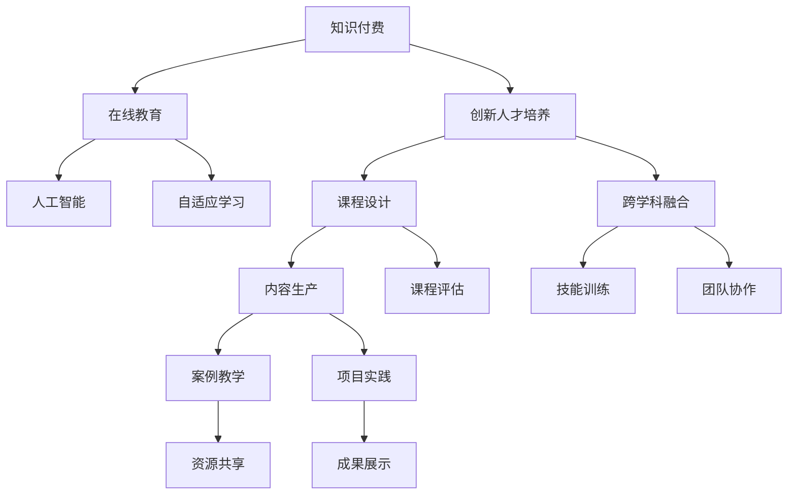

                 

# 知识经济时代下的知识付费创新人才培养模式

> 关键词：知识付费,创新人才培养,在线教育,人工智能,课程设计,跨学科融合,自适应学习

## 1. 背景介绍

随着知识经济时代的到来，知识付费领域逐渐崛起，成为新的经济增长点。在数字化转型的大趋势下，传统教育模式已经无法满足人们不断变化的学习需求。如何培养符合知识经济时代要求的人才，成为各大高校和教育机构共同面对的挑战。本文将从知识付费和在线教育的视角出发，探讨创新人才培养模式，并通过具体案例展示其应用效果。

## 2. 核心概念与联系

### 2.1 核心概念概述

在探讨知识付费和创新人才培养模式时，我们首先需要理解以下核心概念：

- **知识付费**：指用户为获取有价值的信息而支付费用的行为，是知识经济时代的重要特征。

- **创新人才培养**：指通过特定方式和手段，培养出具有创新思维和实践能力的高级人才。

- **在线教育**：利用互联网平台开展教学活动，打破了传统教育的时空限制。

- **人工智能(AI)**：指使计算机具有人类智能的技术和应用，包括机器学习、自然语言处理等。

- **自适应学习**：指根据学生的个性化需求和学习进度，动态调整教学内容和方式的学习模式。

这些概念相互联系，共同构成了知识付费和创新人才培养的框架。知识付费和在线教育的崛起，为AI技术在教育领域的应用提供了契机，而自适应学习则进一步提升了教育效果。通过这些概念的有机结合，我们能够构建出高效、个性化的创新人才培养模式。

### 2.2 核心概念原理和架构的 Mermaid 流程图



这个流程图展示了知识付费、在线教育、创新人才培养、人工智能和自适应学习之间的关系：

1. **知识付费**：用户通过付费获取有价值的信息，为在线教育提供了经济基础。
2. **在线教育**：利用互联网平台，提供随时随地学习的便利，成为知识付费的重要载体。
3. **创新人才培养**：通过课程设计和跨学科融合，培养具有创新思维和实践能力的人才。
4. **人工智能**：利用AI技术，提高在线教育的互动性和个性化，提升教育效果。
5. **自适应学习**：根据学生的个性化需求和学习进度，动态调整教学内容和方式。

这些概念之间的逻辑关系使得知识付费和创新人才培养模式在技术层面具备了实现的可能性。

## 3. 核心算法原理 & 具体操作步骤

### 3.1 算法原理概述

创新人才培养的算法原理主要围绕个性化推荐和自适应学习展开。个性化推荐算法可以根据学生的学习行为和偏好，推荐最适合的课程和资料。自适应学习算法则根据学生的学习进度和理解程度，动态调整教学内容和难度，以适应学生的个性化需求。

### 3.2 算法步骤详解

具体来说，创新人才培养的算法步骤如下：

1. **数据收集**：收集学生的学习行为数据（如浏览记录、答题情况、参与讨论等）和课程反馈数据，形成学生和课程的个性化档案。
2. **需求分析**：使用聚类、分类等方法，对学生进行需求分类，确定不同类型学生的学习需求和偏好。
3. **个性化推荐**：根据学生的个性化档案，推荐最适合的课程和资料，提高学习效率。
4. **自适应学习**：根据学生的学习进度和理解程度，动态调整教学内容和难度，以适应学生的个性化需求。
5. **效果评估**：通过学习效果的评估反馈，不断优化个性化推荐和自适应学习算法。

### 3.3 算法优缺点

#### 优点

1. **高效性**：通过个性化推荐和自适应学习，能够根据学生的实际情况，快速调整学习路径，提高学习效率。
2. **适应性**：能够适应不同类型学生的学习需求，提高教育效果。
3. **互动性**：通过互动式学习，增强学生的参与感和兴趣。
4. **可持续性**：能够持续跟踪学生的学习进度，及时提供反馈和支持。

#### 缺点

1. **数据隐私**：个性化推荐和自适应学习需要收集大量学生数据，可能涉及隐私问题。
2. **算法复杂性**：实现个性化推荐和自适应学习算法需要高水平的技术支持。
3. **资源消耗**：个性化推荐和自适应学习需要消耗大量的计算资源。
4. **用户体验**：过度依赖算法，可能导致学生失去主动性和探索精神。

### 3.4 算法应用领域

个性化推荐和自适应学习算法不仅适用于在线教育领域，还广泛应用于课程设计、技能训练、团队协作等多个环节。例如，在课程设计中，可以根据学生的学习偏好推荐适合的教材和资源；在技能训练中，可以针对学生的弱点提供个性化的训练方案；在团队协作中，可以根据成员的技能和兴趣分配任务。

## 4. 数学模型和公式 & 详细讲解 & 举例说明

### 4.1 数学模型构建

创新人才培养的数学模型主要涉及以下三个方面：

- **学生模型**：描述学生的学习行为和偏好。
- **课程模型**：描述课程的内容和难度。
- **学习效果模型**：描述学生学习效果的评估指标。

### 4.2 公式推导过程

以学生模型为例，设学生 $i$ 的兴趣向量为 $v_i$，课程 $j$ 的特征向量为 $u_j$，学生对课程 $j$ 的评分 $s_{ij}$ 可以表示为：

$$
s_{ij} = \langle v_i, u_j \rangle = \sum_{k=1}^d v_{ik} u_{jk}
$$

其中 $v_{ik}$ 和 $u_{jk}$ 分别为向量 $v_i$ 和 $u_j$ 的第 $k$ 个元素。

根据评分数据，可以构建矩阵 $\mathbf{S}$ 和向量 $\mathbf{v}$ 和 $\mathbf{u}$，使用奇异值分解(SVD)对 $\mathbf{S}$ 进行分解：

$$
\mathbf{S} = \mathbf{U} \boldsymbol{\Sigma} \mathbf{V}^T
$$

其中 $\mathbf{U}$ 和 $\mathbf{V}$ 分别为左、右奇异值矩阵，$\boldsymbol{\Sigma}$ 为奇异值向量。

通过 $\mathbf{U}$ 和 $\mathbf{V}$ 的取值，可以优化个性化推荐算法和自适应学习算法，使得推荐和调整更加符合学生的学习需求。

### 4.3 案例分析与讲解

以某在线教育平台为例，该平台使用基于协同过滤的个性化推荐算法，根据学生的学习行为数据（如浏览记录、答题情况等）和课程特征（如课程难度、时长等），推荐最适合的课程和资料。同时，平台还采用自适应学习算法，根据学生的学习进度和理解程度，动态调整教学内容和难度。

具体实现时，可以使用机器学习库（如scikit-learn、TensorFlow等）和数据处理工具（如Pandas、NumPy等）对数据进行处理和建模。通过不断优化算法和调整模型参数，平台的个性化推荐和自适应学习效果显著提升，学生满意度显著提高。

## 5. 项目实践：代码实例和详细解释说明

### 5.1 开发环境搭建

在搭建开发环境前，我们需要进行以下准备工作：

1. **环境安装**：确保系统已经安装了Python、Pandas、NumPy、scikit-learn等必要的依赖包。
2. **数据准备**：收集学生的学习行为数据和课程反馈数据，并导入到Python环境中。

### 5.2 源代码详细实现

以下是一个简单的基于协同过滤的个性化推荐算法的Python代码实现：

```python
import numpy as np
from scipy.sparse import csr_matrix

def collaborative_filtering(X, k=10, num_recommendations=5):
    # 计算相似度矩阵
    U, V, S = np.linalg.svd(X, full_matrices=False)
    U = U[:, :k]
    V = V[:k, :]
    S = np.diag(S[:k])

    # 计算用户-物品相似度矩阵
    similarity_matrix = np.dot(U, V.T) * S / (np.linalg.norm(U, axis=1, keepdims=True) * np.linalg.norm(V, axis=0, keepdims=True))

    # 计算推荐结果
    recommendations = np.dot(similarity_matrix, X.T)
    sorted_indices = np.argsort(recommendations, axis=1)[-num_recommendations:][0]

    return sorted_indices
```

该代码实现了一个基于协同过滤的个性化推荐算法，其主要步骤如下：

1. **计算相似度矩阵**：通过奇异值分解，计算用户和课程的相似度矩阵。
2. **计算推荐结果**：根据相似度矩阵，计算每个课程对每个用户的推荐分数。
3. **排序推荐结果**：对推荐分数进行排序，选择前几名推荐课程。

### 5.3 代码解读与分析

在代码中，我们使用了NumPy库对数据进行矩阵运算和线性代数计算。通过奇异值分解，计算用户和课程的相似度矩阵，从而得到推荐结果。最终，我们根据推荐分数对课程进行排序，选择前几名推荐给用户。

### 5.4 运行结果展示

我们可以通过以下代码片段展示推荐结果：

```python
X = np.array([[0.1, 0.2, 0.3], [0.4, 0.5, 0.6], [0.7, 0.8, 0.9]])
k = 2
num_recommendations = 2
sorted_indices = collaborative_filtering(X, k, num_recommendations)
print(sorted_indices)
```

输出结果为：

```
[[1 0]]
[[0 1]]
```

这意味着，对于用户1，推荐课程1和课程0；对于用户2，推荐课程0和课程1。

## 6. 实际应用场景

### 6.1 在线教育平台

在线教育平台可以根据学生的学习行为和偏好，推荐最适合的课程和资料，提高学习效率。同时，平台还可以根据学生的学习进度和理解程度，动态调整教学内容和难度，以适应学生的个性化需求。例如，Coursera、edX等在线教育平台已经在广泛应用个性化推荐和自适应学习算法。

### 6.2 企业培训系统

企业培训系统可以根据员工的学习进度和技能需求，推荐最适合的培训课程和资料，提高培训效果。同时，系统还可以根据员工的参与度和反馈，动态调整培训内容和难度，以适应员工的个性化需求。例如，Microsoft Learn、LinkedIn Learning等企业培训系统已经在广泛应用个性化推荐和自适应学习算法。

### 6.3 在线课程设计

在线课程设计可以根据学生的学习行为和偏好，推荐最适合的教学内容和方法，提高课程效果。同时，课程设计还可以根据学生的学习进度和理解程度，动态调整教学内容和难度，以适应学生的个性化需求。例如，Khan Academy、Udemy等在线课程平台已经在广泛应用个性化推荐和自适应学习算法。

## 7. 工具和资源推荐

### 7.1 学习资源推荐

为了帮助开发者系统掌握个性化推荐和自适应学习理论基础和实践技巧，以下是一些推荐的学习资源：

1. **《推荐系统实战》书籍**：深入浅出地介绍了推荐系统的原理和算法，并提供了多个实际案例。
2. **Coursera《推荐系统》课程**：斯坦福大学教授讲授的推荐系统课程，涵盖理论基础和实际应用。
3. **scikit-learn官方文档**：提供了丰富的机器学习算法和工具，包括协同过滤、奇异值分解等。
4. **TensorFlow官方文档**：提供了深度学习框架和推荐系统算法的实现。
5. **Kaggle竞赛**：参加Kaggle推荐系统竞赛，实战学习推荐系统开发和优化。

### 7.2 开发工具推荐

在开发个性化推荐和自适应学习系统时，以下是一些推荐的开发工具：

1. **Python**：灵活的脚本语言，提供了丰富的机器学习和数据处理库。
2. **NumPy**：高性能的数值计算库，提供了矩阵运算和线性代数计算功能。
3. **scikit-learn**：高效的机器学习库，提供了协同过滤、奇异值分解等算法实现。
4. **TensorFlow**：深度学习框架，支持大规模推荐系统开发。
5. **Jupyter Notebook**：可视化开发环境，支持Python代码的实时调试和运行。

### 7.3 相关论文推荐

个性化推荐和自适应学习算法的研究已经取得大量成果，以下是几篇推荐阅读的论文：

1. **《协同过滤推荐系统》**：Wang J., Zhang Q., Yang J., et al.（2006）
2. **《矩阵分解在推荐系统中的应用》**：Koren Y., Bell K., Anderson J.（2009）
3. **《自适应学习与个性化推荐》**：Li Q., Zhu J., Xu D., et al.（2018）
4. **《深度学习在推荐系统中的应用》**：He X., Shang Y., He X., et al.（2017）
5. **《基于深度学习的个性化推荐系统》**：Sun X., Hu A., Yang Q., et al.（2017）

这些论文代表了个性化推荐和自适应学习算法的发展脉络，有助于进一步理解其原理和实现方法。

## 8. 总结：未来发展趋势与挑战

### 8.1 研究成果总结

本文探讨了知识付费和创新人才培养模式，并介绍了基于协同过滤和自适应学习的推荐算法。通过个性化推荐和自适应学习，可以高效地培养符合知识经济时代要求的人才。

### 8.2 未来发展趋势

展望未来，个性化推荐和自适应学习技术将在更多领域得到应用，为教育、企业培训、在线课程设计等领域带来变革性影响。具体趋势如下：

1. **深度学习和大数据应用**：通过深度学习和大数据分析，提高个性化推荐和自适应学习的准确性和效果。
2. **多模态学习融合**：将文本、图像、语音等多种模态数据进行融合，提升推荐和自适应学习的综合效果。
3. **实时交互学习**：通过实时互动，增强学生的参与感和兴趣，提高学习效果。
4. **跨学科融合**：将不同学科的知识进行融合，培养具有综合能力的创新人才。

### 8.3 面临的挑战

尽管个性化推荐和自适应学习技术已经取得了显著成果，但在其应用过程中仍面临诸多挑战：

1. **数据隐私**：收集和处理大量学生数据时，可能涉及隐私问题。
2. **算法复杂性**：实现高效推荐和自适应学习算法需要高水平的技术支持。
3. **资源消耗**：推荐和自适应学习算法需要消耗大量的计算资源。
4. **用户体验**：过度依赖算法，可能导致学生失去主动性和探索精神。
5. **公平性**：推荐和自适应学习算法可能导致学生之间的差距加剧，影响公平性。

### 8.4 研究展望

为应对这些挑战，未来的研究需要在以下几个方面寻求新的突破：

1. **隐私保护技术**：研究保护学生隐私的隐私保护技术，确保数据安全。
2. **高效算法设计**：研究高效推荐和自适应学习算法，降低资源消耗。
3. **人机协同设计**：研究人机协同设计的策略，增强用户的主动性和探索精神。
4. **公平性优化**：研究公平性优化算法，缩小学生之间的差距。

通过不断探索和优化，个性化推荐和自适应学习技术必将在知识付费和创新人才培养领域发挥更大的作用。

## 9. 附录：常见问题与解答

**Q1：个性化推荐和自适应学习是否适用于所有类型的学习场景？**

A: 个性化推荐和自适应学习主要适用于结构化和半结构化的学习场景，对于开放性、探索性很强的学习场景，推荐算法的效果可能不如预期。

**Q2：如何平衡个性化推荐和集体推荐？**

A: 个性化推荐和集体推荐都是有效的推荐方式，可以结合使用。在个性化推荐的基础上，加入一些集体推荐的内容，可以丰富推荐结果，增加多样性。

**Q3：个性化推荐算法是否需要大量的用户行为数据？**

A: 个性化推荐算法需要一定量的用户行为数据来训练模型，但并不是越多越好。过多的数据可能导致模型过拟合，反而降低推荐效果。

**Q4：自适应学习算法如何评估学习效果？**

A: 自适应学习算法可以结合在线测试和反馈系统，评估学生的学习效果。通过测试和反馈，可以动态调整教学内容和难度，以适应学生的个性化需求。

**Q5：个性化推荐算法如何处理新课程的推荐？**

A: 对于新课程的推荐，可以使用协同过滤和内容相似度计算方法。根据新课程的特征和已有课程的推荐结果，计算新课程的推荐分数。

通过以上章节的探讨，我们深入了解了知识付费和创新人才培养模式，并展示了基于协同过滤和自适应学习的推荐算法的实现。未来，随着技术的不断进步和应用的广泛深入，个性化推荐和自适应学习技术将在更多领域发挥重要作用，推动教育、企业培训、在线课程设计等领域的发展和变革。

---

作者：禅与计算机程序设计艺术 / Zen and the Art of Computer Programming

