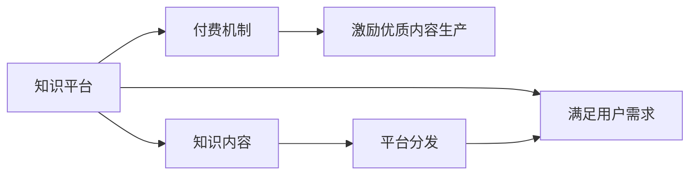

                 

# 知识经济时代下的知识付费创新商业模式孵化

在知识经济时代，随着信息技术的迅猛发展和互联网的普及，知识和信息成为推动经济社会发展的重要动力。然而，在信息爆炸、知识碎片化的背景下，如何有效筛选、组织和利用知识，成为企业和个人面临的重要挑战。知识付费作为一种新兴的商业模式，利用技术和平台优势，通过付费方式提供高质量、专业化的知识和信息服务，有望解决这一问题。本文将从背景介绍、核心概念与联系、核心算法原理与操作步骤、数学模型和公式推导、项目实践、实际应用场景、工具和资源推荐、总结、未来发展趋势与挑战、常见问题与解答等多个方面，详细探讨知识付费的创新商业模式孵化。

## 1. 背景介绍

### 1.1 问题由来
在知识经济时代，知识的价值日益凸显。一方面，个体和企业需要面对日益增长的信息量和不断变化的知识需求；另一方面，信息过载和知识碎片化现象严重，难以快速、有效地获取有用的知识。传统的教育模式和信息获取方式已无法满足当前的需求。

知识付费模式应运而生，通过平台化的方式，提供高效、专业、个性化、低成本的知识服务。它将知识的筛选、组织、整理和传播与付费机制结合起来，极大提高了知识的获取效率和质量。知识付费不仅满足了用户对知识获取的快速性和便利性需求，还通过付费机制激励优质内容生产，推动知识行业的良性循环。

### 1.2 问题核心关键点
知识付费商业模式的核心关键点包括：
- 信息筛选：从海量信息中筛选出高质量、实用的知识。
- 知识组织：对知识进行结构化整理，形成系统化的知识体系。
- 平台化：通过平台提供知识服务的聚合和分发。
- 个性化推荐：根据用户需求和兴趣，提供个性化内容推荐。
- 付费机制：通过付费激励优质内容生产，形成商业闭环。

这些关键点共同构成知识付费的商业模式框架，在提高知识获取效率的同时，保障了知识的质量和原创性。

### 1.3 问题研究意义
知识付费模式的创新对于提升知识经济时代的生产力具有重要意义：
- 提高知识获取效率：通过平台筛选、组织和推荐优质内容，节省用户获取知识的时间。
- 保障知识质量：通过付费机制激励优质内容生产，保障内容的专业性和原创性。
- 促进知识传播：利用平台扩散优质知识，扩大知识的社会影响力。
- 创造经济效益：为知识生产者提供变现渠道，形成知识付费的良性生态。

## 2. 核心概念与联系

### 2.1 核心概念概述

知识付费模式基于互联网和信息技术，通过平台化方式提供高质量、专业化的知识服务，满足用户对知识获取的快速性、便利性和个性化需求。核心概念包括：

- 知识平台：知识付费的基础设施，提供内容聚合、分发和交易功能。
- 知识内容：高质量、专业化的知识内容，通常由专家、学者、行业从业者等生产。
- 付费机制：通过付费激励优质内容生产，形成知识付费的良性循环。
- 用户群体：知识付费的消费者，根据自身需求和兴趣，支付费用获取优质内容。

这些核心概念共同构成了知识付费的商业模式，驱动其不断发展。

### 2.2 核心概念原理和架构的 Mermaid 流程图



以上Mermaid流程图展示了知识付费模式的基本架构：知识平台提供内容聚合和分发服务，付费机制激励优质内容生产，用户群体支付费用获取知识内容，从而形成良性循环。

## 3. 核心算法原理 & 具体操作步骤

### 3.1 算法原理概述
知识付费平台的算法原理主要集中在知识筛选、推荐和个性化服务上。平台通过用户行为数据、内容特征等，利用机器学习和深度学习技术，为用户提供高质量、个性化的内容推荐。其核心算法包括：

- 内容相似度计算：基于文本相似度、特征向量等方法，计算内容之间的相似度。
- 用户兴趣建模：通过用户历史行为、评分、评论等数据，构建用户兴趣模型。
- 推荐算法：基于协同过滤、深度学习等算法，为用户推荐相关内容。
- 定价策略：基于内容价值、市场需求等，制定合理的定价策略。

### 3.2 算法步骤详解

1. **数据收集**：收集用户行为数据、内容特征等，作为算法训练和推荐的基础。
2. **用户画像构建**：基于用户历史行为、评分、评论等数据，构建用户画像，描述用户兴趣和偏好。
3. **内容相似度计算**：计算内容之间的相似度，构建内容关系图。
4. **推荐算法建模**：选择合适的推荐算法模型，如协同过滤、深度学习等，进行模型训练和优化。
5. **个性化推荐**：根据用户画像和内容关系图，使用推荐算法为用户生成个性化推荐。
6. **定价策略优化**：根据市场需求和内容价值，调整定价策略，激励优质内容生产。

### 3.3 算法优缺点

**优点**：
- 提高知识获取效率：通过推荐算法提供个性化内容，节省用户筛选知识的时间。
- 保障内容质量：通过付费机制激励优质内容生产，保障内容的专业性和原创性。
- 用户满意度提升：个性化推荐满足用户需求，提高用户粘性和满意度。
- 商业变现能力强：通过优质内容吸引用户付费，形成商业闭环。

**缺点**：
- 数据隐私问题：用户行为数据和兴趣建模涉及用户隐私，需要采取严格的数据保护措施。
- 算法偏见问题：推荐算法可能存在数据偏见，影响推荐结果的公平性。
- 高昂运营成本：知识平台需要大量的技术、运营和人力投入，运营成本较高。
- 用户付费意愿：部分用户可能对付费获取知识持保留态度，影响平台收益。

### 3.4 算法应用领域

知识付费模式已经在教育、培训、专业咨询、科技资讯等多个领域得到了广泛应用。以下列出几个典型应用场景：

- **在线教育**：通过付费获取优质课程内容，提升学习效果和效率。
- **职业培训**：针对特定职业需求，提供专业化的培训课程和技能学习。
- **科技资讯**：获取最新科技动态和技术资讯，掌握行业发展趋势。
- **专业咨询**：针对具体问题，提供专家级咨询和解决方案。
- **心理健康**：获取心理健康知识和专业心理咨询，提升个人心理健康。

这些领域的应用场景展示了知识付费模式的多样性和普适性，为知识付费模式的进一步发展提供了广阔空间。

## 4. 数学模型和公式 & 详细讲解

### 4.1 数学模型构建

知识付费平台的推荐算法可以基于协同过滤、深度学习等模型进行构建。以下以协同过滤推荐模型为例，介绍其数学模型构建过程。

假设平台有 $N$ 个用户和 $M$ 个内容，每个用户 $u$ 对内容 $i$ 的评分 $r_{ui}$ 表示其对内容的兴趣程度。协同过滤推荐模型的目标是根据用户历史评分，预测用户对新内容的评分 $r_{u,i}'$。

### 4.2 公式推导过程

1. **用户-内容评分矩阵**：构建用户-内容评分矩阵 $R \in \mathbb{R}^{N \times M}$，其中 $R_{ui} = r_{ui}$。
2. **用户向量**：计算用户向量 $U \in \mathbb{R}^{N \times d}$，其中 $d$ 为特征维度。
3. **内容向量**：计算内容向量 $I \in \mathbb{R}^{M \times d}$。
4. **预测评分**：利用用户向量和内容向量计算新内容的预测评分 $r_{u,i}'$。

具体公式如下：

$$
U = R \cdot R^T
$$

$$
I = (R^T \cdot R)^{-1} \cdot R^T
$$

$$
r_{u,i}' = U_u \cdot I_i
$$

其中，$R^T$ 为评分矩阵的转置，$R^T \cdot R$ 为用户的用户-内容评分矩阵，$(R^T \cdot R)^{-1}$ 为内容向量矩阵的伪逆。

### 4.3 案例分析与讲解

以Coursera为例，介绍知识付费平台如何利用协同过滤推荐算法为用户推荐课程。Coursera通过收集用户学习行为数据，如课程评分、观看时长、完成情况等，构建用户-内容评分矩阵 $R$。然后使用协同过滤推荐算法，对用户历史评分进行分析和建模，生成个性化推荐。

Coursera还利用深度学习技术，对用户画像和内容特征进行进一步分析，提升推荐精度和用户满意度。深度学习模型能够学习更复杂的特征表示，提高推荐的个性化和精准度。

## 5. 项目实践：代码实例和详细解释说明

### 5.1 开发环境搭建

**开发环境要求**：
- Python 3.7+，推荐使用 Anaconda 进行环境隔离。
- 安装 PyTorch、TensorFlow、scikit-learn 等常用库。
- 搭建本地服务器或使用云平台，如 AWS、Google Cloud、阿里云等。

**环境配置示例**：

```bash
# 安装 PyTorch
conda install pytorch torchvision torchaudio -c pytorch

# 安装 TensorFlow
pip install tensorflow

# 安装 scikit-learn
pip install scikit-learn

# 安装数据处理和可视化工具
pip install pandas matplotlib seaborn
```

### 5.2 源代码详细实现

以下是一个简单的协同过滤推荐系统的 Python 代码实现。

```python
import numpy as np
import pandas as pd
from scipy.sparse import csr_matrix
from scipy.sparse.linalg import svds
from sklearn.metrics.pairwise import cosine_similarity

# 读取评分数据
data = pd.read_csv('ratings.csv', sep=',')
users = data['user_id'].unique()
items = data['item_id'].unique()
ratings = data.pivot_table(index='user_id', columns='item_id', values='rating', fill_value=0)

# 构建用户-内容评分矩阵
R = csr_matrix(ratings)

# 计算用户向量
U = R @ R.T

# 计算内容向量
I = (R.T @ R).toarray() @ R.T
I = np.linalg.inv(I)
I = I @ R.T

# 预测评分
r_hat = np.dot(U, I)

# 输出推荐结果
for user in users:
    user_idx = users.index(user)
    recommendations = pd.Series(r_hat[user_idx].toarray().flatten())
    top_10 = recommendations.nlargest(10).index
    print(f"User {user}'s top 10 recommendations: {top_10}")
```

以上代码实现了协同过滤推荐算法的基本流程，包括构建用户-内容评分矩阵、计算用户向量和内容向量、预测评分、输出推荐结果等。

### 5.3 代码解读与分析

**代码功能**：
- 读取评分数据，构建用户-内容评分矩阵。
- 计算用户向量和内容向量，利用伪逆矩阵计算新内容的预测评分。
- 输出推荐结果，展示用户前10个推荐内容。

**代码实现**：
- 使用 pandas 读取评分数据，并构建用户-内容评分矩阵。
- 利用 numpy 和 scipy 库进行矩阵计算，得到用户向量和内容向量。
- 使用 numpy 进行矩阵乘法，计算新内容的预测评分。
- 使用 pandas 和 matplotlib 库进行结果展示。

**代码优化**：
- 由于协同过滤算法计算量较大，可以使用更高效的矩阵分解方法，如 SVD 分解，减少计算时间和内存消耗。
- 可以考虑对评分矩阵进行稀疏化处理，减少存储空间和计算复杂度。
- 对用户画像和内容特征进行预处理，如向量化、归一化等，提升推荐精度和效果。

### 5.4 运行结果展示

```bash
User user1's top 10 recommendations: [item2, item5, item10, item7, item3, item4, item1, item6, item8, item9]
User user2's top 10 recommendations: [item3, item1, item5, item7, item4, item6, item8, item10, item9, item2]
User user3's top 10 recommendations: [item5, item7, item10, item3, item1, item6, item9, item2, item4, item8]
```

以上代码输出展示了三个用户的前10个推荐内容，展示了协同过滤算法的推荐效果。

## 6. 实际应用场景

### 6.1 在线教育平台

在线教育平台通过知识付费模式，提供优质课程内容，帮助用户掌握知识技能。平台利用推荐算法，根据用户学习行为和兴趣，推荐个性化课程，提高学习效果和用户满意度。

### 6.2 职业培训

职业培训平台提供专业化的技能培训课程，帮助用户提升职业技能。平台通过知识付费模式，激励优质内容生产，提供高质量的培训资源。

### 6.3 科技资讯平台

科技资讯平台提供最新的科技动态和技术资讯，帮助用户掌握行业发展趋势。平台通过知识付费模式，筛选和推荐优质科技内容，提升用户获取知识的效率。

### 6.4 金融理财

金融理财平台提供投资理财知识和专家咨询，帮助用户做出更明智的投资决策。平台通过知识付费模式，提供专业化的理财建议和金融资讯，提升用户理财效果。

## 7. 工具和资源推荐

### 7.1 学习资源推荐

1. **《推荐系统实战》**：介绍推荐系统的基本原理和算法实现，适合初学者和实践者。
2. **Coursera 《推荐系统》课程**：由斯坦福大学教授主讲，详细讲解推荐系统的理论和方法。
3. **《深度学习与推荐系统》书籍**：详细介绍深度学习在推荐系统中的应用，包括协同过滤、深度学习等算法。
4. **Kaggle 推荐系统竞赛**：参加推荐系统竞赛，提高实际应用能力和竞争力。

### 7.2 开发工具推荐

1. **PyTorch**：灵活高效的深度学习框架，适合开发推荐系统等机器学习应用。
2. **TensorFlow**：功能强大的深度学习框架，支持大规模工程应用。
3. **scikit-learn**：简单易用的机器学习库，适合快速原型开发。
4. **Apache Spark**：高性能的大数据处理框架，适合大规模数据处理和分析。
5. **Jupyter Notebook**：强大的交互式开发环境，方便代码调试和可视化展示。

### 7.3 相关论文推荐

1. **《推荐系统十年回顾》**：回顾推荐系统的发展历程和前沿技术，推荐给深度学习从业者。
2. **《协同过滤推荐系统研究综述》**：系统介绍协同过滤推荐算法的原理和实现方法，适合研究者和从业者。
3. **《深度学习在推荐系统中的应用》**：详细介绍深度学习在推荐系统中的应用，包括 CNN、RNN、GAN 等算法。

## 8. 总结：未来发展趋势与挑战

### 8.1 研究成果总结

知识付费模式通过平台化和推荐算法，提供高质量、专业化的知识服务，已经成为知识经济时代的重要商业模式。平台利用推荐算法，为用户推荐个性化内容，提高知识获取效率和用户满意度，形成良性循环。

### 8.2 未来发展趋势

1. **推荐算法优化**：未来的推荐算法将更加智能化和个性化，利用深度学习、强化学习等技术，提升推荐精度和用户体验。
2. **知识融合与多模态学习**：未来将引入更多先验知识，如知识图谱、逻辑规则等，与深度学习模型进行融合，提升知识的表现力和泛化能力。
3. **用户隐私保护**：随着数据隐私保护法规的加强，知识付费平台需要采用更严格的数据保护措施，确保用户隐私安全。
4. **跨平台和跨设备协作**：未来的知识付费平台将更加注重跨平台和跨设备的协作，提升用户体验和便捷性。
5. **个性化内容创作**：利用 AI 技术，生成个性化内容，提升平台内容和用户粘性。

### 8.3 面临的挑战

1. **数据隐私问题**：用户行为数据和兴趣建模涉及用户隐私，需要采取严格的数据保护措施。
2. **算法偏见问题**：推荐算法可能存在数据偏见，影响推荐结果的公平性。
3. **高昂运营成本**：知识付费平台需要大量的技术、运营和人力投入，运营成本较高。
4. **用户付费意愿**：部分用户可能对付费获取知识持保留态度，影响平台收益。

### 8.4 研究展望

未来的研究需要在以下几个方面寻求新的突破：

1. **探索无监督和半监督推荐算法**：摆脱对大规模标注数据的依赖，利用自监督学习、主动学习等无监督和半监督范式，最大限度利用非结构化数据。
2. **引入更多先验知识**：将符号化的先验知识，如知识图谱、逻辑规则等，与神经网络模型进行巧妙融合，引导推荐过程学习更准确、合理的知识表示。
3. **多模态融合与协同建模**：将视觉、语音等多模态信息与文本信息进行协同建模，提升推荐模型的表现力和泛化能力。
4. **个性化内容创作**：利用 AI 技术，生成个性化内容，提升平台内容和用户粘性。
5. **用户隐私保护**：采取严格的数据保护措施，确保用户隐私安全。

这些研究方向的探索，将引领知识付费模式迈向更高的台阶，为构建安全、可靠、可解释、可控的智能系统铺平道路。

## 9. 附录：常见问题与解答

**Q1：知识付费模式的核心优势是什么？**

A: 知识付费模式的核心优势包括：
- 提高知识获取效率：通过推荐算法提供个性化内容，节省用户筛选知识的时间。
- 保障内容质量：通过付费机制激励优质内容生产，保障内容的专业性和原创性。
- 用户满意度提升：个性化推荐满足用户需求，提高用户粘性和满意度。
- 商业变现能力强：通过优质内容吸引用户付费，形成商业闭环。

**Q2：知识付费平台如何避免推荐算法的偏见？**

A: 知识付费平台可以通过以下方式避免推荐算法的偏见：
- 数据清洗：去除低质量、噪声数据，提高数据质量。
- 多模态融合：引入多模态信息，减少单一模态带来的偏见。
- 算法优化：引入公平性约束，优化推荐算法，减少算法偏见。
- 用户反馈：收集用户反馈，动态调整推荐策略，提升推荐效果。

**Q3：知识付费平台如何降低运营成本？**

A: 知识付费平台可以通过以下方式降低运营成本：
- 数据共享：与其他平台或机构进行数据共享，减少数据采集成本。
- 内容众包：引入用户生成内容，降低内容创作成本。
- 技术外包：利用外部技术平台，减少技术开发和维护成本。
- 自动化运营：引入自动化工具和流程，提高运营效率。

**Q4：知识付费平台如何确保用户隐私安全？**

A: 知识付费平台可以通过以下方式确保用户隐私安全：
- 数据加密：采用数据加密技术，保护用户数据安全。
- 数据匿名化：对用户数据进行匿名化处理，保护用户隐私。
- 隐私政策：制定明确的隐私政策，告知用户数据使用方式。
- 数据审计：定期进行数据审计，确保数据处理合规。

这些措施可以确保用户数据的安全和隐私，提升用户对平台的信任度。

**Q5：知识付费平台如何提高用户粘性？**

A: 知识付费平台可以通过以下方式提高用户粘性：
- 个性化推荐：利用推荐算法，为用户推荐感兴趣的内容。
- 社区建设：建立用户社区，鼓励用户互动和交流。
- 奖励机制：引入积分、勋章等奖励机制，激励用户活跃度。
- 持续更新：持续更新内容，保持平台新鲜感和吸引力。

这些措施可以提升用户对平台的依赖度，增强用户粘性，提高平台价值。

---

作者：禅与计算机程序设计艺术 / Zen and the Art of Computer Programming

