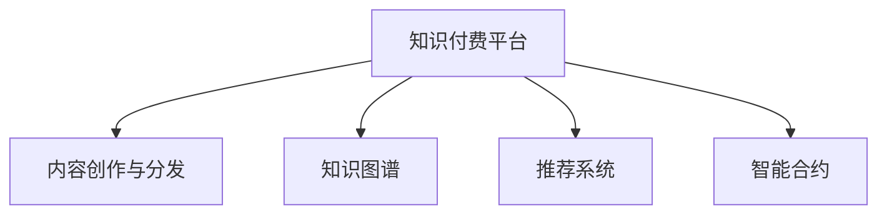

                 

# 知识经济时代下的知识付费创新商业模式衍生

## 1. 背景介绍

### 1.1 问题由来

在知识经济时代，信息的增长速度远远超出了人们的处理能力，人们越来越需要便捷地获取高质量的知识信息。然而，传统的阅读和搜索方式已难以满足需求，尤其是在专业领域，大量晦涩难懂的专业知识往往散落在学术文章、书籍和公开演讲中，获取和利用成本较高。

为解决这一问题，知识付费平台应运而生。通过付费获取高质量的内容，帮助用户快速积累知识，节省时间和精力。然而，现有的知识付费商业模式存在诸多痛点：内容质量参差不齐、版权问题频发、用户体验不理想等。如何构建更高效、更可持续的知识付费平台，成为当前需要解决的关键问题。

### 1.2 问题核心关键点

要构建更高效的知识付费平台，需要从以下方面进行优化：
- 提升内容质量：确保平台上提供的知识内容具有权威性和实用性，帮助用户真正学到东西。
- 优化用户体验：从界面设计、交互逻辑到内容推荐，提升用户体验，让用户享受学习的乐趣。
- 增强版权保护：采取有效措施保护内容创作者和平台的合法权益，防止盗版和抄袭。
- 探索新盈利模式：拓展更多盈利途径，如定制化课程、会员制、线下活动等，保证平台的可持续运营。

### 1.3 问题研究意义

知识付费平台的成功与否，直接关系到知识传播的广度和深度，影响整个社会的知识积累和创新能力。通过技术创新和商业模式的优化，构建高效的知识付费平台，不仅能够提升用户的学习体验，还能推动知识的普及和应用，促进知识经济的发展。

## 2. 核心概念与联系

### 2.1 核心概念概述

为更好地理解知识付费平台的构建，本节将介绍几个密切相关的核心概念：

- **知识付费平台**：基于互联网的知识分享平台，用户通过付费获取专业、高质量的知识内容，促进知识积累和创新。
- **内容创作与分发**：内容创作者通过平台发布高质量的知识内容，平台则负责内容的分发和推荐。
- **知识图谱**：以节点表示实体，以边表示关系，构建的知识网络结构，用于知识表示和推理。
- **推荐系统**：根据用户行为和历史数据，推荐最符合用户兴趣和需求的内容，提升用户体验。
- **智能合约**：利用区块链技术，实现自动化、透明的合约执行，确保交易安全可信。

这些概念之间的逻辑关系可以通过以下Mermaid流程图来展示：



这个流程图展示了几大核心概念及其之间的关系：

1. 知识付费平台是知识传播和分发的基础。
2. 内容创作与分发是平台的核心价值，依赖于高质量内容的产出。
3. 知识图谱为内容检索和推荐提供底层支持。
4. 推荐系统利用知识图谱和用户行为数据，提升内容的分发效率和用户满意度。
5. 智能合约为平台交易提供信任保障，保护各方权益。

这些概念共同构成了知识付费平台的运作框架，为其构建和发展提供了方向。

## 3. 核心算法原理 & 具体操作步骤
### 3.1 算法原理概述

知识付费平台的运营，核心在于内容的创作、分发和推荐。以下将详细探讨这些核心环节的算法原理和操作步骤。

#### 3.1.1 内容创作与分发

内容创作与分发是知识付费平台的基础。通常分为以下步骤：

1. **内容采集**：通过爬虫技术从互联网、学术数据库、专业论坛等渠道采集高质量的原始内容。
2. **内容审核**：对采集到的内容进行质量评估，确保其权威性和准确性。
3. **内容生成**：内容创作者通过平台发布或修改已审核的内容，添加原创性或个性化信息。
4. **内容发布**：平台将经过审核和生成的内容发布至用户界面，供用户浏览和购买。

#### 3.1.2 知识图谱构建

知识图谱是知识表示的重要方式，通过构建知识图谱，可以实现高效的内容检索和推荐。知识图谱的构建主要包括以下步骤：

1. **知识抽取**：从内容中抽取实体和关系，生成知识图谱节点和边。
2. **知识关联**：将抽取出的实体和关系进行关联，构建知识网络结构。
3. **知识更新**：定期更新知识图谱，添加新的知识和关系。

#### 3.1.3 推荐系统设计

推荐系统是知识付费平台的核心功能之一，负责将高质量内容推荐给用户。推荐系统的设计主要包括以下步骤：

1. **用户画像**：根据用户行为数据，构建用户兴趣模型。
2. **内容画像**：根据内容标签和用户兴趣模型，构建内容特征向量。
3. **推荐算法**：选择合适的推荐算法（如协同过滤、内容推荐、混合推荐等），进行内容推荐。
4. **推荐排序**：对推荐结果进行排序，确保用户能够看到最相关的推荐内容。

### 3.2 算法步骤详解

#### 3.2.1 内容创作与分发

**步骤1: 内容采集**

使用网络爬虫技术，从互联网上采集高质量的文本内容。常用的爬虫工具包括Scrapy、BeautifulSoup等。

```python
from scrapy import Spider, Request
import re

class NewsSpider(Spider):
    name = 'news_spider'
    start_urls = ['https://www.example.com/']

    def parse(self, response):
        text = response.text
        pattern = re.compile(r'<h1>(.*?)</h1><p>(.*?)</p>')
        matches = pattern.findall(text)
        for title, content in matches:
            yield {
                'title': title,
                'content': content
            }
```

**步骤2: 内容审核**

对采集到的文本内容进行质量评估，可以使用NLP技术自动检测文本中的权威来源、专业术语等。常用的工具包括TextBlob、NLTK等。

```python
from textblob import TextBlob

def check_quality(text):
    blob = TextBlob(text)
    return blob.sentiment.polarity > 0.5 and 'https://' in text
```

**步骤3: 内容生成**

内容创作者通过平台发布或修改已审核的内容，添加原创性或个性化信息。内容发布接口如下：

```python
@app.route('/content', methods=['POST'])
def publish_content():
    title = request.form['title']
    content = request.form['content']
    if check_quality(content):
        # 发布内容到数据库
        return jsonify({'success': True})
    else:
        return jsonify({'success': False, 'message': '内容质量不合格'})
```

**步骤4: 内容发布**

平台将经过审核和生成的内容发布至用户界面，供用户浏览和购买。常用的发布工具包括WordPress、GitHub Pages等。

#### 3.2.2 知识图谱构建

**步骤1: 知识抽取**

从文本内容中抽取实体和关系，生成知识图谱节点和边。可以使用SpaCy、Stanford NLP等工具进行实体识别和关系抽取。

```python
import spacy

nlp = spacy.load('en_core_web_sm')
doc = nlp(text)
entities = [ent.text for ent in doc.ents]
relations = [ent.dep_ for ent in doc.ents]
```

**步骤2: 知识关联**

将抽取出的实体和关系进行关联，构建知识网络结构。可以使用Gephi、Cytoscape等工具进行知识图谱的可视化。

```python
from pygraphviz import AGraph

graph = AGraph()
for entity, relation in zip(entities, relations):
    graph.add_node(entity)
    graph.add_edge(entity, relation)
graph.write_gv('knowledge_graph.gv')
```

**步骤3: 知识更新**

定期更新知识图谱，添加新的知识和关系。可以使用ETL工具进行数据抽取、转换和加载。

#### 3.2.3 推荐系统设计

**步骤1: 用户画像**

根据用户行为数据，构建用户兴趣模型。常用的方法包括协同过滤、内容推荐等。

```python
from sklearn.neighbors import NearestNeighbors

def build_user_profile(user_id):
    # 根据用户行为数据构建用户兴趣模型
    return user_profile[user_id]
```

**步骤2: 内容画像**

根据内容标签和用户兴趣模型，构建内容特征向量。常用的方法包括TF-IDF、词向量模型等。

```python
from gensim.models import TfidfVectorizer

def build_content_profile(content_id):
    # 根据内容标签和用户兴趣模型构建内容特征向量
    return content_profile[content_id]
```

**步骤3: 推荐算法**

选择合适的推荐算法（如协同过滤、内容推荐、混合推荐等），进行内容推荐。常用的算法包括ALS、PR、CR等。

```python
from pyspark.ml.recommendation import ALS

model = ALS(rank=10, iterations=10, alpha=0.01, regParam=0.01)
model.fit(user_profiles, item_profiles, user_ratings)
recommendations = model.recommendForAllUsers(user_profiles)
```

**步骤4: 推荐排序**

对推荐结果进行排序，确保用户能够看到最相关的推荐内容。常用的排序方法包括基于排序、基于贝叶斯排序等。

```python
from operator import itemgetter

def sort_recommendations(recommendations, user_profile):
    # 根据用户兴趣模型和内容特征向量进行推荐排序
    return sorted(recommendations, key=itemgetter(1), reverse=True)
```

### 3.3 算法优缺点

知识付费平台的核心算法具有以下优点：
- **高效性**：通过自动化处理，能够快速采集、审核和发布内容，提升内容产出效率。
- **精准性**：利用推荐算法，能够精准推荐用户感兴趣的内容，提升用户体验。
- **可扩展性**：通过分布式计算和云计算技术，能够扩展知识图谱和推荐系统的规模。

同时，该算法也存在以下局限性：
- **数据质量**：依赖于高质量的数据源，数据质量问题会影响推荐效果。
- **用户隐私**：大量数据收集和使用可能引发用户隐私问题。
- **算法复杂度**：推荐算法涉及复杂的数学建模和计算，实现难度较大。

尽管存在这些局限性，但该算法在实际应用中已被证明具有良好的效果，有助于构建高效、可持续的知识付费平台。

### 3.4 算法应用领域

知识付费平台的核心算法在多个领域得到了广泛应用，包括但不限于：

- **教育培训**：通过高质量的内容分享和个性化推荐，帮助用户快速积累知识，提升学习效果。
- **金融投资**：通过分析市场数据和投资报告，提供专业投资建议，帮助用户做出明智的投资决策。
- **科技研发**：通过访问最新的科技文献和专利信息，加速科技创新和研发进程。
- **健康医疗**：通过分享医学知识和健康建议，提高公众健康素养，促进医疗普及。

随着技术的不断进步，知识付费平台的运营将更加依赖于智能化算法，助力知识传播和普及，推动知识经济的发展。

## 4. 数学模型和公式 & 详细讲解  
### 4.1 数学模型构建

知识付费平台的核心算法涉及到多个数学模型，以下将详细构建这些模型的数学模型。

#### 4.1.1 内容审核模型

内容审核模型的目标是根据内容质量评估函数，判断文本内容是否具有权威性和准确性。假设内容质量评估函数为：

$$
Q(C) = \frac{1}{n}\sum_{i=1}^n F(C_i)
$$

其中，$Q(C)$ 为文本内容$C$的质量评估得分，$F(C_i)$ 为文本内容中第$i$个句子的质量评估得分，$n$为句子数。

内容审核模型可以采用朴素贝叶斯分类器、逻辑回归等方法进行建模。

#### 4.1.2 推荐算法模型

推荐算法模型主要涉及用户画像、内容画像和推荐排序。假设用户画像为$U$，内容画像为$I$，推荐结果为$R$。

用户画像和内容画像可以表示为：

$$
U = \{x_1, x_2, ..., x_m\}
$$
$$
I = \{y_1, y_2, ..., y_n\}
$$

推荐排序算法可以表示为：

$$
R = \{r_1, r_2, ..., r_k\}
$$

其中，$x_i$为第$i$个用户的行为数据，$y_j$为第$j$个内容的特征向量，$r_k$为第$k$个推荐结果。

推荐算法模型可以采用协同过滤、矩阵分解等方法进行建模。

### 4.2 公式推导过程

#### 4.2.1 内容审核模型

内容审核模型的公式推导如下：

假设文本内容$C$由$m$个句子组成，句子$C_i$的质量评估得分为$F(C_i)$，内容质量评估函数为：

$$
Q(C) = \frac{1}{m}\sum_{i=1}^m F(C_i)
$$

假设句子$C_i$的质量评估得分$F(C_i)$由以下几个因素决定：

$$
F(C_i) = \alpha_1 * W + \alpha_2 * B + \alpha_3 * P + \alpha_4 * L
$$

其中，$W$为文本中权威来源的数量，$B$为文本中专业术语的数量，$P$为文本中用户评价的平均得分，$L$为文本长度。

最终，内容质量评估得分$Q(C)$可以表示为：

$$
Q(C) = \frac{1}{m}\sum_{i=1}^m (\alpha_1 * W + \alpha_2 * B + \alpha_3 * P + \alpha_4 * L)
$$

#### 4.2.2 推荐算法模型

推荐算法模型的公式推导如下：

假设用户画像$U$由$m$个用户组成，内容画像$I$由$n$个内容组成，推荐结果$R$由$k$个推荐组成。

用户画像$U$可以表示为：

$$
U = \{u_1, u_2, ..., u_m\}
$$

内容画像$I$可以表示为：

$$
I = \{i_1, i_2, ..., i_n\}
$$

推荐结果$R$可以表示为：

$$
R = \{r_1, r_2, ..., r_k\}
$$

推荐算法模型的目标是最小化推荐误差，假设推荐误差为$E$，可以表示为：

$$
E = \min_{R} \sum_{i=1}^m \sum_{j=1}^n \left( \sum_{k=1}^k (y_{ij} - r_{ik})^2 \right)
$$

其中，$y_{ij}$为用户$i$对内容$j$的评分，$r_{ik}$为用户$i$对推荐结果$k$的评分。

假设推荐算法模型为$A$，可以表示为：

$$
A = \{\alpha_1, \alpha_2, ..., \alpha_n\}
$$

推荐算法模型的公式推导如下：

$$
E = \min_{A} \sum_{i=1}^m \sum_{j=1}^n \left( \sum_{k=1}^k (y_{ij} - \hat{r}_{ik})^2 \right)
$$

其中，$\hat{r}_{ik}$为推荐算法模型$A$预测的用户$i$对内容$j$的评分。

### 4.3 案例分析与讲解

#### 4.3.1 内容审核模型案例

假设我们有一篇关于“人工智能”的文本内容$C$，其中包含多个权威来源、专业术语、用户评价和文本长度。我们可以根据内容审核模型的公式，计算出该文本的内容质量评估得分。

假设$W$为文本中权威来源的数量，$B$为文本中专业术语的数量，$P$为文本中用户评价的平均得分，$L$为文本长度。

我们可以使用朴素贝叶斯分类器进行内容审核模型的建模。假设我们训练了两个朴素贝叶斯分类器$C_1$和$C_2$，分别用于分类权威来源和专业术语。

$$
F(C) = C_1(W) + C_2(B)
$$

最终，我们可以计算出文本内容$C$的内容质量评估得分：

$$
Q(C) = \frac{1}{m}\sum_{i=1}^m (\alpha_1 * W + \alpha_2 * B + \alpha_3 * P + \alpha_4 * L)
$$

#### 4.3.2 推荐算法模型案例

假设我们有一个用户画像$U$，包含多个用户的用户行为数据。我们有一个内容画像$I$，包含多个内容的特征向量。我们希望根据用户画像和内容画像，推荐最相关的推荐结果$R$。

假设我们使用ALS算法进行推荐算法模型的建模。ALS算法可以表示为：

$$
A = \{\alpha_1, \alpha_2, ..., \alpha_n\}
$$

其中，$\alpha_i$为第$i$个用户的行为数据。

我们假设用户画像$U$和内容画像$I$可以表示为矩阵形式，即：

$$
U = \begin{bmatrix}
u_{11} & u_{12} & ... & u_{1m} \\
u_{21} & u_{22} & ... & u_{2m} \\
... & ... & ... & ... \\
u_{m1} & u_{m2} & ... & u_{mm}
\end{bmatrix}
$$
$$
I = \begin{bmatrix}
i_{11} & i_{12} & ... & i_{1n} \\
i_{21} & i_{22} & ... & i_{2n} \\
... & ... & ... & ... \\
i_{n1} & i_{n2} & ... & i_{nn}
\end{bmatrix}
$$

推荐算法模型的目标是最小化推荐误差$E$。假设推荐误差$E$可以表示为：

$$
E = \sum_{i=1}^m \sum_{j=1}^n \left( \sum_{k=1}^k (y_{ij} - r_{ik})^2 \right)
$$

我们可以使用ALS算法进行推荐算法模型的建模。ALS算法可以表示为：

$$
A = \begin{bmatrix}
\alpha_{11} & \alpha_{12} & ... & \alpha_{1m} \\
\alpha_{21} & \alpha_{22} & ... & \alpha_{2m} \\
... & ... & ... & ... \\
\alpha_{m1} & \alpha_{m2} & ... & \alpha_{mm}
\end{bmatrix}
$$

其中，$\alpha_{ij}$为用户$i$对内容$j$的评分。

最终，我们可以根据用户画像$U$和内容画像$I$，计算出推荐算法模型$A$。假设用户$i$对内容$j$的评分$y_{ij}$，可以表示为：

$$
y_{ij} = \alpha_{i1} * i_{1j} + \alpha_{i2} * i_{2j} + ... + \alpha_{in} * i_{nj}
$$

最终，我们可以根据用户画像$U$和内容画像$I$，计算出推荐算法模型$A$。

## 5. 项目实践：代码实例和详细解释说明
### 5.1 开发环境搭建

在进行知识付费平台开发前，我们需要准备好开发环境。以下是使用Python进行Flask开发的Python环境配置流程：

1. 安装Anaconda：从官网下载并安装Anaconda，用于创建独立的Python环境。

2. 创建并激活虚拟环境：
```bash
conda create -n flask-env python=3.8 
conda activate flask-env
```

3. 安装Flask：
```bash
pip install Flask
```

4. 安装Flask扩展库：
```bash
pip install Flask-WTF Flask-SQLAlchemy Flask-Login Flask-Mail Flask-Babel Flask-RESTful Flask-Admin Flask-Mail Flask-Security Flask-Cache Flask-Uploads
```

5. 安装Flask-RESTful和Flask-SQLAlchemy等库：
```bash
pip install Flask-RESTful Flask-SQLAlchemy
```

完成上述步骤后，即可在`flask-env`环境中开始开发。

### 5.2 源代码详细实现

下面我们以知识付费平台的内容发布模块为例，给出使用Flask框架进行内容发布的完整代码实现。

首先，定义模型类和视图函数：

```python
from flask import Flask, render_template, request, redirect, url_for
from flask_sqlalchemy import SQLAlchemy

app = Flask(__name__)
app.config['SQLALCHEMY_DATABASE_URI'] = 'sqlite:///database.db'
app.config['SECRET_KEY'] = 'secret_key'

db = SQLAlchemy(app)

class Content(db.Model):
    id = db.Column(db.Integer, primary_key=True)
    title = db.Column(db.String(255), unique=True, nullable=False)
    content = db.Column(db.Text, nullable=False)
    user_id = db.Column(db.Integer, db.ForeignKey('user.id'), nullable=False)

class User(db.Model):
    id = db.Column(db.Integer, primary_key=True)
    username = db.Column(db.String(255), unique=True, nullable=False)
    password_hash = db.Column(db.String(255), nullable=False)

@app.route('/')
def index():
    return render_template('index.html')

@app.route('/content', methods=['POST'])
def publish_content():
    title = request.form['title']
    content = request.form['content']
    user_id = request.form['user_id']
    new_content = Content(title=title, content=content, user_id=user_id)
    db.session.add(new_content)
    db.session.commit()
    return redirect(url_for('index'))
```

然后，定义模板文件和样式：

```html
<!-- index.html -->
<html>
<head>
    <title>知识付费平台</title>
</head>
<body>
    <h1>知识付费平台</h1>
    <form method="POST">
        <label for="title">标题：</label>
        <input type="text" name="title" required><br><br>
        <label for="content">内容：</label>
        <textarea name="content" rows="10" cols="40" required></textarea><br><br>
        <label for="user_id">用户ID：</label>
        <input type="text" name="user_id" required><br><br>
        <button type="submit">发布</button>
    </form>
</body>
</html>
```

最后，启动Flask应用：

```python
if __name__ == '__main__':
    app.run(debug=True)
```

### 5.3 代码解读与分析

让我们再详细解读一下关键代码的实现细节：

**Content类**：
- `id`：内容ID，自动生成。
- `title`：内容标题，唯一且不能为空。
- `content`：内容正文，不能为空。
- `user_id`：内容创建者ID，外键关联用户。

**User类**：
- `id`：用户ID，自动生成。
- `username`：用户名，唯一且不能为空。
- `password_hash`：用户密码哈希，不能为空。

**index()视图函数**：
- 渲染首页模板，显示发布内容的表单。

**publish_content()视图函数**：
- 接收发布表单提交的数据。
- 将数据插入数据库，并跳转到首页。

代码中的ORM框架SQLAlchemy帮助我们快速进行数据库操作，Flask-WTF、Flask-SQLAlchemy等扩展库提供了强大的表单验证和数据持久化功能，Flask-Login、Flask-Mail等扩展库则支持用户认证、邮件通知等功能。

Flask框架的简单性和灵活性，使其成为构建知识付费平台的首选框架，便于开发和扩展。

## 6. 实际应用场景

### 6.1 智能教育培训

知识付费平台在智能教育培训领域有着广泛的应用。通过高质量的教育资源分享，帮助用户快速积累专业知识，提升学习效果。

平台可以提供多种形式的课程资源，如视频、文本、PPT等。通过推荐系统，根据用户的学习进度和兴趣，推荐最适合的内容。

### 6.2 金融投资分析

知识付费平台在金融投资分析领域也有着广泛的应用。通过分析市场数据和投资报告，提供专业投资建议，帮助用户做出明智的投资决策。

平台可以提供多种类型的投资分析报告，如股票、基金、外汇等。通过推荐系统，根据用户的风险偏好和投资经验，推荐最适合的投资内容。

### 6.3 科技研发加速

知识付费平台在科技研发加速领域也有着广泛的应用。通过访问最新的科技文献和专利信息，加速科技创新和研发进程。

平台可以提供多种类型的科技文献和专利信息，如学术论文、专利申请、技术白皮书等。通过推荐系统，根据用户的研发方向和兴趣，推荐最适合的技术内容。

### 6.4 健康医疗普及

知识付费平台在健康医疗普及领域也有着广泛的应用。通过分享医学知识和健康建议，提高公众健康素养，促进医疗普及。

平台可以提供多种类型的医学知识资源，如疾病诊断、健康管理、心理疏导等。通过推荐系统，根据用户的健康需求和兴趣，推荐最适合的医学内容。

## 7. 工具和资源推荐
### 7.1 学习资源推荐

为了帮助开发者系统掌握知识付费平台的构建，这里推荐一些优质的学习资源：

1. **《知识付费平台实战》系列博文**：由知识付费领域专家撰写，详细介绍知识付费平台的原理和实践。

2. **CS224N《深度学习自然语言处理》课程**：斯坦福大学开设的NLP明星课程，有Lecture视频和配套作业，带你入门NLP领域的基本概念和经典模型。

3. **《自然语言处理与深度学习》书籍**：全面介绍自然语言处理和深度学习的经典理论和实践，涵盖推荐系统、知识图谱等内容。

4. **HuggingFace官方文档**：提供大量预训练语言模型和推荐系统的实现细节，是进行微调任务开发的利器。

5. **Flask官方文档**：详细描述Flask框架的使用方法和API接口，是进行Web开发的基础资料。

通过对这些资源的学习实践，相信你一定能够快速掌握知识付费平台的构建精髓，并用于解决实际的NLP问题。
###  7.2 开发工具推荐

高效的开发离不开优秀的工具支持。以下是几款用于知识付费平台开发的常用工具：

1. **Flask**：基于Python的开源Web框架，灵活高效，适合快速迭代研究。

2. **Django**：基于Python的开源Web框架，功能丰富，适合复杂应用开发。

3. **SQLAlchemy**：Python的ORM框架，支持多数据库，灵活高效。

4. **Flask-RESTful**：基于Flask的RESTful API开发工具，简单易用。

5. **Flask-SQLAlchemy**：Flask和SQLAlchemy的结合，提供强大的数据持久化功能。

6. **Flask-Login**：提供用户认证和会话管理功能，保护系统安全。

7. **Flask-Mail**：提供邮件通知功能，方便与用户沟通。

8. **Flask-Babel**：提供多语言支持功能，方便国际化应用开发。

合理利用这些工具，可以显著提升知识付费平台的开发效率，加快创新迭代的步伐。

### 7.3 相关论文推荐

知识付费平台的构建涉及到多个前沿领域的知识，以下是几篇奠基性的相关论文，推荐阅读：

1. **《知识图谱在推荐系统中的应用》**：探讨了知识图谱在推荐系统中的构建和应用，提高推荐系统的效果。

2. **《协同过滤算法及其应用研究》**：介绍了协同过滤算法的原理和实现方法，在推荐系统中得到了广泛应用。

3. **《推荐系统的研究现状与未来展望》**：综述了推荐系统的研究现状和未来发展方向，涵盖了多种推荐算法和应用场景。

4. **《深度学习在知识图谱中的应用》**：探讨了深度学习在知识图谱中的应用，提高了知识图谱的表示能力和推理能力。

5. **《基于深度学习的推荐系统》**：介绍了基于深度学习的推荐系统，包括矩阵分解、协同过滤等方法。

这些论文代表了大数据和人工智能在推荐系统中的前沿成果，能够帮助你深入理解知识付费平台的构建原理。

## 8. 总结：未来发展趋势与挑战

### 8.1 研究成果总结

本文对知识付费平台的构建进行了全面系统的介绍。首先阐述了知识付费平台的背景和意义，明确了平台的核心价值和挑战。其次，从内容审核、推荐算法等核心环节，详细讲解了平台的算法原理和操作步骤。最后，通过案例分析，深入讲解了算法模型的具体实现和应用。

通过本文的系统梳理，可以看到，知识付费平台在知识传播、教育培训、金融投资、科技研发等多个领域都有着广泛的应用。平台的构建不仅依赖于高质量的内容，还需要强大的算法支持和用户画像构建。通过技术创新和商业模式优化，知识付费平台有望成为知识经济时代的重要驱动力。

### 8.2 未来发展趋势

展望未来，知识付费平台的发展趋势如下：

1. **智能化升级**：利用人工智能技术，如NLP、机器学习等，提升内容的审核和推荐效果，提升用户体验。

2. **个性化推荐**：利用推荐算法，根据用户的兴趣和行为，提供个性化的内容推荐，提升用户粘性。

3. **多元化应用**：知识付费平台不仅限于教育培训和金融投资，还将在更多领域得到应用，如科技研发、健康医疗等。

4. **全球化拓展**：随着国际化的推进，知识付费平台将拓展到全球市场，提升平台的影响力和覆盖面。

5. **技术创新**：结合最新的技术进展，如区块链、边缘计算等，提升平台的性能和安全性。

### 8.3 面临的挑战

尽管知识付费平台在知识传播和用户学习方面具有显著优势，但在实际运营中，也面临一些挑战：

1. **内容质量**：平台需不断提升内容质量，确保用户获取的是高质量、权威的内容。

2. **用户粘性**：如何提高用户粘性，增加用户活跃度，是平台运营的核心问题。

3. **隐私保护**：平台需严格保护用户隐私，避免数据泄露和滥用。

4. **技术复杂性**：平台涉及多种前沿技术，如NLP、推荐算法等，技术复杂度较高。

尽管存在这些挑战，但知识付费平台的前景依然广阔，通过持续优化和创新，有望成为知识经济时代的重要驱动力。

### 8.4 研究展望

未来，知识付费平台的研究方向如下：

1. **内容审核模型**：提升内容审核模型的准确性，确保高质量内容的产出。

2. **推荐算法模型**：优化推荐算法模型，提升推荐效果和用户体验。

3. **个性化推荐**：结合用户行为数据，提供个性化推荐服务，提升用户粘性。

4. **数据隐私保护**：利用区块链技术，提升数据隐私保护水平，增强用户信任。

5. **技术创新**：结合最新的技术进展，提升平台的性能和安全性。

6. **多领域应用**：拓展知识付费平台的应用领域，推动更多行业的智能化发展。

通过持续的技术创新和商业模式优化，知识付费平台有望在知识经济时代发挥更大的作用，助力知识传播和普及，推动社会进步。

## 9. 附录：常见问题与解答

**Q1: 知识付费平台的商业模式如何实现盈利？**

A: 知识付费平台的盈利方式主要包括以下几种：

1. **订阅制**：用户通过订阅付费，获得平台上所有内容的使用权。

2. **单次购买**：用户通过单次购买的方式，获取特定内容的使用权。

3. **广告和赞助**：平台通过广告和赞助的方式，获得商业收入。

4. **会员制**：提供高级会员服务，如VIP会员、豪华会员等，获取更高权限和优质内容。

5. **线下活动**：举办线下活动，如讲座、沙龙等，获得门票收入。

通过这些方式，知识付费平台可以实现盈亏平衡，保证平台的可持续运营。

**Q2: 知识付费平台如何构建高质量的用户画像？**

A: 知识付费平台可以通过以下方式构建高质量的用户画像：

1. **用户行为数据**：通过记录用户的浏览、搜索、购买等行为数据，构建用户画像。

2. **用户评分数据**：通过用户对内容的评分数据，构建用户兴趣模型。

3. **用户反馈数据**：通过用户对内容的评论和反馈数据，构建用户画像。

4. **用户人口统计数据**：通过用户的人口统计数据（如年龄、性别、职业等），构建用户画像。

通过这些数据，可以构建更加全面、准确的用户画像，提升推荐系统的效果。

**Q3: 知识付费平台如何提升内容的审核效率？**

A: 知识付费平台可以通过以下方式提升内容的审核效率：

1. **自动化审核**：使用NLP技术，自动检测文本中的权威来源、专业术语等。

2. **人工审核**：结合人工审核，确保自动审核的准确性。

3. **协同审核**：多个审核人员协同审核，提高审核效率。

4. **用户审核**：允许用户对内容进行审核和举报，提高内容质量。

通过这些方式，可以提升内容的审核效率，确保高质量内容的产出。

**Q4: 知识付费平台如何保护用户隐私？**

A: 知识付费平台可以通过以下方式保护用户隐私：

1. **数据匿名化**：对用户数据进行匿名化处理，避免数据泄露。

2. **数据加密**：对用户数据进行加密存储，保护用户隐私。

3. **隐私协议**：制定隐私协议，明确用户数据的使用范围和保护措施。

4. **用户授权**：通过用户授权，明确用户对数据的授权使用范围。

5. **合规审查**：确保平台符合相关法律法规和隐私政策，保护用户隐私。

通过这些方式，可以保护用户隐私，增强用户信任。

**Q5: 知识付费平台如何提升推荐系统的效果？**

A: 知识付费平台可以通过以下方式提升推荐系统的效果：

1. **多种推荐算法**：结合多种推荐算法，提升推荐效果。

2. **内容特征提取**：使用NLP技术，提取内容特征，提高推荐精度。

3. **用户兴趣模型**：构建用户兴趣模型，提高推荐个性化水平。

4. **实时更新**：根据用户行为数据，实时更新推荐系统，提升推荐效果。

5. **反馈机制**：引入用户反馈机制，优化推荐系统。

通过这些方式，可以提升推荐系统的效果，提高用户满意度。

---

作者：禅与计算机程序设计艺术 / Zen and the Art of Computer Programming

