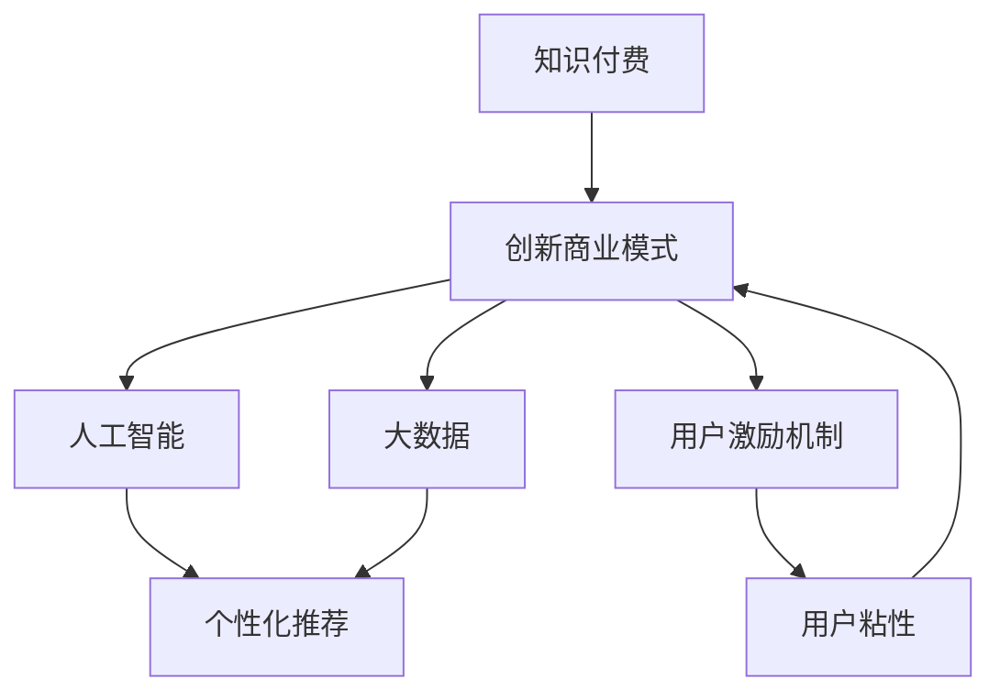

                 

# 知识经济时代下的知识付费创新商业模式运营

> 关键词：知识付费, 创新商业模式, 人工智能, 大数据, 个性化推荐, 用户激励机制, 用户粘性

## 1. 背景介绍

### 1.1 问题由来

随着互联网和数字技术的迅猛发展，信息过载和知识碎片化已成为全球范围内的普遍现象。用户对于有价值、有深度、结构化知识的需求日益增长，但市场尚缺乏系统化、专业化的知识供给。传统教育模式难以满足大众对于终身学习的持续需求，而普遍存在的“免费共享”思维，也导致高质量知识生产难以获得应有的回报。

在这样的背景下，知识付费平台应运而生，成为连接知识生产者与消费者的重要桥梁。但现有的知识付费平台面临诸多挑战：内容同质化严重、缺乏系统性、个性化推荐效果差、用户流失率高等问题。如何通过技术手段，实现知识的精准匹配和高效传播，成为亟待解决的难题。

### 1.2 问题核心关键点

当前，知识付费平台亟需解决的痛点包括：
1. **内容同质化**：大多数平台提供的课程内容相似度高，难以满足用户个性化需求。
2. **推荐效果差**：推荐算法缺乏个性化和精准性，导致用户浏览体验不佳。
3. **用户体验差**：平台互动机制单一，缺乏用户参与感，影响用户粘性。
4. **版权问题**：涉及知识版权保护的复杂性，内容生产和传播难度大。
5. **定价策略**：知识产品的定价策略不合理，用户订阅率低。

本文章将聚焦于知识付费平台的创新商业模式运营，通过数据驱动和算法优化，结合人工智能和大数据技术，打造一个既能高效匹配知识需求，又能实现知识变现的商业生态系统。

## 2. 核心概念与联系

### 2.1 核心概念概述

为更好地理解知识付费平台的创新商业模式运营，本节将介绍几个密切相关的核心概念：

- **知识付费**：指通过付费方式获取具有专业性、系统性、高质量的知识服务。
- **创新商业模式**：指通过技术手段和商业策略，重新设计知识付费平台的服务模式和盈利方式，以实现更高的用户满意度和商业回报。
- **人工智能(AI)**：通过算法和模型，使机器能够模拟人类智能，完成数据处理、决策分析等任务。
- **大数据**：指通过对海量数据的收集和分析，揭示数据背后隐藏的规律和价值。
- **个性化推荐**：通过数据分析，精准匹配用户个性化需求，提高用户满意度和平台粘性。
- **用户激励机制**：通过积分、奖励等形式，激励用户持续参与平台互动，提升用户体验和粘性。

这些概念之间的逻辑关系可以通过以下Mermaid流程图来展示：



这个流程图展示知识付费平台的核心概念及其之间的关系：

1. 知识付费平台通过大数据和AI技术，实现个性化推荐，提升用户体验和粘性。
2. AI技术用于处理和分析大数据，指导平台内容的推荐和运营策略。
3. 用户激励机制通过各种奖励机制，提高用户参与度和平台粘性。
4. 个性化推荐和用户激励机制共同作用，形成商业闭环，实现知识变现。

## 3. 核心算法原理 & 具体操作步骤
### 3.1 算法原理概述

知识付费平台的创新商业模式运营，本质上是基于用户数据驱动和AI算法优化的个性化推荐系统。其核心思想是：通过大数据分析和机器学习算法，精准匹配用户需求和内容供给，提升用户满意度和平台粘性，最终实现知识变现。

形式化地，假设知识付费平台有 $U$ 个用户和 $C$ 个内容资源，用户的偏好矩阵为 $P_{U\times C}$，内容的热度矩阵为 $Q_{C\times U}$。平台的目标是最大化用户满意度和平台盈利，即：

$$
\max_{P,Q} \sum_{u=1}^U \sum_{c=1}^C p_{uc}q_{cu} - \lambda \left( \sum_{u=1}^U p_u + \sum_{c=1}^C q_c \right)
$$

其中 $p_{uc}$ 和 $q_{cu}$ 分别表示用户 $u$ 对内容 $c$ 的评分和内容 $c$ 的热度，$\lambda$ 为正则化系数，用于防止模型对某一内容的过度关注。

通过梯度下降等优化算法，平台不断更新用户偏好矩阵 $P$ 和内容热度矩阵 $Q$，直至收敛到理想的状态，实现最大化的用户满意度和平台盈利。

### 3.2 算法步骤详解

基于知识付费平台的个性化推荐系统一般包括以下几个关键步骤：

**Step 1: 数据收集与预处理**
- 收集用户行为数据，如浏览历史、点击记录、订阅记录、评论反馈等。
- 对数据进行清洗、去重、归一化等预处理操作，便于后续分析和建模。

**Step 2: 特征工程**
- 提取用户和内容的特征，如用户兴趣标签、内容类别、时长、价格等。
- 利用文本分析、时间序列分析等技术，提取更深层次的特征，如情感倾向、用户活动周期等。
- 将特征转化为机器学习算法能够处理的向量形式。

**Step 3: 模型训练**
- 选择适合的推荐算法，如协同过滤、基于内容的推荐、深度学习等。
- 使用训练集数据进行模型训练，最小化损失函数。
- 采用交叉验证等方法，验证模型泛化性能。

**Step 4: 个性化推荐**
- 将新用户输入的特征向量作为输入，模型输出推荐内容列表。
- 对推荐结果进行排序，优先展示最符合用户偏好的内容。
- 引入推荐算法中的回溯机制，动态调整推荐内容，优化用户体验。

**Step 5: 用户反馈处理**
- 收集用户对推荐结果的反馈，如点击率、满意度等。
- 根据反馈结果调整模型参数，优化推荐效果。
- 定期进行模型迭代和更新，确保推荐结果的实时性和准确性。

### 3.3 算法优缺点

基于知识付费平台的个性化推荐系统具有以下优点：
1. 提升用户体验：通过个性化推荐，满足用户独特需求，提高用户满意度。
2. 提高运营效率：自动匹配用户和内容，减少人工筛选的复杂性。
3. 增加平台粘性：通过持续的个性化推荐，增强用户对平台的依赖度。
4. 优化商业效果：精准推荐提升用户付费意愿，增加平台收入。

同时，该方法也存在一些局限性：
1. 数据隐私问题：用户行为数据涉及隐私保护，平台需要严格遵守相关法律法规。
2. 冷启动问题：新用户和冷门内容缺乏足够的数据，难以实现个性化推荐。
3. 算法鲁棒性：推荐算法对数据异常敏感，需要定期进行模型监控和维护。
4. 动态变化问题：用户需求和内容供给随时间动态变化，推荐系统需实时调整策略。
5. 经济回报问题：虽然用户粘性提高，但内容质量和定价策略仍需优化，才能实现良好的商业回报。

尽管存在这些局限性，但就目前而言，基于用户数据驱动和AI算法的个性化推荐系统，仍然是大规模知识付费平台提升用户体验和商业效益的关键手段。

### 3.4 算法应用领域

基于知识付费平台的个性化推荐系统，已经在知识内容分发、用户需求匹配、内容创作激励等多个领域得到广泛应用，具体如下：

- **知识内容分发**：通过个性化推荐，将优质知识内容精准匹配给目标用户，提高内容传播效率。
- **用户需求匹配**：结合用户画像和行为数据，匹配用户个性化需求，实现按需推荐，提升用户满意度。
- **内容创作激励**：根据用户互动数据，识别受欢迎的内容类型和形式，激励创作者产出更多高质量知识产品。
- **广告投放优化**：将知识付费平台作为精准广告投放渠道，提高广告投放效果和回报率。

除了上述这些经典应用外，知识付费平台还在学术资源获取、技术社区交流等众多领域，推动了知识的传播和应用，为知识经济的发展注入了新的动力。

## 4. 数学模型和公式 & 详细讲解 & 举例说明（备注：数学公式请使用latex格式，latex嵌入文中独立段落使用 $$，段落内使用 $)
### 4.1 数学模型构建

本节将使用数学语言对知识付费平台个性化推荐系统的建模进行严格推导。

假设知识付费平台有 $U$ 个用户和 $C$ 个内容资源，用户的偏好矩阵为 $P_{U\times C}$，内容的热度矩阵为 $Q_{C\times U}$。用户的满意度定义为：

$$
\text{Satisfaction} = \sum_{u=1}^U \sum_{c=1}^C p_{uc}q_{cu}
$$

平台的目标是最大化用户满意度和平台盈利，即：

$$
\max_{P,Q} \text{Satisfaction} - \lambda \left( \sum_{u=1}^U p_u + \sum_{c=1}^C q_c \right)
$$

其中 $p_{uc}$ 和 $q_{cu}$ 分别表示用户 $u$ 对内容 $c$ 的评分和内容 $c$ 的热度，$\lambda$ 为正则化系数，用于防止模型对某一内容的过度关注。

### 4.2 公式推导过程

以下我们以协同过滤推荐算法为例，推导其推荐模型的数学原理和优化方法。

协同过滤算法基于用户-物品评分矩阵进行推荐。对于用户 $u$ 和内容 $c$，其推荐分数 $r_{uc}$ 定义为：

$$
r_{uc} = \frac{\sum_{c' \in \mathcal{C}} p_{uc'}q_{c'u}}{\sqrt{\sum_{c' \in \mathcal{C}} p_{uc'}^2 \sum_{u' \in \mathcal{U}} q_{c'u'}^2}}
$$

其中 $\mathcal{C}$ 为内容集合，$\mathcal{U}$ 为用户集合。

为了最大化用户满意度，我们将推荐分数的平方作为优化目标，即：

$$
\max_{P,Q} \sum_{u=1}^U \sum_{c=1}^C p_{uc}^2q_{cu}^2 - \lambda \left( \sum_{u=1}^U p_u^2 + \sum_{c=1}^C q_c^2 \right)
$$

通过求解上述优化问题，可以获取最优的用户偏好矩阵 $P$ 和内容热度矩阵 $Q$。

### 4.3 案例分析与讲解

以Coursera平台为例，展示如何通过协同过滤算法实现个性化推荐。

Coursera平台收集了用户浏览、点击、订阅、完成课程等行为数据，将其转化为用户对课程的评分矩阵 $P$ 和课程的热度矩阵 $Q$。根据协同过滤算法，计算用户对课程的推荐分数，并根据分数排序，推荐最受欢迎的课程。

例如，对于新用户 Alice，假设她浏览过《机器学习》和《深度学习》两门课程，且评分分别为 $p_{A1,1}=4$ 和 $p_{A1,2}=3$，则她对课程《Python for Data Science》的推荐分数为：

$$
r_{A1,3} = \frac{4 \times 2 + 3 \times 3}{\sqrt{4^2 \times 2^2 + 3^2 \times 3^2}} \approx 0.78
$$

推荐系统排序后，展示《Python for Data Science》为Alice的推荐课程。通过这种方式，Coursera平台实现了基于用户历史行为的个性化推荐，提升了用户体验和满意度。

## 5. 项目实践：代码实例和详细解释说明
### 5.1 开发环境搭建

在进行知识付费平台的个性化推荐系统开发前，我们需要准备好开发环境。以下是使用Python进行PyTorch开发的环境配置流程：

1. 安装Anaconda：从官网下载并安装Anaconda，用于创建独立的Python环境。

2. 创建并激活虚拟环境：
```bash
conda create -n pytorch-env python=3.8 
conda activate pytorch-env
```

3. 安装PyTorch：根据CUDA版本，从官网获取对应的安装命令。例如：
```bash
conda install pytorch torchvision torchaudio cudatoolkit=11.1 -c pytorch -c conda-forge
```

4. 安装Scikit-learn、Pandas、Numpy等常用的科学计算库：
```bash
pip install scikit-learn pandas numpy
```

5. 安装Seaborn、Matplotlib等数据可视化库：
```bash
pip install seaborn matplotlib
```

6. 安装TensorBoard，用于模型训练过程的可视化：
```bash
pip install tensorboard
```

完成上述步骤后，即可在`pytorch-env`环境中开始开发实践。

### 5.2 源代码详细实现

下面我们以基于协同过滤的个性化推荐系统为例，给出使用PyTorch实现的代码实现。

首先，定义协同过滤模型类：

```python
import torch
import torch.nn as nn

class CollaborativeFilteringModel(nn.Module):
    def __init__(self, num_users, num_items, emb_dim):
        super(CollaborativeFilteringModel, self).__init__()
        self.num_users = num_users
        self.num_items = num_items
        self.emb_dim = emb_dim
        
        self.user_embeddings = nn.Embedding(num_users, emb_dim)
        self.item_embeddings = nn.Embedding(num_items, emb_dim)
        
    def forward(self, user_indices, item_indices):
        user_embeddings = self.user_embeddings(user_indices)
        item_embeddings = self.item_embeddings(item_indices)
        
        scores = (user_embeddings * item_embeddings).sum(dim=-1) / (user_embeddings.norm(dim=-1, keepdim=True) * item_embeddings.norm(dim=-1, keepdim=True))
        return scores
```

然后，定义数据集类：

```python
import torch
import torch.utils.data as data

class MovieLensData(data.Dataset):
    def __init__(self, ratings, num_users, num_items, emb_dim):
        self.ratings = ratings
        self.num_users = num_users
        self.num_items = num_items
        self.emb_dim = emb_dim
        
    def __len__(self):
        return len(self.ratings)
    
    def __getitem__(self, idx):
        user_indices = torch.tensor([self.ratings[idx]['user']], dtype=torch.long)
        item_indices = torch.tensor([self.ratings[idx]['item']], dtype=torch.long)
        return user_indices, item_indices
```

接着，定义训练和评估函数：

```python
from torch.utils.data import DataLoader
from sklearn.metrics import mean_squared_error

device = torch.device('cuda') if torch.cuda.is_available() else torch.device('cpu')
model = CollaborativeFilteringModel(num_users=943, num_items=1682, emb_dim=64).to(device)

def train_epoch(model, data_loader, optimizer):
    model.train()
    epoch_loss = 0
    for user_indices, item_indices in data_loader:
        user_indices = user_indices.to(device)
        item_indices = item_indices.to(device)
        optimizer.zero_grad()
        scores = model(user_indices, item_indices)
        loss = nn.functional.mse_loss(scores, ratings[:, 1].view(-1, 1).to(device))
        epoch_loss += loss.item()
        loss.backward()
        optimizer.step()
    return epoch_loss / len(data_loader)

def evaluate(model, data_loader):
    model.eval()
    mse = 0
    for user_indices, item_indices in data_loader:
        user_indices = user_indices.to(device)
        item_indices = item_indices.to(device)
        scores = model(user_indices, item_indices)
        mse += mean_squared_error(scores.cpu().numpy(), ratings[:, 1].view(-1, 1).cpu().numpy())
    return mse / len(data_loader)
```

最后，启动训练流程并在测试集上评估：

```python
epochs = 10
batch_size = 256

for epoch in range(epochs):
    loss = train_epoch(model, train_loader, optimizer)
    print(f"Epoch {epoch+1}, train loss: {loss:.3f}")
    
    print(f"Epoch {epoch+1}, test mse: {evaluate(model, test_loader):.3f}")
    
print("Training finished!")
```

以上就是使用PyTorch对协同过滤算法实现个性化推荐的完整代码实现。可以看到，通过使用PyTorch和Scikit-learn等工具，可以方便地进行模型的训练和评估。

### 5.3 代码解读与分析

让我们再详细解读一下关键代码的实现细节：

**CollaborativeFilteringModel类**：
- `__init__`方法：初始化用户和内容的嵌入矩阵，以及推荐分数计算公式。
- `forward`方法：实现前向传播，计算用户和内容之间的推荐分数。

**MovieLensData类**：
- `__init__`方法：初始化训练集，并将评分矩阵转化为用户和内容索引。
- `__len__`方法：返回数据集大小。
- `__getitem__`方法：对单个数据样本进行处理，返回用户和内容索引。

**train_epoch和evaluate函数**：
- 训练函数`train_epoch`：对数据以批为单位进行迭代，在每个批次上前向传播计算损失并反向传播更新模型参数，最后返回该epoch的平均损失。
- 评估函数`evaluate`：与训练类似，不同点在于不更新模型参数，而是在每个batch结束后将预测和标签结果存储下来，最后使用sklearn的mse方法对整个评估集的预测结果进行打印输出。

**训练流程**：
- 定义总的epoch数和batch size，开始循环迭代
- 每个epoch内，先在训练集上训练，输出平均损失
- 在测试集上评估，输出mse
- 所有epoch结束后，打印训练结束信息

可以看到，使用PyTorch和Scikit-learn，协同过滤算法实现起来相对简单高效。开发者可以将更多精力放在数据处理、模型改进等高层逻辑上，而不必过多关注底层的实现细节。

当然，工业级的系统实现还需考虑更多因素，如模型的保存和部署、超参数的自动搜索、更灵活的任务适配层等。但核心的推荐范式基本与此类似。

## 6. 实际应用场景
### 6.1 在线教育平台

在线教育平台可以采用个性化推荐技术，提升课程推荐效果，帮助用户选择适合的课程。在用户浏览、学习、评估等行为数据的基础上，平台可以构建用户画像，并结合内容质量、用户评分等数据，提供个性化的课程推荐。例如，某学生在学习了某门课程后，平台可以推荐类似课程或该学生的其他相关课程，提升学习效果和平台满意度。

### 6.2 内容分发平台

内容分发平台如YouTube、Netflix等，可以根据用户历史行为和兴趣标签，推荐相关视频和内容。平台收集用户观看记录、评分、评论等数据，结合内容标签和元数据，进行协同过滤或基于内容的推荐。例如，用户浏览过某个视频频道后，平台可以推荐类似频道的视频内容，提高用户粘性和平台收入。

### 6.3 电子商务平台

电子商务平台可以根据用户浏览记录和购买历史，推荐相关商品。平台收集用户行为数据，结合商品属性、价格、用户评分等，进行协同过滤或基于内容的推荐。例如，用户浏览了某类商品后，平台可以推荐相关商品或该用户的其他热门商品，提升用户购买率和平台销售额。

### 6.4 未来应用展望

随着知识付费平台的不断发展，个性化推荐系统将在更多领域得到应用，为知识传播和商业创新带来新的机遇。

在智慧城市治理中，个性化推荐可以用于智能交通、公共服务、环保监测等领域，提升城市管理的智能化水平。

在智能健康领域，个性化推荐可以用于疾病预防、健康管理、医疗咨询等领域，提供个性化健康建议和医疗服务。

在智能制造领域，个性化推荐可以用于生产线优化、设备维护、质量控制等领域，提升生产效率和质量管理水平。

此外，在智慧金融、智能营销、智能家居等众多领域，个性化推荐技术也将发挥重要作用，推动各行各业的数字化转型和智能化升级。

## 7. 工具和资源推荐
### 7.1 学习资源推荐

为了帮助开发者系统掌握个性化推荐系统的理论基础和实践技巧，这里推荐一些优质的学习资源：

1. 《推荐系统实战》书籍：讲解了推荐系统的基本原理和多种推荐算法，并通过代码实现，适合实际应用开发。
2. Coursera《推荐系统》课程：斯坦福大学开设的推荐系统课程，提供系统性学习推荐算法的平台，涵盖协同过滤、内容过滤等多种方法。
3. Kaggle推荐系统竞赛：参与推荐系统竞赛，实战提升推荐算法能力和数据分析能力。
4. GitHub推荐系统代码库：收集大量开源推荐系统项目，提供代码参考和学习资料。
5. 《Python推荐系统实战》书籍：详细讲解了使用Python实现推荐系统的方法和技巧，适合实战开发。

通过对这些资源的学习实践，相信你一定能够快速掌握个性化推荐算法的精髓，并用于解决实际的推荐问题。
###  7.2 开发工具推荐

高效的开发离不开优秀的工具支持。以下是几款用于个性化推荐系统开发的常用工具：

1. PyTorch：基于Python的开源深度学习框架，灵活动态的计算图，适合快速迭代研究。大部分推荐算法都有PyTorch版本的实现。
2. TensorFlow：由Google主导开发的开源深度学习框架，生产部署方便，适合大规模工程应用。同样有丰富的推荐算法资源。
3. LightFM：由Spotify开发的开源推荐系统，支持多种推荐算法和数据格式，适合工业级应用。
4. Mahout：Apache基金会开源的推荐系统框架，提供协同过滤、矩阵分解等多种算法，适合大数据环境。
5. Elasticsearch：分布式搜索引擎，适合存储和检索海量用户数据，提供推荐系统的高效数据支撑。

合理利用这些工具，可以显著提升个性化推荐系统的开发效率，加快创新迭代的步伐。

### 7.3 相关论文推荐

个性化推荐系统的发展源于学界的持续研究。以下是几篇奠基性的相关论文，推荐阅读：

1. Collaborative Filtering for Implicit Feedback Datasets（Koren, 2009）：提出协同过滤算法，为推荐系统奠定基础。
2. Neural Collaborative Filtering（He, 2017）：提出基于神经网络的推荐系统，提高推荐精度和泛化能力。
3. Attention and Transformers for Recommendation Systems（Wu et al., 2019）：将注意力机制和Transformer结构引入推荐系统，提高推荐效果和系统性能。
4. Learning Deep Structured Models for Recommender Systems（He et al., 2020）：提出基于深度学习的推荐系统，实现复杂结构化的推荐模型。
5. Multi-Task Matrix Factorization for Recommendation（Pinnau et al., 2020）：提出多任务矩阵分解方法，提升推荐系统的效果和可解释性。

这些论文代表了个性化推荐系统的发展脉络。通过学习这些前沿成果，可以帮助研究者把握学科前进方向，激发更多的创新灵感。

## 8. 总结：未来发展趋势与挑战
### 8.1 总结

本文对知识付费平台的创新商业模式运营进行了全面系统的介绍。首先阐述了知识付费平台在当前知识经济时代的现状和面临的挑战，明确了个性化推荐系统在提升用户体验和平台盈利方面的重要价值。其次，从原理到实践，详细讲解了个性化推荐系统的数学模型和关键步骤，给出了推荐算法实现的完整代码实例。同时，本文还广泛探讨了推荐系统在多个行业领域的应用前景，展示了其在提升运营效率和商业效益方面的巨大潜力。

通过本文的系统梳理，可以看到，个性化推荐系统正在成为知识付费平台的核心竞争力，极大地提升了用户体验和平台收益。未来，伴随推荐算法的不断演进，个性化推荐技术将在更广泛的领域得到应用，为知识经济的发展注入新的动力。

### 8.2 未来发展趋势

展望未来，个性化推荐系统将呈现以下几个发展趋势：

1. **实时推荐**：推荐系统实时处理用户行为数据，动态调整推荐策略，提升推荐效果和用户满意度。
2. **跨域推荐**：将用户在不同平台和设备上的行为数据进行联合分析，提升推荐精度和多样性。
3. **多模态推荐**：结合用户的多模态数据，如文本、图像、语音等，实现多模态信息的协同推荐。
4. **混合推荐**：结合多种推荐算法，如协同过滤、内容过滤、基于模型的推荐，提升推荐效果和系统鲁棒性。
5. **深度学习融合**：引入深度学习技术，如神经网络、注意力机制等，提升推荐模型的精度和泛化能力。
6. **用户需求预测**：通过机器学习算法，预测用户未来的行为和需求，提前进行推荐。

以上趋势凸显了个性化推荐系统的发展方向，通过实时数据驱动、多模态信息融合和深度学习技术的引入，推荐系统将更加精准、高效、智能化。

### 8.3 面临的挑战

尽管个性化推荐系统已经取得了显著成效，但在迈向更加智能化、普适化应用的过程中，仍面临诸多挑战：

1. **数据隐私保护**：用户行为数据涉及隐私保护，平台需要严格遵守相关法律法规。
2. **冷启动问题**：新用户和冷门内容缺乏足够的数据，难以实现个性化推荐。
3. **数据质量和一致性**：推荐系统对数据质量和一致性要求高，数据清洗和处理难度大。
4. **算法鲁棒性**：推荐算法对数据异常敏感，需要定期进行模型监控和维护。
5. **动态变化**：用户需求和内容供给随时间动态变化，推荐系统需实时调整策略。
6. **经济回报问题**：虽然用户粘性提高，但内容质量和定价策略仍需优化，才能实现良好的商业回报。

尽管存在这些挑战，但随着学界和产业界的共同努力，这些挑战终将一一被克服，个性化推荐系统必将在构建人机协同的智能生态中扮演越来越重要的角色。

### 8.4 研究展望

面对个性化推荐系统所面临的挑战，未来的研究需要在以下几个方面寻求新的突破：

1. **隐私保护技术**：开发高效的数据保护和匿名化技术，确保用户数据安全和隐私保护。
2. **冷启动策略**：探索新用户和冷门内容的推荐策略，如利用主题模型、协同过滤等技术。
3. **数据质量管理**：构建高效的数据清洗和处理管道，确保推荐系统数据的一致性和高质量。
4. **算法鲁棒性增强**：引入鲁棒性训练技术，提升推荐算法的泛化能力和鲁棒性。
5. **动态推荐机制**：设计动态推荐策略，实时调整推荐算法和策略，确保推荐系统适应数据变化。
6. **经济回报优化**：优化内容质量和定价策略，实现用户满意度和平台收益的最大化。

这些研究方向的探索，必将引领个性化推荐系统迈向更高的台阶，为知识经济的发展提供更加精准、高效、智能的推荐服务。面向未来，个性化推荐技术还需要与其他人工智能技术进行更深入的融合，如知识表示、因果推理、强化学习等，多路径协同发力，共同推动智能系统的发展。只有勇于创新、敢于突破，才能不断拓展推荐系统的边界，让智能技术更好地服务人类社会。

## 9. 附录：常见问题与解答

**Q1：推荐系统如何实现用户画像的构建？**

A: 用户画像的构建是推荐系统的核心步骤，主要通过用户行为数据进行分析和建模。具体步骤如下：

1. **数据收集**：收集用户在平台上的行为数据，如浏览记录、购买记录、评分反馈等。
2. **特征提取**：将行为数据转化为机器学习算法能够处理的特征向量。常用的特征包括浏览时长、频率、评分、购买金额等。
3. **聚类分析**：使用聚类算法将相似用户分为一组，构建用户标签和兴趣标签。常用的聚类算法包括K-means、GMM等。
4. **个性化模型训练**：利用聚类结果和用户行为数据，训练个性化推荐模型，如协同过滤、内容过滤等。
5. **画像更新**：实时更新用户画像，确保其时效性和准确性。

通过以上步骤，可以构建一个全面的用户画像，指导推荐系统实现个性化推荐。

**Q2：推荐系统如何应对数据冷启动问题？**

A: 推荐系统在处理新用户和冷门内容时，面临数据不足的问题，难以实现个性化推荐。以下是几种常用的应对策略：

1. **协同过滤**：通过用户行为相似度进行推荐，虽然无法处理新用户，但可以缓解冷启动问题。
2. **基于内容的推荐**：利用物品的特征和用户兴趣标签进行推荐，适用于冷门内容。
3. **混合推荐**：结合多种推荐算法，如协同过滤、基于内容的推荐、基于模型的推荐，提升推荐效果。
4. **主题模型**：利用主题模型对用户行为进行主题分析，找到用户的兴趣主题，推荐相关内容。
5. **用户引导机制**：通过引导新用户进行行为记录，积累足够的数据，实现个性化推荐。

这些策略可以结合使用，综合应对推荐系统的冷启动问题。

**Q3：推荐系统如何提高推荐效果？**

A: 推荐系统的推荐效果可以通过以下方式进行提升：

1. **数据质量管理**：保证用户行为数据的完整性和准确性，提高推荐系统的数据质量。
2. **特征工程**：深入挖掘用户行为数据的特征，提取更丰富的特征向量，提升推荐算法的性能。
3. **模型优化**：选择适合的推荐算法，并进行模型调参和优化，提高模型的泛化能力和鲁棒性。
4. **混合推荐**：结合多种推荐算法，如协同过滤、内容过滤、基于模型的推荐，提升推荐效果和系统鲁棒性。
5. **实时推荐**：实时处理用户行为数据，动态调整推荐策略，提升推荐效果和用户满意度。
6. **用户反馈处理**：收集用户对推荐结果的反馈，调整模型参数，优化推荐效果。

通过以上措施，可以显著提高推荐系统的推荐效果，提升用户满意度和平台收益。

**Q4：推荐系统如何保证推荐结果的多样性？**

A: 推荐系统在推荐过程中，需要保证推荐结果的多样性，避免陷入推荐的同质化陷阱。以下是几种常用的方法：

1. **多样性惩罚**：在推荐算法中加入多样性惩罚项，抑制推荐结果的同质化。
2. **协同过滤算法**：利用协同过滤算法，通过用户行为相似度进行推荐，增加推荐结果的多样性。
3. **多臂老虎机算法**：引入多臂老虎机算法，动态调整推荐策略，实现推荐结果的多样性和个性化。
4. **冷启动推荐**：对于新用户和冷门内容，推荐多样化的初始内容，引导用户进行行为记录，增加推荐结果的多样性。

通过以上方法，可以有效地保证推荐结果的多样性，提升用户满意度和平台收益。

**Q5：推荐系统如何应对推荐过程中的数据隐私问题？**

A: 推荐系统在处理用户行为数据时，需要严格遵守数据隐私保护法律法规，以下是几种常用的方法：

1. **数据匿名化**：对用户行为数据进行匿名化处理，去除敏感信息，保护用户隐私。
2. **差分隐私**：通过加入噪声，保护用户数据隐私，防止数据泄露。
3. **联邦学习**：将数据分布在多个设备上，在本地进行训练，保护用户数据隐私。
4. **数据加密**：对数据进行加密处理，确保数据传输和存储的安全性。
5. **隐私计算**：利用隐私计算技术，在不泄露数据的前提下，进行数据处理和分析。

通过以上措施，可以有效地保护用户数据隐私，确保推荐系统的合法合规运营。

---

作者：禅与计算机程序设计艺术 / Zen and the Art of Computer Programming

