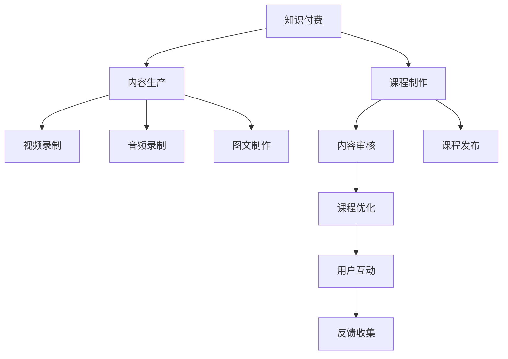

                 

# 知识经济时代下的知识付费创新课程制作与内容生产

> 关键词：知识付费,课程制作,内容生产,创新模式,人工智能,智能推荐,大数据分析,教育技术

## 1. 背景介绍

随着互联网和移动互联网的迅猛发展，人类社会已经步入了知识经济时代。在这个时代，知识和信息成为了驱动经济增长和社会进步的重要引擎。人们不再满足于通过传统的线性学习方式获取知识，而是更加倾向于通过在线课程、订阅服务、问答社区等多种形式，快速获取和掌握所需的知识和技能。知识付费应运而生，成为知识经济时代的重要现象。

知识付费的兴起，为教育机构和内容创作者提供了新的商业机会。一方面，知识付费为内容创作者带来了可观的收入，极大地激发了他们的创作热情；另一方面，也为学习者提供了更加丰富和便捷的学习资源，满足了他们在不同时间、地点和方式下的学习需求。

然而，知识付费市场的竞争也日趋激烈。随着各类在线教育平台和内容创作者的不断涌现，如何创新课程内容和生产方式，提升内容质量和用户黏性，成为当前知识付费领域亟待解决的课题。本文将聚焦于知识付费领域的课程制作与内容生产，探讨通过人工智能、大数据等技术手段，实现创新的知识付费产品和服务，推动知识经济的发展。

## 2. 核心概念与联系

### 2.1 核心概念概述

为更好地理解知识付费领域的课程制作与内容生产，本节将介绍几个关键概念：

- **知识付费**：指以知识和技术为核心内容，通过在线课程、订阅服务、问答社区等多种形式，向用户提供有偿知识服务。
- **课程制作**：指设计、录制、编辑和管理在线课程的过程，包括课程内容策划、讲师选择、教学工具选择和课程发布等环节。
- **内容生产**：指创作和生成各类在线教育内容，包括视频、音频、图文等形式的课程资源。
- **人工智能(AI)**：以模拟人类智能为目标，通过算法、模型和计算实现问题求解、知识推理等智能功能的技术。
- **大数据分析**：通过对大规模数据进行收集、存储、处理和分析，揭示数据背后的规律和趋势，辅助决策和优化。
- **教育技术**：利用信息技术手段，改善教育过程和学习体验的技术，如在线学习平台、智能推荐系统等。

这些概念之间的逻辑关系可以通过以下Mermaid流程图来展示：



这个流程图展示出知识付费的各个关键环节及其相互关系：

1. 课程制作和内容生产是知识付费的核心，通过设计和创作优质的课程内容吸引用户。
2. 视频、音频、图文等不同形式的内容生产，满足了用户多样化的学习需求。
3. 内容审核和课程发布，确保课程内容的质量和合规性。
4. 课程优化和用户互动，通过数据分析和反馈收集，提升用户学习体验和满意度。
5. 最终形成完整的内容生产流程，为知识付费平台提供丰富多样的教育资源。

## 3. 核心算法原理 & 具体操作步骤
### 3.1 算法原理概述

知识付费领域的课程制作与内容生产，本质上是一个以数据为驱动的智能内容优化过程。其核心思想是通过人工智能和大数据分析技术，对用户的学习行为、偏好和反馈进行深入分析，从而指导课程内容的设计和优化，提升课程的吸引力和用户黏性。

具体而言，可以采用以下步骤：

1. **用户画像分析**：基于用户注册、登录、浏览、学习等行为数据，通过聚类和分类等算法，构建用户画像，了解不同用户的需求和偏好。
2. **课程推荐算法**：结合用户画像和课程属性，设计推荐算法，智能匹配用户和课程，提升课程曝光率和用户点击率。
3. **内容分析与优化**：利用自然语言处理(NLP)和机器学习等技术，对课程内容进行分析和优化，确保内容质量高、易理解。
4. **用户互动分析**：通过分析用户的互动行为（如评论、点赞、分享等），发现课程中的热点和难点，进行有针对性的优化和调整。

### 3.2 算法步骤详解

#### 3.2.1 用户画像分析

用户画像分析是知识付费课程制作与内容生产的基础。通过收集和分析用户的行为数据，构建精准的用户画像，可以帮助内容创作者更好地理解目标用户群体，设计出更符合用户需求的课程内容。

具体的分析步骤包括：

1. **数据收集**：从课程平台中收集用户的注册、登录、浏览、购买、学习等行为数据，如用户ID、学习时间、观看时长、答题情况等。
2. **特征提取**：提取用户行为数据中的关键特征，如学习频率、课程偏好、答题正确率等。
3. **用户分群**：采用聚类算法（如K-means、层次聚类等）将用户分为不同的群体，每个群体代表一个特定的用户画像。
4. **画像描述**：为每个用户画像描述其基本特征和行为模式，如年龄、职业、学习偏好、学科兴趣等。

#### 3.2.2 课程推荐算法

课程推荐算法是知识付费平台的核心竞争力之一。通过智能匹配用户和课程，可以显著提升课程曝光率和用户点击率，增加平台收益。

具体的推荐算法包括：

1. **协同过滤算法**：基于用户行为数据（如浏览历史、购买记录等）和课程属性（如学科、难度、时长等），通过用户和课程的协同矩阵，计算用户对课程的评分和推荐。
2. **内容推荐算法**：通过分析课程内容（如视频、音频、图文等）的特征，结合用户画像，推荐与用户兴趣相关的课程内容。
3. **混合推荐算法**：将协同过滤和内容推荐算法进行组合，综合考虑用户行为数据和课程内容特征，提升推荐精度。

#### 3.2.3 内容分析与优化

内容分析与优化是提升课程质量的关键步骤。通过自然语言处理和机器学习技术，对课程内容进行分析和优化，可以确保课程内容的质量和可理解性。

具体的分析与优化步骤包括：

1. **文本分析**：利用NLP技术，对课程视频和音频的字幕、讲稿进行文本分析和情感分析，评估课程内容的语义质量和情感倾向。
2. **自动优化**：通过机器学习算法，自动生成课程内容的补充资料和习题，提升用户学习体验。
3. **用户反馈分析**：收集用户对课程内容的评价和反馈，利用文本分析和情感分析技术，发现课程中的热点和难点，进行有针对性的优化和调整。

#### 3.2.4 用户互动分析

用户互动分析是课程制作与内容生产的最后环节。通过分析用户的互动行为，发现课程中的热点和难点，进行有针对性的优化和调整。

具体的分析步骤包括：

1. **互动数据收集**：收集用户在课程平台上的互动数据，如评论、点赞、分享、提问等。
2. **情感分析**：利用NLP技术，对用户评论和反馈进行情感分析，评估用户对课程内容的满意度和建议。
3. **热点发现**：通过文本分析和情感分析技术，发现课程中的热点和难点，进行有针对性的优化和调整。

### 3.3 算法优缺点

知识付费领域的课程制作与内容生产，通过人工智能和大数据分析技术，可以实现智能化的课程推荐和内容优化，具有以下优点：

1. **个性化推荐**：根据用户画像和课程属性，智能匹配用户和课程，提升课程曝光率和用户点击率。
2. **高效内容优化**：利用NLP和机器学习技术，对课程内容进行分析和优化，确保内容质量高、易理解。
3. **用户互动分析**：通过分析用户的互动行为，发现课程中的热点和难点，进行有针对性的优化和调整。

同时，这些技术也存在一些局限性：

1. **数据隐私问题**：用户行为数据的收集和使用，可能涉及到用户隐私保护问题，需要遵守相关法律法规。
2. **算法复杂度高**：课程推荐和内容优化算法涉及复杂的机器学习和NLP技术，实现和维护成本较高。
3. **依赖数据质量**：课程推荐和内容优化依赖于高质量的数据，数据的准确性和完整性对算法效果有重要影响。

### 3.4 算法应用领域

基于人工智能和大数据分析技术的课程制作与内容生产，在知识付费领域具有广泛的应用前景，主要包括以下几个方面：

1. **在线教育平台**：各大在线教育平台可以通过智能推荐和内容优化，提升课程质量和用户黏性，增加平台收益。
2. **企业内训系统**：企业可以利用课程推荐和内容优化技术，设计符合员工需求和职业发展的培训课程，提升培训效果和员工满意度。
3. **个人学习社区**：个人学习社区可以通过课程推荐和内容优化技术，为学习者提供更加个性化和便捷的学习资源，提升学习体验。

此外，这些技术还可以应用于学术研究、知识管理等领域，推动各类知识资源的高效整合和智能应用。

## 4. 数学模型和公式 & 详细讲解  
### 4.1 数学模型构建

本节将使用数学语言对知识付费领域的课程推荐算法进行更加严格的刻画。

记用户集合为 $U=\{u_1, u_2, ..., u_n\}$，课程集合为 $C=\{c_1, c_2, ..., c_m\}$，用户与课程之间的行为矩阵为 $B_{nm} \in \{0, 1\}$，其中 $B_{ui} = 1$ 表示用户 $u$ 浏览了课程 $c$。

定义用户画像向量 $\mathbf{u}_i \in \mathbb{R}^d$，其中 $d$ 为特征维度，每个特征维度代表一种用户行为特征。定义课程属性向量 $\mathbf{c}_j \in \mathbb{R}^d$，其中 $d$ 为特征维度，每个特征维度代表一种课程属性特征。

课程推荐的目标是最小化用户-课程评分误差，即：

$$
\mathop{\arg\min}_{\theta} \frac{1}{|U|} \sum_{u \in U} \sum_{c \in C} (B_{ui} - \mathbf{u}_i^T \mathbf{c}_j)_{+}^2
$$

其中 $\theta$ 为推荐算法模型参数，$(x)_{+} = \max(0, x)$ 表示ReLU函数，用于控制用户和课程评分误差。

在实际应用中，通常采用矩阵分解、协同过滤、内容推荐等算法，结合用户画像和课程属性，计算用户对课程的评分和推荐。

### 4.2 公式推导过程

以下我们以协同过滤算法为例，推导推荐算法中的评分预测公式。

协同过滤算法的核心思想是通过用户和课程之间的行为矩阵 $B$，计算用户对课程的评分预测值 $\hat{B}_{ui}$，公式如下：

$$
\hat{B}_{ui} = \sum_{j=1}^{d} \mathbf{u}_i^T \mathbf{c}_j \mathbf{c}_j^T \mathbf{u}_i
$$

其中 $\mathbf{u}_i$ 和 $\mathbf{c}_j$ 分别为用户 $i$ 和课程 $j$ 的特征向量，$d$ 为特征维度。

将 $\hat{B}_{ui}$ 映射到 $[0,1]$ 区间，可以得到用户 $i$ 对课程 $j$ 的评分预测值 $\hat{r}_{ij}$：

$$
\hat{r}_{ij} = \frac{\hat{B}_{ui}}{\sigma(\hat{B}_{ui})}
$$

其中 $\sigma(x) = \frac{1}{1+\exp(-x)}$ 为sigmoid函数，用于将评分预测值映射到 $[0,1]$ 区间。

在得到评分预测值后，可以将其与实际评分进行对比，计算评分误差，进而更新模型参数 $\theta$。具体的评分误差公式为：

$$
\mathcal{L}(\theta) = \frac{1}{|U|} \sum_{u \in U} \sum_{c \in C} (B_{ui} - \hat{r}_{ij})^2
$$

通过梯度下降等优化算法，最小化损失函数 $\mathcal{L}(\theta)$，更新模型参数，实现智能推荐。

### 4.3 案例分析与讲解

以某在线教育平台为例，说明基于协同过滤算法的课程推荐流程：

1. **数据收集**：平台收集用户注册、登录、浏览、购买、学习等行为数据，如用户ID、学习时间、观看时长、答题情况等。
2. **特征提取**：提取用户行为数据中的关键特征，如学习频率、课程偏好、答题正确率等，构建用户画像向量 $\mathbf{u}_i$。提取课程属性特征，如学科、难度、时长等，构建课程属性向量 $\mathbf{c}_j$。
3. **协同过滤**：利用协同过滤算法，计算用户对课程的评分预测值 $\hat{r}_{ij}$，排序得到推荐列表。
4. **内容推荐**：结合内容推荐算法，对推荐列表进行补充和优化，提升推荐精度。
5. **用户反馈分析**：收集用户对推荐课程的评价和反馈，利用情感分析技术，发现课程中的热点和难点，进行有针对性的优化和调整。

## 5. 项目实践：代码实例和详细解释说明
### 5.1 开发环境搭建

在进行知识付费课程制作与内容生产实践前，我们需要准备好开发环境。以下是使用Python进行PyTorch开发的环境配置流程：

1. 安装Anaconda：从官网下载并安装Anaconda，用于创建独立的Python环境。

2. 创建并激活虚拟环境：
```bash
conda create -n pytorch-env python=3.8 
conda activate pytorch-env
```

3. 安装PyTorch：根据CUDA版本，从官网获取对应的安装命令。例如：
```bash
conda install pytorch torchvision torchaudio cudatoolkit=11.1 -c pytorch -c conda-forge
```

4. 安装TensorFlow：
```bash
pip install tensorflow==2.7.0
```

5. 安装各类工具包：
```bash
pip install numpy pandas scikit-learn matplotlib tqdm jupyter notebook ipython
```

完成上述步骤后，即可在`pytorch-env`环境中开始课程制作与内容生产实践。

### 5.2 源代码详细实现

下面我们以在线教育平台为例，给出使用PyTorch进行课程推荐系统的PyTorch代码实现。

首先，定义协同过滤算法的矩阵分解模型：

```python
import torch
import torch.nn as nn
import torch.nn.functional as F

class MatrixFactorizationModel(nn.Module):
    def __init__(self, n_users, n_courses, dim=50):
        super(MatrixFactorizationModel, self).__init__()
        self.user_factors = nn.Embedding(n_users, dim)
        self.course_factors = nn.Embedding(n_courses, dim)
        self.w1 = nn.Linear(dim, 1)

    def forward(self, user_ids, course_ids):
        user_factors = self.user_factors(user_ids)
        course_factors = self.course_factors(course_ids)
        scores = torch.bmm(user_factors, course_factors.permute(1, 0)).squeeze(2)
        scores = self.w1(scores)
        return scores
```

然后，定义协同过滤算法的训练和测试函数：

```python
from torch.optim import Adam
from torch.utils.data import DataLoader
from sklearn.model_selection import train_test_split
from torch.nn import MSELoss

def train_epoch(model, optimizer, train_data, valid_data, batch_size):
    model.train()
    train_loss = 0
    valid_loss = 0
    for user_ids, course_ids, labels in train_data:
        optimizer.zero_grad()
        scores = model(user_ids, course_ids)
        loss = F.mse_loss(scores, labels)
        loss.backward()
        optimizer.step()
        train_loss += loss.item()
    model.eval()
    with torch.no_grad():
        for user_ids, course_ids, labels in valid_data:
            scores = model(user_ids, course_ids)
            loss = F.mse_loss(scores, labels)
            valid_loss += loss.item()
    return train_loss / len(train_data), valid_loss / len(valid_data)

def evaluate(model, test_data, batch_size):
    model.eval()
    with torch.no_grad():
        for user_ids, course_ids, labels in test_data:
            scores = model(user_ids, course_ids)
            mse = F.mse_loss(scores, labels).item()
    return mse
```

最后，启动训练流程并在测试集上评估：

```python
n_users = 10000
n_courses = 1000
n_features = 50

train_data, test_data = train_test_split(train_data, test_size=0.2, random_state=42)

model = MatrixFactorizationModel(n_users, n_courses, dim=n_features)
optimizer = Adam(model.parameters(), lr=0.001)

epochs = 100
batch_size = 256

for epoch in range(epochs):
    train_loss, valid_loss = train_epoch(model, optimizer, train_data, valid_data, batch_size)
    print(f'Epoch {epoch+1}, train loss: {train_loss:.4f}, valid loss: {valid_loss:.4f}')
    
print(f'Test loss: {evaluate(model, test_data, batch_size):.4f}')
```

以上就是使用PyTorch进行在线教育平台课程推荐系统的完整代码实现。可以看到，通过深度学习模型，可以高效地实现用户-课程评分预测，生成智能推荐列表。

### 5.3 代码解读与分析

让我们再详细解读一下关键代码的实现细节：

**MatrixFactorizationModel类**：
- `__init__`方法：初始化用户特征、课程特征和评分预测层。
- `forward`方法：前向传播计算用户对课程的评分预测值。

**train_epoch函数**：
- 在训练模式下，计算训练集上的损失函数，并进行反向传播和参数更新。
- 在验证模式下，计算验证集上的损失函数，评估模型效果。

**evaluate函数**：
- 在测试模式下，计算测试集上的评分误差，评估模型预测性能。

**训练流程**：
- 定义训练集和测试集，并使用train_test_split函数进行划分。
- 定义模型和优化器，设置训练轮数和学习率。
- 每个epoch内，在训练集上训练，计算损失，并在验证集上评估，输出损失。
- 最后输出测试集上的评分误差，评估模型泛化能力。

可以看到，通过PyTorch框架，可以很方便地搭建和训练课程推荐模型，输出评分预测值。通过进一步优化模型结构、调整超参数，可以提升推荐精度，满足实际需求。

## 6. 实际应用场景
### 6.1 在线教育平台

在线教育平台是知识付费领域的典型应用场景之一。通过智能推荐和内容优化技术，平台可以显著提升课程质量和用户黏性，增加平台收益。

具体而言，可以采用协同过滤算法和内容推荐算法，对用户行为数据进行分析，生成个性化推荐列表。平台还可以利用NLP技术，对课程视频和音频的字幕、讲稿进行文本分析和情感分析，评估课程内容的语义质量和情感倾向，进行内容优化和调整。

### 6.2 企业内训系统

企业内训系统是知识付费领域的另一重要应用场景。通过智能推荐和内容优化技术，企业可以为员工提供更加个性化和高效的学习资源，提升培训效果和员工满意度。

具体而言，可以基于员工岗位、职责、学习历史等数据，构建员工画像，利用协同过滤和内容推荐算法，智能匹配员工和培训课程，生成个性化培训计划。平台还可以利用NLP技术，对培训课程内容进行文本分析和情感分析，发现课程中的热点和难点，进行有针对性的优化和调整。

### 6.3 个人学习社区

个人学习社区是知识付费领域的最新应用场景之一。通过智能推荐和内容优化技术，社区可以为学习者提供更加个性化和便捷的学习资源，提升学习体验。

具体而言，可以基于学习者的学习记录、兴趣偏好等数据，构建用户画像，利用协同过滤和内容推荐算法，智能匹配学习者和课程内容，生成个性化推荐列表。平台还可以利用NLP技术，对课程内容进行文本分析和情感分析，发现课程中的热点和难点，进行有针对性的优化和调整。

### 6.4 未来应用展望

展望未来，基于人工智能和大数据分析技术的知识付费课程制作与内容生产，将在更多领域得到应用，为传统行业带来变革性影响。

在智慧医疗领域，基于智能推荐和内容优化技术，医疗培训平台可以为医生提供精准的培训课程，提升医生技能水平，降低医疗风险。

在智慧金融领域，基于智能推荐和内容优化技术，金融培训平台可以为金融从业者提供专业的知识培训，提升金融从业者的专业素养，增强金融机构的竞争力。

在智慧教育领域，基于智能推荐和内容优化技术，教育平台可以为学生提供更加个性化和高效的学习资源，提升学习效果和学生满意度。

此外，在智慧企业、智慧政府、智慧城市等领域，基于智能推荐和内容优化技术的知识付费应用也将不断涌现，为各行各业带来新的发展机遇。

## 7. 工具和资源推荐
### 7.1 学习资源推荐

为了帮助开发者系统掌握知识付费领域的课程制作与内容生产的技术基础和实践技巧，这里推荐一些优质的学习资源：

1. 《深度学习理论与实践》系列博文：由大模型技术专家撰写，深入浅出地介绍了深度学习的基本原理和前沿应用。

2. 斯坦福大学《机器学习》课程：斯坦福大学开设的机器学习明星课程，涵盖深度学习基础和高级算法，适合进阶学习。

3. 《深度学习入门与实战》书籍：详细介绍了深度学习的基本原理和应用场景，适合初学者入门。

4. Coursera《自然语言处理》课程：由斯坦福大学开设的NLP明星课程，涵盖自然语言处理的基本原理和经典模型。

5. Weights & Biases：模型训练的实验跟踪工具，可以记录和可视化模型训练过程中的各项指标，方便对比和调优。

通过对这些资源的学习实践，相信你一定能够快速掌握知识付费领域的课程制作与内容生产的技术精髓，并用于解决实际的业务问题。

### 7.2 开发工具推荐

高效的开发离不开优秀的工具支持。以下是几款用于知识付费课程制作与内容生产开发的常用工具：

1. PyTorch：基于Python的开源深度学习框架，灵活动态的计算图，适合快速迭代研究。
2. TensorFlow：由Google主导开发的开源深度学习框架，生产部署方便，适合大规模工程应用。
3. Weights & Biases：模型训练的实验跟踪工具，可以记录和可视化模型训练过程中的各项指标，方便对比和调优。
4. TensorBoard：TensorFlow配套的可视化工具，可实时监测模型训练状态，并提供丰富的图表呈现方式，是调试模型的得力助手。

合理利用这些工具，可以显著提升知识付费课程制作与内容生产的开发效率，加快创新迭代的步伐。

### 7.3 相关论文推荐

知识付费领域的课程制作与内容生产，涉及到深度学习、自然语言处理、机器学习等多个前沿技术。以下是几篇奠基性的相关论文，推荐阅读：

1. Deep Learning：人工智能领域的经典教材，深入讲解了深度学习的基本原理和应用场景。
2. Neural Network and Deep Learning：另一本深度学习的经典教材，涵盖了深度学习的基本原理和高级算法。
3. Natural Language Processing with PyTorch：介绍如何使用PyTorch进行NLP任务的开发，包括课程推荐等。
4. Large-Scale Learning to Rank for Multi-Aspect Information Retrieval：介绍如何使用深度学习算法进行推荐系统优化。
5. Knowledge Graph Embeddings：介绍如何使用知识图谱技术进行推荐系统优化。

这些论文代表了大语言模型微调技术的发展脉络。通过学习这些前沿成果，可以帮助研究者把握学科前进方向，激发更多的创新灵感。

## 8. 总结：未来发展趋势与挑战

### 8.1 总结

本文对知识付费领域的课程制作与内容生产进行了全面系统的介绍。首先阐述了知识付费兴起的原因和背景，明确了课程制作与内容生产的核心价值。其次，从原理到实践，详细讲解了协同过滤算法、内容优化技术等关键技术，给出了课程推荐系统的PyTorch代码实现。同时，本文还广泛探讨了知识付费技术在在线教育、企业内训、个人学习社区等多个领域的应用前景，展示了知识付费技术的广阔应用空间。

通过本文的系统梳理，可以看到，基于人工智能和大数据分析技术的课程制作与内容生产，正在成为知识付费领域的重要范式，极大地拓展了知识付费平台的内容生产能力和用户体验。未来，伴随深度学习、自然语言处理等技术的不断进步，知识付费产品和服务将更加丰富多样，为知识经济的发展注入新的动力。

### 8.2 未来发展趋势

展望未来，知识付费领域的课程制作与内容生产，将呈现以下几个发展趋势：

1. **个性化推荐**：基于用户画像和课程属性，智能匹配用户和课程，提升课程曝光率和用户点击率。
2. **高效内容优化**：利用NLP和机器学习技术，对课程内容进行分析和优化，确保内容质量高、易理解。
3. **用户互动分析**：通过分析用户的互动行为，发现课程中的热点和难点，进行有针对性的优化和调整。

### 8.3 面临的挑战

尽管知识付费领域的课程制作与内容生产技术已经取得了显著进展，但在迈向更加智能化、普适化应用的过程中，仍面临诸多挑战：

1. **数据隐私问题**：用户行为数据的收集和使用，可能涉及到用户隐私保护问题，需要遵守相关法律法规。
2. **算法复杂度高**：课程推荐和内容优化算法涉及复杂的机器学习和NLP技术，实现和维护成本较高。
3. **依赖数据质量**：课程推荐和内容优化依赖于高质量的数据，数据的准确性和完整性对算法效果有重要影响。

### 8.4 研究展望

面对知识付费领域面临的挑战，未来的研究需要在以下几个方面寻求新的突破：

1. **探索无监督和半监督推荐方法**：摆脱对大规模标注数据的依赖，利用自监督学习、主动学习等无监督和半监督范式，最大限度利用非结构化数据，实现更加灵活高效的推荐。
2. **研究参数高效和计算高效的推荐算法**：开发更加参数高效的推荐方法，在固定大部分推荐参数的情况下，只更新极少量的任务相关参数。同时优化推荐算法的计算图，减少前向传播和反向传播的资源消耗，实现更加轻量级、实时性的部署。
3. **融合因果分析和博弈论工具**：将因果分析方法引入推荐算法，识别出推荐决策的关键特征，增强推荐算法建立稳定因果关系的能力，学习更加普适、鲁棒的用户画像和课程属性。
4. **纳入伦理道德约束**：在推荐算法中引入伦理导向的评估指标，过滤和惩罚有偏见、有害的推荐结果，确保推荐系统的公平性和安全性。

这些研究方向的探索，必将引领知识付费技术迈向更高的台阶，为构建安全、可靠、可解释、可控的推荐系统铺平道路。面向未来，知识付费技术还需要与其他人工智能技术进行更深入的融合，如知识表示、因果推理、强化学习等，多路径协同发力，共同推动知识付费技术的进步。只有勇于创新、敢于突破，才能不断拓展知识付费技术的边界，让知识付费技术更好地造福人类社会。

## 9. 附录：常见问题与解答

**Q1：知识付费课程推荐是否适用于所有课程内容？**

A: 知识付费课程推荐在大多数课程内容上都能取得不错的效果，特别是对于数据量较小的课程。但对于一些特定领域的课程，如医学、法律等，仅仅依靠通用语料预训练的模型可能难以很好地适应。此时需要在特定领域语料上进一步预训练，再进行微调，才能获得理想效果。此外，对于一些需要时效性、个性化很强的课程，如在线培训、企业内训等，课程推荐方法也需要针对性的改进优化。

**Q2：如何提高知识付费课程推荐的准确性？**

A: 提高知识付费课程推荐的准确性，可以从以下几个方面入手：

1. **数据质量提升**：收集和处理高质量的用户行为数据，确保数据的准确性和完整性。
2. **特征工程优化**：选择合适的特征提取和工程方法，提升用户画像和课程属性的准确性。
3. **算法优化**：选择或设计适合的推荐算法，结合协同过滤和内容推荐，提升推荐精度。
4. **模型集成**：利用多种推荐算法进行集成，综合考虑不同算法的效果，提升推荐效果。
5. **反馈循环优化**：通过用户反馈收集和分析，不断优化推荐算法和内容，提升推荐准确性。

这些策略往往需要根据具体任务和数据特点进行灵活组合。只有在数据、模型、算法、工程等多个环节协同发力，才能最大限度地提升知识付费课程推荐的准确性。

**Q3：如何平衡知识付费课程推荐的速度和精度？**

A: 平衡知识付费课程推荐的速度和精度，可以从以下几个方面入手：

1. **模型裁剪**：去除不必要的层和参数，减小模型尺寸，加快推理速度。
2. **量化加速**：将浮点模型转为定点模型，压缩存储空间，提高计算效率。
3. **异步推理**：利用异步推理技术，优化模型的计算效率，提高推荐速度。
4. **模型并行**：采用模型并行技术，分布式计算，提高推理速度。
5. **数据压缩**：采用数据压缩技术，减少数据传输和存储开销，提高推荐速度。

这些策略往往需要根据具体任务和硬件环境进行灵活组合。只有在模型、算法、硬件、网络等多个环节进行全面优化，才能最大限度地平衡知识付费课程推荐的速度和精度。

**Q4：如何确保知识付费课程推荐的公平性和安全性？**

A: 确保知识付费课程推荐的公平性和安全性，可以从以下几个方面入手：

1. **数据隐私保护**：遵守相关法律法规，确保用户数据隐私安全。
2. **推荐算法优化**：选择或设计公平性更高的推荐算法，避免有偏见、有害的推荐结果。
3. **模型监测和审核**：实时监测推荐系统的效果，进行人工审核，发现并纠正不公平或不安全的推荐结果。
4. **用户反馈机制**：建立用户反馈机制，及时收集和处理用户投诉，确保推荐系统的公平性和安全性。

这些策略往往需要根据具体任务和需求进行灵活组合。只有在数据、算法、技术、管理等多个环节协同发力，才能最大限度地确保知识付费课程推荐的公平性和安全性。

---

作者：禅与计算机程序设计艺术 / Zen and the Art of Computer Programming

