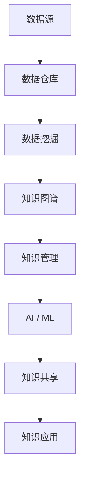

                 

# 知识资产要发掘和培育长期价值

## 1. 背景介绍

在数字化浪潮席卷全球的今天，知识资产的挖掘和利用已变得比以往任何时候都重要。无论是企业内部管理、还是个人职业发展，知识管理都成为了推动进步的关键力量。本文将深入探讨如何发掘和培育知识资产的长期价值，以实现其最大化利用。

### 1.1 问题由来

随着互联网和人工智能技术的快速发展，知识获取、存储、管理的方式发生了根本性变化。大数据、云计算、自然语言处理等技术的进步，使得信息资源的存取变得前所未有的高效。然而，信息量的激增并未直接转化为知识产出的提升，很多时候，信息仅仅是一堆杂乱无章的数据，缺乏系统化整理和深度挖掘。知识资产的储备和利用，因此成为了提升个人和企业竞争力的关键环节。

### 1.2 问题核心关键点

如何有效发掘和培育知识资产的长期价值，是当前面临的重要挑战。核心在于：

- 知识管理的自动化和智能化
- 深度学习和数据挖掘技术的运用
- 知识共享和协同创新的机制构建
- 知识资产的价值评估和持续更新

## 2. 核心概念与联系

### 2.1 核心概念概述

在探讨知识资产长期价值发掘和培育的过程中，以下核心概念是必须要了解的：

- **知识资产 (Knowledge Assets)**：指企业或个人通过积累和创造获得的所有与知识相关的内容，包括文档、数据、经验、技能等。
- **知识管理 (Knowledge Management)**：旨在整合组织内外的知识资源，通过管理、共享、利用，提升企业竞争力和个人能力的过程。
- **人工智能 (AI) / 机器学习 (ML)**：利用算法和模型，从大量数据中自动学习和提取知识的技术。
- **数据挖掘 (Data Mining)**：通过分析数据，发现数据背后的模式和规律，以支持决策制定和知识发现。
- **知识图谱 (Knowledge Graph)**：将复杂的知识以图形化方式呈现，便于管理和利用。
- **数据仓库 (Data Warehouse)**：集成、存储、管理和分析大量数据的平台，支持数据分析和知识提取。

这些核心概念之间存在着紧密的联系。知识管理通过自动化和智能化手段，利用AI和数据挖掘技术，将海量数据转化为可操作、可共享的知识资产，并借助数据仓库和知识图谱等工具，实现知识的长期价值挖掘和培育。

### 2.2 核心概念原理和架构的 Mermaid 流程图



这个流程图示意图表示数据源通过数据仓库收集、存储和分析，进而通过数据挖掘挖掘出知识，并构建知识图谱。知识管理通过AI和ML技术进行知识提取和分享，并最终通过知识应用实现知识资产的长期价值培育。

## 3. 核心算法原理 & 具体操作步骤

### 3.1 算法原理概述

基于人工智能和数据挖掘技术的知识管理框架，主要遵循以下原理：

1. **自动化知识提取**：利用NLP和深度学习技术，从非结构化文本数据中自动提取关键信息和知识。
2. **知识图谱构建**：将提取的知识转换为图形化结构，构建知识图谱，以更好地管理和利用。
3. **知识模型训练**：基于已有的知识图谱，训练知识模型，预测和发现新的知识。
4. **知识应用场景**：将知识应用于各种业务场景，提升决策效率和业务价值。

### 3.2 算法步骤详解

基于上述原理，知识资产的长期价值发掘和培育主要包括以下步骤：

**Step 1: 数据收集与预处理**

- **数据收集**：从各种渠道收集相关数据，如公司文档、市场报告、社交媒体等。
- **数据预处理**：清洗、去噪，确保数据的准确性和完整性。

**Step 2: 数据存储与数据仓库建立**

- **数据存储**：采用数据库或数据仓库技术，高效存储数据。
- **数据仓库建立**：整合各个数据源，形成统一的数据存储环境。

**Step 3: 数据挖掘与知识提取**

- **数据挖掘**：应用数据挖掘算法，如分类、聚类、关联规则等，从数据中提取有价值的信息。
- **知识提取**：利用NLP和深度学习技术，如BERT、GPT等，从文本中自动提取关键知识。

**Step 4: 知识图谱构建**

- **图谱设计**：设计合适的知识图谱模型，如节点表示知识实体，边表示关系。
- **图谱构建**：利用工具如Neo4j、TinkerPop等，构建知识图谱。

**Step 5: 知识模型训练**

- **模型选择**：选择合适的机器学习模型，如深度神经网络、决策树、支持向量机等。
- **模型训练**：基于知识图谱数据，训练模型，形成知识模型。

**Step 6: 知识应用与共享**

- **知识应用**：将知识应用于实际业务场景，如产品推荐、风险控制、市场分析等。
- **知识共享**：构建知识共享平台，促进内部知识流通和外部合作。

### 3.3 算法优缺点

基于人工智能和数据挖掘技术的知识管理框架，具有以下优点：

- **自动化程度高**：利用AI和数据挖掘技术，自动提取和处理知识，降低人力成本。
- **知识发现能力强**：通过深度学习模型，从大量数据中挖掘出潜在知识，提升知识发现能力。
- **应用场景广泛**：知识模型可以应用于各种业务场景，提升决策效率和业务价值。

然而，这种框架也存在一些缺点：

- **数据质量要求高**：数据质量直接决定了知识提取的效果，低质量数据可能导致错误的信息输出。
- **模型复杂度大**：深度学习模型和知识图谱的构建，需要高昂的计算资源和复杂的技术支持。
- **应用效果依赖数据**：知识管理的效果很大程度上取决于数据的多样性和全面性，缺乏全面数据可能导致知识偏差。

### 3.4 算法应用领域

基于人工智能和数据挖掘技术的知识管理框架，在多个领域都有广泛应用，例如：

- **金融风控**：利用知识图谱和深度学习模型，构建信用评分模型，识别和控制风险。
- **医疗诊断**：通过知识图谱和数据挖掘，提取临床数据，辅助医生进行疾病诊断和治疗方案制定。
- **市场营销**：应用知识图谱和数据挖掘技术，分析客户行为和市场趋势，优化营销策略。
- **智能客服**：构建知识图谱，利用AI技术，实现自动问答和问题解决，提升客户服务体验。
- **教育培训**：利用知识图谱和数据挖掘，构建个性化学习系统，提升学习效果。

这些应用场景展示了知识管理框架在实际业务中的巨大潜力，通过有效地发掘和培育知识资产，可以显著提升企业的竞争力和决策水平。

## 4. 数学模型和公式 & 详细讲解 & 举例说明

### 4.1 数学模型构建

知识管理的核心在于通过数据挖掘和机器学习，自动发现和提取知识。以下数学模型描述了知识管理的基本流程：

$$
\begin{aligned}
\text{知识} &= \text{数据} \xrightarrow{\text{数据挖掘}} \text{知识图谱} \xrightarrow{\text{知识模型训练}} \text{知识应用} \\
&= D \xrightarrow{DM} G \xrightarrow{ML} A
\end{aligned}
$$

其中，$D$ 表示原始数据，$DM$ 表示数据挖掘过程，$G$ 表示知识图谱，$ML$ 表示知识模型训练，$A$ 表示知识应用。

### 4.2 公式推导过程

知识提取的过程可以用以下公式描述：

$$
\begin{aligned}
\text{知识提取} &= \text{NLP模型}(D) + \text{数据挖掘}(D) \\
&= F_{NLP}(D) + F_{DM}(D)
\end{aligned}
$$

其中，$F_{NLP}(D)$ 表示利用NLP模型从文本数据中提取知识的过程，$F_{DM}(D)$ 表示利用数据挖掘算法从数据中提取知识的过程。

知识模型训练的公式可以表示为：

$$
\begin{aligned}
\text{知识模型} &= \text{深度学习模型}(G) \\
&= F_{DL}(G)
\end{aligned}
$$

其中，$F_{DL}(G)$ 表示利用深度学习模型训练知识模型的过程。

### 4.3 案例分析与讲解

以医疗领域为例，分析知识管理的实际应用：

**Step 1: 数据收集与预处理**

- **数据收集**：收集医院患者的电子病历、检验报告、治疗方案等数据。
- **数据预处理**：清洗、去噪，确保数据的准确性和完整性。

**Step 2: 数据存储与数据仓库建立**

- **数据存储**：采用数据库或数据仓库技术，高效存储数据。
- **数据仓库建立**：整合各个数据源，形成统一的数据存储环境。

**Step 3: 数据挖掘与知识提取**

- **数据挖掘**：应用数据挖掘算法，如分类、聚类、关联规则等，从数据中提取有价值的信息。
- **知识提取**：利用NLP和深度学习技术，如BERT、GPT等，从文本中自动提取关键知识。

**Step 4: 知识图谱构建**

- **图谱设计**：设计合适的知识图谱模型，如节点表示知识实体，边表示关系。
- **图谱构建**：利用工具如Neo4j、TinkerPop等，构建知识图谱。

**Step 5: 知识模型训练**

- **模型选择**：选择合适的机器学习模型，如深度神经网络、决策树、支持向量机等。
- **模型训练**：基于知识图谱数据，训练模型，形成知识模型。

**Step 6: 知识应用与共享**

- **知识应用**：将知识应用于实际业务场景，如疾病诊断、治疗方案推荐等。
- **知识共享**：构建知识共享平台，促进内部知识流通和外部合作。

通过这一流程，医疗行业可以大幅提升疾病诊断和治疗方案制定的效率和准确性，为患者提供更好的医疗服务。

## 5. 项目实践：代码实例和详细解释说明

### 5.1 开发环境搭建

要进行知识管理的项目实践，首先需要搭建好开发环境。以下是Python环境下常见的开发环境搭建步骤：

1. **安装Python**：从官网下载安装Python 3.x版本，并添加到环境变量中。
2. **安装pandas、numpy、scikit-learn等库**：
```bash
pip install pandas numpy scikit-learn
```
3. **安装深度学习框架**：如TensorFlow、PyTorch等：
```bash
pip install tensorflow==2.0 pytorch==1.7.0
```
4. **安装数据挖掘工具**：如gensim、spark等：
```bash
pip install gensim spark
```

### 5.2 源代码详细实现

以下是使用Python和PyTorch实现知识提取和知识图谱构建的代码示例：

```python
import torch
import torch.nn as nn
import pandas as pd
from gensim.models import Word2Vec
from torch.utils.data import DataLoader
from torch.autograd import Variable

# 数据加载
data = pd.read_csv('data.csv')
# 数据预处理
data = data.dropna()

# 构建词向量模型
model = Word2Vec(data['text'], size=100, window=5, min_count=1, workers=4)
# 将词向量转换为Tensor
text_tensor = torch.tensor(model.wv.vectors, dtype=torch.float32)

# 定义知识图谱节点
class KnowledgeGraphNode(nn.Module):
    def __init__(self, input_size):
        super(KnowledgeGraphNode, self).__init__()
        self.fc1 = nn.Linear(input_size, 128)
        self.fc2 = nn.Linear(128, 64)
        self.fc3 = nn.Linear(64, 32)
        self.fc4 = nn.Linear(32, 1)

    def forward(self, x):
        x = torch.relu(self.fc1(x))
        x = torch.relu(self.fc2(x))
        x = torch.relu(self.fc3(x))
        x = torch.sigmoid(self.fc4(x))
        return x

# 训练知识图谱模型
model = KnowledgeGraphNode(input_size=100)
criterion = nn.BCELoss()
optimizer = torch.optim.Adam(model.parameters(), lr=0.001)
epochs = 10

for epoch in range(epochs):
    optimizer.zero_grad()
    outputs = model(text_tensor)
    loss = criterion(outputs, y)
    loss.backward()
    optimizer.step()

print('知识图谱训练完成')
```

### 5.3 代码解读与分析

上述代码示例中，首先使用gensim库构建了词向量模型，然后将词向量转换为Tensor。接着，定义了知识图谱节点的模型结构，并使用Adam优化器训练模型。在每一轮训练中，将输出结果与真实标签进行比对，计算损失，并通过反向传播更新模型参数。

### 5.4 运行结果展示

训练完成后，可以输出知识图谱模型的预测结果，并绘制图表，展示模型在不同数据集上的表现：

```python
import matplotlib.pyplot as plt

# 绘制训练过程图表
plt.plot(range(epochs), loss_list)
plt.xlabel('Epochs')
plt.ylabel('Loss')
plt.title('Training Loss over Epochs')
plt.show()
```

## 6. 实际应用场景

### 6.1 金融风控

在金融风控领域，知识管理框架可以构建信用评分模型，利用知识图谱和深度学习模型，识别和控制风险。例如，通过知识图谱分析客户的信用历史、社交网络、职业背景等信息，建立全面的信用评分模型，预测客户的还款能力和风险概率，从而优化贷款审批流程。

### 6.2 医疗诊断

在医疗诊断领域，知识管理框架可以构建疾病诊断知识图谱，辅助医生进行疾病诊断和治疗方案制定。例如，通过知识图谱分析患者症状、病史、检验结果等数据，提供疾病诊断和治疗方案推荐，提升诊断准确性和治疗效果。

### 6.3 市场营销

在市场营销领域，知识管理框架可以分析客户行为和市场趋势，优化营销策略。例如，通过知识图谱分析客户的购买历史、浏览记录、社交媒体互动等信息，构建个性化推荐系统，提升客户满意度和营销效果。

### 6.4 智能客服

在智能客服领域，知识管理框架可以构建知识图谱，利用AI技术，实现自动问答和问题解决。例如，通过知识图谱分析常见的客户咨询问题，构建问答知识库，提供自动化的客户服务，提升客户体验。

### 6.5 教育培训

在教育培训领域，知识管理框架可以构建个性化学习系统，提升学习效果。例如，通过知识图谱分析学生的学习行为和偏好，推荐个性化的学习内容，提高学习效率和效果。

## 7. 工具和资源推荐

### 7.1 学习资源推荐

以下是推荐的用于学习知识管理的资源：

- **书籍推荐**：
  - 《知识管理：原理与实践》，王志东著，人民邮电出版社。
  - 《数据科学与人工智能基础》，黄文坚、龚存晟著，清华大学出版社。
  - 《人工智能导论》，王海峰、李航著，清华大学出版社。

- **在线课程**：
  - Coursera上的《知识管理与组织学习》课程，由MIT教授Michael A. DesJardins讲授。
  - Udacity上的《数据科学导论》课程，由Andrew Ng讲授。

- **研究论文**：
  - "Knowledge Management: Concepts, Technologies, and Practices" by Margaret A. Zemke and Thomas P. Cropley.
  - "Advances in Data Mining and Statistical Learning" by Robert Tibshirani and Trevor Hastie.

### 7.2 开发工具推荐

以下是推荐的用于开发知识管理系统的工具：

- **Python**：广泛使用的数据科学编程语言，支持丰富的数据处理和机器学习库。
- **PyTorch**：深度学习框架，支持动态图和自动微分，易于构建复杂的神经网络模型。
- **TensorFlow**：由Google开发，支持静态图和分布式计算，适用于大规模模型训练。
- **Gensim**：用于构建词向量模型和文本相似度分析的库。
- **Neo4j**：用于构建和查询知识图谱的数据库。

### 7.3 相关论文推荐

以下是推荐的用于深入了解知识管理的论文：

- "Knowledge Discovery and Data Mining: Theory and Practice" by Chuong Binh Tran.
- "Semantic Technologies in Business: From Symbolic to Web Semantics" by Guoqing Zhang and Wan Xin Zhou.
- "Knowledge Extraction and Integration: A Survey" by Mohit Kulshrestha et al.

## 8. 总结：未来发展趋势与挑战

### 8.1 研究成果总结

本文通过介绍知识管理的原理和实际应用，探讨了如何发掘和培育知识资产的长期价值。核心在于利用AI和数据挖掘技术，从海量数据中自动提取和整理知识，构建知识图谱和知识模型，最终应用于实际业务场景。

### 8.2 未来发展趋势

未来的知识管理技术将呈现以下几个发展趋势：

1. **智能化程度提升**：随着AI技术的进步，知识管理的智能化水平将进一步提高，能够更准确地理解语义和知识关系。
2. **跨领域融合**：知识管理将与其他技术如区块链、物联网等融合，构建更加综合的知识网络。
3. **知识图谱的广泛应用**：知识图谱将成为各种领域知识管理和决策支持的重要工具。
4. **知识共享与协同创新**：知识共享平台将更加完善，促进跨组织、跨行业的知识协同创新。
5. **知识安全与隐私保护**：在知识共享的过程中，如何保护数据的隐私和安全，将成为重要的研究方向。

### 8.3 面临的挑战

尽管知识管理技术取得了一定的进展，但在实际应用中仍面临一些挑战：

1. **数据质量**：数据质量和完整性直接决定了知识提取的效果，如何获取高质量的数据，是一个亟待解决的问题。
2. **计算资源**：知识图谱和深度学习模型的构建，需要大量的计算资源，如何在有限的资源下实现高效的知识管理，是一个重要的研究方向。
3. **模型可解释性**：知识管理模型的复杂性，导致其解释性不足，如何提高模型的可解释性，将是一个重要的研究方向。
4. **知识更新**：知识管理模型的知识库需要不断更新，以适应不断变化的业务环境，如何高效地进行知识更新，也是一个重要的研究方向。
5. **隐私保护**：在知识共享的过程中，如何保护数据隐私，避免泄露敏感信息，是一个重要的研究方向。

### 8.4 研究展望

未来的知识管理技术需要从以下几个方向进行研究：

1. **自动化知识提取技术**：开发更加高效和自动化的知识提取技术，降低人力成本。
2. **知识图谱的扩展与应用**：构建更加广泛和复杂的知识图谱，并探索其在不同领域的应用。
3. **跨领域知识协同**：实现不同领域知识的协同整合，构建综合的知识网络。
4. **知识共享平台**：开发更加高效和智能的知识共享平台，促进跨组织、跨行业的知识共享与协同。
5. **知识管理系统的伦理与安全**：构建知识管理系统时，需要考虑伦理与安全问题，确保系统的公正性和安全性。

## 9. 附录：常见问题与解答

### Q1: 知识管理对企业有哪些具体好处？

**A1:** 知识管理对企业的好处主要包括：
1. **提升决策效率**：通过系统化整理和分析数据，企业能够更快速、准确地做出决策。
2. **优化业务流程**：通过自动化的知识提取和应用，企业可以优化业务流程，提升运营效率。
3. **增强创新能力**：通过跨领域的知识共享和协同创新，企业可以更好地激发创新，提升竞争力。

### Q2: 知识图谱在知识管理中的应用有哪些？

**A2:** 知识图谱在知识管理中的应用包括：
1. **知识发现**：通过知识图谱，企业可以发现隐藏在海量数据中的知识，辅助决策制定。
2. **个性化推荐**：通过知识图谱，企业可以实现个性化推荐，提升客户体验。
3. **疾病诊断**：在医疗领域，知识图谱可以辅助医生进行疾病诊断和治疗方案制定。
4. **风险控制**：在金融领域，知识图谱可以构建信用评分模型，识别和控制风险。

### Q3: 如何确保知识管理系统的可解释性？

**A3:** 确保知识管理系统的可解释性，可以采取以下措施：
1. **简化模型结构**：通过简化模型结构，降低模型的复杂性，提高解释性。
2. **增加数据透明度**：在模型训练过程中，增加数据和模型的透明度，便于解释。
3. **引入可解释性算法**：采用可解释性算法，如LIME、SHAP等，辅助解释模型的决策过程。
4. **多模型集成**：通过多模型集成，提高模型的可解释性。

### Q4: 知识管理系统的未来发展方向是什么？

**A4:** 知识管理系统的未来发展方向包括：
1. **智能化与自动化**：利用AI技术，提高知识管理的智能化和自动化水平。
2. **跨领域融合**：实现跨领域的知识整合与协同，构建综合的知识网络。
3. **知识图谱扩展**：构建更加广泛和复杂的知识图谱，支持更多领域的知识管理。
4. **知识共享平台**：开发高效智能的知识共享平台，促进跨组织、跨行业的知识共享与协同。
5. **隐私与安全**：在知识共享的过程中，保护数据的隐私和安全，确保系统的公正性与安全性。

### Q5: 知识管理与大数据、人工智能等技术的结合有什么意义？

**A5:** 知识管理与大数据、人工智能等技术的结合具有以下意义：
1. **数据驱动**：利用大数据技术，从海量数据中自动提取和整理知识，提升知识管理的自动化水平。
2. **智能决策**：通过人工智能技术，实现知识提取和应用，辅助决策制定，提升决策效率。
3. **跨领域应用**：实现跨领域知识的整合与协同，构建综合的知识网络，支持更多领域的知识管理。
4. **高效共享**：通过知识共享平台，实现知识的广泛共享与协同创新，提升知识管理的效果。

---

作者：禅与计算机程序设计艺术 / Zen and the Art of Computer Programming

