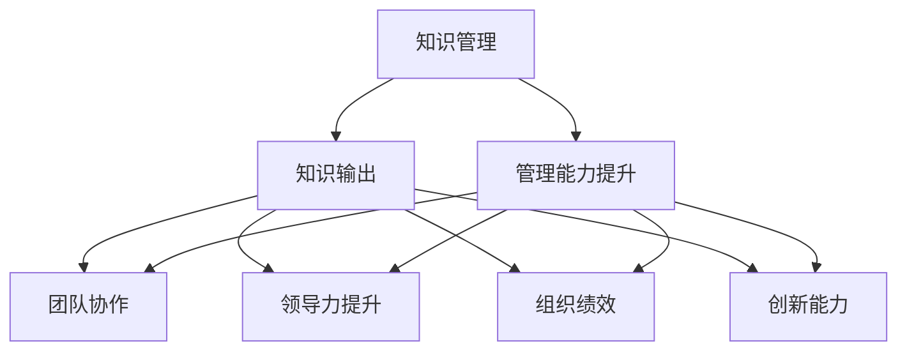

                 

# 知识输出对管理能力提升的作用

> 关键词：知识管理,知识输出,管理能力提升,团队协作,领导力提升

## 1. 背景介绍

### 1.1 问题由来

在当今信息爆炸的时代，知识的获取变得更加容易，但知识的存储和使用却变得复杂起来。对于管理者而言，如何在海量信息中筛选、组织、传播有价值的知识，以提升团队和组织的绩效，是一个极具挑战的问题。传统管理理念中，知识管理往往被视为企业的核心竞争力之一，但在实践中，许多企业并未充分利用其潜力。本文将深入探讨知识输出对管理能力提升的作用，以及如何通过有效的知识输出策略，来驱动组织向更高层次的管理目标迈进。

### 1.2 问题核心关键点

本文聚焦于知识输出在管理能力提升中的作用，重点讨论以下几个关键点：

- **知识输出与团队协作**：如何通过知识输出，提升团队成员之间的沟通效率和协作质量。
- **知识输出与领导力提升**：领导者在知识输出过程中的角色和影响，以及如何通过知识输出，提升领导力。
- **知识输出与组织绩效**：知识输出对组织绩效的影响，以及如何在不同管理层级上推动知识输出。
- **知识输出与创新能力**：知识输出如何激发员工的创新能力，促进组织创新。

## 2. 核心概念与联系

### 2.1 核心概念概述

为更好地理解知识输出在管理能力提升中的作用，本节将介绍几个密切相关的核心概念：

- **知识管理(Knowledge Management, KM)**：通过建立知识库、知识共享平台等手段，系统地存储、整理、传播和应用组织内部的知识资源，以提升组织效率和创新能力。
- **知识输出(Knowledge Output)**：指将知识从知识库或个体头脑中传递出去的过程，包括文档撰写、演讲、培训、在线分享等多种形式。
- **管理能力(Management Capability)**：指管理者在规划、组织、领导和控制过程中所展现出来的综合能力，包括决策能力、沟通能力、团队管理能力等。
- **团队协作(Team Collaboration)**：指团队成员之间为了共同目标，通过协作工具和方法，进行有效的信息交流和任务分配。
- **领导力(Leadership)**：指领导者通过影响和激励他人，实现组织目标的能力，包括愿景规划、决策制定、团队激励等。
- **组织绩效(Organizational Performance)**：指组织在实现其目标的过程中所取得的成果，包括财务指标、市场份额、创新能力等。
- **创新能力(Innovation Capacity)**：指组织内部的创造力、革新能力，包括新产品开发、业务流程优化等。

这些核心概念之间的逻辑关系可以通过以下Mermaid流程图来展示：



这个流程图展示了几大核心概念之间的联系：

1. 知识管理通过建立知识库和共享平台，为知识输出提供基础。
2. 知识输出通过传播有价值的信息，提升管理能力、团队协作、领导力和创新能力。
3. 管理能力、团队协作、领导力和创新能力是组织绩效的重要支撑。

## 3. 核心算法原理 & 具体操作步骤
### 3.1 算法原理概述

知识输出对管理能力提升的作用，本质上是一个系统工程，涉及知识的获取、整理、传播和应用等多个环节。知识输出的过程，实际上是对知识进行有意识地整理和加工，并将其转化为可传播、可应用的形式。这一过程不仅能够提升个体的知识水平，还能通过知识的共享和交流，促进团队协作和组织创新，最终提升整体的管理能力。

知识输出的算法原理可以简单归纳为：

- 收集知识：从多个渠道获取相关的知识，包括文档、报告、演讲、案例研究等。
- 整理知识：对获取的知识进行分类、归纳、总结，形成易于传播的结构化信息。
- 传播知识：通过文档、培训、会议、在线平台等形式，将整理好的知识传播给需要的人群。
- 应用知识：将传播的知识应用于实际工作中，促进决策制定、问题解决和创新。

### 3.2 算法步骤详解

知识输出的具体操作步骤可以进一步细分为以下几步：

**Step 1: 确定知识输出目标**

- 明确知识输出的目的和受众，如提升团队协作能力、增强领导力、推动创新等。
- 根据目标受众的需求，选择合适的知识输出形式，如培训课程、技术分享、专题讲座等。

**Step 2: 收集知识**

- 从内部和外部多个渠道收集相关的知识资源，包括内部文档、外部文章、专家访谈等。
- 评估知识资源的相关性和质量，筛选出对目标受众最有价值的内容。

**Step 3: 整理知识**

- 对筛选出的知识资源进行分类、归纳和总结，形成易于传播的结构化信息。
- 使用工具如思维导图、知识图谱等，将整理好的知识进行可视化表达。

**Step 4: 传播知识**

- 选择合适的传播渠道和形式，如公司内部网站、社交媒体、线下培训等。
- 制作知识传播材料，如PPT、视频、文档等，确保内容的准确性和可理解性。

**Step 5: 应用知识**

- 将传播的知识应用到实际工作中，如项目决策、流程优化、产品开发等。
- 定期评估知识应用的效果，收集反馈意见，持续优化知识输出策略。

**Step 6: 持续改进**

- 根据知识输出过程中发现的问题和反馈，持续改进知识输出策略和传播形式。
- 建立知识输出的评估机制，定期检查知识输出的效果和改进空间。

### 3.3 算法优缺点

知识输出作为一种提升管理能力的策略，具有以下优点：

1. **知识共享和传递**：通过知识输出，促进团队内部知识的共享和传递，避免知识孤岛，提升整体知识水平。
2. **提升沟通效率**：知识输出有助于清晰表达和理解复杂概念，提升团队成员之间的沟通效率。
3. **增强团队协作**：知识输出鼓励团队成员共同讨论和解决问题，增强团队协作能力。
4. **推动创新**：知识输出提供了一个平台，让员工有机会分享和应用创新思维，推动组织创新。

同时，知识输出也存在一些缺点：

1. **时间和资源消耗**：知识输出需要投入大量时间和资源，尤其是在知识整理和传播阶段。
2. **质量和相关性问题**：知识输出的质量可能因筛选、整理和传播过程中的误差而降低，影响效果。
3. **受众接受度**：知识输出需要根据受众特点和需求进行定制，复杂的知识和抽象概念可能难以被理解和接受。
4. **缺乏即时反馈**：知识输出效果可能存在滞后，难以立即获得反馈和改进。

### 3.4 算法应用领域

知识输出在多个领域都有广泛的应用，例如：

- **企业管理**：通过内部培训、知识库构建等方式，提升管理者和员工的知识水平和协作能力。
- **技术创新**：通过技术分享、项目演示等形式，促进技术知识的传播和应用，推动技术创新。
- **客户关系管理**：通过客户案例分享、市场分析报告等形式，提升客户关系管理团队的知识水平和服务质量。
- **教育培训**：通过在线课程、讲座等方式，向学员传播专业知识，提升教育培训效果。

## 4. 数学模型和公式 & 详细讲解  
### 4.1 数学模型构建

知识输出的数学模型可以基于知识传播的效用函数进行构建。假设知识传播的效用函数为 \( U(K, T, E) \)，其中 \( K \) 为知识输出量，\( T \) 为团队协作水平，\( E \) 为创新能力。则知识输出的效用函数可以表示为：

$$ U(K, T, E) = f(K) \cdot g(T) \cdot h(E) $$

其中 \( f(K) \) 为知识输出的效用函数，\( g(T) \) 为团队协作的效用函数，\( h(E) \) 为创新的效用函数。

**知识输出的效用函数 \( f(K) \)**：

$$ f(K) = K^{\alpha} $$

其中 \( \alpha \) 为知识输出的效用系数，控制知识输出的重要性。

**团队协作的效用函数 \( g(T) \)**：

$$ g(T) = T^{\beta} $$

其中 \( \beta \) 为团队协作的效用系数，控制团队协作的重要性。

**创新的效用函数 \( h(E) \)**：

$$ h(E) = E^{\gamma} $$

其中 \( \gamma \) 为创新的效用系数，控制创新的重要性。

### 4.2 公式推导过程

根据上述定义，知识输出的效用函数可以进一步推导为：

$$ U(K, T, E) = K^{\alpha} \cdot T^{\beta} \cdot E^{\gamma} $$

通过最大化效用函数 \( U(K, T, E) \)，可以确定最佳的 \( K \)、\( T \) 和 \( E \) 值，从而实现知识输出对管理能力提升的最佳效果。

### 4.3 案例分析与讲解

**案例1: 谷歌的知识输出策略**

谷歌作为全球知名的科技公司，高度重视知识输出。公司内部有完善的知识管理系统，包括Google Scholar、YouTube Education等平台，定期举办技术分享会、内部培训和在线课程。这些知识输出策略不仅提升了员工的知识水平，也促进了团队协作和创新。

**案例2: 华为的知识分享平台**

华为通过其知识分享平台“华为在线”，鼓励员工分享技术知识和成功经验。该平台不仅支持文档上传和阅读，还提供了讨论区、课程直播等功能，促进了知识的传播和交流。华为的知识输出策略显著提升了员工的知识水平和创新能力，推动了企业的发展。

## 5. 项目实践：代码实例和详细解释说明
### 5.1 开发环境搭建

在进行知识输出实践前，我们需要准备好开发环境。以下是使用Python进行知识输出系统开发的简单环境配置流程：

1. 安装Python：从官网下载并安装Python 3.x版本。
2. 安装Flask：使用pip命令安装Flask框架，用于开发知识分享平台。
3. 安装Markdown：使用pip命令安装Markdown库，用于知识文档的格式处理。
4. 安装Git：使用Git版本控制系统，用于代码管理和版本控制。

完成上述步骤后，即可在本地环境进行知识输出系统的开发。

### 5.2 源代码详细实现

下面我们以一个简单的知识分享平台为例，给出使用Flask进行知识输出的PyTorch代码实现。

首先，定义知识分享平台的API路由：

```python
from flask import Flask, request, jsonify

app = Flask(__name__)

@app.route('/knowledge', methods=['POST'])
def create_knowledge():
    data = request.get_json()
    title = data['title']
    content = data['content']
    
    # 将知识文档保存到数据库或文件系统
    save_knowledge(title, content)
    
    return jsonify({'message': '知识文档创建成功'})

@app.route('/knowledge', methods=['GET'])
def get_knowledge():
    title = request.args.get('title')
    knowledge = get_knowledge_by_title(title)
    
    if knowledge is None:
        return jsonify({'message': '知识文档未找到'})
    
    return jsonify({'knowledge': knowledge})

if __name__ == '__main__':
    app.run(debug=True)
```

然后，定义知识文档的保存和获取函数：

```python
def save_knowledge(title, content):
    # 将知识文档保存到数据库或文件系统
    pass

def get_knowledge_by_title(title):
    # 从数据库或文件系统获取知识文档
    pass
```

最后，启动Flask服务器，开始知识文档的创建和获取：

```python
if __name__ == '__main__':
    app.run(debug=True)
```

以上就是使用Flask进行知识文档创建和获取的简单代码实现。可以看到，通过Flask框架，我们能够快速搭建一个知识分享平台，实现知识文档的创建、存储和检索功能。

### 5.3 代码解读与分析

让我们再详细解读一下关键代码的实现细节：

**Flask API路由定义**：
- 定义了两个API路由，一个是POST请求，用于创建知识文档；另一个是GET请求，用于根据标题获取知识文档。

**知识文档的保存和获取函数**：
- `save_knowledge`函数负责将知识文档保存到数据库或文件系统。
- `get_knowledge_by_title`函数根据标题从数据库或文件系统获取知识文档。

**Flask服务器启动**：
- 启动Flask服务器，监听本地的请求，并提供API接口。

**Flask API使用**：
- 使用Python的`requests`库向服务器发送POST请求，创建知识文档。
- 使用Python的`requests`库向服务器发送GET请求，根据标题获取知识文档。

## 6. 实际应用场景

### 6.1 企业管理

在企业管理中，知识输出可以显著提升管理者和员工的协作能力，促进创新，推动组织绩效的提升。具体而言，可以通过以下方式实现：

**内部培训和讲座**：定期组织内部培训和讲座，分享最新的管理理念、技术和案例，提升员工的知识水平和协作能力。

**知识库和分享平台**：建立企业知识库和内部分享平台，方便员工随时访问和学习知识。通过定期更新和维护，保持知识库的及时性和相关性。

**跨部门协作**：通过知识输出，促进不同部门之间的协作和信息共享，解决跨部门沟通和协作中的问题。

**项目管理**：在项目管理中，通过知识输出，共享项目经验和技术，提升项目管理效率和质量。

### 6.2 技术创新

在技术创新方面，知识输出可以通过以下方式推动组织创新：

**技术分享会**：定期举办技术分享会，邀请技术专家和团队成员分享最新的技术进展和研究成果，推动技术创新。

**开源社区参与**：鼓励员工参与开源社区，贡献代码和知识，学习先进技术，推动技术创新。

**项目演示**：通过项目演示和技术分享，展示技术成果和创新点，吸引更多的关注和合作。

**创新实验室**：建立创新实验室，提供技术创新所需的资源和支持，鼓励员工进行探索和实验，推动技术突破。

### 6.3 客户关系管理

在客户关系管理中，知识输出可以通过以下方式提升客户关系管理团队的知识水平和服务质量：

**客户案例分享**：定期分享客户案例和成功经验，提升客户关系管理团队的知识水平和服务能力。

**市场分析报告**：编写市场分析报告，分享市场趋势和客户需求，提升客户关系管理团队的洞察力和决策能力。

**客户反馈**：定期收集和分析客户反馈，形成知识文档，提升客户关系管理团队的客户理解和响应能力。

**客户培训**：编写客户培训材料，分享产品使用和客户服务知识，提升客户的使用体验和满意度。

## 7. 工具和资源推荐
### 7.1 学习资源推荐

为了帮助开发者系统掌握知识输出在管理能力提升中的应用，这里推荐一些优质的学习资源：

1. **《知识管理与组织学习》（Knowledge Management and Organizational Learning）**：由知识管理领域的专家撰写，全面介绍了知识管理的理论基础和实践方法。
2. **《谷歌的内部管理实践》（Google's Internal Management Practices）**：Google官方发布的内部管理实践指南，展示了谷歌在知识输出、团队协作和创新等方面的经验和策略。
3. **《知识管理的艺术与科学》（The Art of Knowledge Management）**：针对知识管理的具体实践，提供了大量的案例和工具，帮助读者提升知识管理能力。
4. **《领导力与创新》（Leadership and Innovation）**：探讨领导力与创新的关系，提供了一系列提升领导力和创新能力的方法和技巧。
5. **《跨领域创新》（Cross-Disciplinary Innovation）**：介绍跨领域创新的方法和工具，帮助管理者在多领域协作中实现创新突破。

通过这些学习资源的学习实践，相信你一定能够掌握知识输出在管理能力提升中的技巧和方法，并将其应用于实际工作中。

### 7.2 开发工具推荐

高效的开发离不开优秀的工具支持。以下是几款用于知识输出系统开发的常用工具：

1. **Flask**：Python编写的轻量级Web框架，简单易用，适合快速开发知识分享平台。
2. **Jupyter Notebook**：Python编程和数据分析的好帮手，支持代码和文档的混合编写和展示。
3. **GitHub**：全球最大的代码托管平台，支持版本控制和代码协作，是知识输出的重要工具。
4. **Markdown**：轻量级文本标记语言，支持富文本编辑和格式化，适合知识文档的编写和展示。
5. **Slack**：企业内部沟通的好助手，支持即时消息、文件分享和协作，是知识输出的重要平台。

合理利用这些工具，可以显著提升知识输出的开发效率，加快创新迭代的步伐。

### 7.3 相关论文推荐

知识输出在管理能力提升中的应用，是近年来研究的热点问题。以下是几篇奠基性的相关论文，推荐阅读：

1. **《知识管理的数学建模与优化》（Mathematical Modeling and Optimization of Knowledge Management）**：通过数学模型分析知识管理的优化策略，提出了一系列知识管理的优化方法。
2. **《组织知识管理的理论框架和实践指南》（Theoretical Framework and Practical Guide for Organizational Knowledge Management）**：全面介绍了知识管理理论，并提供了实践指南，帮助读者系统掌握知识管理的方法和工具。
3. **《知识输出的影响因素和效果评估》（Factors Influencing Knowledge Output and Its Effect Evaluation）**：通过实证研究，分析了知识输出的影响因素和效果评估方法，为知识输出策略的优化提供了数据支持。
4. **《领导力与知识输出的关系》（Relationship between Leadership and Knowledge Output）**：探讨了领导力在知识输出过程中的作用和影响，提供了提升领导力的知识和技巧。
5. **《跨领域创新的知识整合模型》（Knowledge Integration Model for Cross-Disciplinary Innovation）**：提出了跨领域创新的知识整合模型，展示了跨领域创新中的知识管理策略。

这些论文代表了大语言模型微调技术的发展脉络。通过学习这些前沿成果，可以帮助研究者把握学科前进方向，激发更多的创新灵感。

## 8. 总结：未来发展趋势与挑战
### 8.1 总结

本文对知识输出在管理能力提升中的作用进行了全面系统的介绍。首先阐述了知识输出的背景和意义，明确了知识输出在提升团队协作、领导力、组织绩效和创新能力中的重要作用。其次，从原理到实践，详细讲解了知识输出的数学模型和操作步骤，给出了知识输出任务开发的完整代码实例。同时，本文还广泛探讨了知识输出在企业管理、技术创新和客户关系管理等多个领域的应用前景，展示了知识输出范式的巨大潜力。此外，本文精选了知识输出的各类学习资源，力求为读者提供全方位的技术指引。

通过本文的系统梳理，可以看到，知识输出作为一种提升管理能力的策略，已经在多个行业得到了应用，并取得了显著的成效。未来，伴随知识管理技术和理论的持续演进，知识输出将进一步深化和拓展，成为企业数字化转型和智能化升级的重要推动力。

### 8.2 未来发展趋势

展望未来，知识输出在管理能力提升中还将呈现以下几个发展趋势：

1. **智能化的知识管理**：随着人工智能技术的发展，知识输出将更加智能化，能够自动分类、摘要和推荐有价值的内容，提高知识管理效率。
2. **多渠道的知识传播**：知识输出将利用多种渠道进行传播，包括社交媒体、在线课程、虚拟现实等，增强知识的可访问性和互动性。
3. **跨领域的知识整合**：知识输出将打破学科界限，促进跨领域知识的整合和应用，推动创新突破。
4. **知识输出的闭环评估**：通过建立知识输出的评估机制，对知识传播效果进行实时监控和反馈，持续优化知识输出策略。

以上趋势凸显了知识输出在管理能力提升中的广阔前景。这些方向的探索发展，必将进一步提升知识输出系统的效果和应用范围，为组织创造更大的价值。

### 8.3 面临的挑战

尽管知识输出在管理能力提升中已经取得了一定的进展，但在迈向更加智能化、普适化应用的过程中，仍面临以下挑战：

1. **数据质量和完整性问题**：知识输出的效果很大程度上依赖于数据的质量和完整性，如何确保数据源的可靠性和数据采集的全面性，是一个重要问题。
2. **知识输出的标准化**：知识输出需要根据受众特点和需求进行定制，如何制定统一的知识输出标准，是一个复杂的挑战。
3. **知识输出的互动性**：知识输出的效果很大程度上依赖于受众的互动和反馈，如何增强知识输出的互动性，是一个需要解决的问题。
4. **知识输出的可扩展性**：知识输出系统需要能够适应不断变化的环境和需求，如何提高知识输出系统的可扩展性，是一个重要的研究方向。
5. **知识输出的伦理和安全性**：知识输出可能涉及敏感信息，如何确保知识输出的伦理和安全性，是一个需要关注的问题。

### 8.4 研究展望

面对知识输出面临的这些挑战，未来的研究需要在以下几个方面寻求新的突破：

1. **智能化的知识管理系统**：通过引入人工智能技术，构建智能化的知识管理系统，自动分类、摘要和推荐知识内容，提高知识管理效率。
2. **多渠道的知识传播平台**：利用社交媒体、在线课程、虚拟现实等多种渠道，增强知识的可访问性和互动性，提高知识传播效果。
3. **跨领域的知识整合模型**：打破学科界限，促进跨领域知识的整合和应用，推动创新突破。
4. **知识输出的闭环评估机制**：建立知识输出的评估机制，对知识传播效果进行实时监控和反馈，持续优化知识输出策略。
5. **知识输出的标准化和规范化**：制定统一的知识输出标准，确保知识输出的可靠性和一致性，提高知识输出的效果。
6. **知识输出的伦理和安全保障**：确保知识输出的伦理和安全性，保护敏感信息，建立知识输出的监管机制。

这些研究方向的探索，必将引领知识输出在管理能力提升中的持续进步，为组织创造更大的价值。面向未来，知识输出需要与其他人工智能技术进行更深入的融合，如知识表示、因果推理、强化学习等，多路径协同发力，共同推动知识输出的进步。

## 9. 附录：常见问题与解答

**Q1：知识输出的重要性是什么？**

A: 知识输出的重要性体现在以下几个方面：
1. 提升员工的知识水平和技能。知识输出能够帮助员工掌握新的知识和技能，提升其工作效率和创新能力。
2. 促进团队协作和信息共享。知识输出通过分享和交流，促进团队成员之间的信息共享和协作，提高团队整体的知识水平和协作能力。
3. 推动组织创新。知识输出能够激发员工的创新思维，推动技术创新和产品开发，提升组织的创新能力。

**Q2：知识输出的缺点是什么？**

A: 知识输出的缺点包括：
1. 时间和资源消耗较大。知识输出的整理、传播和应用需要投入大量时间和资源，尤其是在数据收集和整理阶段。
2. 质量和相关性问题。知识输出的质量和相关性可能因筛选、整理和传播过程中的误差而降低，影响效果。
3. 受众接受度问题。知识输出的效果很大程度上依赖于受众的接受度和参与度，复杂的知识和抽象概念可能难以被理解和接受。
4. 缺乏即时反馈。知识输出的效果可能存在滞后，难以立即获得反馈和改进。

**Q3：如何进行知识输出的评估？**

A: 知识输出的评估可以从以下几个方面进行：
1. 效果评估：通过知识输出的效果数据，评估知识输出对团队协作、创新和绩效的影响。
2. 受众反馈：通过受众的反馈意见，评估知识输出的接受度和满意度。
3. 指标监控：通过建立知识输出指标体系，实时监控知识输出的效果和改进空间。
4. 持续优化：根据评估结果，持续优化知识输出策略和传播形式，提高知识输出的效果。

**Q4：如何进行知识输出的管理？**

A: 知识输出的管理可以从以下几个方面进行：
1. 知识库建设：建立企业知识库和内部分享平台，方便员工随时访问和学习知识。
2. 标准化和规范化：制定统一的知识输出标准，确保知识输出的可靠性和一致性。
3. 激励机制：建立知识输出的激励机制，鼓励员工积极参与知识输出。
4. 闭环评估：建立知识输出的评估机制，对知识传播效果进行实时监控和反馈，持续优化知识输出策略。
5. 多渠道传播：利用多种渠道进行知识传播，增强知识的可访问性和互动性。

通过这些管理措施，可以更好地推动知识输出的实施，提升组织的知识管理能力。

**Q5：知识输出的未来趋势是什么？**

A: 知识输出的未来趋势包括：
1. 智能化和自动化。通过引入人工智能技术，构建智能化的知识管理系统，自动分类、摘要和推荐知识内容，提高知识管理效率。
2. 多渠道传播。利用社交媒体、在线课程、虚拟现实等多种渠道，增强知识的可访问性和互动性，提高知识传播效果。
3. 跨领域整合。打破学科界限，促进跨领域知识的整合和应用，推动创新突破。
4. 闭环评估。建立知识输出的评估机制，对知识传播效果进行实时监控和反馈，持续优化知识输出策略。
5. 标准化和规范化。制定统一的知识输出标准，确保知识输出的可靠性和一致性。
6. 伦理和安全性。确保知识输出的伦理和安全性，保护敏感信息，建立知识输出的监管机制。

这些趋势凸显了知识输出在管理能力提升中的广阔前景，未来将成为组织数字化转型和智能化升级的重要推动力。

---

作者：禅与计算机程序设计艺术 / Zen and the Art of Computer Programming

