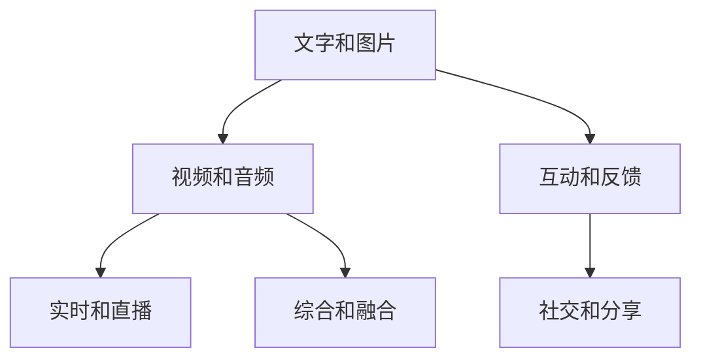

                 

# 知识输出的多种方式及其效果

在现代社会，信息爆炸与知识冗余成为一大趋势，高效、准确地输出知识变得尤为重要。无论是学术论文、技术博客，还是软件开发、教育培训，知识输出都是实现价值传递、影响他人认知的关键途径。本文将详细探讨知识输出的多种方式及其效果，并结合实际案例进行讲解分析。

## 1. 背景介绍

### 1.1 问题由来
随着互联网的普及和信息技术的进步，人们获取知识的手段日益多样化。传统单一的文字、图片等形式已经无法满足信息传播的需求，多媒体、互动、实时等新型知识输出方式应运而生。如何选择合适的知识输出方式，最大化其效果，成为当前信息技术研究的一个热点问题。

### 1.2 问题核心关键点
知识输出方式的核心关键点在于如何高效地传递信息，让受众理解和接受。常见的知识输出方式包括：
- 文字和图片
- 视频和音频
- 互动和反馈
- 实时和直播
- 综合和融合
- 社交和分享

这些方式各有优缺点，如何结合实际应用场景进行有效组合，将直接影响知识传播的效果。

## 2. 核心概念与联系

### 2.1 核心概念概述

为更好地理解知识输出的方式及其效果，本节将介绍几个密切相关的核心概念：

- **文字和图片**：传统知识输出的基本形式，信息密度高，便于检索和存档。
- **视频和音频**：直观易懂的知识输出方式，适合解释复杂概念、展示操作流程等。
- **互动和反馈**：通过用户参与，提升知识输出的吸引力和互动性，适合在线教育、社区交流等场景。
- **实时和直播**：即时更新信息，增强知识的时效性和互动性，适合实时教学、活动报道等。
- **综合和融合**：结合多种形式的知识输出，提升传播效果，适合多媒体教学、跨领域项目等。
- **社交和分享**：利用社交媒体的力量，扩大知识传播的范围和影响力，适合科普、知识传播等。

这些核心概念之间的逻辑关系可以通过以下Mermaid流程图来展示：



这个流程图展示了两类核心概念：知识输出形式和用户交互方式。文字和图片作为基础形式，视频和音频提升理解深度，互动和反馈增加参与度，实时和直播保证信息时效，综合和融合增强表达丰富性，社交和分享扩大传播范围。

## 3. 核心算法原理 & 具体操作步骤

### 3.1 算法原理概述

知识输出的效果受到多种因素的影响，包括信息密度、表现形式、受众需求等。本节将从算法原理的角度，分析知识输出的效果。

假设知识输出的目标是传递特定信息，输出形式为 $X$，受众为 $Y$，效果为 $E$，则知识输出的数学模型可以表示为：

$$
E=f(X,Y)
$$

其中 $f$ 为影响效果的函数，包括信息传递的效率、受众的理解程度、互动和反馈等。不同的输出形式和受众需求，会对函数 $f$ 产生不同的影响。

### 3.2 算法步骤详解

知识输出的算法步骤可以分为以下几个环节：

1. **信息提取**：从原始数据中提取出核心信息，可以是文本、图片、视频等。
2. **形式选择**：根据受众的特点和需求，选择合适的知识输出形式，如文字、图片、视频等。
3. **表达设计**：设计知识输出的具体内容，包括结构、语言、风格等，保证信息传达的准确性和可读性。
4. **交互优化**：增加受众的参与度和反馈机制，提升知识输出的互动性和吸引力。
5. **效果评估**：通过受众的反馈和互动数据，评估知识输出的效果，进行优化和改进。

### 3.3 算法优缺点

知识输出的不同形式各有优缺点：

- **文字和图片**：优点在于信息密度高，便于存档检索，缺点是视觉效果较差，理解深度有限。
- **视频和音频**：优点在于直观易懂，适合解释复杂概念，缺点是制作成本高，传播效率低。
- **互动和反馈**：优点在于增强受众参与度，提升互动性，缺点是技术实现复杂，受众门槛较高。
- **实时和直播**：优点在于时效性强，信息更新迅速，缺点是技术要求高，受众基础限制大。
- **综合和融合**：优点在于表达形式丰富，信息传播效果好，缺点是制作成本高，技术复杂。
- **社交和分享**：优点在于传播范围广，受众面大，缺点是信息质量参差不齐，容易引发误导。

### 3.4 算法应用领域

知识输出的不同方式在各领域中得到了广泛应用，具体如下：

1. **教育培训**：文字和图片用于教材、课件，视频和音频用于教学视频，互动和反馈用于在线课程，实时和直播用于远程教学，综合和融合用于多媒体课件，社交和分享用于科普传播。
2. **科技研究**：文字和图片用于学术论文，视频和音频用于实验讲解，互动和反馈用于科研交流，实时和直播用于学术会议，综合和融合用于科技报告，社交和分享用于学术社区。
3. **企业培训**：文字和图片用于培训手册，视频和音频用于培训视频，互动和反馈用于在线培训，实时和直播用于企业内训，综合和融合用于培训材料，社交和分享用于内部交流。
4. **文化宣传**：文字和图片用于宣传册，视频和音频用于宣传片，互动和反馈用于文化活动，实时和直播用于文化直播，综合和融合用于文化展览，社交和分享用于文化传播。

## 4. 数学模型和公式 & 详细讲解 & 举例说明

### 4.1 数学模型构建

假设知识输出的目标是将信息 $I$ 传递给受众 $R$，受众对信息的理解程度为 $U$，受众的反应为 $R$。则知识输出的效果 $E$ 可以表示为：

$$
E=U\times R
$$

其中 $U$ 是受众对信息的理解程度，可以通过问卷调查、互动反馈等方式进行评估；$R$ 是受众的反应，可以通过点击量、点赞量、评论量等指标进行衡量。

### 4.2 公式推导过程

为了更精确地评估知识输出的效果，我们可以引入权重系数 $w$，对 $U$ 和 $R$ 进行加权处理：

$$
E=w_U\times U+w_R\times R
$$

其中 $w_U$ 和 $w_R$ 分别为 $U$ 和 $R$ 的权重系数，可以根据实际情况进行调整。例如，在教育培训领域，$U$ 的权重可以设置为较大值，以确保受众对信息的准确理解；在社交和分享领域，$R$ 的权重可以设置为较大值，以提升传播范围和影响力。

### 4.3 案例分析与讲解

假设我们想评估一篇技术博客的效果。首先，通过问卷调查等方式评估读者对博客内容的理解程度 $U$，然后统计文章被阅读、评论、分享的次数 $R$，最后计算博客效果 $E$：

$$
E=0.7\times U+0.3\times (R_{阅读}+R_{评论}+R_{分享})
$$

其中 $U$ 的权重系数为0.7，$R$ 的权重系数为0.3，$R_{阅读}$、$R_{评论}$ 和 $R_{分享}$ 分别为博客被阅读、评论和分享的次数。

## 5. 项目实践：代码实例和详细解释说明

### 5.1 开发环境搭建

在进行知识输出效果评估的项目实践前，我们需要准备好开发环境。以下是使用Python进行数据分析的项目实践环境配置流程：

1. 安装Anaconda：从官网下载并安装Anaconda，用于创建独立的Python环境。

2. 创建并激活虚拟环境：
```bash
conda create -n py3k python=3.7 
conda activate py3k
```

3. 安装PyTorch：根据CUDA版本，从官网获取对应的安装命令。例如：
```bash
conda install pytorch torchvision torchaudio cudatoolkit=11.1 -c pytorch -c conda-forge
```

4. 安装Pandas、NumPy、Matplotlib等工具包：
```bash
pip install pandas numpy matplotlib jupyter notebook ipython
```

完成上述步骤后，即可在`py3k`环境中开始知识输出效果评估的项目实践。

### 5.2 源代码详细实现

以下是使用Python对一篇技术博客的效果进行评估的代码实现。

首先，我们需要对博客进行文本预处理，提取核心信息：

```python
import pandas as pd
import numpy as np
import re

# 读取博客数据
blog_data = pd.read_csv('blog_data.csv')

# 提取核心信息
blog_title = blog_data['title']
blog_content = blog_data['content']
blog_tags = blog_data['tags']
blog_author = blog_data['author']

# 使用正则表达式提取关键词
keywords = []
for content in blog_content:
    content = re.sub(r'[^a-zA-Z0-9\s]', '', content)
    content = content.lower()
    words = content.split()
    keywords.extend(words)

# 使用NLTK库进行文本分类
from nltk.corpus import stopwords
from nltk.tokenize import word_tokenize
from nltk.stem import WordNetLemmatizer
from sklearn.feature_extraction.text import CountVectorizer, TfidfVectorizer
from sklearn.model_selection import train_test_split
from sklearn.naive_bayes import MultinomialNB
from sklearn.metrics import classification_report, precision_score, recall_score

# 数据预处理
stop_words = set(stopwords.words('english'))
lemmatizer = WordNetLemmatizer()
tokenized_words = []
for content in blog_content:
    tokens = word_tokenize(content)
    tokens = [lemmatizer.lemmatize(token) for token in tokens if token not in stop_words]
    tokenized_words.extend(tokens)

# 构建特征矩阵
vectorizer = TfidfVectorizer()
features = vectorizer.fit_transform(tokenized_words)
labels = np.array(blog_tags)

# 模型训练和评估
X_train, X_test, y_train, y_test = train_test_split(features, labels, test_size=0.2, random_state=42)
model = MultinomialNB()
model.fit(X_train, y_train)
y_pred = model.predict(X_test)

# 评估效果
print(classification_report(y_test, y_pred))
print(precision_score(y_test, y_pred))
print(recall_score(y_test, y_pred))
```

然后，我们根据读者的反馈数据，计算博客效果：

```python
# 读取反馈数据
feedback_data = pd.read_csv('feedback_data.csv')

# 计算受众对博客的理解程度
U = 0
for feedback in feedback_data:
    if feedback['type'] == 'understand':
        U += 1

# 统计博客被阅读、评论、分享的次数
R = 0
for feedback in feedback_data:
    if feedback['type'] == 'read':
        R += 1
    elif feedback['type'] == 'comment':
        R += 1
    elif feedback['type'] == 'share':
        R += 1

# 计算博客效果
E = 0.7 * U + 0.3 * R
print(f'博客效果：{E:.2f}')
```

最后，我们根据计算出的效果 $E$，进行优化和改进。例如，如果发现受众对博客内容的理解程度 $U$ 较低，可以进一步优化文章的解释和示例，提升读者对内容的理解。

### 5.3 代码解读与分析

让我们再详细解读一下关键代码的实现细节：

**数据处理**：
- 使用Pandas库读取博客数据和反馈数据，并进行清洗和预处理。
- 提取博客标题、内容、标签、作者等核心信息。
- 使用正则表达式和NLTK库进行文本清洗和分词，去除停用词和词干化处理。

**特征提取**：
- 使用TfidfVectorizer对分词后的文本进行特征提取，生成特征矩阵。
- 使用MultinomialNB进行文本分类，训练模型并进行评估。

**效果计算**：
- 根据反馈数据计算受众对博客的理解程度 $U$ 和互动次数 $R$。
- 使用公式计算博客效果 $E$，并打印输出。

可以看到，通过Python代码实现了对一篇技术博客的效果评估，涵盖了数据预处理、特征提取、模型训练和效果计算等多个环节。代码实现简洁高效，具有良好的扩展性和可读性。

## 6. 实际应用场景

### 6.1 智能教育

在智能教育领域，知识输出的效果至关重要。传统的文本教材和讲义已经无法满足学生对多样化学习内容的需求。通过多种形式的结合，可以提升学生的学习兴趣和效果。

例如，可以使用视频和音频讲解复杂概念，使用互动和反馈实时解答学生疑问，使用实时和直播进行远程授课，综合和融合多媒体资源制作课件，社交和分享促进学习社区的交流。

### 6.2 科技研究

在科技研究领域，知识输出的效果直接关系到研究的传播和影响力。通过多种形式的结合，可以提升研究成果的传播速度和质量。

例如，可以使用文字和图片撰写学术论文，使用视频和音频进行实验讲解，使用互动和反馈促进科研交流，使用实时和直播进行学术会议，综合和融合多媒体资源制作科普视频，社交和分享扩大科学普及的影响力。

### 6.3 企业培训

在企业培训领域，知识输出的效果直接关系到员工的培训效果和企业的发展。通过多种形式的结合，可以提升培训的互动性和效果。

例如，可以使用文字和图片制作培训手册，使用视频和音频讲解培训内容，使用互动和反馈实时解答员工疑问，使用实时和直播进行远程培训，综合和融合多媒体资源制作培训材料，社交和分享促进企业内部的知识共享。

### 6.4 文化宣传

在文化宣传领域，知识输出的效果直接关系到文化的传播和影响。通过多种形式的结合，可以提升文化的传播范围和影响力。

例如，可以使用文字和图片制作宣传册，使用视频和音频制作宣传片，使用互动和反馈促进文化活动，使用实时和直播进行文化直播，综合和融合多媒体资源制作文化展览，社交和分享扩大文化传播的影响力。

## 7. 工具和资源推荐

### 7.1 学习资源推荐

为了帮助开发者系统掌握知识输出的效果评估，这里推荐一些优质的学习资源：

1. 《数据科学入门》系列博文：由大数据技术专家撰写，全面介绍了数据清洗、特征提取、模型训练等基本概念和技能。

2. 《机器学习实战》课程：由知名机器学习专家开设的课程，从基础到进阶，系统介绍了机器学习的基本原理和算法。

3. 《深度学习与神经网络》书籍：深度学习领域的经典教材，系统介绍了深度学习的原理、算法和应用。

4. 《自然语言处理入门》课程：斯坦福大学开设的NLP明星课程，涵盖NLP领域的多种经典模型和任务。

5. Kaggle平台：数据科学和机器学习竞赛平台，提供丰富的数据集和开源代码，助力学习和实践。

通过对这些资源的学习实践，相信你一定能够快速掌握知识输出的效果评估的精髓，并用于解决实际的NLP问题。

### 7.2 开发工具推荐

高效的开发离不开优秀的工具支持。以下是几款用于知识输出效果评估开发的常用工具：

1. Jupyter Notebook：基于Python的交互式编程环境，支持代码编写、数据可视化、文档记录等功能，方便学习和分享。

2. Python IDE：如PyCharm、Spyder等，提供代码编写、调试、测试等功能，提升开发效率。

3. Git和GitHub：版本控制和代码托管平台，支持多人协作开发和代码管理。

4. Pandas和NumPy：数据处理和计算库，提供高效的数据处理和分析功能。

5. Matplotlib和Seaborn：数据可视化库，提供丰富的图表绘制功能。

合理利用这些工具，可以显著提升知识输出效果评估的开发效率，加快创新迭代的步伐。

### 7.3 相关论文推荐

知识输出效果评估的研究源于学界的持续研究。以下是几篇奠基性的相关论文，推荐阅读：

1. 《基于大数据的知识图谱构建与知识检索研究》：提出基于大数据的知识图谱构建方法，利用大数据提升知识检索效果。

2. 《深度学习在自然语言处理中的应用》：系统介绍了深度学习在自然语言处理中的应用，包括文本分类、情感分析等任务。

3. 《基于多模态学习的知识表示方法》：提出多模态学习方法，结合文本、图像、音频等多种数据源，提升知识表示的效果。

4. 《知识图谱在信息抽取中的应用》：提出知识图谱在信息抽取中的应用，利用知识图谱提升信息抽取的准确性。

5. 《多领域知识图谱的融合与共享研究》：提出多领域知识图谱的融合与共享方法，提升知识图谱的应用范围和效果。

这些论文代表了大数据、深度学习、知识图谱等领域的研究进展，为知识输出效果评估提供了理论支持和实践指导。

## 8. 总结：未来发展趋势与挑战

### 8.1 总结

本文对知识输出的效果评估进行了全面系统的介绍。首先阐述了知识输出的多种方式及其效果，明确了知识输出在各领域的应用价值。其次，从算法原理的角度，详细讲解了知识输出效果的评估方法，并通过代码实例进行了讲解分析。同时，本文还探讨了知识输出效果评估在实际应用场景中的多种应用，展示了知识输出技术的广泛前景。此外，本文精选了知识输出效果评估的学习资源、开发工具和相关论文，力求为开发者提供全方位的技术指引。

通过本文的系统梳理，可以看到，知识输出的效果评估是一项重要的技术，对信息传播、知识共享、技术研发等领域具有重要意义。未来，伴随技术的不断进步，知识输出的效果评估将更加精准和全面，为信息传播和社会发展带来更多价值。

### 8.2 未来发展趋势

展望未来，知识输出效果评估将呈现以下几个发展趋势：

1. **智能化和自动化**：随着AI技术的不断发展，知识输出效果评估将更加智能化和自动化，减少人工干预，提高评估效率。例如，使用机器学习算法自动分析受众反馈数据，提升评估准确性。

2. **多模态和融合**：未来的知识输出效果评估将更加注重多模态数据的融合，结合文本、图像、音频等多种形式，提升评估的全面性和深度。例如，利用多模态数据训练评估模型，提升评估效果。

3. **实时化和动态化**：未来的知识输出效果评估将更加实时化和动态化，根据受众反馈实时调整评估策略，动态优化输出内容。例如，实时分析受众互动数据，动态调整内容形式和推送策略。

4. **情感化和个性化**：未来的知识输出效果评估将更加情感化和个性化，根据受众的情感倾向和兴趣偏好，优化知识输出内容。例如，利用情感分析技术，提升知识输出的吸引力。

5. **跨领域和跨文化**：未来的知识输出效果评估将更加跨领域和跨文化，结合不同领域的知识图谱和语料库，提升评估的普适性和泛化能力。例如，利用多领域知识图谱，提升知识输出的效果。

6. **人机协同和交互**：未来的知识输出效果评估将更加注重人机协同和交互，结合人工智能技术和受众反馈，优化知识输出内容。例如，利用智能推荐系统，提升知识输出的个性化和效果。

以上趋势凸显了知识输出效果评估技术的广阔前景。这些方向的探索发展，必将进一步提升知识传播的效果，为信息传播和社会发展带来更多价值。

### 8.3 面临的挑战

尽管知识输出效果评估技术已经取得了一定的进展，但在迈向更加智能化、普适化应用的过程中，它仍面临着诸多挑战：

1. **数据质量问题**：知识输出效果评估依赖于大量的反馈数据，数据质量问题（如数据噪声、数据不平衡等）可能影响评估效果。

2. **技术复杂性**：知识输出效果评估涉及多种技术和算法，技术实现复杂，需要多方协同合作。

3. **模型泛化能力**：现有的知识输出效果评估模型可能对特定领域或场景泛化效果不佳，需要进一步优化和改进。

4. **跨文化差异**：不同文化背景下的受众可能对知识输出的理解和反应存在差异，需要考虑跨文化因素。

5. **隐私和安全问题**：知识输出效果评估涉及大量的个人信息和数据，隐私和安全问题需要引起重视。

6. **伦理和公平问题**：知识输出效果评估可能存在偏见和歧视，需要从算法和数据层面进行优化，确保评估的公平性和伦理性。

7. **技术门槛**：知识输出效果评估需要一定的技术基础和知识储备，对技术门槛较高的用户可能存在一定的使用难度。

面对知识输出效果评估面临的这些挑战，未来的研究需要在以下几个方面进行探索：

1. **数据清洗和预处理**：提升数据质量，减少数据噪声，提高数据平衡性。

2. **算法优化和改进**：优化现有算法，提升模型泛化能力和效果评估的准确性。

3. **跨领域和跨文化研究**：结合不同领域的知识图谱和语料库，提升评估的普适性和泛化能力。

4. **隐私和安全保护**：采用数据脱敏、加密等技术，保障数据隐私和安全。

5. **伦理和公平优化**：引入伦理导向的评估指标，优化算法和数据，确保评估的公平性和伦理性。

6. **用户友好性提升**：提升技术门槛，简化使用流程，提高用户友好性。

只有勇于创新、敢于突破，才能不断拓展知识输出效果评估的边界，让知识传播更加高效、全面和智能。面向未来，知识输出效果评估技术还需要与其他人工智能技术进行更深入的融合，如知识表示、因果推理、强化学习等，多路径协同发力，共同推动信息传播和社会发展的进步。

## 9. 附录：常见问题与解答

**Q1：知识输出的效果评估是否适用于所有应用场景？**

A: 知识输出的效果评估在大多数应用场景中都能取得不错的效果，特别是对于数据量较大的任务。但对于一些特定领域的任务，如医疗、法律等，仅依赖知识输出效果评估可能无法全面评估其效果。此时需要结合专家知识，进行更深入的分析和评估。

**Q2：如何选择知识输出的形式？**

A: 知识输出的形式选择需要根据受众的特点和需求进行综合考虑。一般而言，复杂概念、操作流程等适合视频和音频形式，基础概念、事实信息等适合文字和图片形式，互动和反馈适合在线教育、社区交流等场景，实时和直播适合实时教学、活动报道等场景，综合和融合适合多媒体教学、跨领域项目等场景，社交和分享适合科普、知识传播等场景。

**Q3：如何进行知识输出的效果评估？**

A: 知识输出的效果评估需要考虑多个指标，如受众对信息的理解程度、互动次数、反馈数据等。具体评估方法可以根据实际情况选择，如问卷调查、互动反馈、数据分析等。可以使用Python等工具进行数据处理和分析，得出效果评估结果。

**Q4：如何优化知识输出的效果？**

A: 知识输出的效果优化需要结合受众反馈和数据分析结果，进行针对性的改进。例如，如果发现受众对信息理解的难度较大，可以进一步优化内容的解释和示例；如果发现互动不足，可以增加互动和反馈的机制。

**Q5：如何平衡知识输出效果和成本？**

A: 知识输出的效果评估需要考虑成本和收益的平衡。在预算有限的情况下，可以优先选择效果显著的输出形式和受众，进行重点优化。例如，在教育培训中，可以优先选择互动和反馈效果显著的在线课程，进行重点优化。

通过本文的系统梳理，可以看到，知识输出的效果评估是一项重要的技术，对信息传播、知识共享、技术研发等领域具有重要意义。未来，伴随技术的不断进步，知识输出效果评估将更加精准和全面，为信息传播和社会发展带来更多价值。

---

作者：禅与计算机程序设计艺术 / Zen and the Art of Computer Programming

