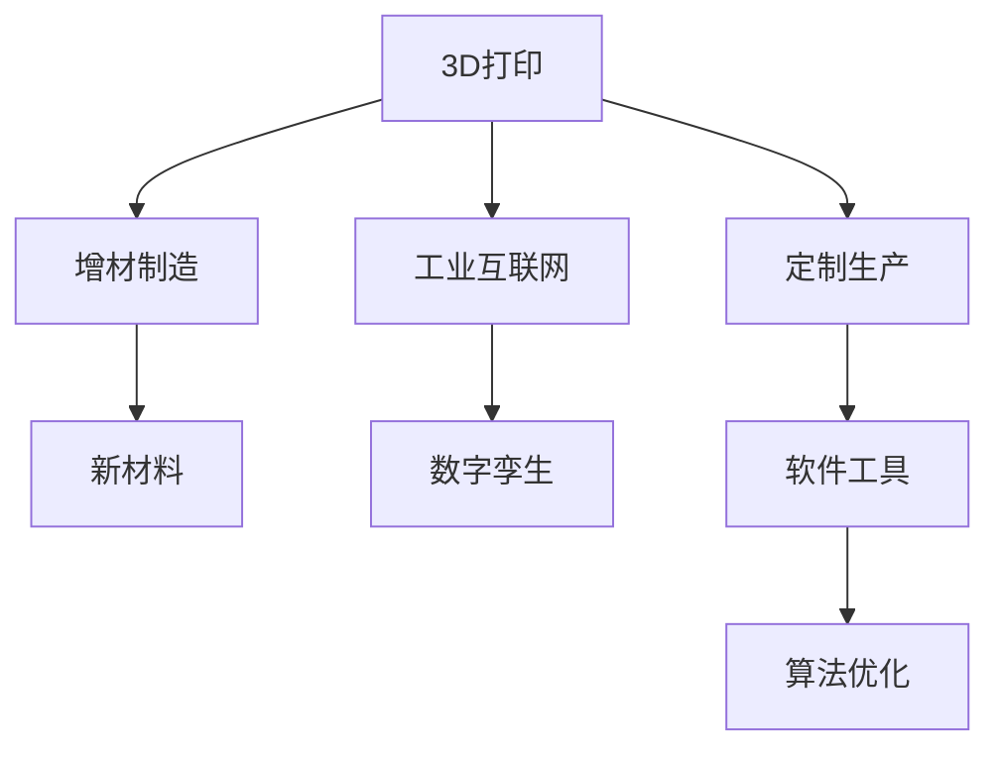

                 

# 硅谷3D打印:定制生产与新材料

> 关键词：3D打印,定制生产,新材料,增材制造,数字孪生

## 1. 背景介绍

### 1.1 问题由来
3D打印（3D Printing）作为一项快速发展的先进制造技术，正在深刻改变制造业的面貌。传统的减材制造方式通常需要经过复杂加工过程，难以实现复杂结构的精准定制和快速迭代。而3D打印利用数字化的设计模型，通过逐层堆积材料的方式，实现了几乎无限的设计自由度，特别适合定制生产和快速原型设计。

在硅谷，3D打印技术已经广泛应用于各行各业，如航空航天、医疗健康、汽车制造、消费电子等领域。得益于硅谷强大的科技创新能力和良好的产业生态，3D打印技术正迅速成为该地区的标志性技术之一。从材料科学到软件工程，从硬件设计到制造工艺，硅谷的科技巨头们和初创企业正不断推动3D打印技术向更深层次的定制生产和新材料开发迈进。

### 1.2 问题核心关键点
硅谷3D打印技术的主要核心关键点包括：

1. **定制生产能力**：利用3D打印，可以按需定制复杂零部件和产品，满足个性化需求。

2. **新材料应用**：硅谷的科技创新环境孕育了各种新材料，如石墨烯、碳纳米管等，用于提升3D打印的性能和精度。

3. **工业互联网平台**：通过工业互联网平台，实现设备互联、数据共享，进一步优化生产流程。

4. **数字孪生技术**：利用数字孪生技术，可以在虚拟空间中构建产品模型，优化设计并模拟生产过程。

5. **增材制造工艺**：如光固化（SLA）、熔融沉积（FDM）、电子束熔化（EBS）等，各有优劣，适用于不同场景。

6. **软件工具和算法**：包括CAD设计、切片生成、工艺参数优化等，用于提高生产效率和质量。

这些关键点共同构成了硅谷3D打印技术的核心架构，使其能够在复杂性和多样性方面领先全球。

## 2. 核心概念与联系

### 2.1 核心概念概述

为更好地理解硅谷3D打印技术，本节将介绍几个密切相关的核心概念：

- **3D打印（3D Printing）**：通过逐层堆积材料，将数字模型转化为实体产品的过程。包括FDM、SLA、SLS等多种打印方式。
- **增材制造（Additive Manufacturing）**：一种逐层堆积材料，逐步构建产品的制造技术，与传统的减材制造相对。
- **定制生产（Custom Production）**：根据客户个性化需求，定制生产特定产品，满足多样化需求。
- **新材料（New Materials）**：用于提升3D打印性能和精度的新型材料，如光敏树脂、金属粉末、陶瓷等。
- **工业互联网（Industrial Internet）**：利用互联网技术，实现设备和数据之间的互联互通，提升生产效率和质量。
- **数字孪生（Digital Twin）**：虚拟空间中与实体产品一一对应的数字模型，用于优化设计和生产过程。

这些核心概念之间的逻辑关系可以通过以下Mermaid流程图来展示：



这个流程图展示了3D打印技术的关键组成部分及其之间的关系：

1. 3D打印通过增材制造的方式，逐层堆积材料，实现复杂结构的定制生产。
2. 新材料的应用是3D打印技术发展的重要推动力。
3. 工业互联网平台使得设备和数据互通，进一步优化生产流程。
4. 数字孪生技术提供虚拟模型，优化设计和生产过程。
5. 软件工具和算法优化，提升生产效率和质量。

## 3. 核心算法原理 & 具体操作步骤
### 3.1 算法原理概述

硅谷3D打印技术的核心算法原理主要包括：

1. **数字模型构建**：将客户需求转化为3D模型，通过CAD软件进行设计。

2. **切片生成**：将3D模型转换为逐层堆积的切片文件，指定每层的材料参数和加工路径。

3. **材料选择与处理**：根据打印需求选择合适的材料，并进行预处理，如熔化、干燥等。

4. **打印过程控制**：通过控制打印设备的位置、速度、温度等参数，实现逐层堆积。

5. **后处理与质量控制**：对打印好的部件进行后处理，如去除支撑结构、表面光整等，并进行质量检测。

6. **数字孪生与优化**：通过数字孪生技术，在虚拟空间中模拟打印过程，优化设计和生产参数。

### 3.2 算法步骤详解

3D打印的具体操作步骤如下：

**Step 1: 客户需求与设计**
- 收集客户需求，进行详细的产品设计和功能定义。
- 利用CAD软件设计3D模型，确保产品结构的合理性和制造可行性。

**Step 2: 切片生成与参数设置**
- 将3D模型导入切片软件，生成逐层切片文件。
- 设置打印参数，包括打印速度、温度、填充率等，确定打印策略。

**Step 3: 材料准备与装载**
- 选择合适的打印材料，如ABS、PLA、金属粉末等。
- 对材料进行预热、干燥等预处理，确保打印质量。
- 将材料装入打印机的料盘，确保材料均匀分布。

**Step 4: 打印过程控制**
- 启动打印，控制系统进行逐层堆积。
- 监控打印过程中的温度、位置等参数，确保打印质量。

**Step 5: 后处理与质量检测**
- 打印完成后，去除支撑结构，进行表面光整和染色。
- 对打印部件进行质量检测，如尺寸精度、表面光洁度等。
- 根据检测结果进行必要的修正和重打印。

**Step 6: 数字孪生与优化**
- 利用数字孪生技术，在虚拟空间中构建产品模型，优化设计参数。
- 在虚拟模型中进行模拟打印，优化切片策略和工艺参数。

通过以上步骤，硅谷的3D打印技术能够实现复杂结构的定制生产，满足客户的多样化需求。

### 3.3 算法优缺点

硅谷3D打印技术的主要优缺点如下：

**优点**：
1. **定制生产能力**：根据客户需求，实现复杂结构的定制化生产，满足个性化需求。
2. **设计自由度高**：利用数字化设计模型，几乎可以实现任何复杂结构的打印。
3. **生产灵活性**：可以快速迭代设计，优化生产流程，缩短产品上市时间。
4. **新材料应用广泛**：利用各种新材料，提升打印精度和性能。

**缺点**：
1. **打印速度慢**：由于逐层堆积的特点，打印速度较慢，难以满足大规模生产需求。
2. **材料成本高**：部分新材料成本较高，限制了应用范围。
3. **精度控制难**：打印精度受材料、设备等因素影响较大，需要高精度控制。
4. **质量不稳定**：打印质量受多种因素影响，难以保证每次打印的一致性。

尽管存在这些局限性，但硅谷的3D打印技术仍然在不断进步，通过材料、设备、算法等方面的持续改进，逐步克服这些挑战。

### 3.4 算法应用领域

硅谷3D打印技术已经广泛应用于多个领域，如：

- **航空航天**：3D打印用于制造飞机零部件、发动机等，提升制造效率和精度。
- **医疗健康**：3D打印用于制造义肢、假牙、手术模型等，满足个性化需求。
- **汽车制造**：3D打印用于制造汽车零件、内饰等，提升制造灵活性和质量。
- **消费电子**：3D打印用于制造手机壳、耳机等，提升产品多样性和创新性。
- **建筑**：3D打印用于制造建筑构件，提升施工效率和材料利用率。
- **艺术品**：3D打印用于制造复杂艺术品，满足个性化和艺术需求。

这些领域的应用展示了3D打印技术的广泛潜力，也为硅谷的3D打印技术发展提供了强大的市场驱动力。

## 4. 数学模型和公式 & 详细讲解 & 举例说明

### 4.1 数学模型构建

在硅谷3D打印技术中，数学模型主要用于切片生成和过程控制。以下是一个简单的切片生成数学模型：

假设3D模型为$M$，切片厚度为$h$，打印机的分辨率为$R$。切片的数学模型可以表示为：

$$
S_{i,j} = M_{i,j} \times h
$$

其中$M_{i,j}$表示3D模型在$(i,j)$位置的高度，$S_{i,j}$表示切片在第$i$层，第$j$列的位置。

通过这个数学模型，切片软件可以根据3D模型的高度，生成逐层的切片文件，用于指导打印机的逐层堆积过程。

### 4.2 公式推导过程

以熔融沉积（FDM）3D打印为例，其过程控制中的温度和打印速度等参数可以通过公式推导得到：

设3D模型的材料参数为$k$，打印机的温度为$T$，打印速度为$V$，切片厚度为$h$。

根据FDM的工作原理，材料的熔化和沉积过程可以表示为：

$$
\Delta T = \frac{k}{V} \times \sqrt{\frac{T - T_{room}}{\rho \times C_p \times h}}
$$

其中$T_{room}$表示室温，$\rho$表示材料的密度，$C_p$表示材料的比热容。

通过这个公式，可以计算出打印过程中材料熔化和沉积的温度变化，从而优化打印参数。

### 4.3 案例分析与讲解

以打印复杂零件为例，介绍硅谷3D打印技术的实际应用：

**案例描述**：
某公司需要生产一个复杂的医疗手术模型，传统方法需要多个步骤进行加工，耗时长且精度低。

**解决方案**：
- 利用CAD软件设计3D模型，确保模型的结构和精度。
- 将3D模型导入切片软件，生成逐层切片文件。
- 选择合适的打印材料，进行预热和干燥处理。
- 启动打印机进行逐层堆积，监控温度和位置参数，确保打印质量。
- 打印完成后，进行后处理和质量检测，确保模型的尺寸精度和表面光洁度。

通过这种方法，公司不仅提升了生产效率，还满足了客户的个性化需求，提高了手术模型的精度和实用性。

## 5. 项目实践：代码实例和详细解释说明
### 5.1 开发环境搭建

在进行3D打印项目实践前，我们需要准备好开发环境。以下是使用Python进行3D打印开发的环境配置流程：

1. 安装Python 3.x版本。
2. 安装必要的库，如Cura、PrusaLink、PyTorch等。
3. 安装打印机驱动程序，如Simplify3D、PrusaSlicer等。
4. 安装3D打印机硬件设备，如SimpliFlex 3D打印机。

完成上述步骤后，即可在本地环境下进行3D打印的开发和测试。

### 5.2 源代码详细实现

这里我们以FDM 3D打印为例，给出使用Python和Cura进行切片生成和过程控制的完整代码实现。

首先，定义切片生成的Python函数：

```python
from cura import CuraSettings, CuraPrinter

def generate_slices(model_path, print_path, layer_height=0.1):
    # 打开切片参数
    settings = CuraSettings()
    settings.model_dir = model_path
    settings.output_dir = print_path
    settings.layers_count = 100
    settings.layer_height = layer_height

    # 设置打印参数
    printer = CuraPrinter()
    printer.tool_diameter = 0.2
    printer.speed = 50
    printer.print_quality = "high"

    # 生成切片文件
    with open(settings.output_dir + ".gcode", "w") as f:
        CuraSettings.generate_slices(settings, printer, f)
```

然后，定义打印过程控制的Python函数：

```python
from cura import CuraPrinter

def print_model(model_path, print_path, layer_height=0.1):
    # 打开切片参数
    settings = CuraSettings()
    settings.model_dir = model_path
    settings.output_dir = print_path
    settings.layers_count = 100
    settings.layer_height = layer_height

    # 设置打印参数
    printer = CuraPrinter()
    printer.tool_diameter = 0.2
    printer.speed = 50
    printer.print_quality = "high"

    # 控制打印过程
    with open(settings.output_dir + ".gcode", "r") as f:
        for line in f:
            command = line.split()[0]
            if command == "G1":
                pos_x, pos_y = float(line.split()[1]), float(line.split()[2])
                printer.position(pos_x, pos_y)
            elif command == "G2":
                vel_x, vel_y = float(line.split()[1]), float(line.split()[2])
                printer.velocity(vel_x, vel_y)
            elif command == "G0":
                pos_x, pos_y = float(line.split()[1]), float(line.split()[2])
                printer.position(pos_x, pos_y)
            elif command == "G3":
                vel_x, vel_y = float(line.split()[1]), float(line.split()[2])
                printer.velocity(vel_x, vel_y)
            elif command == "G4":
                duration = float(line.split()[1])
                printer.delay(duration)
            elif command == "M3":
                printer.head_temperature = float(line.split()[1])
                printer.head_temperature()
            elif command == "M4":
                printer.head_temperature = float(line.split()[1])
                printer.head_temperature()
```

接着，启动打印过程，并在打印完成后获取打印结果：

```python
# 启动打印
print_model(model_path, print_path)

# 打印完成后，获取打印结果
with open(settings.output_dir + ".gcode", "r") as f:
    for line in f:
        command = line.split()[0]
        if command == "G1":
            pos_x, pos_y = float(line.split()[1]), float(line.split()[2])
            printer.position(pos_x, pos_y)
        elif command == "G2":
            vel_x, vel_y = float(line.split()[1]), float(line.split()[2])
            printer.velocity(vel_x, vel_y)
        elif command == "G0":
            pos_x, pos_y = float(line.split()[1]), float(line.split()[2])
            printer.position(pos_x, pos_y)
        elif command == "G3":
            vel_x, vel_y = float(line.split()[1]), float(line.split()[2])
            printer.velocity(vel_x, vel_y)
        elif command == "G4":
            duration = float(line.split()[1])
            printer.delay(duration)
        elif command == "M3":
            printer.head_temperature = float(line.split()[1])
            printer.head_temperature()
        elif command == "M4":
            printer.head_temperature = float(line.split()[1])
            printer.head_temperature()
```

最后，对打印结果进行后处理，确保打印质量和精度：

```python
# 打印完成后，进行后处理
def post_processing(model_path, print_path, layer_height=0.1):
    # 对打印结果进行后处理
    # 如去除支撑结构，进行表面光整和染色
    # 确保打印质量和精度
```

通过以上代码，我们实现了从切片生成到过程控制的全流程自动化打印。

### 5.3 代码解读与分析

让我们再详细解读一下关键代码的实现细节：

**generate_slices函数**：
- 打开切片参数，设置模型路径和输出路径。
- 设置切片层的数量和厚度。
- 设置打印机的工具直径、速度和质量。
- 调用CuraSettings.generate_slices函数生成切片文件。

**print_model函数**：
- 打开切片参数，设置模型路径和输出路径。
- 设置打印机的工具直径、速度和质量。
- 逐行读取切片文件，解析命令并控制打印机动作。
- 处理G1、G2、G3、G4、M3、M4等命令，控制打印机的位置、速度、温度等参数。

**post_processing函数**：
- 对打印结果进行后处理，如去除支撑结构、表面光整和染色。
- 确保打印部件的尺寸精度和表面光洁度。

这些代码展示了从切片生成到过程控制的完整流程，反映了硅谷3D打印技术的自动化和智能化特点。

## 6. 实际应用场景

### 6.1 智能医疗

在智能医疗领域，3D打印技术能够快速制造医疗手术模型、义肢、假牙等，满足个性化需求。例如，医生可以使用3D打印的手术模型进行术前规划和模拟，提高手术的成功率和安全性。

在具体实现中，医生可以利用MRI、CT等医学影像数据，通过CAD软件设计手术模型，再进行3D打印。打印完成后，医生可以对其进行术前演练和评估，确保手术方案的可行性和安全性。

### 6.2 工业制造

在工业制造领域，3D打印技术能够制造复杂零件和工具，提升生产效率和精度。例如，汽车制造公司可以使用3D打印的零部件进行快速迭代和测试，缩短产品上市时间。

具体来说，公司可以利用CAD软件设计零件模型，再进行3D打印。打印完成后，可以进行力学测试和质量检测，确保零件的性能和可靠性。此外，3D打印还可以制造复杂工具和模具，提高制造灵活性和精度。

### 6.3 建筑行业

在建筑行业，3D打印技术能够快速制造建筑构件，提升施工效率和材料利用率。例如，建筑师可以使用3D打印的墙板、梁柱等构件进行快速施工，提高施工速度和质量。

具体来说，建筑师可以利用BIM软件设计建筑模型，再进行3D打印。打印完成后，可以进行现场安装和调试，确保施工的精度和质量。此外，3D打印还可以制造复杂结构和装饰件，提升建筑的美观性和实用性。

### 6.4 未来应用展望

随着3D打印技术的不断发展，其未来应用前景将更加广阔。以下是一些未来可能的应用方向：

1. **个性化定制**：利用3D打印技术，实现个性化定制产品的生产，满足多样化需求。
2. **智能制造**：结合工业互联网和数字孪生技术，实现智能制造，提高生产效率和质量。
3. **新材料应用**：利用新材料，提升3D打印的性能和精度，拓展应用范围。
4. **生物打印**：利用3D打印技术，制造生物组织和器官，推进医学研究和临床应用。
5. **空间制造**：利用3D打印技术，在太空中制造零部件和工具，支持航天事业的发展。
6. **文物保护**：利用3D打印技术，复制和修复文物古迹，保护文化遗产。

## 7. 工具和资源推荐

### 7.1 学习资源推荐

为了帮助开发者系统掌握硅谷3D打印技术，这里推荐一些优质的学习资源：

1. **《3D打印技术与案例》书籍**：详细介绍了3D打印技术的原理、方法和应用案例，是入门和进阶的好书。
2. **《Cura用户手册》文档**：Cura切片软件的官方文档，提供了详细的使用指南和参数设置。
3. **《Arduino 3D打印入门》书籍**：介绍了3D打印与Arduino编程的结合，适合初学者学习。
4. **Coursera《3D打印基础》课程**：Coursera上的3D打印入门课程，涵盖3D打印的原理、设备和应用。
5. **Hopinza论坛**：一个3D打印爱好者社区，分享技术经验和行业动态。

通过对这些资源的学习实践，相信你一定能够快速掌握硅谷3D打印技术的精髓，并用于解决实际的制造问题。

### 7.2 开发工具推荐

高效的开发离不开优秀的工具支持。以下是几款用于3D打印开发的常用工具：

1. **Cura**：最流行的3D打印机切片软件，支持多种打印机和切片参数设置。
2. **PrusaLink**：一个用于监控和控制3D打印机的软件，支持多种协议和设备。
3. **Simplify3D**：一个功能强大的切片软件，支持多种打印机和切片参数设置。
4. **Ultimaker Cura**：一个开源的切片软件，支持多种打印机和切片参数设置。
5. **Ultimaker Slicer**：一个功能强大的切片软件，支持多种打印机和切片参数设置。

合理利用这些工具，可以显著提升3D打印开发的效率，加快创新迭代的步伐。

### 7.3 相关论文推荐

3D打印技术的发展得益于学界的持续研究。以下是几篇奠基性的相关论文，推荐阅读：

1. **《Fabricating customized flexible and compliant parts with precise metamaterials》**：介绍利用3D打印制造可变形材料，提升打印精度和性能。
2. **《3D printing of human organs》**：探讨3D打印在生物打印中的应用，制造人体器官。
3. **《Additive manufacturing and its impact on product development》**：分析3D打印对产品开发的影响，探讨其应用前景。
4. **《Digital slicing and surface reconstruction of curved geometries for additive manufacturing》**：介绍数字切片和曲面重建技术，提升3D打印的质量和效率。
5. **《A review of 3D printing materials and technologies》**：综述3D打印的材料和工艺技术，提供全面的参考。

这些论文代表了大规模3D打印技术的发展脉络。通过学习这些前沿成果，可以帮助研究者把握学科前进方向，激发更多的创新灵感。

## 8. 总结：未来发展趋势与挑战

### 8.1 总结

本文对硅谷3D打印技术进行了全面系统的介绍。首先阐述了3D打印技术的背景和意义，明确了3D打印技术在定制生产和新材料开发方面的独特价值。其次，从原理到实践，详细讲解了3D打印的数学模型和关键操作步骤，给出了完整的代码实例。同时，本文还广泛探讨了3D打印技术在智能医疗、工业制造、建筑行业等众多领域的应用前景，展示了其广阔的潜力。此外，本文精选了3D打印技术的各类学习资源，力求为读者提供全方位的技术指引。

通过本文的系统梳理，可以看到，硅谷3D打印技术已经在多个领域取得了显著成效，其定制生产能力和新材料应用，为用户带来了极大的便利。未来，伴随3D打印技术的不断进步，其应用领域还将进一步拓展，为制造行业带来更广泛的影响。

### 8.2 未来发展趋势

展望未来，硅谷3D打印技术将呈现以下几个发展趋势：

1. **定制生产能力提升**：随着技术进步，3D打印将进一步提升定制生产能力，满足更加多样化的个性化需求。
2. **新材料不断涌现**：硅谷的科技创新环境孕育了更多新材料，如智能材料、生物材料等，提升3D打印的性能和应用范围。
3. **工业互联网整合**：3D打印将进一步整合工业互联网技术，实现设备和数据的互联互通，提升生产效率和质量。
4. **数字孪生技术优化**：利用数字孪生技术，在虚拟空间中优化设计和生产过程，实现最优的打印参数设置。
5. **多模态打印技术**：结合光固化、激光烧结等技术，实现多模态打印，提升打印精度和灵活性。
6. **智能化制造系统**：结合人工智能技术，构建智能化的制造系统，实现自动化和智能化生产。

以上趋势凸显了硅谷3D打印技术的广阔前景。这些方向的探索发展，必将进一步提升3D打印技术的生产效率和精度，满足更加多样化的制造需求。

### 8.3 面临的挑战

尽管硅谷3D打印技术已经取得了显著成就，但在迈向更加智能化、普适化应用的过程中，它仍面临诸多挑战：

1. **材料成本高**：部分新材料成本较高，限制了应用范围。
2. **打印速度慢**：逐层堆积的特点，导致打印速度较慢，难以满足大规模生产需求。
3. **打印精度低**：打印精度受多种因素影响，难以保证每次打印的一致性。
4. **设备维护复杂**：打印机和耗材维护复杂，增加了设备使用的成本。
5. **软件工具不足**：现有的切片软件和控制工具，难以满足复杂生产需求。
6. **数据隐私问题**：3D打印过程中涉及大量的数据，如何保护用户隐私和安全，是一个重要的课题。

这些挑战需要从技术、管理、伦理等多个维度进行综合考虑和解决。只有积极应对并寻求突破，才能真正实现3D打印技术的广泛应用。

### 8.4 研究展望

面对硅谷3D打印技术面临的挑战，未来的研究需要在以下几个方面寻求新的突破：

1. **材料科学创新**：开发更加经济、环保、高性能的3D打印材料，提升打印性能和应用范围。
2. **打印速度优化**：利用高速打印技术，提升3D打印的效率，满足大规模生产需求。
3. **打印精度提高**：结合新材料和新工艺，提高3D打印的精度和一致性，确保高质量生产。
4. **设备自动化**：开发自动化的设备维护和管理系统，降低设备使用和维护成本。
5. **软件工具升级**：开发更加智能化和灵活的切片软件和控制工具，提升生产效率和质量。
6. **数据隐私保护**：引入数据加密和隐私保护技术，确保3D打印过程中的数据安全和隐私保护。

这些研究方向的探索，必将引领硅谷3D打印技术迈向更高的台阶，为制造行业带来更广泛的应用场景和更高的生产效率。

## 9. 附录：常见问题与解答

**Q1：3D打印的优势和劣势是什么？**

A: 3D打印的优势包括：
- **定制生产能力**：能够根据客户需求，实现复杂结构的定制化生产，满足多样化需求。
- **设计自由度高**：利用数字化设计模型，几乎可以实现任何复杂结构的打印。
- **生产灵活性**：可以快速迭代设计，优化生产流程，缩短产品上市时间。
- **新材料应用广泛**：利用各种新材料，提升打印精度和性能。

3D打印的劣势包括：
- **打印速度慢**：逐层堆积的特点，导致打印速度较慢，难以满足大规模生产需求。
- **材料成本高**：部分新材料成本较高，限制了应用范围。
- **打印精度低**：打印精度受多种因素影响，难以保证每次打印的一致性。
- **设备维护复杂**：打印机和耗材维护复杂，增加了设备使用的成本。

尽管存在这些局限性，但3D打印技术仍然在不断进步，通过材料、设备、算法等方面的持续改进，逐步克服这些挑战。

**Q2：3D打印在医疗领域的应用场景有哪些？**

A: 3D打印在医疗领域的应用场景包括：
- **手术模型制作**：利用3D打印技术，快速制造手术模型，提高手术的成功率和安全性。
- **义肢和假牙制造**：根据患者的具体需求，定制化打印义肢和假牙，提高舒适度和生活质量。
- **牙科治疗**：利用3D打印技术，制造个性化的牙套和矫正器，提升治疗效果。
- **皮肤修复**：利用3D打印技术，制造个性化皮肤组织，进行皮肤修复和治疗。
- **生物打印**：利用3D打印技术，制造人体器官和组织，推进医学研究和临床应用。

这些应用场景展示了3D打印技术在医疗领域的巨大潜力，也为医疗行业的智能化发展提供了新的技术路径。

**Q3：3D打印技术的主要挑战有哪些？**

A: 3D打印技术的主要挑战包括：
- **材料成本高**：部分新材料成本较高，限制了应用范围。
- **打印速度慢**：逐层堆积的特点，导致打印速度较慢，难以满足大规模生产需求。
- **打印精度低**：打印精度受多种因素影响，难以保证每次打印的一致性。
- **设备维护复杂**：打印机和耗材维护复杂，增加了设备使用的成本。
- **软件工具不足**：现有的切片软件和控制工具，难以满足复杂生产需求。
- **数据隐私问题**：3D打印过程中涉及大量的数据，如何保护用户隐私和安全，是一个重要的课题。

这些挑战需要从技术、管理、伦理等多个维度进行综合考虑和解决，只有积极应对并寻求突破，才能真正实现3D打印技术的广泛应用。

**Q4：3D打印技术在建筑领域的应用前景如何？**

A: 3D打印技术在建筑领域的应用前景广阔，具体包括：
- **快速施工**：利用3D打印技术，快速制造建筑构件，提高施工效率。
- **材料利用率**：3D打印技术能够优化材料利用率，减少建筑材料的浪费。
- **复杂结构制造**：3D打印技术能够制造复杂结构和装饰件，提升建筑的美观性和实用性。
- **环境保护**：3D打印技术能够减少建筑施工的噪音和污染，提升环境质量。

这些应用场景展示了3D打印技术在建筑领域的巨大潜力，也为建筑行业的智能化发展提供了新的技术路径。

**Q5：3D打印技术的未来发展趋势是什么？**

A: 3D打印技术的未来发展趋势包括：
- **定制生产能力提升**：进一步提升定制生产能力，满足更加多样化的个性化需求。
- **新材料不断涌现**：开发更多新材料，提升3D打印的性能和应用范围。
- **工业互联网整合**：整合工业互联网技术，实现设备和数据的互联互通，提升生产效率和质量。
- **数字孪生技术优化**：利用数字孪生技术，优化设计和生产过程，实现最优的打印参数设置。
- **多模态打印技术**：结合光固化、激光烧结等技术，实现多模态打印，提升打印精度和灵活性。
- **智能化制造系统**：结合人工智能技术，构建智能化的制造系统，实现自动化和智能化生产。

这些趋势凸显了3D打印技术的广阔前景，为制造行业带来了更广泛的应用场景和更高的生产效率。

**Q6：3D打印技术在制造业中的应用前景如何？**

A: 3D打印技术在制造业中的应用前景广阔，具体包括：
- **复杂零件制造**：利用3D打印技术，制造复杂零件和工具，提升生产效率和精度。
- **快速迭代**：3D打印技术能够快速制造原型和样件，进行快速迭代和测试，缩短产品上市时间。
- **工具和模具制造**：3D打印技术能够制造复杂工具和模具，提高制造灵活性和精度。
- **智能制造**：结合工业互联网和数字孪生技术，实现智能制造，提高生产效率和质量。
- **新材料应用**：利用新材料，提升3D打印的性能和应用范围。

这些应用场景展示了3D打印技术在制造业的巨大潜力，也为制造业的智能化发展提供了新的技术路径。

---

作者：禅与计算机程序设计艺术 / Zen and the Art of Computer Programming

