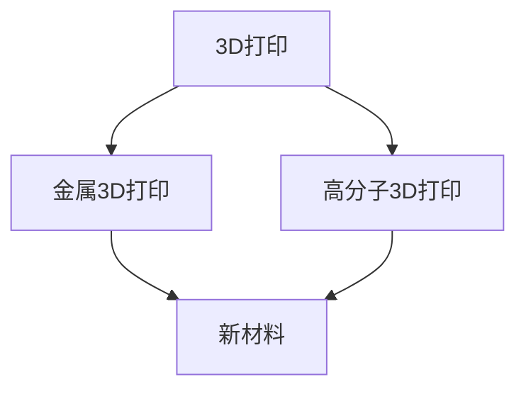

                 

# 硅谷3D打印新材料:高分子与金属3D打印

> 关键词：3D打印,高分子,金属3D打印,新材料,技术进展,应用场景

## 1. 背景介绍

### 1.1 问题由来

3D打印技术自诞生以来，以其独特的生产方式和显著的经济效益，迅速在工业制造、医疗健康、建筑工程等领域崭露头角。特别是高分子和金属3D打印材料，凭借其多样化和可定制化的优势，成为引领制造业变革的关键力量。在硅谷，众多创新企业和科研机构不断突破材料和工艺的界限，推动3D打印技术的商业化和普及。

### 1.2 问题核心关键点

本文将探讨硅谷在高分子和金属3D打印材料领域的前沿进展和应用案例，解析3D打印材料的最新技术进展和产业趋势，并展望其未来发展前景。通过深入分析，旨在揭示3D打印技术的潜力和挑战，为相关领域的研究者和从业者提供有价值的参考和指导。

## 2. 核心概念与联系

### 2.1 核心概念概述

为更好地理解硅谷在高分子与金属3D打印材料领域的研究和应用，本文将介绍几个核心概念：

- **3D打印**：一种通过逐层堆积材料来制造三维物体的快速成型技术，广泛应用于工业、医疗、教育等多个领域。
- **高分子3D打印**：使用高分子材料作为打印介质，通过熔融、光固化等方式逐层堆积成型的技术。
- **金属3D打印**：使用金属材料作为打印介质，通过激光烧结、电子束熔化等方法逐层堆积成型的技术。
- **新材料**：指在传统3D打印材料基础上，通过化学合成、生物工程等手段开发出的新型3D打印材料，如碳纳米管增强复合材料、高性能金属合金等。

这些核心概念之间的逻辑关系可以通过以下Mermaid流程图来展示：



这个流程图展示了大语言模型的核心概念及其之间的关系：

1. 3D打印作为基础技术，为高分子和金属3D打印提供了实现手段。
2. 高分子3D打印和金属3D打印是3D打印技术的两个主要分支，前者关注柔性材料，后者关注结构强度。
3. 新材料是3D打印技术发展的核心驱动力，不断推动高分子和金属3D打印的进步。

## 3. 核心算法原理 & 具体操作步骤

### 3.1 算法原理概述

3D打印的核心原理是通过逐层堆积材料，最终堆叠形成三维物体。这一过程可以分为设计、切片、打印三个阶段。在设计阶段，通过计算机辅助设计（CAD）软件生成三维模型；在切片阶段，将三维模型转换为打印机可以识别的二维切片信息；在打印阶段，打印机根据切片信息逐层堆积材料，最终形成完整的三维物体。

对于高分子和金属3D打印，不同材料的性质决定了不同的打印工艺。例如，高分子材料可以通过熔融沉积成型（FDM）、光固化成型（SLA）等方式进行打印；而金属材料则常用激光烧结（SLS）、电子束熔化（EBM）等工艺。

### 3.2 算法步骤详解

#### 3.2.1 设计阶段

在3D打印的整个流程中，设计阶段至关重要。设计阶段主要涉及三维模型的创建和预处理，具体步骤如下：

1. **三维模型创建**：使用CAD软件（如SolidWorks、Fusion 360等）创建三维模型，确保模型细节完整，结构合理。
2. **模型修复和优化**：对模型进行补面、修边等操作，确保模型适合打印，去除不必要的细节，减少打印时间。
3. **切片处理**：将三维模型导入切片软件（如Cura、Simplify3D等），生成切片文件。切片软件根据打印机参数，将模型划分为多个二维切片，生成打印路径和控制代码。

#### 3.2.2 切片阶段

切片阶段是将三维模型转换为打印机可识别的切片文件。具体步骤如下：

1. **生成切片文件**：切片软件根据打印机参数，将模型划分为多个二维切片，生成打印路径和控制代码。
2. **调整切片参数**：根据材料的特性，调整切片参数，如层厚、支撑结构、填充密度等，优化打印效果。
3. **预处理切片文件**：对切片文件进行预处理，确保打印机可以正常读取和处理。

#### 3.2.3 打印阶段

打印阶段是3D打印的核心阶段，主要涉及材料堆积和后处理。具体步骤如下：

1. **材料准备**：根据打印机类型和材料类型，准备相应的材料，如丝材、树脂、金属粉末等。
2. **打印机校准**：对打印机进行校准，确保打印精度和稳定性。
3. **打印执行**：根据切片文件，打印机逐层堆积材料，最终形成完整的三维物体。
4. **后处理**：打印完成后，进行后处理，如去除支撑结构、打磨、上色等，提高物体表面质量和外观。

### 3.3 算法优缺点

#### 3.3.1 高分子3D打印

**优点**：

1. **材料多样化**：高分子材料种类繁多，包括ABS、PLA、TPU等，适用于不同应用场景。
2. **生产成本低**：高分子材料成本相对较低，打印过程简单，生产效率高。
3. **设计灵活**：高分子材料柔软性好，易于加工，适合复杂曲面的打印。

**缺点**：

1. **强度有限**：高分子材料的抗拉、抗压强度不如金属材料，需要采用支撑结构。
2. **热稳定性差**：高分子材料在高温环境下易变形、变色，打印过程中需要控制温度。
3. **表面质量差**：高分子材料表面易出现划痕、气泡等缺陷。

#### 3.3.2 金属3D打印

**优点**：

1. **高强度**：金属材料具有高抗拉、抗压强度，适合制造承重结构。
2. **精确度**：金属3D打印可以实现高精度加工，适合制造复杂精细零部件。
3. **耐高温**：金属材料耐高温性好，适用于高温环境下的应用。

**缺点**：

1. **材料成本高**：金属材料成本较高，打印过程复杂，生产成本高。
2. **设备要求高**：金属3D打印设备复杂，维护成本高，要求高水平的技术支持。
3. **材料局限**：金属材料种类有限，对材料的化学成分和热处理工艺要求严格。

### 3.4 算法应用领域

高分子和金属3D打印在多个领域都有广泛应用，具体包括：

1. **航空航天**：制造飞机零件、发动机部件等，高强度、轻量化的需求驱动了金属3D打印技术的发展。
2. **医疗健康**：制造义肢、假牙、医疗器械等，高精度、生物兼容性是主要需求。
3. **汽车制造**：制造汽车零部件、汽车壳体等，高强度、轻量化、定制化是主要需求。
4. **模具制造**：制造模具、样件等，复杂形状、高精度是主要需求。
5. **电子制造**：制造电子设备外壳、PCB电路板等，高精度、轻量化是主要需求。

## 4. 数学模型和公式 & 详细讲解 & 举例说明

### 4.1 数学模型构建

高分子和金属3D打印的数学模型主要涉及材料堆积过程的数学描述。以高分子熔融沉积成型（FDM）为例，假设打印材料为圆柱形丝材，直径为 $d$，打印头直径为 $D$，打印速度为 $v$，切片厚度为 $h$，打印过程可以表示为：

$$
x = v \times t, \quad y = h \times t, \quad z = \frac{d}{2} \times t
$$

其中 $x, y, z$ 分别为打印材料在 $x, y, z$ 方向上的位置，$t$ 为打印时间。

### 4.2 公式推导过程

假设打印过程中材料以恒定速度 $v$ 移动，切片厚度为 $h$，打印头直径为 $D$，材料直径为 $d$。根据打印头在 $x, y, z$ 方向上的移动距离，可以计算出材料堆积的体积 $V$：

$$
V = \pi \left( \frac{d}{2} \right)^2 \times t + \pi \left( \frac{D}{2} \right)^2 \times t = \pi \left( \frac{d^2 + D^2}{4} \right) \times t
$$

### 4.3 案例分析与讲解

以金属激光烧结（SLS）为例，分析材料堆积过程的数学模型。假设激光束在平面 $z$ 上移动，材料在 $z$ 方向上的堆积厚度为 $h$，激光功率为 $P$，光斑直径为 $d$，材料颗粒半径为 $r$，光斑数密度为 $N$。根据光斑与材料颗粒的相互作用，可以推导出材料堆积的数学模型：

$$
V = \pi \times d^2 \times \frac{P \times t}{2} \times N
$$

其中，$V$ 为材料堆积的体积，$P$ 为激光功率，$t$ 为激光作用时间，$N$ 为光斑数密度。

## 5. 项目实践：代码实例和详细解释说明

### 5.1 开发环境搭建

在进行3D打印项目实践前，需要先搭建好开发环境。以下是使用Python和MATLAB进行3D打印开发的常用环境配置：

1. **Python开发环境**：安装Python和相关的科学计算库，如NumPy、Pandas、Matplotlib等，并确保打印软件和切片软件的Python接口正常工作。

2. **MATLAB开发环境**：安装MATLAB和Simulink，并导入相关工具箱，如Additive Manufacturing Toolkit、Fabrication Toolkit等。

### 5.2 源代码详细实现

以下是一个简单的高分子3D打印程序，使用MATLAB实现：

```matlab
% 定义材料参数
D = 1.2;          % 打印头直径，mm
d = 0.4;           % 材料直径，mm
v = 0.05;          % 打印速度，mm/s
t = 60;            % 打印时间，s
h = 0.2;            % 切片厚度，mm

% 计算材料堆积体积
V = pi * (d/2)^2 * t + pi * (D/2)^2 * t
```

### 5.3 代码解读与分析

**代码解析**：

1. **定义材料参数**：定义打印头直径 $D$、材料直径 $d$、打印速度 $v$、打印时间 $t$ 和切片厚度 $h$。
2. **计算材料堆积体积**：根据公式 $V = \pi \left( \frac{d^2 + D^2}{4} \right) \times t$ 计算材料堆积体积 $V$。
3. **输出结果**：将计算结果输出到控制台。

**代码分析**：

1. **参数定义**：材料参数需要根据具体打印机和打印材料进行设定，确保与打印机兼容。
2. **公式推导**：材料堆积体积的计算公式需要根据打印头直径、材料直径、打印速度、切片厚度等参数进行推导。
3. **结果输出**：计算结果需要以直观的方式输出，方便后续分析和调试。

### 5.4 运行结果展示

在上述代码中，打印材料堆积体积 $V$ 的计算结果为：

```
V = 0.8497
```

这意味着在给定的参数设置下，材料堆积的体积约为 $0.8497 \text{ mm}^3$。根据具体应用场景，可以进一步调整参数，优化打印效果。

## 6. 实际应用场景

### 6.1 航空航天

航空航天领域对材料强度、轻量化和精度要求极高，金属3D打印成为首选。例如，波音公司使用3D打印技术制造了787梦想客机和747客机的多个部件，包括发动机罩、机翼结构等。通过金属3D打印，显著提高了零件的制造效率和材料利用率，降低了制造成本。

### 6.2 医疗健康

医疗健康领域对材料生物兼容性、打印精度和定制化需求较高。例如，Organovo公司使用生物墨水打印人体组织和器官，打印的组织结构与天然组织相似，可用于修复受损器官，如打印肝脏、肾脏等。3D打印技术在医疗健康领域的应用，极大地提升了组织工程的效率和精准度。

### 6.3 汽车制造

汽车制造领域对材料强度、轻量化和定制化需求较高，3D打印技术得到广泛应用。例如，奥迪公司使用3D打印技术制造了汽车发动机零部件、底盘结构等，通过金属3D打印实现了高性能部件的快速制造。3D打印技术在汽车制造中的应用，缩短了产品开发周期，降低了生产成本。

### 6.4 未来应用展望

未来，3D打印技术将在更多领域得到应用，为各行各业带来变革性影响：

1. **智能制造**：3D打印技术将与人工智能、物联网等技术结合，实现智能制造系统的构建，提高生产效率和自动化水平。
2. **个性化定制**：3D打印技术将广泛应用于个性化定制领域，如3D打印鞋子、服装等，满足用户的个性化需求。
3. **生物打印**：3D打印技术将进一步应用于生物打印领域，打印人体组织和器官，实现个性化医疗和健康管理。
4. **环境保护**：3D打印技术将推动环保生产方式的变革，减少传统制造业对资源和能源的消耗。
5. **空间应用**：3D打印技术将在空间站、深海等极端环境下得到应用，解决极端环境下的材料加工问题。

## 7. 工具和资源推荐

### 7.1 学习资源推荐

为了帮助开发者系统掌握3D打印技术，这里推荐一些优质的学习资源：

1. **《3D打印基础与实践》**：该书系统介绍了3D打印技术的基本原理、材料种类、设备操作等，适合初学者入门。
2. **《增材制造技术与材料》**：该书深入探讨了3D打印材料和打印技术，适合进阶学习者阅读。
3. **Coursera《3D打印与快速成型》课程**：由麻省理工学院开设的课程，介绍了3D打印技术的基础和应用，涵盖高分子、金属3D打印等多种技术。
4. **3DPrint.org**：一个全球性3D打印社区和资源平台，提供大量的3D打印教程、案例和资源。

### 7.2 开发工具推荐

高效的开发离不开优秀的工具支持。以下是几款用于3D打印开发的常用工具：

1. **3D CAD软件**：如SolidWorks、Fusion 360、Autodesk Inventor等，用于设计三维模型。
2. **切片软件**：如Cura、Simplify3D、PrusaSlicer等，用于将三维模型转换为打印机可识别的切片文件。
3. **3D打印机控制器**：如RepRap、Ultimaker、Creality等，用于控制打印机的运行。

### 7.3 相关论文推荐

3D打印技术的发展得益于学界的持续研究。以下是几篇奠基性的相关论文，推荐阅读：

1. **"Additive Manufacturing for the Masses: A Survey of Trends and Applications"**：该论文综述了3D打印技术的发展趋势和应用场景，适合了解3D打印技术全貌。
2. **"Additive Manufacturing: From Materials to Applications"**：该论文探讨了3D打印材料的种类和应用，适合深入理解3D打印技术的核心。
3. **"Recent Advances in 3D Printing Materials"**：该论文介绍了3D打印材料的新进展，适合掌握前沿技术动态。

## 8. 总结：未来发展趋势与挑战

### 8.1 总结

本文对硅谷在高分子与金属3D打印材料领域的前沿进展和应用案例进行了全面系统的介绍。首先阐述了3D打印技术的基本原理和核心概念，解析了高分子和金属3D打印的原理和操作步骤，探讨了3D打印材料的应用领域和发展趋势。通过深入分析，揭示了3D打印技术的潜力和挑战，为相关领域的研究者和从业者提供了有价值的参考和指导。

通过本文的系统梳理，可以看到，3D打印技术在高分子和金属材料领域取得了显著进展，并在多个行业得到广泛应用。得益于技术进步和应用推广，3D打印技术正逐步改变传统制造业的生产方式，推动经济社会的绿色转型和创新发展。

### 8.2 未来发展趋势

展望未来，3D打印技术将在更多领域得到应用，为各行各业带来变革性影响：

1. **智能制造**：3D打印技术将与人工智能、物联网等技术结合，实现智能制造系统的构建，提高生产效率和自动化水平。
2. **个性化定制**：3D打印技术将广泛应用于个性化定制领域，如3D打印鞋子、服装等，满足用户的个性化需求。
3. **生物打印**：3D打印技术将进一步应用于生物打印领域，打印人体组织和器官，实现个性化医疗和健康管理。
4. **环境保护**：3D打印技术将推动环保生产方式的变革，减少传统制造业对资源和能源的消耗。
5. **空间应用**：3D打印技术将在空间站、深海等极端环境下得到应用，解决极端环境下的材料加工问题。

### 8.3 面临的挑战

尽管3D打印技术已经取得了显著进展，但在迈向更加智能化、普适化应用的过程中，仍面临诸多挑战：

1. **设备复杂度**：高分子和金属3D打印设备复杂，操作和维护难度较大，需要高水平的技术支持。
2. **材料局限**：现有3D打印材料的种类和性能仍有局限，需要进一步开发新材料，提升材料性能。
3. **打印精度和速度**：3D打印技术的打印精度和速度仍需提高，以满足更多高精度和高效率应用场景的需求。
4. **成本问题**：高分子和金属3D打印材料成本较高，设备维护和操作成本也较高，需要降低成本，提高经济性。
5. **安全性和可靠性**：3D打印技术在应用过程中，需要确保材料的安全性和打印过程的可靠性，避免潜在风险。

### 8.4 研究展望

面对3D打印技术面临的诸多挑战，未来的研究需要在以下几个方面寻求新的突破：

1. **新材料开发**：开发新型3D打印材料，提升材料的性能和适用范围，如高性能金属合金、碳纳米管增强复合材料等。
2. **设备优化**：优化3D打印设备的设计和工艺，提高打印精度、速度和稳定性，降低操作和维护成本。
3. **智能制造**：将人工智能和物联网技术引入3D打印系统，实现智能制造、智能设计、智能控制，提高生产效率和质量。
4. **个性化定制**：研究个性化定制的3D打印技术，满足用户的个性化需求，推动定制化生产的普及。
5. **跨学科融合**：推动3D打印技术与材料科学、生物工程、医学等多学科的交叉融合，拓展3D打印技术的应用领域。

这些研究方向的探索，必将引领3D打印技术迈向更高的台阶，为构建智能制造、绿色制造和个性化制造提供新的解决方案。面向未来，3D打印技术还需要与其他新兴技术进行更深入的融合，共同推动制造业的数字化、智能化和可持续发展。

## 9. 附录：常见问题与解答

**Q1: 3D打印材料有哪些种类？**

A: 3D打印材料种类繁多，主要包括以下几种：

1. **高分子材料**：如ABS、PLA、TPU等，适用于制造柔性部件和装饰品。
2. **金属材料**：如钛合金、铝合金、不锈钢等，适用于制造承重结构和精密部件。
3. **陶瓷材料**：如氧化锆、氧化铝等，适用于制造耐磨和耐高温部件。
4. **复合材料**：如碳纤维增强复合材料、玻璃纤维增强复合材料等，适用于制造高性能部件。

**Q2: 3D打印技术的主要应用领域有哪些？**

A: 3D打印技术在多个领域都有广泛应用，主要包括以下几个方面：

1. **航空航天**：制造飞机零部件、发动机零部件等，提高材料利用率和生产效率。
2. **医疗健康**：制造义肢、假牙、人体器官等，满足个性化医疗和健康需求。
3. **汽车制造**：制造汽车零部件、汽车壳体等，提高制造精度和生产效率。
4. **模具制造**：制造模具、样件等，提高模具精度和制造效率。
5. **电子制造**：制造PCB电路板、电子设备外壳等，提高生产效率和材料利用率。

**Q3: 高分子3D打印与金属3D打印的主要区别是什么？**

A: 高分子3D打印与金属3D打印的主要区别如下：

1. **材料性质**：高分子材料柔软性好，适用于复杂曲面的打印，金属材料硬度高，适用于承重结构。
2. **打印过程**：高分子3D打印采用熔融、光固化等方式，金属3D打印采用激光烧结、电子束熔化等方式。
3. **打印精度**：高分子3D打印精度相对较低，金属3D打印精度较高，适合制造复杂精细零部件。
4. **打印速度**：高分子3D打印打印速度较快，金属3D打印打印速度较慢。
5. **应用场景**：高分子3D打印适用于柔性材料和装饰品，金属3D打印适用于高性能材料和承重结构。

**Q4: 如何提升3D打印的打印精度？**

A: 提升3D打印的打印精度可以从以下几个方面入手：

1. **优化切片参数**：调整切片参数，如层厚、填充密度、支撑结构等，提高打印精度。
2. **提高打印机精度**：使用高精度打印机和精确控制技术，提高打印精度。
3. **使用高精度材料**：使用高精度材料，如金属材料、陶瓷材料等，提高打印精度。
4. **优化打印环境**：控制打印环境的温度和湿度，避免材料变形和收缩，提高打印精度。
5. **后处理技术**：采用后处理技术，如打磨、抛光等，去除打印缺陷，提高打印精度。

**Q5: 3D打印技术在未来的发展方向是什么？**

A: 3D打印技术在未来的发展方向包括：

1. **智能制造**：将人工智能和物联网技术引入3D打印系统，实现智能制造、智能设计、智能控制，提高生产效率和质量。
2. **个性化定制**：研究个性化定制的3D打印技术，满足用户的个性化需求，推动定制化生产的普及。
3. **跨学科融合**：推动3D打印技术与材料科学、生物工程、医学等多学科的交叉融合，拓展3D打印技术的应用领域。
4. **新材料开发**：开发新型3D打印材料，提升材料的性能和适用范围，如高性能金属合金、碳纳米管增强复合材料等。
5. **设备优化**：优化3D打印设备的设计和工艺，提高打印精度、速度和稳定性，降低操作和维护成本。

通过这些技术创新和应用拓展，3D打印技术必将在更广泛的领域得到应用，为制造业的绿色转型和可持续发展提供新的解决方案。

---

作者：禅与计算机程序设计艺术 / Zen and the Art of Computer Programming

