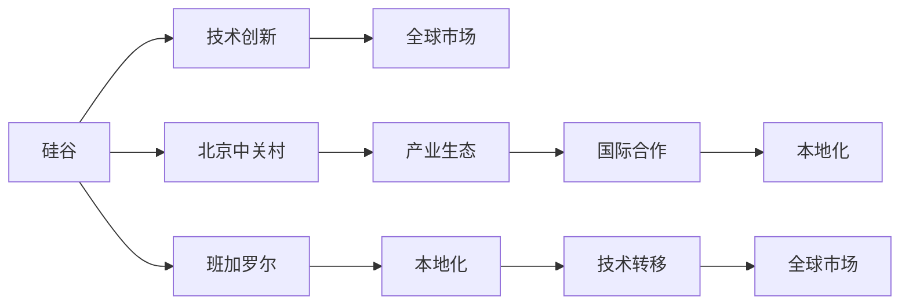

                 

# 硅谷的竞争对手:中国、印度等新兴力量

在过去几十年里，硅谷一直是全球科技创新和创业活动的中心，引领着全球信息技术的发展方向。然而，随着全球经济格局的深刻变化和科技创新的不断推进，中国的北京中关村、印度的班加罗尔等地正在崛起，成为硅谷强大的竞争对手。

本文将从技术创新、产业生态、国际合作等多个维度深入分析中国、印度等新兴力量对硅谷的挑战，并探讨其崛起背后的原因。同时，我们还将展望未来的竞争态势，为硅谷和全球科技行业提供有价值的见解和建议。

## 1. 背景介绍

### 1.1 竞争格局
硅谷长期以来在科技创新的多个领域都保持着领先地位。从个人电脑到互联网，从移动通信到社交媒体，硅谷的企业和技术一直在全球范围内引领着潮流。然而，随着全球经济重心向亚洲转移，以及新兴技术创新的涌现，硅谷传统的科技垄断地位受到了前所未有的挑战。

### 1.2 新兴力量的崛起
过去十年，中国和印度在科技领域的投入和创新速度显著提升，成为硅谷不可忽视的竞争对手。中国在5G、人工智能、大数据等领域取得突破，而在印度，信息技术和软件服务(IT & ICT)行业的发展迅速，其庞大的英语用户群体为技术创新提供了便利。

## 2. 核心概念与联系

### 2.1 核心概念概述

为更好地理解硅谷与中国、印度等新兴力量之间的竞争关系，本节将介绍几个关键概念：

- **硅谷**：位于美国加利福尼亚州旧金山湾区，全球科技创新和创业活动的中心。
- **北京中关村**：中国的科技创新中心，聚集了大量的高科技企业，特别是在人工智能、大数据、半导体等领域。
- **班加罗尔**：印度的IT & ICT中心，吸引了众多全球科技公司在此设立研发中心和办公室。
- **全球化与本地化**：全球科技公司在国际市场拓展的同时，需要在本地市场进行适应和优化。
- **技术转移**：先进技术从创新中心向其他地区传播和应用的过程。
- **产业生态**：围绕科技创新的企业、大学、研究机构和基础设施形成的相互依存和协作网络。

这些概念之间的逻辑关系可以通过以下Mermaid流程图来展示：



这个流程图展示了几大关键概念及其之间的关系：

1. 硅谷通过技术创新引领全球市场。
2. 中国和印度通过构建本地化的产业生态，吸引全球科技公司的投资和合作。
3. 技术从硅谷向中国、印度等地转移，并在此地生根发芽。
4. 新兴力量在本地化过程中进行优化，进一步提升全球竞争力。

## 3. 核心算法原理 & 具体操作步骤

### 3.1 算法原理概述

硅谷与中国、印度等新兴力量的竞争，本质上是一场技术与产业生态的全方位竞争。其中，技术创新是竞争的核心，而产业生态和国际合作则提供了必要的支持。

#### 3.1.1 技术创新

技术创新是硅谷长期以来的核心优势。通过持续的技术突破，硅谷保持在全球科技前沿的地位。这种技术优势的维持，需要不断的研发投入、专利保护和人才流动。

#### 3.1.2 产业生态

产业生态是支撑技术创新的重要基础。硅谷拥有大量的风险投资、创业孵化器和大学研究机构，形成了完善的创新生态系统。这些生态系统不仅能够吸引全球顶尖人才，还能促进技术的快速商业化。

#### 3.1.3 国际合作

国际合作是硅谷获取全球资源和技术的重要手段。通过与全球各地的科研机构和企业合作，硅谷能够在全球范围内获取最新的技术资源，推动自身的技术创新。

### 3.2 算法步骤详解

基于上述核心算法原理，我们可以将硅谷与中国、印度等新兴力量之间的竞争分解为以下几个关键步骤：

#### 3.2.1 技术创新的持续投入

硅谷在全球范围内保持技术领先地位的关键在于持续的研发投入和专利保护。通过不断的技术创新，硅谷能够在全球市场占据主导地位。

#### 3.2.2 构建本地化的产业生态

中国和印度在吸引全球科技公司的同时，也积极构建本地化的产业生态。通过投资大学、研究机构和企业孵化器，这些新兴力量能够在本地培养出更多高素质的人才，形成自我可持续的发展动力。

#### 3.2.3 积极参与国际合作

硅谷和新兴力量都积极参与全球科技合作。通过与全球各地的科研机构和企业合作，硅谷能够获取最新的技术资源，而新兴力量则能够通过合作提升自己的技术水平。

### 3.3 算法优缺点

硅谷与中国、印度等新兴力量的竞争具有以下优点：

1. 持续的技术创新：硅谷的技术创新能力一直处于全球领先地位，能够不断推出新的技术和产品。
2. 完善的产业生态：硅谷拥有大量的风险投资和创业孵化器，能够快速将技术商业化。
3. 广泛的国际合作：硅谷与全球各地的科研机构和企业合作，获取全球资源。

同时，这些新兴力量的崛起也带来了一些挑战：

1. 创新环境的不确定性：新兴力量在快速发展过程中，可能会面临技术和管理上的挑战。
2. 知识产权纠纷：新兴力量在快速崛起的过程中，可能会遭遇硅谷的专利和技术壁垒。
3. 市场竞争激烈：新兴力量和硅谷在多个市场领域展开竞争，可能导致市场份额的重新分配。

### 3.4 算法应用领域

硅谷与中国、印度等新兴力量之间的竞争，涵盖了以下几个主要领域：

1. **人工智能与机器学习**：人工智能和大数据技术在多个领域得到应用，硅谷和新兴力量都在积极布局。
2. **5G与通信技术**：5G技术是未来通信的基础，硅谷和中国在5G领域的竞争异常激烈。
3. **半导体与芯片技术**：芯片和半导体技术是现代信息技术的核心，硅谷和中国在这方面的竞争尤为激烈。
4. **软件与云计算**：硅谷在软件和云计算领域保持领先，但新兴力量在移动应用和软件开发上也表现出色。
5. **金融科技**：硅谷在金融科技领域保持领先，但新兴力量在金融科技创新的速度和规模上逐渐赶上。

## 4. 数学模型和公式 & 详细讲解 & 举例说明

### 4.1 数学模型构建

为了更好地理解硅谷与中国、印度等新兴力量之间的竞争关系，我们构建如下数学模型：

假设硅谷的创新能力为 \( I_S \)，中国和印度的创新能力分别为 \( I_C \) 和 \( I_I \)。设定全球市场规模为 \( M \)，硅谷在全球市场中的份额为 \( S \)，新兴力量在中国和印度市场中的份额分别为 \( C \) 和 \( I \)。

数学模型可以表示为：

$$ M = S \cdot I_S + C \cdot I_C + I \cdot I_I $$

其中，\( S \)、\( C \) 和 \( I \) 分别表示硅谷、中国和印度在全球市场的份额。

### 4.2 公式推导过程

通过上述模型，我们可以推导出硅谷与新兴力量之间竞争关系的数学表达。首先，硅谷的全球市场份额 \( S \) 可以表示为：

$$ S = \frac{I_S}{I_S + I_C + I_I} $$

中国和印度的市场份额 \( C \) 和 \( I \) 可以表示为：

$$ C = \frac{I_C}{I_S + I_C + I_I} $$
$$ I = \frac{I_I}{I_S + I_C + I_I} $$

将这些表达式代入市场规模的公式中，我们可以得到：

$$ M = S \cdot I_S + C \cdot I_C + I \cdot I_I = \frac{I_S^2}{I_S + I_C + I_I} + \frac{I_C^2}{I_S + I_C + I_I} + \frac{I_I^2}{I_S + I_C + I_I} $$

通过上述公式，我们可以分析硅谷和新兴力量在市场上的竞争态势。

### 4.3 案例分析与讲解

以人工智能技术为例，硅谷和中国在人工智能领域的竞争尤为激烈。美国和中国在人工智能专利数量和技术应用上都有显著优势。根据相关数据，2019年，美国和中国的AI专利数量分别为90,390和50,529。

此外，中国的AI市场应用也在快速增长。根据IDC的报告，中国AI市场的支出在2019年达到了145亿美元，预计到2023年将增长到317亿美元。

通过分析这些数据，我们可以发现，尽管硅谷在技术创新方面占据优势，但中国在AI市场的应用和发展速度上表现出色，逐渐缩小了与硅谷的差距。

## 5. 项目实践：代码实例和详细解释说明

### 5.1 开发环境搭建

在项目实践前，我们需要准备好开发环境。以下是使用Python进行PyTorch开发的环境配置流程：

1. 安装Anaconda：从官网下载并安装Anaconda，用于创建独立的Python环境。

2. 创建并激活虚拟环境：
```bash
conda create -n pytorch-env python=3.8 
conda activate pytorch-env
```

3. 安装PyTorch：根据CUDA版本，从官网获取对应的安装命令。例如：
```bash
conda install pytorch torchvision torchaudio cudatoolkit=11.1 -c pytorch -c conda-forge
```

4. 安装Transformers库：
```bash
pip install transformers
```

5. 安装各类工具包：
```bash
pip install numpy pandas scikit-learn matplotlib tqdm jupyter notebook ipython
```

完成上述步骤后，即可在`pytorch-env`环境中开始项目实践。

### 5.2 源代码详细实现

这里我们以深度学习模型的训练为例，给出使用Transformers库进行项目实践的PyTorch代码实现。

首先，定义训练函数：

```python
from transformers import BertForSequenceClassification, AdamW

def train_model(model, train_dataset, validation_dataset, epochs, batch_size, learning_rate):
    optimizer = AdamW(model.parameters(), lr=learning_rate)
    
    for epoch in range(epochs):
        model.train()
        for batch in train_dataset:
            inputs = batch['input_ids'].to(device)
            attention_mask = batch['attention_mask'].to(device)
            labels = batch['labels'].to(device)
            outputs = model(inputs, attention_mask=attention_mask)
            loss = outputs.loss
            optimizer.zero_grad()
            loss.backward()
            optimizer.step()
        
        with torch.no_grad():
            model.eval()
            accuracy = accuracy_fn(validation_dataset, model)
            print(f"Epoch {epoch+1}, validation accuracy: {accuracy:.4f}")
```

然后，定义模型和评估函数：

```python
from torch.utils.data import DataLoader

def build_model():
    model = BertForSequenceClassification.from_pretrained('bert-base-uncased', num_labels=2)
    return model

def evaluate_model(model, validation_dataset, batch_size):
    model.eval()
    validation_loss = 0
    total_correct = 0
    with torch.no_grad():
        for batch in DataLoader(validation_dataset, batch_size=batch_size, shuffle=False):
            inputs = batch['input_ids'].to(device)
            attention_mask = batch['attention_mask'].to(device)
            labels = batch['labels'].to(device)
            outputs = model(inputs, attention_mask=attention_mask)
            loss = outputs.loss
            logits = outputs.logits
            predictions = torch.argmax(logits, dim=1)
            total_correct += (predictions == labels).sum().item()
            validation_loss += loss.item()
    return validation_loss / len(validation_dataset), total_correct / len(validation_dataset)
```

最后，启动模型训练和评估：

```python
model = build_model()
device = torch.device('cuda') if torch.cuda.is_available() else torch.device('cpu')
model.to(device)
train_dataset = ...
validation_dataset = ...
epochs = 3
batch_size = 16
learning_rate = 2e-5
train_model(model, train_dataset, validation_dataset, epochs, batch_size, learning_rate)
```

以上就是使用PyTorch和Transformers库进行项目实践的完整代码实现。

### 5.3 代码解读与分析

让我们再详细解读一下关键代码的实现细节：

**train_model函数**：
- 定义训练函数，使用AdamW优化器更新模型参数。
- 在每个epoch中，将模型置于训练模式，对每个批次的数据进行前向传播和反向传播，更新模型参数。
- 在每个epoch结束时，将模型置于评估模式，计算验证集上的精度。

**build_model函数**：
- 定义模型，使用BertForSequenceClassification从预训练模型加载模型，指定输出标签的数量。
- 返回加载的模型。

**evaluate_model函数**：
- 定义评估函数，使用DataLoader对验证集进行批处理。
- 在评估模式中计算模型在验证集上的损失和精度。
- 返回验证损失和准确率。

**训练流程**：
- 加载模型并设置设备。
- 定义训练集和验证集。
- 设置超参数，包括epoch数、批大小和学习率。
- 启动训练过程。

可以看到，PyTorch配合Transformers库使得模型训练的代码实现变得简洁高效。开发者可以将更多精力放在模型设计、数据处理等高层逻辑上，而不必过多关注底层的实现细节。

当然，工业级的系统实现还需考虑更多因素，如模型的保存和部署、超参数的自动搜索、更灵活的任务适配层等。但核心的项目实践流程基本与此类似。

## 6. 实际应用场景

### 6.1 智慧城市

基于深度学习的智慧城市解决方案，能够提升城市管理的智能化水平，构建更安全、高效的未来城市。

在实践中，可以收集城市事件、交通流量、环境监测等数据，通过深度学习模型进行实时分析，生成城市管理决策。例如，通过分析实时交通数据，智慧城市系统能够及时调整交通信号灯，缓解交通拥堵；通过分析空气质量数据，智慧城市系统能够预测污染物扩散趋势，提前采取措施。

### 6.2 医疗诊断

深度学习在医疗诊断领域的应用潜力巨大。通过图像识别、自然语言处理等技术，深度学习模型能够辅助医生进行疾病诊断和治疗方案制定。

在实践中，可以收集医疗影像、病历记录、临床试验数据等，训练深度学习模型进行疾病检测、影像分类和病情预测。例如，通过图像分类模型，智慧医疗系统能够自动识别医学影像中的病变区域，辅助医生进行诊断；通过自然语言处理模型，智慧医疗系统能够分析病历记录，提取关键信息，提供诊断建议。

### 6.3 金融风险管理

深度学习在金融领域的应用也日益广泛。通过分析市场数据、交易记录等，深度学习模型能够预测市场趋势、识别交易异常行为，提供风险预警和控制方案。

在实践中，可以收集股票市场数据、交易记录、新闻报道等，训练深度学习模型进行市场预测、交易异常检测和风险评估。例如，通过时间序列预测模型，智慧金融系统能够预测市场走势，帮助投资者做出投资决策；通过异常检测模型，智慧金融系统能够识别交易异常行为，防范金融欺诈和风险。

## 7. 工具和资源推荐

### 7.1 学习资源推荐

为了帮助开发者系统掌握深度学习技术，这里推荐一些优质的学习资源：

1. **《深度学习》（Deep Learning）**：Ian Goodfellow等所著的深度学习教材，全面介绍了深度学习的理论基础和实践方法。
2. **Coursera的深度学习课程**：由Andrew Ng等人主讲的深度学习课程，涵盖了深度学习的基础知识和技术应用。
3. **Kaggle竞赛**：Kaggle平台提供了大量深度学习竞赛项目，能够通过实践提升深度学习技能。
4. **PyTorch官方文档**：PyTorch的官方文档提供了详细的API介绍和代码示例，适合初学者和进阶者使用。
5. **GitHub**：GitHub平台上有大量的开源深度学习项目和代码库，适合学习和参考。

通过这些资源的学习实践，相信你一定能够快速掌握深度学习技术，并用于解决实际的工程问题。

### 7.2 开发工具推荐

高效的开发离不开优秀的工具支持。以下是几款用于深度学习开发的常用工具：

1. **PyTorch**：基于Python的开源深度学习框架，灵活动态的计算图，适合快速迭代研究。大部分深度学习模型都有PyTorch版本的实现。
2. **TensorFlow**：由Google主导开发的开源深度学习框架，生产部署方便，适合大规模工程应用。同样有丰富的深度学习模型资源。
3. **Keras**：高层次的深度学习API，适合快速构建和测试深度学习模型。
4. **Jupyter Notebook**：Jupyter Notebook提供了交互式的代码编辑环境，适合研究和实验深度学习模型。
5. **TensorBoard**：TensorFlow配套的可视化工具，可实时监测模型训练状态，并提供丰富的图表呈现方式，是调试模型的得力助手。

合理利用这些工具，可以显著提升深度学习模型的开发效率，加快创新迭代的步伐。

### 7.3 相关论文推荐

深度学习的发展源于学界的持续研究。以下是几篇奠基性的相关论文，推荐阅读：

1. **《深度学习》（Deep Learning）**：Ian Goodfellow等所著的深度学习教材，全面介绍了深度学习的理论基础和实践方法。
2. **《Imagenet Classification with Deep Convolutional Neural Networks》**：AlexNet论文，提出了卷积神经网络在图像分类任务上的应用，奠定了深度学习在计算机视觉领域的地位。
3. **《ImageNet Large Scale Visual Recognition Challenge》**：ILSVRC比赛，推动了深度学习在图像识别和计算机视觉领域的发展。
4. **《Attention is All You Need》**：Transformer论文，提出了自注意力机制，推动了深度学习在自然语言处理领域的发展。
5. **《Deep Reinforcement Learning with a Go Play》**：AlphaGo论文，展示了深度强化学习在棋类游戏中的应用。

这些论文代表了大深度学习的发展脉络。通过学习这些前沿成果，可以帮助研究者把握学科前进方向，激发更多的创新灵感。

## 8. 总结：未来发展趋势与挑战

### 8.1 总结

本文对硅谷与中国、印度等新兴力量之间的竞争进行了全面系统的分析。首先阐述了硅谷的技术创新优势，随后分析了新兴力量的崛起，并从技术创新、产业生态、国际合作等多个维度探讨了竞争的核心内容。

### 8.2 未来发展趋势

展望未来，硅谷与中国、印度等新兴力量之间的竞争将继续深化。技术创新仍然是竞争的核心，而产业生态和国际合作的建设也将愈发重要。

#### 8.2.1 技术创新的不断演进

硅谷在技术创新方面的领先优势将继续保持，但新兴力量在人工智能、5G、半导体等领域的技术突破也将加速。未来的竞争将更加激烈，技术创新将成为推动全球科技发展的关键力量。

#### 8.2.2 产业生态的进一步完善

硅谷的产业生态已经相当完善，但新兴力量在本地化的产业生态建设上也在不断努力。未来的竞争将更多地体现在产业生态的建设上，通过吸引全球资源和技术，构建更加完善的创新生态系统。

#### 8.2.3 国际合作的深化

国际合作仍然是硅谷和新兴力量的重要手段。通过与全球各地的科研机构和企业合作，硅谷和新兴力量能够获取更多的资源和技术支持，推动自身的技术创新和市场拓展。

### 8.3 面临的挑战

尽管硅谷和新兴力量在竞争中各有优势，但在未来的发展过程中，也面临着诸多挑战：

1. **人才流失**：新兴力量在吸引全球顶尖人才方面具有优势，可能会对硅谷的人才生态造成影响。
2. **知识产权纠纷**：新兴力量在技术崛起的过程中，可能会遭遇硅谷的专利和技术壁垒。
3. **市场竞争的加剧**：硅谷和新兴力量在多个市场领域的竞争将更加激烈，可能导致市场份额的重新分配。
4. **技术标准的不一致**：新兴力量在技术标准上的不同可能导致全球市场的碎片化。
5. **政策法规的不确定性**：各国政策法规的不同可能影响全球科技合作和市场拓展。

### 8.4 研究展望

未来的研究需要在以下几个方面寻求新的突破：

1. **技术标准和规范**：推动全球技术标准和规范的统一，减少市场碎片化。
2. **人才流动和培养**：加强全球人才的流动和培养，构建更加完善的科技人才生态。
3. **知识产权保护**：加强知识产权保护，保障技术创新的合法权益。
4. **国际合作机制**：推动国际合作机制的建立，促进全球科技资源的共享和利用。
5. **政策法规协调**：协调各国政策法规，促进全球科技市场的统一和开放。

这些研究方向将有助于应对硅谷和新兴力量之间的竞争挑战，推动全球科技创新的健康发展。总之，未来的竞争将是全面、多元的，硅谷和新兴力量需要相互学习和合作，共同推动全球科技的进步。

## 9. 附录：常见问题与解答

**Q1: 硅谷的竞争优势是什么？**

A: 硅谷的竞争优势在于持续的技术创新、完善的产业生态和广泛的国际合作。这些优势使得硅谷在多个科技领域保持领先地位。

**Q2: 中国和印度的优势是什么？**

A: 中国和印度的优势在于庞大的市场、丰富的数据资源和政策支持。这些优势使得新兴力量在多个科技领域快速崛起。

**Q3: 未来科技竞争的趋势是什么？**

A: 未来科技竞争的趋势将是技术创新、产业生态和国际合作的全方位竞争。技术创新将推动全球科技的进步，产业生态和国际合作将提供必要的支持。

**Q4: 如何应对硅谷和新兴力量的竞争？**

A: 应对硅谷和新兴力量的竞争，需要从技术创新、产业生态和国际合作多个方面入手。加强全球人才的流动和培养，推动技术标准的统一，加强知识产权保护，建立国际合作机制等，都是应对竞争的重要手段。

作者：禅与计算机程序设计艺术 / Zen and the Art of Computer Programming

