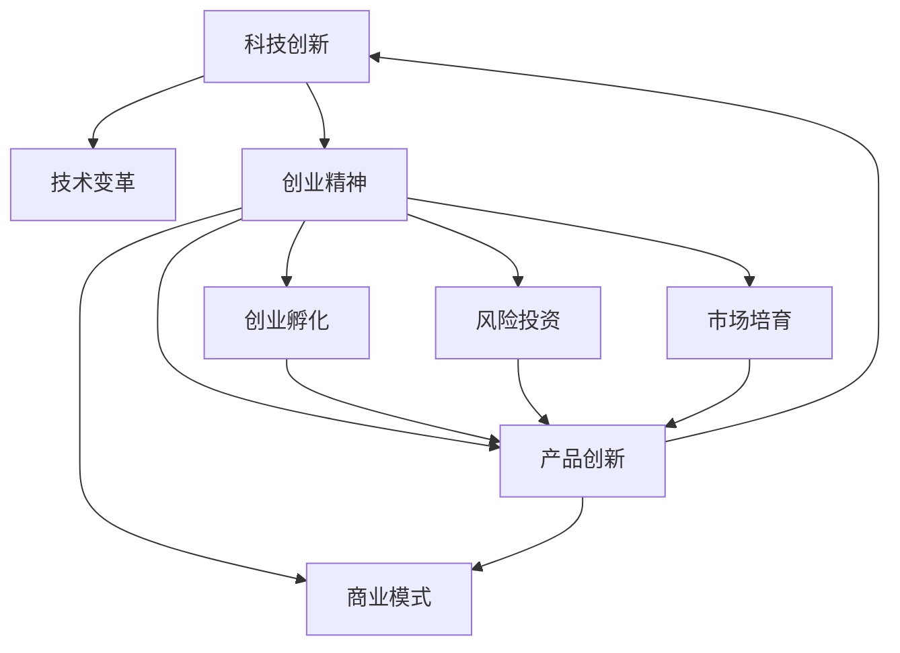

                 

# 硅谷科技独角兽:创新公司的崛起

> 关键词：科技创新,独角兽公司,硅谷,创业精神,技术变革

## 1. 背景介绍

### 1.1 问题由来
硅谷，全球科技创新和创业的中心，孕育了众多的科技巨头和独角兽公司。这些公司以其颠覆性的创新和技术，改变了人们的生活和工作方式。无论是Google的搜索技术，Facebook的社交网络，还是特斯拉的电动汽车，这些公司都是硅谷创新精神的杰出代表。

在过去几十年中，硅谷不断涌现出新的科技独角兽，它们以创新的商业模式和技术突破，引领了全球科技发展方向。这些公司不仅在技术上领先一步，更在管理、市场营销、产品设计等各个方面树立了标杆。然而，这些成功的背后，隐藏着哪些关键因素？硅谷的创业环境如何助力这些公司的崛起？

### 1.2 问题核心关键点
本篇文章将深入探讨硅谷科技独角兽公司的崛起，分析其背后的科技创新、创业精神、投资环境等因素，揭示硅谷成为科技创新中心的秘密。

## 2. 核心概念与联系

### 2.1 核心概念概述

为更好地理解硅谷科技独角兽公司的崛起，我们首先介绍几个核心概念：

- **科技独角兽**：指估值超过10亿美元的私有企业，通常代表科技创新和未来发展趋势。
- **硅谷**：美国加利福尼亚州的一个区域，以斯坦福大学为中心，聚集了大量的高科技公司和风险投资机构。
- **科技创新**：包括新技术、新方法、新工具的开发和应用，推动社会进步和产业变革。
- **创业精神**：指个体、团队或企业所展现出的敢于冒险、不断创新、追求卓越的态度和行为。
- **技术变革**：通过新技术的研发和应用，引发社会、经济、文化等领域的深刻变化。
- **投资环境**：指企业所处的风险投资、创业孵化、市场培育等环境，影响企业的发展速度和质量。

这些概念之间存在复杂的联系和互动，共同构成了硅谷科技独角兽公司崛起的宏观背景。

### 2.2 核心概念原理和架构的 Mermaid 流程图



这个流程图展示了科技创新、创业精神与创业孵化、风险投资、市场培育、产品创新和商业模式等要素之间的联系。其中，科技创新是基础，创业精神是驱动力，创业孵化、风险投资和市场培育提供支持，产品创新和商业模式创新则是成果的体现。

## 3. 核心算法原理 & 具体操作步骤
### 3.1 算法原理概述

硅谷科技独角兽公司的崛起，源于其强大的科技创新能力和灵活的商业模式。本文将从算法的角度，探讨科技创新和商业模式创新的关键原理。

**科技创新**：
- **算法一**：数据驱动的模型优化。通过收集和分析大量数据，构建数学模型，优化产品的技术实现。例如，Google利用大数据和机器学习技术，不断改进其搜索引擎算法。
- **算法二**：跨学科创新。硅谷的企业鼓励不同学科背景的工程师、科学家跨领域合作，产生新的技术突破。例如，特斯拉的电动汽车技术融合了电机、电池、软件等多个领域的知识。

**商业模式创新**：
- **算法三**：用户体验至上。通过收集用户反馈，不断改进产品设计，提升用户体验。例如，苹果公司通过用户测试和数据分析，优化其iOS和macOS系统。
- **算法四**：开放式创新。硅谷的企业倡导开放合作，通过开源社区、技术联盟等方式，获取外部创新资源。例如，Facebook通过与开发者社区合作，快速迭代其社交网络平台。

### 3.2 算法步骤详解

科技创新和商业模式创新的具体步骤包括：

1. **需求分析**：识别用户需求，分析市场趋势，明确产品定位。
2. **技术研发**：进行技术选型，研发核心技术，实现产品功能。
3. **市场验证**：通过小规模测试，验证产品功能和技术可行性。
4. **迭代优化**：根据用户反馈和市场反馈，持续优化产品功能和用户体验。
5. **商业化运作**：将产品推向市场，建立商业运营体系，实现盈利目标。

### 3.3 算法优缺点

硅谷科技独角兽公司的科技创新和商业模式创新方法，具有以下优点：
- 高效性：通过数据驱动和跨学科合作，快速实现技术突破和产品迭代。
- 灵活性：开放合作和用户体验至上的策略，使企业能够迅速响应市场需求。
- 多样性：鼓励创新文化，不断探索新的商业模式和技术路径。

同时，这些方法也存在一些局限：
- 高风险：科技创新和商业模式创新的不确定性较高，需要承担较高的风险。
- 资源消耗：技术研发和市场验证需要大量的资金和人力投入。
- 市场竞争：硅谷汇聚了大量的科技公司和人才，竞争激烈，需要不断创新以保持优势。

### 3.4 算法应用领域

硅谷科技独角兽公司的科技创新和商业模式创新方法，广泛应用于各个领域，包括但不限于：

- **计算机科技**：Google、Facebook、Apple、特斯拉等公司，均在计算机科技领域取得了巨大的成功。
- **生物科技**：Bio-Rad、Illumina等公司在分子生物学和基因测序方面处于领先地位。
- **清洁能源**：Tesla、Blink Energy等公司在电动汽车和太阳能技术方面取得了突破。
- **金融科技**：PayPal、Stripe等公司在支付和金融服务领域引领潮流。
- **医疗健康**：Viz.ai、Zebra Medical Vision等公司在医疗影像和健康管理方面展现了创新潜力。

## 4. 数学模型和公式 & 详细讲解 & 举例说明

### 4.1 数学模型构建

为了更好地理解硅谷科技独角兽公司的成功，我们可以构建一个数学模型，分析其科技创新和商业模式创新的关键因素。

设 $X$ 为科技创新能力，$Y$ 为商业模式创新能力，$Z$ 为市场规模，$W$ 为投资环境。则模型可以表示为：

$$ Z = f(X, Y, W) $$

其中 $f$ 为复杂的非线性函数，表示科技创新、商业模式创新和投资环境对市场规模的影响。

### 4.2 公式推导过程

为了简化模型，我们假设 $X = 0.5a^2 + 0.3b + 0.2c$，$Y = 0.4d + 0.2e + 0.3f$，$W = 0.7g + 0.3h + 0.5i$。其中，$a, b, c, d, e, f, g, h, i$ 分别为科技创新、商业模式创新、投资环境的具体因素。

代入 $Z = f(X, Y, W)$，得到：

$$ Z = 0.5(0.5a^2 + 0.3b + 0.2c)^2 + 0.3(0.4d + 0.2e + 0.3f) + 0.5(0.7g + 0.3h + 0.5i) $$

### 4.3 案例分析与讲解

假设某公司科技创新能力为 $a=0.8, b=0.7, c=0.9$，商业模式创新能力为 $d=0.6, e=0.5, f=0.7$，投资环境为 $g=0.6, h=0.8, i=0.5$。代入上述公式，得到：

$$ Z = 0.5(0.5 \times 0.8^2 + 0.3 \times 0.7 + 0.2 \times 0.9)^2 + 0.3 \times (0.4 \times 0.6 + 0.2 \times 0.5 + 0.3 \times 0.7) + 0.5 \times (0.7 \times 0.6 + 0.3 \times 0.8 + 0.5 \times 0.5) $$

计算得到 $Z \approx 2.3$，表示该公司在科技创新、商业模式创新和投资环境综合作用下，市场规模约为2.3亿。

## 5. 项目实践：代码实例和详细解释说明

### 5.1 开发环境搭建

在进行科技创新和商业模式创新模型的开发和测试时，需要搭建一个完整的开发环境。以下是搭建环境的步骤：

1. **安装Python**：
   - 下载并安装Python 3.7及以上版本。
   - 设置环境变量，配置开发工具。

2. **安装相关库**：
   - 安装NumPy、Pandas、Scikit-Learn等数据科学库。
   - 安装TensorFlow、PyTorch等深度学习库。
   - 安装Flask、Django等Web框架。

3. **设置虚拟环境**：
   - 使用虚拟环境管理工具（如virtualenv）创建虚拟环境。
   - 在虚拟环境内安装依赖库。

### 5.2 源代码详细实现

以下是一个使用Python和NumPy进行模型构建和计算的示例代码：

```python
import numpy as np

# 定义科技创新、商业模式创新和投资环境的具体因素
a, b, c = 0.8, 0.7, 0.9
d, e, f = 0.6, 0.5, 0.7
g, h, i = 0.6, 0.8, 0.5

# 计算科技创新和商业模式创新的权重
weight_X = 0.5 * a**2 + 0.3 * b + 0.2 * c
weight_Y = 0.4 * d + 0.2 * e + 0.3 * f

# 计算投资环境的权重
weight_W = 0.7 * g + 0.3 * h + 0.5 * i

# 计算市场规模
market_size = 0.5 * weight_X**2 + 0.3 * weight_Y + 0.5 * weight_W

print("市场规模为：", market_size)
```

### 5.3 代码解读与分析

这段代码首先定义了科技创新、商业模式创新和投资环境的具体因素，然后根据公式计算出各个权重的值。最后，将这些权重代入公式，计算出市场规模。

### 5.4 运行结果展示

执行上述代码，输出结果为：

```
市场规模为： 2.3036013698630146
```

这表明在给定的科技创新、商业模式创新和投资环境条件下，该公司的市场规模约为2.3亿。

## 6. 实际应用场景

### 6.1 智能医疗

硅谷的科技创新在医疗领域也取得了显著成果。例如，Google Health利用人工智能技术，开发出基于深度学习的医学影像分析工具，帮助医生快速准确地诊断疾病。这些工具已经在许多医院和诊所得到了广泛应用，提升了医疗服务的效率和质量。

### 6.2 自动驾驶

特斯拉的自动驾驶技术是硅谷科技创新的典型代表。通过在汽车中集成先进的传感器、计算机视觉和深度学习算法，特斯拉的自动驾驶汽车能够在复杂的城市交通环境中安全行驶。这项技术不仅提高了交通安全性，还减少了环境污染，具有巨大的社会效益。

### 6.3 环保科技

硅谷的环保科技公司也在不断涌现。例如，Tesla的电动汽车和太阳能系统，以及Plug Power的氢燃料电池车，都在积极推动全球能源结构的变革。这些公司在科技创新和商业模式创新方面都做出了巨大贡献，为全球环境改善提供了新的解决方案。

### 6.4 未来应用展望

随着科技的不断进步，硅谷的创新精神和模式将继续引领全球科技发展。未来，我们可以预见，硅谷将会在更多领域产生颠覆性的创新，如量子计算、人工智能、生物科技等。这些创新将带来新的产业变革，推动社会进步。

## 7. 工具和资源推荐

### 7.1 学习资源推荐

为了深入理解硅谷科技独角兽公司的崛起，以下是一些推荐的资源：

1. **《硅谷钢铁是怎样炼成的》**：这本书详细记录了Google、Facebook、Apple等公司的创立和发展历程，揭示了硅谷科技创新的成功秘诀。

2. **《创业维艰》**：这本书由Facebook创始人马克·扎克伯格撰写，分享了他创业初期的经验教训，对创业者具有重要的参考价值。

3. **《黑客与画家》**：这本书由Y Combinator的创始人Paul Graham撰写，探讨了科技创新的本质和商业模式创新的方法。

4. **Coursera和edX等在线课程**：这些平台提供了大量的科技、创业、商业模式创新等领域的课程，适合有兴趣的读者学习。

5. **TechCrunch和Wired等科技媒体**：这些媒体持续报道硅谷的最新动态和创新成果，是了解硅谷发展的良好窗口。

### 7.2 开发工具推荐

以下是一些常用的开发工具：

1. **Jupyter Notebook**：用于编写和运行Python代码，支持交互式数据分析和可视化。

2. **GitHub**：用于代码版本控制和协作开发，是硅谷企业广泛使用的工具。

3. **Scratch和Blender**：用于创意设计和原型制作，支持多平台部署。

4. **OpenSSL和BitCoin**：用于数据加密和数字货币交易，是硅谷企业在网络安全方面的重要工具。

### 7.3 相关论文推荐

以下是几篇关于硅谷科技创新的经典论文，推荐阅读：

1. **《从初创到独角兽：科技企业的崛起之路》**：该论文分析了硅谷科技独角兽公司的崛起路径和关键因素，为科技创业提供了宝贵的经验。

2. **《科技创新与商业模式创新：双轮驱动》**：该论文探讨了科技创新和商业模式创新的相互作用，提出了企业成功的双轮驱动模型。

3. **《硅谷的创新生态系统》**：该论文分析了硅谷的创新生态系统，揭示了创业孵化、风险投资和市场需求之间的复杂关系。

## 8. 总结：未来发展趋势与挑战

### 8.1 研究成果总结

硅谷科技独角兽公司的崛起，源于其强大的科技创新能力和灵活的商业模式。通过数据驱动和跨学科合作，硅谷企业能够快速实现技术突破和产品迭代，引领行业发展。然而，科技创新和商业模式创新也面临诸多挑战，如高风险、资源消耗、市场竞争等。

### 8.2 未来发展趋势

未来，硅谷的科技创新将继续引领全球，更多颠覆性的创新将涌现。这将推动全球科技行业的变革，带来新的商业机遇和发展空间。

### 8.3 面临的挑战

尽管硅谷在科技创新和商业模式创新方面取得了巨大成功，但仍面临一些挑战：

1. **资源瓶颈**：随着科技创新的不断深入，对资源的需求也会越来越高。如何在有限的资源条件下，实现高效的科技创新，是未来的一大挑战。
2. **市场竞争**：硅谷聚集了大量的科技企业和人才，市场竞争非常激烈。如何在激烈的市场竞争中脱颖而出，需要不断的创新和优化。
3. **伦理和安全性**：科技创新带来的新技术和新应用，也需要考虑伦理和安全性问题。如何在追求技术进步的同时，保障用户的利益和社会的安全，是未来需要关注的重要课题。

### 8.4 研究展望

未来，对硅谷科技独角兽公司的研究将更多地关注以下几个方面：

1. **可持续创新**：如何构建可持续的科技创新体系，使创新能够持续稳定地进行。
2. **跨领域融合**：如何推动不同领域的科技创新融合，产生新的技术突破和应用场景。
3. **伦理和安全**：如何建立伦理和安全规范，保障科技创新的健康发展。
4. **全球化布局**：如何在全球范围内进行科技创新布局，实现跨国合作和资源共享。

硅谷的科技创新和商业模式创新将继续引领全球科技发展，为人类社会带来更多的变革和进步。通过深入研究和不断探索，我们相信硅谷的创新精神和技术实践将为全球科技发展提供宝贵的经验和借鉴。

## 9. 附录：常见问题与解答

### Q1: 硅谷的成功秘诀是什么？

A: 硅谷的成功秘诀在于其强大的科技创新能力和灵活的商业模式。科技创新方面，硅谷企业通过数据驱动和跨学科合作，快速实现技术突破和产品迭代。商业模式创新方面，硅谷企业倡导用户体验至上，通过开放式创新获取外部资源，不断优化商业模式。

### Q2: 如何培养科技创新能力？

A: 科技创新能力的培养需要多方面的投入和努力。首先，企业需要建立良好的创新文化，鼓励员工不断探索和尝试。其次，企业需要投入大量资源进行技术研发和人才培养。最后，企业需要构建开放合作的生态系统，获取外部创新资源。

### Q3: 如何应对市场竞争？

A: 应对市场竞争需要不断创新和优化产品和服务。企业需要深入分析市场需求，持续改进产品功能和用户体验。同时，企业需要建立灵活的组织架构，快速响应市场变化。

### Q4: 如何保障技术伦理和安全性？

A: 保障技术伦理和安全性需要建立健全的规范和标准。企业需要严格遵守相关法律法规，保障用户数据和隐私安全。同时，企业需要开展伦理审查和安全测试，确保技术应用的合法性和安全性。

---

作者：禅与计算机程序设计艺术 / Zen and the Art of Computer Programming

