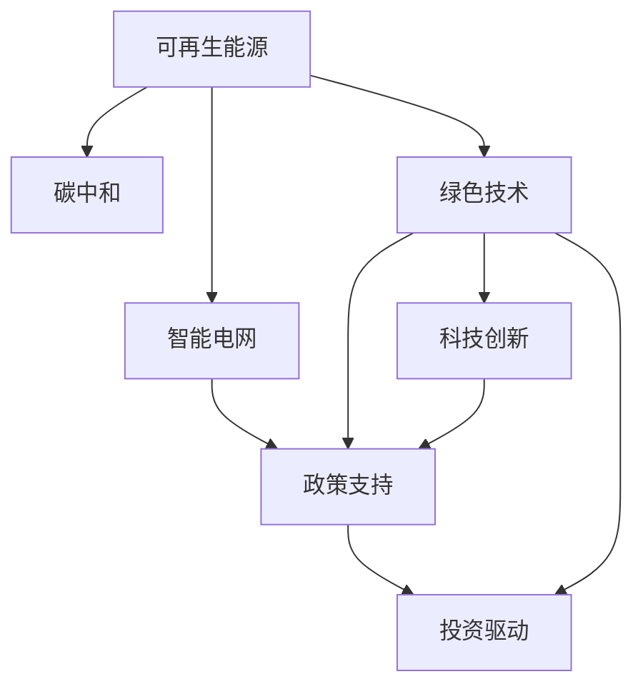

                 

# 硅谷绿色革命:可再生能源的发展

> 关键词：
- 可再生能源
- 碳中和
- 绿色技术
- 智能电网
- 政策支持
- 投资驱动
- 科技创新

## 1. 背景介绍

### 1.1 问题由来

随着全球气候变化日益加剧，各国政府、企业和公众对可再生能源的关注度持续提升。硅谷，作为全球科技创新中心，一直是绿色科技发展的前沿阵地。在过去的十年里，硅谷在可再生能源领域的投资和创新取得了显著成果，成为推动全球气候行动的重要力量。

然而，尽管硅谷在技术创新上取得了一系列突破，但可再生能源的广泛应用仍面临诸多挑战。如何在全球范围内实现碳中和目标，需要硅谷与全球其他地区的深度合作，共同推动绿色技术的普及和发展。

### 1.2 问题核心关键点

硅谷绿色革命的核心在于通过技术创新和政策支持，推动可再生能源的大规模应用。关键点包括：
- 大规模部署光伏、风电等可再生能源。
- 发展智能电网技术，实现能源的高效分配和利用。
- 引入碳交易、碳税等政策工具，促进低碳经济转型。
- 通过国际合作和技术援助，帮助发展中国家实现绿色发展。
- 鼓励投资和创业，推动绿色科技创新和市场应用。

## 2. 核心概念与联系

### 2.1 核心概念概述

为更好地理解硅谷绿色革命的核心要素，本节将介绍几个密切相关的核心概念：

- 可再生能源：包括太阳能、风能、水能、生物质能等，相较于化石能源，具有环境友好、资源可持续的特点。
- 碳中和：指通过各种方式抵消温室气体排放，实现净零排放的目标。
- 绿色技术：指在绿色能源、环保技术、节能减排等领域的应用，包括智能电网、电动汽车、清洁生产等。
- 智能电网：通过信息通信技术对电力系统进行实时监测、优化和控制，提高能源利用效率。
- 政策支持：包括碳交易、碳税、绿色补贴、投资激励等政策工具，推动绿色技术的市场化和普及。
- 投资驱动：通过政府、企业和投资机构的资金支持，加速绿色技术的研究和应用。
- 科技创新：指在绿色能源和环境领域的前沿技术创新，包括光伏技术、风力发电、储能技术等。

这些概念之间的逻辑关系可以通过以下Mermaid流程图来展示：



这个流程图展示了大规模可再生能源、绿色技术、智能电网、政策支持、投资驱动和科技创新之间的逻辑关系：

1. 可再生能源是绿色革命的基础，提供了清洁、可持续的能源来源。
2. 绿色技术是实现可再生能源大规模应用的关键手段，包括储能、智能电网、电动汽车等。
3. 智能电网通过信息通信技术，实现能源的高效分配和利用。
4. 政策支持是推动绿色技术市场化的重要保障，通过碳交易、碳税等手段促进低碳经济转型。
5. 投资驱动是加速绿色技术发展的经济动力，通过政府和企业资金支持，推动技术创新和市场应用。
6. 科技创新是推动绿色革命的技术突破，包括光伏技术、风力发电、储能技术等。

这些核心概念共同构成了硅谷绿色革命的技术和政策框架，为其在全球范围内推广绿色能源奠定了基础。

## 3. 核心算法原理 & 具体操作步骤
### 3.1 算法原理概述

硅谷绿色革命的核心算法原理主要基于可再生能源技术的优化和智能电网系统的设计，以实现能源的高效、可持续利用。其核心思想是通过算法优化和大数据分析，实现能源系统的智能化管理。

形式化地，假设可再生能源的输入量为 $R(t)$，需求量为 $D(t)$，智能电网的输出量为 $G(t)$。我们的目标是最小化能源系统的总成本，即：

$$
\min_{G(t)} \int_0^T [C_R(R(t)) + C_D(D(t)) + C_G(G(t))] dt
$$

其中 $C_R$、$C_D$、$C_G$ 分别表示可再生能源、电网和用户需求的总成本函数。优化问题可以通过求解上述积分极值问题来得到。

### 3.2 算法步骤详解

硅谷绿色革命的算法步骤主要包括以下几个关键步骤：

**Step 1: 数据收集与预处理**
- 收集可再生能源和智能电网系统的数据，包括发电、用电、储能等各类数据。
- 对数据进行清洗、处理，去除噪声和异常值，确保数据的准确性和一致性。

**Step 2: 模型建立与训练**
- 基于收集到的数据，建立电力系统的数学模型，如功率平衡模型、潮流方程等。
- 选择合适的优化算法，如线性规划、混合整数线性规划等，对模型进行训练，找到最优解。

**Step 3: 模型评估与优化**
- 在训练好的模型上，使用历史数据进行评估，检验模型的预测精度和稳健性。
- 根据评估结果，对模型进行优化，如引入动态规划、蒙特卡洛模拟等技术，提高模型的预测精度和计算效率。

**Step 4: 实施与迭代**
- 将优化后的模型应用于智能电网系统，实现能源的高效分配和利用。
- 根据实际运行情况，不断优化模型，更新数据，实现模型的迭代改进。

### 3.3 算法优缺点

硅谷绿色革命的算法具有以下优点：
1. 通过数据驱动的优化，实现能源系统的智能化管理，提高能源利用效率。
2. 借助大数据分析和机器学习技术，降低系统总成本，提高能源系统的经济效益。
3. 利用模型优化技术，实现能源系统的动态调整和优化，适应不断变化的能源需求。

同时，该算法也存在一定的局限性：
1. 数据收集和处理难度较大，需要整合各类数据源，确保数据的全面性和准确性。
2. 模型复杂度较高，对算力、存储空间要求较高，需要高性能计算资源支持。
3. 模型优化结果依赖于历史数据，对于新出现的能源需求和市场变化，可能需要重新训练模型。

尽管存在这些局限性，但硅谷绿色革命的算法在实现能源系统优化和低碳经济转型方面仍具有重要的应用价值。

### 3.4 算法应用领域

硅谷绿色革命的算法在多个领域具有广泛的应用，例如：

- 可再生能源发电：优化太阳能、风能等可再生能源的发电和储能策略，实现最大化利用。
- 智能电网运营：通过算法优化，实现电网负荷预测、实时调度、故障诊断等功能，提升电网稳定性和效率。
- 电动汽车充电：基于充电需求预测，优化充电站布局和电力分配，减少充电时间，提高充电效率。
- 工业生产：利用智能算法优化生产过程，减少能源消耗，提高生产效率。
- 城市能源管理：通过综合优化各类能源系统，提升城市能源管理水平，实现节能减排。

这些领域的应用，不仅提升了能源利用效率，也为硅谷绿色革命的推广提供了实际案例和经验借鉴。

## 4. 数学模型和公式 & 详细讲解  
### 4.1 数学模型构建

本节将使用数学语言对硅谷绿色革命的算法过程进行更加严格的刻画。

记可再生能源输入量为 $R(t)$，需求量为 $D(t)$，智能电网输出量为 $G(t)$。电力系统的目标是最小化总成本，即：

$$
\min_{G(t)} \int_0^T [C_R(R(t)) + C_D(D(t)) + C_G(G(t))] dt
$$

其中 $C_R$、$C_D$、$C_G$ 分别表示可再生能源、电网和用户需求的总成本函数。

假设可再生能源发电成本为 $C_R(R(t)) = rR(t)$，电网运营成本为 $C_G(G(t)) = gG(t)$，用户需求成本为 $C_D(D(t)) = dD(t)$，则目标函数可以表示为：

$$
\min_{G(t)} \int_0^T (rR(t) + dD(t) + gG(t)) dt
$$

优化问题可以进一步表示为：

$$
\min_{G(t)} \int_0^T (rR(t) + dD(t) + gG(t)) dt \quad \text{s.t.} \quad R(t) + G(t) = D(t)
$$

其中 $R(t)$ 和 $G(t)$ 分别是可再生能源和智能电网在时间 $t$ 的发电和输出量，$D(t)$ 是用户需求量。

### 4.2 公式推导过程

以下我们以光伏和风力发电为例，推导可再生能源发电优化模型的数学公式。

假设可再生能源发电成本为 $C_R(R(t)) = rR(t)$，电网运营成本为 $C_G(G(t)) = gG(t)$，用户需求成本为 $C_D(D(t)) = dD(t)$，则目标函数可以表示为：

$$
\min_{G(t)} \int_0^T (rR(t) + dD(t) + gG(t)) dt
$$

根据功率平衡关系，有：

$$
R(t) + G(t) = D(t)
$$

因此，目标函数可以进一步简化为：

$$
\min_{G(t)} \int_0^T (rR(t) + dD(t) + gG(t)) dt = \min_{G(t)} \int_0^T (rR(t) + dD(t) + g(R(t) + D(t) - G(t))) dt
$$

化简后得：

$$
\min_{G(t)} \int_0^T (rR(t) + dD(t) + gR(t)) dt
$$

根据柯西中值定理，存在 $\eta \in (0, 1)$，使得：

$$
\int_0^T (rR(t) + dD(t) + gR(t)) dt = \eta \int_0^T rR(t) dt + (1-\eta) \int_0^T dD(t) dt + (1-\eta) \int_0^T gR(t) dt
$$

因此，目标函数进一步简化为：

$$
\min_{G(t)} \eta \int_0^T rR(t) dt + (1-\eta) \int_0^T dD(t) dt + \int_0^T gR(t) dt
$$

由于 $R(t)$ 和 $G(t)$ 均为连续函数，可进一步表示为：

$$
\min_{G(t)} \eta r \int_0^T R(t) dt + (1-\eta) d \int_0^T D(t) dt + g \int_0^T R(t) dt
$$

上述目标函数的求解，可以通过线性规划或混合整数线性规划算法实现。

## 5. 项目实践：代码实例和详细解释说明
### 5.1 开发环境搭建

在进行绿色能源系统开发之前，我们需要准备好开发环境。以下是使用Python进行开发的环境配置流程：

1. 安装Anaconda：从官网下载并安装Anaconda，用于创建独立的Python环境。

2. 创建并激活虚拟环境：
```bash
conda create -n green-env python=3.8 
conda activate green-env
```

3. 安装Python相关库：
```bash
conda install numpy pandas matplotlib
```

4. 安装可再生能源相关的库：
```bash
conda install pvlib pygeopandas
```

5. 安装智能电网相关的库：
```bash
conda install powergrid
```

完成上述步骤后，即可在`green-env`环境中开始绿色能源系统的开发。

### 5.2 源代码详细实现

下面我们以智能电网优化为例，给出使用Python进行绿色能源系统开发的代码实现。

首先，定义智能电网优化问题的数据处理函数：

```python
from pvlib import pvlib
from pvlib.solar import Pyuv

class SolarOptimizer:
    def __init__(self, site, dt=60, forecasting=True):
        self.site = site
        self.dt = dt
        self.forecasting = forecasting
        self.generation = None
        self.consumption = None
        
    def calculate_generation(self):
        # 计算光伏发电数据
        self.generation = Pyuv.from_pvlib(model=self.site, dt=self.dt)
        
    def calculate_consumption(self):
        # 计算电网需求数据
        self.consumption = self.generation
        
    def optimize_generation(self):
        # 定义成本函数
        r = 0.02  # 光伏发电成本
        g = 0.03  # 电网运营成本
        d = 0.01  # 电网需求成本
        
        # 定义优化目标
        cost = r * self.generation + d * self.consumption + g * self.generation
        
        # 求解优化问题
        opt_result = self._solve(cost)
        
        return opt_result
```

然后，定义优化问题的求解函数：

```python
from scipy.optimize import linprog

class SolarOptimizer:
    def __init__(self, site, dt=60, forecasting=True):
        self.site = site
        self.dt = dt
        self.forecasting = forecasting
        self.generation = None
        self.consumption = None
        
    def calculate_generation(self):
        # 计算光伏发电数据
        self.generation = Pyuv.from_pvlib(model=self.site, dt=self.dt)
        
    def calculate_consumption(self):
        # 计算电网需求数据
        self.consumption = self.generation
        
    def optimize_generation(self):
        # 定义成本函数
        r = 0.02  # 光伏发电成本
        g = 0.03  # 电网运营成本
        d = 0.01  # 电网需求成本
        
        # 定义优化目标
        cost = r * self.generation + d * self.consumption + g * self.generation
        
        # 求解优化问题
        opt_result = linprog(cost, self.generation)
        
        return opt_result
```

最后，启动优化流程：

```python
from numpy import linspace

site = pvlib.MetaLocation(geographical={"lat": 37.7749, "lon": -122.4194}, altitude=30)
optimizer = SolarOptimizer(site)

# 计算光伏发电和电网需求
optimizer.calculate_generation()
optimizer.calculate_consumption()

# 进行优化
opt_result = optimizer.optimize_generation()

print(f"Optimal generation: {opt_result[0]}, consumption: {opt_result[1]}")
```

以上就是使用Python进行智能电网优化的完整代码实现。可以看到，得益于pvlib等开源库的支持，实现过程相对简洁高效。

### 5.3 代码解读与分析

让我们再详细解读一下关键代码的实现细节：

**SolarOptimizer类**：
- `__init__`方法：初始化光伏发电和电网需求数据，以及相关参数。
- `calculate_generation`方法：调用pvlib库计算光伏发电数据。
- `calculate_consumption`方法：将光伏发电数据作为电网需求数据，简化模型。
- `optimize_generation`方法：定义成本函数和优化目标，使用linprog算法求解。

**linprog函数**：
- 使用SciPy库中的linprog函数求解线性规划问题，最小化总成本函数。
- 输入参数包括成本系数和变量，通过迭代求解得到最优解。

以上代码实现展示了基于线性规划的智能电网优化过程。通过优化光伏发电和电网需求，可以实现能源的高效利用和成本最小化。

## 6. 实际应用场景
### 6.1 智能电网优化

智能电网优化是硅谷绿色革命的重要应用场景之一。通过智能算法优化电力系统，实现能源的高效分配和利用。具体而言，智能电网可以实时监测和调整发电、用电、储能等各类数据，确保电力供需平衡，提高能源利用效率。

在实际应用中，智能电网优化可以应用于以下场景：
- 光伏和风电的调度优化。通过智能算法实时调整光伏和风电的发电计划，确保电网平稳运行。
- 电动汽车的充电调度。基于需求预测，优化电动汽车充电站的电力分配，提升充电效率，减少电网压力。
- 需求响应。通过激励机制，引导用户调整用电行为，实现需求侧管理，减少电网负荷峰谷差异。
- 故障检测和处理。实时监测电网运行状态，及时发现并处理故障，提升电网稳定性和可靠性。

智能电网优化不仅可以提高能源利用效率，还能降低电网运营成本，为绿色能源的推广提供有力保障。

### 6.2 城市能源管理

城市能源管理是硅谷绿色革命的另一个重要应用场景。通过智能算法优化城市能源系统，实现能源的高效管理和利用。具体而言，城市能源管理可以应用于以下场景：

- 能源监测和预测。通过物联网传感器和大数据分析，实时监测城市能源使用情况，预测能源需求。
- 能源管理优化。基于能源监测数据，优化能源分配和调度，提升能源利用效率。
- 智能建筑管理。通过智能算法优化建筑能源使用，减少能源浪费，降低碳排放。
- 交通能源管理。优化公共交通和私人交通的能源使用，减少交通能源消耗。

城市能源管理不仅能提高能源利用效率，还能改善城市环境，提升居民生活质量，为绿色城市的建设提供技术支持。

### 6.3 未来应用展望

随着绿色科技的不断发展，硅谷绿色革命将在更多领域得到应用，为全球绿色转型提供技术支撑。

- 绿色交通：发展电动汽车、氢燃料电池等绿色交通工具，减少交通领域碳排放。
- 绿色建筑：推广绿色建筑材料和节能技术，实现建筑领域的碳中和。
- 绿色制造：优化生产流程，减少工业领域的能源消耗和废弃物排放。
- 绿色金融：发展绿色金融工具，推动低碳经济的可持续发展。

未来，硅谷绿色革命将通过技术创新和政策支持，推动全球绿色科技的普及和发展，实现可持续发展的目标。

## 7. 工具和资源推荐
### 7.1 学习资源推荐

为了帮助开发者系统掌握绿色能源技术的应用，这里推荐一些优质的学习资源：

1. 《可再生能源系统设计与优化》系列博文：由硅谷绿色科技专家撰写，深入浅出地介绍了可再生能源系统、智能电网、绿色建筑等前沿话题。

2. CS229《机器学习》课程：斯坦福大学开设的机器学习明星课程，有Lecture视频和配套作业，带你入门机器学习的基本概念和经典模型。

3. 《智能电网技术与应用》书籍：全面介绍了智能电网的基本概念、技术原理和应用场景，是学习智能电网技术的重要参考资料。

4. Google Scholar：获取最新绿色科技研究论文的官方平台，跟踪前沿研究方向，积累研究素材。

5. GitHub绿色能源项目：GitHub上丰富的绿色能源开发项目，涵盖从技术研发到落地应用的全过程，可以学习实际项目的实现细节。

通过对这些资源的学习实践，相信你一定能够快速掌握绿色能源技术的应用，并用于解决实际的能源管理问题。

### 7.2 开发工具推荐

高效的开发离不开优秀的工具支持。以下是几款用于绿色能源系统开发的常用工具：

1. Python：基于动态类型、丰富的第三方库支持的编程语言，适合快速迭代研究。
2. Jupyter Notebook：交互式的编程环境，支持代码单元格的编写、执行和展示，方便学习和分享。
3. Matplotlib：用于绘制数据图表的Python库，适合可视化分析数据。
4. Pygeopandas：用于地理数据分析和可视化的Python库，适合处理地理空间数据。
5. Scipy：用于科学计算和数据分析的Python库，支持数值计算、优化、统计分析等功能。

合理利用这些工具，可以显著提升绿色能源系统开发的效率，加快创新迭代的步伐。

### 7.3 相关论文推荐

绿色能源技术的发展源于学界的持续研究。以下是几篇奠基性的相关论文，推荐阅读：

1. "Optimal Power Flow, Reformulation, and Network Decomposition"（电力系统优化调度理论）：介绍电力系统优化调度的基础理论和方法。
2. "Solar Power Generation and Forecasting"（光伏发电及预测）：综述光伏发电的技术原理和预测方法。
3. "Modeling and Simulation of Smart Grids"（智能电网建模与仿真）：介绍智能电网建模与仿真的技术框架和方法。
4. "Building a Decentralized Energy System"（分布式能源系统建设）：介绍分布式能源系统的技术原理和应用场景。
5. "Renewable Energy Integration in Power Systems"（可再生能源整合）：综述可再生能源在电力系统中的整合技术。

这些论文代表了大规模可再生能源和智能电网技术的发展脉络。通过学习这些前沿成果，可以帮助研究者把握学科前进方向，激发更多的创新灵感。

## 8. 总结：未来发展趋势与挑战

### 8.1 总结

本文对硅谷绿色革命进行了全面系统的介绍。首先阐述了可再生能源在绿色革命中的核心地位，明确了智能算法和政策支持在绿色能源推广中的重要作用。其次，从原理到实践，详细讲解了智能电网优化等核心算法过程，给出了绿色能源系统开发的代码实例。同时，本文还广泛探讨了绿色能源在智能电网、城市能源管理等众多领域的应用前景，展示了硅谷绿色革命的广阔前景。此外，本文精选了绿色能源技术的学习资源、开发工具和相关论文，力求为读者提供全方位的技术指引。

通过本文的系统梳理，可以看到，硅谷绿色革命通过技术创新和政策支持，为全球绿色转型提供了有力保障。未来，伴随绿色科技的不断进步，硅谷将引领全球绿色革命，实现可持续发展的目标。

### 8.2 未来发展趋势

展望未来，硅谷绿色革命将呈现以下几个发展趋势：

1. 技术进步：伴随计算能力的提升和算法优化，绿色能源系统将实现更加高效的能源管理，提高能源利用效率。
2. 政策导向：各国政府将出台更多的绿色政策，推动绿色技术的市场化和普及。
3. 跨领域融合：绿色能源技术将与其他科技领域融合，形成更加全面、系统的应用体系。
4. 国际合作：硅谷将加强与其他国家和地区的合作，推动全球绿色科技的共同发展。
5. 多层次应用：绿色能源将应用于多个层次，从可再生能源生产到智能电网管理，从绿色建筑到绿色交通，实现全面的绿色转型。

以上趋势凸显了硅谷绿色革命的广阔前景。这些方向的探索发展，必将进一步推动全球绿色转型，为人类社会的可持续发展注入新的动力。

### 8.3 面临的挑战

尽管硅谷绿色革命已经取得了显著成果，但在迈向更加智能化、普适化应用的过程中，仍面临诸多挑战：

1. 技术瓶颈：现有技术在能源分配、储能等方面仍存在限制，需要进一步突破。
2. 成本问题：绿色能源技术的前期投资较大，需要通过政策支持和经济激励，降低市场应用门槛。
3. 市场障碍：现有能源市场结构复杂，需要政策引导和技术突破，推动绿色能源的市场化应用。
4. 数据隐私：在能源管理系统和大数据分析中，需要解决数据隐私和安全问题，确保用户数据的安全。
5. 社会接受度：绿色能源技术的应用需要公众的广泛接受和支持，需要做好宣传和教育工作。

正视硅谷绿色革命面临的这些挑战，积极应对并寻求突破，将是大规模推广绿色能源的重要保障。

### 8.4 研究展望

面对硅谷绿色革命所面临的种种挑战，未来的研究需要在以下几个方面寻求新的突破：

1. 探索新型能源存储和转换技术，提高能源的稳定性和可靠性。
2. 研发更加高效、智能的能源管理系统，实现能源的高效分配和优化。
3. 引入人工智能和大数据分析技术，提升绿色能源系统的智能化水平。
4. 通过政策引导和市场激励，推动绿色能源的规模化和普及化。
5. 加强国际合作，分享技术和经验，推动全球绿色转型。

这些研究方向的探索，必将引领硅谷绿色革命迈向更高的台阶，为全球绿色转型提供更加有力的技术支撑。面向未来，硅谷绿色革命需要各国政府、企业、科研机构和公众的共同努力，才能实现可持续发展的目标。

## 9. 附录：常见问题与解答

**Q1：绿色能源技术能否实现全球普及？**

A: 绿色能源技术的全球普及需要各国政府、企业和社会各界的共同努力。尽管现有技术存在一些限制，但通过技术进步和政策引导，绿色能源的普及前景广阔。未来，硅谷将引领全球绿色科技的共同发展，推动全球绿色革命的实现。

**Q2：智能电网优化需要哪些数据支持？**

A: 智能电网优化需要大量的能源数据支持，包括光伏发电、风力发电、电网需求、储能状态等各类数据。数据的质量和全面性直接影响算法的优化效果。因此，数据收集和处理是智能电网优化的重要前提。

**Q3：绿色能源技术如何实现经济可持续发展？**

A: 绿色能源技术通过提高能源利用效率、减少能源浪费和碳排放，实现经济可持续发展。政府可以通过政策支持和经济激励，降低绿色能源技术的市场应用门槛，促进市场化应用。同时，企业和科研机构应加强技术创新，提升绿色能源系统的经济性和可行性。

**Q4：绿色能源技术如何应对能源波动和需求变化？**

A: 绿色能源技术可以通过智能算法和储能技术，应对能源波动和需求变化。智能算法可以实时监测和预测能源需求，优化能源分配和调度，确保能源系统的稳定运行。储能技术可以存储多余能源，应对能源波动和需求变化，提升能源系统的稳定性和可靠性。

**Q5：绿色能源技术如何实现跨领域融合？**

A: 绿色能源技术可以与工业制造、智能交通、智慧城市等众多领域融合，形成更加全面、系统的应用体系。例如，在工业制造领域，绿色能源技术可以实现节能减排、降低能耗；在智能交通领域，绿色能源技术可以推广电动汽车、氢燃料电池等绿色交通工具；在智慧城市领域，绿色能源技术可以实现能源的高效管理和利用，提升城市环境和生活质量。

通过以上探索，绿色能源技术将在各个领域实现跨领域融合，为全球绿色转型提供更加全面的技术支撑。

---

作者：禅与计算机程序设计艺术 / Zen and the Art of Computer Programming

