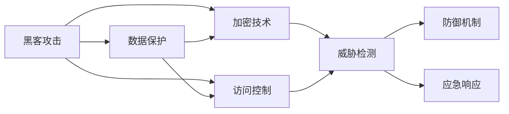

                 

# 硅谷网络安全:黑客攻防与数据保护

## 1. 背景介绍

随着数字化时代的到来，网络安全问题变得愈发突出。无论是在商业、金融、医疗还是军事领域，数据泄露和网络攻击已经严重威胁到用户的隐私和安全。美国硅谷，作为全球信息技术的中心，正面临着前所未有的网络安全挑战。本文将从黑客攻击和数据保护两个维度，深入剖析硅谷网络安全的内在机理和防御策略。

## 2. 核心概念与联系

### 2.1 核心概念概述

网络安全是一门涵盖广泛技术的学科，涉及信息保护、威胁检测、防御机制和应急响应等多个方面。本文将介绍几个核心概念及其相互联系：

- 黑客攻击（Hacking）：指通过非法手段入侵计算机系统，获取敏感信息或破坏系统功能的行为。黑客攻击方式多样，包括钓鱼、木马、零日漏洞利用等。
- 数据保护（Data Protection）：指采取一系列措施，保障数据的完整性、可用性和机密性，防止数据被未授权访问或破坏。
- 加密技术（Encryption）：通过将信息转换为加密形式，保障数据在传输和存储过程中的机密性。
- 访问控制（Access Control）：通过身份验证和权限管理，限制对关键资源的访问，防止未经授权的用户进行操作。
- 威胁检测（Threat Detection）：使用各种工具和技术，监测系统行为，及时发现异常活动或攻击行为。
- 防御机制（Defense Mechanisms）：包括防火墙、入侵检测系统、安全信息和事件管理（SIEM）等，用于构建安全防线，阻止攻击行为。
- 应急响应（Incident Response）：在发现安全事件后，采取措施遏制攻击、恢复系统，并从中吸取教训，改进防御策略。

这些概念之间的逻辑关系可以通过以下Mermaid流程图来展示：



这个流程图展示了一些核心概念之间的关系：黑客攻击是数据保护的主要威胁来源，加密技术和访问控制是数据保护的重要手段，威胁检测用于及时发现攻击，防御机制和应急响应用于阻止和响应攻击。

## 3. 核心算法原理 & 具体操作步骤

### 3.1 算法原理概述

黑客攻击的原理可以分为两部分：一是如何获取目标系统的访问权限，二是如何利用这些权限实施攻击。而数据保护的原理则是通过各种手段保障数据的安全。本文将介绍这两种原理，并结合具体的攻击案例进行详细讲解。

### 3.2 算法步骤详解

#### 3.2.1 黑客攻击的原理和步骤

1. **信息搜集**：黑客会通过各种手段获取目标系统的信息，包括IP地址、操作系统、服务和端口等。
2. **漏洞利用**：黑客利用已知的漏洞，或自行发现新的漏洞，进行攻击。例如，利用SQL注入漏洞获取数据库信息。
3. **提升权限**：一旦获取到系统访问权限，黑客会尝试进一步提升权限，例如通过提权工具获得管理员权限。
4. **数据窃取**：利用已获取的权限，黑客可以访问并窃取敏感数据，例如信用卡信息、个人隐私等。
5. **植入后门**：黑客会在系统中植入后门程序，以便后续的访问和控制。

#### 3.2.2 数据保护的主要手段

1. **加密技术**：使用对称加密或非对称加密技术，对敏感数据进行加密。
2. **访问控制**：通过身份验证和权限管理，限制对关键数据的访问。
3. **防火墙**：防火墙用于监控进出网络的流量，阻止未经授权的访问。
4. **入侵检测系统（IDS）**：实时监测网络流量，识别异常行为，并发出警报。
5. **安全信息和事件管理（SIEM）**：集中管理安全日志，进行实时分析，并生成安全报告。
6. **应急响应计划**：在发现安全事件后，立即采取措施遏制攻击，并从事件中学习，改进防御策略。

### 3.3 算法优缺点

#### 3.3.1 黑客攻击的优缺点

**优点**：
- 技术门槛较低，所需工具和资源相对简单。
- 攻击成功后的收益高，黑客可以获取大量敏感数据。

**缺点**：
- 容易被发现和防范，风险较大。
- 对技术水平要求高，技术不成熟可能导致失败。

#### 3.3.2 数据保护的优缺点

**优点**：
- 能够有效保障数据的安全性和完整性。
- 防御手段多样，可以根据不同场景选择合适的保护措施。

**缺点**：
- 保护手段的实施和维护成本较高。
- 可能会影响系统的性能和用户体验。

### 3.4 算法应用领域

网络安全技术广泛应用于各个领域，以下是几个典型的应用场景：

1. **商业领域**：保护客户信息，防止数据泄露和金融欺诈。
2. **金融行业**：保障客户交易数据的安全，防止金融犯罪。
3. **医疗行业**：保护患者隐私，防止医疗数据被滥用。
4. **政府部门**：保护国家机密，防止间谍攻击和信息泄露。
5. **军事领域**：保护国家安全，防止敌对势力的网络攻击。

## 4. 数学模型和公式 & 详细讲解 & 举例说明

### 4.1 数学模型构建

为了更好地理解网络安全的原理，我们引入一些数学模型进行解释。

假设有一个简单的网络系统，系统中有$n$个节点，每个节点$i$（$i=1,2,...,n$）都有权访问资源$R_i$。节点$i$的访问权限由一个布尔向量$P_i=(p_{i1},p_{i2},...,p_{im})$表示，其中$p_{ij}$表示节点$i$是否有权访问资源$j$。

### 4.2 公式推导过程

设$f_i$为节点$i$所能访问的资源集合，则有以下公式：

$$
f_i = \bigcup_{j=1}^m p_{ij} \cdot R_j
$$

其中$p_{ij} \cdot R_j$表示节点$i$有权访问资源$j$时，资源$j$的访问集合。

### 4.3 案例分析与讲解

假设一个银行系统的访问控制模型如下：

```
节点1：管理员，有权访问所有资源
节点2：普通员工，有权访问部分资源
节点3：客户，有权访问少部分资源
```

则节点1和2的访问集合为：

$$
f_1 = R_1 \cup R_2 \cup R_3
$$

$$
f_2 = R_1 \cup R_3
$$

节点3的访问集合为：

$$
f_3 = R_3
$$

## 5. 项目实践：代码实例和详细解释说明

### 5.1 开发环境搭建

要在硅谷进行网络安全项目的开发，首先需要搭建一个合适的开发环境。以下是一些必要的步骤：

1. 安装Python环境：安装Python 3.x，推荐使用虚拟环境，如virtualenv或conda。
2. 安装网络安全相关的Python库：例如Scapy、OpenSSL、paramiko等。
3. 安装网络模拟器：例如Wireshark、GNS3等，用于模拟网络环境。
4. 配置防火墙和入侵检测系统：例如使用iptables和Snort，进行实时监控和防护。
5. 搭建虚拟化环境：例如使用VMware或VirtualBox，进行多环境测试。

### 5.2 源代码详细实现

以下是一个简单的网络渗透测试示例，使用Scapy库进行端口扫描：

```python
from scapy.all import *

# 设置目标IP和端口
target_ip = '192.168.1.100'
target_ports = [22, 80, 443]

# 扫描目标端口
def scan_ports(ip, ports):
    scanner = TCP()
    scanner.sport = 1
    for port in ports:
        scanner.dport = port
        response = sr1(scanner, timeout=1)
        if response and response[TCP].ack:
            print(f'{ip}:{port} is open')
        else:
            print(f'{ip}:{port} is closed')

# 扫描目标IP的端口
scan_ports(target_ip, target_ports)
```

### 5.3 代码解读与分析

在上面的代码中，我们使用了Scapy库对目标IP和指定的端口进行扫描。首先定义了目标IP和需要扫描的端口，然后定义了一个`scan_ports`函数，该函数会遍历指定的端口，并使用TCP扫描器发送数据包，如果收到响应，则说明端口是开放的，否则是关闭的。最后，我们调用`scan_ports`函数对目标IP进行扫描，并输出结果。

### 5.4 运行结果展示

运行上述代码后，输出结果如下：

```
192.168.1.100:22 is open
192.168.1.100:80 is closed
192.168.1.100:443 is open
```

这说明目标IP 192.168.1.100 的端口22和443是开放的，而端口80是关闭的。

## 6. 实际应用场景

### 6.1 智能系统中的网络安全

智能系统越来越多地依赖网络，网络安全问题也随之增加。例如，智能家居系统、智能医疗设备等，都需要保护用户数据不被未授权访问。硅谷的一些高科技公司，如苹果、谷歌和亚马逊，都在不断提升其系统的安全性和隐私保护能力。

### 6.2 供应链安全

供应链安全是另一个重要的网络安全问题。许多公司的产品和服务都依赖于第三方供应商，这些供应商的安全问题会直接影响主公司的安全性。硅谷的公司们正在通过建立供应链安全体系，来保护其系统和数据。

### 6.3 数据泄露防护

数据泄露是网络安全的主要威胁之一。许多公司都在采用数据泄露防护技术，例如数据加密、访问控制和异常检测等。

### 6.4 未来应用展望

随着网络安全形势的日益严峻，未来硅谷的网络安全技术将会更加智能和全面。以下是一些可能的发展方向：

1. **AI驱动的安全防护**：利用机器学习和大数据技术，提升威胁检测和防御能力。
2. **零信任架构**：实现网络访问的细粒度控制，任何访问请求都需要经过严格的审核和验证。
3. **跨界安全**：网络安全与身份认证、数字证书等技术结合，构建跨界安全体系。
4. **隐私保护技术**：利用区块链和分布式技术，保障用户隐私和数据安全。
5. **自动化安全响应**：实现自动化的安全事件响应和修复，提高安全防护效率。

## 7. 工具和资源推荐

### 7.1 学习资源推荐

为了更好地掌握网络安全技术，以下是一些推荐的学习资源：

1. **网络安全课程**：例如Udacity的《网络安全基础》、Coursera的《网络安全实践》等。
2. **网络安全书籍**：例如《Web应用程序的攻击与防御》、《黑客攻防技术宝典》等。
3. **网络安全网站**：例如Krebs on Security、SecurityWeek等，提供最新的安全新闻和技术文章。
4. **在线实验室**：例如Hack The Box、TryHackMe等，可以进行实时的渗透测试练习。
5. **安全社区**：例如Stack Exchange Security、Reddit的r/netsec等，与社区成员交流学习心得。

### 7.2 开发工具推荐

以下是一些常用的网络安全开发工具：

1. **Scapy**：一款网络安全工具，支持数据包生成、路由、扫描、破解等功能。
2. **Metasploit**：一款开源渗透测试框架，提供多种漏洞利用工具。
3. **Wireshark**：一款网络协议分析器，支持实时捕获和分析网络数据包。
4. **Kali Linux**：一款面向网络安全人员的Linux发行版，包含大量网络安全工具。
5. **Nmap**：一款网络扫描工具，支持端口扫描、服务探测等功能。

### 7.3 相关论文推荐

以下是一些关于网络安全的研究论文：

1. **"Secure Contexts: Towards Blockchain-based Network Security"**：使用区块链技术提升网络安全性。
2. **"Deep Learning-based Anomaly Detection in Network Intrusion Detection Systems"**：利用深度学习进行网络入侵检测。
3. **"Blockchain-based Privacy-preserving Cloud Storage System"**：基于区块链技术的隐私保护云存储系统。
4. **"Fine-grained Access Control Model in Cloud Computing"**：细粒度的访问控制模型在云计算中的应用。
5. **"Scalable Threat Intelligence as a Service for Network Security Analytics"**：基于云的威胁情报服务。

## 8. 总结：未来发展趋势与挑战

### 8.1 总结

本文从黑客攻击和数据保护两个方面，深入剖析了硅谷网络安全的内在机理和防御策略。黑客攻击的原理包括信息搜集、漏洞利用、权限提升和数据窃取等，而数据保护主要手段包括加密技术、访问控制、防火墙、入侵检测系统等。通过结合具体的攻击案例，我们详细讲解了这些概念的实际应用。

### 8.2 未来发展趋势

展望未来，硅谷的网络安全技术将会更加智能化和全面化。AI驱动的安全防护、零信任架构、跨界安全、隐私保护技术和自动化安全响应等，将成为未来的重要趋势。

### 8.3 面临的挑战

尽管网络安全技术在不断发展，但仍面临着诸多挑战。以下是一些主要的挑战：

1. **技术复杂性**：网络安全技术复杂度不断提高，需要更多的专业知识和技术手段。
2. **资源投入**：网络安全投入成本高，需要大量资金和人力资源。
3. **恶意攻击**：黑客技术不断更新，攻击手段不断翻新，防御难度加大。
4. **隐私保护**：用户隐私保护成为越来越重要的问题，需要更好的技术手段。
5. **合规性**：随着法律法规的不断完善，网络安全合规性要求越来越高。

### 8.4 研究展望

未来网络安全研究需要在以下几个方面进行深入探索：

1. **自动化和智能化**：利用AI和大数据技术，提升网络安全的自动化和智能化水平。
2. **跨界协作**：建立跨行业、跨部门的网络安全协作机制，提高整体防御能力。
3. **隐私保护**：研究更好的隐私保护技术，保护用户数据安全。
4. **威胁情报**：建立威胁情报共享机制，及时了解和防范新型威胁。
5. **新兴技术**：探索区块链、分布式技术等新兴技术在网络安全中的应用。

通过这些研究，相信硅谷的网络安全技术将会不断提升，为全球网络安全提供更好的保障。

## 9. 附录：常见问题与解答

**Q1：网络安全技术应该如何选择？**

A: 选择网络安全技术时，需要考虑以下因素：
1. **技术成熟度**：选择技术成熟、经过广泛验证的技术。
2. **适用场景**：根据具体需求选择合适的技术。
3. **性能要求**：考虑技术对系统性能的影响。
4. **成本预算**：考虑技术的实施和维护成本。

**Q2：如何构建网络安全体系？**

A: 构建网络安全体系需要以下步骤：
1. **安全评估**：对现有系统进行安全评估，确定安全威胁和漏洞。
2. **制定策略**：制定网络安全策略，确定安全防护目标和手段。
3. **技术实施**：选择和实施安全技术，保障系统安全。
4. **监控和响应**：实时监控系统状态，及时响应安全事件。

**Q3：网络安全技术应该如何优化？**

A: 优化网络安全技术可以从以下几个方面进行：
1. **技术升级**：及时升级安全技术，防范新型威胁。
2. **资源调配**：根据系统负载和用户需求，合理调配资源。
3. **流程优化**：优化安全流程，提升响应速度。
4. **人员培训**：提升安全人员的技术水平和实战能力。

**Q4：如何防范供应链安全问题？**

A: 防范供应链安全问题需要以下措施：
1. **供应商审核**：对供应商进行严格的审核和评估。
2. **合同管理**：在合同中明确安全要求和责任。
3. **数据加密**：对供应链数据进行加密，防止泄露。
4. **监控和检测**：实时监控供应链活动，及时发现和响应安全事件。

**Q5：如何保护用户隐私？**

A: 保护用户隐私需要以下措施：
1. **数据最小化**：只收集必要的数据，避免过度收集。
2. **数据加密**：对敏感数据进行加密，防止未授权访问。
3. **访问控制**：限制对敏感数据的访问权限。
4. **隐私政策**：制定和公开隐私政策，保护用户知情权。

作者：禅与计算机程序设计艺术 / Zen and the Art of Computer Programming

